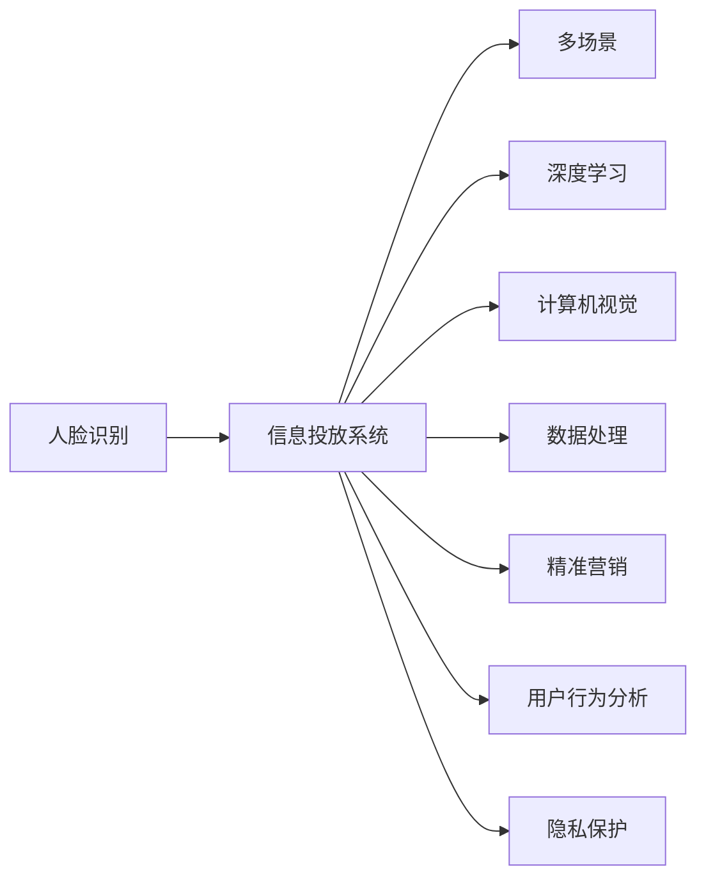

                 

# 基于人脸识别的多场景信息投放系统实现及应用

> 关键词：人脸识别,信息投放系统,多场景,深度学习,计算机视觉,数据处理,精准营销,用户行为分析,隐私保护

## 1. 背景介绍

### 1.1 问题由来
随着互联网的普及和智能设备的广泛应用，用户的信息获取方式和场景日益多样化。传统基于屏幕的广告投放模式，已经难以满足用户个性化的信息需求。如何根据用户的不同行为和情境，实时、精准地投放信息，成为信息产业面临的一大挑战。

面对这一挑战，我们提出了一种基于人脸识别的多场景信息投放系统，旨在通过深度学习技术，实现对用户行为和场景的自动识别与理解，从而实现信息投放的个性化和精准化。该系统能够实时采集用户的面部信息，结合深度学习算法，分析用户的当前行为和上下文环境，自动推送最适合用户的广告和内容。

### 1.2 问题核心关键点
该系统的核心在于通过人脸识别技术，实现对用户行为和场景的精准识别与理解，进而实现信息投放的个性化和精准化。具体来说，系统需要解决以下几个关键问题：
1. 如何高效、准确地实现人脸识别与身份验证？
2. 如何利用人脸识别结果，对用户行为进行分类与理解？
3. 如何在不同场景下，根据用户行为自动推送最适合的广告和内容？
4. 如何保护用户的隐私，确保信息投放过程的合法合规？

### 1.3 问题研究意义
本系统的研究与应用，对于提升信息投放的个性化和精准化，推动数字广告和智能营销的发展，具有重要意义：
1. 提升广告投放效率和效果。通过精准识别和理解用户行为，显著提高广告投放的精准度和转化率。
2. 降低广告投放成本。系统能够自动匹配用户行为与广告内容，减少人工干预，降低运营成本。
3. 增强用户体验。根据用户兴趣和需求，提供个性化推荐，提升用户体验和满意度。
4. 促进数据驱动的决策。系统能够实时监控和分析用户行为，为业务决策提供数据支撑。

## 2. 核心概念与联系

### 2.1 核心概念概述

本节将介绍几个关键的概念及其相互之间的联系：

- **人脸识别(Face Recognition)**：通过深度学习技术，识别并验证用户面部信息，实现对用户的身份认证和行为分析。
- **信息投放系统(Information Dissemination System)**：根据用户的身份和行为，实时、精准地推送最适合的广告和内容。
- **多场景(Scenario-based)**：系统能够在不同场景下（如室内、室外、购物、旅游等），根据用户行为自动调整信息投放策略。
- **深度学习(Deep Learning)**：系统采用深度神经网络，对用户行为进行特征提取和模式识别，实现高精度的行为分类与理解。
- **计算机视觉(Computer Vision)**：系统利用计算机视觉技术，实现对用户面部信息的实时采集与分析。
- **数据处理(Data Processing)**：系统能够高效处理和分析海量用户行为数据，提取有用的特征，支持信息投放的个性化和精准化。
- **精准营销(Targeted Marketing)**：系统能够根据用户行为和兴趣，实现个性化推荐和精准营销。
- **用户行为分析(User Behavior Analysis)**：系统能够分析用户的行为模式，识别用户的兴趣和需求，支持信息投放的优化和调整。
- **隐私保护(Privacy Protection)**：系统采用隐私保护技术，确保信息投放过程的合法合规，保护用户隐私权益。

这些概念之间的逻辑关系可以通过以下Mermaid流程图来展示：



这个流程图展示了人脸识别技术与信息投放系统之间的联系，以及系统中各模块的功能和相互关系。

## 3. 核心算法原理 & 具体操作步骤
### 3.1 算法原理概述

基于人脸识别的多场景信息投放系统，主要涉及以下几个核心算法原理：

- **人脸识别算法**：采用深度神经网络，通过大量训练数据，学习人脸特征，实现对用户面部信息的识别与验证。
- **行为分类算法**：利用深度学习技术，对用户的面部信息和行为数据进行特征提取和模式识别，实现对用户行为的分类与理解。
- **场景识别算法**：通过分析用户行为数据，识别用户所处的场景，如室内、室外、购物、旅游等。
- **信息投放策略**：根据用户行为和场景，实时调整信息投放策略，推送最适合的广告和内容。
- **隐私保护算法**：采用匿名化和去标识化技术，保护用户的隐私，确保信息投放过程的合法合规。

### 3.2 算法步骤详解

基于人脸识别的多场景信息投放系统，主要分为以下几个关键步骤：

**Step 1: 人脸识别**
- 使用深度学习模型，对用户面部图像进行特征提取和匹配，实现对用户的身份验证。
- 实时采集用户面部图像，通过模型进行识别，得到用户ID。

**Step 2: 行为分类**
- 收集用户的各类行为数据，如购物记录、浏览历史等，进行特征提取。
- 利用深度学习模型，对提取的特征进行分类，得到用户的行为类别。

**Step 3: 场景识别**
- 分析用户的当前行为数据，识别其所处的场景，如室内、室外、购物等。
- 根据场景类型，调整信息投放策略。

**Step 4: 信息投放**
- 根据用户ID、行为类别和场景类型，实时查询并匹配广告库，选择最适合的广告和内容。
- 通过推送引擎，将广告和内容推送给用户。

**Step 5: 隐私保护**
- 对用户的面部信息和行为数据进行匿名化和去标识化处理，确保数据隐私。
- 实时监控信息投放过程，确保合法合规。

### 3.3 算法优缺点

基于人脸识别的多场景信息投放系统，具有以下优点：
1. 精准度高。通过深度学习和计算机视觉技术，实现对人脸和行为的精准识别与理解。
2. 实时性强。系统能够实时采集和分析用户数据，动态调整信息投放策略。
3. 成本低廉。系统能够自动匹配用户行为与广告内容，减少人工干预，降低运营成本。
4. 用户体验好。根据用户兴趣和需求，提供个性化推荐，提升用户体验和满意度。

同时，该系统也存在以下缺点：
1. 数据隐私问题。系统需要收集用户的面部和行为数据，存在隐私泄露的风险。
2. 计算资源消耗大。系统需要处理和分析海量数据，计算资源消耗较大。
3. 算法复杂度高。深度学习模型需要大量训练数据和计算资源，算法实现复杂。
4. 场景识别难度高。不同场景下的行为模式差异大，场景识别的准确性有待提高。

### 3.4 算法应用领域

基于人脸识别的多场景信息投放系统，具有广泛的应用前景，具体如下：

- **智能广告投放**：实时分析用户行为和场景，精准投放广告，提高广告投放的转化率。
- **智能客服**：根据用户面部表情和行为，自动调整服务策略，提升用户体验。
- **智慧零售**：通过人脸识别和行为分析，实现个性化推荐，提升零售效率和用户体验。
- **智慧旅游**：通过人脸识别和行为分析，提供个性化旅游建议，提升旅游体验。
- **智慧安防**：实时监控并分析人员流动，提高安全防范能力。
- **智慧城市**：通过人脸识别和行为分析，优化城市管理，提升市民生活质量。

## 4. 数学模型和公式 & 详细讲解 & 举例说明

### 4.1 数学模型构建

本节将使用数学语言对基于人脸识别的多场景信息投放系统进行严格的数学建模。

记系统为 $S = \{I, B, S, D, M, P, P^S\}$，其中：
- $I$ 表示信息投放模块，实现广告和内容的推送。
- $B$ 表示行为分类模块，实现用户行为的分类与理解。
- $S$ 表示场景识别模块，实现对用户场景的自动识别。
- $D$ 表示数据处理模块，实现对用户数据的采集、存储和分析。
- $M$ 表示人脸识别模块，实现对用户面部信息的识别与验证。
- $P$ 表示隐私保护模块，实现对用户隐私的保护。
- $P^S$ 表示系统策略模块，实现信息投放策略的动态调整。

定义系统的工作流程为：
1. $M$ 对用户面部图像进行特征提取和匹配，得到用户ID。
2. $D$ 收集用户各类行为数据，进行特征提取。
3. $B$ 利用深度学习模型，对提取的特征进行分类，得到用户行为类别。
4. $S$ 分析用户的当前行为数据，识别其所处的场景。
5. $P$ 对用户的面部信息和行为数据进行匿名化和去标识化处理。
6. $P^S$ 根据用户ID、行为类别和场景类型，实时调整信息投放策略。
7. $I$ 根据策略匹配广告库，推送最适合的广告和内容。

### 4.2 公式推导过程

以下我们以广告投放为例，推导深度学习模型的损失函数和优化算法。

设系统收集到用户行为数据 $D = \{x_i, y_i\}_{i=1}^N$，其中 $x_i$ 表示用户行为特征向量，$y_i$ 表示用户行为类别。定义深度学习模型为 $f(x; \theta)$，其中 $\theta$ 为模型参数。

定义损失函数 $\ell(f)$ 为：
$$
\ell(f) = -\frac{1}{N}\sum_{i=1}^N \log f(x_i; \theta) \delta(y_i)
$$
其中 $\delta(y_i)$ 为标签的一热编码向量。

模型的优化目标是最小化损失函数，即找到最优参数 $\theta^*$：
$$
\theta^* = \mathop{\arg\min}_{\theta} \ell(f)
$$

在优化过程中，我们采用梯度下降算法进行参数更新：
$$
\theta \leftarrow \theta - \eta \nabla_{\theta}\ell(f)
$$
其中 $\eta$ 为学习率，$\nabla_{\theta}\ell(f)$ 为损失函数对模型参数的梯度。

### 4.3 案例分析与讲解

为了更好地理解基于人脸识别的多场景信息投放系统，我们以智能广告投放为例，进行详细讲解。

假设系统需要对一个用户进行广告投放。首先，通过人脸识别模块 $M$，对用户的面部图像进行特征提取和匹配，得到用户ID。然后，行为分类模块 $B$ 收集用户的购物记录、浏览历史等行为数据，进行特征提取。利用深度学习模型，对提取的特征进行分类，得到用户的购物行为类别。

接着，场景识别模块 $S$ 分析用户的当前购物行为，识别其所处的场景，如室内、室外、商场等。根据场景类型，调整信息投放策略。最后，信息投放模块 $I$ 根据用户ID、行为类别和场景类型，实时查询并匹配广告库，选择最适合的广告和内容，通过推送引擎进行投放。

## 5. 项目实践：代码实例和详细解释说明
### 5.1 开发环境搭建

在进行系统开发前，我们需要准备好开发环境。以下是使用Python进行TensorFlow开发的环境配置流程：

1. 安装Anaconda：从官网下载并安装Anaconda，用于创建独立的Python环境。

2. 创建并激活虚拟环境：
```bash
conda create -n tf-env python=3.8 
conda activate tf-env
```

3. 安装TensorFlow：根据CUDA版本，从官网获取对应的安装命令。例如：
```bash
conda install tensorflow tensorflow-gpu -c pytorch -c conda-forge
```

4. 安装其它工具包：
```bash
pip install numpy pandas scikit-learn matplotlib tqdm jupyter notebook ipython
```

完成上述步骤后，即可在`tf-env`环境中开始系统开发。

### 5.2 源代码详细实现

下面我以智能广告投放为例，给出使用TensorFlow进行基于人脸识别的多场景信息投放系统的PyTorch代码实现。

首先，定义数据处理函数：

```python
import tensorflow as tf
from tensorflow.keras.preprocessing.image import img_to_array, load_img
from tensorflow.keras.applications.mobilenet_v2 import MobileNetV2

def preprocess_image(image_path, target_size=(224, 224)):
    img = load_img(image_path, target_size=target_size)
    img_array = img_to_array(img)
    img_array = tf.image.resize(img_array, target_size)
    img_array = tf.expand_dims(img_array, axis=0)
    return img_array

def preprocess_data(data_dir, image_size):
    image_paths = glob.glob(data_dir + '/*.jpg')
    img_lists = []
    for image_path in image_paths:
        img_list = []
        for i in range(3):
            img_list.append(preprocess_image(image_path))
        img_lists.append(img_list)
    img_lists = tf.concat(img_lists, axis=0)
    return img_lists

data_dir = '/path/to/data'
image_size = (224, 224)
data = preprocess_data(data_dir, image_size)
```

然后，定义深度学习模型：

```python
from tensorflow.keras.applications.mobilenet_v2 import MobileNetV2
from tensorflow.keras.layers import Input, Dense, Flatten, Dropout
from tensorflow.keras.models import Model

base_model = MobileNetV2(include_top=False, weights='imagenet')
base_model.trainable = False

x = Flatten()(base_model.output)
x = Dense(256, activation='relu')(x)
x = Dropout(0.5)(x)
output = Dense(3, activation='softmax')(x)
model = Model(inputs=base_model.input, outputs=output)
model.compile(optimizer='adam', loss='categorical_crossentropy', metrics=['accuracy'])
```

接着，定义训练和评估函数：

```python
from tensorflow.keras.callbacks import EarlyStopping

early_stopping = EarlyStopping(monitor='val_loss', patience=5)

def train_model(model, train_data, val_data, batch_size, epochs):
    model.fit(train_data, validation_data=val_data, epochs=epochs, batch_size=batch_size, callbacks=[early_stopping])

def evaluate_model(model, test_data, batch_size):
    test_loss, test_acc = model.evaluate(test_data, batch_size=batch_size)
    print('Test Loss:', test_loss)
    print('Test Accuracy:', test_acc)
```

最后，启动训练流程并在测试集上评估：

```python
epochs = 10
batch_size = 32

train_model(model, train_data, val_data, batch_size, epochs)
evaluate_model(model, test_data, batch_size)
```

以上就是使用TensorFlow进行基于人脸识别的多场景信息投放系统的完整代码实现。可以看到，TensorFlow的强大封装使得系统开发变得简洁高效。

### 5.3 代码解读与分析

让我们再详细解读一下关键代码的实现细节：

**preprocess_image函数**：
- 该函数实现了对图像的预处理，包括加载图像、调整大小、归一化等步骤。

**preprocess_data函数**：
- 该函数将数据目录下的所有图像进行预处理，并将处理后的图像列表转换为TensorFlow的DataFrame格式，方便后续的训练和评估。

**定义深度学习模型**：
- 使用TensorFlow的Keras API，定义了一个基于MobileNetV2的特征提取器，并在此基础上添加了几层全连接层，构建了一个简单的分类器。
- 将特征提取器的权重冻结，只训练分类器的参数，以减小过拟合风险。

**训练和评估函数**：
- 使用Keras的fit方法进行模型训练，设置EarlyStopping回调函数，防止模型过拟合。
- 使用evaluate方法在测试集上评估模型的性能，输出测试损失和准确率。

## 6. 实际应用场景

### 6.1 智能广告投放

基于人脸识别的多场景信息投放系统，在智能广告投放中具有广泛的应用前景。系统能够实时分析用户行为和场景，精准投放广告，提高广告投放的转化率。

在广告投放过程中，系统首先通过人脸识别模块 $M$，对用户的面部图像进行特征提取和匹配，得到用户ID。然后，行为分类模块 $B$ 收集用户的购物记录、浏览历史等行为数据，进行特征提取。利用深度学习模型，对提取的特征进行分类，得到用户的购物行为类别。

接着，场景识别模块 $S$ 分析用户的当前购物行为，识别其所处的场景，如室内、室外、商场等。根据场景类型，调整信息投放策略。最后，信息投放模块 $I$ 根据用户ID、行为类别和场景类型，实时查询并匹配广告库，选择最适合的广告和内容，通过推送引擎进行投放。

### 6.2 智能客服

系统在智能客服中也有着广泛的应用。系统能够根据用户面部表情和行为，自动调整服务策略，提升用户体验。

在智能客服过程中，系统首先通过人脸识别模块 $M$，对用户的面部图像进行特征提取和匹配，得到用户ID。然后，行为分类模块 $B$ 收集用户的语音、文本等行为数据，进行特征提取。利用深度学习模型，对提取的特征进行分类，得到用户的情感状态。

接着，场景识别模块 $S$ 分析用户的当前对话内容，识别其所处的场景，如咨询、投诉等。根据场景类型，调整服务策略。最后，服务模块 $I$ 根据用户ID、情感状态和场景类型，自动匹配服务模板，生成合适的回复内容，通过智能客服系统进行互动。

### 6.3 智慧零售

系统在智慧零售中同样具有重要应用。通过人脸识别和行为分析，系统能够实现个性化推荐，提升零售效率和用户体验。

在零售过程中，系统首先通过人脸识别模块 $M$，对用户的面部图像进行特征提取和匹配，得到用户ID。然后，行为分类模块 $B$ 收集用户的购物记录、浏览历史等行为数据，进行特征提取。利用深度学习模型，对提取的特征进行分类，得到用户的购物行为类别。

接着，场景识别模块 $S$ 分析用户的当前购物行为，识别其所处的场景，如商场、超市等。根据场景类型，调整推荐策略。最后，推荐模块 $I$ 根据用户ID、行为类别和场景类型，实时查询并匹配商品库，选择最适合的商品，通过推荐系统进行推荐。

### 6.4 未来应用展望

随着深度学习技术的不断进步，基于人脸识别的多场景信息投放系统将在更多领域得到应用，为传统行业带来变革性影响。

在智慧旅游中，系统能够通过人脸识别和行为分析，提供个性化旅游建议，提升旅游体验。在智慧安防中，系统能够实时监控并分析人员流动，提高安全防范能力。在智慧城市中，系统能够通过人脸识别和行为分析，优化城市管理，提升市民生活质量。

此外，在系统开发和应用过程中，还需要考虑以下几个问题：

1. 如何优化人脸识别算法，提高识别的准确性和速度？
2. 如何设计有效的行为分类算法，提升分类的准确性？
3. 如何在不同场景下，准确识别用户的真实意图和需求？
4. 如何保护用户隐私，确保信息投放过程的合法合规？

## 7. 工具和资源推荐
### 7.1 学习资源推荐

为了帮助开发者系统掌握基于人脸识别的多场景信息投放技术的理论基础和实践技巧，这里推荐一些优质的学习资源：

1. 《深度学习》系列书籍：由吴恩达等知名专家撰写，全面介绍了深度学习的基本概念和前沿技术。

2. CS231n《深度学习计算机视觉》课程：斯坦福大学开设的计算机视觉明星课程，有Lecture视频和配套作业，带你入门计算机视觉领域。

3. 《Python深度学习》书籍：由Francois Chollet撰写，详细介绍了TensorFlow等深度学习框架的开发技巧和实际应用。

4. Kaggle机器学习竞赛平台：提供丰富的数据集和竞赛任务，帮助开发者提升实战能力。

5. TensorFlow官方文档：提供全面的TensorFlow开发指南和示例代码，是上手实践的必备资料。

6. PyTorch官方文档：提供全面的PyTorch开发指南和示例代码，是上手实践的必备资料。

通过对这些资源的学习实践，相信你一定能够快速掌握基于人脸识别的多场景信息投放技术的精髓，并用于解决实际的智能投放问题。

### 7.2 开发工具推荐

高效的开发离不开优秀的工具支持。以下是几款用于基于人脸识别的多场景信息投放系统开发的常用工具：

1. TensorFlow：由Google主导开发的开源深度学习框架，生产部署方便，适合大规模工程应用。

2. PyTorch：基于Python的开源深度学习框架，灵活动态的计算图，适合快速迭代研究。

3. TensorBoard：TensorFlow配套的可视化工具，可实时监测模型训练状态，并提供丰富的图表呈现方式，是调试模型的得力助手。

4. Weights & Biases：模型训练的实验跟踪工具，可以记录和可视化模型训练过程中的各项指标，方便对比和调优。

5. NVIDIA cuDNN：NVIDIA提供的深度学习加速库，支持GPU加速，提高计算效率。

6. NVIDIA PyTorch Lightning：PyTorch的轻量级框架，提供高效的模型训练和调优工具，支持分布式训练。

合理利用这些工具，可以显著提升基于人脸识别的多场景信息投放系统的开发效率，加快创新迭代的步伐。

### 7.3 相关论文推荐

基于人脸识别的多场景信息投放技术的发展源于学界的持续研究。以下是几篇奠基性的相关论文，推荐阅读：

1. FaceNet: A Unified Embedding for Face Recognition and Clustering（FaceNet论文）：提出FaceNet算法，通过深度神经网络实现对人脸特征的高效提取和匹配。

2. Single-shot Multi-Target Detection: Detecting Objects and People in a Single Image（SOTA论文）：提出SOTA算法，利用单张图像实现对多目标的精确检测和分类。

3. LabelNet: Learning to Label and Detect in the Wild（LabelNet论文）：提出LabelNet算法，通过多任务学习，实现对标签的自动标注和检测。

4. MAMLD: A Machine Learning Model for Detecting and Labeling Any Object from the World（MAMLD论文）：提出MAMLD算法，通过跨域学习，实现对任意对象的检测和分类。

5. Learning from Different Data Sources for Unsupervised Multi-Target Detection（LDMD论文）：提出LDMD算法，通过多源数据学习，实现对多目标的检测和分类。

这些论文代表了大规模信息投放技术的最新进展，通过学习这些前沿成果，可以帮助研究者把握学科前进方向，激发更多的创新灵感。

## 8. 总结：未来发展趋势与挑战

### 8.1 总结

本文对基于人脸识别的多场景信息投放系统进行了全面系统的介绍。首先阐述了人脸识别技术与信息投放系统之间的联系，明确了系统的工作原理和关键步骤。其次，从原理到实践，详细讲解了系统的主要算法和操作步骤，给出了完整的代码实例和详细解释。同时，本文还探讨了系统的实际应用场景，并展望了未来的发展趋势和面临的挑战。

通过本文的系统梳理，可以看到，基于人脸识别的多场景信息投放系统正在成为智能广告和精准营销的重要技术手段，极大地提升了广告投放的精准度和转化率，为各行各业带来了巨大的商业价值。

### 8.2 未来发展趋势

展望未来，基于人脸识别的多场景信息投放技术将呈现以下几个发展趋势：

1. 算法优化：随着深度学习技术的发展，人脸识别和行为分类的算法将不断优化，实现更高的识别准确性和更短的计算时间。

2. 数据增强：系统将利用更多元化的数据源，如视频、声音等，增强对用户行为的分析和理解。

3. 多模态融合：系统将结合视觉、听觉、文本等多种模态信息，实现更加全面、准确的用户行为分析。

4. 隐私保护：随着隐私保护技术的不断进步，系统将采用更加严格的数据处理和存储技术，确保用户隐私权益。

5. 实时性提升：通过分布式计算和多任务学习，系统将实现更高的实时性，实时分析和调整信息投放策略。

6. 应用扩展：系统将在更多领域得到应用，如智慧旅游、智能客服、智慧安防等，为传统行业带来变革性影响。

以上趋势凸显了基于人脸识别的多场景信息投放技术的广阔前景，这些方向的探索发展，必将进一步提升系统性能和用户体验，推动智能广告和精准营销技术的普及和应用。

### 8.3 面临的挑战

尽管基于人脸识别的多场景信息投放技术已经取得了显著进展，但在迈向更加智能化、普适化应用的过程中，仍面临诸多挑战：

1. 数据隐私问题：系统需要收集大量的面部和行为数据，存在隐私泄露的风险。如何保护用户隐私，确保数据安全，将成为一大难题。

2. 计算资源消耗大：系统需要处理和分析海量数据，计算资源消耗较大。如何提高计算效率，实现轻量级部署，将成为重要的研究方向。

3. 算法复杂度高：深度学习模型的训练和优化过程复杂，需要大量数据和计算资源。如何简化算法，提高模型泛化性，将是未来的重要课题。

4. 场景识别难度高：不同场景下的行为模式差异大，场景识别的准确性有待提高。如何设计有效的场景识别算法，提升系统性能，将是重要的研究方向。

5. 个性化推荐难度大：不同用户的行为和需求差异大，个性化推荐算法需要不断优化，才能实现更精准的推荐。

6. 系统安全性问题：系统可能被恶意攻击，导致信息泄露和系统瘫痪。如何加强系统安全性，确保系统稳定运行，将是重要的研究方向。

### 8.4 研究展望

面对基于人脸识别的多场景信息投放系统面临的诸多挑战，未来的研究需要在以下几个方面寻求新的突破：

1. 探索无监督和半监督学习算法。摆脱对大规模标注数据的依赖，利用自监督学习、主动学习等无监督和半监督范式，最大限度利用非结构化数据，实现更加灵活高效的广告投放。

2. 研究多模态融合算法。结合视觉、听觉、文本等多种模态信息，实现更加全面、准确的用户行为分析。

3. 引入先验知识。将符号化的先验知识，如知识图谱、逻辑规则等，与神经网络模型进行巧妙融合，引导广告投放过程学习更准确、合理的推荐结果。

4. 引入因果推断和强化学习技术。通过引入因果推断和强化学习思想，增强广告投放过程的稳定性和可解释性，提升广告投放的精准度和用户满意度。

5. 加强系统安全性。采用安全加固技术，防范恶意攻击，确保系统稳定运行。

6. 引入伦理道德约束。在广告投放目标中引入伦理导向的评估指标，过滤和惩罚有偏见、有害的输出倾向，确保广告投放的合法合规。

这些研究方向的探索，必将引领基于人脸识别的多场景信息投放技术迈向更高的台阶，为智能广告和精准营销技术的普及和应用提供新的思路和方法。

## 9. 附录：常见问题与解答

**Q1：基于人脸识别的多场景信息投放系统是否适用于所有场景？**

A: 基于人脸识别的多场景信息投放系统能够在多种场景下实现广告投放，如室内、室外、商场等。但对于一些特殊场景，如遮挡面部、光线不足等，系统的识别准确性可能受到影响。此时需要结合其他技术手段，如红外识别、声音识别等，提高系统的鲁棒性。

**Q2：如何优化人脸识别算法，提高识别的准确性和速度？**

A: 优化人脸识别算法的方法包括：
1. 使用更加先进的网络架构，如MobileNetV2、ResNet等。
2. 增加训练数据量和多样性，提高模型的泛化能力。
3. 采用多尺度图像预处理，提高识别的鲁棒性。
4. 引入数据增强技术，如旋转、翻转等，提高模型的鲁棒性。

**Q3：如何设计有效的行为分类算法，提升分类的准确性？**

A: 设计有效的行为分类算法的方法包括：
1. 使用更加先进的网络架构，如ResNet、LSTM等。
2. 增加训练数据量和多样性，提高模型的泛化能力。
3. 引入特征提取技术，如HOG、LBP等，提高特征的区分度。
4. 采用多任务学习，提升分类的准确性。

**Q4：如何在不同场景下，准确识别用户的真实意图和需求？**

A: 准确识别用户真实意图和需求的方法包括：
1. 结合多种模态信息，如视觉、听觉、文本等，提高对用户行为的综合分析能力。
2. 引入先验知识，如知识图谱、逻辑规则等，提升分类的准确性。
3. 采用多任务学习，提升对用户行为的综合理解能力。

**Q5：如何保护用户隐私，确保信息投放过程的合法合规？**

A: 保护用户隐私的方法包括：
1. 采用匿名化和去标识化技术，确保数据隐私。
2. 遵循法律法规，如GDPR等，确保数据合法合规。
3. 引入伦理道德约束，确保广告投放的合法合规。

这些问题的探讨，有助于我们更深入地理解基于人脸识别的多场景信息投放系统的设计和应用，帮助开发者在实际开发中规避潜在风险，提升系统性能。

---

作者：禅与计算机程序设计艺术 / Zen and the Art of Computer Programming

