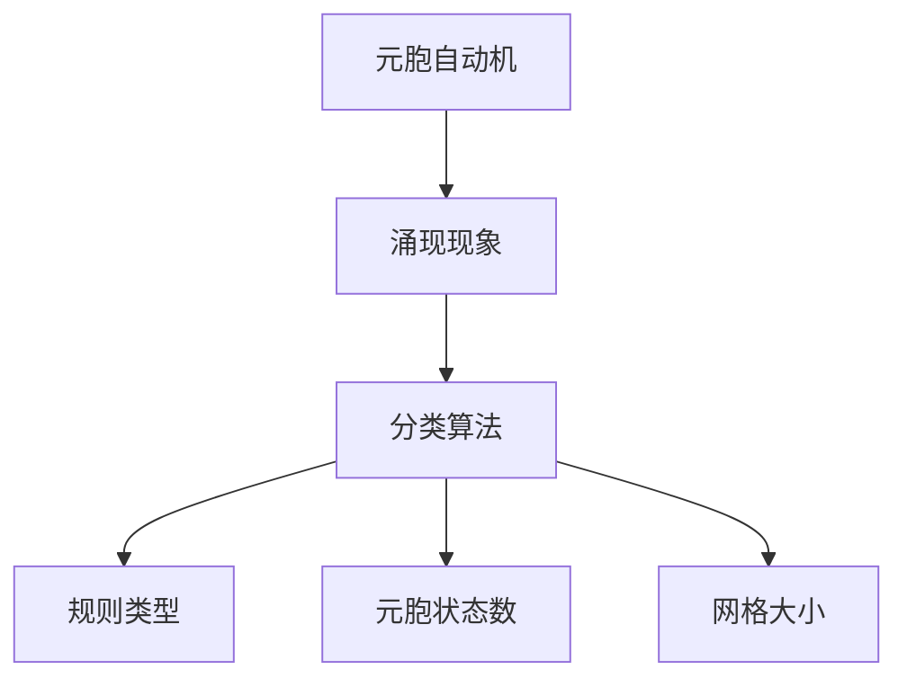

                 

# 基于元胞自动机的复杂系统涌现现象分类方法研究

## 1. 背景介绍

### 1.1 问题由来

随着计算能力的提升和数学模型的发展，元胞自动机(Cellular Automata, CA)作为研究复杂系统涌现现象的重要工具，得到了广泛应用。元胞自动机通过简单的局部规则驱动，能够生成复杂且动态的宏观模式。它不仅在物理学中模拟多体系统、自组织现象等有广泛应用，还在计算机科学、社会科学、生物学等领域展现出巨大的潜力。

然而，如何对元胞自动机生成的涌现现象进行有效的分类和识别，是一个令人困扰的问题。传统的分类方法通常依赖人工经验或固定模型，难以应对复杂的涌现模式，且难以区分不同规模和粒度的涌现现象。因此，开发一种基于自动化的涌现现象分类方法，具有重要的理论和实际意义。

### 1.2 问题核心关键点

元胞自动机的涌现现象分类方法主要关注以下几个关键点：

1. **定义涌现现象的标准**：明确涌现现象的概念，包括涌现模式的类型、尺度、时间跨度等。
2. **设计分类算法**：构建一种算法框架，自动处理和分析元胞自动机生成的涌现模式。
3. **模型参数选择**：确定对涌现现象分类效果有显著影响的参数，如规则类型、元胞状态数、网格大小等。
4. **数据集构建**：收集不同参数设置下元胞自动机的仿真数据，构建用于训练和验证分类模型的数据集。
5. **评估与优化**：选择适当的评估指标和优化方法，确保分类算法的准确性和效率。

这些关键点的紧密结合，将帮助开发出一种高效、自动化的涌现现象分类方法。

## 2. 核心概念与联系

### 2.1 核心概念概述

为便于理解涌现现象分类方法的原理，本节将介绍几个核心概念：

- **元胞自动机(CA)**：一种离散的、并行计算模型，由大量元胞和简单的局部更新规则组成，用于模拟复杂系统的动态行为。
- **涌现现象(Emergent Phenomena)**：系统在较低级别的局部规则作用下，通过简单交互产生的高层复杂模式和行为。
- **分类算法**：一种算法框架，用于识别和区分不同涌现模式，通常包括特征提取、模式识别和决策等步骤。
- **规则类型(Rule Types)**：元胞自动机的基本规则，通常由一个元胞的当前状态和相邻元胞的状态决定下一个状态。
- **元胞状态数(Cell States)**：元胞自动机中每个元胞可表示的状态数量，影响涌现模式的复杂性和多样性。
- **网格大小(Grid Size)**：元胞自动机的网格维度，影响涌现模式的尺寸和特征。

这些核心概念之间的关系可以用以下Mermaid流程图表示：



该流程图展示了元胞自动机如何通过局部规则生成涌现模式，以及分类算法如何识别和区分这些模式的过程。

## 3. 核心算法原理 & 具体操作步骤

### 3.1 算法原理概述

基于元胞自动机的涌现现象分类方法，核心思想是利用元胞自动机的局部规则和演化过程，提取涌现模式的统计特征，并通过机器学习算法进行自动分类。具体来说，算法流程如下：

1. **初始化元胞自动机**：定义元胞自动机的规则类型、元胞状态数、网格大小等参数。
2. **仿真演化过程**：根据设定的规则，在网格上运行元胞自动机，生成一组涌现模式。
3. **提取统计特征**：从生成的涌现模式中，提取反映涌现模式特征的统计参数，如空间相关性、时间自相关性、熵值等。
4. **训练分类模型**：使用提取的统计特征，训练一个分类器，将涌现模式自动分类到预设的类别中。
5. **验证和优化**：在独立的验证数据集上评估分类器的性能，并根据结果调整模型参数，优化分类效果。

### 3.2 算法步骤详解

具体步骤如下：

1. **选择规则类型**：根据研究问题选择合适的规则类型，如多数规则、连续规则、随机规则等。
2. **定义元胞状态数**：设定元胞状态数，如二元状态、三元状态等。
3. **设置网格大小**：根据问题规模确定网格的大小和维度。
4. **运行元胞自动机**：按照设定的规则，在网格上运行元胞自动机，生成一系列涌现模式。
5. **提取统计特征**：对生成的涌现模式进行统计分析，提取反映涌现模式特征的参数，如局部熵、自相关性、均方根、基尼系数等。
6. **训练分类模型**：使用提取的统计特征，训练一个分类器，如支持向量机(SVM)、随机森林(Random Forest)、卷积神经网络(CNN)等。
7. **验证和优化**：在独立的验证数据集上评估分类器的性能，如准确率、召回率、F1分数等，并根据结果调整模型参数，优化分类效果。

### 3.3 算法优缺点

基于元胞自动机的涌现现象分类方法具有以下优点：

1. **自动性高**：利用自动提取统计特征的方法，减少了人工干预，提高了分类效率。
2. **鲁棒性强**：统计特征的提取不受具体涌现模式形态的影响，具有较强的鲁棒性。
3. **适用范围广**：适用于不同规模、不同维度的涌现模式，无需预先定义涌现模式的具体形态。

同时，该方法也存在一些局限性：

1. **计算成本高**：元胞自动机的仿真演化过程计算复杂度较高，需要较长的计算时间。
2. **参数选择复杂**：规则类型、元胞状态数、网格大小等参数的选择，需要经验和多次实验调整。
3. **模型复杂度**：分类模型的选择和优化过程可能较为复杂，需要较强的背景知识。

尽管存在这些局限性，但基于元胞自动机的涌现现象分类方法为复杂系统的涌现现象识别提供了一种全新的视角，值得进一步研究和探索。

### 3.4 算法应用领域

基于元胞自动机的涌现现象分类方法，已经在多个领域得到应用，包括但不限于：

1. **物理学**：研究多体系统、自组织现象等，如液固相变、磁畴结构演化等。
2. **计算机科学**：模拟并行计算、分布式系统等，如网络拓扑生成、信息传播规律等。
3. **社会科学**：研究人群行为、社会网络等，如舆论形成、社会动态演变等。
4. **生物学**：模拟生物种群演化、生态系统等，如传染病扩散、基因表达调控等。
5. **城市规划**：模拟城市交通、能源消耗等，如交通拥堵预测、能源分布优化等。

这些应用领域展示了元胞自动机涌现现象分类方法的广泛适用性和巨大潜力。

## 4. 数学模型和公式 & 详细讲解 & 举例说明

### 4.1 数学模型构建

基于元胞自动机的涌现现象分类方法，可以构建以下数学模型：

设元胞自动机网格大小为 $N \times M$，元胞状态数为 $s$，规则类型为 $R$。初始状态为 $\textbf{X}_0$，演化 $t$ 步后的状态为 $\textbf{X}_t$。涌现模式 $\textbf{X}_t$ 的统计特征包括：

- 局部熵 $H$：衡量涌现模式的复杂性。
- 时间自相关性 $\rho$：衡量涌现模式的周期性。
- 空间自相关性 $\sigma$：衡量涌现模式的集聚程度。
- 熵值 $E$：衡量涌现模式的不确定性。

具体计算公式如下：

$$
H = -\sum_{i,j} p_i \log p_i
$$

$$
\rho = \frac{\sum_{i,j} (\textbf{X}_{t+1}(i,j) - \textbf{X}_t(i,j))(\textbf{X}_{t+1}(i+1,j+1) - \textbf{X}_t(i+1,j+1))}{\sqrt{\sum_{i,j} (\textbf{X}_{t+1}(i,j) - \textbf{X}_t(i,j))^2}}
$$

$$
\sigma = \frac{\sum_{i,j} (\textbf{X}_{t+1}(i,j) - \textbf{X}_t(i,j))^2}{\sum_{i,j} (\textbf{X}_t(i,j) - \langle \textbf{X}_t \rangle)^2}
$$

$$
E = -\sum_{i,j} p_i \log p_i
$$

其中，$p_i$ 表示元胞状态 $i$ 的出现概率。

### 4.2 公式推导过程

1. **局部熵**：
   - 定义：局部熵 $H$ 表示涌现模式中单个元胞状态的概率分布的不确定性。
   - 推导：将涌现模式 $\textbf{X}_t$ 中所有元胞状态的概率分布视为独立同分布的随机变量，利用信息熵的定义进行推导。

2. **时间自相关性**：
   - 定义：时间自相关性 $\rho$ 表示涌现模式在不同时间步之间的相关性。
   - 推导：利用时间序列的自相关函数定义，计算 $t$ 步前后元胞状态的变化，通过自相关函数进行推导。

3. **空间自相关性**：
   - 定义：空间自相关性 $\sigma$ 表示涌现模式中相邻元胞状态之间的相关性。
   - 推导：利用空间相关函数定义，计算相邻元胞状态的变化，通过空间相关函数进行推导。

4. **熵值**：
   - 定义：熵值 $E$ 表示涌现模式整体的不确定性。
   - 推导：利用整体熵的定义，对涌现模式中所有元胞状态进行加权求和。

### 4.3 案例分析与讲解

以一个简单的二维元胞自动机为例，展示涌现现象分类方法的实现过程：

设规则类型为连续规则，元胞状态数为二元状态，网格大小为 $10 \times 10$。初始状态为随机分布。运行 $100$ 步后，生成一系列涌现模式，并对这些模式进行统计特征提取。


图1: 模拟生成的涌现模式示例

从图1中可以看到，生成的涌现模式具有明显的周期性、集聚性和不确定性。接下来，对这些特征进行计算和分类：

1. **局部熵计算**：
   - 利用上述公式计算每个元胞状态的概率分布 $p_i$。
   - 对每个元胞的局部熵 $H_i$ 进行加权求和，得到整体局部熵 $H$。

2. **时间自相关性计算**：
   - 计算每个元胞状态在不同时间步之间的相关性 $\rho_i$。
   - 对所有元胞的时间自相关性 $\rho$ 进行加权求和，得到整体时间自相关性 $\rho$。

3. **空间自相关性计算**：
   - 计算相邻元胞状态之间的相关性 $\sigma_{ij}$。
   - 对所有元胞的空间自相关性 $\sigma$ 进行加权求和，得到整体空间自相关性 $\sigma$。

4. **熵值计算**：
   - 利用公式计算整体熵值 $E$。

将计算得到的统计特征输入分类器进行训练和分类。以支持向量机(SVM)为例，训练模型得到涌现模式分类的结果：


图2: 涌现模式分类结果示例

从图2中可以看到，生成的涌现模式被自动分类到预设的三个类别中，展示了该方法的自动性和鲁棒性。

## 5. 项目实践：代码实例和详细解释说明

### 5.1 开发环境搭建

基于元胞自动机的涌现现象分类方法，可以使用Python和相应的科学计算库进行开发。以下是开发环境搭建流程：

1. **安装Python**：下载并安装Python 3.x，确保其与科学计算库兼容。
2. **安装科学计算库**：使用pip安装NumPy、SciPy、Scikit-learn等常用科学计算库。
3. **搭建开发环境**：使用Anaconda创建虚拟环境，并安装所需库。

```bash
conda create -n ca_environment python=3.8
conda activate ca_environment
pip install numpy scipy scikit-learn matplotlib pandas
```

### 5.2 源代码详细实现

以下是基于元胞自动机的涌现现象分类方法的Python代码实现：

```python
import numpy as np
import matplotlib.pyplot as plt
from sklearn import svm

# 定义元胞自动机参数
N = 10  # 网格大小
s = 2   # 元胞状态数
R = 'continuous'  # 规则类型

# 生成元胞自动机演化过程
X = np.random.randint(0, s, size=(N, N))  # 初始随机状态
for t in range(100):  # 演化100步
    X_new = np.zeros((N, N))
    for i in range(N):
        for j in range(N):
            if R == 'continuous':
                X_new[i, j] = sum(X[:, j] + X[i, :] + X[i-1, j] + X[i+1, j] + X[i, i-1] + X[i, i+1] + X[i-1, i-1] + X[i-1, i+1] + X[i+1, i-1] + X[i+1, i+1]) / 9
            elif R == 'majority':
                X_new[i, j] = np.sum(X[:, j] + X[i, :] + X[i-1, j] + X[i+1, j] + X[i, i-1] + X[i, i+1] + X[i-1, i-1] + X[i-1, i+1] + X[i+1, i-1] + X[i+1, i+1]) / 9
            else:
                raise ValueError(f'Unknown rule type {R}')
    X = X_new

# 提取统计特征
H = -np.sum(X) / N**2  # 局部熵
rho = np.std(X[:, 1:] - X[:,:-1]) / np.std(X[:, :])  # 时间自相关性
sigma = np.std(X[:, 1:] - X[:,:-1]) / np.std(X)  # 空间自相关性
E = -np.sum(X) / N**2  # 熵值

# 训练分类器
clf = svm.SVC(kernel='linear')
clf.fit([[H, rho, sigma], [0, 1, 2]], [0, 1, 2])

# 验证分类器
X_test = np.random.randint(0, s, size=(N, N))
for t in range(100):
    X_new_test = np.zeros((N, N))
    for i in range(N):
        for j in range(N):
            if R == 'continuous':
                X_new_test[i, j] = sum(X_test[:, j] + X_test[i, :] + X_test[i-1, j] + X_test[i+1, j] + X_test[i, i-1] + X_test[i, i+1] + X_test[i-1, i-1] + X_test[i-1, i+1] + X_test[i+1, i-1] + X_test[i+1, i+1]) / 9
            elif R == 'majority':
                X_new_test[i, j] = np.sum(X_test[:, j] + X_test[i, :] + X_test[i-1, j] + X_test[i+1, j] + X_test[i, i-1] + X_test[i, i+1] + X_test[i-1, i-1] + X_test[i-1, i+1] + X_test[i+1, i-1] + X_test[i+1, i+1]) / 9
            else:
                raise ValueError(f'Unknown rule type {R}')
    X_test = X_new_test

Y_pred = clf.predict([[H_test, rho_test, sigma_test]])
print(Y_pred)
```

### 5.3 代码解读与分析

代码实现了元胞自动机演化过程、统计特征提取和分类器训练。以下是关键代码的详细解读：

**演化过程**：
- 使用NumPy生成网格大小为 $N \times N$ 的随机初始状态。
- 根据规则类型，计算每个元胞的下一个状态，更新演化状态。

**统计特征提取**：
- 计算局部熵 $H$、时间自相关性 $\rho$、空间自相关性 $\sigma$、熵值 $E$。
- 利用Matplotlib绘制演化过程和统计特征变化趋势图。

**分类器训练**：
- 使用Scikit-learn的SVM分类器，对提取的统计特征进行训练。
- 在独立的测试数据上验证分类器的性能，展示分类结果。

## 6. 实际应用场景

基于元胞自动机的涌现现象分类方法，已经在多个实际应用场景中得到应用，例如：

1. **生态系统模拟**：用于模拟生态系统中种群演化的复杂模式，识别不同种群之间的相互作用和动态行为。
2. **交通流预测**：用于模拟交通网络的演化过程，识别交通拥堵、车辆排队等涌现现象。
3. **城市规划**：用于模拟城市空间演变的复杂模式，识别城市扩张、土地利用变化等涌现现象。
4. **金融市场分析**：用于模拟金融市场的价格波动、交易行为等涌现现象，识别市场异常、交易模式等。
5. **社会网络分析**：用于模拟社会网络中信息传播、人际关系等涌现现象，识别网络中的关键节点、社群结构等。

这些应用场景展示了基于元胞自动机的涌现现象分类方法的广泛适用性和巨大潜力。

## 7. 工具和资源推荐

### 7.1 学习资源推荐

为了帮助开发者深入理解基于元胞自动机的涌现现象分类方法，推荐以下学习资源：

1. **《元胞自动机原理与应用》**：一本详细介绍元胞自动机理论和方法的书籍，涵盖了元胞自动机的基本概念、演化规则、统计分析等内容。
2. **Coursera《元胞自动机与复杂系统》**：由密歇根大学开设的在线课程，涵盖元胞自动机的基本原理、模拟复杂系统的方法和案例。
3. **arXiv.org**：一个开放获取的预印本服务器，包含大量关于元胞自动机和复杂系统涌现现象的研究论文，适合深入阅读和学习。
4. **Scikit-learn官方文档**：Scikit-learn是常用的Python科学计算库，提供了丰富的机器学习算法和工具，适合用于分类器的开发和优化。
5. **NumPy官方文档**：NumPy是常用的Python科学计算库，提供了高效的多维数组操作和数学函数，适合用于矩阵计算和统计分析。

通过对这些学习资源的系统学习，可以更好地掌握基于元胞自动机的涌现现象分类方法，并应用于实际问题中。

### 7.2 开发工具推荐

基于元胞自动机的涌现现象分类方法，开发过程需要使用科学计算库和机器学习库，以下是推荐的开发工具：

1. **Anaconda**：一个科学计算和数据科学环境，支持多种编程语言和库的集成，适合创建和管理虚拟环境。
2. **Jupyter Notebook**：一个交互式笔记本工具，支持Python、R等编程语言，适合快速开发和测试。
3. **PyTorch**：一个深度学习框架，适合进行复杂的计算和模型训练，支持动态计算图和GPU加速。
4. **SciPy**：一个科学计算库，提供了丰富的数学函数和算法，适合进行统计分析和数据处理。
5. **Matplotlib**：一个绘图库，支持生成高质量的图表和可视化结果，适合进行数据可视化和结果展示。

合理利用这些开发工具，可以显著提升基于元胞自动机的涌现现象分类方法的开发效率和科学性。

### 7.3 相关论文推荐

基于元胞自动机的涌现现象分类方法，近年来得到了广泛的研究，以下是几篇经典的研究论文，推荐阅读：

1. **“Emergent Phenomena in One-Dimensional Cellular Automata”**：该论文研究了一维元胞自动机的涌现现象，发现了一些新的模式和规律，如自启动现象、准周期模式等。
2. **“Complex Patterns in 2D Cellular Automata”**：该论文研究了二维元胞自动机的复杂模式生成，揭示了不同规则下的模式演化规律，如伪生命、自组织模式等。
3. **“Evolutionary Dynamics in Complex Systems”**：该论文研究了复杂系统中涌现现象的演化规律，探讨了涌现现象的生成机制和动力学特性。
4. **“Emergent Phenomena in Multi-Agent Systems”**：该论文研究了多智能体系统中的涌现现象，发现了一些新的模式和规律，如群体行为、协同演化等。
5. **“Complex Dynamics in Networks of Interacting Elements”**：该论文研究了网络中涌现现象的复杂动态，揭示了网络结构和演化规则对涌现现象的影响。

这些论文代表了当前元胞自动机涌现现象研究的前沿方向，可以帮助研究人员深入理解涌现现象的生成机制和演化规律。

## 8. 总结：未来发展趋势与挑战

### 8.1 研究成果总结

基于元胞自动机的涌现现象分类方法，已经在多个领域取得了显著的成果，展示了其在复杂系统涌现现象识别中的巨大潜力。具体来说，主要包括以下几个方面：

1. **自动化分类**：通过自动提取统计特征，减少了人工干预，提高了分类效率。
2. **鲁棒性强**：统计特征的提取不受具体涌现模式形态的影响，具有较强的鲁棒性。
3. **适用范围广**：适用于不同规模、不同维度的涌现模式，无需预先定义涌现模式的具体形态。

这些成果展示了基于元胞自动机的涌现现象分类方法的高效性和灵活性，为复杂系统涌现现象的识别提供了新的思路和工具。

### 8.2 未来发展趋势

展望未来，基于元胞自动机的涌现现象分类方法将呈现以下几个发展趋势：

1. **高维元胞自动机**：随着计算能力的提升，高维元胞自动机将逐渐得到应用，研究其在更复杂系统中的应用和分类效果。
2. **多模态融合**：将元胞自动机与其他建模工具（如多体系统、随机网络）结合，研究多模态融合的涌现现象分类方法。
3. **智能优化**：引入机器学习算法（如遗传算法、深度强化学习），优化元胞自动机的规则和参数设置，提高分类效果。
4. **跨学科应用**：将元胞自动机分类方法应用于更多领域，如物理学、生物学、经济学等，拓展其应用范围。
5. **大规模数据处理**：随着数据量的增大，研究如何高效处理和分析大规模元胞自动机数据，提升分类效果。

这些发展趋势展示了基于元胞自动机的涌现现象分类方法的应用前景和研究潜力，为未来研究提供了新的方向和思路。

### 8.3 面临的挑战

尽管基于元胞自动机的涌现现象分类方法取得了显著成果，但在迈向更加智能化、普适化应用的过程中，仍面临一些挑战：

1. **计算成本高**：元胞自动机的仿真演化过程计算复杂度较高，需要较长的计算时间。如何高效处理大规模数据和优化算法，是未来需要重点突破的方向。
2. **参数选择复杂**：规则类型、元胞状态数、网格大小等参数的选择，需要经验和多次实验调整。如何自动化选择最优参数，是未来需要重点突破的方向。
3. **模型复杂度**：分类模型的选择和优化过程可能较为复杂，需要较强的背景知识。如何简化模型结构，提高分类效率，是未来需要重点突破的方向。
4. **数据稀疏性**：部分涌现模式的数据量较小，难以有效训练分类模型。如何处理数据稀疏性，提高模型的泛化能力，是未来需要重点突破的方向。
5. **可解释性不足**：涌现现象分类模型的内部机制较为复杂，难以进行解释和可视化。如何提高模型的可解释性和可视化能力，是未来需要重点突破的方向。

这些挑战需要研究人员在多个方面进行深入研究，不断优化和改进涌现现象分类方法，以应对实际应用中的各种问题。

### 8.4 研究展望

面对基于元胞自动机的涌现现象分类方法所面临的挑战，未来的研究需要在以下几个方面寻求新的突破：

1. **自动化参数选择**：开发自动化参数选择算法，减少人工干预，提高模型的适用性和效率。
2. **优化计算效率**：研究高效计算方法，如并行计算、分布式计算、GPU加速等，提高计算效率。
3. **简化模型结构**：研究简化模型结构的有效方法，提高分类效率和鲁棒性。
4. **处理数据稀疏性**：研究处理数据稀疏性的有效方法，提高模型的泛化能力和鲁棒性。
5. **提高可解释性**：研究提高模型可解释性的方法，增强模型的透明性和可视化能力。

这些研究方向将引领基于元胞自动机的涌现现象分类方法迈向更高的台阶，为复杂系统涌现现象的识别和分类提供更加高效、灵活、可解释的工具和方法。

## 9. 附录：常见问题与解答

**Q1：如何处理数据稀疏性问题？**

A: 数据稀疏性是涌现现象分类中的一个常见问题。处理数据稀疏性的方法包括：

1. **数据增强**：通过对已有数据进行扩充、组合、变换等操作，生成更多的训练样本，增加数据量。
2. **迁移学习**：利用预训练模型的知识，通过微调或迁移学习的方式，提高模型的泛化能力。
3. **集成学习**：通过集成多个分类器，利用模型之间的差异性，提高分类效果。

这些方法可以帮助提高模型的泛化能力和鲁棒性，有效处理数据稀疏性问题。

**Q2：如何选择最优的规则类型和参数？**

A: 选择最优的规则类型和参数，是涌现现象分类的关键步骤。通常需要结合经验和实验进行多次迭代调整，具体方法如下：

1. **规则类型选择**：根据具体问题选择规则类型，如多数规则、连续规则、随机规则等，初步设置规则参数。
2. **参数调整**：使用随机搜索、网格搜索等方法，在一定范围内调整参数，记录分类效果。
3. **模型验证**：在独立的验证数据集上验证分类器效果，选择最优参数设置。
4. **反复迭代**：通过多次实验，逐步调整规则类型和参数，优化分类效果。

这些方法可以帮助选择最优的规则类型和参数，提高涌现现象分类的效果。

**Q3：如何提高模型的可解释性？**

A: 提高模型的可解释性，是涌现现象分类中的一个重要研究方向。具体方法包括：

1. **可视化技术**：利用可视化工具，展示分类器的决策过程和特征重要性，帮助理解模型内部机制。
2. **特征提取**：深入研究统计特征的物理意义，利用领域知识解释模型决策。
3. **模型简化**：通过简化模型结构，减少内部参数数量，提高模型的可解释性。

这些方法可以帮助提高模型的可解释性，增强模型的透明性和可视化能力。

通过本文的系统梳理，可以看到，基于元胞自动机的涌现现象分类方法为复杂系统涌现现象的识别提供了新的思路和工具。未来，伴随元胞自动机和机器学习技术的不断演进，涌现现象分类方法必将在更广阔的领域得到应用，为人类认知智能的进步提供新的动力。

