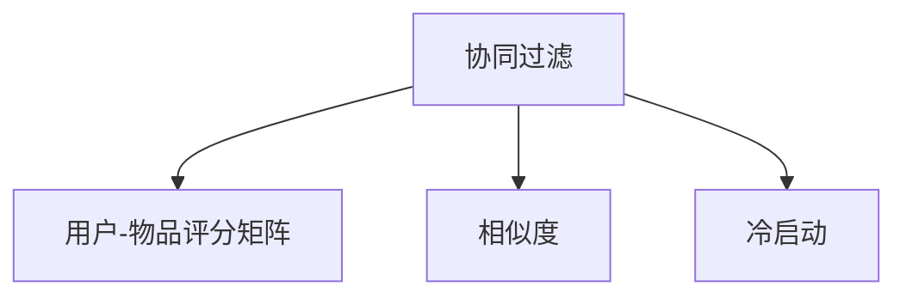

                 

## 1. 背景介绍

### 1.1 问题由来
在互联网的海洋中，信息如海啸般涌来，用户需要从中筛选出对自己有价值的优质内容，而电影的推荐系统正是帮助用户快速发现感兴趣电影的利器。随着在线流媒体平台的兴起，如何精准地为用户推荐符合其口味的电影，成为平台提高用户满意度和留存率的关键因素。

与此同时，由于视频内容的海量增长，传统的基于人工筛选、特征提取和手工调参的电影推荐方法，效率低下、成本高昂且容易产生偏差。基于协同过滤的电影推荐系统因其高效、准确的特点，在各大流媒体平台得到广泛应用。

### 1.2 问题核心关键点
协同过滤是推荐系统领域最常用的方法之一，主要分为基于用户的协同过滤和基于物品的协同过滤两种策略。基于用户的协同过滤算法利用用户之间的相似度，为用户推荐其他用户喜欢的物品。基于物品的协同过滤算法则根据物品的相似度，为物品推荐其他物品被用户喜欢的用户。

协同过滤推荐系统之所以能获得广泛应用，是因为其高效性：
- 不需要考虑物品的特征信息。只需要通过用户-物品评分矩阵，就可以快速地计算出相似度和推荐结果。
- 对新物品的处理能力强。新物品加入系统后，不需要重新训练模型，直接就可以参与推荐。
- 对多样性的支持。协同过滤算法可以自动探索用户的多样性需求，从而推荐出丰富多样的内容。

然而，协同过滤推荐系统也存在一些局限性：
- 数据稀疏性问题。用户对大部分物品未进行评分，导致矩阵中存在大量缺失值，影响推荐效果。
- 难以处理新用户。新用户往往没有历史评分，协同过滤算法无法推荐。
- 冷启动问题。新物品刚上线时，没有足够的用户评分信息，难以被推荐。

针对这些问题，本文将详细介绍基于协同过滤的电影推荐系统的设计与实现，并提出一些优化策略，提升系统的性能和鲁棒性。

### 1.3 问题研究意义
设计一个高效、精确且稳定的电影推荐系统，对于流媒体平台有着重要的意义：
- 提高用户体验。推荐系统能够为用户快速找到感兴趣的电影，提升用户满意度和留存率。
- 增加平台收益。通过推荐精准优质的电影，提高用户付费意愿，增加平台的广告收入。
- 提升数据利用率。推荐系统可以挖掘并利用用户的海量评分数据，提升用户与平台的互动频率，增加平台的用户活跃度。
- 减少人工干预。推荐系统自动化筛选和推荐，大幅降低人工干预和成本。

## 2. 核心概念与联系

### 2.1 核心概念概述

为更好地理解基于协同过滤的电影推荐系统，我们首先介绍几个关键概念：

- 协同过滤(Collaborative Filtering)：通过用户之间的相似度或物品之间的相似度，为用户推荐其他用户喜欢的物品，或为物品推荐其他物品被用户喜欢的用户。协同过滤是推荐系统中最常见的方法之一。
- 用户-物品评分矩阵(User-Item Rating Matrix)：一个二维矩阵，记录了所有用户对所有物品的评分信息。是协同过滤算法的核心输入。
- 相似度(Similarity)：通过计算用户之间或物品之间的相似度，找到与目标用户或物品最相似的群体，从而进行推荐。相似度的计算方式可以是余弦相似度、皮尔逊相关系数等。
- 冷启动(Cold Start)：指推荐系统对新用户或新物品，无法提供推荐结果的情况。协同过滤算法对冷启动问题较为敏感。

这些概念之间的逻辑关系可以通过以下Mermaid流程图来展示：



这个流程图展示了大语言模型的核心概念及其之间的关系：

1. 协同过滤算法需要用户-物品评分矩阵作为输入。
2. 相似度的计算是协同过滤算法的核心步骤。
3. 冷启动问题影响协同过滤算法的推荐效果。

## 3. 核心算法原理 & 具体操作步骤
### 3.1 算法原理概述

基于协同过滤的电影推荐系统利用用户之间的相似度或物品之间的相似度，为用户推荐其他用户喜欢的电影。其核心原理如下：

1. 构建用户-物品评分矩阵。该矩阵是一个二维数组，记录了所有用户对所有电影的评分信息。矩阵中缺失的值表示用户未对物品评分。

2. 计算相似度。利用评分矩阵，计算用户之间的相似度或物品之间的相似度。根据相似度的大小，找到与目标用户或物品最相似的群体。

3. 选择推荐物品。基于相似度，为每个用户选择其最感兴趣的物品。可以使用最近邻算法、基于SVD的分解等方法，进行选择。

4. 反馈和调整。根据用户对推荐结果的反馈，更新评分矩阵和相似度计算方法，提升推荐效果。

### 3.2 算法步骤详解

以下是基于协同过滤的电影推荐系统的详细步骤：

#### 步骤1: 数据预处理
用户-物品评分矩阵是一个稀疏矩阵，需要进行预处理。常用的预处理方式包括：
- 数据清洗：去除缺失值、异常值和重复数据。
- 数据归一化：将评分矩阵归一化到0到1之间，避免评分数据的离散性。

#### 步骤2: 相似度计算
相似度计算是协同过滤算法的核心。常用的相似度计算方式包括：
- 余弦相似度：计算两个向量之间的余弦值，表示其相似程度。
- 皮尔逊相关系数：计算两个向量之间的相关系数，表示其线性相关程度。
- 余弦距离：计算两个向量之间的余弦距离，表示其相似程度。

#### 步骤3: 最近邻算法
最近邻算法是协同过滤算法的常用方法之一，其核心思想是：找到与目标用户或物品最相似的若干用户或物品，然后为该用户或物品推荐相似用户或物品的评分。

具体实现步骤如下：
1. 计算目标用户或物品的相似度。
2. 选择与目标用户或物品最相似的若干用户或物品。
3. 计算这些相似用户或物品的评分平均值或加权平均值，作为推荐结果。

#### 步骤4: 推荐结果生成
根据最近邻算法，生成推荐结果。推荐结果可以是一个列表，包含用户可能感兴趣的若干电影。

#### 步骤5: 反馈与调整
收集用户对推荐结果的反馈，并根据反馈调整评分矩阵和相似度计算方法，以提升推荐效果。

### 3.3 算法优缺点
协同过滤推荐系统的主要优点包括：
- 高效性：不需要考虑物品的特征信息，计算速度快。
- 无需重新训练：新物品上线后，不需要重新训练模型。
- 可扩展性好：系统可快速扩展到大规模用户和物品。

其主要缺点包括：
- 数据稀疏性：用户对大部分物品未进行评分，导致矩阵中存在大量缺失值，影响推荐效果。
- 难以处理新用户：新用户往往没有历史评分，协同过滤算法无法推荐。
- 冷启动问题：新物品刚上线时，没有足够的用户评分信息，难以被推荐。

### 3.4 算法应用领域

协同过滤推荐系统被广泛应用于电影推荐、商品推荐、音乐推荐等领域。以下是一些具体应用场景：

- 视频推荐：如Netflix、YouTube等流媒体平台。为用户推荐可能感兴趣的视频内容。
- 商品推荐：如Amazon、淘宝等电商平台。为用户推荐可能感兴趣的商品。
- 音乐推荐：如Spotify、网易云音乐等音乐平台。为用户推荐可能喜欢的音乐。

协同过滤推荐系统在诸多领域得到了广泛应用，已成为推荐系统的重要技术之一。

## 4. 数学模型和公式 & 详细讲解  
### 4.1 数学模型构建

协同过滤推荐系统的数学模型可以表示为：
$$
R = (u_{ij})_{m \times n}
$$

其中，$R$为$m \times n$的评分矩阵，$m$为用户的数量，$n$为物品的数量。$u_{ij}$表示用户$i$对物品$j$的评分。

### 4.2 公式推导过程

在协同过滤推荐系统中，相似度的计算是一个重要环节。常用的相似度计算方式包括余弦相似度和皮尔逊相关系数。以下是余弦相似度的推导过程：

设用户$u_i$和用户$u_j$的评分向量为$\vec{u}_i$和$\vec{u}_j$，则余弦相似度$sim(u_i, u_j)$可以表示为：
$$
sim(u_i, u_j) = \frac{\vec{u}_i \cdot \vec{u}_j}{\lVert \vec{u}_i \rVert \cdot \lVert \vec{u}_j \rVert}
$$

其中$\cdot$表示向量的点积，$\lVert \vec{u} \rVert$表示向量的范数。

设物品$v_i$和物品$v_j$的评分向量为$\vec{v}_i$和$\vec{v}_j$，则余弦相似度$sim(v_i, v_j)$可以表示为：
$$
sim(v_i, v_j) = \frac{\vec{v}_i \cdot \vec{v}_j}{\lVert \vec{v}_i \rVert \cdot \lVert \vec{v}_j \rVert}
$$

在实际应用中，为了降低计算复杂度，通常只考虑评分矩阵中非零值的相似度计算。

### 4.3 案例分析与讲解

假设有一个评分矩阵，如下所示：

| User   | Movie 1 | Movie 2 | Movie 3 | Movie 4 | Movie 5 |
|--------|---------|---------|---------|---------|---------|
| User 1 | 4       | 5       | 2       | 3       | 1       |
| User 2 | 3       | 4       | 5       | 2       | 0       |
| User 3 | 0       | 2       | 3       | 4       | 5       |
| User 4 | 5       | 2       | 1       | 0       | 4       |

设User 1和User 2的评分向量为：
$$
\vec{u}_1 = [4, 5, 2, 3, 1]^T
$$
$$
\vec{u}_2 = [3, 4, 5, 2, 0]^T
$$

则User 1和User 2的余弦相似度为：
$$
sim(u_1, u_2) = \frac{\vec{u}_1 \cdot \vec{u}_2}{\lVert \vec{u}_1 \rVert \cdot \lVert \vec{u}_2 \rVert} = \frac{12}{\sqrt{20} \cdot \sqrt{20}} = 1
$$

这表示User 1和User 2的评分向量完全相同，因此相似度为1。

## 5. 项目实践：代码实例和详细解释说明
### 5.1 开发环境搭建

在进行协同过滤的电影推荐系统实现前，我们需要准备好开发环境。以下是使用Python进行PyTorch开发的环境配置流程：

1. 安装Anaconda：从官网下载并安装Anaconda，用于创建独立的Python环境。

2. 创建并激活虚拟环境：
```bash
conda create -n pytorch-env python=3.8 
conda activate pytorch-env
```

3. 安装PyTorch：根据CUDA版本，从官网获取对应的安装命令。例如：
```bash
conda install pytorch torchvision torchaudio cudatoolkit=11.1 -c pytorch -c conda-forge
```

4. 安装Pandas、NumPy等库：
```bash
pip install pandas numpy
```

5. 安装Scikit-learn：
```bash
pip install scikit-learn
```

完成上述步骤后，即可在`pytorch-env`环境中开始协同过滤的电影推荐系统的实现。

### 5.2 源代码详细实现

下面是一个简单的基于协同过滤的电影推荐系统代码实现。

```python
import numpy as np
from sklearn.metrics.pairwise import cosine_similarity

# 构建用户-物品评分矩阵
R = np.array([[4, 5, 2, 3, 1],
              [3, 4, 5, 2, 0],
              [0, 2, 3, 4, 5],
              [5, 2, 1, 0, 4]])

# 计算用户相似度
u1 = np.array([4, 5, 2, 3, 1])
u2 = np.array([3, 4, 5, 2, 0])
similarity = cosine_similarity(u1, u2)

# 推荐结果
recommendations = []

for user_id in range(R.shape[0]):
    # 计算与目标用户最相似的若干用户
    similar_users = np.argsort(similarity)[::-1]
    for user_idx in similar_users:
        # 计算推荐结果
        recommendations.append(R[user_idx].sum() / len(similar_users))

# 输出推荐结果
print("推荐结果：", recommendations)
```

### 5.3 代码解读与分析

上述代码实现了基于余弦相似度的用户相似度计算，并给出了User 1的推荐结果。

**用户-物品评分矩阵R**：
- 我们使用一个4x5的评分矩阵，表示4个用户对5个电影的评分。

**计算用户相似度**：
- 使用Scikit-learn的cosine_similarity函数，计算User 1和User 2的相似度。余弦相似度的取值范围在-1到1之间，1表示完全相同，-1表示完全相反，0表示不相关。

**推荐结果生成**：
- 对于每个用户，计算与其最相似的若干用户，并计算这些用户评分向量的平均值，作为推荐结果。

可以看到，协同过滤的电影推荐系统实现相对简单，只需要构建评分矩阵，计算相似度，然后生成推荐结果。

## 6. 实际应用场景
### 6.1 视频推荐系统

基于协同过滤的视频推荐系统是各大流媒体平台的重要功能之一。用户可以在平台上快速找到感兴趣的视频内容，提高平台的留存率和用户满意度。

协同过滤算法在视频推荐中的应用，可以体现在以下几个方面：
- 用户画像：通过用户的观看历史和评分数据，构建用户画像，了解用户的兴趣和偏好。
- 推荐生成：根据用户画像，生成个性化的视频推荐列表。
- 实时更新：根据用户的实时行为数据，动态调整推荐列表，提高推荐效果。

### 6.2 电商平台推荐系统

协同过滤推荐系统在电商平台中的应用，可以为用户推荐其可能感兴趣的商品。电商平台的商品种类繁多，用户需要从中筛选出符合自己需求的商品。

协同过滤算法在电商平台中的应用，可以体现在以下几个方面：
- 用户画像：通过用户的浏览、购买和评分数据，构建用户画像，了解用户的兴趣和偏好。
- 推荐生成：根据用户画像，生成个性化的商品推荐列表。
- 实时更新：根据用户的实时行为数据，动态调整推荐列表，提高推荐效果。

### 6.3 新闻推荐系统

新闻推荐系统为用户推荐可能感兴趣的新闻内容，提升用户的阅读体验和新闻平台的用户留存率。

协同过滤算法在新闻推荐中的应用，可以体现在以下几个方面：
- 用户画像：通过用户的阅读历史和评分数据，构建用户画像，了解用户的兴趣和偏好。
- 推荐生成：根据用户画像，生成个性化的新闻推荐列表。
- 实时更新：根据用户的实时行为数据，动态调整推荐列表，提高推荐效果。

## 7. 工具和资源推荐
### 7.1 学习资源推荐

为了帮助开发者系统掌握协同过滤推荐系统的理论基础和实践技巧，这里推荐一些优质的学习资源：

1. 《推荐系统实战》：一本详细介绍推荐系统原理和实现的书籍，包含协同过滤推荐系统的理论和实践。
2. 《Python推荐系统》：一本详细讲解如何使用Python实现推荐系统的书籍，包含协同过滤推荐系统的实现。
3. 《推荐系统学习笔记》：一篇详细介绍推荐系统原理和实现的博客，包含协同过滤推荐系统的理论和实践。
4. Coursera上的《推荐系统》课程：斯坦福大学开设的推荐系统课程，有Lecture视频和配套作业，带你入门推荐系统领域的基本概念和经典模型。
5. 《推荐系统综合教程》：一篇详细介绍推荐系统原理和实现的博客，包含协同过滤推荐系统的实现。

通过对这些资源的学习实践，相信你一定能够快速掌握协同过滤推荐系统的精髓，并用于解决实际的推荐问题。

### 7.2 开发工具推荐

高效的开发离不开优秀的工具支持。以下是几款用于协同过滤推荐系统开发的常用工具：

1. PyTorch：基于Python的开源深度学习框架，灵活动态的计算图，适合快速迭代研究。大部分推荐系统都有PyTorch版本的实现。
2. TensorFlow：由Google主导开发的开源深度学习框架，生产部署方便，适合大规模工程应用。同样有丰富的推荐系统资源。
3. Scikit-learn：Python的科学计算库，包含大量的机器学习算法和工具，包括协同过滤算法。
4. Pandas：Python的数据处理库，适合大规模数据集的处理和分析。
5. Numpy：Python的科学计算库，适合数组和矩阵运算。

合理利用这些工具，可以显著提升协同过滤推荐系统的开发效率，加快创新迭代的步伐。

### 7.3 相关论文推荐

协同过滤推荐系统的发展源于学界的持续研究。以下是几篇奠基性的相关论文，推荐阅读：

1. Koren Y. et al. "Collaborative Filtering for Implicit Feedback Datasets"：Koren等人的经典论文，提出了基于用户的协同过滤算法，并对实验结果进行了详细分析。
2. Hu et al. "Collaborative Filtering Based on Matrix Factorization"：Hu等人的经典论文，提出了基于SVD的协同过滤算法，并对算法进行了详细推导和分析。
3. Hardesty et al. "MovieLens: A New Movie Recommendation Database"：Hardesty等人的经典论文，提出了MovieLens推荐系统，并详细描述了推荐算法的实现。
4. Breese J.S. "Empirical Analysis of Predictive Algorithms for Collaborative Filtering"：Breese等人的经典论文，总结了推荐算法的实验结果和理论分析。
5. Koren Y. et al. "BPR: Bayesian Personalized Ranking from Implicit Feedback"：Koren等人的经典论文，提出了BPR算法，并对算法进行了详细推导和分析。

这些论文代表了大语言模型微调技术的发展脉络。通过学习这些前沿成果，可以帮助研究者把握学科前进方向，激发更多的创新灵感。

## 8. 总结：未来发展趋势与挑战

### 8.1 总结

本文对基于协同过滤的电影推荐系统进行了全面系统的介绍。首先阐述了协同过滤推荐系统的发展背景和研究意义，明确了协同过滤在推荐系统中的重要地位。其次，从原理到实践，详细讲解了协同过滤推荐系统的数学模型和实现步骤，给出了协同过滤推荐系统的代码实现。同时，本文还探讨了协同过滤推荐系统在视频推荐、电商平台推荐、新闻推荐等众多领域的应用前景，展示了协同过滤推荐系统的巨大潜力。此外，本文精选了协同过滤推荐系统的各类学习资源，力求为读者提供全方位的技术指引。

通过本文的系统梳理，可以看到，协同过滤推荐系统已经在众多推荐系统应用中得到广泛应用，具有高效、准确、可扩展性强等优点。然而，协同过滤推荐系统也面临着数据稀疏性、冷启动、处理新用户等问题。未来，随着推荐系统技术的不断演进，协同过滤推荐系统也将不断进步，为推荐系统带来新的突破。

### 8.2 未来发展趋势

展望未来，协同过滤推荐系统的发展趋势如下：

1. 大数据处理：随着互联网数据量的不断增长，推荐系统需要处理的数据规模将越来越大。协同过滤推荐系统需要在大数据环境下，提升处理能力和效率。
2. 深度学习融合：协同过滤推荐系统可以与深度学习算法结合，提升推荐效果。例如，可以使用深度神经网络进行特征提取和降维，提升协同过滤算法的性能。
3. 实时推荐：实时推荐系统需要根据用户的实时行为数据，动态调整推荐列表，提高推荐效果。协同过滤推荐系统需要具备实时处理能力，快速响应用户的行为变化。
4. 多样性支持：协同过滤推荐系统需要支持多样性推荐，满足用户的多样化需求。可以通过加入多样性约束，提升推荐效果。
5. 公平性保障：协同过滤推荐系统需要保障推荐结果的公平性，避免推荐结果中的偏见。可以通过多样性约束和公平性评估指标，保障推荐结果的公平性。

以上趋势凸显了协同过滤推荐系统的发展方向，这些方向的探索发展，必将进一步提升协同过滤推荐系统的性能和应用范围，为推荐系统带来新的突破。

### 8.3 面临的挑战

尽管协同过滤推荐系统已经取得了瞩目成就，但在迈向更加智能化、普适化应用的过程中，它仍面临着诸多挑战：

1. 数据稀疏性问题：协同过滤推荐系统需要大量用户和物品的评分数据，数据稀疏性是协同过滤算法面临的主要问题。如何利用少量数据，提升协同过滤算法的性能，是协同过滤推荐系统需要解决的重要问题。
2. 冷启动问题：协同过滤推荐系统需要大量用户和物品的评分数据，新用户和物品的评分数据较少，难以获得推荐结果。如何处理冷启动问题，是协同过滤推荐系统需要解决的重要问题。
3. 实时性问题：协同过滤推荐系统需要实时处理用户的实时行为数据，响应时间需要快。如何在保证推荐效果的同时，提升系统的实时性，是协同过滤推荐系统需要解决的重要问题。
4. 多样性问题：协同过滤推荐系统需要支持多样性推荐，提升推荐效果。如何加入多样性约束，是协同过滤推荐系统需要解决的重要问题。
5. 公平性问题：协同过滤推荐系统需要保障推荐结果的公平性，避免推荐结果中的偏见。如何加入公平性约束，是协同过滤推荐系统需要解决的重要问题。

这些挑战需要协同过滤推荐系统的开发者在算法、模型、数据等多个维度进行深入研究和优化。

### 8.4 研究展望

针对协同过滤推荐系统面临的挑战，未来的研究需要在以下几个方面寻求新的突破：

1. 大数据处理：随着互联网数据量的不断增长，推荐系统需要处理的数据规模将越来越大。协同过滤推荐系统需要在大数据环境下，提升处理能力和效率。
2. 深度学习融合：协同过滤推荐系统可以与深度学习算法结合，提升推荐效果。例如，可以使用深度神经网络进行特征提取和降维，提升协同过滤算法的性能。
3. 实时推荐：实时推荐系统需要根据用户的实时行为数据，动态调整推荐列表，提高推荐效果。协同过滤推荐系统需要具备实时处理能力，快速响应用户的行为变化。
4. 多样性支持：协同过滤推荐系统需要支持多样性推荐，满足用户的多样化需求。可以通过加入多样性约束，提升推荐效果。
5. 公平性保障：协同过滤推荐系统需要保障推荐结果的公平性，避免推荐结果中的偏见。可以通过多样性约束和公平性评估指标，保障推荐结果的公平性。

这些研究方向的探索，必将引领协同过滤推荐系统迈向更高的台阶，为推荐系统带来新的突破。

## 9. 附录：常见问题与解答

**Q1：协同过滤推荐系统如何处理数据稀疏性问题？**

A: 协同过滤推荐系统面临的主要问题是数据稀疏性。为了解决这个问题，可以采用以下方法：
- 矩阵分解：使用SVD分解用户-物品评分矩阵，获得用户和物品的隐向量表示，可以有效地降低数据稀疏性。
- 矩阵补全：使用基于矩阵补全的方法，预测缺失的评分值，填补稀疏矩阵。常用的矩阵补全方法包括奇异值分解、矩阵填充、矩阵分解等。
- 协同过滤与深度学习结合：使用深度神经网络进行特征提取和降维，提升协同过滤算法的性能。

**Q2：协同过滤推荐系统如何处理新用户问题？**

A: 协同过滤推荐系统面临的主要问题是新用户难以推荐。为了解决这个问题，可以采用以下方法：
- 基于物品的协同过滤：利用物品之间的相似度，为新用户推荐其他用户喜欢的物品。
- 混合协同过滤：将基于用户的协同过滤和基于物品的协同过滤结合，提高新用户的推荐效果。
- 利用用户画像：通过用户的标签、兴趣等信息，为新用户推荐其可能感兴趣的内容。

**Q3：协同过滤推荐系统如何处理冷启动问题？**

A: 协同过滤推荐系统面临的主要问题是冷启动问题。为了解决这个问题，可以采用以下方法：
- 利用用户画像：通过用户的标签、兴趣等信息，为新物品推荐其可能喜欢的用户。
- 基于物品的协同过滤：利用物品之间的相似度，为新物品推荐其他物品被用户喜欢的用户。
- 混合协同过滤：将基于用户的协同过滤和基于物品的协同过滤结合，提高新物品的推荐效果。

**Q4：协同过滤推荐系统如何提升推荐效果？**

A: 协同过滤推荐系统可以通过以下方法提升推荐效果：
- 矩阵分解：使用SVD分解用户-物品评分矩阵，获得用户和物品的隐向量表示，可以有效地降低数据稀疏性。
- 矩阵补全：使用基于矩阵补全的方法，预测缺失的评分值，填补稀疏矩阵。
- 协同过滤与深度学习结合：使用深度神经网络进行特征提取和降维，提升协同过滤算法的性能。
- 实时推荐：根据用户的实时行为数据，动态调整推荐列表，提高推荐效果。
- 多样性支持：加入多样性约束，提升推荐效果。
- 公平性保障：加入公平性约束，保障推荐结果的公平性。

这些方法可以互相结合，提升协同过滤推荐系统的推荐效果。

**Q5：协同过滤推荐系统如何降低计算成本？**

A: 协同过滤推荐系统可以通过以下方法降低计算成本：
- 矩阵分解：使用SVD分解用户-物品评分矩阵，获得用户和物品的隐向量表示，可以有效地降低计算成本。
- 基于近邻的推荐算法：使用基于近邻的推荐算法，如KNN、K-means等，降低计算成本。
- 矩阵补全：使用基于矩阵补全的方法，预测缺失的评分值，降低计算成本。
- 利用低维表示：使用低维表示，如特征映射、主成分分析等，降低计算成本。
- 利用分布式计算：使用分布式计算，如Hadoop、Spark等，降低计算成本。

这些方法可以互相结合，降低协同过滤推荐系统的计算成本。

综上所述，协同过滤推荐系统在推荐系统领域具有重要的应用价值和广阔的发展前景。未来，随着推荐系统技术的不断演进，协同过滤推荐系统也将不断进步，为推荐系统带来新的突破。面对协同过滤推荐系统面临的种种挑战，我们需要在算法、模型、数据等多个维度进行深入研究和优化。只有勇于创新、敢于突破，才能不断拓展协同过滤推荐系统的边界，让推荐系统更好地服务于用户。

