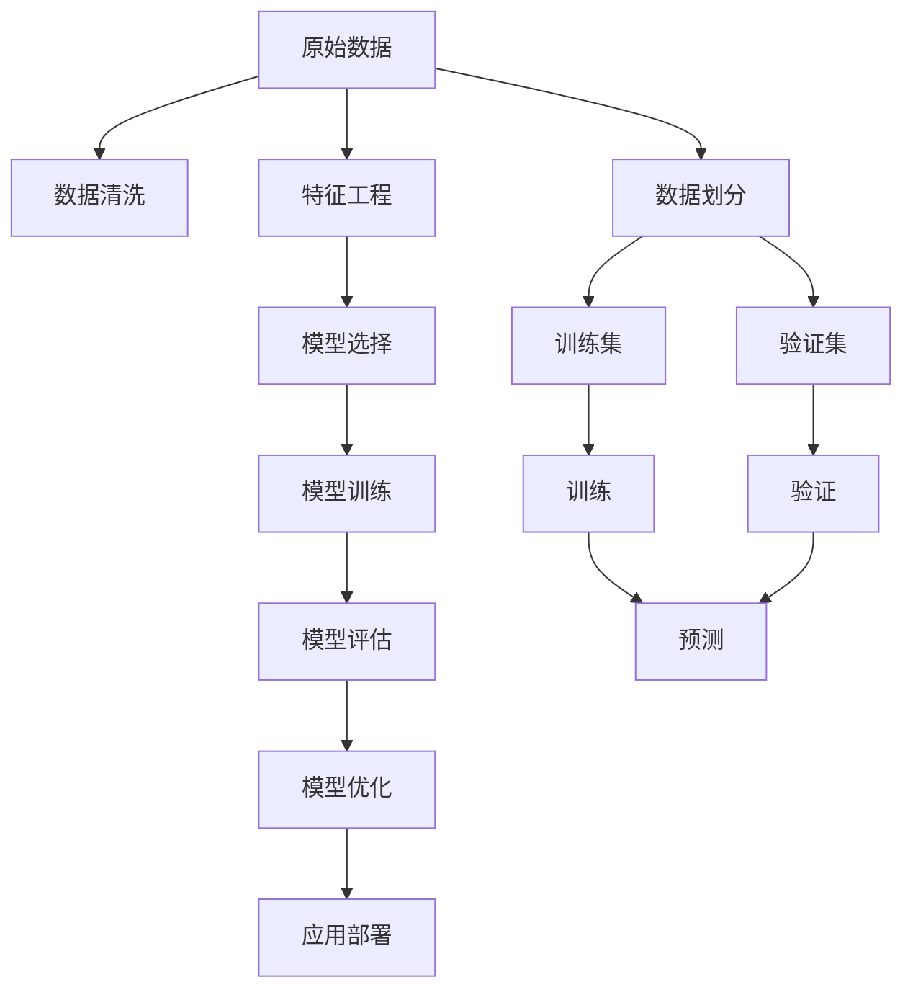

                 

# 基于机器学习的电视剧类型点击量数据分析研究

> 关键词：电视剧,点击量,数据分析,机器学习,特征工程,预测模型

## 1. 背景介绍

### 1.1 问题由来
随着互联网和数字媒体的迅猛发展，电视剧作为一种流行的娱乐形式，其在线点击量成为了衡量其受欢迎程度的重要指标。对于电视台、视频平台以及内容制作公司来说，准确预测电视剧的点击量，不仅能帮助其优化内容安排，还能提升广告投放效率，最大化商业收益。

然而，传统的人工统计方法往往耗时耗力，且结果可能不够准确。在数据量日益庞大的今天，如何更高效地分析并预测电视剧的点击量，成为了一个亟待解决的问题。

### 1.2 问题核心关键点
基于机器学习的电视剧点击量预测，是指利用历史数据，构建模型来预测未来电视剧的点击量。其核心关键点包括：

- 数据准备与特征工程：从大量原始数据中提取有意义的特征。
- 模型选择与优化：选择合适的机器学习模型，并通过调参优化性能。
- 预测与评估：使用预测模型对新数据进行点击量预测，并评估预测结果的准确度。
- 应用与部署：将模型应用于实际业务场景，并进行持续监控和优化。

## 2. 核心概念与联系

### 2.1 核心概念概述

为了更好地理解基于机器学习的电视剧点击量预测方法，本节将介绍几个密切相关的核心概念：

- 机器学习(Machine Learning, ML)：一种让计算机通过学习历史数据，自动进行决策和预测的技术。其核心在于构建模型，对输入特征进行学习和拟合，以实现对未知数据的预测。
- 监督学习(Supervised Learning)：机器学习的一种，利用带有标签的训练数据，学习输入特征与输出标签之间的关系。常见的监督学习算法包括线性回归、逻辑回归、决策树、支持向量机等。
- 特征工程(Feature Engineering)：在机器学习模型构建前，对原始数据进行处理，提取有意义的特征，以便模型更好地学习数据规律。
- 点击量预测(Predictive Analytics)：利用历史数据，预测未来电视剧的点击量。常见于网站流量分析、广告效果评估等领域。
- 模型评估与优化(Model Evaluation & Tuning)：对训练好的模型进行评估，使用交叉验证、网格搜索等方法进行参数调优，以提升模型的预测性能。

这些核心概念之间的逻辑关系可以通过以下Mermaid流程图来展示：



这个流程图展示了大规模电视剧点击量预测的核心概念及其之间的关系：

1. 原始数据通过清洗和特征工程，得到可供模型训练的特征集。
2. 选择合适的监督学习模型，利用训练集进行训练。
3. 通过验证集评估模型性能，并进行参数调优。
4. 使用优化后的模型对新数据进行预测，并将结果应用于业务场景。

## 3. 核心算法原理 & 具体操作步骤

### 3.1 算法原理概述

基于机器学习的电视剧点击量预测，本质上是一个有监督的学习问题。其核心思想是：通过历史点击量数据和相关特征，训练一个预测模型，以实现对未来电视剧点击量的估计。

形式化地，假设电视剧的点击量由一系列特征 $X$ 决定，其中 $Y$ 表示预测的点击量。目标是找到最优的预测函数 $f$，使得：

$$
f(X) = Y
$$

通过最小化预测误差 $e = Y - f(X)$，训练模型 $f$ 以最小化预测误差。常用的预测函数包括线性回归、决策树、随机森林、神经网络等。

### 3.2 算法步骤详解

基于机器学习的电视剧点击量预测一般包括以下几个关键步骤：

**Step 1: 数据准备**
- 收集电视剧的相关数据，包括但不限于标题、类型、时长、主演、播放平台、广告投放等。
- 清洗数据，去除重复、缺失、异常值等数据。
- 对数据进行划分，分为训练集、验证集和测试集。

**Step 2: 特征工程**
- 分析原始数据，识别出对点击量有显著影响的特征。
- 对特征进行编码、归一化等预处理，以便模型学习。
- 设计特征组合和交互项，以提取更高层次的特征。

**Step 3: 模型选择**
- 根据数据特性，选择适合的任务模型，如线性回归、决策树、随机森林、神经网络等。
- 考虑模型的复杂度、可解释性、计算效率等因素，选择合适的模型。

**Step 4: 模型训练**
- 使用训练集对选定的模型进行训练。
- 设置合适的损失函数和优化器，如均方误差损失、AdamW优化器等。
- 进行多次迭代训练，优化模型参数。

**Step 5: 模型评估**
- 使用验证集评估模型的预测性能。
- 计算常见的评估指标，如均方误差(MSE)、平均绝对误差(MAE)、决定系数(R²)等。
- 根据评估结果，调整模型参数和超参数，进行模型优化。

**Step 6: 模型应用**
- 使用优化后的模型对新数据进行预测。
- 部署模型至实际应用系统中，进行实时预测。
- 持续收集新数据，对模型进行周期性优化和迭代。

以上是基于机器学习的电视剧点击量预测的一般流程。在实际应用中，还需要针对具体任务特点，对每个环节进行优化设计，如改进特征工程方法，引入更多的正则化技术，搜索最优的超参数组合等，以进一步提升模型性能。

### 3.3 算法优缺点

基于机器学习的电视剧点击量预测方法具有以下优点：
1. 预测精度高。通过大数据量的训练，模型能够学习到复杂的规律，提高预测准确性。
2. 自动化高效。机器学习算法能够自动拟合数据规律，降低人工工作量。
3. 可扩展性好。模型可以方便地扩展到其他类似任务，只需替换特征和训练数据。
4. 易于部署。训练好的模型可以轻松部署到实际业务系统中，实时进行预测。

同时，该方法也存在一些局限性：
1. 数据质量要求高。模型的效果很大程度上取决于数据的质量和标注信息的完备性。
2. 特征工程复杂。需要深入理解数据，提取有意义的特征，有时工程量较大。
3. 模型黑箱。复杂的模型如神经网络，难以解释其内部的学习过程。
4. 过拟合风险。在大规模数据训练时，容易过拟合，需要加入正则化技术进行控制。

尽管存在这些局限性，但就目前而言，基于机器学习的电视剧点击量预测方法仍是最主流的方法之一。未来相关研究的重点在于如何进一步降低特征工程的工作量，提高模型的泛化能力和可解释性，同时兼顾精度和计算效率等因素。

### 3.4 算法应用领域

基于机器学习的电视剧点击量预测方法，已在电视台、视频平台等多个行业得到广泛应用，其应用场景包括：

- 内容推荐：根据用户的历史点击数据，预测其对新电视剧的兴趣，并进行精准推荐。
- 广告投放：分析电视剧点击量数据，预测不同广告策略的效果，优化广告投放。
- 内容制作：评估新电视剧的市场潜力，优化制作策略，提升收视率。
- 用户行为分析：分析用户点击行为，挖掘用户兴趣和偏好，进行用户画像构建。

除了上述这些经典应用外，基于机器学习的预测方法也被创新性地应用到更多场景中，如内容成本控制、流量预测、用户流失预警等，为媒体内容管理和运营提供有力支持。

## 4. 数学模型和公式 & 详细讲解

### 4.1 数学模型构建

本节将使用数学语言对基于机器学习的电视剧点击量预测方法进行更加严格的刻画。

记电视剧的点击量为 $Y$，特征集合为 $X = \{x_1, x_2, ..., x_n\}$，其中 $n$ 为特征数量。假设模型 $f$ 的形式为线性回归，则模型预测函数可以表示为：

$$
f(X) = \beta_0 + \beta_1 x_1 + \beta_2 x_2 + ... + \beta_n x_n
$$

其中 $\beta = (\beta_0, \beta_1, ..., \beta_n)^T$ 为模型的参数向量，$x_i$ 为特征向量中的第 $i$ 个特征值。

假设训练集为 $D=\{(x_i, y_i)\}_{i=1}^N$，其中 $x_i \in X$，$y_i \in Y$，则目标是最小化损失函数 $\mathcal{L}(\beta)$：

$$
\mathcal{L}(\beta) = \frac{1}{N} \sum_{i=1}^N (y_i - f(x_i))^2
$$

通过梯度下降等优化算法，最小化损失函数 $\mathcal{L}(\beta)$，即可得到最优参数 $\beta^*$。

### 4.2 公式推导过程

以下我们以线性回归为例，推导预测函数和损失函数的详细推导过程。

假设模型 $f$ 的预测函数为线性回归，则预测结果为：

$$
f(x) = \beta_0 + \beta_1 x_1 + \beta_2 x_2 + ... + \beta_n x_n
$$

其中 $\beta$ 为模型参数，$x = (x_1, x_2, ..., x_n)^T$ 为特征向量。

预测误差 $e$ 可以表示为：

$$
e_i = y_i - f(x_i)
$$

损失函数 $\mathcal{L}(\beta)$ 可以表示为：

$$
\mathcal{L}(\beta) = \frac{1}{N} \sum_{i=1}^N e_i^2
$$

其中 $N$ 为样本数量。

根据梯度下降法，最优参数 $\beta^*$ 可以通过以下公式求得：

$$
\beta^* = \mathop{\arg\min}_{\beta} \mathcal{L}(\beta)
$$

对 $\mathcal{L}(\beta)$ 关于 $\beta$ 的梯度进行求导，得到：

$$
\nabla_{\beta}\mathcal{L}(\beta) = \frac{2}{N} \sum_{i=1}^N (y_i - f(x_i)) x_i
$$

令梯度等于零，解方程得到：

$$
\nabla_{\beta}\mathcal{L}(\beta) = 0 \Rightarrow \beta^* = (X^TX)^{-1}X^Ty
$$

其中 $X = [x_1, x_2, ..., x_n]$，$y = [y_1, y_2, ..., y_n]$，$y_i$ 为第 $i$ 个样本的标签。

将 $\beta^*$ 代入预测函数，得到最终预测结果：

$$
\hat{y} = f(x) = X\beta^*
$$

通过以上公式推导，我们可以看到，基于机器学习的电视剧点击量预测，本质上是一个线性回归问题，通过最小化预测误差，训练模型以实现对电视剧点击量的预测。

### 4.3 案例分析与讲解

假设我们收集到了以下电视剧数据：

| 电视剧编号 | 标题           | 类型       | 时长(min) | 主演          | 播放平台  | 广告投放金额 | 历史点击量 |
|------------|----------------|------------|-----------|---------------|-----------|--------------|-----------|
| 1          | 爱，时空错乱 | 科幻      | 60        | 刘德华、周迅 | 腾讯视频   | 100万         | 1000万    |
| 2          | 历史风云 | 历史剧   | 45        | 黄晓明       | 优酷视频   | 80万         | 500万    |
| 3          | 都市爱情 | 剧情     | 50        | 杨幂、李现   | 爱奇艺视频 | 50万         | 200万    |
| ...        | ...            | ...        | ...       | ...           | ...        | ...          | ...       |

我们选取以下特征：

- 类型（Categorical Feature）
- 时长（Continuous Feature）
- 广告投放金额（Continuous Feature）
- 历史点击量（Continuous Feature）

对这些特征进行编码和归一化处理，以形成可供模型训练的数据。

使用上述数据训练线性回归模型，并使用验证集对模型进行评估。训练好的模型参数 $\beta^*$ 可以用于对新电视剧的点击量进行预测。

## 5. 项目实践：代码实例和详细解释说明

### 5.1 开发环境搭建

在进行电视剧点击量预测实践前，我们需要准备好开发环境。以下是使用Python进行Scikit-Learn开发的环境配置流程：

1. 安装Anaconda：从官网下载并安装Anaconda，用于创建独立的Python环境。

2. 创建并激活虚拟环境：
```bash
conda create -n predict-env python=3.8 
conda activate predict-env
```

3. 安装Scikit-Learn：
```bash
conda install scikit-learn
```

4. 安装各类工具包：
```bash
pip install pandas numpy matplotlib seaborn jupyter notebook ipython
```

完成上述步骤后，即可在`predict-env`环境中开始预测实践。

### 5.2 源代码详细实现

下面我们以线性回归为例，给出使用Scikit-Learn库进行电视剧点击量预测的Python代码实现。

首先，定义数据处理函数：

```python
import pandas as pd
from sklearn.preprocessing import OneHotEncoder, StandardScaler

def load_data(path):
    data = pd.read_csv(path)
    return data

def preprocess_data(data):
    # 特征编码
    type_encoder = OneHotEncoder()
    data['type'] = type_encoder.fit_transform(data[['type']]).toarray()
    
    # 特征归一化
    scaler = StandardScaler()
    data[['时长', '广告投放金额', '历史点击量']] = scaler.fit_transform(data[['时长', '广告投放金额', '历史点击量']])
    
    return data

def split_data(data, test_size=0.2):
    train_idx = int(len(data) * (1 - test_size))
    train_data = data.iloc[:train_idx]
    test_data = data.iloc[train_idx:]
    return train_data, test_data
```

然后，定义模型和评估函数：

```python
from sklearn.linear_model import LinearRegression
from sklearn.metrics import mean_squared_error

def train_model(data):
    X = data.drop('历史点击量', axis=1)
    y = data['历史点击量']
    model = LinearRegression()
    model.fit(X, y)
    return model

def evaluate_model(model, test_data):
    X_test = test_data.drop('历史点击量', axis=1)
    y_test = test_data['历史点击量']
    y_pred = model.predict(X_test)
    mse = mean_squared_error(y_test, y_pred)
    return mse
```

接着，启动预测流程并在测试集上评估：

```python
from sklearn.model_selection import train_test_split

# 加载数据
data = load_data('path/to/data.csv')

# 数据预处理
data = preprocess_data(data)

# 数据划分
train_data, test_data = split_data(data, test_size=0.2)

# 模型训练
model = train_model(train_data)

# 模型评估
mse = evaluate_model(model, test_data)

print(f"Test MSE: {mse:.3f}")
```

以上就是使用Scikit-Learn对电视剧点击量进行预测的完整代码实现。可以看到，使用Scikit-Learn的封装，我们可以用相对简洁的代码完成模型的训练和评估。

### 5.3 代码解读与分析

让我们再详细解读一下关键代码的实现细节：

**load_data函数**：
- 读取CSV格式的数据文件，并返回DataFrame格式的数据。

**preprocess_data函数**：
- 对分类特征进行独热编码，将连续特征进行归一化处理。

**split_data函数**：
- 将数据集随机分为训练集和测试集，返回划分好的两个数据集。

**train_model函数**：
- 定义线性回归模型，利用训练集数据拟合模型参数，并返回训练好的模型。

**evaluate_model函数**：
- 使用测试集数据评估模型的预测性能，计算均方误差。

**训练流程**：
- 加载数据
- 数据预处理
- 数据划分
- 模型训练
- 模型评估

可以看到，Scikit-Learn库使得电视剧点击量预测的代码实现变得简洁高效。开发者可以将更多精力放在数据处理、模型改进等高层逻辑上，而不必过多关注底层的实现细节。

当然，工业级的系统实现还需考虑更多因素，如模型的保存和部署、超参数的自动搜索、更灵活的任务适配层等。但核心的预测范式基本与此类似。

## 6. 实际应用场景
### 6.1 智能推荐系统

基于机器学习的电视剧点击量预测技术，可以广泛应用于智能推荐系统中。传统的推荐系统往往依赖于用户的历史行为数据，难以实时推荐新电视剧。而利用预测模型，可以实时分析电视剧的潜在受欢迎程度，并进行精准推荐。

在技术实现上，可以收集用户对电视剧的评分、收藏、观看时长等行为数据，以及电视剧的历史点击量、时长、广告投放等信息，构建预测模型。预测模型能够评估新电视剧的点击量潜力，结合用户画像和推荐算法，动态推荐适合的电视剧内容。

### 6.2 广告投放优化

传统的广告投放主要依赖于人工经验和经验法则，难以量化效果。利用电视剧点击量预测技术，可以量化不同广告策略的效果，优化广告投放策略。

具体而言，可以收集电视剧的广告投放数据和点击量数据，训练预测模型。通过分析不同广告形式、投放时间和位置的效果，优化广告策略，最大化广告投放ROI。例如，分析不同时长广告的点击量差异，优化广告时长和格式。

### 6.3 内容制作与分发

内容制作公司需要提前预测电视剧的受欢迎程度，优化制作策略和分发策略。利用电视剧点击量预测技术，可以评估不同电视剧的市场潜力，指导内容制作和分发决策。

例如，分析不同类型电视剧的点击量分布，优化内容类型和题材。分析不同平台的点击量差异，制定差异化的分发策略。结合市场趋势和用户需求，制定内容制作计划，提升电视剧的收视率和用户满意度。

### 6.4 未来应用展望

随着机器学习技术的不断进步，基于电视剧点击量预测的方法将得到更广泛的应用。未来可能的发展趋势包括：

1. 多模态数据融合：结合电视剧标题、海报、演员等信息，进行多模态数据融合，提高预测的准确性和泛化能力。
2. 实时预测：利用流式数据处理技术，实现实时预测，满足用户实时需求。
3. 自适应推荐：结合用户画像和历史行为，动态调整推荐策略，提高推荐效果。
4. 深度学习模型：利用深度学习模型如神经网络，提升预测性能，应对复杂数据结构。
5. 用户反馈循环：结合用户反馈数据，不断优化预测模型，提升预测精度。

这些趋势将使得基于机器学习的电视剧点击量预测技术更加高效、精准、灵活，为媒体内容和业务运营带来更多的价值。

## 7. 工具和资源推荐
### 7.1 学习资源推荐

为了帮助开发者系统掌握电视剧点击量预测的理论基础和实践技巧，这里推荐一些优质的学习资源：

1. 《机器学习实战》：Kaggle等平台上的实战项目，涵盖数据预处理、特征工程、模型选择、模型评估等多个环节。
2. 《Python数据科学手册》：详细介绍了Python在数据科学和机器学习中的应用，涵盖Scikit-Learn库的使用。
3. 《深度学习》：Ian Goodfellow等人的经典著作，系统介绍了深度学习的基本原理和应用。
4. Coursera《机器学习》课程：斯坦福大学开设的入门级机器学习课程，涵盖监督学习、无监督学习、深度学习等多个方面。
5. Udacity《机器学习工程师纳米学位》：综合性的机器学习课程，涵盖Python编程、数据处理、模型优化等多个技能点。

通过对这些资源的学习实践，相信你一定能够快速掌握电视剧点击量预测的精髓，并用于解决实际的媒体业务问题。
### 7.2 开发工具推荐

高效的开发离不开优秀的工具支持。以下是几款用于电视剧点击量预测开发的常用工具：

1. Python：Python语言简洁高效，是数据科学和机器学习的主流语言之一。
2. Scikit-Learn：基于Python的机器学习库，封装了多种常用的监督学习算法，便于快速开发和部署。
3. TensorFlow：由Google主导开发的深度学习框架，生产部署方便，适合大规模工程应用。
4. Keras：基于TensorFlow等框架的高级API，使用方便，易于上手。
5. PyTorch：由Facebook开发的深度学习框架，动态图设计灵活，适合研究实验。
6. Jupyter Notebook：交互式的笔记本环境，支持代码编写、数据可视化和模型评估，是数据科学工作者的必备工具。

合理利用这些工具，可以显著提升电视剧点击量预测任务的开发效率，加快创新迭代的步伐。

### 7.3 相关论文推荐

电视剧点击量预测技术的发展源于学界的持续研究。以下是几篇奠基性的相关论文，推荐阅读：

1. "Predictive Analytics: The Role of Data Mining and Statistical Learning" by Tonyicity & Leone：介绍了预测分析的基本原理和应用场景。
2. "AdaBoost: A New Learning Algorithm" by Freund & Schapire：提出了AdaBoost算法，一种高效的多分类器集成方法。
3. "Logistic Regression and Maximum Entropy" by Burges：介绍了逻辑回归的基本原理和应用。
4. "Random Forest: Trees are nets" by Liaw & Wiener：提出了随机森林算法，一种集成学习方法。
5. "Deep Learning" by Goodfellow & Bengio：系统介绍了深度学习的基本原理和应用。

这些论文代表了大规模数据预测技术的发展脉络。通过学习这些前沿成果，可以帮助研究者把握学科前进方向，激发更多的创新灵感。

## 8. 总结：未来发展趋势与挑战

### 8.1 总结

本文对基于机器学习的电视剧点击量预测方法进行了全面系统的介绍。首先阐述了电视剧点击量预测的问题由来和核心关键点，明确了预测任务的目标和挑战。其次，从原理到实践，详细讲解了预测的数学模型和关键步骤，给出了预测任务开发的完整代码实例。同时，本文还广泛探讨了预测方法在智能推荐、广告投放、内容制作等领域的实际应用，展示了预测技术的广阔前景。此外，本文精选了预测技术的各类学习资源，力求为读者提供全方位的技术指引。

通过本文的系统梳理，可以看到，基于机器学习的电视剧点击量预测技术正在成为媒体内容分析和运营的重要工具，极大地提升了内容推荐、广告投放、内容制作等方面的效率和效果。未来，伴随技术的不断进步，预测方法还将拓展到更多领域，为媒体行业带来新的突破。

### 8.2 未来发展趋势

展望未来，电视剧点击量预测技术将呈现以下几个发展趋势：

1. 深度学习模型崛起：深度神经网络在处理复杂数据结构方面具有优势，未来深度学习模型将成为主流。
2. 实时预测系统：流式数据处理技术的应用，使得实时预测成为可能，满足用户实时需求。
3. 自适应推荐系统：结合用户画像和历史行为，动态调整推荐策略，提高推荐效果。
4. 多模态融合：结合电视剧标题、海报、演员等信息，进行多模态数据融合，提升预测性能。
5. 用户反馈循环：利用用户反馈数据，不断优化预测模型，提升预测精度。
6. 开源社区：基于Python等开源工具，开发出更多实用的预测工具和框架，推动技术普及和应用。

这些趋势将使得基于机器学习的电视剧点击量预测技术更加高效、精准、灵活，为媒体内容和业务运营带来更多的价值。

### 8.3 面临的挑战

尽管基于机器学习的电视剧点击量预测技术已经取得了不小的进展，但在迈向更加智能化、普适化应用的过程中，仍面临诸多挑战：

1. 数据质量和标注：高质量的数据和标注是预测准确性的前提，但获取数据和标注成本高、难度大。
2. 模型复杂度：深度学习模型复杂，容易过拟合，需要更多的数据和计算资源。
3. 特征工程：特征工程是预测准确性的关键，但需要深入理解数据，设计合适的特征组合和交互项。
4. 模型可解释性：复杂的模型难以解释其内部工作机制，影响模型的可解释性和可信度。
5. 实时性和性能：预测模型需要在实时场景下高效运行，面临计算资源和实时性的限制。
6. 用户隐私保护：预测模型需要大量用户数据，如何保护用户隐私，避免数据泄露，将是重要的挑战。

尽管存在这些挑战，但通过不断的技术创新和改进，相信基于机器学习的电视剧点击量预测技术将在媒体内容分析和运营中发挥越来越重要的作用。未来研究需要在数据质量、模型复杂度、特征工程、模型可解释性等方面进行更多探索和优化，以应对实际应用中的复杂挑战。

### 8.4 研究展望

面对电视剧点击量预测技术面临的挑战，未来的研究需要在以下几个方面寻求新的突破：

1. 数据增强：利用数据增强技术，扩充训练数据集，提高模型的泛化能力。
2. 多模态融合：结合多种数据源，进行多模态数据融合，提升预测性能。
3. 实时处理：利用流式数据处理技术，实现实时预测，满足用户实时需求。
4. 自适应推荐：结合用户画像和历史行为，动态调整推荐策略，提高推荐效果。
5. 轻量级模型：开发轻量级预测模型，降低计算资源消耗，提升实时性。
6. 用户反馈循环：利用用户反馈数据，不断优化预测模型，提升预测精度。

这些研究方向的探索，必将引领电视剧点击量预测技术迈向更高的台阶，为媒体内容分析和运营提供更有力的技术支持。面向未来，电视剧点击量预测技术还需要与其他人工智能技术进行更深入的融合，如知识表示、因果推理、强化学习等，多路径协同发力，共同推动媒体内容管理和运营系统的进步。只有勇于创新、敢于突破，才能不断拓展电视剧点击量预测的边界，让预测技术更好地服务于媒体行业。

## 9. 附录：常见问题与解答

**Q1：如何选择合适的机器学习模型？**

A: 选择合适的机器学习模型需要考虑多个因素，如数据特性、预测任务、计算资源等。一般建议从简单模型开始尝试，逐步增加模型复杂度。例如，对于线性回归任务，可以考虑线性模型；对于分类任务，可以考虑逻辑回归、决策树等。

**Q2：特征工程在预测中的重要性？**

A: 特征工程是预测模型的重要组成部分，通过合理选择和处理特征，可以显著提高模型的预测性能。常见的特征工程方法包括特征选择、特征提取、特征组合等。例如，对文本数据进行TF-IDF编码，提取关键词特征；对时间序列数据进行滑动窗口，提取时间特征等。

**Q3：模型调参的技巧？**

A: 模型调参是预测模型开发的关键环节，需要不断尝试不同的参数组合，找到最优的超参数。常用的调参方法包括网格搜索、随机搜索、贝叶斯优化等。需要注意的是，调参是一个迭代过程，需要耐心和实验精神。

**Q4：预测模型如何部署？**

A: 预测模型部署需要考虑多个因素，如模型文件格式、计算资源、系统架构等。常见的部署方式包括RESTful API、Flask应用、TensorFlow Serving等。例如，使用TensorFlow Serving可以方便地将模型部署到生产环境，支持实时预测。

**Q5：如何评价预测模型的性能？**

A: 预测模型的性能评价需要考虑多个指标，如均方误差、平均绝对误差、决定系数等。常用的评价方法包括交叉验证、留一法、留几法等。需要注意的是，评价指标的选择应根据预测任务的特点进行。

---

作者：禅与计算机程序设计艺术 / Zen and the Art of Computer Programming

