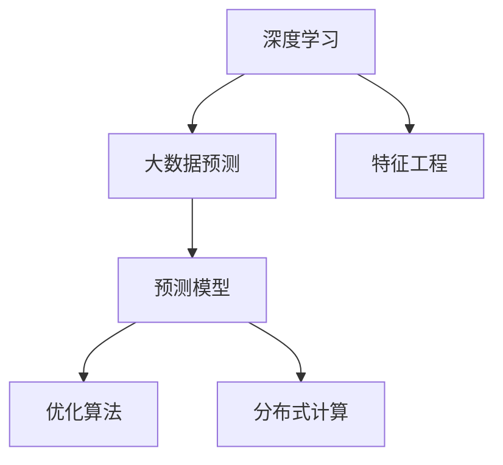

                 

## 1. 背景介绍

### 1.1 问题由来

随着互联网和物联网技术的飞速发展，数据生成量呈指数级增长。如何在大数据背景下有效预测目标变量，挖掘潜在价值，成为了各行业的热点话题。传统统计学方法虽然成熟，但对于复杂非线性关系和高维数据，存在一定的局限性。深度学习技术的兴起，特别是深度神经网络的应用，为大数据预测问题提供了全新的解决途径。

深度学习模型通过多层非线性变换，可以从原始数据中学习复杂模式，构建高精度的预测模型。但同时，高维大数据也带来了模型复杂度增加、训练时间长、资源消耗大等问题。针对这些挑战，本文从原理和实践两个层面，全面阐述了基于深度学习的预测方法，旨在为大数据预测提供有力支持。

### 1.2 问题核心关键点

大数据预测问题通常需要面对以下关键点：

1. **数据维度高**：大数据往往伴随高维特征，深度学习模型难以有效处理，导致过拟合或欠拟合问题。
2. **数据量大**：大数据量给模型训练带来了极大的计算压力，深度学习模型需要高效优化算法和强大计算资源。
3. **实时性要求**：部分应用场景下，预测结果需要实时生成，深度学习模型需要支持高效推理和部署。
4. **模型解释性**：大数据预测模型，尤其是深度学习模型，往往具有"黑盒"特性，需要更强的可解释性，方便用户理解和调试。
5. **泛化能力**：大数据预测模型需要在新的、未见过的数据上表现良好，避免过拟合和数据泄露。

本文将围绕这些关键点，深入分析基于深度学习的预测方法，并结合实例演示其应用。

## 2. 核心概念与联系

### 2.1 核心概念概述

为更好地理解基于深度学习的大数据预测方法，本节将介绍几个密切相关的核心概念：

- **深度学习**：一种基于神经网络的人工智能技术，能够从数据中自动学习复杂非线性关系，适用于高维非结构化数据的建模和预测。
- **大数据**：指规模大、多样化的数据集，通常涉及高维特征和海量样本，对计算资源和算法效率提出了高要求。
- **预测模型**：利用数据训练得到的模型，用于对未知样本进行预测。常见预测模型包括线性回归、决策树、支持向量机、神经网络等。
- **特征工程**：数据预处理和特征提取的过程，目的是提升数据质量，增强模型预测能力。
- **优化算法**：深度学习模型训练的核心技术，用于最小化损失函数，优化模型参数。常见的优化算法包括梯度下降、Adam等。
- **分布式计算**：利用多台计算设备并行处理大数据，提升模型训练和推理效率。

这些核心概念之间的逻辑关系可以通过以下Mermaid流程图来展示：



这个流程图展示了大数据预测的核心概念及其之间的关系：

1. 深度学习提供高精度的预测能力，但需要大数据支持。
2. 特征工程通过提升数据质量，增强模型预测效果。
3. 预测模型由深度学习模型构成，通过优化算法进行训练。
4. 分布式计算提高模型训练和推理效率，解决大数据量的计算问题。

这些概念共同构成了大数据预测的框架，使得深度学习在复杂大数据预测任务中大放异彩。通过理解这些核心概念，我们可以更好地把握大数据预测的原理和优化方向。

## 3. 核心算法原理 & 具体操作步骤

### 3.1 算法原理概述

基于深度学习的大数据预测方法，本质上是利用神经网络模型对高维数据进行拟合，并利用优化算法不断调整模型参数，使得模型在训练数据上的预测误差最小化。其核心思想可以概括为：

1. **数据预处理**：对原始数据进行清洗、归一化、特征工程等处理，提升数据质量。
2. **模型构建**：选择合适的神经网络结构，如多层感知机、卷积神经网络、循环神经网络等，构建预测模型。
3. **模型训练**：利用训练数据，通过优化算法最小化损失函数，更新模型参数。
4. **模型评估**：在验证集和测试集上评估模型性能，选择最优模型。
5. **模型推理**：利用训练好的模型，对新数据进行预测。

### 3.2 算法步骤详解

基于深度学习的大数据预测方法通常包括以下几个关键步骤：

**Step 1: 数据预处理**
- 清洗数据：去除缺失值、异常值等噪声数据。
- 数据归一化：将不同特征的数据缩放到统一范围，如归一化到[0, 1]或[0, 1]。
- 特征工程：选择合适的特征，如数值特征、文本特征、时间特征等。
- 数据划分：将数据划分为训练集、验证集和测试集。

**Step 2: 模型构建**
- 选择合适的神经网络结构：如全连接神经网络、卷积神经网络(CNN)、循环神经网络(RNN)、长短期记忆网络(LSTM)、卷积循环神经网络(CRNN)等。
- 设计损失函数：选择合适的损失函数，如均方误差(MSE)、交叉熵损失等。
- 初始化模型参数：选择合适的初始化方法，如Xavier初始化、He初始化等。

**Step 3: 模型训练**
- 选择合适的优化算法：如随机梯度下降(SGD)、Adam、Adagrad等。
- 设置超参数：如学习率、批大小、迭代次数等。
- 前向传播：将输入数据输入模型，计算模型输出。
- 反向传播：计算损失函数对参数的梯度。
- 参数更新：利用优化算法更新模型参数。
- 周期性评估：在验证集上评估模型性能，选择最优模型。

**Step 4: 模型评估**
- 评估指标：如均方误差、平均绝对误差、R²系数、AUC等。
- 交叉验证：使用K折交叉验证，评估模型泛化能力。

**Step 5: 模型推理**
- 预测过程：将新数据输入模型，计算模型输出。
- 结果处理：根据模型输出，进行处理或过滤，得到最终预测结果。

### 3.3 算法优缺点

基于深度学习的大数据预测方法具有以下优点：
1. 高精度：深度学习模型能够自动学习复杂模式，适用于高维非线性数据。
2. 高效性：深度学习模型通过并行计算，能够高效处理大数据量。
3. 通用性：深度学习模型可以应用于多种预测任务，如回归、分类、序列预测等。

同时，该方法也存在一些局限性：
1. 计算资源消耗大：深度学习模型参数多，训练时间长，需要高性能计算资源。
2. 过拟合风险高：深度学习模型容易过拟合，需要严格控制训练集和验证集的比例。
3. 可解释性差：深度学习模型通常具有"黑盒"特性，难以解释其内部工作机制。
4. 模型训练难度高：深度学习模型需要大量的标注数据和超参数调优。

尽管存在这些局限性，但基于深度学习的大数据预测方法在实际应用中仍然发挥着巨大的作用。未来，随着深度学习技术的不断发展，模型结构、优化算法和硬件支持的不断改进，这些问题有望得到有效解决。

### 3.4 算法应用领域

基于深度学习的大数据预测方法，已经广泛应用于各个领域，如金融、医疗、工业、物流、智能城市等。以下是几个典型应用场景：

1. **金融风控**：利用深度学习模型预测贷款违约率、风险等级等，提升贷款审批效率和风险控制能力。
2. **医疗诊断**：利用深度学习模型预测疾病发病率、患病风险、药物疗效等，辅助医生诊断和治疗决策。
3. **智能制造**：利用深度学习模型预测设备故障、生产流程、产品质量等，优化生产管理和资源配置。
4. **物流运输**：利用深度学习模型预测货物流量、运输路线、配送时间等，提升物流效率和运营成本。
5. **智能交通**：利用深度学习模型预测交通流量、路况、车辆行为等，优化交通管理和出行建议。

除了这些传统应用外，深度学习模型在大数据预测领域的应用还在不断拓展，如股票交易、电力负荷预测、气象预报等，展示了其强大的潜力和应用价值。

## 4. 数学模型和公式 & 详细讲解 & 举例说明

### 4.1 数学模型构建

本节将使用数学语言对基于深度学习的大数据预测方法进行更加严格的刻画。

假设深度学习模型为 $M(\theta)$，其中 $\theta$ 为模型参数。给定训练数据集 $D=\{(x_i, y_i)\}_{i=1}^N$，训练目标为最小化模型在训练集上的预测误差。

定义模型的预测误差为：

$$
\epsilon_M(x) = M(x) - y
$$

则训练目标为：

$$
\mathcal{L}(\theta) = \frac{1}{N}\sum_{i=1}^N \epsilon_M(x_i)^2
$$

其中 $\epsilon_M(x_i)$ 为模型在第 $i$ 个样本上的预测误差。

### 4.2 公式推导过程

以下我们以回归任务为例，推导均方误差损失函数的数学表达式。

假设模型 $M(\theta)$ 在输入 $x$ 上的输出为 $\hat{y}$，真实标签为 $y$，则均方误差损失函数定义为：

$$
\mathcal{L}(\theta) = \frac{1}{N}\sum_{i=1}^N (y_i - \hat{y}_i)^2
$$

其中 $\hat{y}_i$ 为模型对第 $i$ 个样本的预测值，$y_i$ 为真实标签。

根据梯度下降算法的优化目标，模型参数 $\theta$ 的更新公式为：

$$
\theta \leftarrow \theta - \eta \nabla_{\theta}\mathcal{L}(\theta)
$$

其中 $\eta$ 为学习率，$\nabla_{\theta}\mathcal{L}(\theta)$ 为损失函数对模型参数 $\theta$ 的梯度。

利用链式法则，可得梯度公式为：

$$
\frac{\partial \mathcal{L}(\theta)}{\partial \theta} = -\frac{2}{N}\sum_{i=1}^N (y_i - \hat{y}_i) \frac{\partial \hat{y}_i}{\partial \theta}
$$

其中 $\frac{\partial \hat{y}_i}{\partial \theta}$ 为模型输出对模型参数的偏导数。

在得到梯度后，即可带入参数更新公式，完成模型的迭代优化。重复上述过程直至收敛，最终得到适应训练数据的模型参数 $\theta^*$。

### 4.3 案例分析与讲解

以一个简单的线性回归为例，解释上述推导过程。

假设有一组线性数据 $(x_i, y_i)$，其中 $x_i$ 为特征，$y_i$ 为标签，线性回归模型的输出为 $\hat{y}_i = \theta_0 + \theta_1x_i$。则均方误差损失函数为：

$$
\mathcal{L}(\theta) = \frac{1}{N}\sum_{i=1}^N (y_i - (\theta_0 + \theta_1x_i))^2
$$

对模型参数 $\theta_0$ 和 $\theta_1$ 求偏导数，得：

$$
\frac{\partial \mathcal{L}(\theta)}{\partial \theta_0} = -\frac{2}{N}\sum_{i=1}^N (y_i - (\theta_0 + \theta_1x_i)) = -2\theta_1 \bar{x} + 2\bar{y}
$$

$$
\frac{\partial \mathcal{L}(\theta)}{\partial \theta_1} = -\frac{2}{N}\sum_{i=1}^N x_i(y_i - (\theta_0 + \theta_1x_i)) = -2\bar{x}\bar{y} + 2\theta_0\bar{x} + 2\theta_1\bar{x^2}
$$

其中 $\bar{x} = \frac{1}{N}\sum_{i=1}^N x_i$，$\bar{y} = \frac{1}{N}\sum_{i=1}^N y_i$。

将梯度带入参数更新公式，得：

$$
\theta_0 \leftarrow \theta_0 - \eta(-2\theta_1 \bar{x} + 2\bar{y})
$$

$$
\theta_1 \leftarrow \theta_1 - \eta(-2\bar{x}\bar{y} + 2\theta_0\bar{x} + 2\theta_1\bar{x^2})
$$

可以看出，梯度下降算法通过不断更新模型参数，逐步缩小模型预测与真实标签之间的差距，从而优化模型性能。

## 5. 项目实践：代码实例和详细解释说明

### 5.1 开发环境搭建

在进行预测方法开发前，我们需要准备好开发环境。以下是使用Python进行TensorFlow开发的环境配置流程：

1. 安装Anaconda：从官网下载并安装Anaconda，用于创建独立的Python环境。

2. 创建并激活虚拟环境：
```bash
conda create -n tensorflow-env python=3.8 
conda activate tensorflow-env
```

3. 安装TensorFlow：从官网获取对应的安装命令，如使用CPU或GPU版本。

4. 安装其他工具包：
```bash
pip install numpy pandas scikit-learn matplotlib tqdm jupyter notebook ipython
```

完成上述步骤后，即可在`tensorflow-env`环境中开始预测方法开发。

### 5.2 源代码详细实现

下面我们以回归任务为例，给出使用TensorFlow实现一个简单的线性回归模型的代码实现。

首先，定义数据处理函数：

```python
import tensorflow as tf

def load_data():
    x_train = np.loadtxt('train_data.csv', delimiter=',', usecols=(0, 1))
    y_train = np.loadtxt('train_labels.csv', delimiter=',', usecols=(0, 1))
    x_test = np.loadtxt('test_data.csv', delimiter=',', usecols=(0, 1))
    y_test = np.loadtxt('test_labels.csv', delimiter=',', usecols=(0, 1))
    return x_train, y_train, x_test, y_test
```

然后，定义模型：

```python
def build_model(input_shape):
    model = tf.keras.Sequential([
        tf.keras.layers.Dense(32, activation='relu', input_shape=input_shape),
        tf.keras.layers.Dense(1)
    ])
    return model
```

接着，定义训练和评估函数：

```python
def compile_model(model, x_train, y_train, x_test, y_test):
    model.compile(optimizer=tf.keras.optimizers.Adam(learning_rate=0.001),
                  loss='mse')
    model.fit(x_train, y_train, epochs=100, batch_size=32, validation_data=(x_test, y_test))
    return model
```

最后，启动训练流程并在测试集上评估：

```python
x_train, y_train, x_test, y_test = load_data()

input_shape = (x_train.shape[1],)
model = build_model(input_shape)
model = compile_model(model, x_train, y_train, x_test, y_test)
model.evaluate(x_test, y_test)
```

以上就是使用TensorFlow实现一个简单的线性回归模型的完整代码实现。可以看到，利用TensorFlow提供的高级API，代码实现相对简洁，且易于理解。

### 5.3 代码解读与分析

让我们再详细解读一下关键代码的实现细节：

**load_data函数**：
- 加载训练集和测试集数据。

**build_model函数**：
- 定义多层感知机模型，包括一个输入层和一个输出层。
- 使用ReLU激活函数，提升模型的非线性拟合能力。
- 输出层为1个节点，用于预测标签。

**compile_model函数**：
- 编译模型，设置优化器、损失函数等。
- 使用Adam优化器，学习率为0.001，适用于深度学习模型的优化。
- 使用均方误差损失函数。
- 在训练集上进行模型训练，使用测试集进行验证。

**训练流程**：
- 加载数据集。
- 构建模型。
- 编译模型，设置超参数。
- 训练模型。
- 评估模型性能。

可以看到，TensorFlow提供了丰富的API和工具，可以轻松构建、训练和评估深度学习模型。开发者可以根据实际需求，灵活设计模型结构，优化训练过程。

当然，工业级的系统实现还需考虑更多因素，如模型的保存和部署、超参数的自动搜索、更灵活的模型结构设计等。但核心的预测方法基本与此类似。

## 6. 实际应用场景

### 6.1 智能制造

智能制造是工业4.0的重要组成部分，旨在通过大数据分析，优化生产流程、提高生产效率和产品质量。深度学习模型在智能制造中的应用，可以显著提升企业的智能化水平。

具体而言，利用深度学习模型可以实时监测生产设备状态、预测故障、优化生产计划等。通过结合物联网和云计算技术，深度学习模型能够将生产数据转化为有价值的生产知识和决策支持，推动智能制造的发展。

### 6.2 金融风控

金融行业对风险预测和控制有着高需求，深度学习模型可以通过对历史交易数据进行分析，预测客户的违约风险、股票涨跌等。深度学习模型的预测能力，可以有效降低金融机构的风险损失，提升服务质量。

例如，银行可以利用深度学习模型预测贷款违约率、信用卡违约率等，优化贷款审批流程，减少坏账率。保险公司可以通过深度学习模型预测理赔率、理赔金额等，优化理赔策略，提升理赔效率和准确性。

### 6.3 医疗诊断

医疗行业需要高效准确的疾病预测和诊断工具，深度学习模型通过分析医疗数据，可以提供精准的疾病预测和治疗方案。

例如，深度学习模型可以预测疾病发病率、患病风险、药物疗效等，辅助医生诊断和治疗决策。医院可以利用深度学习模型进行病历分析、影像识别、基因组分析等，提升医疗服务的质量和效率。

### 6.4 物流运输

物流行业需要实时预测货物流量、运输路线、配送时间等，深度学习模型可以有效提升物流效率和运营成本。

例如，深度学习模型可以预测货物流量、路况、车辆行为等，优化运输路径和配送策略。快递公司可以利用深度学习模型进行包裹追踪、物流预测、库存管理等，提升物流管理的智能化水平。

### 6.5 智能交通

智能交通是智慧城市的重要组成部分，深度学习模型可以通过对交通数据的分析，实现交通管理和出行建议的优化。

例如，深度学习模型可以预测交通流量、路况、车辆行为等，优化交通信号灯控制、交通流量管理等。城市可以利用深度学习模型进行交通预测、拥堵识别、事故预警等，提升交通管理和安全水平。

## 7. 工具和资源推荐

### 7.1 学习资源推荐

为了帮助开发者系统掌握深度学习和大数据预测的理论基础和实践技巧，这里推荐一些优质的学习资源：

1. **《深度学习》(周志华著)**：详细介绍了深度学习的基本概念、算法和应用，适合初学者入门。
2. **Deep Learning Specialization(吴恩达)**：由深度学习领域的专家吴恩达主讲，涵盖深度学习的基础和高级内容。
3. **《TensorFlow官方文档》**：详细介绍了TensorFlow的API和工具，适合深度学习开发者的学习。
4. **Kaggle**：世界知名的数据科学竞赛平台，提供了丰富的数据集和模型样例，适合实战练习。
5. **arXiv.org**：深度学习领域的学术前沿，提供了大量的最新研究论文，适合深入学习。

通过对这些资源的学习实践，相信你一定能够快速掌握深度学习和大数据预测的精髓，并用于解决实际的预测问题。

### 7.2 开发工具推荐

高效的开发离不开优秀的工具支持。以下是几款用于深度学习和大数据预测开发的常用工具：

1. **TensorFlow**：由Google开发的深度学习框架，支持多种模型构建和优化算法。
2. **PyTorch**：由Facebook开发的深度学习框架，灵活的计算图和动态图设计，适合研究和原型开发。
3. **Keras**：一个高级深度学习API，可以在TensorFlow、Theano、CNTK等后端实现。
4. **Scikit-learn**：一个基于NumPy的机器学习库，支持多种模型构建和优化算法。
5. **Pandas**：一个数据处理库，支持数据清洗、特征工程等操作。

合理利用这些工具，可以显著提升深度学习和大数据预测任务的开发效率，加快创新迭代的步伐。

### 7.3 相关论文推荐

深度学习和大数据预测技术的发展源于学界的持续研究。以下是几篇奠基性的相关论文，推荐阅读：

1. **ImageNet Classification with Deep Convolutional Neural Networks**：Hinton等人提出的深度卷积神经网络，在图像分类任务上取得了突破性成果。
2. **Deep Neural Networks for Acoustic Modeling in Speech Recognition**：Hinton等人提出的深度神经网络在语音识别任务上的应用，推动了自然语言处理的发展。
3. **Convolutional Neural Networks for Sentence Classification**：Kim等人提出的卷积神经网络在文本分类任务上的应用，展示了深度学习在自然语言处理中的潜力。
4. **A Survey of Recent Trends in Deep Learning**：Deng等人综述了深度学习的发展历程和前沿技术，适合全面了解深度学习的应用。
5. **TensorFlow: A System for Large-Scale Machine Learning**：Google论文介绍了TensorFlow的架构和设计理念，适合深度学习开发者的学习。

这些论文代表了大数据预测技术的发展脉络。通过学习这些前沿成果，可以帮助研究者把握学科前进方向，激发更多的创新灵感。

## 8. 总结：未来发展趋势与挑战

### 8.1 总结

本文对基于深度学习的大数据预测方法进行了全面系统的介绍。首先阐述了深度学习和大数据预测的研究背景和意义，明确了预测方法在大数据应用中的重要性。其次，从原理到实践，详细讲解了深度学习模型的构建、训练和评估过程，给出了预测任务开发的完整代码实例。同时，本文还广泛探讨了深度学习模型在智能制造、金融风控、医疗诊断、物流运输等领域的实际应用，展示了深度学习预测技术的强大潜力。此外，本文精选了深度学习和大数据预测的相关学习资源，力求为读者提供全方位的技术指引。

通过本文的系统梳理，可以看到，基于深度学习的预测方法正在成为大数据预测的重要范式，极大地提升了大数据的分析和应用能力。深度学习模型的高效、灵活和可扩展性，使其在复杂预测任务中大放异彩。未来，随着深度学习技术的不断发展，大数据预测将拥有更广阔的应用前景。

### 8.2 未来发展趋势

展望未来，深度学习和大数据预测技术将呈现以下几个发展趋势：

1. **模型规模持续增大**：随着算力成本的下降和数据规模的扩张，深度学习模型的参数量还将持续增长。超大参数量的模型可以更好地捕捉数据的复杂模式，提升预测精度。

2. **模型结构更加多样化**：深度学习模型将从单一的神经网络结构，演变为更加多样化的模型体系，如卷积神经网络、循环神经网络、注意力机制、生成对抗网络等。

3. **数据驱动与模型驱动并重**：深度学习模型将更加注重数据驱动的设计，如基于无监督学习、半监督学习等方法，提升模型的泛化能力和鲁棒性。

4. **多模态融合**：深度学习模型将从单一模态的预测，扩展到多模态数据融合的预测，如文本+图像、文本+语音、文本+时间序列等。

5. **实时化预测**：深度学习模型将更加注重实时性，通过分布式计算和优化算法，支持高效实时预测。

6. **模型压缩与加速**：深度学习模型将更加注重模型压缩和加速，通过剪枝、量化、硬件优化等技术，提升模型推理效率和资源利用率。

7. **自动化模型构建**：深度学习模型将更加注重自动化模型构建，通过自动化学习、超参数优化等技术，减少人工调参的复杂度。

以上趋势凸显了深度学习和大数据预测技术的广阔前景。这些方向的探索发展，必将进一步提升大数据预测的能力和应用范围，为经济社会发展注入新的动力。

### 8.3 面临的挑战

尽管深度学习和大数据预测技术已经取得了瞩目成就，但在迈向更加智能化、普适化应用的过程中，仍面临诸多挑战：

1. **计算资源消耗大**：深度学习模型参数多，训练时间长，需要高性能计算资源。如何高效利用计算资源，提升模型训练效率，仍然是一个重要问题。

2. **模型鲁棒性不足**：深度学习模型容易过拟合，需要严格控制训练集和验证集的比例。如何在有限的标注数据下，提高模型的泛化能力和鲁棒性，仍然是一个重要的研究课题。

3. **模型可解释性差**：深度学习模型通常具有"黑盒"特性，难以解释其内部工作机制。如何赋予模型更强的可解释性，提升模型透明度，仍然是一个重要的研究课题。

4. **模型训练难度高**：深度学习模型需要大量的标注数据和超参数调优，如何自动化模型构建和超参数调优，仍然是一个重要的研究课题。

5. **模型安全性不足**：深度学习模型容易受到对抗样本攻击，需要研究对抗样本防御技术，提升模型的安全性。

6. **模型性能评估复杂**：深度学习模型性能评估涉及多个指标，如精度、召回率、F1-score、AUC等。如何综合评估模型性能，选取最优模型，仍然是一个重要的研究课题。

这些挑战需要学界和工业界共同努力，积极探索新的方法和技术，推动深度学习和大数据预测技术的进一步发展。

### 8.4 未来突破

面对深度学习和大数据预测技术所面临的种种挑战，未来的研究需要在以下几个方面寻求新的突破：

1. **探索无监督和半监督预测方法**：摆脱对大规模标注数据的依赖，利用无监督和半监督学习方法，提升模型的泛化能力和鲁棒性。

2. **研究参数高效和计算高效的预测范式**：开发更加参数高效的预测方法，在固定大部分模型参数的情况下，只更新极少量的任务相关参数，提升模型训练和推理效率。

3. **融合因果分析和强化学习**：通过引入因果分析和强化学习技术，增强预测模型的因果关系和决策能力，提升模型稳定性和预测效果。

4. **结合外部知识库和规则库**：将符号化的外部知识库和规则库与深度学习模型进行融合，提升模型推理和决策能力。

5. **引入伦理道德约束**：在模型训练和预测过程中引入伦理导向的评估指标，过滤和惩罚有害的预测结果，确保模型的安全性。

6. **开发自动化模型构建和超参数优化工具**：通过自动化学习、超参数优化等技术，减少人工调参的复杂度，提升模型的构建效率。

这些研究方向的探索，必将引领深度学习和大数据预测技术迈向更高的台阶，为构建安全、可靠、可解释、可控的智能系统铺平道路。面向未来，深度学习和大数据预测技术还需要与其他人工智能技术进行更深入的融合，如知识表示、因果推理、强化学习等，多路径协同发力，共同推动人工智能技术的发展。只有勇于创新、敢于突破，才能不断拓展深度学习和大数据预测的边界，让智能技术更好地造福人类社会。

## 9. 附录：常见问题与解答

**Q1：深度学习模型如何处理高维数据？**

A: 深度学习模型通过多层的非线性变换，可以从原始高维数据中学习复杂模式。常见的高维数据处理方法包括：

1. **降维技术**：通过PCA、LDA等降维方法，将高维数据转化为低维特征，提升模型训练效率和泛化能力。
2. **特征选择**：通过特征选择算法，选择对预测任务有影响的特征，减少输入维度。
3. **特征组合**：通过特征组合方法，将高维特征进行组合，提升特征表达能力。
4. **深度神经网络**：通过多层非线性变换，深度神经网络能够有效处理高维数据，提升模型预测能力。

**Q2：深度学习模型如何处理时间序列数据？**

A: 时间序列数据通常具有连续性和时间相关性，深度学习模型可以通过RNN、LSTM、GRU等序列模型，有效处理时间序列数据。

1. **时间步长**：将时间序列数据转化为时间步长序列，每个时间步长输入模型一个样本。
2. **循环神经网络**：利用循环神经网络，模型可以捕捉时间序列中的时间相关性，提升预测能力。
3. **长短期记忆网络**：利用长短期记忆网络，模型可以处理长时间跨度的序列数据，捕捉长时依赖关系。
4. **门控循环单元**：利用门控循环单元，模型可以控制信息的流动，避免梯度消失和梯度爆炸问题。

**Q3：深度学习模型如何处理多模态数据？**

A: 多模态数据通常包括文本、图像、声音等多种类型的数据，深度学习模型可以通过多模态融合方法，提升对多模态数据的预测能力。

1. **特征映射**：将不同模态的数据映射到同一特征空间，利用特征融合方法提升模型预测能力。
2. **共享表示**：通过共享表示方法，将不同模态的数据映射到共享特征空间，提升模型泛化能力。
3. **跨模态学习**：通过跨模态学习方法，将不同模态的数据进行联合学习，提升模型对多模态数据的预测能力。
4. **注意力机制**：通过注意力机制，模型可以自适应地关注不同模态的数据，提升模型预测效果。

**Q4：深度学习模型如何处理缺失数据？**

A: 缺失数据是数据处理中常见的问题，深度学习模型可以通过以下方法处理缺失数据：

1. **插值法**：利用插值方法，根据已有数据推测缺失数据，如均值插值、中值插值、KNN插值等。
2. **填补法**：利用填补方法，将缺失数据替换为某个固定值或随机值，如均值填补、随机填补等。
3. **预测模型**：利用预测模型，预测缺失数据，如KNN预测、回归预测等。
4. **基于深度学习的方法**：利用深度学习模型，预测缺失数据，如通过自编码器、变分自编码器等方法。

**Q5：深度学习模型如何处理过拟合问题？**

A: 过拟合是深度学习模型常见的问题，可以通过以下方法处理过拟合问题：

1. **正则化技术**：利用L1正则、L2正则、Dropout等正则化技术，避免模型过拟合。
2. **数据增强**：通过数据增强技术，扩充训练集，提高模型泛化能力。
3. **早停法**：通过早停法，当模型在验证集上性能不再提升时，停止训练，避免过拟合。
4. **模型压缩**：通过模型压缩技术，如剪枝、量化等方法，减小模型参数，提升模型泛化能力。

通过合理应用以上方法，可以有效处理过拟合问题，提升深度学习模型的泛化能力和性能。

**Q6：深度学习模型如何处理样本不平衡问题？**

A: 样本不平衡问题是指某些类别的样本数量远小于其他类别，深度学习模型可以通过以下方法处理样本不平衡问题：

1. **欠采样**：通过欠采样方法，减少数量较多的类别的样本，提升数量较少的类别的样本。
2. **过采样**：通过过采样方法，增加数量较少的类别的样本，减少数量较多的类别的样本。
3. **类别权重**：通过设置类别权重，提升数量较少的类别的损失函数权重，减少模型对数量较多的类别的关注。
4. **集成学习**：通过集成学习方法，利用多个模型进行组合，提升模型的泛化能力和鲁棒性。

通过合理应用以上方法，可以有效处理样本不平衡问题，提升深度学习模型的预测性能。

---

作者：禅与计算机程序设计艺术 / Zen and the Art of Computer Programming

