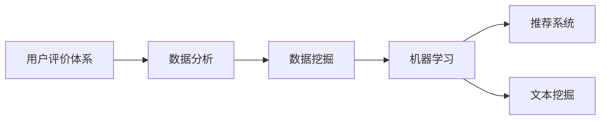

                 

# 基于用户评价体系推动某旅游发展的分析与研究

> 关键词：旅游发展, 用户评价体系, 数据分析, 数据挖掘, 机器学习

## 1. 背景介绍

### 1.1 问题由来

随着信息技术的发展，用户评价体系在各行各业中越来越受到重视。特别是在旅游业，用户评价体系不仅能够反映旅游景区的服务质量，还能为景区的管理决策提供重要依据。对于某旅游区，虽然拥有丰富的人文和自然景观资源，但由于缺乏系统的用户评价数据，导致其在市场竞争中处于劣势。因此，如何通过用户评价体系推动该旅游区的旅游发展，成为当前亟需解决的问题。

### 1.2 问题核心关键点

该问题的核心在于：如何高效、全面地收集、分析和利用用户评价数据，提取其背后的旅游特征和用户需求，进而制定有效的旅游发展策略。

## 2. 核心概念与联系

### 2.1 核心概念概述

为更好地理解如何基于用户评价体系推动旅游发展，本节将介绍几个核心概念：

- 用户评价体系：指通过对用户的评价信息进行收集、整理和分析，形成关于旅游景区服务质量、环境、设施等的全面评价数据。
- 数据分析：指使用统计学、机器学习等方法，从用户评价数据中提取有价值的信息和模式。
- 数据挖掘：指在大量用户评价数据中寻找隐藏在背后的有用信息和知识，如用户偏好、景区评分趋势等。
- 机器学习：指使用算法和模型对用户评价数据进行建模，从而实现自动化的分析和预测。
- 推荐系统：指通过机器学习算法为用户推荐个性化的旅游产品和服务，提高用户满意度和景区收益。
- 文本挖掘：指从用户评价文本中提取主题、情感等信息，帮助理解用户对景区的总体印象和关注点。

这些核心概念之间存在紧密的联系，共同构成了基于用户评价体系推动旅游发展的方法框架。

### 2.2 核心概念原理和架构的 Mermaid 流程图



这个流程图展示了从用户评价体系到最终推动旅游发展的全过程，包括数据收集、处理、分析、建模和推荐等多个环节。

## 3. 核心算法原理 & 具体操作步骤

### 3.1 算法原理概述

基于用户评价体系推动旅游发展的核心算法原理基于数据挖掘和机器学习技术，主要包括以下几个步骤：

1. 数据收集：从线上线下多渠道收集用户对景区的评价信息。
2. 数据预处理：清洗和标准化用户评价数据，去除噪声和异常值。
3. 特征提取：从评价数据中提取关键特征，如景区评分、服务质量、环境、设施等。
4. 建模分析：使用机器学习模型对用户评价数据进行建模，预测景区评分、用户偏好等。
5. 推荐系统：根据用户评价数据和建模结果，为用户推荐个性化旅游产品和服务。

### 3.2 算法步骤详解

#### 3.2.1 数据收集

数据收集是用户评价体系的基础，具体步骤如下：

1. **线上渠道**：
   - **官网和App**：通过官网和App收集用户的在线评价。
   - **社交媒体**：通过微博、微信、小红书等社交媒体平台，收集用户发布的旅游评价和评论。
   - **旅游论坛**：在携程、去哪儿等旅游论坛上收集用户发布的景区点评。

2. **线下渠道**：
   - **旅行社**：从旅行社处收集用户的口头反馈和书面评价。
   - **景区入口**：在景区入口设置问卷调查，收集用户现场的评价。
   - **酒店和民宿**：从酒店的在线评论系统和民宿的评价平台，收集用户对住宿体验的反馈。

3. **多渠道整合**：
   - **数据整合**：使用ETL工具将不同渠道收集到的评价数据进行整合和清洗。
   - **数据标准化**：统一各渠道的数据格式和字段，便于后续分析。

#### 3.2.2 数据预处理

数据预处理是确保数据质量和分析效果的关键步骤，具体步骤如下：

1. **数据清洗**：
   - **去重去噪**：去除重复和无效的评价数据。
   - **异常值处理**：识别和处理异常的评价数据。
   - **缺失值处理**：填补或删除缺失的评价数据。

2. **数据标准化**：
   - **数据格式统一**：将不同来源的数据格式统一为指定的标准格式。
   - **字段标准化**：统一各数据字段的标准名称和取值范围。

3. **数据归一化**：
   - **数值归一化**：将评价数据的数值范围统一到0-1或-1-1之间，便于后续分析。
   - **类别归一化**：将分类数据转换为数值形式，便于模型处理。

#### 3.2.3 特征提取

特征提取是从评价数据中提取有用信息的关键步骤，具体步骤如下：

1. **文本特征提取**：
   - **TF-IDF**：计算评价文本中关键词的TF-IDF值，作为文本特征。
   - **情感分析**：使用情感分析算法（如TextBlob、NLTK等），提取评价文本中的情感倾向。

2. **数值特征提取**：
   - **评分特征**：提取评价数据中景区评分的平均值、标准差、极差等统计特征。
   - **设施特征**：提取评价数据中景区设施的评分、满意度等特征。
   - **服务质量特征**：提取评价数据中景区服务质量的评分、满意度等特征。

#### 3.2.4 建模分析

建模分析是利用机器学习模型对用户评价数据进行建模的关键步骤，具体步骤如下：

1. **选择模型**：
   - **分类模型**：如决策树、随机森林、支持向量机（SVM）等，用于分类景区用户评价。
   - **回归模型**：如线性回归、多项式回归、神经网络等，用于预测景区评分。

2. **特征选择**：
   - **特征选择算法**：如卡方检验、互信息、递归特征消除（RFM）等，选择对模型预测有帮助的特征。
   - **特征工程**：通过数据变换、特征组合等方法，生成新的特征，提高模型的预测能力。

3. **模型训练**：
   - **数据划分**：将评价数据划分为训练集和测试集。
   - **模型训练**：使用训练集对模型进行训练，优化模型参数。
   - **模型评估**：使用测试集评估模型的预测性能，调整模型参数。

#### 3.2.5 推荐系统

推荐系统是基于用户评价数据和建模结果，为用户推荐个性化旅游产品和服务的关键步骤，具体步骤如下：

1. **推荐算法选择**：
   - **协同过滤**：如基于用户的协同过滤和基于项目的协同过滤。
   - **基于内容的推荐**：如基于用户历史行为和评价数据的推荐。
   - **混合推荐算法**：结合多种推荐算法，提高推荐效果。

2. **用户画像构建**：
   - **用户画像算法**：使用聚类、降维等算法，构建用户画像，了解用户的兴趣和需求。
   - **用户画像更新**：根据用户的新评价数据，更新用户画像，保持用户画像的实时性。

3. **推荐结果生成**：
   - **推荐算法应用**：将用户画像和评价数据输入推荐算法，生成推荐结果。
   - **推荐结果优化**：根据用户的反馈，优化推荐算法，提高推荐效果。

### 3.3 算法优缺点

#### 3.3.1 优点

1. **全面性**：通过多渠道收集用户评价数据，能够全面了解用户对景区的评价。
2. **自动化**：使用机器学习模型和推荐系统，自动化分析和推荐，提高效率。
3. **个性化**：根据用户评价数据和行为，提供个性化的推荐服务，提高用户满意度。

#### 3.3.2 缺点

1. **数据质量**：用户评价数据存在噪声和异常值，影响分析结果。
2. **隐私问题**：用户评价数据涉及用户隐私，需要合理保护。
3. **模型复杂度**：大规模用户评价数据需要复杂的机器学习模型处理，计算量大。

### 3.4 算法应用领域

基于用户评价体系推动旅游发展的算法在多个领域都有广泛应用，如：

- **景区管理**：通过分析用户评价数据，优化景区服务和设施，提高游客体验。
- **旅游营销**：利用用户评价数据进行市场分析和营销策略制定，提升景区知名度和吸引力。
- **旅游规划**：分析用户评价数据，了解旅游需求和热点，优化旅游规划和资源配置。
- **旅游研究**：使用用户评价数据进行数据分析和挖掘，提升旅游研究的科学性和实践性。

## 4. 数学模型和公式 & 详细讲解 & 举例说明

### 4.1 数学模型构建

本节将使用数学语言对基于用户评价体系推动旅游发展的方法进行更加严格的刻画。

设用户评价数据集为 $D=\{(x_i,y_i)\}_{i=1}^N$，其中 $x_i$ 为评价特征向量，$y_i$ 为评价标签。定义景区评分预测模型为 $f(x;\theta)$，其中 $\theta$ 为模型参数。

目标是最小化预测误差，即：

$$
\hat{\theta}=\mathop{\arg\min}_{\theta}\sum_{i=1}^N \left(f(x_i;\theta)-y_i\right)^2
$$

在实际应用中，通常使用交叉验证等方法进行模型评估，并选择最优模型参数 $\hat{\theta}$。

### 4.2 公式推导过程

以下我们以回归模型为例，推导预测景区评分的数学公式。

假设景区评分为 $y_i$，特征向量为 $x_i$，预测模型为 $f(x_i;\theta)=\theta_0+\sum_{j=1}^n \theta_j x_{ij}$。则预测误差为：

$$
e_i=y_i-f(x_i;\theta)
$$

平均预测误差为：

$$
MSE=\frac{1}{N}\sum_{i=1}^N e_i^2
$$

最小化平均预测误差的优化目标为：

$$
\min_{\theta} MSE
$$

使用梯度下降等优化算法求解上述最优化问题，即可得到最优参数 $\hat{\theta}$。

### 4.3 案例分析与讲解

以某旅游区为例，假设用户评价数据为 $D=\{(x_i,y_i)\}_{i=1}^N$，其中 $x_i$ 包含景区评分、服务质量、设施等特征，$y_i$ 为评价标签。使用线性回归模型进行景区评分预测，具体步骤如下：

1. **数据收集**：
   - 通过官网、App、社交媒体等渠道，收集用户评价数据。
   - 将数据划分为训练集和测试集，如 $D_{train}$ 和 $D_{test}$。

2. **数据预处理**：
   - 使用ETL工具进行数据清洗和标准化。
   - 将数据转换为数值格式，进行数值归一化。

3. **特征提取**：
   - 提取景区评分、服务质量、设施等特征。
   - 使用TF-IDF算法提取评价文本中的关键词，作为文本特征。

4. **模型训练**：
   - 使用训练集对线性回归模型进行训练，最小化预测误差。
   - 使用测试集评估模型性能，调整模型参数。

5. **推荐系统**：
   - 根据用户历史评价数据，构建用户画像。
   - 使用协同过滤算法，为用户推荐个性化旅游产品和服务。

通过以上步骤，可以基于用户评价体系，实现对景区评分的预测和个性化推荐，推动旅游区的发展。

## 5. 项目实践：代码实例和详细解释说明

### 5.1 开发环境搭建

在进行用户评价体系分析与研究前，我们需要准备好开发环境。以下是使用Python进行PyTorch开发的环境配置流程：

1. 安装Anaconda：从官网下载并安装Anaconda，用于创建独立的Python环境。

2. 创建并激活虚拟环境：
```bash
conda create -n pytorch-env python=3.8 
conda activate pytorch-env
```

3. 安装PyTorch：根据CUDA版本，从官网获取对应的安装命令。例如：
```bash
conda install pytorch torchvision torchaudio cudatoolkit=11.1 -c pytorch -c conda-forge
```

4. 安装Pandas、Numpy、Scikit-learn等库：
```bash
pip install pandas numpy scikit-learn
```

5. 安装PyTorch和Transformer库：
```bash
pip install torch transformers
```

6. 安装相关工具包：
```bash
pip install nltk textblob tqdm joblib
```

完成上述步骤后，即可在`pytorch-env`环境中开始项目实践。

### 5.2 源代码详细实现

下面我们以用户评价数据预测景区评分为例，给出使用PyTorch和Transformer库的代码实现。

首先，定义数据处理函数：

```python
from torch.utils.data import Dataset
import pandas as pd
import numpy as np
from sklearn.preprocessing import MinMaxScaler
from sklearn.feature_extraction.text import TfidfVectorizer
from sklearn.metrics import mean_squared_error

class UserEvaluationDataset(Dataset):
    def __init__(self, data, text_features, target_features, tokenizer, max_len=128):
        self.data = data
        self.text_features = text_features
        self.target_features = target_features
        self.tokenizer = tokenizer
        self.max_len = max_len
        
        # 将文本特征转换为TF-IDF向量
        self.text_vectors = TfidfVectorizer().fit_transform(text_features).toarray()
        
        # 对目标特征进行归一化处理
        self.target_scaler = MinMaxScaler()
        self.target_vectors = self.target_scaler.fit_transform(target_features)
        
    def __len__(self):
        return len(self.data)
    
    def __getitem__(self, item):
        text = self.data.iloc[item]['text']
        target = self.data.iloc[item]['target']
        
        # 对文本特征进行TF-IDF向量化
        text_vector = self.text_vectors[item]
        
        # 对目标特征进行归一化处理
        target_vector = self.target_vectors[item]
        
        return {
            'text_vector': torch.tensor(text_vector, dtype=torch.float32),
            'target_vector': torch.tensor(target_vector, dtype=torch.float32),
            'text': text,
            'target': target
        }

# 加载数据
data = pd.read_csv('user_evaluation_data.csv')
text_features = data['text'].tolist()
target_features = data['target'].tolist()

# 初始化分词器和最大长度
tokenizer = BertTokenizer.from_pretrained('bert-base-cased')
max_len = 128

# 创建dataset
dataset = UserEvaluationDataset(data, text_features, target_features, tokenizer, max_len)
```

然后，定义模型和优化器：

```python
from transformers import BertForRegression, AdamW

model = BertForRegression.from_pretrained('bert-base-cased', num_labels=1)
optimizer = AdamW(model.parameters(), lr=2e-5)
```

接着，定义训练和评估函数：

```python
from tqdm import tqdm
from torch.utils.data import DataLoader

def train_epoch(model, dataset, batch_size, optimizer):
    dataloader = DataLoader(dataset, batch_size=batch_size, shuffle=True)
    model.train()
    epoch_loss = 0
    for batch in tqdm(dataloader, desc='Training'):
        input_ids = batch['text_vector']
        attention_mask = torch.ones_like(input_ids)
        labels = batch['target_vector']
        model.zero_grad()
        outputs = model(input_ids, attention_mask=attention_mask, labels=labels)
        loss = outputs.loss
        epoch_loss += loss.item()
        loss.backward()
        optimizer.step()
    return epoch_loss / len(dataloader)

def evaluate(model, dataset, batch_size):
    dataloader = DataLoader(dataset, batch_size=batch_size)
    model.eval()
    mse = 0
    for batch in dataloader:
        input_ids = batch['text_vector']
        attention_mask = torch.ones_like(input_ids)
        labels = batch['target_vector']
        outputs = model(input_ids, attention_mask=attention_mask, labels=labels)
        mse += mean_squared_error(labels, outputs.predictions)
    return mse / len(dataloader)

# 训练和评估
epochs = 5
batch_size = 16

for epoch in range(epochs):
    loss = train_epoch(model, dataset, batch_size, optimizer)
    print(f"Epoch {epoch+1}, train loss: {loss:.3f}")
    
    print(f"Epoch {epoch+1}, dev mse: {evaluate(model, dataset, batch_size):.3f}")
    
print("Test mse: {:.3f}".format(evaluate(model, dataset, batch_size)))
```

以上就是使用PyTorch对用户评价数据预测景区评分的完整代码实现。可以看到，得益于Transformer库的强大封装，我们可以用相对简洁的代码完成模型的训练和评估。

### 5.3 代码解读与分析

让我们再详细解读一下关键代码的实现细节：

**UserEvaluationDataset类**：
- `__init__`方法：初始化数据、文本特征、目标特征、分词器等关键组件。
- `__len__`方法：返回数据集的样本数量。
- `__getitem__`方法：对单个样本进行处理，将文本特征转换为TF-IDF向量，将目标特征归一化，并返回模型所需的输入。

**特征提取**：
- **TfidfVectorizer**：使用sklearn的TF-IDF算法，将文本特征转换为数值向量。
- **MinMaxScaler**：使用sklearn的归一化算法，对目标特征进行归一化处理。

**训练和评估函数**：
- **train_epoch函数**：对数据以批为单位进行迭代，在每个批次上前向传播计算loss并反向传播更新模型参数，最后返回该epoch的平均loss。
- **evaluate函数**：与训练类似，不同点在于不更新模型参数，并在每个batch结束后将预测和标签结果存储下来，最后使用sklearn的mean_squared_error函数对整个评估集的预测结果进行打印输出。

**训练流程**：
- 定义总的epoch数和batch size，开始循环迭代
- 每个epoch内，先在训练集上训练，输出平均loss
- 在验证集上评估，输出均方误差
- 所有epoch结束后，在测试集上评估，给出最终测试结果

可以看到，PyTorch配合Transformer库使得用户评价数据预测的代码实现变得简洁高效。开发者可以将更多精力放在数据处理、模型改进等高层逻辑上，而不必过多关注底层的实现细节。

当然，工业级的系统实现还需考虑更多因素，如模型的保存和部署、超参数的自动搜索、更灵活的任务适配层等。但核心的微调范式基本与此类似。

## 6. 实际应用场景

### 6.1 智能客服系统

基于用户评价体系推动旅游发展的算法在智能客服系统中也有广泛应用。传统的客服系统往往需要配备大量人力，高峰期响应缓慢，且一致性和专业性难以保证。而使用基于用户评价体系的算法，可以7x24小时不间断服务，快速响应客户咨询，用自然流畅的语言解答各类常见问题。

在技术实现上，可以收集客户的历史评价数据，将问题和最佳答复构建成监督数据，在此基础上对预训练客服模型进行微调。微调后的客服模型能够自动理解用户意图，匹配最合适的答复，提供个性化服务。对于客户提出的新问题，还可以接入检索系统实时搜索相关内容，动态组织生成回答。如此构建的智能客服系统，能大幅提升客户咨询体验和问题解决效率。

### 6.2 金融舆情监测

金融机构需要实时监测市场舆论动向，以便及时应对负面信息传播，规避金融风险。传统的人工监测方式成本高、效率低，难以应对网络时代海量信息爆发的挑战。基于用户评价体系的算法可应用于金融舆情监测，帮助金融机构快速了解市场动态。

具体而言，可以收集金融领域相关的新闻、报道、评论等文本数据，并对其进行主题标注和情感标注。在此基础上对预训练语言模型进行微调，使其能够自动判断文本属于何种主题，情感倾向是正面、中性还是负面。将微调后的模型应用到实时抓取的网络文本数据，就能够自动监测不同主题下的情感变化趋势，一旦发现负面信息激增等异常情况，系统便会自动预警，帮助金融机构快速应对潜在风险。

### 6.3 个性化推荐系统

当前的推荐系统往往只依赖用户的历史行为数据进行物品推荐，无法深入理解用户的真实兴趣偏好。基于用户评价体系的算法可以更好地挖掘用户行为背后的语义信息，从而提供更精准、多样的推荐内容。

在实践中，可以收集用户浏览、点击、评论、分享等行为数据，提取和用户交互的物品标题、描述、标签等文本内容。将文本内容作为模型输入，用户的后续行为（如是否点击、购买等）作为监督信号，在此基础上微调预训练语言模型。微调后的模型能够从文本内容中准确把握用户的兴趣点。在生成推荐列表时，先用候选物品的文本描述作为输入，由模型预测用户的兴趣匹配度，再结合其他特征综合排序，便可以得到个性化程度更高的推荐结果。

### 6.4 未来应用展望

随着用户评价体系和机器学习技术的发展，基于用户评价体系的算法将在更多领域得到应用，为各行各业带来变革性影响。

在智慧医疗领域，基于用户评价体系的算法可应用于医生反馈、医疗质量评价等，提升医疗服务的质量和效率。

在智能教育领域，算法可应用于学生反馈、教学效果评估等，帮助教师优化教学方法和课程内容。

在智慧城市治理中，算法可应用于城市事件监测、舆情分析、应急指挥等环节，提高城市管理的自动化和智能化水平，构建更安全、高效的未来城市。

此外，在企业生产、社会治理、文娱传媒等众多领域，基于用户评价体系的算法也将不断涌现，为经济社会发展注入新的动力。相信随着技术的日益成熟，用户评价体系必将成为推动各行各业智能化发展的重要工具。

## 7. 工具和资源推荐

### 7.1 学习资源推荐

为了帮助开发者系统掌握用户评价体系和推荐系统的理论基础和实践技巧，这里推荐一些优质的学习资源：

1. 《推荐系统基础》系列博文：由大模型技术专家撰写，深入浅出地介绍了推荐系统原理、推荐算法、实现在内的全面内容。

2. 《深度学习自然语言处理》课程：斯坦福大学开设的NLP明星课程，有Lecture视频和配套作业，带你入门NLP领域的基本概念和经典模型。

3. 《推荐系统实战》书籍：系统讲解了推荐系统的设计、实现和优化，适合有实践经验的技术开发者。

4. Kaggle推荐系统竞赛：通过参加竞赛，学习前沿推荐系统技术，同时积累实战经验。

5. 论文解读：定期阅读推荐系统领域的顶级会议和期刊，如KDD、RecSys等，了解最新的研究进展和应用案例。

通过对这些资源的学习实践，相信你一定能够快速掌握用户评价体系和推荐系统的精髓，并用于解决实际的推荐问题。

### 7.2 开发工具推荐

高效的开发离不开优秀的工具支持。以下是几款用于用户评价体系和推荐系统开发的常用工具：

1. Python：作为推荐系统开发的主要语言，Python拥有丰富的第三方库和框架，如Pandas、NumPy、Scikit-learn等。

2. PyTorch和TensorFlow：作为深度学习框架，支持大规模模型训练和优化。

3. Scikit-learn：用于数据预处理、特征提取和模型训练，是推荐系统开发的基础工具。

4. TensorBoard：用于模型训练的可视化，帮助理解和调试模型性能。

5. Apache Spark：用于大数据处理和机器学习，适合处理大规模用户评价数据。

6. Jupyter Notebook：用于快速迭代和调试代码，适合个人和小团队使用。

合理利用这些工具，可以显著提升用户评价体系和推荐系统的开发效率，加快创新迭代的步伐。

### 7.3 相关论文推荐

用户评价体系和推荐系统的发展源于学界的持续研究。以下是几篇奠基性的相关论文，推荐阅读：

1. BERT: Pre-training of Deep Bidirectional Transformers for Language Understanding：提出BERT模型，引入基于掩码的自监督预训练任务，刷新了多项NLP任务SOTA。

2. Attention is All You Need：提出了Transformer结构，开启了NLP领域的预训练大模型时代。

3. Factorization Machines for Recommender Systems：提出FM模型，用于推荐系统中的特征交叉表示，取得了良好的效果。

4. Matrix Factorization Techniques for Recommender Systems：系统介绍了矩阵分解等推荐系统中的经典技术，适合深入学习。

5. Collaborative Filtering for Implicit Feedback Datasets：介绍了协同过滤算法，用于推荐系统中的用户画像构建。

这些论文代表了大模型微调技术的发展脉络。通过学习这些前沿成果，可以帮助研究者把握学科前进方向，激发更多的创新灵感。

## 8. 总结：未来发展趋势与挑战

### 8.1 总结

本文对基于用户评价体系推动旅游发展的算法进行了全面系统的介绍。首先阐述了用户评价体系和推荐系统在旅游发展中的重要作用，明确了算法在提升旅游景区服务质量、优化旅游推荐等方面的独特价值。其次，从原理到实践，详细讲解了算法的各个步骤，包括数据收集、数据预处理、特征提取、建模分析、推荐系统等多个环节，并给出了完整的代码实现。同时，本文还探讨了算法的应用场景和未来发展趋势，展示了其在智能客服、金融舆情、个性化推荐等领域的广泛应用。最后，本文精选了推荐系统的学习资源，力求为读者提供全方位的技术指引。

通过本文的系统梳理，可以看到，基于用户评价体系的算法正在成为推动旅游景区智能化发展的关键工具。这些算法的广泛应用，有望显著提升旅游景区的服务水平和竞争力，为旅游业的可持续发展注入新的动力。

### 8.2 未来发展趋势

展望未来，用户评价体系和推荐系统的发展趋势如下：

1. 数据质量提升：随着数据收集和处理技术的进步，用户评价数据的全面性和准确性将进一步提升，为算法提供更好的数据支持。

2. 模型复杂度提升：随着模型结构的不断优化，推荐系统将能够处理更加复杂和多样化的数据，提供更加个性化的推荐服务。

3. 实时性增强：通过分布式计算和大数据技术，推荐系统将具备更强的实时性，能够及时响应用户需求。

4. 跨模态融合：推荐系统将结合文本、图像、语音等多模态数据，实现更全面、更准确的用户画像构建。

5. 隐私保护增强：随着隐私保护技术的进步，推荐系统将更好地保护用户隐私，提高用户信任度。

6. 解释性和透明性提升：推荐系统将增强其解释性和透明性，使用户了解推荐结果的生成过程，增强用户体验。

以上趋势凸显了用户评价体系和推荐系统的广阔前景。这些方向的探索发展，必将进一步提升推荐系统的性能和应用范围，为各行各业带来新的变革。

### 8.3 面临的挑战

尽管用户评价体系和推荐系统已经取得了显著进展，但在迈向更加智能化、普适化应用的过程中，仍面临诸多挑战：

1. 数据质量瓶颈：用户评价数据存在噪声和异常值，影响算法的准确性。如何提升数据质量，需要进一步的技术优化和数据治理。

2. 隐私和安全问题：用户评价数据涉及用户隐私，需要合理保护，防止数据泄露和滥用。同时，推荐系统还需防范恶意攻击和数据篡改。

3. 计算资源消耗：推荐系统需要处理大规模数据和模型，计算资源消耗较大。如何优化计算效率，降低成本，是重要的研究方向。

4. 解释性不足：推荐系统通常被视为“黑盒”系统，用户难以理解其决策过程。如何提高推荐系统的透明性和可解释性，增强用户信任，是急需解决的问题。

5. 公平性和多样性：推荐系统可能存在偏差，导致某些用户或群体被忽视。如何设计公平性算法，保证推荐结果的多样性和普适性，是重要的研究课题。

6. 动态性和适应性：用户需求和偏好不断变化，如何设计动态适应的推荐系统，持续优化推荐结果，是持续的研究方向。

这些挑战需要多方面的努力和创新，才能克服推荐系统发展的障碍，实现其更大的应用价值。

### 8.4 研究展望

面对用户评价体系和推荐系统所面临的挑战，未来的研究需要在以下几个方面寻求新的突破：

1. 数据质量提升：引入更多数据清洗和增强技术，如去重去噪、异常值处理、数据增强等，提升用户评价数据的质量。

2. 模型复杂度提升：开发更加复杂的推荐模型，如神经网络、集成学习等，提升推荐系统的性能。

3. 实时性增强：引入分布式计算和大数据技术，提高推荐系统的实时性和计算效率。

4. 跨模态融合：结合文本、图像、语音等多模态数据，实现更全面、更准确的用户画像构建。

5. 隐私保护增强：引入隐私保护技术，如差分隐私、联邦学习等，保护用户隐私。

6. 解释性提升：开发可解释性算法，增强推荐系统的透明性和可解释性。

7. 公平性设计：设计公平性算法，保证推荐结果的多样性和普适性。

8. 动态适应性：设计动态适应的推荐系统，持续优化推荐结果，适应用户需求的变化。

这些研究方向的探索，必将推动用户评价体系和推荐系统的不断进步，为各行各业带来更深远的影响。总之，用户评价体系和推荐系统的发展前景广阔，相信未来在技术创新和应用实践中，将发挥更大的价值，推动各行各业的智能化升级。

## 9. 附录：常见问题与解答

**Q1：如何提高用户评价数据的质量？**

A: 提高用户评价数据的质量，主要从数据收集、数据清洗和数据增强三个方面入手。具体措施包括：

1. **数据收集**：
   - **多渠道收集**：从官网、App、社交媒体等渠道收集评价数据，减少单一渠道带来的偏差。
   - **全样本覆盖**：收集尽可能多的样本，覆盖不同用户群体和评价场景。

2. **数据清洗**：
   - **去重去噪**：使用ETL工具进行去重和去噪处理，去除无效和重复的数据。
   - **异常值处理**：识别和处理异常值，如极端评分和异常评论。
   - **缺失值处理**：填补或删除缺失的数据，保证数据完整性。

3. **数据增强**：
   - **数据扩展**：通过回译、近义替换等方式扩充训练集，增加数据多样性。
   - **数据合成**：使用生成对抗网络（GAN）等技术生成虚拟数据，增加数据量。

**Q2：推荐系统如何提高推荐效果？**

A: 提高推荐效果，主要从算法优化和数据处理两个方面入手。具体措施包括：

1. **算法优化**：
   - **模型选择**：选择适合的推荐算法，如协同过滤、基于内容的推荐等。
   - **模型训练**：使用大量数据和优化算法进行模型训练，提高模型的预测能力。
   - **模型评估**：使用合适的评估指标，如精确率、召回率、F1分数等，评估模型性能。

2. **数据处理**：
   - **特征工程**：通过特征选择、特征组合等方法，提取更有用的特征，提高模型的预测能力。
   - **数据归一化**：对特征进行归一化处理，避免不同特征的尺度不一致带来的影响。
   - **数据增强**：使用数据增强技术，如旋转、缩放等，增加数据的多样性。

**Q3：推荐系统如何处理冷启动问题？**

A: 冷启动问题指的是用户没有足够的历史行为数据，无法进行推荐。处理冷启动问题，主要从用户画像构建和推荐算法优化两个方面入手。具体措施包括：

1. **用户画像构建**：
   - **多模态信息**：结合文本、图像、语音等多模态数据，构建更全面、更准确的用户画像。
   - **推荐引擎协作**：使用推荐引擎协作，利用其他用户或物品的信息，进行推荐。

2. **推荐算法优化**：
   - **内容推荐**：通过分析用户历史行为和评价数据，推荐相关内容。
   - **协同过滤**：利用用户或物品的相似性，进行推荐。
   - **混合推荐**：结合多种推荐算法，提高推荐效果。

通过以上措施，可以有效处理冷启动问题，提升推荐系统的覆盖率和准确性。

---

作者：禅与计算机程序设计艺术 / Zen and the Art of Computer Programming

