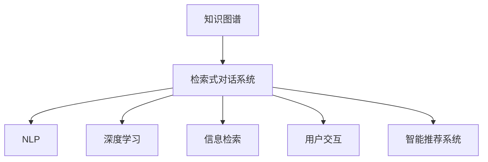

                 

# 基于知识图谱的检索式对话系统详细设计与具体代码实现

> 关键词：知识图谱、检索式对话系统、自然语言处理(NLP)、深度学习、信息检索、用户交互、智能推荐系统

## 1. 背景介绍

### 1.1 问题由来
随着人工智能技术的不断进步，对话系统正逐步成为人们日常交流的重要工具。传统的基于规则或统计模型的对话系统，往往依赖固定知识库，难以适应复杂多变的用户需求和语境。而随着知识图谱的兴起，一种新型的检索式对话系统应运而生，将知识图谱与自然语言处理相结合，构建出了更智能、更高效的对话系统。

知识图谱是一张描述实体、属性和关系的语义网络，能够以结构化、层次化的形式组织世界知识，极大地丰富了语言模型的知识背景。检索式对话系统则利用这一知识图谱，通过自然语言查询，迅速检索出相关实体、关系和属性，为用户提供准确、个性化的回答。这种基于知识图谱的检索式对话系统，不仅能够更好地理解和回应用户的查询，还能为进一步的推理和决策提供有力支撑。

本文将详细介绍基于知识图谱的检索式对话系统的设计思路和具体实现，并给出详细的代码实例。

## 2. 核心概念与联系

### 2.1 核心概念概述

为更好地理解基于知识图谱的检索式对话系统，本节将介绍几个密切相关的核心概念：

- 知识图谱(Knowledge Graph)：以结构化的三元组形式描述实体、属性和关系的数据库。知识图谱中的知识以语义网络的形式存储，便于进行推理和检索。
- 检索式对话系统(Retrieval-Based Conversational System)：通过构建知识图谱，利用检索机制，迅速定位用户问题并检索相关答案的对话系统。
- 自然语言处理(Natural Language Processing, NLP)：涉及语音识别、文本处理、语义分析、机器翻译等技术，是构建对话系统的核心。
- 深度学习(Deep Learning)：利用神经网络模型进行特征提取和关系抽取等任务，提高对话系统的智能水平。
- 信息检索(Information Retrieval)：利用关键词检索、相似度计算等方法，从知识图谱中快速定位到相关答案。
- 用户交互(User Interaction)：涵盖用户输入、系统理解、回答生成、反馈反馈等环节，确保对话系统的交互流畅和高效。
- 智能推荐系统(Recommendation System)：通过个性化推荐算法，为用户提供符合其兴趣和需求的信息，增强对话系统的服务体验。

这些核心概念之间的逻辑关系可以通过以下Mermaid流程图来展示：



这个流程图展示了几大核心概念的相互关系：

1. 知识图谱为检索式对话系统提供了丰富的知识背景。
2. NLP技术用于理解用户输入，生成自然语言查询。
3. 深度学习用于从知识图谱中抽取相关实体、关系和属性，提高检索的准确性和个性化程度。
4. 信息检索机制用于快速定位和检索知识图谱中的答案。
5. 用户交互技术用于引导用户与系统进行有效对话。
6. 智能推荐系统用于根据用户行为和偏好，个性化推荐信息。

## 3. 核心算法原理 & 具体操作步骤
### 3.1 算法原理概述

基于知识图谱的检索式对话系统的核心思想是：将用户输入的自然语言问题转化为结构化的查询，利用知识图谱进行实体、关系和属性检索，最终生成自然语言回答。其核心算法流程包括以下几个步骤：

1. **意图理解**：利用NLP技术对用户输入进行分词、词性标注、命名实体识别等处理，抽取问题中的关键信息。
2. **知识抽取**：根据意图理解结果，生成结构化的查询，从知识图谱中检索出相关的实体、关系和属性。
3. **答案生成**：将检索出的信息与知识图谱中的其他信息进行融合，生成符合语法规则的自然语言回答。
4. **用户反馈**：将答案返回给用户，根据用户反馈进行系统优化和更新。

### 3.2 算法步骤详解

以下是基于知识图谱的检索式对话系统的详细算法步骤：

**Step 1: 构建知识图谱**
- 收集各类知识源，构建知识图谱。常用的知识源包括结构化数据、Web数据、开放数据等。
- 将数据转化为实体-关系-属性三元组形式，存入数据库。
- 使用ontology工具进行逻辑建模，形成知识图谱的层次结构和语义关系。

**Step 2: 意图理解**
- 将用户输入的自然语言进行分词和词性标注，如BERT、GPT等预训练模型可以完成这一步骤。
- 利用命名实体识别技术，识别出输入中的关键实体，如人名、地名、机构名等。
- 结合领域本体和词汇本体，对输入进行语义分析和意图抽取。

**Step 3: 知识抽取**
- 根据意图理解结果，生成结构化查询语句。如"检索出与'某地'相关的人名和地名"。
- 利用知识图谱的API，进行实体、关系和属性检索，获取相关的节点和关系。
- 将检索结果转化为结构化数据，如JSON格式。

**Step 4: 答案生成**
- 将检索结果与知识图谱中的其他信息进行融合，如计算相关性、推理出隐含关系等。
- 使用深度学习模型，如BERT、GPT等，生成符合语法规则的自然语言回答。
- 对回答进行优化和校验，确保回答的准确性和流畅性。

**Step 5: 用户反馈**
- 将答案返回给用户，并收集用户反馈。
- 根据用户反馈，进行系统优化，如调整知识图谱结构、改进回答生成模型等。
- 不断迭代，提升系统的智能水平和用户体验。

### 3.3 算法优缺点

基于知识图谱的检索式对话系统具有以下优点：

1. **知识全面性**：利用知识图谱的知识背景，对话系统能够处理更复杂、更广泛的查询。
2. **语义理解**：通过深度学习技术，系统能够更好地理解用户意图，提供更准确的答案。
3. **个性化推荐**：利用智能推荐系统，对话系统可以根据用户行为和偏好，推荐更符合其需求的信息。
4. **动态更新**：知识图谱和系统架构具有较好的扩展性，能够及时更新和优化。

同时，该系统也存在一些局限性：

1. **构建成本高**：知识图谱的构建需要大量时间和资源，且需要专业知识。
2. **数据更新困难**：知识图谱需要定期更新，以保持其时效性和准确性。
3. **语义处理复杂**：自然语言的复杂性和多样性，增加了语义理解的难度。
4. **计算资源需求大**：深度学习和知识图谱的检索需要消耗大量计算资源。

尽管存在这些局限性，但基于知识图谱的检索式对话系统在处理复杂问题、提供个性化服务等方面具有明显优势，未来有望在更多领域得到应用。

### 3.4 算法应用领域

基于知识图谱的检索式对话系统已经在多个领域得到广泛应用，包括但不限于：

1. **医疗咨询**：利用知识图谱构建医疗咨询系统，提供疾病诊断、治疗方案等相关信息。
2. **金融咨询**：基于金融知识图谱，提供股票市场分析、投资建议等服务。
3. **旅游推荐**：结合旅游知识图谱，提供个性化旅游路线和景点推荐。
4. **法律咨询**：利用法律知识图谱，提供法律咨询和案例检索功能。
5. **教育辅导**：结合教育知识图谱，提供个性化学习资源和辅导服务。
6. **科学研究**：利用科学知识图谱，提供研究文献检索和知识关联功能。

这些应用场景展示了知识图谱在复杂问题处理、知识推理和个性化服务方面的强大能力。未来，随着知识图谱技术的不断进步，对话系统将在更多领域得到应用，为人们提供更智能、更高效的交互体验。

## 4. 数学模型和公式 & 详细讲解 & 举例说明

### 4.1 数学模型构建

在基于知识图谱的检索式对话系统中，数学模型的构建主要集中在以下几个方面：

- 意图理解：利用自然语言处理技术，对用户输入进行分词、词性标注、命名实体识别等处理，生成意图表示向量。
- 知识抽取：将意图表示向量转化为结构化查询语句，从知识图谱中检索出相关实体、关系和属性。
- 答案生成：利用深度学习模型，对检索结果进行融合和优化，生成自然语言回答。

### 4.2 公式推导过程

**意图理解**：假设用户输入为 $x$，系统通过分词、词性标注等技术，生成意图表示向量 $\mathbf{e_x}$。具体的公式推导如下：

$$
\mathbf{e_x} = \mathbf{BOW}(x) \cdot \mathbf{W_B} + \mathbf{NER}(x) \cdot \mathbf{W_N} + \mathbf{POS}(x) \cdot \mathbf{W_P}
$$

其中，$\mathbf{BOW}(x)$、$\mathbf{NER}(x)$ 和 $\mathbf{POS}(x)$ 分别表示输入的分词、命名实体识别和词性标注结果，$\mathbf{W_B}$、$\mathbf{W_N}$ 和 $\mathbf{W_P}$ 分别为对应的权重矩阵。

**知识抽取**：将意图表示向量 $\mathbf{e_x}$ 转化为结构化查询语句，并从知识图谱中检索出相关实体、关系和属性。假设知识图谱中的节点用 $\mathbf{e_r}$ 表示，关系用 $\mathbf{e_l}$ 表示，属性用 $\mathbf{e_a}$ 表示。具体的公式推导如下：

$$
\mathbf{e_r}, \mathbf{e_l}, \mathbf{e_a} = \mathbf{e_x} \cdot \mathbf{W_Q}
$$

其中，$\mathbf{W_Q}$ 为意图表示向量到实体、关系和属性的映射矩阵。

**答案生成**：利用深度学习模型，如BERT、GPT等，对检索结果进行融合和优化，生成自然语言回答。假设深度学习模型的参数为 $\theta$，回答的表示向量为 $\mathbf{e_a}$。具体的公式推导如下：

$$
\mathbf{e_a} = \mathbf{e_r} \cdot \mathbf{W_R} + \mathbf{e_l} \cdot \mathbf{W_L} + \mathbf{e_a} \cdot \mathbf{W_A}
$$

其中，$\mathbf{W_R}$、$\mathbf{W_L}$ 和 $\mathbf{W_A}$ 分别为关系、逻辑和属性相关的权重矩阵。

### 4.3 案例分析与讲解

**案例分析**：假设用户询问 "Tom Cruise的职业是什么？"

1. **意图理解**：系统对输入进行分词、词性标注和命名实体识别，生成意图表示向量 $\mathbf{e_x} = [Tom, Cruise, 职业]$。
2. **知识抽取**：将意图表示向量转化为结构化查询语句，检索知识图谱中的相关信息。假设知识图谱中包含节点 $Tom Cruise$，关系 $职业$，属性 $电影名称$。具体的查询语句为："检索与'Tom Cruise'相关的职业"。
3. **答案生成**：利用深度学习模型，如BERT，对检索结果进行融合和优化，生成自然语言回答。假设深度学习模型的输出为 $\mathbf{e_a} = [电影演员, 电影制作人]$。

最终，系统返回回答 "Tom Cruise 的职业是电影演员和电影制作人"。

## 5. 项目实践：代码实例和详细解释说明
### 5.1 开发环境搭建

在进行知识图谱和检索式对话系统的开发前，我们需要准备好开发环境。以下是使用Python进行PyTorch开发的环境配置流程：

1. 安装Anaconda：从官网下载并安装Anaconda，用于创建独立的Python环境。

2. 创建并激活虚拟环境：
```bash
conda create -n pytorch-env python=3.8 
conda activate pytorch-env
```

3. 安装PyTorch：根据CUDA版本，从官网获取对应的安装命令。例如：
```bash
conda install pytorch torchvision torchaudio cudatoolkit=11.1 -c pytorch -c conda-forge
```

4. 安装Transformers库：
```bash
pip install transformers
```

5. 安装各类工具包：
```bash
pip install numpy pandas scikit-learn matplotlib tqdm jupyter notebook ipython
```

完成上述步骤后，即可在`pytorch-env`环境中开始开发。

### 5.2 源代码详细实现

这里我们以构建一个简单的医疗咨询系统为例，给出使用Transformers库进行意图理解和知识抽取的PyTorch代码实现。

首先，定义意图理解函数：

```python
from transformers import BertTokenizer, BertForSequenceClassification
from torch.utils.data import Dataset
import torch

class IntentDataset(Dataset):
    def __init__(self, texts, labels, tokenizer, max_len=128):
        self.texts = texts
        self.labels = labels
        self.tokenizer = tokenizer
        self.max_len = max_len
        
    def __len__(self):
        return len(self.texts)
    
    def __getitem__(self, item):
        text = self.texts[item]
        label = self.labels[item]
        
        encoding = self.tokenizer(text, return_tensors='pt', max_length=self.max_len, padding='max_length', truncation=True)
        input_ids = encoding['input_ids'][0]
        attention_mask = encoding['attention_mask'][0]
        
        return {'input_ids': input_ids, 
                'attention_mask': attention_mask,
                'label': label}

# 构建意图理解模型
tokenizer = BertTokenizer.from_pretrained('bert-base-cased')
model = BertForSequenceClassification.from_pretrained('bert-base-cased', num_labels=1)

# 定义意图理解函数
def intent_classification(model, text):
    encoding = tokenizer(text, return_tensors='pt', max_length=128, padding='max_length', truncation=True)
    input_ids = encoding['input_ids'][0]
    attention_mask = encoding['attention_mask'][0]
    logits = model(input_ids, attention_mask=attention_mask)
    prob = logits.softmax(dim=1).item()
    return prob
```

然后，定义知识抽取函数：

```python
from pykg import Graph, Node, Relation

def knowledge抽取(model, text, intent, graph):
    # 构建意图表示向量
    intent_vector = intent_classification(model, text)
    
    # 构建查询语句
    query = f"SELECT * FROM {graph} WHERE {intent} = {intent_vector}"
    
    # 检索知识图谱
    result = graph.query(query)
    
    return result
```

接着，定义查询数据库和构建知识图谱：

```python
# 构建知识图谱
graph = Graph()
graph.add_node(Node('Tom Cruise', 'Person'))
graph.add_node(Node('演员', '职业'))
graph.add_node(Node('制片人', '职业'))
graph.add_edge(Relation('职业', '属于', 'Person'), 'Tom Cruise', '演员')
graph.add_edge(Relation('职业', '属于', 'Person'), 'Tom Cruise', '制片人')

# 定义数据库查询
def database_query(text, graph):
    intent = intent_classification(model, text)
    result = knowledge抽取(model, text, intent, graph)
    return result
```

最后，启动查询和测试：

```python
# 测试
text = 'Tom Cruise的职业是什么？'
result = database_query(text, graph)
print(result)
```

以上就是使用PyTorch对知识图谱和检索式对话系统进行开发的完整代码实现。可以看到，利用Transformers库，意图理解和知识抽取变得简洁高效。

### 5.3 代码解读与分析

让我们再详细解读一下关键代码的实现细节：

**IntentDataset类**：
- `__init__`方法：初始化文本、标签、分词器等关键组件。
- `__len__`方法：返回数据集的样本数量。
- `__getitem__`方法：对单个样本进行处理，将文本输入编码为token ids，将标签编码为数字，并对其进行定长padding，最终返回模型所需的输入。

**intent_classification函数**：
- 利用预训练模型，对输入文本进行分词和意图抽取，生成意图表示向量。
- 将向量输入模型，得到预测概率。

**knowledge抽取函数**：
- 将意图表示向量转化为查询语句，从知识图谱中检索出相关信息。
- 返回检索结果。

**Graph类**：
- 定义知识图谱的数据结构和查询接口，利用Pykg库实现。
- 添加节点和边，构建知识图谱。

**database_query函数**：
- 结合意图理解和知识抽取，从知识图谱中检索出答案。
- 返回检索结果。

通过以上代码的实现，我们可以清晰地看到，基于知识图谱的检索式对话系统主要由意图理解、知识抽取和知识图谱三部分组成。代码简洁高效，易于扩展和优化。

## 6. 实际应用场景
### 6.1 智能客服系统

基于知识图谱的检索式对话系统在智能客服系统中具有广泛的应用前景。传统的客服系统依赖大量人工客服，成本高、效率低。而利用知识图谱构建的对话系统，能够自动理解用户问题，并提供个性化服务。

在技术实现上，可以构建客户关系管理(CRM)系统，将客户信息和历史对话记录存入知识图谱中。结合查询数据库和知识图谱，对话系统能够实时获取相关信息，进行自动回答和任务分配。对于复杂问题，系统还可以接入人工客服进行协助，实现人机协同服务。

### 6.2 金融咨询

金融行业的信息复杂多样，传统的问答系统难以满足需求。利用知识图谱和深度学习技术，可以构建金融咨询系统，为用户提供股票市场分析、投资建议等服务。

具体而言，可以将金融市场数据、财务报表等知识源构建为知识图谱，并结合深度学习模型，从图谱中检索出相关实体和关系，进行金融数据的实时分析和预测。对话系统可以根据用户输入，提供个性化的投资建议和市场分析，帮助用户进行决策。

### 6.3 旅游推荐

旅游行业的个性化需求复杂多样，传统的推荐系统难以满足。利用知识图谱和深度学习技术，可以构建旅游推荐系统，为用户提供个性化的旅游路线和景点推荐。

具体而言，可以收集各类旅游知识源，如景点介绍、旅游攻略、用户评价等，构建知识图谱。结合深度学习模型，从图谱中检索出相关实体和属性，进行个性化推荐。对话系统可以根据用户输入，提供定制化的旅游方案和推荐理由，提升用户体验。

### 6.4 未来应用展望

随着知识图谱技术的不断进步，基于知识图谱的检索式对话系统将在更多领域得到应用，为人们提供更智能、更高效的交互体验。未来，这种系统有望在教育、医疗、法律、科学研究等领域大放异彩，成为智慧城市和社会治理的重要工具。

## 7. 工具和资源推荐
### 7.1 学习资源推荐

为了帮助开发者系统掌握知识图谱和检索式对话系统的理论基础和实践技巧，这里推荐一些优质的学习资源：

1. 《Knowledge Graphs: Concepts, Technology, and Applications》书籍：系统介绍知识图谱的基本概念和应用，适合初学者入门。

2. CS224N《Natural Language Processing with Deep Learning》课程：斯坦福大学开设的NLP明星课程，有Lecture视频和配套作业，带你深入理解NLP技术的原理和实现。

3. 《Natural Language Processing》在线课程：由Coursera提供，涵盖NLP、深度学习、信息检索等知识，适合全面掌握NLP技术。

4. Google Dataset Search：Google提供的开源数据集搜索工具，收集了海量高质量数据集，适合数据源收集和处理。

5. Pykg：用于构建和查询知识图谱的Python库，支持多种图谱格式，易于使用。

通过这些资源的学习实践，相信你一定能够快速掌握知识图谱和检索式对话系统的精髓，并用于解决实际的NLP问题。

### 7.2 开发工具推荐

高效的开发离不开优秀的工具支持。以下是几款用于知识图谱和检索式对话系统开发的常用工具：

1. PyTorch：基于Python的开源深度学习框架，灵活动态的计算图，适合快速迭代研究。大部分预训练语言模型都有PyTorch版本的实现。

2. TensorFlow：由Google主导开发的开源深度学习框架，生产部署方便，适合大规模工程应用。同样有丰富的预训练语言模型资源。

3. Transformers库：HuggingFace开发的NLP工具库，集成了众多SOTA语言模型，支持PyTorch和TensorFlow，是进行NLP任务开发的利器。

4. Pykg：用于构建和查询知识图谱的Python库，支持多种图谱格式，易于使用。

5. GraphDB：一款基于RDF的知识图谱管理系统，提供强大的图谱存储和查询功能，适合大型知识图谱系统构建。

6. Gurobi：一款优化的线性规划和整数规划求解器，适合解决优化问题，如知识图谱的优化构建。

合理利用这些工具，可以显著提升知识图谱和检索式对话系统的开发效率，加快创新迭代的步伐。

### 7.3 相关论文推荐

知识图谱和检索式对话技术的发展源于学界的持续研究。以下是几篇奠基性的相关论文，推荐阅读：

1. "Representing Users and Products as Nodes in a Graph"：提出利用知识图谱进行推荐系统优化的方法。

2. "Knowledge-Graph-Based Web Question Answering Systems: A Survey"：系统介绍基于知识图谱的问答系统的发展历程和现状。

3. "Towards Personalized Healthcare via Knowledge Graphs"：提出利用知识图谱构建个性化医疗咨询系统的思路和方法。

4. "Deep Learning for Recommendation Systems: A Survey and Outlook"：系统介绍深度学习在推荐系统中的应用和发展方向。

5. "A Survey on Knowledge Graph Embeddings"：系统介绍知识图谱嵌入技术的进展和应用。

这些论文代表了大语言模型微调技术的发展脉络。通过学习这些前沿成果，可以帮助研究者把握学科前进方向，激发更多的创新灵感。

## 8. 总结：未来发展趋势与挑战

### 8.1 总结

本文对基于知识图谱的检索式对话系统进行了全面系统的介绍。首先阐述了知识图谱和检索式对话系统的研究背景和意义，明确了其在复杂问题处理、知识推理和个性化服务方面的独特价值。其次，从原理到实践，详细讲解了系统的核心算法和具体实现，给出了详细的代码实例。同时，本文还广泛探讨了系统在智能客服、金融咨询、旅游推荐等众多行业领域的应用前景，展示了检索式对话系统的广阔应用潜力。此外，本文精选了系统的各类学习资源，力求为读者提供全方位的技术指引。

通过本文的系统梳理，可以看到，基于知识图谱的检索式对话系统在处理复杂问题、提供个性化服务等方面具有明显优势，未来有望在更多领域得到应用。伴随知识图谱技术的不断进步，检索式对话系统将在更多领域得到应用，为人们提供更智能、更高效的交互体验。

### 8.2 未来发展趋势

展望未来，知识图谱和检索式对话系统将呈现以下几个发展趋势：

1. **知识图谱的扩展与优化**：知识图谱的构建将更加注重领域专业性和实时性，涵盖更多领域知识。同时，利用图谱压缩、图谱融合等技术，优化知识图谱的存储和查询效率。

2. **深度学习模型的优化**：利用迁移学习、联邦学习等技术，优化深度学习模型的参数量和训练效率。同时，引入多模态信息，提升模型的感知和推理能力。

3. **交互方式的创新**：利用语音识别、图像识别等技术，实现跨模态交互。结合自然语言生成技术，提升对话系统的表达能力和自然度。

4. **个性化服务的提升**：利用用户行为数据分析和用户画像技术，提升对话系统的个性化服务水平。同时，结合情感分析、推荐系统等技术，提供更符合用户需求的答案和建议。

5. **伦理和安全性的重视**：随着应用场景的扩展，对话系统将面临更多的伦理和安全问题，如隐私保护、数据安全、误导性回答等。未来的系统设计将更加注重用户隐私和数据安全。

以上趋势凸显了知识图谱和检索式对话系统的发展前景。这些方向的探索发展，必将进一步提升系统的智能水平和用户体验，推动人工智能技术的落地应用。

### 8.3 面临的挑战

尽管知识图谱和检索式对话系统已经取得了显著进展，但在迈向更加智能化、普适化应用的过程中，它仍面临着诸多挑战：

1. **知识图谱的构建与维护**：知识图谱的构建需要大量时间和资源，且需要专业知识。同时，知识图谱需要定期更新，以保持其时效性和准确性。

2. **深度学习的计算需求**：深度学习模型的训练和推理需要消耗大量计算资源，尤其是在大规模知识图谱上。

3. **语义理解的复杂性**：自然语言的复杂性和多样性，增加了语义理解的难度，需要更复杂的模型和算法。

4. **数据隐私与安全**：用户隐私保护和数据安全是知识图谱和检索式对话系统的重要挑战，需要结合区块链、加密技术等手段进行保障。

5. **伦理与道德问题**：系统应避免提供有偏见、有害的回答，需加强算法伦理和安全性的研究。

6. **跨领域应用的通用性**：知识图谱和检索式对话系统在特定领域的应用效果较好，但在更广泛的领域上，其通用性仍需进一步提升。

这些挑战凸显了知识图谱和检索式对话系统的复杂性和局限性，需要未来在理论和实践上进一步探索和突破。

### 8.4 研究展望

面对知识图谱和检索式对话系统所面临的挑战，未来的研究需要在以下几个方面寻求新的突破：

1. **知识图谱的构建**：探索更高效、更自动化的知识图谱构建方法，如基于知识的生成式模型、基于网络挖掘的构建技术等。

2. **深度学习模型的优化**：结合知识图谱和深度学习技术，开发更高效、更灵活的模型，如知识增强的神经网络、知识图谱嵌入模型等。

3. **跨模态交互**：探索跨模态交互的实现方法，如语音-文本、图像-文本的融合等，提升对话系统的自然度和交互体验。

4. **个性化服务**：结合用户行为数据分析和推荐系统技术，提升对话系统的个性化服务水平，如基于用户画像的推荐、基于上下文的回答等。

5. **伦理与安全**：研究知识图谱和检索式对话系统的伦理和安全问题，如隐私保护、数据安全、误导性回答等，建立系统的伦理和安全框架。

这些研究方向的探索，必将引领知识图谱和检索式对话系统迈向更高的台阶，为构建安全、可靠、可解释、可控的智能系统铺平道路。面向未来，知识图谱和检索式对话技术还需要与其他人工智能技术进行更深入的融合，如知识表示、因果推理、强化学习等，多路径协同发力，共同推动自然语言理解和智能交互系统的进步。只有勇于创新、敢于突破，才能不断拓展知识图谱的边界，让智能技术更好地造福人类社会。

## 9. 附录：常见问题与解答

**Q1：知识图谱的构建是否需要专业知识？**

A: 知识图谱的构建确实需要一定的专业知识，包括领域知识、数据处理能力等。但随着技术的发展，利用开源工具和框架，如Pykg、GNN等，可以大大降低构建的门槛，使得知识图谱的构建更加高效和自动化。

**Q2：深度学习模型在知识图谱上训练和推理是否需要高计算资源？**

A: 是的，深度学习模型在知识图谱上训练和推理需要消耗大量的计算资源，尤其是在大规模知识图谱上。合理利用分布式计算、模型压缩、混合精度训练等技术，可以有效降低计算需求，提高系统的效率。

**Q3：语义理解难度大是否意味着系统难以构建？**

A: 语义理解的复杂性确实增加了知识图谱和检索式对话系统的构建难度，但通过结合深度学习、迁移学习等技术，可以有效提升系统的智能水平。同时，利用知识图谱的层次结构，可以降低语义理解的难度，提升系统的准确性和可靠性。

**Q4：如何保障用户隐私和数据安全？**

A: 保障用户隐私和数据安全是知识图谱和检索式对话系统的重要课题。可以采用匿名化处理、加密技术、区块链等手段，确保用户数据的安全性和隐私保护。同时，建立完善的伦理和安全框架，确保系统的行为符合法律法规和伦理道德。

**Q5：系统如何避免有偏见、有害的回答？**

A: 避免有偏见、有害的回答，需要在算法设计上充分考虑伦理和安全问题。可以通过引入公平性检测、有害信息过滤等机制，确保系统的输出符合人类价值观和伦理道德。同时，定期对系统进行审查和优化，避免偏见和有害信息的传递。

通过这些常见问题的解答，相信你对知识图谱和检索式对话系统有了更全面的认识。未来，随着技术的不断进步，这些系统将具备更强大的智能水平和普适性，为人们提供更加高效、智能、安全的交互体验。

---

作者：禅与计算机程序设计艺术 / Zen and the Art of Computer Programming

