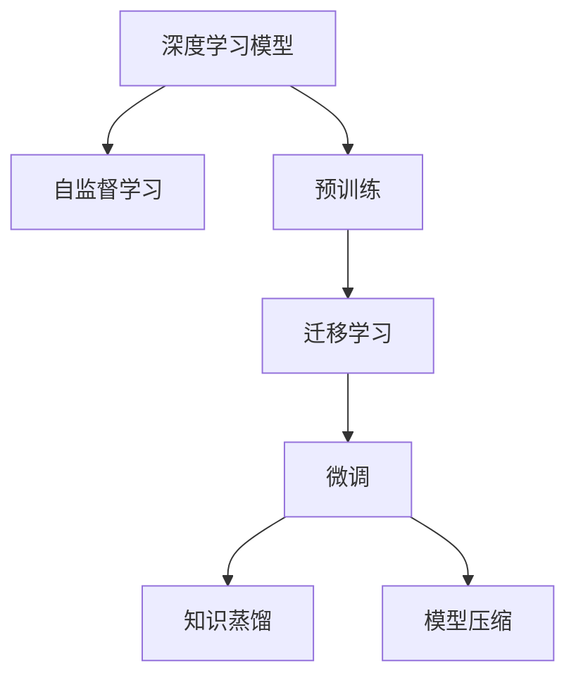

                 

# 基础模型在AI中的兴起

> 关键词：基础模型, 深度学习, 预训练, 迁移学习, 自监督学习, 知识蒸馏, 模型压缩, 计算机视觉

## 1. 背景介绍

### 1.1 问题由来
近年来，深度学习技术迅速崛起，成为了人工智能(AI)领域的主流技术。其中，基础模型(Foundation Model)的应用日益广泛，极大地提升了AI系统的性能和效率。基础模型是一种在大型数据集上进行预训练，然后通过微调适应特定任务的大规模深度学习模型。

### 1.2 问题核心关键点
基础模型的兴起背后，是基于大数据和强大算力驱动的自监督预训练技术的突破。自监督预训练是一种在大规模无标签数据上，通过构建自监督任务(如掩码语言模型、对比预测等)进行模型训练的方法。该方法可以高效地学习到数据的底层表示，具有泛化能力强、通用性高、适应性好的优点。

基础模型一般包括两个步骤：
1. **预训练**：在大规模无标签数据上训练模型，学习通用的知识表示。
2. **微调**：在特定任务上微调预训练模型，适应具体应用场景。

这种从大规模预训练到特定任务微调的双阶段训练策略，极大地提高了模型的性能和泛化能力，成为了AI技术发展的重要里程碑。

### 1.3 问题研究意义
基础模型的兴起，为AI领域带来了革命性的变化，具有重要的研究意义：

1. **显著提升性能**：通过自监督预训练，基础模型可以在相对较少的标注数据上进行微调，达到甚至超越从头训练的效果。
2. **泛化能力强**：基础模型在多个领域和任务上具有高度的泛化能力，能够适应不同数据分布和领域差异。
3. **成本低廉**：相比于从头训练，基础模型可以大幅降低数据标注和算力投入，提升研究和应用的可行性。
4. **加速创新**：基础模型提供了强大的预训练知识库，加速了新模型和新算法的开发和部署。

总之，基础模型作为一种高效、泛化、灵活的深度学习模型，正在引领AI技术的突破和创新，为各行各业带来了前所未有的机遇。

## 2. 核心概念与联系

### 2.1 核心概念概述

为更好地理解基础模型的工作原理和优化方向，本节将介绍几个密切相关的核心概念：

- **深度学习模型**：以神经网络为代表的深度学习模型，能够自动学习数据的特征表示，用于图像、语音、文本等多种数据类型的处理。
- **自监督学习**：通过无标签数据训练模型，利用数据的结构信息进行自我监督，学习到数据的底层表示。
- **预训练**：在大规模无标签数据上训练模型，学习通用的知识表示。
- **迁移学习**：将一个领域学到的知识迁移到另一个领域的应用，通过微调模型以适应特定任务。
- **知识蒸馏**：将大模型的知识转移给小模型，提升小模型的性能和泛化能力。
- **模型压缩**：通过剪枝、量化等技术，减小模型的参数和计算量，提升模型推理效率。

这些核心概念之间的逻辑关系可以通过以下Mermaid流程图来展示：



这个流程图展示了大模型的工作流程：

1. 深度学习模型通过自监督学习任务在无标签数据上进行预训练，学习通用的知识表示。
2. 预训练模型通过迁移学习适应特定任务，进行微调。
3. 微调后的模型通过知识蒸馏进一步提升性能和泛化能力。
4. 最后，通过模型压缩优化推理效率。

这些概念共同构成了基础模型的工作框架，使其能够在各种场景下发挥强大的功能。通过理解这些核心概念，我们可以更好地把握基础模型的工作原理和优化方向。

## 3. 核心算法原理 & 具体操作步骤
### 3.1 算法原理概述

基础模型的核心思想是通过自监督预训练学习通用的知识表示，然后在特定任务上进行微调，以适应具体应用场景。其核心算法包括自监督预训练和迁移学习微调两个阶段。

**自监督预训练**：通过无标签数据训练模型，学习到数据的底层表示。常见的自监督预训练任务包括掩码语言模型、对比预测、视觉生成等。

**迁移学习微调**：在特定任务上微调预训练模型，适应具体应用场景。常见的微调任务包括分类、匹配、生成等。

### 3.2 算法步骤详解

基础模型的训练流程一般包括以下几个关键步骤：

**Step 1: 准备数据和模型**
- 收集大规模无标签数据集，作为自监督预训练的输入。
- 选择或构建深度学习模型，如Transformer、ResNet等，作为预训练模型的架构。

**Step 2: 设计自监督预训练任务**
- 根据模型架构设计自监督预训练任务，如掩码语言模型、对比预测等。
- 对模型进行前向传播，计算损失函数。
- 使用反向传播算法更新模型参数。

**Step 3: 预训练模型**
- 在无标签数据集上进行自监督预训练，学习模型的底层表示。
- 重复预训练过程，直至模型收敛或达到预设的训练轮数。

**Step 4: 选择微调任务**
- 根据具体应用场景选择微调任务，如文本分类、图像识别等。
- 准备标注数据集，作为微调的监督信号。

**Step 5: 微调模型**
- 将预训练模型作为初始化参数，进行微调任务训练。
- 在微调过程中，选择合适的学习率、正则化技术等超参数。
- 周期性在验证集上评估模型性能，防止过拟合。

**Step 6: 评估和优化**
- 在测试集上评估微调后模型的性能。
- 根据测试结果优化模型超参数，提升模型效果。

**Step 7: 部署和应用**
- 将优化后的模型部署到实际应用场景中。
- 持续收集新数据，定期重新微调模型，以保持模型性能。

以上是基础模型的完整训练流程。在实际应用中，还需要根据具体任务的特点，对预训练和微调过程进行优化设计，以进一步提升模型性能。

### 3.3 算法优缺点

基础模型作为一种高效的深度学习技术，具有以下优点：
1. 泛化能力强。通过自监督预训练学习到通用的知识表示，能够适应不同任务和数据分布。
2. 性能优异。在大规模数据集上进行预训练，模型能够学习到丰富的语义和视觉特征，提升特定任务的精度。
3. 适应性强。基础模型可以在多种硬件和软件中高效部署，具备较高的迁移能力和应用灵活性。

同时，基础模型也存在一定的局限性：
1. 对计算资源要求高。大规模预训练和微调需要强大的计算能力，增加了系统的成本和复杂度。
2. 数据依赖性强。基础模型的性能高度依赖于无标签数据的规模和质量，数据获取和标注成本较高。
3. 模型复杂度高。基础模型的结构复杂，推理速度较慢，增加了系统的响应时间。
4. 模型解释性差。基础模型通常被视为"黑盒"，难以解释其内部工作机制，不利于某些领域的应用需求。

尽管存在这些局限性，但就目前而言，基础模型依然是大规模深度学习技术的重要范式，被广泛应用于计算机视觉、自然语言处理、语音识别等多个领域。

### 3.4 算法应用领域

基础模型在多个领域和任务上得到了广泛的应用，具体如下：

**计算机视觉**：通过预训练学习图像特征表示，在目标检测、图像分类、语义分割等任务上取得了优异的效果。

**自然语言处理**：通过预训练学习语言特征表示，在文本分类、命名实体识别、情感分析等任务上取得了显著提升。

**语音识别**：通过预训练学习语音特征表示，在语音识别、情感分析等任务上取得了较低的词错误率和较高的语音识别准确率。

**推荐系统**：通过预训练学习用户行为和物品特征表示，在推荐算法中取得了更好的推荐效果和更低的计算成本。

除了上述这些经典任务外，基础模型也被创新性地应用到更多场景中，如可控图像生成、多模态学习、生成对抗网络等，为AI技术带来了全新的突破。

## 4. 数学模型和公式 & 详细讲解  
### 4.1 数学模型构建

本节将使用数学语言对基础模型的训练过程进行更加严格的刻画。

记基础模型为 $M_{\theta}$，其中 $\theta$ 为模型参数。假设预训练任务为 $T$，训练数据集为 $D=\{(x_i, y_i)\}_{i=1}^N$，其中 $x_i$ 为输入数据，$y_i$ 为标签。

定义预训练任务 $T$ 的损失函数为 $\mathcal{L}_T(\theta)$，则预训练目标为最小化损失函数：

$$
\theta^* = \mathop{\arg\min}_{\theta} \mathcal{L}_T(\theta)
$$

在预训练完成后，模型 $M_{\theta}$ 被应用到特定任务 $S$ 上进行微调。假设微调任务 $S$ 的训练数据集为 $D_S=\{(x_i, y_i)\}_{i=1}^M$，定义微调任务 $S$ 的损失函数为 $\mathcal{L}_S(\theta)$，则微调目标为最小化损失函数：

$$
\theta^S = \mathop{\arg\min}_{\theta} \mathcal{L}_S(\theta)
$$

微调过程中，可以采用有监督学习、半监督学习、无监督学习等多种方式进行。但一般使用有监督学习，即在微调数据集上，使用交叉熵等损失函数，对模型进行优化。

### 4.2 公式推导过程

以下我们以图像分类任务为例，推导基础模型的预训练和微调过程的数学模型。

**预训练过程**：
假设预训练任务为掩码语言模型，即在输入 $x$ 上的输出 $y$ 为掩码的概率分布。定义预训练损失函数为：

$$
\mathcal{L}_T(\theta) = -\frac{1}{N}\sum_{i=1}^N \log \frac{\exp(y_i \log M_{\theta}(x_i))}{\sum_{k=1}^K \exp(y_k \log M_{\theta}(x_i))}
$$

其中 $K$ 为掩码种类，$M_{\theta}(x_i)$ 为模型在输入 $x_i$ 上的输出。

**微调过程**：
假设微调任务为图像分类，输入为图像 $x_i$，标签为 $y_i$。定义微调损失函数为交叉熵损失：

$$
\mathcal{L}_S(\theta) = -\frac{1}{M}\sum_{i=1}^M [y_i\log M_{\theta}(x_i)+(1-y_i)\log(1-M_{\theta}(x_i))]
$$

在预训练完成后，通过微调损失函数进行微调，更新模型参数 $\theta$：

$$
\theta \leftarrow \theta - \eta \nabla_{\theta}\mathcal{L}_S(\theta) - \eta\lambda\theta
$$

其中 $\eta$ 为学习率，$\lambda$ 为正则化系数，$\nabla_{\theta}\mathcal{L}_S(\theta)$ 为微调损失函数对参数 $\theta$ 的梯度。

在得到微调损失函数的梯度后，即可带入参数更新公式，完成模型的迭代优化。重复上述过程直至收敛，最终得到适应特定任务的优化模型参数 $\theta^S$。

## 5. 项目实践：代码实例和详细解释说明
### 5.1 开发环境搭建

在进行基础模型微调实践前，我们需要准备好开发环境。以下是使用Python进行PyTorch开发的环境配置流程：

1. 安装Anaconda：从官网下载并安装Anaconda，用于创建独立的Python环境。

2. 创建并激活虚拟环境：
```bash
conda create -n pytorch-env python=3.8 
conda activate pytorch-env
```

3. 安装PyTorch：根据CUDA版本，从官网获取对应的安装命令。例如：
```bash
conda install pytorch torchvision torchaudio cudatoolkit=11.1 -c pytorch -c conda-forge
```

4. 安装Transformers库：
```bash
pip install transformers
```

5. 安装各类工具包：
```bash
pip install numpy pandas scikit-learn matplotlib tqdm jupyter notebook ipython
```

完成上述步骤后，即可在`pytorch-env`环境中开始基础模型微调实践。

### 5.2 源代码详细实现

下面我们以图像分类任务为例，给出使用Transformers库对VGG模型进行微调的PyTorch代码实现。

首先，定义图像分类任务的数据处理函数：

```python
from transformers import VGG16ForImageClassification, AdamW

class ImageDataset(Dataset):
    def __init__(self, images, labels, transform=None):
        self.images = images
        self.labels = labels
        self.transform = transform
        
    def __len__(self):
        return len(self.images)
    
    def __getitem__(self, item):
        img = self.images[item]
        label = self.labels[item]
        if self.transform:
            img = self.transform(img)
        return {'image': img, 'label': label}

# 定义transform
transform = transforms.Compose([
    transforms.ToTensor(),
    transforms.Normalize(mean=[0.485, 0.456, 0.406], std=[0.229, 0.224, 0.225])
])
```

然后，定义模型和优化器：

```python
model = VGG16ForImageClassification.from_pretrained('vgg16')
optimizer = AdamW(model.parameters(), lr=1e-3)
```

接着，定义训练和评估函数：

```python
from torch.utils.data import DataLoader
from tqdm import tqdm
from sklearn.metrics import accuracy_score

device = torch.device('cuda') if torch.cuda.is_available() else torch.device('cpu')
model.to(device)

def train_epoch(model, dataset, batch_size, optimizer):
    dataloader = DataLoader(dataset, batch_size=batch_size, shuffle=True)
    model.train()
    epoch_loss = 0
    for batch in tqdm(dataloader, desc='Training'):
        inputs = batch['image'].to(device)
        labels = batch['label'].to(device)
        model.zero_grad()
        outputs = model(inputs)
        loss = outputs.loss
        epoch_loss += loss.item()
        loss.backward()
        optimizer.step()
    return epoch_loss / len(dataloader)

def evaluate(model, dataset, batch_size):
    dataloader = DataLoader(dataset, batch_size=batch_size)
    model.eval()
    preds, labels = [], []
    with torch.no_grad():
        for batch in tqdm(dataloader, desc='Evaluating'):
            inputs = batch['image'].to(device)
            batch_labels = batch['label']
            outputs = model(inputs)
            batch_preds = outputs.logits.argmax(dim=1).to('cpu').tolist()
            batch_labels = batch_labels.to('cpu').tolist()
            for pred, label in zip(batch_preds, batch_labels):
                preds.append(pred)
                labels.append(label)
    print('Accuracy:', accuracy_score(labels, preds))
```

最后，启动训练流程并在测试集上评估：

```python
epochs = 5
batch_size = 16

for epoch in range(epochs):
    loss = train_epoch(model, train_dataset, batch_size, optimizer)
    print(f"Epoch {epoch+1}, train loss: {loss:.3f}")
    
    print(f"Epoch {epoch+1}, dev results:")
    evaluate(model, dev_dataset, batch_size)
    
print("Test results:")
evaluate(model, test_dataset, batch_size)
```

以上就是使用PyTorch对VGG模型进行图像分类任务微调的完整代码实现。可以看到，得益于Transformers库的强大封装，我们可以用相对简洁的代码完成VGG模型的加载和微调。

### 5.3 代码解读与分析

让我们再详细解读一下关键代码的实现细节：

**ImageDataset类**：
- `__init__`方法：初始化图像数据集，包含图像和标签，并定义数据增强操作。
- `__len__`方法：返回数据集的样本数量。
- `__getitem__`方法：对单个样本进行处理，将图像输入转换为张量，并进行标准化处理。

**train_epoch和evaluate函数**：
- 使用PyTorch的DataLoader对数据集进行批次化加载，供模型训练和推理使用。
- 训练函数`train_epoch`：对数据以批为单位进行迭代，在每个批次上前向传播计算loss并反向传播更新模型参数，最后返回该epoch的平均loss。
- 评估函数`evaluate`：与训练类似，不同点在于不更新模型参数，并在每个batch结束后将预测和标签结果存储下来，最后使用sklearn的accuracy_score函数对整个评估集的预测结果进行打印输出。

**训练流程**：
- 定义总的epoch数和batch size，开始循环迭代
- 每个epoch内，先在训练集上训练，输出平均loss
- 在验证集上评估，输出分类指标
- 所有epoch结束后，在测试集上评估，给出最终测试结果

可以看到，PyTorch配合Transformers库使得VGG模型的微调代码实现变得简洁高效。开发者可以将更多精力放在数据处理、模型改进等高层逻辑上，而不必过多关注底层的实现细节。

当然，工业级的系统实现还需考虑更多因素，如模型的保存和部署、超参数的自动搜索、更灵活的任务适配层等。但核心的微调范式基本与此类似。

## 6. 实际应用场景
### 6.1 智能推荐系统

基于基础模型的推荐系统，可以广泛应用于电商、视频、新闻等多个领域。传统推荐系统往往只依赖用户的历史行为数据进行推荐，难以捕捉用户的真实兴趣和行为。基础模型通过学习大样本数据的底层表示，能够更好地理解用户的多样化需求和兴趣偏好，提供更个性化、多样化的推荐内容。

在技术实现上，可以收集用户浏览、点击、评价等行为数据，并提取和用户交互的物品标题、描述、标签等文本内容。将文本内容作为模型输入，用户的后续行为（如是否点击、购买等）作为监督信号，在此基础上对基础模型进行微调。微调后的模型能够从文本内容中准确把握用户的兴趣点。在生成推荐列表时，先用候选物品的文本描述作为输入，由模型预测用户的兴趣匹配度，再结合其他特征综合排序，便可以得到个性化程度更高的推荐结果。

### 6.2 医疗影像诊断

医疗影像诊断是一项具有挑战性的任务，传统的计算机视觉方法难以处理复杂的医学影像。基础模型通过在大规模医学影像数据上预训练，能够学习到丰富的医学知识表示，提升诊断的准确性和泛化能力。

在技术实现上，可以收集大量的医疗影像数据，并进行标注。在此基础上对基础模型进行微调，使其能够自动诊断医学影像，识别出异常区域和病变类型。微调后的模型可以作为医生的辅助工具，提高诊断的效率和准确性，为患者提供更好的医疗服务。

### 6.3 自动驾驶

自动驾驶是一项高度复杂的系统工程，需要融合计算机视觉、传感器数据等多个领域的技术。基础模型通过在大规模自动驾驶数据上预训练，能够学习到道路交通、车辆行为等特征，提升系统的感知和决策能力。

在技术实现上，可以将自动驾驶传感器数据（如摄像头、雷达、激光雷达等）作为输入，对基础模型进行微调，使其能够自动感知交通环境、识别行人和障碍物、规划行驶路径。微调后的模型可以作为自动驾驶系统的核心组件，提升系统的可靠性和安全性，加速自动驾驶技术的发展。

### 6.4 未来应用展望

随着基础模型的不断发展，其在AI领域的应用前景将更加广阔。

1. **跨模态学习**：基础模型有望在图像、文本、语音等多种模态之间进行知识迁移，形成更为全面、准确的信息表示。

2. **大模型融合**：通过将多个基础模型进行融合，构建更为复杂、强大的多模态模型，提升系统的综合性能。

3. **模型蒸馏**：通过将大模型的知识蒸馏给小型模型，提升小模型的性能和泛化能力，降低系统的计算成本。

4. **端到端学习**：通过端到端训练的方式，将预训练、微调、推理等过程进行一体化设计，提升系统的整体效率。

5. **持续学习**：随着数据分布的不断变化，基础模型需要不断学习新知识以保持性能。如何在不遗忘原有知识的同时，高效吸收新样本信息，将成为重要的研究课题。

6. **元学习**：通过元学习技术，使得基础模型具备适应新任务的能力，减少微调时间和成本。

这些方向的探索发展，必将进一步提升基础模型的性能和应用范围，为AI技术带来新的突破。

## 7. 工具和资源推荐
### 7.1 学习资源推荐

为了帮助开发者系统掌握基础模型的理论基础和实践技巧，这里推荐一些优质的学习资源：

1. 《深度学习入门》书籍：作者Yoshua Bengio，介绍了深度学习的基本概念和经典模型，适合初学者入门。

2. CS231n《深度学习视觉识别课程》：斯坦福大学开设的计算机视觉课程，涵盖计算机视觉基础、深度学习在图像识别中的应用等内容。

3. Deep Learning Specialization：由Andrew Ng等人主持的深度学习系列课程，系统讲解了深度学习的基本概念、模型训练、优化算法等内容。

4. Coursera《自然语言处理》课程：由斯坦福大学开设的自然语言处理课程，讲解了NLP的基本概念和经典模型，适合进一步深入学习。

5. Transformers库官方文档：HuggingFace开发的NLP工具库的官方文档，提供了海量预训练模型和完整的微调样例代码，是上手实践的必备资料。

通过对这些资源的学习实践，相信你一定能够快速掌握基础模型的精髓，并用于解决实际的AI问题。

### 7.2 开发工具推荐

高效的开发离不开优秀的工具支持。以下是几款用于基础模型微调开发的常用工具：

1. PyTorch：基于Python的开源深度学习框架，灵活动态的计算图，适合快速迭代研究。大部分预训练语言模型都有PyTorch版本的实现。

2. TensorFlow：由Google主导开发的开源深度学习框架，生产部署方便，适合大规模工程应用。同样有丰富的预训练语言模型资源。

3. Transformers库：HuggingFace开发的NLP工具库，集成了众多SOTA语言模型，支持PyTorch和TensorFlow，是进行基础模型微调开发的利器。

4. Weights & Biases：模型训练的实验跟踪工具，可以记录和可视化模型训练过程中的各项指标，方便对比和调优。与主流深度学习框架无缝集成。

5. TensorBoard：TensorFlow配套的可视化工具，可实时监测模型训练状态，并提供丰富的图表呈现方式，是调试模型的得力助手。

6. Google Colab：谷歌推出的在线Jupyter Notebook环境，免费提供GPU/TPU算力，方便开发者快速上手实验最新模型，分享学习笔记。

合理利用这些工具，可以显著提升基础模型微调任务的开发效率，加快创新迭代的步伐。

### 7.3 相关论文推荐

基础模型的兴起得益于学界的持续研究。以下是几篇奠基性的相关论文，推荐阅读：

1. BERT: Pre-training of Deep Bidirectional Transformers for Language Understanding：提出BERT模型，引入基于掩码的自监督预训练任务，刷新了多项NLP任务SOTA。

2. Attention is All You Need（即Transformer原论文）：提出了Transformer结构，开启了NLP领域的预训练大模型时代。

3. ImageNet Classification with Deep Convolutional Neural Networks：提出使用卷积神经网络在ImageNet上进行图像分类，奠定了计算机视觉领域深度学习的基础。

4. Neural Machine Translation by Jointly Learning to Align and Translate：提出使用编码器-解码器结构进行神经机器翻译，开启了NLP领域深度学习的应用。

5. Generative Adversarial Nets：提出生成对抗网络，在图像生成、语音合成等领域取得了突破性成果。

这些论文代表了大模型预训练技术的突破，奠定了基础模型发展的基础。通过学习这些前沿成果，可以帮助研究者把握学科前进方向，激发更多的创新灵感。

## 8. 总结：未来发展趋势与挑战

### 8.1 总结

本文对基础模型的兴起、理论基础和实践技巧进行了全面系统的介绍。首先阐述了基础模型的研究背景和应用意义，明确了自监督预训练和迁移学习微调的训练范式。其次，从原理到实践，详细讲解了基础模型的数学模型和算法步骤，给出了具体的代码实现。同时，本文还探讨了基础模型在多个领域的实际应用场景，展示了其强大的应用潜力。

通过本文的系统梳理，可以看到，基础模型作为一种高效、泛化、灵活的深度学习技术，正在引领AI技术的突破和创新，为各行各业带来了前所未有的机遇。

### 8.2 未来发展趋势

展望未来，基础模型将在多个领域和任务上继续发展，呈现以下几个趋势：

1. **大模型融合**：通过将多个基础模型进行融合，构建更为复杂、强大的多模态模型，提升系统的综合性能。

2. **端到端学习**：将预训练、微调、推理等过程进行一体化设计，提升系统的整体效率。

3. **跨模态学习**：在图像、文本、语音等多种模态之间进行知识迁移，形成更为全面、准确的信息表示。

4. **模型蒸馏**：通过将大模型的知识蒸馏给小型模型，提升小模型的性能和泛化能力，降低系统的计算成本。

5. **持续学习**：随着数据分布的不断变化，基础模型需要不断学习新知识以保持性能。如何在不遗忘原有知识的同时，高效吸收新样本信息，将成为重要的研究课题。

6. **元学习**：通过元学习技术，使得基础模型具备适应新任务的能力，减少微调时间和成本。

这些方向的探索发展，必将进一步提升基础模型的性能和应用范围，为AI技术带来新的突破。

### 8.3 面临的挑战

尽管基础模型已经取得了显著成就，但在迈向更加智能化、普适化应用的过程中，它仍面临诸多挑战：

1. **计算资源瓶颈**：大规模预训练和微调需要强大的计算能力，增加了系统的成本和复杂度。如何优化计算资源，提高模型的训练效率，降低系统的运行成本，将是未来的重要研究方向。

2. **数据依赖性强**：基础模型的性能高度依赖于无标签数据的规模和质量，数据获取和标注成本较高。如何在保持高精度的同时，降低数据依赖，实现低成本的模型训练，仍是一个重要问题。

3. **模型解释性差**：基础模型通常被视为"黑盒"，难以解释其内部工作机制，不利于某些领域的应用需求。如何提高模型的解释性，增强其可信度和可控性，是一个亟待解决的问题。

4. **安全性有待加强**：预训练模型难免会学习到有害信息，通过微调传递到下游任务，产生误导性、歧视性的输出。如何从数据和算法层面消除模型偏见，避免恶意用途，确保输出的安全性，也是一个重要的研究方向。

5. **知识整合能力不足**：现有的基础模型往往局限于任务内数据，难以灵活吸收和运用更广泛的先验知识。如何让基础模型更好地与外部知识库、规则库等专家知识结合，形成更加全面、准确的信息整合能力，还有很大的想象空间。

这些挑战需要在数据、算法、工程、伦理等多个维度进行深入研究，方能将基础模型推向更广泛的应用领域，实现其最大潜力。

### 8.4 研究展望

面对基础模型所面临的挑战，未来的研究需要在以下几个方面寻求新的突破：

1. **自监督预训练**：探索无监督和半监督预训练方法，摆脱对大规模标注数据的依赖，利用自监督学习、主动学习等无监督和半监督范式，最大限度利用非结构化数据，实现更加灵活高效的预训练。

2. **参数高效微调**：开发更加参数高效的微调方法，如Prefix-Tuning、LoRA等，在固定大部分预训练参数的情况下，只更新极少量的任务相关参数。

3. **知识蒸馏**：进一步提升知识蒸馏的精度和泛化能力，通过将大模型的知识蒸馏给小型模型，提升小模型的性能和泛化能力，降低系统的计算成本。

4. **模型压缩**：通过剪枝、量化等技术，减小模型的参数和计算量，提升模型推理效率。

5. **因果分析和博弈论工具**：将因果分析方法引入微调模型，识别出模型决策的关键特征，增强输出解释的因果性和逻辑性。借助博弈论工具刻画人机交互过程，主动探索并规避模型的脆弱点，提高系统稳定性。

6. **纳入伦理道德约束**：在模型训练目标中引入伦理导向的评估指标，过滤和惩罚有偏见、有害的输出倾向。同时加强人工干预和审核，建立模型行为的监管机制，确保输出符合人类价值观和伦理道德。

这些研究方向的探索，必将引领基础模型微调技术迈向更高的台阶，为构建安全、可靠、可解释、可控的智能系统铺平道路。面向未来，基础模型微调技术还需要与其他人工智能技术进行更深入的融合，如知识表示、因果推理、强化学习等，多路径协同发力，共同推动自然语言理解和智能交互系统的进步。只有勇于创新、敢于突破，才能不断拓展基础模型的边界，让智能技术更好地造福人类社会。

## 9. 附录：常见问题与解答

**Q1：基础模型是否适用于所有NLP任务？**

A: 基础模型在大多数NLP任务上都能取得不错的效果，特别是对于数据量较小的任务。但对于一些特定领域的任务，如医学、法律等，仅仅依靠通用语料预训练的模型可能难以很好地适应。此时需要在特定领域语料上进一步预训练，再进行微调，才能获得理想效果。此外，对于一些需要时效性、个性化很强的任务，如对话、推荐等，基础模型也需要针对性的改进优化。

**Q2：微调过程中如何选择合适的学习率？**

A: 微调的学习率一般要比预训练时小1-2个数量级，如果使用过大的学习率，容易破坏预训练权重，导致过拟合。一般建议从1e-5开始调参，逐步减小学习率，直至收敛。也可以使用warmup策略，在开始阶段使用较小的学习率，再逐渐过渡到预设值。需要注意的是，不同的优化器(如AdamW、Adafactor等)以及不同的学习率调度策略，可能需要设置不同的学习率阈值。

**Q3：采用大模型微调时会面临哪些资源瓶颈？**

A: 目前主流的预训练大模型动辄以亿计的参数规模，对算力、内存、存储都提出了很高的要求。GPU/TPU等高性能设备是必不可少的，但即便如此，超大批次的训练和推理也可能遇到显存不足的问题。因此需要采用一些资源优化技术，如梯度积累、混合精度训练、模型并行等，来突破硬件瓶颈。同时，模型的存储和读取也可能占用大量时间和空间，需要采用模型压缩、稀疏化存储等方法进行优化。

**Q4：如何缓解微调过程中的过拟合问题？**

A: 过拟合是微调面临的主要挑战，尤其是在标注数据不足的情况下。常见的缓解策略包括：
1. 数据增强：通过回译、近义替换等方式扩充训练集
2. 正则化：使用L2正则、Dropout、Early Stopping等避免过拟合
3. 对抗训练：引入对抗样本，提高模型鲁棒性
4. 参数高效微调：只调整少量参数(如Adapter、Prefix等)，减小过拟合风险
5. 多模型集成：训练多个微调模型，取平均输出，抑制过拟合

这些策略往往需要根据具体任务和数据特点进行灵活组合。只有在数据、模型、训练、推理等各环节进行全面优化，才能最大限度地发挥基础模型的潜力。

**Q5：微调模型在落地部署时需要注意哪些问题？**

A: 将微调模型转化为实际应用，还需要考虑以下因素：
1. 模型裁剪：去除不必要的层和参数，减小模型尺寸，加快推理速度
2. 量化加速：将浮点模型转为定点模型，压缩存储空间，提高计算效率
3. 服务化封装：将模型封装为标准化服务接口，便于集成调用
4. 弹性伸缩：根据请求流量动态调整资源配置，平衡服务质量和成本
5. 监控告警：实时采集系统指标，设置异常告警阈值，确保服务稳定性
6. 安全防护：采用访问鉴权、数据脱敏等措施，保障数据和模型安全

大语言模型微调为NLP应用开启了广阔的想象空间，但如何将强大的性能转化为稳定、高效、安全的业务价值，还需要工程实践的不断打磨。唯有从数据、算法、工程、业务等多个维度协同发力，才能真正实现人工智能技术在垂直行业的规模化落地。总之，微调需要开发者根据具体任务，不断迭代和优化模型、数据和算法，方能得到理想的效果。

---

作者：禅与计算机程序设计艺术 / Zen and the Art of Computer Programming

