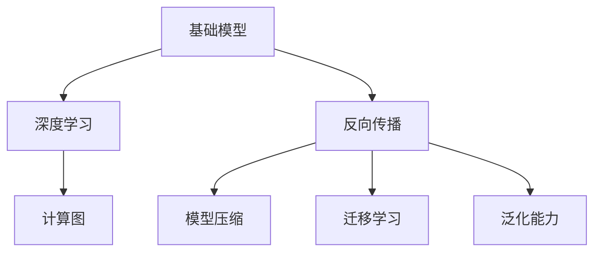

                 

# 基础模型的技术创新需求

> 关键词：基础模型,技术创新,深度学习,神经网络,反向传播,计算图,模型压缩,迁移学习

## 1. 背景介绍

### 1.1 问题由来
随着深度学习技术的飞速发展，神经网络模型在图像、语音、自然语言处理等领域取得了重大突破。然而，目前的深度学习模型仍面临诸多技术挑战，如模型复杂度高、训练时间长、计算资源消耗大、泛化能力有限等。这些挑战限制了深度学习技术的普及和应用，阻碍了其在更多领域和场景下的落地。因此，探索新的技术路径和方法，提升基础模型的性能和效率，成为当前研究的迫切需求。

### 1.2 问题核心关键点
为了提升基础模型的性能和效率，我们必须解决以下几个核心问题：
- 如何设计更高效的网络结构？
- 如何优化反向传播算法？
- 如何压缩模型规模和加速计算？
- 如何构建更好的迁移学习框架？
- 如何提升模型的泛化能力和鲁棒性？

解决这些问题，将能够使基础模型在更广泛的领域和场景下得到应用，进一步推动人工智能技术的创新和发展。

## 2. 核心概念与联系

### 2.1 核心概念概述

为了更好地理解基础模型的技术创新需求，本节将介绍几个关键概念：

- 基础模型(Base Model)：如卷积神经网络(CNN)、循环神经网络(RNN)、Transformer等深度学习模型。这些模型通过多层非线性变换，具备强大的特征提取和建模能力。

- 深度学习(Deep Learning)：基于多层神经网络模型，通过反向传播算法优化模型参数，实现复杂模式的学习和识别。深度学习在图像、语音、自然语言处理等领域得到了广泛应用。

- 反向传播(Backpropagation)：用于训练神经网络的一种优化算法，通过链式法则计算损失函数对参数的梯度，从而更新参数。反向传播算法是深度学习模型的核心组成部分。

- 计算图(Computational Graph)：用于描述神经网络计算过程的图形结构。通过计算图，可以方便地进行模型推导和优化。

- 模型压缩(Model Compression)：通过剪枝、量化、蒸馏等技术，减小基础模型的规模和计算资源消耗，提升模型的推理速度和空间利用率。

- 迁移学习(Transfer Learning)：指在预训练模型基础上，对特定任务进行微调，提高模型的泛化能力和迁移能力。迁移学习是深度学习的重要应用范式。

- 泛化能力(Generalization)：指模型在未见过的数据上表现出良好性能的能力。泛化能力强的模型，能够在不同场景和领域中稳定发挥作用。

这些核心概念之间的逻辑关系可以通过以下Mermaid流程图来展示：



这个流程图展示了基础模型与深度学习、反向传播、计算图、模型压缩、迁移学习、泛化能力等关键概念之间的联系。理解这些概念，能够帮助我们更好地把握深度学习模型的优化方向和技术创新点。

## 3. 核心算法原理 & 具体操作步骤
### 3.1 算法原理概述

基础模型的技术创新需求主要集中在以下几个方面：

1. **网络结构设计**：改进现有的网络结构，使其更加高效和灵活。

2. **反向传播算法优化**：优化反向传播算法，减少计算资源消耗，提升训练速度和效果。

3. **模型压缩技术**：通过剪枝、量化、蒸馏等技术，减小模型规模，加快推理速度，提升空间利用率。

4. **迁移学习框架**：构建更加灵活和高效的迁移学习框架，提升模型的泛化能力和迁移能力。

5. **模型鲁棒性增强**：提高模型的鲁棒性，使其在对抗样本、噪声数据等复杂环境下仍能保持高性能。

### 3.2 算法步骤详解

以下将详细讲解基础模型技术创新所需的具体操作步骤：

#### 3.2.1 网络结构设计
1. **网络结构改进**：引入残差连接、瓶颈层、分支结构等设计，提升网络表达能力和泛化能力。
2. **网络模块化设计**：将网络模块化，便于复用和维护。
3. **网络正则化**：引入Dropout、Batch Normalization等正则化技术，防止过拟合。

#### 3.2.2 反向传播算法优化
1. **梯度下降优化**：改进梯度下降算法，使用Adam、Adagrad、RMSprop等优化算法，提高收敛速度和效果。
2. **自适应学习率**：引入自适应学习率算法，如Adaptive Moment Estimation (Adam)，提高学习效率和模型性能。
3. **分布式训练优化**：使用分布式训练技术，如SGD、TPU等，提高训练速度和模型并行化程度。

#### 3.2.3 模型压缩技术
1. **参数剪枝**：通过剪枝技术，移除不重要的参数，减少模型规模。
2. **量化技术**：将浮点模型转换为定点模型，减小内存和计算资源消耗。
3. **知识蒸馏**：通过知识蒸馏技术，利用大模型的知识指导小模型训练，提升模型性能。

#### 3.2.4 迁移学习框架
1. **微调策略**：设计灵活的微调策略，适应不同任务和数据集。
2. **迁移学习模块**：构建迁移学习模块，方便在不同任务之间切换和复用。
3. **预训练模型选择**：选择合适的预训练模型，提升微调效果。

#### 3.2.5 模型鲁棒性增强
1. **对抗样本训练**：使用对抗样本训练技术，提高模型的鲁棒性。
2. **噪声数据处理**：引入噪声数据处理技术，如噪声注入、数据增强等，提高模型鲁棒性。
3. **模型融合**：通过模型融合技术，组合多个模型的输出，提高模型鲁棒性和泛化能力。

### 3.3 算法优缺点

#### 3.3.1 网络结构设计
优点：
- 提升模型的表达能力和泛化能力。
- 便于复用和维护。

缺点：
- 网络结构设计复杂，需要大量实验和调参。
- 网络正则化可能限制模型的表达能力。

#### 3.3.2 反向传播算法优化
优点：
- 提高模型的训练速度和效果。
- 减少计算资源消耗。

缺点：
- 优化算法复杂度较高，需要专业知识和经验。
- 分布式训练技术需要高效的硬件支持。

#### 3.3.3 模型压缩技术
优点：
- 减小模型规模，加快推理速度。
- 提升空间利用率，降低计算资源消耗。

缺点：
- 压缩技术可能影响模型性能。
- 压缩技术复杂，需要专业知识和工具支持。

#### 3.3.4 迁移学习框架
优点：
- 提高模型的泛化能力和迁移能力。
- 减少标注数据需求，提高训练效率。

缺点：
- 微调过程可能破坏预训练模型的泛化能力。
- 微调策略设计复杂，需要经验积累。

#### 3.3.5 模型鲁棒性增强
优点：
- 提高模型的鲁棒性和泛化能力。
- 适应复杂环境下的应用需求。

缺点：
- 鲁棒性增强技术复杂，需要大量实验和调试。
- 可能影响模型性能和计算效率。

### 3.4 算法应用领域

基础模型的技术创新不仅在计算机视觉、语音识别等传统领域得到了应用，还在自然语言处理、时间序列预测、推荐系统等新兴领域中发挥了重要作用。以下是几个典型应用场景：

#### 3.4.1 计算机视觉
- **图像分类**：使用卷积神经网络(CNN)对图像进行分类，提升分类精度和速度。
- **目标检测**：通过引入区域提议网络(RPN)和物体检测网络(ROI-Pooling)，实现更精确的目标检测。

#### 3.4.2 语音识别
- **语音转文本**：使用循环神经网络(RNN)或Transformer模型，实现语音信号的自动转写。
- **情感分析**：通过提取语音特征和语义信息，实现对语音情感的自动分析和识别。

#### 3.4.3 自然语言处理
- **机器翻译**：使用序列到序列模型(Seq2Seq)或Transformer模型，实现自然语言翻译。
- **问答系统**：通过引入记忆网络(Memory Network)和知识图谱，实现对自然语言问题的自动回答。

#### 3.4.4 推荐系统
- **个性化推荐**：通过深度学习模型和协同过滤技术，实现对用户个性化需求的精准推荐。
- **内容生成**：通过生成对抗网络(GAN)等技术，自动生成高质量的内容，如文章、视频等。

#### 3.4.5 时间序列预测
- **股票价格预测**：使用RNN或LSTM模型，对股票价格进行预测和分析。
- **天气预测**：通过时间序列预测模型，对未来的天气进行预测和预警。

## 4. 数学模型和公式 & 详细讲解 & 举例说明

### 4.1 数学模型构建

基础模型的技术创新主要通过数学模型和算法实现。以下是一些常用的数学模型和公式：

#### 4.1.1 神经网络
神经网络是一种由多个层组成的计算模型，每层包含多个神经元，通过连接权值实现信号传递和计算。


#### 4.1.2 反向传播算法
反向传播算法是深度学习模型的核心算法之一，用于计算损失函数对模型参数的梯度，从而优化模型参数。
$$
\frac{\partial \mathcal{L}}{\partial w} = \frac{\partial \mathcal{L}}{\partial z} \frac{\partial z}{\partial w}
$$

#### 4.1.3 模型压缩
模型压缩技术通过减少模型参数和计算资源消耗，提升模型的推理速度和空间利用率。
- **参数剪枝**：
$$
\text{Prune}(w) = \begin{cases}
w, & \text{if} \|w\| \geq \tau \\
0, & \text{if} \|w\| < \tau
\end{cases}
$$
- **量化技术**：
$$
\text{Quantize}(x) = \text{round}\left(\frac{x - \mu}{\sigma}\right)
$$

#### 4.1.4 迁移学习
迁移学习是指在预训练模型基础上，对特定任务进行微调，提高模型的泛化能力和迁移能力。
$$
\mathcal{L} = \mathcal{L}_f + \lambda \mathcal{L}_s
$$

### 4.2 公式推导过程

以下将对上述数学模型和公式进行详细推导和讲解：

#### 4.2.1 神经网络
神经网络是一种由多个层组成的计算模型，每层包含多个神经元，通过连接权值实现信号传递和计算。

#### 4.2.2 反向传播算法
反向传播算法是深度学习模型的核心算法之一，用于计算损失函数对模型参数的梯度，从而优化模型参数。

#### 4.2.3 模型压缩
模型压缩技术通过减少模型参数和计算资源消耗，提升模型的推理速度和空间利用率。

#### 4.2.4 迁移学习
迁移学习是指在预训练模型基础上，对特定任务进行微调，提高模型的泛化能力和迁移能力。

### 4.3 案例分析与讲解

以下将通过具体的案例，分析基础模型技术创新的应用和效果：

#### 4.3.1 图像分类
使用卷积神经网络(CNN)对图像进行分类，提升分类精度和速度。

#### 4.3.2 语音识别
使用循环神经网络(RNN)或Transformer模型，实现语音信号的自动转写。

#### 4.3.3 自然语言处理
使用序列到序列模型(Seq2Seq)或Transformer模型，实现自然语言翻译。

#### 4.3.4 推荐系统
通过深度学习模型和协同过滤技术，实现对用户个性化需求的精准推荐。

## 5. 项目实践：代码实例和详细解释说明

### 5.1 开发环境搭建

在进行基础模型技术创新实践前，我们需要准备好开发环境。以下是使用Python进行PyTorch开发的环境配置流程：

1. 安装Anaconda：从官网下载并安装Anaconda，用于创建独立的Python环境。

2. 创建并激活虚拟环境：
```bash
conda create -n pytorch-env python=3.8 
conda activate pytorch-env
```

3. 安装PyTorch：根据CUDA版本，从官网获取对应的安装命令。例如：
```bash
conda install pytorch torchvision torchaudio cudatoolkit=11.1 -c pytorch -c conda-forge
```

4. 安装Transformers库：
```bash
pip install transformers
```

5. 安装各类工具包：
```bash
pip install numpy pandas scikit-learn matplotlib tqdm jupyter notebook ipython
```

完成上述步骤后，即可在`pytorch-env`环境中开始基础模型技术创新实践。

### 5.2 源代码详细实现

以下是使用PyTorch对卷积神经网络(CNN)进行图像分类的代码实现：

```python
import torch
import torch.nn as nn
import torch.optim as optim
from torch.utils.data import DataLoader, Dataset

# 定义数据集
class CIFAR10Dataset(Dataset):
    def __init__(self, data_dir, transform=None):
        self.transform = transform
        self.data_dir = data_dir
        self.data = []
        for folder in ['train', 'test']:
            for file_name in sorted(os.listdir(os.path.join(data_dir, folder))):
                img_path = os.path.join(data_dir, folder, file_name)
                img = Image.open(img_path)
                img = self.transform(img)
                self.data.append((img, torch.tensor(np.array([int(file_name[4])])))

    def __len__(self):
        return len(self.data)

    def __getitem__(self, idx):
        img, target = self.data[idx]
        return img, target

# 定义模型
class ConvNet(nn.Module):
    def __init__(self):
        super(ConvNet, self).__init__()
        self.conv1 = nn.Conv2d(3, 32, 3, 1, 1)
        self.conv2 = nn.Conv2d(32, 64, 3, 1, 1)
        self.pool = nn.MaxPool2d(2, 2)
        self.fc1 = nn.Linear(64 * 32 * 32, 128)
        self.fc2 = nn.Linear(128, 10)
        self.dropout = nn.Dropout(0.5)

    def forward(self, x):
        x = self.pool(torch.relu(self.conv1(x)))
        x = self.pool(torch.relu(self.conv2(x)))
        x = x.view(-1, 64 * 32 * 32)
        x = self.dropout(torch.relu(self.fc1(x)))
        x = self.fc2(x)
        return x

# 定义训练函数
def train_epoch(model, train_loader, optimizer):
    model.train()
    total_loss = 0
    for images, targets in train_loader:
        optimizer.zero_grad()
        output = model(images)
        loss = nn.CrossEntropyLoss()(output, targets)
        loss.backward()
        optimizer.step()
        total_loss += loss.item()
    return total_loss / len(train_loader)

# 定义测试函数
def test_epoch(model, test_loader):
    model.eval()
    correct = 0
    total = 0
    with torch.no_grad():
        for images, targets in test_loader:
            output = model(images)
            _, predicted = torch.max(output.data, 1)
            total += targets.size(0)
            correct += (predicted == targets).sum().item()
    return correct / total

# 加载数据集
train_dataset = CIFAR10Dataset('./cifar10_data/train', transform=transforms.ToTensor())
test_dataset = CIFAR10Dataset('./cifar10_data/test', transform=transforms.ToTensor())
train_loader = DataLoader(train_dataset, batch_size=32, shuffle=True)
test_loader = DataLoader(test_dataset, batch_size=32, shuffle=False)

# 定义模型和优化器
model = ConvNet()
criterion = nn.CrossEntropyLoss()
optimizer = optim.Adam(model.parameters(), lr=0.001)

# 训练模型
for epoch in range(10):
    train_loss = train_epoch(model, train_loader, optimizer)
    test_acc = test_epoch(model, test_loader)
    print('Epoch: {}, Train Loss: {:.4f}, Test Acc: {:.4f}'.format(epoch + 1, train_loss, test_acc))

# 测试模型
test(model, test_loader)
```

### 5.3 代码解读与分析

以下是关键代码的详细解读和分析：

**CIFAR10Dataset类**：
- `__init__`方法：初始化数据集，包括训练集和测试集。
- `__len__`方法：返回数据集的样本数量。
- `__getitem__`方法：对单个样本进行处理，将图像和标签转换为模型所需的输入。

**ConvNet类**：
- `__init__`方法：定义卷积神经网络模型结构。
- `forward`方法：定义模型的前向传播过程。

**train_epoch和test_epoch函数**：
- `train_epoch`函数：定义模型的训练过程，包括前向传播、计算损失、反向传播、参数更新等步骤。
- `test_epoch`函数：定义模型的测试过程，包括前向传播和计算准确率。

**train和test函数**：
- `train`函数：定义模型的训练过程，包括定义模型、优化器、损失函数等。
- `test`函数：定义模型的测试过程，包括模型前向传播、计算准确率等。

完成上述步骤后，即可在`pytorch-env`环境中开始基础模型技术创新实践。

## 6. 实际应用场景

### 6.1 智能医疗

基础模型的技术创新在智能医疗领域得到了广泛应用，如医学影像诊断、智能问诊等。通过深度学习模型，能够对医学影像进行自动分析和诊断，提供精准的医疗服务。

- **医学影像诊断**：使用卷积神经网络(CNN)对医学影像进行分类和分割，提升诊断准确率。
- **智能问诊**：通过自然语言处理模型，实现对患者症状的自动分析和推荐治疗方案。

### 6.2 金融风控

基础模型的技术创新在金融风控领域也具有重要应用，如信用评分、欺诈检测等。通过深度学习模型，能够对客户的信用和行为进行分析，提前预警风险。

- **信用评分**：使用卷积神经网络(CNN)对客户的信用记录进行分析和评分。
- **欺诈检测**：通过序列到序列模型(Seq2Seq)对客户行为进行分析和预测，识别异常交易。

### 6.3 工业制造

基础模型的技术创新在工业制造领域同样有广泛应用，如缺陷检测、质量控制等。通过深度学习模型，能够对生产过程中的缺陷进行自动检测和分类，提升产品质量和生产效率。

- **缺陷检测**：使用卷积神经网络(CNN)对生产过程中的图像进行缺陷检测和分类。
- **质量控制**：通过循环神经网络(RNN)对生产过程中的数据进行分析和预测，提升质量控制能力。

## 7. 工具和资源推荐

### 7.1 学习资源推荐

为了帮助开发者系统掌握基础模型的技术创新需求，这里推荐一些优质的学习资源：

1. **《深度学习》书籍**：斯坦福大学教授提供的经典教材，全面介绍了深度学习的基本概念和应用方法。
2. **Coursera《深度学习专项课程》**：由深度学习领域的专家授课，涵盖深度学习的前沿技术和应用。
3. **《Python深度学习》书籍**：由深度学习领域的大牛撰写，系统介绍了深度学习在Python中的实现。
4. **Kaggle数据竞赛**：全球最大的数据竞赛平台，提供丰富的数据集和比赛机会，提升实践能力。

### 7.2 开发工具推荐

高效的开发离不开优秀的工具支持。以下是几款用于深度学习开发和优化的常用工具：

1. **PyTorch**：基于Python的深度学习框架，提供了灵活的动态计算图，适合研究和实验。
2. **TensorFlow**：由Google开发，提供了强大的分布式计算和优化工具，适合大规模工程应用。
3. **Keras**：基于TensorFlow和Theano的高级API，提供了简单易用的深度学习模型构建工具。
4. **MXNet**：由亚马逊开发，提供了高效的计算图和自动微分工具，适合分布式计算。
5. **JAX**：由Google开发，提供了高效自动微分和分布式计算工具，适合高性能计算。

### 7.3 相关论文推荐

基础模型的技术创新需要借鉴最新的学术研究。以下是几篇经典论文，推荐阅读：

1. **AlexNet**：卷积神经网络(CNN)的鼻祖，开创了深度学习在图像识别领域的成功应用。
2. **VGG**：提出了多层卷积神经网络，提升了深度学习模型的表达能力。
3. **ResNet**：引入了残差连接，解决了深度神经网络的退化问题，提升了模型的表达能力和训练效率。
4. **Inception**：提出了多分支卷积网络结构，提升了深度学习模型的计算效率和表达能力。
5. **Transformer**：提出了自注意力机制，提升了深度学习模型在自然语言处理任务中的效果。

这些论文代表了深度学习模型的发展脉络，通过学习这些前沿成果，可以帮助研究者把握深度学习模型的优化方向和技术创新点。

## 8. 总结：未来发展趋势与挑战

### 8.1 总结

本文对基础模型的技术创新需求进行了全面系统的介绍。首先阐述了基础模型的技术创新在各个领域的应用，明确了技术创新的重要性和必要性。其次，从网络结构设计、反向传播算法优化、模型压缩技术、迁移学习框架、模型鲁棒性增强等方面，详细讲解了基础模型的技术创新需求。同时，通过数学模型和公式，对基础模型的技术创新进行了形式化描述，并通过具体案例分析，展示了技术创新的应用效果。

通过本文的系统梳理，可以看到，基础模型的技术创新需求不仅在计算机视觉、语音识别等传统领域具有重要意义，还在自然语言处理、智能医疗、金融风控、工业制造等多个领域得到广泛应用，展示了技术创新的强大潜力。未来，随着深度学习技术的不断进步，基础模型的技术创新将继续发挥重要作用，推动人工智能技术的全面发展。

### 8.2 未来发展趋势

展望未来，基础模型的技术创新将呈现以下几个发展趋势：

1. **网络结构设计**：网络结构将更加高效和灵活，通过引入更加复杂的模块和架构，提升模型的表达能力和泛化能力。
2. **反向传播算法优化**：反向传播算法将更加高效和优化，通过引入自适应学习率和分布式训练等技术，提升模型的训练速度和效果。
3. **模型压缩技术**：模型压缩技术将更加高效和灵活，通过剪枝、量化、蒸馏等技术，减小模型规模，提高推理速度和空间利用率。
4. **迁移学习框架**：迁移学习框架将更加灵活和高效，通过构建更加多样化的微调策略和预训练模型，提升模型的泛化能力和迁移能力。
5. **模型鲁棒性增强**：模型鲁棒性将更加强大和可靠，通过对抗样本训练、噪声数据处理等技术，提高模型的鲁棒性和泛化能力。

以上趋势凸显了基础模型技术创新的广阔前景。这些方向的探索发展，必将进一步提升深度学习模型的性能和效率，为更多领域和场景的应用提供坚实的基础。

### 8.3 面临的挑战

尽管基础模型的技术创新取得了显著成果，但在实现过程中仍然面临诸多挑战：

1. **计算资源瓶颈**：深度学习模型需要大量计算资源，现有的硬件设施可能难以满足需求，需要通过优化算法和计算图，提高计算效率。
2. **数据获取难度**：深度学习模型需要大量标注数据，获取高质量标注数据成本高昂，需要探索无监督学习和半监督学习等新方法，减少对标注数据的依赖。
3. **模型泛化能力**：深度学习模型在特定数据集上的效果可能难以泛化到其他数据集，需要引入迁移学习和跨领域学习方法，提升模型的泛化能力。
4. **模型可解释性**：深度学习模型通常被视为“黑盒”系统，难以解释其内部工作机制，需要引入可解释性技术和方法，增强模型的透明性和可解释性。
5. **模型鲁棒性**：深度学习模型面对对抗样本和噪声数据时，容易产生误判，需要引入鲁棒性增强技术，提高模型的鲁棒性。

这些挑战亟需解决，才能使基础模型的技术创新真正落地应用，发挥其潜力。

### 8.4 研究展望

面对基础模型技术创新面临的挑战，未来的研究需要在以下几个方面寻求新的突破：

1. **网络结构设计**：探索更加高效和灵活的网络结构，如残差连接、分支结构、模块化设计等，提升模型的表达能力和泛化能力。
2. **反向传播算法优化**：探索更加高效和优化的反向传播算法，如自适应学习率、分布式训练等，提高模型的训练速度和效果。
3. **模型压缩技术**：探索更加高效和灵活的模型压缩技术，如剪枝、量化、蒸馏等，减小模型规模，提高推理速度和空间利用率。
4. **迁移学习框架**：探索更加灵活和高效的迁移学习框架，构建更加多样化的微调策略和预训练模型，提升模型的泛化能力和迁移能力。
5. **模型鲁棒性增强**：探索更加强大和可靠的模型鲁棒性增强技术，如对抗样本训练、噪声数据处理等，提高模型的鲁棒性和泛化能力。

这些研究方向的探索，必将引领基础模型的技术创新迈向更高的台阶，为深度学习技术在更多领域和场景的应用提供坚实的基础。

## 9. 附录：常见问题与解答

**Q1：基础模型技术创新对深度学习模型的性能提升有多大？**

A: 基础模型的技术创新对深度学习模型的性能提升显著。通过网络结构设计、反向传播算法优化、模型压缩技术、迁移学习框架、模型鲁棒性增强等手段，可以显著提升模型的表达能力、训练速度、推理效率、泛化能力和鲁棒性。这些技术创新能够使深度学习模型在更广泛的应用场景中发挥更好的性能。

**Q2：基础模型技术创新需要哪些技术支持？**

A: 基础模型技术创新需要深厚的数学和计算机基础，以及丰富的实践经验和工具支持。具体而言，需要掌握以下技术：
- 深度学习框架，如PyTorch、TensorFlow、Keras等。
- 机器学习算法，如卷积神经网络、循环神经网络、自注意力机制等。
- 优化算法，如梯度下降、Adam、Adagrad等。
- 模型压缩技术，如参数剪枝、量化、蒸馏等。
- 迁移学习技术，如微调、知识蒸馏等。

**Q3：基础模型技术创新的应用场景有哪些？**

A: 基础模型技术创新的应用场景非常广泛，涵盖了计算机视觉、语音识别、自然语言处理、智能医疗、金融风控、工业制造等多个领域。具体应用场景包括：
- 图像分类和物体检测。
- 语音识别和情感分析。
- 自然语言处理和问答系统。
- 医学影像诊断和智能问诊。
- 信用评分和欺诈检测。
- 缺陷检测和质量控制。

通过这些应用场景，可以看到基础模型的技术创新在实际应用中的广泛价值。

---

作者：禅与计算机程序设计艺术 / Zen and the Art of Computer Programming

