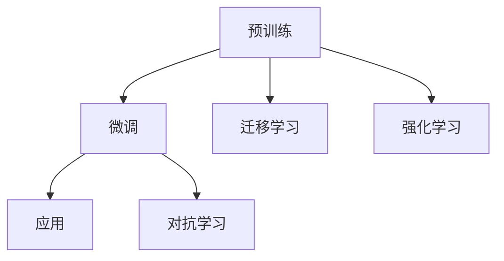

                 

# 基础模型的政治经济影响

## 1. 背景介绍

### 1.1 问题由来

近年来，人工智能（AI）技术的迅猛发展已经深刻改变了世界的经济结构和政治生态。作为AI技术的核心，基础模型（Foundation Models），如语言模型、图像识别模型等，对社会的各个方面都产生了深远的影响。这些基础模型不仅在工业、医疗、金融等传统领域提供了强大的技术支持，也在政治、经济、社会等领域引发了广泛讨论。基础模型在政治经济中的影响，正逐渐成为科技与政策、伦理与法律交叉融合的热点话题。

### 1.2 问题核心关键点

基础模型对政治经济的影响体现在多个层面：

1. **就业与劳动市场**：基础模型的广泛应用可能会对劳动市场产生冲击，某些行业可能因自动化和智能化技术而面临失业风险。
2. **产业结构转型**：基础模型推动了新兴产业的发展，如AI驱动的制造业、医疗健康等，同时改变了传统产业的运作模式。
3. **数据隐私与安全**：基础模型依赖大量数据进行训练，数据隐私问题成为关注的焦点，数据安全风险不容忽视。
4. **经济增长与创新**：基础模型驱动的创新为经济增长提供了新的动力，但也引发了关于市场垄断与公平竞争的讨论。
5. **决策支持与政策制定**：基础模型在政治决策、政策制定中扮演着重要角色，但其偏见与误导可能影响决策质量。

### 1.3 问题研究意义

研究基础模型在政治经济中的影响，对于理解和把握AI技术的广泛社会效应，指导相关政策和法规的制定，具有重要意义：

1. **促进公平与包容**：确保技术进步惠及所有社会成员，减少技术鸿沟。
2. **提升决策科学性**：利用基础模型辅助政府和企业做出更加科学的决策。
3. **推动伦理规范建设**：规范基础模型的开发和使用，避免伦理风险。
4. **引导产业健康发展**：制定合理的行业标准和监管措施，促进AI产业的健康成长。
5. **维护社会稳定**：预防和应对因基础模型引发的社会问题，保障公共利益。

## 2. 核心概念与联系

### 2.1 核心概念概述

基础模型是指通过大规模数据训练得到的，能够处理复杂任务（如图像识别、自然语言处理）的通用人工智能模型。这些模型在预训练阶段（Pre-training）学习到大量的通用知识，在微调（Fine-tuning）阶段针对特定任务进行优化，从而具有强大的泛化能力。

- **预训练（Pre-training）**：在大规模无标签数据上训练基础模型，学习到通用的特征表示。
- **微调（Fine-tuning）**：在预训练的基础上，使用有标签数据对模型进行进一步训练，使其能够适应特定任务。
- **迁移学习（Transfer Learning）**：将预训练模型应用于新的任务，通过微调进行迁移学习。
- **强化学习（Reinforcement Learning）**：通过与环境的交互，模型在不断的反馈中学习最优策略。
- **对抗学习（Adversarial Learning）**：通过对抗样本（Adversarial Examples）训练模型，提高其鲁棒性。

这些核心概念之间通过协同作用，共同构成了基础模型从预训练到微调的全生命周期。

### 2.2 核心概念原理和架构的 Mermaid 流程图



该流程图展示了基础模型从预训练到微调，并应用于特定任务的整个生命周期，以及与强化学习和对抗学习的交互关系。

## 3. 核心算法原理 & 具体操作步骤

### 3.1 算法原理概述

基础模型在预训练阶段主要通过自监督学习（Self-supervised Learning）的方式进行训练，目的是学习到通用的语言或图像特征表示。常用的预训练任务包括自回归语言模型（如GPT系列）和自编码器（如BERT）。微调阶段则是在特定任务的有标签数据上，通过监督学习（Supervised Learning）进行训练，使其能够完成特定任务。

基础模型的核心算法原理主要包括：

1. **自监督学习（Self-supervised Learning）**：通过预训练任务（如掩码语言模型、图像分类等）学习到通用的特征表示。
2. **监督学习（Supervised Learning）**：在有标签数据上进一步训练，微调模型以适应特定任务。
3. **迁移学习（Transfer Learning）**：利用预训练模型的知识，在新的任务上进行微调。
4. **强化学习（Reinforcement Learning）**：通过与环境的交互，优化模型在特定任务上的性能。
5. **对抗学习（Adversarial Learning）**：增强模型的鲁棒性，防止对抗样本攻击。

### 3.2 算法步骤详解

基础模型的训练流程分为预训练和微调两个阶段：

#### 3.2.1 预训练阶段

1. **数据准备**：收集大规模无标签数据，如文本语料库、图像库等。
2. **模型选择**：选择适当的模型架构，如Transformer、卷积神经网络（CNN）等。
3. **预训练任务**：设计自监督学习任务，如掩码语言模型、图像分类等，用于训练模型。
4. **模型训练**：使用预训练任务对模型进行训练，学习到通用的特征表示。

#### 3.2.2 微调阶段

1. **任务适配**：根据具体任务的需求，设计任务的输出层和损失函数。
2. **数据准备**：收集有标签数据，用于微调模型的训练。
3. **模型微调**：使用有标签数据对预训练模型进行微调，使其能够适应特定任务。
4. **模型评估**：在验证集和测试集上评估微调后的模型性能。

### 3.3 算法优缺点

基础模型的优点包括：

1. **泛化能力强**：在预训练阶段学习到大量的通用知识，能够适应多种任务。
2. **迁移能力强**：通过微调可以在不同的任务上取得良好的效果。
3. **模型高效**：使用大规模数据进行训练，模型性能显著提升。

然而，基础模型也存在一些缺点：

1. **数据依赖性强**：预训练和微调都需要大量的数据，数据获取成本高。
2. **模型复杂度高**：大规模的模型参数增加了训练和推理的复杂度。
3. **计算资源需求高**：预训练和微调需要高性能的计算资源。
4. **透明度低**：基础模型通常是"黑盒"，难以解释模型的决策过程。
5. **伦理风险高**：可能存在偏见、误导等伦理问题。

### 3.4 算法应用领域

基础模型在多个领域得到了广泛应用：

1. **自然语言处理（NLP）**：如语言模型（BERT、GPT）、文本分类、机器翻译、情感分析等。
2. **计算机视觉（CV）**：如图像分类、目标检测、图像生成等。
3. **医疗健康**：如病历分析、疾病预测、医学影像诊断等。
4. **金融**：如风险评估、信用评分、算法交易等。
5. **自动驾驶**：如环境感知、路径规划、行为决策等。

## 4. 数学模型和公式 & 详细讲解 & 举例说明

### 4.1 数学模型构建

基础模型通常使用神经网络架构进行训练，其数学模型可以表示为：

$$
y = f(x; \theta)
$$

其中，$x$ 为输入数据，$\theta$ 为模型参数，$f$ 为模型函数。

#### 4.1.1 自监督学习模型

以BERT为例，其自监督学习的目标函数为：

$$
\mathcal{L}_{pre} = -\sum_{i=1}^N \sum_{j=1}^{|\mathcal{X}|} p(y_j|x_i)
$$

其中，$x_i$ 为输入数据，$y_j$ 为预测输出，$p$ 为预测概率。

#### 4.1.2 监督学习模型

以图像分类任务为例，其监督学习的目标函数为：

$$
\mathcal{L}_{sup} = \frac{1}{N} \sum_{i=1}^N \sum_{j=1}^{|\mathcal{Y}|} \ell(y_j, \hat{y}_j)
$$

其中，$y_j$ 为真实标签，$\hat{y}_j$ 为模型预测输出，$\ell$ 为损失函数，如交叉熵损失。

### 4.2 公式推导过程

以BERT的自监督学习为例，其自回归语言模型的目标函数为：

$$
\mathcal{L} = -\sum_{i=1}^N \sum_{j=1}^{|\mathcal{X}|} p(x_i|x_{<i})
$$

其中，$x_i$ 为输入数据，$x_{<i}$ 为前缀数据，$p$ 为预测概率。

### 4.3 案例分析与讲解

以BERT在文本分类任务中的应用为例，具体步骤为：

1. **数据准备**：收集标注好的文本数据集，划分为训练集、验证集和测试集。
2. **模型选择**：选择BERT作为预训练模型。
3. **任务适配**：设计输出层为线性分类器，损失函数为交叉熵损失。
4. **微调训练**：使用训练集对BERT进行微调，并在验证集上调整模型参数，防止过拟合。
5. **模型评估**：在测试集上评估模型性能，对比微调前后效果。

## 5. 项目实践：代码实例和详细解释说明

### 5.1 开发环境搭建

为进行基础模型的实践，需要以下开发环境：

1. **Python**：主流编程语言，支持丰富的AI开发库。
2. **PyTorch**：广泛使用的深度学习框架，支持GPU加速。
3. **TensorFlow**：另一流行的深度学习框架，支持分布式训练。
4. **Jupyter Notebook**：交互式编程环境，支持代码分享和版本管理。
5. **Google Colab**：基于Jupyter的在线开发环境，提供免费GPU资源。

### 5.2 源代码详细实现

以下以BERT在文本分类任务上的微调为例，展示代码实现：

```python
import torch
import torch.nn as nn
import torch.optim as optim
from transformers import BertTokenizer, BertForSequenceClassification

# 初始化tokenizer和模型
tokenizer = BertTokenizer.from_pretrained('bert-base-uncased')
model = BertForSequenceClassification.from_pretrained('bert-base-uncased', num_labels=2)

# 定义损失函数和优化器
criterion = nn.CrossEntropyLoss()
optimizer = optim.Adam(model.parameters(), lr=2e-5)

# 数据预处理
train_data = ...
val_data = ...
test_data = ...

# 模型训练
device = torch.device('cuda') if torch.cuda.is_available() else torch.device('cpu')
model.to(device)
for epoch in range(5):
    model.train()
    for batch in train_data:
        inputs = tokenizer(batch[0], padding='max_length', truncation=True, return_tensors='pt').to(device)
        labels = batch[1].to(device)
        outputs = model(**inputs)
        loss = criterion(outputs.logits, labels)
        optimizer.zero_grad()
        loss.backward()
        optimizer.step()

# 模型评估
model.eval()
for batch in val_data:
    inputs = tokenizer(batch[0], padding='max_length', truncation=True, return_tensors='pt').to(device)
    labels = batch[1].to(device)
    with torch.no_grad():
        outputs = model(**inputs)
        predictions = outputs.logits.argmax(dim=1)
    acc = (predictions == labels).float().mean()
    print('Validation Accuracy:', acc.item())

# 模型保存
torch.save(model.state_dict(), 'model.pth')
```

### 5.3 代码解读与分析

代码中使用了PyTorch和HuggingFace的Transformers库，对BERT模型进行了微调。关键步骤包括：

1. **数据预处理**：使用BertTokenizer对输入数据进行分词和编码，将文本转换为模型所需的格式。
2. **模型训练**：在GPU上对模型进行前向传播和反向传播，更新模型参数。
3. **模型评估**：在验证集上评估模型性能，计算准确率。
4. **模型保存**：将训练后的模型参数保存到文件中，便于后续使用。

## 6. 实际应用场景

### 6.1 智能客服系统

智能客服系统利用基础模型进行对话生成和意图识别，能够提供7x24小时不间断服务，提升客户咨询体验。

### 6.2 金融舆情监测

金融舆情监测系统通过基础模型进行情感分析和主题分类，实时监测市场情绪和舆情变化，帮助金融机构及时做出反应。

### 6.3 个性化推荐系统

个性化推荐系统利用基础模型进行用户行为分析和物品推荐，提升推荐效果和用户体验。

### 6.4 未来应用展望

基础模型将在更多领域发挥重要作用，如智慧医疗、智能制造、智能家居等。未来，基础模型将在决策支持、政策制定、伦理审查等方面扮演重要角色，推动社会治理和科技进步。

## 7. 工具和资源推荐

### 7.1 学习资源推荐

1. **Coursera**：提供大量AI和深度学习课程，涵盖基础模型原理与应用。
2. **Google AI Hub**：发布开源AI工具和模型，支持社区交流与协作。
3. **arXiv**：顶级学术平台，汇集大量前沿研究成果，涵盖基础模型领域。
4. **Kaggle**：数据科学竞赛平台，提供实际应用场景的数据集和挑战任务。
5. **GitHub**：开源代码托管平台，支持项目管理和代码共享。

### 7.2 开发工具推荐

1. **PyTorch**：开源深度学习框架，支持GPU加速和分布式训练。
2. **TensorFlow**：流行深度学习框架，支持高性能计算和动态图。
3. **Jupyter Notebook**：交互式编程环境，支持代码共享和版本管理。
4. **Google Colab**：基于Jupyter的在线开发环境，提供免费GPU资源。
5. **Weights & Biases**：模型训练的实验跟踪工具，记录和可视化实验过程。
6. **TensorBoard**：TensorFlow配套的可视化工具，实时监测模型训练状态。

### 7.3 相关论文推荐

1. **"Attention is All You Need"**：Transformer模型的原始论文，奠定了大语言模型预训练的基础。
2. **"BERT: Pre-training of Deep Bidirectional Transformers for Language Understanding and Generation"**：BERT模型的论文，提出了自监督学习的方法。
3. **"Adversarial Examples in Deep Learning"**：对抗学习的经典论文，研究对抗样本对模型的影响。
4. **"Domain Adaptation with Domain-Regularized Adversarial Domain Alignment"**：迁移学习的论文，探索如何提升模型在新的任务上的性能。
5. **"Deep Reinforcement Learning for Dialogue Generation"**：对话系统中的强化学习论文，利用基础模型进行对话生成。

## 8. 总结：未来发展趋势与挑战

### 8.1 研究成果总结

基础模型的研究和发展取得了显著进展，广泛应用于多个领域，并推动了技术创新和产业变革。然而，基础模型在应用过程中仍面临诸多挑战，如数据隐私、伦理风险、计算资源需求高等问题。

### 8.2 未来发展趋势

1. **计算效率提升**：研究高效的计算架构和优化算法，降低资源消耗。
2. **数据隐私保护**：探索数据匿名化、联邦学习等技术，保护用户隐私。
3. **模型透明度提升**：开发可解释性强的模型，增强模型的可解释性。
4. **伦理规范制定**：制定基础模型的伦理规范，避免偏见和误导。
5. **跨领域应用推广**：推动基础模型在更多领域的应用，如医疗、教育、社会治理等。

### 8.3 面临的挑战

基础模型在未来的应用过程中，仍需解决以下挑战：

1. **数据获取和处理**：大规模数据的高成本和隐私问题。
2. **模型复杂性和可解释性**：模型复杂度高，难以解释。
3. **伦理和安全问题**：基础模型的偏见、误导和安全性问题。
4. **计算资源限制**：高计算需求和资源限制。

### 8.4 研究展望

未来的研究需要关注以下几个方向：

1. **公平与包容性**：确保基础模型在各群体之间表现公平，减少偏见。
2. **可解释性增强**：提升模型的可解释性，增强决策的透明度。
3. **多模态融合**：研究多模态数据的融合，提升基础模型的综合能力。
4. **跨领域迁移**：探索跨领域的迁移学习，提升模型的通用性。
5. **伦理审查机制**：建立伦理审查机制，确保模型的安全性和可靠性。

## 9. 附录：常见问题与解答

**Q1: 基础模型对就业市场的影响是什么？**

A: 基础模型的广泛应用可能导致某些行业失业风险增加，但同时也会催生新的就业机会，如AI工程师、数据科学家等。

**Q2: 基础模型在数据隐私方面存在哪些风险？**

A: 基础模型训练和微调需要大量数据，数据隐私泄露风险高。需要采取数据匿名化、联邦学习等技术保护用户隐私。

**Q3: 基础模型如何应用于智能决策系统？**

A: 基础模型可以用于提取特征、分类、生成等多种智能决策任务。通过与决策系统结合，提升决策的科学性和效率。

**Q4: 基础模型在政策制定中面临哪些伦理问题？**

A: 基础模型可能存在偏见和误导，政策制定过程中需要严格审查和调整，确保决策的公正性和透明性。

**Q5: 如何提升基础模型的计算效率？**

A: 采用高效的计算架构和优化算法，如混合精度训练、模型压缩、分布式训练等，降低计算资源消耗。

---

作者：禅与计算机程序设计艺术 / Zen and the Art of Computer Programming

