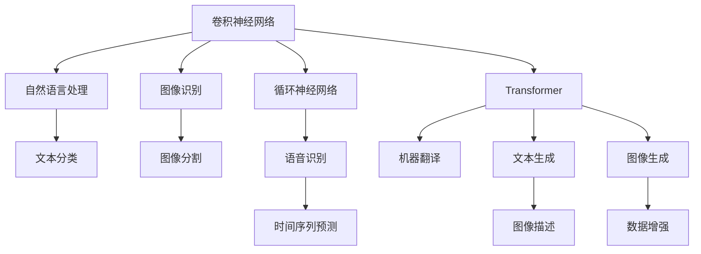

                 

# 基础模型的深度神经网络

> 关键词：深度神经网络,基础模型,卷积神经网络(CNN),循环神经网络(RNN),Transformer,自监督学习,迁移学习

## 1. 背景介绍

在深度学习迅猛发展的今天，深度神经网络(Depth Neural Network, DNN)作为其核心技术，广泛应用于计算机视觉、自然语言处理、语音识别、游戏AI等多个领域。深度神经网络的发展和演进，从早期的卷积神经网络(CNN)、循环神经网络(RNN)，到目前占据统治地位的Transformer模型，每个模型都有其独到之处，并基于其特征适应特定的应用场景。

本文将系统地介绍深度神经网络的基础模型，并重点分析CNN、RNN、Transformer三种典型模型的原理、架构和应用。通过理解这些基础模型的原理和特点，可以更好地构建和优化复杂的深度神经网络模型，并根据具体应用场景选择合适的模型进行开发。

## 2. 核心概念与联系

### 2.1 核心概念概述

为更清晰地理解深度神经网络的基础模型，本节将介绍几个关键概念：

- 卷积神经网络（Convolutional Neural Network, CNN）：以卷积和池化层为核心操作，擅长处理具有网格结构的数据，如图像、文本等。
- 循环神经网络（Recurrent Neural Network, RNN）：以循环结构处理序列数据，能够捕捉时间序列中的依赖关系。
- Transformer模型：以自注意力机制为特色，能够高效处理长序列数据，并且在多个任务中取得优异表现。
- 自监督学习（Self-Supervised Learning, SSL）：指通过未标注数据训练模型，利用数据本身的内在结构获得有效的特征表示。
- 迁移学习（Transfer Learning, TL）：指将一个领域学到的知识迁移到另一个领域，提升模型在新领域的泛化能力。

这些核心概念之间的逻辑关系可以通过以下Mermaid流程图来展示：



这个流程图展示了大规模深度神经网络模型的核心概念及其在各领域的广泛应用：

1. 卷积神经网络在图像识别和处理中应用广泛。
2. 循环神经网络在语音识别和时间序列预测中具有优势。
3. 变压器模型在自然语言处理、文本生成和图像生成等领域表现卓越。
4. 自监督学习与迁移学习是现代深度神经网络的重要训练方法。

## 3. 核心算法原理 & 具体操作步骤

### 3.1 算法原理概述

深度神经网络的基础模型主要包括CNN、RNN和Transformer，它们的原理各有侧重，但都遵循以下通用框架：

1. **前向传播**：将输入数据输入模型，通过一系列的变换得到输出。
2. **损失计算**：根据输出和真实标签计算损失函数。
3. **反向传播**：利用链式法则计算损失函数对参数的梯度。
4. **参数更新**：根据梯度下降等优化算法更新模型参数。
5. **迭代训练**：重复以上步骤直至收敛。

### 3.2 算法步骤详解

#### 3.2.1 卷积神经网络(CNN)

**输入数据处理**：将图像数据转换为张量形式，进行归一化处理。

**卷积层**：卷积核在输入图像上滑动，提取特征图。

**池化层**：通过最大池化或平均池化，减小特征图大小，减少计算量。

**全连接层**：将池化后的特征图展开，通过多个全连接层进行特征映射。

**输出层**：根据具体任务，选择softmax或sigmoid等激活函数输出分类结果。

**算法流程**：
1. 准备数据集，进行数据增强，如旋转、裁剪、翻转等。
2. 定义卷积神经网络模型，包括卷积层、池化层、全连接层等。
3. 选择优化器如AdamW，设定学习率，并进行模型训练。
4. 在验证集上评估模型性能，根据评估结果调整超参数。
5. 在测试集上测试模型性能，输出结果。

#### 3.2.2 循环神经网络(RNN)

**输入数据处理**：将序列数据转换为张量形式，并进行填充处理。

**循环结构**：每一时间步，将前一时间步的隐藏状态与当前输入进行拼接，经过一个全连接层，产生当前时间步的输出。

**输出层**：根据具体任务，选择softmax或sigmoid等激活函数输出分类结果。

**算法流程**：
1. 准备数据集，进行数据预处理，如序列填充。
2. 定义循环神经网络模型，包括循环层、全连接层等。
3. 选择优化器如Adam，设定学习率，并进行模型训练。
4. 在验证集上评估模型性能，根据评估结果调整超参数。
5. 在测试集上测试模型性能，输出结果。

#### 3.2.3 Transformer模型

**自注意力机制**：通过多头自注意力机制，捕捉输入序列之间的依赖关系。

**前向网络**：每个注意力头输出一个表示，经过多层的堆叠，提升特征表达能力。

**残差连接**：引入残差连接，避免模型退化。

**输出层**：根据具体任务，选择softmax或sigmoid等激活函数输出分类结果。

**算法流程**：
1. 准备数据集，进行数据预处理。
2. 定义Transformer模型，包括多头注意力机制、前向网络、残差连接等。
3. 选择优化器如AdamW，设定学习率，并进行模型训练。
4. 在验证集上评估模型性能，根据评估结果调整超参数。
5. 在测试集上测试模型性能，输出结果。

### 3.3 算法优缺点

**CNN的优缺点**：
- **优点**：
  - 参数共享：卷积核在输入图像上共享权重，减少模型参数量。
  - 平移不变性：同一卷积核在不同位置提取的特征具有平移不变性。
  - 局部连接：通过局部连接捕捉图像中的局部特征。
- **缺点**：
  - 感受野限制：卷积核大小固定，感受野较小，无法捕捉全局特征。
  - 计算复杂度高：卷积运算和池化运算计算量大，训练时间长。
  - 数据增强难：难以像RNN和Transformer那样使用数据增强技术。

**RNN的优缺点**：
- **优点**：
  - 序列建模：循环结构可以处理任意长度的序列数据。
  - 时间依赖：能够捕捉时间序列中的依赖关系。
  - 可解释性强：每一时间步的隐藏状态可以直接反映模型对当前输入的理解。
- **缺点**：
  - 梯度消失/爆炸：在长序列数据上，梯度可能消失或爆炸，导致模型训练困难。
  - 计算复杂度高：需要维护每一时间步的隐藏状态，计算量大。
  - 局部依赖：难以捕捉全局依赖关系，模型泛化能力有限。

**Transformer的优缺点**：
- **优点**：
  - 并行计算能力强：自注意力机制可以并行计算，训练速度快。
  - 全局依赖：能够捕捉全局依赖关系，模型泛化能力强。
  - 模型结构简洁：相比于RNN，Transformer模型结构更简单，可解释性强。
- **缺点**：
  - 计算复杂度高：自注意力机制的计算复杂度高，需要大量的计算资源。
  - 数据依赖：模型高度依赖输入序列的长度，需要特殊处理。
  - 长序列问题：在长序列数据上，自注意力机制可能出现计算和内存问题。

### 3.4 算法应用领域

CNN、RNN和Transformer三种基础模型在各自的应用领域中都有广泛的应用：

**CNN的应用领域**：
- 计算机视觉：图像分类、目标检测、图像分割等。
- 自然语言处理：文本分类、命名实体识别等。

**RNN的应用领域**：
- 语音识别：自动语音识别、说话人识别等。
- 时间序列预测：股票预测、气象预测等。

**Transformer的应用领域**：
- 机器翻译：神经机器翻译、文本生成等。
- 自然语言处理：文本分类、情感分析等。

除了上述这些经典任务外，CNN、RNN和Transformer还创新性地应用到更多场景中，如图像生成、图像描述、数据增强等，为深度学习技术带来了全新的突破。

## 4. 数学模型和公式 & 详细讲解 & 举例说明

### 4.1 数学模型构建

本节将使用数学语言对CNN、RNN和Transformer三种基础模型的构建进行更加严格的刻画。

#### 4.1.1 卷积神经网络(CNN)

**输入数据**：设输入图像的尺寸为$D\times H\times W$，卷积核大小为$k\times k$，卷积步长为$s$，输入特征数为$C_{in}$，输出特征数为$C_{out}$。

**卷积层**：卷积运算定义为
$$
Y^{(l)}(x_i, y_i) = B_l\left(\sum_{x'=0}^{D-k+1}\sum_{y'=0}^{H-k+1}X^{(l-1)}(x'+x_i,y'+y_i) * W_{l}\right)
$$
其中$X^{(l-1)}$表示第$l-1$层的特征图，$W_l$表示卷积核。

**池化层**：最大池化定义为
$$
Y^{(l)}(x_i,y_i) = \max_{x'=0}^{D-k+1}\max_{y'=0}^{H-k+1}X^{(l)}(x'+x_i,y'+y_i)
$$

**全连接层**：将池化后的特征图展开，通过多个全连接层进行特征映射。

**输出层**：根据具体任务，选择softmax或sigmoid等激活函数输出分类结果。

#### 4.1.2 循环神经网络(RNN)

**输入数据**：设输入序列的长度为$T$，每个时间步的输入特征数为$D$，隐藏状态维度为$H$。

**循环结构**：每一时间步，将前一时间步的隐藏状态与当前输入进行拼接，经过一个全连接层，产生当前时间步的输出。

**输出层**：根据具体任务，选择softmax或sigmoid等激活函数输出分类结果。

#### 4.1.3 Transformer模型

**自注意力机制**：多头自注意力机制定义为
$$
A^{(l)}(Q^{(l-1)},K^{(l-1)},V^{(l-1)}) = \frac{1}{\sqrt{d_k}}(Q^{(l-1)}K^{(l-1)})^T
$$
其中$d_k$为注意力头数，$Q^{(l-1)}$、$K^{(l-1)}$、$V^{(l-1)}$分别表示查询、键和值矩阵。

**前向网络**：经过多个注意力头输出表示，通过前向网络进行特征映射。

**输出层**：根据具体任务，选择softmax或sigmoid等激活函数输出分类结果。

### 4.2 公式推导过程

#### 4.2.1 卷积神经网络(CNN)

**卷积层公式推导**：
$$
\begin{aligned}
& Y^{(l)}(x_i,y_i) = \sum_{x'=0}^{D-k+1}\sum_{y'=0}^{H-k+1}X^{(l-1)}(x'+x_i,y'+y_i)W_l\\
& = \sum_{x'=0}^{D-k+1}\sum_{y'=0}^{H-k+1}\sum_{c=0}^{C_{in}-1}X^{(l-1)}_{c,x'+x_i,y'+y_i}W_l[c]
\end{aligned}
$$
因此卷积运算可以表示为：
$$
Y^{(l)}(x_i,y_i) = \sum_{x'=0}^{D-k+1}\sum_{y'=0}^{H-k+1}\sum_{c=0}^{C_{in}-1}X^{(l-1)}_{c,x'+x_i,y'+y_i}W_l[c]
$$

**池化层公式推导**：
$$
Y^{(l)}(x_i,y_i) = \max_{x'=0}^{D-k+1}\max_{y'=0}^{H-k+1}X^{(l)}(x'+x_i,y'+y_i)
$$

**全连接层公式推导**：将池化后的特征图展开，通过多个全连接层进行特征映射。

#### 4.2.2 循环神经网络(RNN)

**循环结构公式推导**：
$$
\begin{aligned}
& h_t = f_t(W_{xh}x_t+W_hh_{t-1}+b_h)\\
& o_t = g_t(W_{xo}x_t+W_hh_{t-1}+b_h)\\
& c_t = s_t(o_th_{t-1})\\
& h_t = r_t(c_{t-1},h_{t-1})
\end{aligned}
$$
其中$f_t$、$g_t$、$s_t$、$r_t$为激活函数。

#### 4.2.3 Transformer模型

**自注意力机制公式推导**：
$$
A^{(l)}(Q^{(l-1)},K^{(l-1)},V^{(l-1)}) = \frac{1}{\sqrt{d_k}}(Q^{(l-1)}K^{(l-1)})^T
$$

**前向网络公式推导**：经过多个注意力头输出表示，通过前向网络进行特征映射。

### 4.3 案例分析与讲解

**案例1：图像分类**

- **输入数据**：图像数据集，包含$D\times H\times W$的图像。
- **模型选择**：卷积神经网络（CNN）。
- **输出结果**：图像分类结果。

**案例2：语音识别**

- **输入数据**：语音数据集，包含$T$个时间步，每个时间步的特征数为$D$。
- **模型选择**：循环神经网络（RNN）。
- **输出结果**：自动语音识别结果。

**案例3：机器翻译**

- **输入数据**：文本数据集，包含$L$个单词。
- **模型选择**：Transformer模型。
- **输出结果**：机器翻译结果。

## 5. 项目实践：代码实例和详细解释说明

### 5.1 开发环境搭建

在进行CNN、RNN和Transformer三种基础模型的实践前，我们需要准备好开发环境。以下是使用Python进行PyTorch开发的环境配置流程：

1. 安装Anaconda：从官网下载并安装Anaconda，用于创建独立的Python环境。

2. 创建并激活虚拟环境：
```bash
conda create -n pytorch-env python=3.8 
conda activate pytorch-env
```

3. 安装PyTorch：根据CUDA版本，从官网获取对应的安装命令。例如：
```bash
conda install pytorch torchvision torchaudio cudatoolkit=11.1 -c pytorch -c conda-forge
```

4. 安装Transformers库：
```bash
pip install transformers
```

5. 安装各类工具包：
```bash
pip install numpy pandas scikit-learn matplotlib tqdm jupyter notebook ipython
```

完成上述步骤后，即可在`pytorch-env`环境中开始模型实践。

### 5.2 源代码详细实现

下面我们以CNN图像分类任务为例，给出使用Transformers库对VGG模型进行训练的PyTorch代码实现。

首先，定义图像分类任务的数据处理函数：

```python
from transformers import VGG16
from torch.utils.data import Dataset
import torch

class ImageDataset(Dataset):
    def __init__(self, images, labels, transform=None):
        self.images = images
        self.labels = labels
        self.transform = transform
        
    def __len__(self):
        return len(self.images)
    
    def __getitem__(self, item):
        image = self.images[item]
        label = self.labels[item]
        
        if self.transform:
            image = self.transform(image)
        
        return {'image': image, 'label': label}
```

然后，定义模型和优化器：

```python
from torchvision import models
from transformers import VGG16
from torch.utils.data import DataLoader
import torch
from transformers import AdamW

device = torch.device('cuda' if torch.cuda.is_available() else 'cpu')
model = VGG16(pretrained=True).to(device)
optimizer = AdamW(model.parameters(), lr=1e-3)
```

接着，定义训练和评估函数：

```python
def train_epoch(model, dataloader, optimizer):
    model.train()
    epoch_loss = 0
    for batch in dataloader:
        images, labels = batch['image'].to(device), batch['label'].to(device)
        outputs = model(images)
        loss = F.cross_entropy(outputs, labels)
        epoch_loss += loss.item()
        loss.backward()
        optimizer.step()
    return epoch_loss / len(dataloader)

def evaluate(model, dataloader):
    model.eval()
    correct = 0
    total = 0
    with torch.no_grad():
        for batch in dataloader:
            images, labels = batch['image'].to(device), batch['label'].to(device)
            outputs = model(images)
            _, predicted = torch.max(outputs, 1)
            total += labels.size(0)
            correct += (predicted == labels).sum().item()
    print(f'Accuracy: {correct/total*100:.2f}%')
```

最后，启动训练流程并在测试集上评估：

```python
epochs = 10
batch_size = 64

train_dataset = ImageDataset(train_images, train_labels, transform=transform)
test_dataset = ImageDataset(test_images, test_labels, transform=transform)

train_dataloader = DataLoader(train_dataset, batch_size=batch_size, shuffle=True)
test_dataloader = DataLoader(test_dataset, batch_size=batch_size)

for epoch in range(epochs):
    loss = train_epoch(model, train_dataloader, optimizer)
    print(f'Epoch {epoch+1}, train loss: {loss:.3f}')
    
    print(f'Epoch {epoch+1}, test results:')
    evaluate(model, test_dataloader)
```

以上就是使用PyTorch对VGG模型进行图像分类任务微调的完整代码实现。可以看到，得益于Transformers库的强大封装，我们可以用相对简洁的代码完成VGG模型的加载和微调。

### 5.3 代码解读与分析

让我们再详细解读一下关键代码的实现细节：

**ImageDataset类**：
- `__init__`方法：初始化图像、标签、转换函数等关键组件。
- `__len__`方法：返回数据集的样本数量。
- `__getitem__`方法：对单个样本进行处理，将图像转换为模型所需的张量形式，并在必要时进行归一化处理。

**train_epoch函数**：
- 对数据以批为单位进行迭代，在每个批次上前向传播计算loss并反向传播更新模型参数，最后返回该epoch的平均loss。

**evaluate函数**：
- 与训练类似，不同点在于不更新模型参数，并在每个batch结束后将预测和标签结果存储下来，最后使用准确率对整个评估集的预测结果进行打印输出。

**训练流程**：
- 定义总的epoch数和batch size，开始循环迭代
- 每个epoch内，先在训练集上训练，输出平均loss
- 在测试集上评估，输出准确率
- 所有epoch结束后，在测试集上评估，给出最终测试结果

可以看到，PyTorch配合Transformers库使得VGG模型微调的代码实现变得简洁高效。开发者可以将更多精力放在数据处理、模型改进等高层逻辑上，而不必过多关注底层的实现细节。

当然，工业级的系统实现还需考虑更多因素，如模型的保存和部署、超参数的自动搜索、更灵活的任务适配层等。但核心的微调范式基本与此类似。

## 6. 实际应用场景

### 6.1 智能医疗

基于深度神经网络的图像分类和分割技术，智能医疗系统可以实现快速、准确的医学影像诊断。传统的医学影像诊断依赖于医生的人工判读，耗时耗力且易受主观因素影响。而使用深度神经网络对医学影像进行分类和分割，可以快速判断病变位置和类型，显著提高诊断效率和准确性。

在实际应用中，可以收集大量的医学影像数据，标注出病变区域，在此基础上对预训练的CNN模型进行微调。微调后的模型能够自动学习病变特征，实现对病变的定位和分类。此外，通过引入多模态数据（如医学影像和基因数据），可以进一步提升诊断的全面性和准确性。

### 6.2 自动驾驶

自动驾驶系统依赖于深度神经网络进行环境感知和行为决策。通过部署多个摄像头和传感器，获取周围环境的视觉和感知信息，输入到深度神经网络中进行处理。

在实际应用中，可以将摄像头拍摄到的图像数据作为输入，通过CNN模型进行图像分类和目标检测，识别出其他车辆、行人等关键对象。此外，还可以引入LIDAR和Radar等传感器的数据，通过RNN模型进行时序处理，进一步提升环境感知能力。

### 6.3 金融预测

金融市场预测是深度学习在金融领域的重要应用之一。通过收集大量的历史交易数据，输入到深度神经网络中进行处理，预测未来的股票价格和市场走势。

在实际应用中，可以使用CNN模型对历史交易数据进行特征提取，通过LSTM模型进行时序建模，预测未来的股票价格。此外，还可以引入更多的外部信息，如新闻、公告、舆情等，通过Transformer模型进行多模态融合，提升预测的准确性和实时性。

## 7. 工具和资源推荐

### 7.1 学习资源推荐

为了帮助开发者系统掌握深度神经网络的基础模型，这里推荐一些优质的学习资源：

1. 《深度学习》书籍：由深度学习先驱Ian Goodfellow撰写，全面介绍深度学习的原理和应用，涵盖CNN、RNN和Transformer等多种模型。
2. 《神经网络与深度学习》书籍：由Michael Nielsen撰写，深入浅出地介绍神经网络的原理和训练方法，适合初学者入门。
3. CS231n《卷积神经网络》课程：斯坦福大学开设的深度学习明星课程，涵盖卷积神经网络在计算机视觉中的应用。
4. CS224n《自然语言处理》课程：斯坦福大学开设的深度学习明星课程，涵盖自然语言处理中的RNN和Transformer模型。
5. 《Natural Language Processing with PyTorch》书籍：深度学习库PyTorch的官方文档，详细介绍了各种深度神经网络模型的实现和应用。

通过对这些资源的学习实践，相信你一定能够快速掌握深度神经网络的基础模型，并用于解决实际的NLP问题。

### 7.2 开发工具推荐

高效的开发离不开优秀的工具支持。以下是几款用于深度神经网络开发和部署的工具：

1. PyTorch：基于Python的开源深度学习框架，灵活动态的计算图，适合快速迭代研究。大部分深度神经网络模型都有PyTorch版本的实现。
2. TensorFlow：由Google主导开发的开源深度学习框架，生产部署方便，适合大规模工程应用。同样有丰富的深度神经网络模型资源。
3. Keras：基于TensorFlow和Theano的高级深度学习框架，提供高层次API，易于上手。
4. JAX：由Google开发的深度学习框架，支持自动微分和动态图，可以高效地进行深度神经网络的模型训练和推理。
5. PyTorch Lightning：基于PyTorch的轻量级框架，简化了深度神经网络的模型训练流程，提供了更高效的模型训练和评估工具。

合理利用这些工具，可以显著提升深度神经网络的开发效率，加快创新迭代的步伐。

### 7.3 相关论文推荐

深度神经网络的发展离不开学界的持续研究。以下是几篇奠基性的相关论文，推荐阅读：

1. LeCun, Y., Bottou, L., Bengio, Y., & Haffner, P. (1998). Gradient-based learning applied to document recognition. Proceedings of the IEEE.
2. Hinton, G. E., Osindero, S., & Teh, Y. W. (2006). A fast learning algorithm for deep belief nets. Neural Computation, 18(7), 1527-1554.
3. Simonyan, K., & Zisserman, A. (2014). Very deep convolutional networks for large-scale image recognition. International Conference on Computer Vision.
4. Hochreiter, S., & Schmidhuber, J. (1997). Long short-term memory. Neural Computation, 9(8), 1735-1780.
5. Vaswani, A., Shazeer, N., Parmar, N., Uszkoreit, J., Jones, L., Gomez, A. N., Kaiser, L., & Polosukhin, I. (2017). Attention is all you need. Advances in Neural Information Processing Systems, 30, 5998-6008.

这些论文代表了大规模深度神经网络的发展脉络。通过学习这些前沿成果，可以帮助研究者把握学科前进方向，激发更多的创新灵感。

## 8. 总结：未来发展趋势与挑战

### 8.1 总结

本文对CNN、RNN和Transformer三种基础模型的原理和应用进行了全面系统的介绍。通过理解这些基础模型的原理和特点，可以更好地构建和优化复杂的深度神经网络模型，并根据具体应用场景选择合适的模型进行开发。

通过本文的系统梳理，可以看到，CNN、RNN和Transformer三种基础模型在各自的应用领域中都有广泛的应用，推动了深度学习技术的迅速发展。未来，随着深度神经网络的不断演进，新的模型和技术将会涌现，为深度学习的应用带来更多的可能性。

### 8.2 未来发展趋势

展望未来，深度神经网络的发展将呈现以下几个趋势：

1. 模型规模持续增大。随着算力成本的下降和数据规模的扩张，深度神经网络的参数量还将持续增长。超大模型蕴含的丰富知识，有望支撑更加复杂多变的应用场景。
2. 自监督学习持续推进。通过无监督学习方法，可以更好地利用未标注数据进行模型训练，提升模型的泛化能力。
3. 多模态融合不断深入。多模态数据的融合将显著提升模型的表达能力，推动深度学习在更多领域的应用。
4. 大模型训练和优化方法不断进步。通过分布式训练、量化加速等技术，可以更高效地训练和优化深度神经网络模型。
5. 硬件和软件协同演进。深度神经网络的演进离不开硬件的支持，未来将会有更多的硬件加速设备，如GPU、TPU等，推动深度神经网络的应用发展。

### 8.3 面临的挑战

尽管深度神经网络已经取得了瞩目成就，但在迈向更加智能化、普适化应用的过程中，它仍面临以下挑战：

1. 数据依赖。深度神经网络的性能很大程度上依赖于大量的标注数据，获取高质量标注数据的成本较高。如何进一步降低深度神经网络对标注数据的依赖，将是一大难题。
2. 计算资源限制。深度神经网络的训练和推理需要大量的计算资源，如何通过优化算法和硬件加速技术降低计算成本，提高模型训练和推理的效率，仍然是一个重要的问题。
3. 可解释性不足。深度神经网络的决策过程通常缺乏可解释性，难以对其推理逻辑进行分析和调试。如何赋予深度神经网络更强的可解释性，将是亟待攻克的难题。
4. 模型泛化能力。深度神经网络在训练数据和测试数据分布不一致的情况下，泛化性能往往大打折扣。如何提高深度神经网络的泛化能力，避免过拟合，还需要更多理论和实践的积累。
5. 伦理和安全问题。深度神经网络可能会学习到有偏见、有害的信息，通过训练传递到下游任务，产生误导性、歧视性的输出，给实际应用带来安全隐患。如何从数据和算法层面消除模型偏见，避免恶意用途，确保输出的安全性，也将是重要的研究课题。

### 8.4 研究展望

面对深度神经网络所面临的挑战，未来的研究需要在以下几个方面寻求新的突破：

1. 探索无监督和半监督学习方法。摆脱对大规模标注数据的依赖，利用自监督学习、主动学习等无监督和半监督范式，最大限度利用非结构化数据，实现更加灵活高效的深度神经网络训练。
2. 研究多模态融合方法。将符号化的先验知识，如知识图谱、逻辑规则等，与神经网络模型进行巧妙融合，引导深度神经网络学习更准确、合理的表征。同时加强不同模态数据的整合，实现视觉、语音等多模态信息与文本信息的协同建模。
3. 引入因果推断和强化学习。通过引入因果推断和强化学习，增强深度神经网络建立稳定因果关系的能力，学习更加普适、鲁棒的语言表征，从而提升模型泛化性和抗干扰能力。
4. 研究可解释性和透明性。通过引入因果分析和博弈论工具，增强深度神经网络决策过程的可解释性和可解释性，提高系统的可信度。
5. 探索分布式训练和联邦学习。通过分布式训练和联邦学习，减少单台设备的计算压力，提高深度神经网络的训练效率和泛化能力。

这些研究方向的探索，必将引领深度神经网络技术迈向更高的台阶，为深度学习的应用带来更多的可能性。

## 9. 附录：常见问题与解答

**Q1：深度神经网络是否适用于所有应用场景？**

A: 深度神经网络在大多数应用场景中都能取得不错的效果，特别是对于数据量较大的任务。但对于一些特定领域的任务，如医疗、法律等，仅仅依靠通用语料预训练的模型可能难以很好地适应。此时需要在特定领域语料上进一步预训练，再进行微调，才能获得理想效果。此外，对于一些需要时效性、个性化很强的任务，如对话、推荐等，深度神经网络也需要针对性的改进优化。

**Q2：深度神经网络的计算复杂度如何？**

A: 深度神经网络的计算复杂度通常较高，特别是当模型规模增大时。因此，如何优化深度神经网络的计算效率，提高模型训练和推理的速度，是一个重要的问题。常见的方法包括分布式训练、量化加速、模型压缩等技术。

**Q3：深度神经网络的泛化能力如何？**

A: 深度神经网络的泛化能力受数据分布的影响较大。当训练数据和测试数据分布不一致时，泛化性能往往大打折扣。因此，在深度神经网络的训练过程中，需要采用数据增强、正则化等技术，避免过拟合。

**Q4：深度神经网络的可解释性如何？**

A: 深度神经网络通常被视为"黑盒"系统，难以解释其内部工作机制和决策逻辑。如何赋予深度神经网络更强的可解释性，将是亟待攻克的难题。常见的方法包括引入因果分析、可解释性可视化技术等。

**Q5：深度神经网络在实际应用中面临哪些挑战？**

A: 深度神经网络在实际应用中面临以下挑战：
1. 数据依赖。深度神经网络的性能很大程度上依赖于大量的标注数据，获取高质量标注数据的成本较高。
2. 计算资源限制。深度神经网络的训练和推理需要大量的计算资源，如何通过优化算法和硬件加速技术降低计算成本，提高模型训练和推理的效率，仍然是一个重要的问题。
3. 可解释性不足。深度神经网络的决策过程通常缺乏可解释性，难以对其推理逻辑进行分析和调试。
4. 模型泛化能力。深度神经网络在训练数据和测试数据分布不一致的情况下，泛化性能往往大打折扣。
5. 伦理和安全问题。深度神经网络可能会学习到有偏见、有害的信息，通过训练传递到下游任务，产生误导性、歧视性的输出，给实际应用带来安全隐患。

正视深度神经网络面临的这些挑战，积极应对并寻求突破，将是其走向成熟的必由之路。

---

作者：禅与计算机程序设计艺术 / Zen and the Art of Computer Programming

