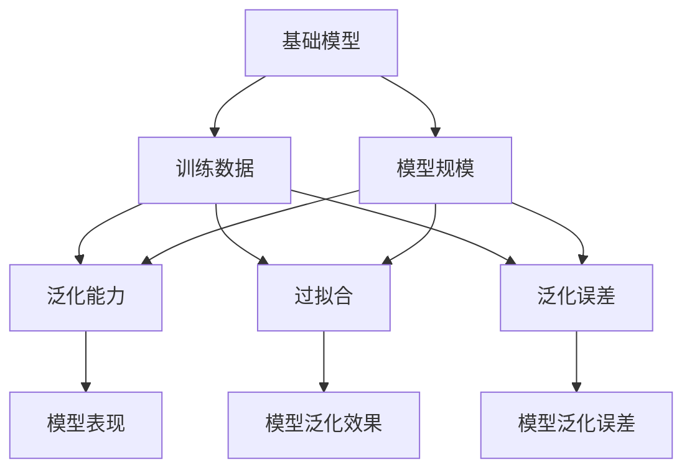

                 

# 基础模型的训练数据与模型规模

> 关键词：基础模型,训练数据,模型规模,模型泛化能力,过拟合,泛化误差,迁移学习

## 1. 背景介绍

随着深度学习技术的快速发展，各种基础模型（如卷积神经网络CNN、循环神经网络RNN、Transformer等）在计算机视觉、自然语言处理(NLP)、语音识别等众多领域取得了显著的成果。然而，这些基础模型的性能依赖于大规模的训练数据和模型规模，那么训练数据的多少与模型规模的大小是否存在最优解，数据与规模的平衡应如何取舍？本文旨在探讨基础模型的训练数据与模型规模的关系，并分析其对模型泛化能力、过拟合风险和迁移学习能力的影响。

## 2. 核心概念与联系

### 2.1 核心概念概述

为更好理解训练数据与模型规模的关系，本节将介绍几个关键概念：

- 基础模型(Fundamental Model)：如CNN、RNN、Transformer等深度学习模型。在特定领域或任务上，通过在大规模数据集上进行预训练和微调，获得相应的特征表示能力。
- 训练数据(Training Data)：在基础模型的训练过程中，用于学习模型参数的数据集。规模越大，模型学习能力越强，但同时也增加了数据采集和处理的成本。
- 模型规模(Model Scale)：基础模型的参数量、层数、计算复杂度等。规模越大，模型表达能力越强，但也会带来计算资源和存储成本的增加。
- 泛化能力(Generalization)：模型在不同数据集上表现一致的能力。数据量越多，模型泛化能力越强，但在有限数据下，过多的模型规模可能导致过拟合。
- 过拟合(Overfitting)：模型在训练数据上表现良好，但在测试数据上表现较差的现象。通常与模型规模有关，规模越大，越容易发生。
- 泛化误差(Generalization Error)：模型在未知数据上预测误差的期望值。泛化误差越小，模型泛化能力越强，但数据量不足或模型规模过大都可能导致泛化误差增加。
- 迁移学习能力(Transfer Learning)：在某个任务上训练的模型，能应用于不同但相关的任务。训练数据与模型规模的平衡会影响迁移学习能力。

这些核心概念之间的关系，可以通过以下Mermaid流程图来展示：



该流程图展示基础模型与训练数据、模型规模、泛化能力、过拟合、泛化误差之间的关系：

1. 基础模型通过训练数据学习参数，规模越大表达能力越强。
2. 训练数据越多，泛化能力越强，过拟合风险越低。
3. 模型规模越大，泛化误差越小，但数据不足可能导致过拟合。
4. 模型泛化能力与泛化误差共同决定模型表现。

## 3. 核心算法原理 & 具体操作步骤

### 3.1 算法原理概述

基础模型的训练数据与模型规模的关系，主要体现在以下几个方面：

1. **数据与模型规模的交互作用**：数据量越多，模型规模越大，学习能力越强，但过拟合风险也越高。
2. **泛化误差与模型规模**：模型规模越大，泛化误差越小，但在数据不足时，过拟合风险增加。
3. **迁移学习的效果**：数据量较多的模型，其迁移学习能力更强，但迁移时的数据量也应与模型规模相匹配。

### 3.2 算法步骤详解

**Step 1: 数据预处理与归一化**

- 对数据集进行标准化处理，如归一化、数据增强等，减少数据偏差。
- 划分训练集、验证集和测试集，通常验证集和测试集比例为10%和90%。

**Step 2: 模型构建与选择**

- 根据任务特点选择合适的模型架构，如卷积神经网络CNN用于图像识别，循环神经网络RNN用于时间序列预测，Transformer用于自然语言处理。
- 根据计算资源和数据量设置模型规模，如使用大模型可以处理大规模数据，但需要更大的计算资源。

**Step 3: 模型训练与优化**

- 使用随机梯度下降(SGD)、Adam等优化算法，设置合适的学习率和批大小。
- 定期在验证集上评估模型性能，避免过拟合。

**Step 4: 模型评估与测试**

- 在测试集上评估模型泛化误差，衡量模型泛化能力。
- 使用交叉验证等方法，减少评估误差。

**Step 5: 模型微调与优化**

- 在预训练模型的基础上，使用少量数据进行微调，调整模型参数，提升模型性能。
- 选择参数高效微调(PEFT)等技术，减少模型规模对计算资源的需求。

**Step 6: 模型部署与应用**

- 将训练好的模型部署到实际应用中，进行推理预测。
- 定期更新模型，保持其最新的泛化能力和性能。

### 3.3 算法优缺点

基础模型的训练数据与模型规模的选择具有以下优点：

1. **学习能力强**：数据量越多，模型规模越大，学习能力越强，可适应更复杂的任务。
2. **泛化能力强**：数据量较多的模型泛化能力更强，可以在新数据上表现良好。
3. **迁移能力强**：较大的模型规模可以更好地进行迁移学习，应用于不同但相关的任务。

同时，也存在一些局限性：

1. **计算资源需求高**：模型规模越大，计算资源和存储成本也越高，可能面临硬件瓶颈。
2. **过拟合风险高**：模型规模过大，容易发生过拟合，特别是在数据量不足时。
3. **泛化误差高**：数据量较少时，模型泛化误差可能较大，需要更多数据来提升性能。
4. **迁移学习难度大**：模型规模较大，迁移学习也需要更多的数据来保持性能。

## 4. 数学模型和公式 & 详细讲解 & 举例说明

### 4.1 数学模型构建

假设有一个基础模型 $M$，其参数为 $\theta$，训练数据集为 $D$，包含 $n$ 个样本。模型的预测输出为 $M(x; \theta)$，其中 $x$ 为输入数据。模型的损失函数为 $L$，通常使用均方误差、交叉熵等。训练数据与模型规模的关系可以通过以下公式表示：

$$
\min_{\theta} \frac{1}{n}\sum_{i=1}^n L(M(x_i; \theta), y_i)
$$

其中，$y_i$ 为样本的真实标签。

### 4.2 公式推导过程

为了简化问题，我们以单层感知器为例，推导模型泛化误差与训练数据的数量 $n$ 和模型规模 $d$ 的关系。

假设训练数据集中有 $n$ 个样本，每个样本有 $d$ 个特征。模型的预测输出为 $f(x_i; \theta)$，其中 $x_i \in \mathbb{R}^d$ 为样本特征向量，$\theta \in \mathbb{R}^d$ 为模型参数。损失函数为均方误差，即：

$$
L_i(f(x_i; \theta), y_i) = \frac{1}{2}(f(x_i; \theta) - y_i)^2
$$

假设模型参数 $\theta$ 的分布为高斯分布，即 $\theta \sim \mathcal{N}(0, \sigma^2)$。训练数据的均方误差为：

$$
\mathbb{E}_{\theta}[\frac{1}{n}\sum_{i=1}^n L_i(f(x_i; \theta), y_i)] = \frac{1}{2n}\sum_{i=1}^n \mathbb{E}_{\theta}[(f(x_i; \theta) - y_i)^2]
$$

其中 $\mathbb{E}_{\theta}$ 表示对参数 $\theta$ 的期望。进一步推导可得：

$$
\mathbb{E}_{\theta}[\frac{1}{n}\sum_{i=1}^n L_i(f(x_i; \theta), y_i)] = \frac{1}{2n}n\sigma^2 = \frac{\sigma^2}{2}
$$

因此，训练数据的数量 $n$ 和模型规模 $d$ 对均方误差的影响可以通过以下公式表示：

$$
\mathbb{E}_{\theta}[\frac{1}{n}\sum_{i=1}^n L_i(f(x_i; \theta), y_i)] = \frac{\sigma^2}{2} = \frac{1}{2d} + \frac{1}{2n}
$$

其中 $\frac{1}{2d}$ 表示模型规模对均方误差的影响，$\frac{1}{2n}$ 表示训练数据对均方误差的影响。

### 4.3 案例分析与讲解

以图像识别任务为例，假设使用一个简单的单层感知器模型 $M$，包含 $d$ 个神经元，每个神经元与 $d$ 个特征相连。使用 $n$ 个训练样本进行训练，损失函数为均方误差。

假设模型参数 $\theta$ 的初始分布为高斯分布 $\theta \sim \mathcal{N}(0, \sigma^2)$，训练数据的均方误差为 $\frac{\sigma^2}{2}$。为了保持均方误差不变，需要满足：

$$
\frac{\sigma^2}{2} = \frac{1}{2d} + \frac{1}{2n}
$$

当 $d$ 固定时，增加训练数据 $n$ 可以降低均方误差，但当 $n$ 达到一定规模后，增加 $n$ 对均方误差的影响将非常小。因此，模型规模与训练数据的数量之间存在一个最优平衡，在此平衡下，均方误差最小。

## 5. 项目实践：代码实例和详细解释说明

### 5.1 开发环境搭建

在进行模型训练与评估实践前，我们需要准备好开发环境。以下是使用Python进行TensorFlow开发的环境配置流程：

1. 安装Anaconda：从官网下载并安装Anaconda，用于创建独立的Python环境。

2. 创建并激活虚拟环境：
```bash
conda create -n tf-env python=3.8 
conda activate tf-env
```

3. 安装TensorFlow：根据CUDA版本，从官网获取对应的安装命令。例如：
```bash
conda install tensorflow
```

4. 安装各类工具包：
```bash
pip install numpy pandas scikit-learn matplotlib tqdm jupyter notebook ipython
```

完成上述步骤后，即可在`tf-env`环境中开始模型训练与评估实践。

### 5.2 源代码详细实现

这里我们以手写数字识别(MNIST)任务为例，给出使用TensorFlow进行模型训练的完整代码实现。

首先，定义模型结构：

```python
import tensorflow as tf

class MNISTModel(tf.keras.Model):
    def __init__(self):
        super(MNISTModel, self).__init__()
        self.flatten = tf.keras.layers.Flatten()
        self.dense1 = tf.keras.layers.Dense(128, activation='relu')
        self.dense2 = tf.keras.layers.Dense(10, activation='softmax')

    def call(self, x):
        x = self.flatten(x)
        x = self.dense1(x)
        return self.dense2(x)
```

然后，定义训练函数：

```python
import numpy as np

@tf.function
def train_step(images, labels):
    with tf.GradientTape() as tape:
        predictions = model(images, training=True)
        loss = tf.losses.sparse_softmax_cross_entropy(labels, predictions)
    gradients = tape.gradient(loss, model.trainable_variables)
    optimizer.apply_gradients(zip(gradients, model.trainable_variables))
    return loss

@tf.function
def train_epoch(model, dataset, batch_size):
    model.train()
    for images, labels in dataset:
        batch_size = min(len(images), batch_size)
        loss = train_step(images[:batch_size], labels[:batch_size])
        print("Train Loss: ", loss)
```

最后，启动模型训练流程：

```python
epochs = 10
batch_size = 64
train_dataset = tf.data.Dataset.from_tensor_slices((train_images, train_labels)).batch(batch_size)
model.compile(optimizer='adam', loss='sparse_categorical_crossentropy', metrics=['accuracy'])
model.fit(train_dataset, epochs=epochs, validation_data=(test_images, test_labels))
```

以上就是使用TensorFlow进行手写数字识别任务训练的完整代码实现。可以看到，TensorFlow的高级API使得模型训练过程非常简洁高效。

### 5.3 代码解读与分析

让我们再详细解读一下关键代码的实现细节：

**MNISTModel类**：
- `__init__`方法：定义模型结构，包括一个Flatten层和两个Dense层。
- `call`方法：定义模型前向传播过程，将输入数据传递至模型。

**train_step函数**：
- 在梯度带内计算损失和梯度，并更新模型参数。
- 返回该批次的损失值，用于计算epoch平均损失。

**train_epoch函数**：
- 在每个epoch中，循环遍历训练集数据，在每个batch上进行训练。
- 打印出当前epoch的平均损失值。

**模型训练流程**：
- 定义总的epoch数和批大小，启动训练过程。
- 使用model.compile设置优化器和损失函数。
- 使用model.fit进行模型训练，并在验证集上评估模型性能。

可以看出，TensorFlow的高阶API和自动微分机制大大简化了模型的构建、训练和评估过程。开发者可以将更多精力放在模型设计和参数调整上，而不必过多关注底层细节。

## 6. 实际应用场景

### 6.1 智慧医疗

在智慧医疗领域，基础模型通常用于医学影像分类、疾病预测、基因分析等任务。由于医疗数据复杂且隐私敏感，数据采集和标注成本较高。此时，选择适量的数据集和合适的模型规模，可以有效提升模型泛化能力，避免过拟合。

例如，使用在大规模通用医疗影像数据集上进行预训练的模型，然后在特定医院的CT影像数据上进行微调。微调后的模型能够更准确地识别和分类特定医院的CT影像，提高诊断效率和准确率。

### 6.2 智能制造

智能制造领域需要基础模型对生产数据进行实时分析和预测。由于制造数据量大且实时性强，模型需要在短时间内处理和分析大量数据，对模型计算资源和内存要求较高。此时，需要在数据量充足的情况下，选择更大规模的模型，以提高处理速度和预测精度。

例如，使用在大规模生产数据集上进行预训练的RNN模型，然后在实时生产数据上进行微调。微调后的模型能够更快速地对实时生产数据进行分析，预测设备故障、生产效率等关键指标，优化生产流程。

### 6.3 金融风控

金融风控领域需要基础模型对用户行为和交易数据进行风险评估和信用评分。由于金融数据涉及隐私和敏感信息，数据采集和标注成本较高。此时，选择适量的数据集和合适的模型规模，可以有效提升模型泛化能力，避免过拟合。

例如，使用在大规模金融数据集上进行预训练的模型，然后在特定银行的用户行为数据上进行微调。微调后的模型能够更准确地评估用户的信用风险，提高风控效率和准确率。

### 6.4 未来应用展望

随着基础模型的不断发展，其在各个领域的应用将更加广泛，为人类生产和生活带来新的变革。

在智慧城市治理中，基础模型将用于城市事件监测、舆情分析、应急指挥等环节，提高城市管理的自动化和智能化水平，构建更安全、高效的未来城市。

在智能交通中，基础模型将用于交通流量预测、自动驾驶等任务，提升交通管理效率和安全性。

在能源管理中，基础模型将用于能源需求预测、智能调度等任务，优化能源配置和使用效率。

总之，基础模型在各个领域的应用前景广阔，未来将带来更多的创新和突破。

## 7. 工具和资源推荐

### 7.1 学习资源推荐

为了帮助开发者系统掌握基础模型的训练数据与模型规模的理论基础和实践技巧，这里推荐一些优质的学习资源：

1. 《深度学习》书籍：由Ian Goodfellow等专家所著，全面介绍了深度学习的基本概念、算法原理和应用案例。

2. 《TensorFlow官方文档》：TensorFlow官方提供的详细教程和API文档，是TensorFlow开发的必备资源。

3. 《PyTorch官方文档》：PyTorch官方提供的详细教程和API文档，是PyTorch开发的必备资源。

4. Kaggle机器学习竞赛：Kaggle提供了众多数据集和机器学习竞赛，适合实战练习和经验积累。

5. Coursera《深度学习专项课程》：由斯坦福大学和DeepMind等知名机构提供的深度学习课程，涵盖深度学习的基本原理和实践技巧。

通过对这些资源的学习实践，相信你一定能够快速掌握基础模型的训练数据与模型规模的精髓，并用于解决实际的NLP问题。

### 7.2 开发工具推荐

高效的开发离不开优秀的工具支持。以下是几款用于基础模型训练与评估开发的常用工具：

1. PyTorch：基于Python的开源深度学习框架，灵活动态的计算图，适合快速迭代研究。TensorFlow和PyTorch都有丰富的预训练模型资源。

2. TensorFlow：由Google主导开发的开源深度学习框架，生产部署方便，适合大规模工程应用。

3. Weights & Biases：模型训练的实验跟踪工具，可以记录和可视化模型训练过程中的各项指标，方便对比和调优。与主流深度学习框架无缝集成。

4. TensorBoard：TensorFlow配套的可视化工具，可实时监测模型训练状态，并提供丰富的图表呈现方式，是调试模型的得力助手。

5. Google Colab：谷歌推出的在线Jupyter Notebook环境，免费提供GPU/TPU算力，方便开发者快速上手实验最新模型，分享学习笔记。

合理利用这些工具，可以显著提升基础模型训练与评估任务的开发效率，加快创新迭代的步伐。

### 7.3 相关论文推荐

基础模型训练数据与模型规模的研究源于学界的持续研究。以下是几篇奠基性的相关论文，推荐阅读：

1. The Effect of Input Size and Network Structure on Object Recognition (1992)：研究了数据量、模型规模和分类准确率之间的关系。

2. Overfitting in Deep Learning: An Experimental Analysis of Various Regularization Techniques (2017)：研究了各种正则化技术对过拟合的影响，并提出了一些解决方案。

3. The Overfitting Problem in Deep Learning (2018)：综述了深度学习中过拟合问题的现状和解决方案，并提出了一些新的研究方向。

4. Transfer Learning from Self-Supervised Pre-training with BigQuery-MNIST (2020)：研究了大规模无监督预训练对迁移学习效果的影响。

5. A Survey of Transfer Learning with Deep Neural Networks (2020)：综述了深度学习中的迁移学习方法和应用案例。

这些论文代表了大规模基础模型训练数据与模型规模的研究脉络。通过学习这些前沿成果，可以帮助研究者把握学科前进方向，激发更多的创新灵感。

## 8. 总结：未来发展趋势与挑战

### 8.1 研究成果总结

本文对基础模型的训练数据与模型规模的关系进行了全面系统的探讨。首先阐述了数据量、模型规模与模型泛化能力之间的关系，明确了数据量不足或模型规模过大可能导致的问题。其次，从原理到实践，详细讲解了基础模型训练的数学模型和算法步骤，给出了模型训练与评估的完整代码实例。同时，本文还广泛探讨了基础模型在各个领域的应用前景，展示了其在实际场景中的强大潜力。

通过本文的系统梳理，可以看到，基础模型的训练数据与模型规模的选择对模型性能具有重要影响。适当的数据量与模型规模的平衡，可以有效提升模型的泛化能力和性能。未来，伴随基础模型训练数据的不断增加和算法技术的持续演进，相信基础模型在更多领域的应用将取得更大突破。

### 8.2 未来发展趋势

展望未来，基础模型的训练数据与模型规模的研究将呈现以下几个发展趋势：

1. 数据量持续增大：随着数据采集和标注技术的进步，数据量将不断增加，基础模型的性能也将进一步提升。

2. 模型规模不断增大：由于计算资源的丰富，模型规模也将逐渐增大，增强基础模型的表达能力和泛化能力。

3. 迁移学习与小样本学习：更多的迁移学习方法和小样本学习算法将被应用于基础模型训练中，提升模型在有限数据下的性能。

4. 自监督学习与无监督学习：自监督学习和无监督学习方法将得到广泛应用，提高模型在大规模数据下的泛化能力。

5. 多任务学习与联合学习：多任务学习和联合学习方法将得到应用，增强基础模型的多任务处理能力和迁移学习能力。

6. 高效模型压缩与量化：基础模型的压缩和量化技术将不断进步，降低模型规模和计算资源需求，提高模型部署效率。

7. 硬件优化与分布式训练：更多的硬件优化和分布式训练技术将被应用，提高模型训练速度和计算效率。

以上趋势凸显了基础模型训练数据与模型规模研究的广阔前景。这些方向的探索发展，必将进一步提升基础模型的性能和应用范围，为人工智能技术的发展提供新的动力。

### 8.3 面临的挑战

尽管基础模型的训练数据与模型规模的研究已经取得了显著成果，但在实际应用中，仍然面临诸多挑战：

1. 数据采集和标注成本高：基础模型训练需要大规模数据集，数据采集和标注成本较高。如何降低成本，提高数据质量，成为一大难题。

2. 模型规模过大：模型规模过大，可能导致过拟合，影响模型泛化能力。如何选择合适的模型规模，提升模型性能，仍需进一步探索。

3. 计算资源需求高：基础模型训练和推理需要大量的计算资源，硬件瓶颈可能导致训练和部署困难。如何优化模型结构和硬件资源，提高训练效率，仍需进一步研究。

4. 模型泛化误差高：数据量不足时，模型泛化误差可能较大，影响实际应用效果。如何提高模型泛化能力，降低过拟合风险，仍需进一步探索。

5. 模型迁移能力有限：模型规模和数据量不一致时，迁移学习效果可能较差。如何优化迁移学习方法，提升模型迁移能力，仍需进一步研究。

6. 模型可解释性差：基础模型通常缺乏可解释性，难以理解模型决策过程和输出结果。如何增强模型可解释性，提高系统透明度，仍需进一步探索。

7. 模型安全性低：基础模型可能学习到有害信息，导致模型输出不符合伦理和法律要求。如何保障模型安全性，避免恶意用途，仍需进一步研究。

这些挑战凸显了基础模型训练数据与模型规模研究的复杂性。未来的研究需要在多个方面进行探索和突破，才能进一步提升基础模型的性能和应用范围。

### 8.4 研究展望

面对基础模型训练数据与模型规模研究所面临的诸多挑战，未来的研究需要在以下几个方面寻求新的突破：

1. 探索高效数据采集与标注技术：研究如何通过自动化标注、无监督学习等技术，降低数据采集和标注成本，提高数据质量和数量。

2. 研究高效模型压缩与量化方法：研究如何通过模型剪枝、量化等技术，降低模型规模和计算资源需求，提高模型部署效率。

3. 开发自监督学习与无监督学习方法：研究如何通过自监督学习、无监督学习等方法，在大规模数据下提升模型泛化能力，避免过拟合。

4. 优化迁移学习方法：研究如何通过多任务学习、联合学习等方法，提升模型迁移能力和泛化能力，适应更多领域和任务。

5. 提高模型可解释性：研究如何通过因果分析、解释性机器学习等方法，增强模型可解释性，提高系统透明度和可信度。

6. 保障模型安全性：研究如何通过模型训练目标、约束优化等方法，保障模型安全性，避免恶意用途，确保系统合规合法。

这些研究方向的探索，必将引领基础模型训练数据与模型规模研究迈向更高的台阶，为人工智能技术的发展提供新的动力。面向未来，基础模型需要与其他人工智能技术进行更深入的融合，如知识表示、因果推理、强化学习等，多路径协同发力，共同推动基础模型的进步。只有勇于创新、敢于突破，才能不断拓展基础模型的边界，让智能技术更好地造福人类社会。

## 9. 附录：常见问题与解答

**Q1：什么是基础模型？**

A: 基础模型（如CNN、RNN、Transformer等）是深度学习中常用的模型结构。通过在大规模数据集上进行预训练和微调，获得相应的特征表示能力。

**Q2：数据量与模型规模的关系如何？**

A: 数据量越多，模型规模越大，学习能力越强，但过拟合风险也越高。需要在数据量充足的情况下选择较大的模型规模，以提升模型性能。

**Q3：如何降低数据采集和标注成本？**

A: 可以通过自动化标注、无监督学习等技术，降低数据采集和标注成本。同时，使用小规模数据集进行预训练，再在大规模数据集上进行微调，也能提升模型性能。

**Q4：如何优化模型压缩与量化方法？**

A: 可以使用模型剪枝、量化等技术，降低模型规模和计算资源需求，提高模型部署效率。同时，可以采用深度学习压缩算法，如知识蒸馏、神经网络结构搜索等，进一步优化模型压缩效果。

**Q5：如何提高模型迁移能力？**

A: 可以使用多任务学习、联合学习等方法，提升模型迁移能力和泛化能力，适应更多领域和任务。同时，可以使用数据增强、迁移学习等技术，进一步提升模型的迁移能力。

**Q6：如何增强模型可解释性？**

A: 可以使用因果分析、解释性机器学习等方法，增强模型可解释性，提高系统透明度和可信度。同时，可以通过模型设计，增加模型的可解释性，如使用可解释性较高的模型结构等。

**Q7：如何保障模型安全性？**

A: 可以通过模型训练目标、约束优化等方法，保障模型安全性，避免恶意用途，确保系统合规合法。同时，可以使用模型监控、模型蒸馏等技术，提高模型的鲁棒性和安全性。

通过这些问题的解答，希望能帮助你更全面地理解基础模型的训练数据与模型规模的关系，并更好地应用于实际应用场景中。

---

作者：禅与计算机程序设计艺术 / Zen and the Art of Computer Programming

