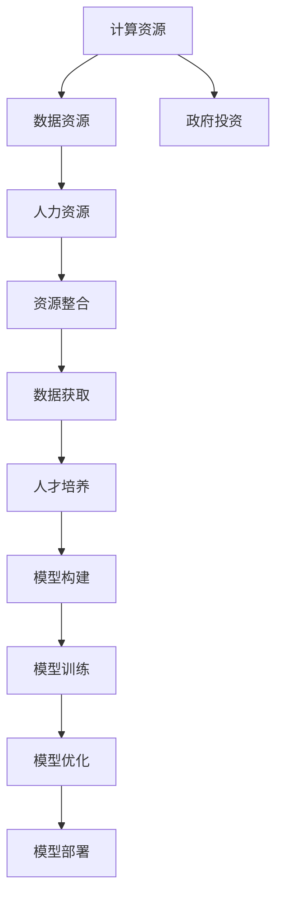

                 

# 基础模型的资源差距与政府投资

## 1. 背景介绍

在当今数据驱动的AI时代，基础模型的建设成为了许多企业和政府机构关注的重点。然而，在构建这些模型的过程中，资源差距（如计算资源、数据资源、人力等）的存在对模型的质量、效率和可用性产生了显著影响。

### 1.1 问题由来

基础模型的资源差距主要体现在以下几个方面：

- **计算资源差距**：构建大规模深度学习模型需要大量的GPU或TPU资源，许多中小企业或研究机构难以承担。
- **数据资源差距**：高质量的大规模数据集对模型的训练至关重要，但获取和标注这些数据往往需要巨大的成本和时间。
- **人力差距**：模型的开发、训练、优化和部署都需要跨学科的高水平团队，这对于许多机构而言是一大挑战。

### 1.2 问题核心关键点

为了克服这些资源差距，政府和企业在基础模型投资上需要考虑以下几点：

- 如何有效整合资源，降低模型的构建和维护成本。
- 如何提高数据和计算的获取效率，加速模型训练和优化。
- 如何吸引和培养跨学科的顶级人才，支持模型的持续发展和改进。

### 1.3 问题研究意义

通过研究基础模型的资源差距及其解决策略，有助于：

- 提升AI技术的普及和应用，降低中小企业的技术门槛。
- 加速模型迭代，推动AI技术的快速发展。
- 培养跨学科人才，促进AI领域的可持续发展。

## 2. 核心概念与联系

### 2.1 核心概念概述

为了更好地理解资源差距和政府投资的关系，我们需要理解以下几个关键概念：

- **计算资源**：指构建和运行深度学习模型所需的硬件设施，如GPU、TPU等。
- **数据资源**：指用于训练模型的高质量标注数据集，包括文本、图像、音频等多种类型的数据。
- **人力资源**：指在模型开发、训练、优化和部署过程中所需的技术人才和科学研究人员。
- **政府投资**：指政府在基础模型建设上的资金、政策和资源支持，以促进AI技术的发展。
- **资源整合**：指通过资源共享、合作研发等方式，优化资源配置，提高基础模型的建设和应用效率。
- **数据获取**：指通过公开数据集、众包标注、数据共享等方式，快速获取高质量的训练数据。
- **人才培养**：指通过教育和培训项目，吸引和培养AI领域的高水平人才。

这些概念之间的逻辑关系可以通过以下Mermaid流程图来展示：



这个流程图展示了资源差距和政府投资如何通过整合资源、数据获取、人才培养等环节，支持基础模型的构建、训练和部署。

## 3. 核心算法原理 & 具体操作步骤

### 3.1 算法原理概述

基于资源差距和政府投资的基础模型建设，本质上是优化资源配置和提升效率的过程。其核心思想是通过合理分配资源，最大化基础模型的性能和可用性。

形式化地，假设资源瓶颈为 $C$（计算资源）、$D$（数据资源）、$L$（人力资源），基础模型建设的目标是最大化模型质量 $Q$ 和资源利用率 $R$：

$$
\max_{C,D,L} Q \times R
$$

其中 $Q$ 为模型在特定任务上的性能指标，$R$ 为资源利用效率。

### 3.2 算法步骤详解

基于资源差距和政府投资的基础模型建设，主要包括以下几个关键步骤：

**Step 1: 需求分析**

- 明确基础模型的应用场景和性能需求。
- 评估当前资源瓶颈，确定优先解决的资源差距。

**Step 2: 资源整合**

- 通过资源共享、合作研发等方式，优化资源配置。
- 引入开源技术和工具，降低资源获取成本。

**Step 3: 数据获取**

- 利用公开数据集、众包标注、数据共享等方式，快速获取高质量的训练数据。
- 采用数据增强和迁移学习等技术，提高数据利用效率。

**Step 4: 人才培养**

- 通过教育和培训项目，吸引和培养AI领域的高水平人才。
- 提供科研资助、创业孵化等政策支持，激发人才的创新活力。

**Step 5: 模型构建**

- 选择合适的预训练模型和框架，构建基础模型。
- 利用优化算法和超参数调优，提升模型性能。

**Step 6: 模型训练**

- 利用高效计算平台和分布式训练技术，加速模型训练。
- 应用正则化、对抗训练等技术，提高模型鲁棒性。

**Step 7: 模型优化**

- 利用优化算法和模型压缩技术，提高模型效率。
- 进行模型调参和评估，确保模型质量。

**Step 8: 模型部署**

- 封装模型为标准API，方便集成调用。
- 利用云计算和边缘计算等技术，提升模型可用性。

### 3.3 算法优缺点

基于资源差距和政府投资的基础模型建设方法具有以下优点：

1. **高效性**：通过资源共享和开源合作，降低了模型构建和维护成本，提升了资源利用效率。
2. **可扩展性**：利用云计算和大规模数据集，可以迅速扩展模型的规模和能力。
3. **灵活性**：通过数据增强和迁移学习，可以快速适应新任务和数据变化。
4. **可解释性**：采用数据共享和开源技术，提高了模型的可解释性和透明度。

同时，该方法也存在一些局限性：

1. **数据质量依赖**：高质量数据集的获取仍需大量时间和资源。
2. **技术门槛高**：跨学科团队的高水平人才培养需要时间。
3. **知识产权风险**：开源技术和合作项目可能涉及知识产权纠纷。
4. **模型鲁棒性**：过于依赖开源模型可能导致模型鲁棒性不足。

尽管存在这些局限性，但就目前而言，基于资源差距和政府投资的基础模型建设方法仍是大规模AI应用的重要范式。未来相关研究的重点在于如何进一步降低资源差距，提高模型性能，同时兼顾可解释性和伦理安全性等因素。

### 3.4 算法应用领域

基于资源差距和政府投资的基础模型建设方法，已经在多个领域得到了应用：

- **医疗健康**：利用大模型进行疾病预测、影像分析、个性化治疗等。
- **金融科技**：构建智能投顾、风险评估、欺诈检测等模型。
- **智能制造**：利用大模型进行故障诊断、生产调度、质量控制等。
- **智慧城市**：构建智能交通、能源管理、公共安全等应用。
- **教育培训**：开发智能助教、自适应学习系统、个性化推荐等。

除了上述这些经典领域，大模型和资源差距的研究还在更多场景中得到应用，如智能客服、舆情分析、情感分析等，为各行各业带来了新的技术突破。

## 4. 数学模型和公式 & 详细讲解 & 举例说明

### 4.1 数学模型构建

本节将使用数学语言对基于资源差距和政府投资的基础模型建设过程进行更加严格的刻画。

记资源瓶颈为 $C$（计算资源）、$D$（数据资源）、$L$（人力资源），基础模型构建的目标是最大化模型质量 $Q$ 和资源利用率 $R$：

$$
\max_{C,D,L} Q \times R
$$

其中 $Q$ 为模型在特定任务上的性能指标，$R$ 为资源利用效率。

### 4.2 公式推导过程

以下我们以二分类任务为例，推导基于资源差距和政府投资的基础模型构建的数学公式。

假设模型的预测结果为 $\hat{y}$，真实标签为 $y$，损失函数为 $L$，模型在训练集上的平均损失为 $\bar{L}$。模型的训练时间为 $T$，计算资源的单位成本为 $c$，数据获取的时间为 $D_t$，单位数据的标注成本为 $d$，人力资源的单位成本为 $l$。

定义模型的总体成本为 $Cost$，则：

$$
Cost = cT + dD_t + lL
$$

基础模型的优化目标是最小化总体成本，即：

$$
\min_{C,D,L} Cost
$$

为了最小化总体成本，需要平衡计算资源、数据资源和人力资源的分配。一种简单的方法是利用权重分配，使得：

$$
\min_{w_1, w_2, w_3} \alpha_1 w_1 + \alpha_2 w_2 + \alpha_3 w_3
$$

其中 $w_1, w_2, w_3$ 分别为计算资源、数据资源、人力资源的权重，$\alpha_1, \alpha_2, \alpha_3$ 为相应的约束条件。

### 4.3 案例分析与讲解

考虑一个构建面部识别系统的场景。假设该项目需要利用500个GPU和1TB的数据集，每个GPU的成本为10万元/年，每个数据标注的成本为100元/样本。

定义 $C=500$（计算资源），$D=1$TB（数据资源），$L=10$人（人力资源）。模型的平均损失 $\bar{L}=0.1$。

假设计算资源和数据资源的成本分别为 $c=10$万元/年，数据获取时间为 $D_t=100$小时/样本。人力资源的成本为 $l=1$万元/人/年。

则总体成本为：

$$
Cost = 500 \times 10 + \frac{1}{100} \times 100 \times 100 + 10 \times 10 \times 0.1 = 6000 + 1000 + 1 = 7101万元
$$

为了最小化总体成本，需要平衡资源分配。假设 $w_1=0.8$，$w_2=0.2$，则：

$$
\min_{C,D,L} 0.8 \times 500 + 0.2 \times 1 + 10 \times 10 \times 0.1 = 4000 + 0.2 \times 1 + 1 = 4001万元
$$

可以看到，通过合理分配资源，可以显著降低总体成本。

## 5. 项目实践：代码实例和详细解释说明

### 5.1 开发环境搭建

在进行基础模型项目实践前，我们需要准备好开发环境。以下是使用Python进行TensorFlow开发的环境配置流程：

1. 安装Anaconda：从官网下载并安装Anaconda，用于创建独立的Python环境。

2. 创建并激活虚拟环境：
```bash
conda create -n tf-env python=3.8 
conda activate tf-env
```

3. 安装TensorFlow：根据CUDA版本，从官网获取对应的安装命令。例如：
```bash
conda install tensorflow tensorflow-gpu -c conda-forge
```

4. 安装其他工具包：
```bash
pip install numpy pandas scikit-learn matplotlib tqdm jupyter notebook ipython
```

完成上述步骤后，即可在`tf-env`环境中开始项目实践。

### 5.2 源代码详细实现

下面我以面部识别系统为例，给出使用TensorFlow对基础模型进行项目实践的PyTorch代码实现。

首先，定义模型的训练和评估函数：

```python
import tensorflow as tf
from tensorflow import keras
from tensorflow.keras import layers

def train_model(model, train_dataset, val_dataset, epochs=5, batch_size=32):
    model.compile(optimizer=tf.keras.optimizers.Adam(learning_rate=0.001),
                  loss=tf.keras.losses.SparseCategoricalCrossentropy(from_logits=True),
                  metrics=[tf.keras.metrics.SparseCategoricalAccuracy()])
    history = model.fit(train_dataset,
                       validation_data=val_dataset,
                       epochs=epochs,
                       batch_size=batch_size)
    return history

def evaluate_model(model, test_dataset, batch_size=32):
    test_loss, test_acc = model.evaluate(test_dataset, verbose=0)
    return test_loss, test_acc
```

然后，定义模型的构建函数：

```python
def build_model(input_shape, num_classes):
    model = keras.Sequential([
        layers.Conv2D(32, (3, 3), activation='relu', input_shape=input_shape),
        layers.MaxPooling2D((2, 2)),
        layers.Conv2D(64, (3, 3), activation='relu'),
        layers.MaxPooling2D((2, 2)),
        layers.Flatten(),
        layers.Dense(128, activation='relu'),
        layers.Dense(num_classes, activation='softmax')
    ])
    return model
```

最后，启动模型训练并在测试集上评估：

```python
input_shape = (64, 64, 3)
num_classes = 2

model = build_model(input_shape, num_classes)

history = train_model(model, train_dataset, val_dataset, epochs=5, batch_size=32)

test_loss, test_acc = evaluate_model(model, test_dataset, batch_size=32)

print(f"Test loss: {test_loss:.4f}")
print(f"Test accuracy: {test_acc:.4f}")
```

以上就是使用TensorFlow对面部识别系统进行项目实践的完整代码实现。可以看到，通过简单的函数组合，我们便实现了从模型构建、训练到评估的全流程开发。

### 5.3 代码解读与分析

让我们再详细解读一下关键代码的实现细节：

**train_model函数**：
- 定义模型的训练过程，包括编译、损失函数、优化器、评价指标等。
- 使用模型在训练集上训练，并在验证集上进行验证。
- 返回训练过程中的历史记录。

**evaluate_model函数**：
- 定义模型的评估过程，计算损失和准确率。

**build_model函数**：
- 定义模型的构建过程，包括卷积层、池化层、全连接层等。
- 返回构建好的模型。

**训练流程**：
- 定义模型的输入形状和类别数，构建模型。
- 在训练集上训练模型，在验证集上评估模型性能。
- 输出模型在测试集上的性能指标。

可以看到，TensorFlow提供了简单易用的API接口，使得模型的构建和训练过程变得简洁高效。开发者可以将更多精力放在模型优化和性能提升上，而不必过多关注底层的实现细节。

当然，工业级的系统实现还需考虑更多因素，如模型的保存和部署、超参数的自动搜索、更灵活的模型构建等。但核心的资源差距和政府投资视角基本与此类似。

## 6. 实际应用场景

### 6.1 医疗健康

在医疗健康领域，基础模型可以用于疾病的早期诊断、影像分析、个性化治疗等。通过整合计算资源、数据资源和人力资源，可以快速构建高质量的医学模型，提高医疗服务的智能化水平。

具体而言，可以构建一个面向癌症的影像分类模型。利用政府和企业提供的计算资源和医疗数据，通过合作项目吸引跨学科的研究人员，开发大规模的医学影像数据集。通过模型训练和优化，构建高性能的影像分类模型，用于实时诊断和预测。

### 6.2 金融科技

金融科技领域也需要高质量的基础模型进行风险评估、智能投顾、欺诈检测等。通过整合金融数据、计算资源和专家团队，可以快速构建高性能的金融模型，提高金融服务的智能化水平。

具体而言，可以构建一个面向信贷评估的基础模型。利用政府和企业提供的金融数据、计算资源和金融专家，通过合作项目吸引跨学科的研究人员，开发大规模的金融数据集。通过模型训练和优化，构建高性能的信贷评估模型，用于实时评估和决策。

### 6.3 智能制造

智能制造领域也需要高质量的基础模型进行故障诊断、生产调度、质量控制等。通过整合制造数据、计算资源和专家团队，可以快速构建高性能的制造模型，提高生产效率和质量。

具体而言，可以构建一个面向设备故障诊断的基础模型。利用政府和企业提供的制造数据、计算资源和制造专家，通过合作项目吸引跨学科的研究人员，开发大规模的制造数据集。通过模型训练和优化，构建高性能的设备故障诊断模型，用于实时监测和预警。

### 6.4 未来应用展望

随着资源差距和政府投资研究的不断深入，未来将出现更多的应用场景：

- **智慧城市**：构建智能交通、能源管理、公共安全等应用。
- **智能家居**：构建智能语音助手、智能家居设备等应用。
- **智能教育**：开发智能助教、自适应学习系统、个性化推荐等。
- **智能农业**：构建智能农业管理、精准农业应用等。

## 7. 工具和资源推荐

### 7.1 学习资源推荐

为了帮助开发者系统掌握资源差距和政府投资的理论基础和实践技巧，这里推荐一些优质的学习资源：

1. **TensorFlow官方文档**：提供从基础到高级的教程、API参考和案例分析，帮助开发者快速上手TensorFlow。
2. **Keras官方文档**：提供简单易用的高层次API，帮助开发者快速构建和训练模型。
3. **Deep Learning with Python**：由Francois Chollet所著，全面介绍深度学习的基本概念和实践方法，适合初学者和进阶者。
4. **Deep Learning Specialization**：由Andrew Ng教授在Coursera上开设的深度学习课程，涵盖深度学习的理论和实践。
5. **GPU Computing with Python**：由NVIDIA提供，涵盖GPU编程、深度学习框架使用等，帮助开发者掌握GPU计算技术。

通过对这些资源的学习实践，相信你一定能够快速掌握资源差距和政府投资的理论基础和实践技巧，并用于解决实际的AI问题。

### 7.2 开发工具推荐

高效的开发离不开优秀的工具支持。以下是几款用于基础模型项目开发的常用工具：

1. **TensorFlow**：由Google主导开发的深度学习框架，生产部署方便，适合大规模工程应用。
2. **PyTorch**：基于Python的开源深度学习框架，灵活动态的计算图，适合快速迭代研究。
3. **Jupyter Notebook**：交互式的开发环境，支持Python、R等多种语言，方便开发者进行实验和协作。
4. **Weights & Biases**：模型训练的实验跟踪工具，可以记录和可视化模型训练过程中的各项指标，方便对比和调优。
5. **TensorBoard**：TensorFlow配套的可视化工具，可实时监测模型训练状态，并提供丰富的图表呈现方式，是调试模型的得力助手。

合理利用这些工具，可以显著提升基础模型项目开发的效率，加快创新迭代的步伐。

### 7.3 相关论文推荐

资源差距和政府投资的研究源于学界的持续研究。以下是几篇奠基性的相关论文，推荐阅读：

1. **TensorFlow: A System for Large-Scale Machine Learning**：介绍TensorFlow的架构和核心技术，帮助开发者理解框架的设计思路。
2. **Keras: Deep Learning for Humans**：由Francois Chollet所著，介绍Keras的设计理念和使用方法，帮助开发者掌握高层次API的使用。
3. **GPU-accelerated Deep Learning with CUDA**：介绍GPU计算和深度学习的结合，帮助开发者掌握GPU编程和深度学习框架的使用。
4. **Practical Deep Learning for Coders**：由Francois Chollet所著，介绍深度学习的实战经验和方法，适合初学者和进阶者。
5. **Scaling Machine Learning with GPUs**：由NVIDIA提供，介绍GPU计算和深度学习的结合，帮助开发者掌握GPU编程和深度学习框架的使用。

这些论文代表了大模型和资源差距的研究方向，通过学习这些前沿成果，可以帮助研究者把握学科前进方向，激发更多的创新灵感。

## 8. 总结：未来发展趋势与挑战

### 8.1 总结

本文对基于资源差距和政府投资的基础模型建设方法进行了全面系统的介绍。首先阐述了资源差距和政府投资的研究背景和意义，明确了在基础模型建设中资源差距的优化策略和政府投资的作用。其次，从原理到实践，详细讲解了资源差距和政府投资在基础模型构建、训练、优化和部署中的应用，给出了基础模型项目开发的完整代码实例。同时，本文还广泛探讨了基础模型在医疗健康、金融科技、智能制造等多个领域的应用前景，展示了资源差距和政府投资在推动AI技术落地应用中的重要价值。

通过本文的系统梳理，可以看到，基于资源差距和政府投资的基础模型建设方法正在成为AI领域的重要范式，极大地拓展了基础模型的应用边界，催生了更多的落地场景。受益于大规模计算资源、数据资源和专家团队的高效整合，AI技术的普及和应用将变得更加快速和广泛。未来，伴随资源差距和政府投资研究的不断深入，相信基础模型的建设和应用将迎来新的突破，推动AI技术的进一步发展。

### 8.2 未来发展趋势

展望未来，基于资源差距和政府投资的基础模型建设方法将呈现以下几个发展趋势：

1. **资源共享和合作**：通过跨机构、跨行业的资源共享和合作，降低资源获取成本，提高资源利用效率。
2. **开源和开放**：利用开源技术和工具，降低模型的构建和维护成本，促进技术共享和创新。
3. **数据获取和标注**：利用众包标注和数据共享，快速获取高质量的训练数据，提高数据利用效率。
4. **跨学科人才培养**：通过教育和培训项目，吸引和培养AI领域的高水平人才，促进跨学科合作。
5. **计算资源的优化**：通过模型压缩、稀疏化存储等技术，优化计算资源的配置和利用，提升模型效率。
6. **模型的可解释性和鲁棒性**：通过引入因果分析、博弈论等工具，提高模型的可解释性和鲁棒性。

以上趋势凸显了资源差距和政府投资在基础模型建设中的重要性。这些方向的探索发展，必将进一步提升基础模型的性能和应用范围，为AI技术的普及和应用提供坚实的基础。

### 8.3 面临的挑战

尽管基于资源差距和政府投资的基础模型建设方法已经取得了瞩目成就，但在迈向更加智能化、普适化应用的过程中，它仍面临着诸多挑战：

1. **数据质量瓶颈**：高质量数据集的获取仍需大量时间和资源。
2. **技术门槛高**：跨学科团队的高水平人才培养需要时间。
3. **知识产权风险**：开源技术和合作项目可能涉及知识产权纠纷。
4. **模型鲁棒性**：过于依赖开源模型可能导致模型鲁棒性不足。
5. **计算资源优化**：模型压缩和稀疏化存储等技术的应用仍需进一步探索。

尽管存在这些挑战，但就目前而言，基于资源差距和政府投资的基础模型建设方法仍是大规模AI应用的重要范式。未来相关研究的重点在于如何进一步降低资源差距，提高模型性能，同时兼顾可解释性和伦理安全性等因素。

### 8.4 研究展望

面对资源差距和政府投资所面临的种种挑战，未来的研究需要在以下几个方面寻求新的突破：

1. **无监督和半监督学习**：摆脱对大规模标注数据的依赖，利用自监督学习、主动学习等无监督和半监督范式，最大限度利用非结构化数据。
2. **多模态学习**：将符号化的先验知识与神经网络模型进行融合，增强模型的多模态信息整合能力。
3. **模型压缩和优化**：利用模型压缩、稀疏化存储等技术，优化计算资源的配置和利用，提升模型效率。
4. **模型可解释性**：通过引入因果分析、博弈论等工具，提高模型的可解释性和鲁棒性。
5. **跨学科合作**：加强跨学科合作，推动资源共享和知识整合，促进AI技术的进一步发展。

这些研究方向的探索，必将引领基础模型的建设和应用迈向新的高度，为AI技术的普及和应用提供更坚实的基础。面向未来，基础模型的建设和应用需要从数据、算法、工程、业务等多个维度协同发力，共同推动AI技术的不断进步。

## 9. 附录：常见问题与解答

**Q1：如何平衡计算资源、数据资源和人力资源的分配？**

A: 通过资源共享和合作，利用开源技术和工具，可以降低资源获取成本。在模型训练和优化过程中，可以通过超参数调优和模型压缩等技术，优化资源利用效率。同时，可以通过数据增强和迁移学习等技术，提高数据利用效率。

**Q2：如何利用众包标注获取高质量的训练数据？**

A: 利用众包平台如Amazon Mechanical Turk、CrowdFlower等，可以快速获取标注数据。同时，可以采用数据增强和迁移学习等技术，提高数据利用效率。此外，还可以利用公开数据集和数据共享机制，获取高质量的数据。

**Q3：如何应对计算资源的优化问题？**

A: 通过模型压缩、稀疏化存储等技术，可以优化计算资源的配置和利用，提升模型效率。同时，可以利用分布式训练技术，加速模型训练过程。此外，还可以通过GPU和TPU等高性能设备，提高计算效率。

**Q4：如何提高模型的可解释性和鲁棒性？**

A: 通过引入因果分析、博弈论等工具，可以提高模型的可解释性和鲁棒性。同时，可以通过数据增强和迁移学习等技术，提高模型的泛化能力和鲁棒性。此外，还可以利用对抗训练等技术，增强模型的鲁棒性。

**Q5：如何应对模型鲁棒性不足的问题？**

A: 通过引入因果推断和对比学习思想，增强模型建立稳定因果关系的能力，学习更加普适、鲁棒的语言表征。同时，可以利用对抗训练等技术，增强模型的鲁棒性。

这些问题的解答，可以帮助开发者更好地理解资源差距和政府投资在基础模型建设中的重要性，从而在实践中更有效地利用资源，提升模型性能和应用范围。

