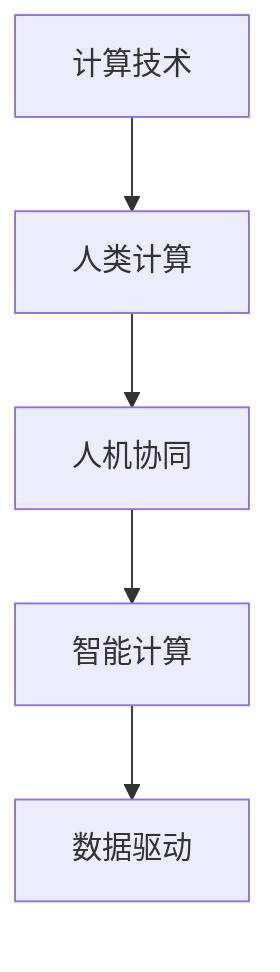

                 

# 塑造数字时代：人类计算的关键作用

## 1. 背景介绍

在21世纪，数字技术正以前所未有的速度和规模重塑我们的社会、经济和文化。计算技术的快速发展，使得人类社会迈入了数字化时代，数据已经成为新时代的“石油”。从移动通信、社交媒体到物联网、大数据，各行各业都离不开对数据的收集、存储、处理和分析。但在这背后，计算技术如何与人类计算相结合，共同推动数字时代的到来，这是一个值得深入探讨的问题。

### 1.1 问题由来

当前，人工智能、机器学习等先进计算技术的崛起，让人们看到了未来智能社会的美好前景。然而，在技术的辉煌背后，人类计算的作用和价值常常被忽视。计算技术与人类计算的结合，不仅能提升计算的效率和质量，还能更好地服务于人类需求，实现人机协同。本文旨在探讨计算技术如何与人类计算相结合，共同塑造数字时代，推动科技与社会的深度融合。

### 1.2 问题核心关键点

1. **人机协同**：计算技术如何与人机协同，实现数据处理与人类认知的有机结合，提升计算的智能化水平。
2. **计算效率**：如何通过人类计算，优化计算任务的效率，缩短任务处理时间。
3. **计算质量**：如何通过人类计算，提高计算结果的准确性和可靠性，降低误差率。
4. **计算效果**：如何通过人类计算，增强计算效果的解释性和可理解性，提升用户满意度。
5. **计算应用**：计算技术如何结合人类计算，应用于各行各业，解决实际问题，创造社会价值。

## 2. 核心概念与联系

### 2.1 核心概念概述

为了更好地理解计算技术如何与人类计算相结合，本节将介绍几个密切相关的核心概念：

- **计算技术**：指通过计算机程序和算法实现的数据处理和计算能力，包括算术计算、逻辑计算、符号计算、机器学习等。
- **人类计算**：指通过人类认知和智慧对数据进行处理和分析的过程，包括数学运算、逻辑推理、常识判断等。
- **人机协同**：指计算技术与人类计算相结合，实现优势互补，共同解决复杂问题的过程。
- **智能计算**：指利用人类计算和计算技术，实现智能化、自动化和高效化的数据处理和分析。
- **数据驱动**：指基于数据进行决策和计算，强调数据在计算过程中的重要作用。

这些概念之间的逻辑关系可以通过以下Mermaid流程图来展示：



这个流程图展示了几者之间的联系：

1. 计算技术通过程序和算法实现对数据的处理和计算。
2. 人类计算通过认知和智慧对数据进行分析和判断。
3. 人机协同将计算技术和人类计算相结合，共同解决复杂问题。
4. 智能计算利用人机协同实现智能化、自动化和高效化的数据处理。
5. 数据驱动以数据为驱动源，强调数据的价值和作用。

## 3. 核心算法原理 & 具体操作步骤

### 3.1 算法原理概述

计算技术与人类计算的结合，本质上是一种智能化的计算过程。其核心思想是通过计算技术提供高效的数据处理能力，结合人类计算的智能判断，实现对复杂问题的智能解答。

形式化地，假设计算任务为 $T$，计算模型为 $M_{\theta}$，其中 $\theta$ 为模型的参数。定义任务 $T$ 的经验风险为：

$$
\mathcal{R}(T) = \mathbb{E}_{x \sim \mathcal{D}} [\ell(M_{\theta}(x),y)]
$$

其中 $\ell$ 为损失函数，$y$ 为真实标签，$\mathcal{D}$ 为数据分布。计算模型的目标是最小化任务 $T$ 的经验风险，即：

$$
\theta^* = \mathop{\arg\min}_{\theta} \mathcal{R}(T)
$$

在实际应用中，我们通常使用机器学习算法，如监督学习、无监督学习、强化学习等，来求解上述最优化问题。这些算法通过训练模型参数 $\theta$，最小化损失函数 $\ell$，从而使得模型 $M_{\theta}$ 能够准确地完成计算任务 $T$。

### 3.2 算法步骤详解

计算技术与人类计算的结合，可以分为以下几个关键步骤：

**Step 1: 任务建模**
- 定义计算任务 $T$，包括输入数据 $x$ 和输出结果 $y$，建立任务模型 $M_{\theta}$。

**Step 2: 数据准备**
- 收集和整理任务 $T$ 的数据集 $\mathcal{D}$，包括训练集、验证集和测试集。
- 预处理数据，如去噪、归一化、特征提取等。

**Step 3: 模型设计**
- 选择合适的计算模型 $M_{\theta}$，如线性回归、决策树、神经网络等。
- 设置模型参数，如学习率、批大小、迭代次数等。

**Step 4: 训练优化**
- 使用优化算法（如梯度下降、Adam等），在训练集 $\mathcal{D}_{train}$ 上训练模型 $M_{\theta}$。
- 在验证集 $\mathcal{D}_{valid}$ 上评估模型性能，防止过拟合。

**Step 5: 测试评估**
- 在测试集 $\mathcal{D}_{test}$ 上评估模型性能，输出模型预测结果。
- 与真实结果进行比较，计算误差率、精度、召回率等指标。

**Step 6: 人机协同**
- 将模型 $M_{\theta}$ 应用于实际任务 $T$，结合人类计算进行数据处理和判断。
- 根据人类计算的反馈，调整模型参数 $\theta$，进一步优化模型性能。

### 3.3 算法优缺点

计算技术与人类计算相结合，具有以下优点：

1. **效率提升**：计算技术提供高效的数据处理能力，能大大提升计算效率，缩短任务处理时间。
2. **精度提高**：结合人类计算的智能判断，计算结果更加准确和可靠，降低误差率。
3. **效果优化**：结合人类计算的解释性和可理解性，计算结果更容易被用户理解和接受，提升用户满意度。
4. **应用广泛**：计算技术与人类计算相结合，应用于各行各业，解决实际问题，创造社会价值。

同时，这种结合也存在一些局限性：

1. **成本高昂**：开发和维护计算模型需要投入大量资源，包括时间、人力和资金。
2. **复杂性高**：结合人类计算和计算技术，任务设计和模型优化变得更加复杂。
3. **风险增加**：计算模型的出错可能导致严重的后果，尤其是涉及人机协同的决策。
4. **伦理问题**：计算模型的使用需要考虑伦理和隐私问题，确保数据安全和使用合理。

尽管存在这些局限性，但就目前而言，计算技术与人类计算的结合仍是推动数字时代发展的核心范式。未来相关研究的重点在于如何更好地优化人机协同过程，提升计算模型的智能化水平，同时兼顾伦理和社会责任。

### 3.4 算法应用领域

计算技术与人类计算相结合的范式，已经在众多领域得到了广泛应用，例如：

1. **金融科技**：通过计算技术处理海量金融数据，结合人类计算的智能分析，进行投资决策和风险控制。
2. **医疗健康**：利用计算技术处理医疗影像和数据，结合人类计算的医学知识，进行疾病诊断和治疗方案优化。
3. **智能制造**：通过计算技术处理生产数据，结合人类计算的工艺设计，进行生产优化和质量控制。
4. **智慧城市**：利用计算技术处理城市数据，结合人类计算的城市规划和管理，进行智能交通和公共服务优化。
5. **社交媒体**：通过计算技术处理社交数据，结合人类计算的内容审核和智能推荐，进行用户推荐和内容分发。

除了上述这些经典应用外，计算技术与人类计算的结合还在不断扩展，为各行各业带来新的机遇和挑战。

## 4. 数学模型和公式 & 详细讲解 & 举例说明

### 4.1 数学模型构建

本节将使用数学语言对计算技术与人类计算相结合的模型构建过程进行更加严格的刻画。

定义计算任务 $T$ 的数据集为 $\mathcal{D} = \{(x_i, y_i)\}_{i=1}^N$，其中 $x_i \in \mathcal{X}$ 为输入数据，$y_i \in \mathcal{Y}$ 为输出结果。定义计算模型 $M_{\theta}$，其中 $\theta \in \mathbb{R}^d$ 为模型参数。

假设计算任务 $T$ 的损失函数为 $\ell(M_{\theta}(x),y)$，则在数据集 $\mathcal{D}$ 上的经验风险为：

$$
\mathcal{R}(T) = \frac{1}{N}\sum_{i=1}^N \ell(M_{\theta}(x_i),y_i)
$$

计算模型的目标是最小化任务 $T$ 的经验风险，即：

$$
\theta^* = \mathop{\arg\min}_{\theta} \mathcal{R}(T)
$$

在实践中，我们通常使用基于梯度的优化算法（如SGD、Adam等）来近似求解上述最优化问题。设 $\eta$ 为学习率，$\lambda$ 为正则化系数，则参数的更新公式为：

$$
\theta \leftarrow \theta - \eta \nabla_{\theta}\mathcal{R}(T) - \eta\lambda\theta
$$

其中 $\nabla_{\theta}\mathcal{R}(T)$ 为损失函数对参数 $\theta$ 的梯度，可通过反向传播算法高效计算。

### 4.2 公式推导过程

以下我们以回归任务为例，推导最小二乘法（LS）的数学公式及其梯度的计算公式。

假设回归任务为 $y_i = \theta_0 + \sum_{j=1}^d \theta_j x_{ij}$，即线性回归模型。输入数据 $x_i$ 为 $N \times d$ 的矩阵，输出结果 $y_i$ 为 $N$ 维向量。定义损失函数为均方误差损失：

$$
\ell(M_{\theta}(x_i),y_i) = \frac{1}{2} \sum_{i=1}^N (y_i - M_{\theta}(x_i))^2
$$

将其代入经验风险公式，得：

$$
\mathcal{R}(T) = \frac{1}{2N}\sum_{i=1}^N \sum_{j=1}^d (\theta_j x_{ij} + \theta_0 - y_i)^2
$$

根据链式法则，损失函数对参数 $\theta_j$ 的梯度为：

$$
\frac{\partial \mathcal{R}(T)}{\partial \theta_j} = \frac{1}{N}\sum_{i=1}^N (\theta_j x_{ij} + \theta_0 - y_i) \frac{\partial \mathcal{R}(T)}{\partial M_{\theta}(x_i)}
$$

其中 $\frac{\partial \mathcal{R}(T)}{\partial M_{\theta}(x_i)}$ 可进一步递归展开，利用自动微分技术完成计算。

在得到损失函数的梯度后，即可带入参数更新公式，完成模型的迭代优化。重复上述过程直至收敛，最终得到适应任务 $T$ 的最优模型参数 $\theta^*$。

### 4.3 案例分析与讲解

**案例一：金融风险评估**

金融领域需要处理大量复杂的经济数据和金融市场数据，通过计算技术进行风险评估和投资决策。例如，利用机器学习模型对历史数据进行分析，提取关键特征，建立风险评估模型。结合人类计算的金融知识和市场预测，进行模型优化和决策。通过人机协同，金融机构可以更准确地评估风险，降低损失。

**案例二：医疗影像诊断**

医疗影像诊断是一个典型的计算技术与人类计算相结合的应用场景。通过计算技术处理影像数据，提取特征，建立诊断模型。结合人类计算的医学知识和经验，进行模型优化和诊断。通过人机协同，医生可以更准确地诊断疾病，提供更好的医疗服务。

**案例三：智能推荐系统**

智能推荐系统需要处理海量用户行为数据，通过计算技术进行数据处理和特征提取，建立推荐模型。结合人类计算的内容筛选和推荐逻辑，进行模型优化和推荐。通过人机协同，智能推荐系统可以更准确地推荐用户感兴趣的内容，提升用户体验。

这些案例展示了计算技术与人类计算相结合的广泛应用，展示了其在各行各业中的巨大潜力。

## 5. 项目实践：代码实例和详细解释说明

### 5.1 开发环境搭建

在进行项目实践前，我们需要准备好开发环境。以下是使用Python进行PyTorch开发的环境配置流程：

1. 安装Anaconda：从官网下载并安装Anaconda，用于创建独立的Python环境。

2. 创建并激活虚拟环境：
```bash
conda create -n pytorch-env python=3.8 
conda activate pytorch-env
```

3. 安装PyTorch：根据CUDA版本，从官网获取对应的安装命令。例如：
```bash
conda install pytorch torchvision torchaudio cudatoolkit=11.1 -c pytorch -c conda-forge
```

4. 安装TensorFlow：
```bash
pip install tensorflow
```

5. 安装各类工具包：
```bash
pip install numpy pandas scikit-learn matplotlib tqdm jupyter notebook ipython
```

完成上述步骤后，即可在`pytorch-env`环境中开始项目实践。

### 5.2 源代码详细实现

这里我们以线性回归为例，给出使用PyTorch进行项目实践的代码实现。

首先，定义线性回归模型：

```python
import torch
from torch import nn, optim
import numpy as np

class LinearRegression(nn.Module):
    def __init__(self, input_dim, output_dim):
        super(LinearRegression, self).__init__()
        self.linear = nn.Linear(input_dim, output_dim)

    def forward(self, x):
        out = self.linear(x)
        return out

# 创建模型
model = LinearRegression(2, 1)
```

然后，定义数据集：

```python
# 创建训练数据集
N = 100
X = np.random.randn(N, 2)  # 创建随机输入数据
y = np.dot(X, np.array([1.5, 2.5])) + 0.5  # 创建随机标签数据
X = torch.from_numpy(X).float()
y = torch.from_numpy(y).float()

# 创建训练集数据集
train_dataset = torch.utils.data.TensorDataset(X, y)
train_loader = torch.utils.data.DataLoader(train_dataset, batch_size=32, shuffle=True)
```

接着，定义优化器和损失函数：

```python
# 定义优化器
optimizer = optim.SGD(model.parameters(), lr=0.01)

# 定义损失函数
criterion = nn.MSELoss()
```

最后，进行模型训练和评估：

```python
epochs = 1000

for epoch in range(epochs):
    for i, (inputs, labels) in enumerate(train_loader):
        # 前向传播
        outputs = model(inputs)
        loss = criterion(outputs, labels)

        # 反向传播
        optimizer.zero_grad()
        loss.backward()
        optimizer.step()

        if (i+1) % 100 == 0:
            print('Epoch [{}/{}], Loss: {:.4f}'.format(epoch+1, epochs, loss.item()))
```

以上就是使用PyTorch进行线性回归模型的代码实现。可以看到，使用PyTorch进行深度学习模型的开发，可以极大地简化计算过程，提高开发效率。

### 5.3 代码解读与分析

让我们再详细解读一下关键代码的实现细节：

**LinearRegression类**：
- `__init__`方法：初始化模型的线性层。
- `forward`方法：定义前向传播计算过程，将输入数据 $x$ 经过线性层映射为输出结果。

**数据集创建**：
- 使用NumPy生成随机输入数据 $X$ 和标签数据 $y$。
- 将输入数据 $X$ 和标签数据 $y$ 转换为Tensor格式，方便PyTorch的计算。
- 创建训练集数据集 `train_dataset`，使用 `DataLoader` 对数据进行批次化加载，方便模型训练。

**优化器和损失函数**：
- 定义优化器 `optimizer`，使用随机梯度下降法进行模型参数更新。
- 定义损失函数 `criterion`，使用均方误差损失，计算模型预测结果与真实标签之间的差异。

**模型训练**：
- 使用 `DataLoader` 对训练数据进行迭代，每个批次输入数据 $x$ 和标签数据 $y$。
- 在每个批次上，前向传播计算模型预测结果 `outputs`，并计算损失 `loss`。
- 使用 `optimizer.zero_grad()` 清空梯度，使用 `loss.backward()` 计算梯度，使用 `optimizer.step()` 更新模型参数。
- 每100个批次输出一次损失，用于监测训练过程。

通过上述代码实现，我们可以看到，PyTorch提供了完整的深度学习框架，使得模型的开发和训练过程变得非常简单。开发者只需专注于模型的设计和训练，而无需过多关注底层计算细节。

当然，实际的NLP项目实践，还需要考虑更多的细节，如模型保存和部署、超参数调优、模型评估等。但核心的计算过程，都可以通过类似的方法实现。

## 6. 实际应用场景

### 6.1 智能客服系统

基于计算技术与人类计算相结合的智能客服系统，可以实现自动化客服问答、自动摘要、对话生成等功能。通过结合计算技术和人类计算，智能客服系统可以理解用户意图，生成自然流畅的回复，解决用户问题。例如，通过微调语言模型，智能客服系统可以自动学习和适应用户的对话习惯，提供个性化服务。

**实际应用示例**：
- 用户提问：“我想查一下最近的电影票”
- 智能客服系统：“您想查询哪个城市的电影票？”
- 用户回复：“北京”
- 智能客服系统：“好的，我来帮您查一下”
- 智能客服系统自动查询并生成回复：“根据您的需求，目前北京的电影票有《复仇者联盟4》、《流浪地球》等，价格从50元到200元不等，您需要购买哪一部电影票呢？”

### 6.2 金融舆情监测

金融舆情监测是计算技术与人类计算相结合的重要应用场景之一。通过结合计算技术和人类计算，金融舆情监测系统可以实时监测市场舆情，识别出负面信息，预测市场风险，为金融决策提供参考。例如，通过微调语言模型，舆情监测系统可以自动理解和分析金融新闻和评论，预测市场波动。

**实际应用示例**：
- 监测新闻：“某公司发布财报，预计未来几年收入增长缓慢”
- 舆情监测系统：“该新闻可能会对该公司股票造成负面影响”
- 系统生成报告：“建议投资者减持该公司的股票，以降低风险”

### 6.3 智能推荐系统

智能推荐系统需要处理海量用户行为数据，通过计算技术与人类计算相结合，实现智能推荐。例如，通过微调语言模型，推荐系统可以自动理解用户偏好，生成个性化推荐结果。结合人类计算的内容筛选和推荐逻辑，推荐系统可以更准确地推荐用户感兴趣的内容。

**实际应用示例**：
- 用户浏览历史：“阅读了许多科技新闻”
- 推荐系统：“您可能对这些文章感兴趣”
- 系统生成推荐列表：“相关文章推荐：《科技前沿》、《人工智能》等”

### 6.4 未来应用展望

随着计算技术与人类计算相结合的深入发展，未来将涌现更多创新的应用场景。以下是几个可能的应用方向：

1. **自动化决策**：计算技术与人类计算相结合，实现自动化决策过程。例如，在金融、医疗、制造业等领域，通过计算技术与人类计算的结合，实现智能决策，提升决策效率和质量。
2. **跨领域融合**：计算技术与人类计算的结合，可以应用于跨领域融合，实现多学科知识的整合。例如，在智慧城市、智能交通等领域，通过计算技术与人类计算的结合，实现跨领域数据融合，提升系统性能。
3. **协同设计**：计算技术与人类计算的结合，可以实现协同设计过程。例如，在产品设计、建筑设计等领域，通过计算技术与人类计算的结合，实现设计优化和创新。
4. **实时分析**：计算技术与人类计算的结合，可以实现实时数据分析。例如，在物联网、智慧城市等领域，通过计算技术与人类计算的结合，实现实时数据处理和分析，提升系统响应速度和精度。
5. **智能化服务**：计算技术与人类计算的结合，可以实现智能化服务。例如，在智能客服、智能家居等领域，通过计算技术与人类计算的结合，实现智能服务，提升用户体验。

## 7. 工具和资源推荐

### 7.1 学习资源推荐

为了帮助开发者系统掌握计算技术与人类计算相结合的理论基础和实践技巧，这里推荐一些优质的学习资源：

1. 《深度学习》课程：由斯坦福大学Andrew Ng教授主讲，系统介绍了深度学习的基本概念和算法。
2. 《机器学习》课程：由MIT教授Tom Mitchell主讲，介绍了机器学习的理论和应用。
3. 《自然语言处理》课程：由斯坦福大学Christopher Manning教授主讲，系统介绍了自然语言处理的基本理论和算法。
4. 《Python深度学习》书籍：由Francois Chollet撰写，介绍了深度学习在Python中的实现，包括TensorFlow和PyTorch。
5. 《PyTorch官方文档》：PyTorch官方提供的详细文档，包含各种模型的实现和示例。

通过这些资源的学习，相信你一定能够掌握计算技术与人类计算相结合的理论基础和实践技巧，从而开发出高效、可靠的计算模型。

### 7.2 开发工具推荐

高效的开发离不开优秀的工具支持。以下是几款用于计算技术与人类计算相结合开发的常用工具：

1. PyTorch：基于Python的开源深度学习框架，提供了灵活的计算图和丰富的模型库，适合深度学习模型的开发。
2. TensorFlow：由Google主导开发的开源深度学习框架，提供了多种计算图模型和分布式训练功能，适合大规模工程应用。
3. Weights & Biases：模型训练的实验跟踪工具，可以记录和可视化模型训练过程中的各项指标，方便对比和调优。
4. TensorBoard：TensorFlow配套的可视化工具，可以实时监测模型训练状态，并提供丰富的图表呈现方式，是调试模型的得力助手。
5. Jupyter Notebook：基于Web的交互式编程环境，适合进行数据分析和模型实验。

合理利用这些工具，可以显著提升计算技术与人类计算相结合的开发效率，加快创新迭代的步伐。

### 7.3 相关论文推荐

计算技术与人类计算相结合的探索源于学界的持续研究。以下是几篇奠基性的相关论文，推荐阅读：

1. 《深度学习》：Hinton等著，介绍了深度学习的基本原理和应用。
2. 《计算与认知：融合人机智慧》：Stuart Russell和Peter Norvig著，介绍了计算与认知的融合，探讨了人机协同的未来方向。
3. 《计算与人类计算的结合》：Thomas Petrie和Yoshua Bengio著，探讨了计算技术与人类计算相结合的多种方式，提供了丰富的案例分析。

这些论文代表了大计算技术与人类计算相结合的发展脉络，为后续研究提供了重要的理论支持。

## 8. 总结：未来发展趋势与挑战

### 8.1 总结

本文对计算技术与人类计算相结合的理论和实践进行了全面系统的介绍。首先探讨了计算技术与人类计算相结合的重要意义，指出了其在推动数字时代发展中的核心作用。其次，从原理到实践，详细讲解了计算技术与人类计算相结合的数学模型和算法步骤，给出了代码实现和案例分析。同时，本文还探讨了计算技术与人类计算相结合的广泛应用场景，展示了其在各行各业中的巨大潜力。最后，本文介绍了相关的学习资源和开发工具，提供了研究展望和未来发展方向。

通过本文的系统梳理，可以看到，计算技术与人类计算相结合是大数据时代的重要技术趋势，对于推动计算模型的智能化水平和解决复杂问题具有重要意义。未来，计算技术与人类计算的结合将在更多领域得到应用，为人类认知智能的进化带来深远影响。

### 8.2 未来发展趋势

展望未来，计算技术与人类计算相结合将呈现以下几个发展趋势：

1. **智能决策**：通过计算技术与人类计算的结合，实现智能决策过程，提升决策效率和质量。
2. **跨领域融合**：计算技术与人类计算的结合，可以应用于跨领域融合，实现多学科知识的整合。
3. **协同设计**：计算技术与人类计算的结合，可以实现协同设计过程，提升设计效率和创新性。
4. **实时分析**：计算技术与人类计算的结合，可以实现实时数据分析，提升系统响应速度和精度。
5. **智能化服务**：计算技术与人类计算的结合，可以实现智能化服务，提升用户体验。

### 8.3 面临的挑战

尽管计算技术与人类计算相结合带来了巨大的潜力和发展机遇，但在实际应用中，仍然面临诸多挑战：

1. **计算成本高**：开发和维护计算模型需要投入大量资源，包括时间、人力和资金。
2. **复杂性高**：计算技术与人类计算的结合，任务设计和模型优化变得更加复杂，需要更多实践经验和创新思维。
3. **风险增加**：计算模型的出错可能导致严重的后果，尤其是涉及人机协同的决策。
4. **伦理问题**：计算模型的使用需要考虑伦理和隐私问题，确保数据安全和使用合理。
5. **技术瓶颈**：计算模型的计算效率和精度需要进一步提升，以应对日益复杂的数据和任务。

尽管存在这些挑战，但通过不断优化计算模型，提升技术能力，加强伦理和隐私保护，计算技术与人类计算的结合必将在未来成为主流技术，推动人类认知智能的发展。

### 8.4 研究展望

面对计算技术与人类计算相结合所面临的挑战，未来的研究需要在以下几个方面寻求新的突破：

1. **优化计算模型**：开发更加高效、准确的计算模型，提升计算效率和精度。
2. **加强伦理和隐私保护**：确保计算模型的使用符合伦理和隐私保护要求，保障数据安全和使用合理。
3. **提高计算效率**：提升计算模型的计算效率和资源利用率，降低计算成本。
4. **增强模型解释性**：增强计算模型的解释性和可理解性，提升用户满意度和信任度。
5. **提升人机协同水平**：提升人机协同的智能化水平，实现更高效、更可靠的系统性能。

通过不断创新和探索，计算技术与人类计算的结合必将在未来取得更大的进步，为推动数字时代的可持续发展做出更大的贡献。总之，计算技术与人类计算的结合是大数据时代的重要技术趋势，具有广阔的发展前景和应用价值。面向未来，我们需要不断探索和优化人机协同过程，提升计算模型的智能化水平，同时兼顾伦理和社会责任，共同推动人类认知智能的进步。

## 9. 附录：常见问题与解答

**Q1：计算技术与人类计算相结合是否适用于所有应用场景？**

A: 计算技术与人类计算相结合适用于大多数应用场景，特别是数据量较大、任务复杂的情况。但对于一些特定领域的应用，如艺术创作、人际互动等，计算模型可能难以完全取代人类计算。因此，在实际应用中需要根据具体情况，综合考虑计算技术与人类计算的结合方式。

**Q2：计算技术与人类计算相结合是否能够提升计算模型的精度？**

A: 计算技术与人类计算相结合，可以通过人机协同提升计算模型的精度。例如，在图像识别任务中，计算模型可以提取特征，人类计算可以标注正确标签，结合两者的优势，提升模型的准确性和鲁棒性。

**Q3：如何确保计算技术与人类计算相结合的安全性？**

A: 确保计算技术与人类计算相结合的安全性，需要从多个方面进行考虑：
1. 数据安全：确保数据传输和存储的安全性，防止数据泄露和篡改。
2. 模型安全性：确保计算模型的安全性和稳定性，防止恶意攻击和误操作。
3. 伦理和隐私保护：确保计算模型的使用符合伦理和隐私保护要求，保障用户权益。

**Q4：计算技术与人类计算相结合是否能够提升计算模型的解释性？**

A: 计算技术与人类计算相结合，可以增强计算模型的解释性和可理解性。例如，在金融风险评估任务中，计算模型可以提取关键特征，人类计算可以解释模型的决策逻辑，结合两者的优势，提升模型的可解释性和用户满意度。

**Q5：计算技术与人类计算相结合是否能够提升计算模型的鲁棒性？**

A: 计算技术与人类计算相结合，可以通过人机协同提升计算模型的鲁棒性。例如，在自然语言处理任务中，计算模型可以提取语法和语义特征，人类计算可以判断语言表达的合理性，结合两者的优势，提升模型的鲁棒性和泛化能力。

通过这些问题和解答的讨论，可以看到，计算技术与人类计算相结合具有广泛的应用前景和巨大的潜力。通过不断的技术创新和优化，我们相信计算技术与人类计算的结合将在未来发挥更大的作用，推动人类认知智能的发展。

---

作者：禅与计算机程序设计艺术 / Zen and the Art of Computer Programming

