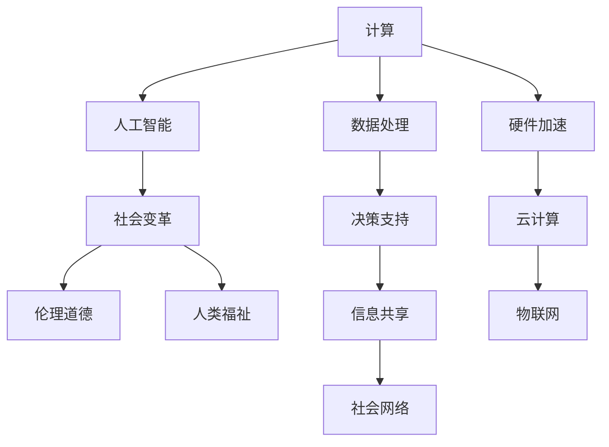

                 

# 塑造未来社会：人类计算的深远意义

> 关键词：计算、未来社会、人工智能、技术进步、社会变革、伦理道德、人类福祉

## 1. 背景介绍

### 1.1 问题由来

随着信息时代的到来，人类社会的方方面面都正在经历着前所未有的变革。从互联网的普及到物联网的兴起，从大数据的爆发到人工智能的突破，计算技术正以惊人的速度塑造着我们的世界。然而，随着计算技术的不断深入，我们也面临着一系列新的挑战和问题，亟需重新审视计算技术对人类社会的影响。

### 1.2 问题核心关键点

计算技术的迅猛发展，使得人类能够以前所未有的方式处理和分析数据，极大地提升了社会生产力和科学研究的效率。然而，这种进步也带来了新的伦理道德问题，如隐私保护、算法偏见、社会不平等等，这些问题已经成为制约计算技术进一步发展的瓶颈。如何在推动技术进步的同时，确保其服务于人类福祉，成为当今社会面临的重要课题。

### 1.3 问题研究意义

研究计算技术对未来社会的深远意义，对于理解技术的本质、指导技术发展的方向、应对技术带来的挑战，具有重要价值。通过深入分析计算技术的发展历程和趋势，我们可以更好地把握未来的发展方向，为构建更加公平、健康、可持续的社会提供理论支持和实践指导。

## 2. 核心概念与联系

### 2.1 核心概念概述

为更好地理解计算技术对未来社会的影响，本节将介绍几个密切相关的核心概念：

- 计算（Computing）：指使用算法和数据处理技术，将复杂问题转换为可执行的计算过程。计算技术覆盖了硬件、软件、网络等多个层面，是支撑现代信息社会的基石。
- 人工智能（AI）：指通过模拟人类智能行为，实现自主决策、自动推理的计算技术。AI技术包括机器学习、深度学习、自然语言处理等，已经成为计算技术的重要分支。
- 社会变革（Social Transformation）：指计算技术通过改变人类社会的行为模式、组织结构、价值观念等，实现社会的整体进步和转型。
- 伦理道德（Ethics and Morality）：指在计算技术应用中，如何平衡技术进步与人类福祉，确保技术应用符合人类的伦理道德标准。
- 人类福祉（Human Well-being）：指计算技术在推动社会进步的同时，能否实现公平、正义、和谐等基本的人类福祉目标。

这些核心概念之间的逻辑关系可以通过以下Mermaid流程图来展示：



这个流程图展示计算技术的核心概念及其之间的关系：

1. 计算通过数据处理、决策支持和信息共享等，支持人工智能的开发和应用。
2. 人工智能通过社会变革、伦理道德和人类福祉等，推动社会的整体进步。
3. 硬件加速、云计算、物联网等基础设施，进一步推动计算技术的发展。

这些概念共同构成了计算技术的社会影响框架，帮助我们全面理解计算技术的复杂性和深远性。

## 3. 核心算法原理 & 具体操作步骤
### 3.1 算法原理概述

计算技术对未来社会的影响，主要体现在以下几个方面：

1. **数据驱动决策**：计算技术通过对海量数据的处理和分析，使决策过程更加科学、精准。
2. **自动化生产**：计算技术通过智能化的生产系统，提高生产效率，降低成本。
3. **智能服务**：计算技术通过个性化推荐、智能客服、智能安防等应用，提升服务质量。
4. **社会网络构建**：计算技术通过社交媒体、电商平台等平台，构建起庞大的社会网络，促进信息流通和知识共享。
5. **伦理道德挑战**：计算技术在应用过程中，可能引发隐私保护、算法偏见、社会不平等等问题。

这些影响主要通过算法原理来实现，包括：

1. **数据处理算法**：通过统计学、机器学习等算法，对数据进行预处理、特征提取、模型训练等，实现数据驱动决策。
2. **自动化生产算法**：通过机器人流程自动化（RPA）、工业互联网等技术，实现生产流程的智能化和自动化。
3. **智能服务算法**：通过自然语言处理（NLP）、计算机视觉（CV）等技术，实现智能推荐、智能客服等功能。
4. **社会网络算法**：通过社交网络分析（SNA）、推荐系统算法等，构建和优化社会网络结构。
5. **伦理道德算法**：通过公平性、透明性、可解释性等算法设计，确保计算技术应用的伦理道德标准。

### 3.2 算法步骤详解

计算技术对未来社会的影响，主要通过以下步骤实现：

1. **数据采集与处理**：通过传感器、智能设备等手段，采集社会各领域的数据，并通过数据清洗、归一化等算法进行处理。
2. **模型训练与优化**：使用机器学习、深度学习等算法，对数据进行建模和优化，生成预测模型。
3. **系统部署与应用**：将训练好的模型部署到生产环境中，通过API、SDK等接口进行服务提供。
4. **社会反馈与迭代**：通过用户反馈、评估指标等，对模型进行迭代优化，不断提升模型性能和用户体验。
5. **伦理审查与监管**：对计算技术应用进行伦理审查和监管，确保其符合社会规范和伦理道德标准。

### 3.3 算法优缺点

计算技术对未来社会的影响，既有积极的一面，也有需要解决的问题。具体而言：

#### 优点：

1. **高效性**：计算技术通过算法优化和硬件加速，显著提高了信息处理和决策效率。
2. **创新性**：计算技术驱动的新产品和新服务，不断刷新着人类生活的方方面面。
3. **共享性**：计算技术通过信息共享，促进了知识的传播和积累。

#### 缺点：

1. **隐私风险**：大规模数据处理可能带来隐私泄露的风险。
2. **算法偏见**：模型训练数据和算法设计可能引入偏见，导致不公平结果。
3. **社会不平等**：计算技术的普及可能加剧社会不平等，使得少数群体被边缘化。

### 3.4 算法应用领域

计算技术在各个领域的应用，已经深刻改变了社会的运行方式，具体包括：

1. **医疗健康**：计算技术通过医疗影像分析、疾病预测等应用，提高了医疗诊断和治疗的精度。
2. **教育培训**：计算技术通过智能辅导、在线课程等，提升了教育质量和覆盖面。
3. **金融服务**：计算技术通过风险评估、智能投顾等，提高了金融服务的效率和安全性。
4. **交通运输**：计算技术通过智能交通、自动驾驶等，提升了交通系统的智能化水平。
5. **环境保护**：计算技术通过环境监测、数据分析等，提高了环境保护的科学性和精准性。

## 4. 数学模型和公式 & 详细讲解  
### 4.1 数学模型构建

计算技术对未来社会的影响，主要通过以下几个数学模型来刻画：

1. **决策树模型**：通过构建决策树，实现数据驱动的决策过程。
2. **线性回归模型**：通过线性回归，建立输入和输出之间的关系，进行预测和优化。
3. **神经网络模型**：通过多层神经网络，学习数据的非线性关系，实现高效的智能推理和决策。
4. **社会网络模型**：通过社会网络分析，建立社会关系网络，进行信息传播和知识共享。
5. **伦理道德模型**：通过公平性、透明性、可解释性等模型设计，确保计算技术应用的伦理道德标准。

### 4.2 公式推导过程

以线性回归模型为例，其公式推导过程如下：

设输入向量为 $x$，输出向量为 $y$，模型参数为 $\theta$，目标函数为 $J(\theta)$。则线性回归模型可以表示为：

$$
y = \theta_0 + \theta_1 x_1 + \theta_2 x_2 + ... + \theta_n x_n
$$

其中 $\theta = (\theta_0, \theta_1, ..., \theta_n)$ 为模型参数。目标函数可以表示为：

$$
J(\theta) = \frac{1}{2m} \sum_{i=1}^m (y^{(i)} - h_\theta(x^{(i)}))^2
$$

其中 $m$ 为样本数量，$y^{(i)}$ 和 $x^{(i)}$ 分别为第 $i$ 个样本的输出和输入，$h_\theta(x) = \theta_0 + \theta_1 x_1 + \theta_2 x_2 + ... + \theta_n x_n$ 为模型在输入 $x$ 下的预测输出。

目标函数的最小化可以通过梯度下降算法实现：

$$
\theta^{(k+1)} = \theta^{(k)} - \alpha \frac{1}{m} \sum_{i=1}^m (y^{(i)} - h_\theta(x^{(i)})) x^{(i)}
$$

其中 $\alpha$ 为学习率，$\frac{1}{m} \sum_{i=1}^m (y^{(i)} - h_\theta(x^{(i)})) x^{(i)}$ 为梯度向量。

通过迭代计算，模型参数 $\theta$ 不断更新，直到目标函数收敛。最终得到最优模型参数，进行预测和优化。

### 4.3 案例分析与讲解

以医疗影像分析为例，使用卷积神经网络（CNN）进行病灶识别。首先，将医疗影像数据进行归一化、增强等预处理，然后通过卷积层、池化层、全连接层等，建立卷积神经网络模型。模型训练时，使用交叉熵损失函数，对每个病灶进行标注和训练。模型测试时，将新的医疗影像输入模型，通过Softmax函数输出每个病灶出现的概率，从而实现病灶识别。

## 5. 项目实践：代码实例和详细解释说明
### 5.1 开发环境搭建

在进行计算技术应用实践前，我们需要准备好开发环境。以下是使用Python进行TensorFlow开发的环境配置流程：

1. 安装Anaconda：从官网下载并安装Anaconda，用于创建独立的Python环境。

2. 创建并激活虚拟环境：
```bash
conda create -n tensorflow-env python=3.7 
conda activate tensorflow-env
```

3. 安装TensorFlow：根据CUDA版本，从官网获取对应的安装命令。例如：
```bash
conda install tensorflow -c pytorch -c conda-forge
```

4. 安装TensorBoard：用于可视化模型训练状态和结果，与TensorFlow无缝集成。
```bash
pip install tensorboard
```

5. 安装Keras：用于简化模型构建和训练过程。
```bash
pip install keras
```

完成上述步骤后，即可在`tensorflow-env`环境中开始计算技术应用实践。

### 5.2 源代码详细实现

这里我们以医疗影像分析为例，使用卷积神经网络（CNN）进行病灶识别。

```python
import tensorflow as tf
from tensorflow.keras.models import Sequential
from tensorflow.keras.layers import Conv2D, MaxPooling2D, Flatten, Dense, Dropout
from tensorflow.keras.optimizers import Adam
from tensorflow.keras.losses import SparseCategoricalCrossentropy
from tensorflow.keras.preprocessing.image import ImageDataGenerator

# 加载数据
train_dir = '/path/to/train_data'
val_dir = '/path/to/val_data'
batch_size = 32

train_datagen = ImageDataGenerator(rescale=1./255, rotation_range=20, width_shift_range=0.1, height_shift_range=0.1, horizontal_flip=True)
val_datagen = ImageDataGenerator(rescale=1./255)

train_generator = train_datagen.flow_from_directory(train_dir, target_size=(256, 256), batch_size=batch_size, class_mode='categorical')
val_generator = val_datagen.flow_from_directory(val_dir, target_size=(256, 256), batch_size=batch_size, class_mode='categorical')

# 构建模型
model = Sequential()
model.add(Conv2D(32, (3, 3), activation='relu', input_shape=(256, 256, 3)))
model.add(MaxPooling2D((2, 2)))
model.add(Conv2D(64, (3, 3), activation='relu'))
model.add(MaxPooling2D((2, 2)))
model.add(Conv2D(128, (3, 3), activation='relu'))
model.add(MaxPooling2D((2, 2)))
model.add(Flatten())
model.add(Dense(256, activation='relu'))
model.add(Dropout(0.5))
model.add(Dense(3, activation='softmax'))

# 编译模型
model.compile(optimizer=Adam(lr=0.001), loss=SparseCategoricalCrossentropy(), metrics=['accuracy'])

# 训练模型
model.fit(train_generator, epochs=10, validation_data=val_generator)

# 评估模型
loss, accuracy = model.evaluate(val_generator)
print(f'Validation accuracy: {accuracy:.2f}')
```

以上是使用TensorFlow进行卷积神经网络医疗影像分析的完整代码实现。可以看到，TensorFlow提供了强大的深度学习框架，支持多种神经网络模型和优化算法，使得模型构建和训练过程非常便捷。

### 5.3 代码解读与分析

让我们再详细解读一下关键代码的实现细节：

**ImageDataGenerator类**：
- `rescale`参数：对输入数据进行归一化处理，使得输入数据的像素值在0到1之间。
- `rotation_range`参数：随机旋转图像，增加数据多样性。
- `width_shift_range`和`height_shift_range`参数：随机平移图像，增加数据多样性。
- `horizontal_flip`参数：随机水平翻转图像，增加数据多样性。

**Sequential模型**：
- 定义模型结构，通过`add`方法添加卷积层、池化层、全连接层等。
- 卷积层使用`Conv2D`，池化层使用`MaxPooling2D`，全连接层使用`Dense`。
- `Flatten`层将卷积层的输出扁平化，方便全连接层处理。
- `Dropout`层用于正则化，防止过拟合。

**编译和训练模型**：
- 使用`compile`方法编译模型，指定优化器、损失函数和评估指标。
- 使用`fit`方法训练模型，指定训练数据、验证数据、训练轮数等。
- 在每个epoch结束时，使用`evaluate`方法在验证集上评估模型性能，输出损失和准确率。

可以看到，TensorFlow使得模型构建和训练过程非常简洁高效，开发者可以专注于算法和数据处理等核心内容，而不必过多关注底层实现细节。

当然，工业级的系统实现还需考虑更多因素，如模型的保存和部署、超参数的自动搜索、更灵活的任务适配层等。但核心的计算技术应用基本与此类似。

## 6. 实际应用场景
### 6.1 医疗健康

计算技术在医疗健康领域的应用，极大地提升了医疗服务的精准性和效率。医疗影像分析、疾病预测、个性化治疗等应用，正在改变医疗行业的面貌。

**医疗影像分析**：通过卷积神经网络（CNN）对医疗影像进行病灶识别、分割等处理，辅助医生进行诊断和治疗。例如，使用卷积神经网络对CT影像进行肿瘤检测，可显著提高诊断的准确率和效率。

**疾病预测**：通过机器学习模型对患者的病历、基因信息等进行综合分析，预测其患病风险。例如，使用随机森林模型对糖尿病患者进行风险预测，可提前发现潜在患者，进行早期干预和治疗。

**个性化治疗**：通过计算技术对患者的基因信息、生活习惯等进行综合分析，制定个性化的治疗方案。例如，使用深度学习模型对肿瘤患者进行基因表达分析，制定精准的化疗方案，提高治疗效果。

### 6.2 教育培训

计算技术在教育培训领域的应用，极大地提升了教育质量和覆盖面。在线学习、智能辅导、课程推荐等应用，正在改变教育行业的面貌。

**在线学习**：通过智能推荐系统对学生的学习行为进行分析和预测，推荐个性化的学习内容和路径。例如，使用协同过滤算法对学生的学习行为进行建模，推荐适合的学习资源。

**智能辅导**：通过自然语言处理（NLP）技术对学生的提问进行理解和解答，提供个性化的辅导服务。例如，使用问答系统对学生的疑问进行自动回答，提升学习效率和质量。

**课程推荐**：通过计算技术对学生的学习历史和偏好进行分析，推荐适合的课程和学习路径。例如，使用协同过滤算法对学生的学习历史进行建模，推荐适合的课程和学习路径。

### 6.3 金融服务

计算技术在金融服务领域的应用，极大地提升了金融服务的效率和安全性。风险评估、智能投顾、反欺诈检测等应用，正在改变金融行业的面貌。

**风险评估**：通过机器学习模型对客户的信用记录、行为数据等进行综合分析，评估其信用风险。例如，使用逻辑回归模型对客户的信用记录进行分析，评估其信用风险。

**智能投顾**：通过自然语言处理（NLP）技术对客户的投资偏好和目标进行分析和理解，提供个性化的投资建议。例如，使用意图识别模型对客户的投资需求进行理解和分析，推荐适合的投资产品。

**反欺诈检测**：通过机器学习模型对交易数据进行异常检测，识别潜在的欺诈行为。例如，使用异常检测算法对交易数据进行建模，检测潜在的欺诈行为。

### 6.4 交通运输

计算技术在交通运输领域的应用，极大地提升了交通系统的智能化水平。智能交通、自动驾驶等应用，正在改变交通行业的面貌。

**智能交通**：通过计算技术对交通数据进行分析和预测，优化交通流量和路网结构。例如，使用深度学习模型对交通流量进行预测和分析，优化交通流量和路网结构。

**自动驾驶**：通过计算机视觉（CV）和深度学习技术，实现自动驾驶和无人驾驶。例如，使用卷积神经网络对道路环境进行理解和分析，实现自动驾驶和无人驾驶。

**智能调度**：通过计算技术对车辆和人员的调度进行优化，提升交通效率。例如，使用运筹学模型对车辆和人员的调度进行优化，提升交通效率。

## 7. 工具和资源推荐
### 7.1 学习资源推荐

为了帮助开发者系统掌握计算技术的应用，这里推荐一些优质的学习资源：

1. **TensorFlow官方文档**：提供了全面的深度学习框架介绍和实践指南，适合初学者和高级开发者使用。
2. **PyTorch官方文档**：提供了强大的动态计算图和深度学习库，适合进行模型构建和训练。
3. **Keras官方文档**：提供了简单易用的深度学习库，适合快速构建和训练模型。
4. **DeepLearning.AI的深度学习课程**：斯坦福大学Andrew Ng教授主讲的深度学习课程，涵盖了深度学习的理论和实践。
5. **Coursera的机器学习课程**：由斯坦福大学Andrew Ng教授主讲的机器学习课程，涵盖了机器学习的基本理论和算法。
6. **Kaggle竞赛平台**：提供了丰富的数据集和机器学习竞赛，适合进行实践和经验积累。

通过对这些资源的学习实践，相信你一定能够快速掌握计算技术的应用，并用于解决实际的业务问题。

### 7.2 开发工具推荐

高效的开发离不开优秀的工具支持。以下是几款用于计算技术应用的常用工具：

1. **TensorFlow**：由Google主导开发的深度学习框架，生产部署方便，适合大规模工程应用。
2. **PyTorch**：Facebook开发的深度学习框架，灵活动态的计算图，适合快速迭代研究。
3. **Keras**：高层次的深度学习库，易于使用，适合快速构建和训练模型。
4. **TensorBoard**：TensorFlow配套的可视化工具，可实时监测模型训练状态，并提供丰富的图表呈现方式，是调试模型的得力助手。
5. **Weights & Biases**：模型训练的实验跟踪工具，可以记录和可视化模型训练过程中的各项指标，方便对比和调优。

合理利用这些工具，可以显著提升计算技术应用的开发效率，加快创新迭代的步伐。

### 7.3 相关论文推荐

计算技术的应用研究源于学界的持续研究。以下是几篇奠基性的相关论文，推荐阅读：

1. **Deep Learning**：Ian Goodfellow、Yoshua Bengio和Aaron Courville合著的经典书籍，系统介绍了深度学习的理论和实践。
2. **TensorFlow: A System for Large-Scale Machine Learning**：Jeffrey Dean、Andrew Ng等合著的论文，介绍了TensorFlow的架构和实现。
3. **Keras: A high-level neural networks API**：François Chollet等合著的论文，介绍了Keras的设计理念和实现细节。
4. **Machine Learning Yearning**：Andrew Ng所著的书籍，介绍了机器学习的实践经验和技巧。
5. **Deep Learning for Self-Driving Cars**：Jian Sun等人合著的论文，介绍了深度学习在自动驾驶中的应用。

这些论文代表了大数据和深度学习技术的发展脉络。通过学习这些前沿成果，可以帮助研究者把握学科前进方向，激发更多的创新灵感。

## 8. 总结：未来发展趋势与挑战

### 8.1 总结

本文对计算技术对未来社会的影响进行了全面系统的介绍。首先阐述了计算技术在各个领域的广泛应用，明确了计算技术在提升社会效率、推动科学进步、改善人类福祉等方面的重要价值。其次，从原理到实践，详细讲解了计算技术的核心算法和具体操作步骤，给出了计算技术应用的开源代码实现。同时，本文还广泛探讨了计算技术在医疗、教育、金融、交通等领域的应用前景，展示了计算技术的巨大潜力。

通过本文的系统梳理，可以看到，计算技术正在以惊人的速度塑造未来社会，极大地提升了社会生产力和生活质量。计算技术的发展离不开数据、算法、硬件等多方面的协同推动，只有在这些方面取得共同进步，才能实现技术的突破和应用。

### 8.2 未来发展趋势

展望未来，计算技术将呈现以下几个发展趋势：

1. **智能化水平提升**：随着深度学习技术的发展，计算技术的智能化水平将进一步提升，实现更加高效、精准的决策和推理。
2. **边缘计算普及**：边缘计算技术将在物联网、工业互联网等领域得到广泛应用，使得计算能力更加分布化和本地化。
3. **多模态计算融合**：计算技术将越来越多地融合多模态数据，实现视觉、语音、文本等多种数据类型的协同处理和应用。
4. **计算伦理道德**：计算技术的普及将带来更多的伦理道德问题，计算伦理道德将成为技术应用的重要研究方向。
5. **计算技术普及**：计算技术的普及将使得更多普通人能够使用计算技术，提升整体社会的计算能力和智能化水平。

这些趋势凸显了计算技术在推动社会进步中的重要作用，也为计算技术的研究者提出了新的挑战和机会。

### 8.3 面临的挑战

尽管计算技术在推动社会进步方面发挥了重要作用，但在迈向更加智能化、普适化应用的过程中，仍面临诸多挑战：

1. **数据隐私问题**：计算技术在应用过程中，可能引发数据隐私泄露的风险，如何保障数据安全，是计算技术应用的重大挑战。
2. **算法偏见问题**：计算技术的算法设计可能引入偏见，导致不公平结果，如何消除算法偏见，确保公平性，是计算技术应用的重要课题。
3. **计算资源限制**：计算技术在应用过程中，需要大量的计算资源，如何优化计算资源的使用，提高计算效率，是计算技术应用的重要挑战。
4. **伦理道德问题**：计算技术的普及将带来更多的伦理道德问题，如何规范技术应用，保障社会公正，是计算技术应用的重要课题。
5. **技术普及难度**：计算技术的普及将需要更多的技术支持和培训，如何降低技术普及难度，提升技术可及性，是计算技术应用的重要课题。

正视计算技术面临的这些挑战，积极应对并寻求突破，将是大数据和深度学习技术发展的重要方向。

### 8.4 研究展望

面对计算技术面临的诸多挑战，未来的研究需要在以下几个方面寻求新的突破：

1. **数据隐私保护**：开发更加安全的计算技术和算法，保障数据隐私安全。例如，使用差分隐私技术对数据进行匿名化处理，保障数据隐私安全。
2. **算法公平性**：设计更加公平的计算算法，消除算法偏见。例如，使用公平性约束对算法进行优化，保障公平性。
3. **计算资源优化**：优化计算资源的使用，提高计算效率。例如，使用分布式计算、边缘计算等技术，优化计算资源的使用。
4. **伦理道德规范**：建立计算技术的伦理道德规范，保障技术应用符合社会公正。例如，建立计算技术的伦理审查机制，规范技术应用。
5. **技术普及教育**：提升计算技术的普及教育水平，降低技术普及难度。例如，通过在线课程、培训项目等方式，提升计算技术的普及教育水平。

这些研究方向将引领计算技术的发展方向，为构建公平、公正、可持续的未来社会提供技术支持。面向未来，计算技术的研究者需要不断创新、突破，才能实现技术的进步和应用的广泛推广。

## 9. 附录：常见问题与解答

**Q1：计算技术如何实现数据驱动决策？**

A: 计算技术通过数据处理算法对大量数据进行处理和分析，提取数据中的有价值信息，生成决策支持模型。例如，通过统计学算法对数据进行特征提取和模型训练，生成决策树模型；通过机器学习算法对数据进行建模和优化，生成预测模型。

**Q2：计算技术在医疗健康领域有哪些应用？**

A: 计算技术在医疗健康领域的应用包括：医疗影像分析、疾病预测、个性化治疗等。例如，通过卷积神经网络对医疗影像进行病灶识别和分割；通过机器学习模型对患者的病历和基因信息进行综合分析，预测其患病风险；通过计算技术对患者的基因信息和生活习惯进行综合分析，制定个性化的治疗方案。

**Q3：计算技术如何提升社会生产力和生活质量？**

A: 计算技术通过数据处理、自动化生产、智能服务、社会网络构建等，显著提升了社会生产力和生活质量。例如，通过计算技术对海量数据进行处理和分析，实现了数据驱动的决策；通过自动化生产技术，提高了生产效率和质量；通过智能服务技术，提升了服务质量和效率；通过社会网络构建技术，促进了信息流通和知识共享。

**Q4：计算技术在教育培训领域有哪些应用？**

A: 计算技术在教育培训领域的应用包括：在线学习、智能辅导、课程推荐等。例如，通过智能推荐系统对学生的学习行为进行分析和预测，推荐个性化的学习内容和路径；通过自然语言处理技术对学生的提问进行理解和解答，提供个性化的辅导服务；通过计算技术对学生的学习历史和偏好进行分析，推荐适合的课程和学习路径。

**Q5：计算技术在金融服务领域有哪些应用？**

A: 计算技术在金融服务领域的应用包括：风险评估、智能投顾、反欺诈检测等。例如，通过机器学习模型对客户的信用记录和行为数据进行综合分析，评估其信用风险；通过自然语言处理技术对客户的投资偏好和目标进行分析和理解，提供个性化的投资建议；通过机器学习模型对交易数据进行异常检测，识别潜在的欺诈行为。

---

作者：禅与计算机程序设计艺术 / Zen and the Art of Computer Programming

