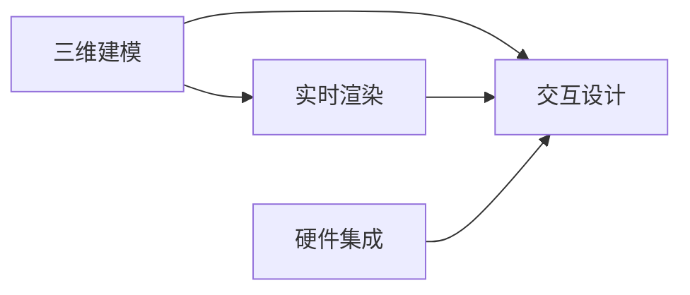

                 

# 增强现实（AR）应用：融合现实与虚拟的技术探索

> 关键词：增强现实（AR）, 混合现实（MR）, 虚拟现实（VR）, 深度学习, 三维重建, 实时渲染, 交互式模拟, 人机交互, 应用场景, 硬件技术

## 1. 背景介绍

增强现实（Augmented Reality, AR）技术通过在用户视角中叠加虚拟信息，从而创造出混合现实（Mixed Reality, MR）环境。AR将虚拟物体和数字信息融入真实世界，让用户可以通过感官、手势、语言等多种方式与虚拟世界交互。AR应用范围广泛，涉及游戏、教育、医疗、工业等多个领域，正成为推动人类生活和工作中智能化和数字化的重要引擎。

近年来，随着计算机视觉、深度学习、人工智能、实时渲染等技术的快速发展，AR技术已经具备了高精度三维重建、实时对象识别、自然语言交互和流畅自然渲染等核心能力，实现了从简单显示到复杂交互的转变。AR技术的进步推动了虚拟信息与现实世界的无缝融合，为各行各业带来了革命性的变化。

## 2. 核心概念与联系

### 2.1 核心概念概述

增强现实（AR）的核心概念可以概括为：利用计算机视觉和机器学习技术，在真实世界场景中叠加虚拟信息，创造全新的交互体验。AR技术融合了三维建模、实时渲染、交互设计和硬件集成等多学科知识，是前沿科技的集大成者。

- **三维建模（3D Modeling）**：构建虚拟场景和对象的过程，通常依赖于三维扫描仪、激光雷达、RGB-D相机等设备。
- **实时渲染（Real-time Rendering）**：在实时获取的场景信息上，应用图形处理技术，生成流畅的虚拟物体和环境。
- **交互设计（Interactive Design）**：设计用户与虚拟对象的交互方式，包括手势控制、语音命令、触摸反馈等。
- **硬件集成（Hardware Integration）**：将AR内容呈现在用户视场中，通常需要头戴式显示设备（Head-Mounted Display, HMD）、手势识别传感器、图像捕捉设备等。

### 2.2 核心概念联系

AR技术的核心在于将现实世界和虚拟世界通过人机交互的方式结合起来，实现信息的融合和交互。下图展示了AR技术的主要组成部分及其相互联系：



三维建模为虚拟内容创建基础，实时渲染将虚拟内容动态地呈现在用户眼前，交互设计负责用户与虚拟内容的交互方式，而硬件集成则提供显示和捕捉手段。这些核心技术紧密协作，共同构建了AR的完整生态。

## 3. 核心算法原理 & 具体操作步骤
### 3.1 算法原理概述

AR技术的实现依赖于以下几类核心算法：

- **三维重建（3D Reconstruction）**：从现实世界的图像中恢复出三维结构。
- **目标检测与跟踪（Object Detection and Tracking）**：在实时视频流中识别和跟踪物体。
- **实时渲染（Real-time Rendering）**：将虚拟物体渲染到用户视场中，实现流畅的视觉体验。
- **语义分割（Semantic Segmentation）**：将图像分割成不同的语义类别，便于进一步的虚拟信息融合。

### 3.2 算法步骤详解

#### 3.2.1 三维重建

三维重建是AR的基础，用于从图像序列中提取出三维模型。关键步骤包括：

1. **初始结构化扫描**：使用激光雷达、RGB-D相机等设备，获取场景的深度信息。
2. **点云配准与融合**：将不同视角的点云数据进行匹配，生成全场景的三维点云。
3. **网格化与模型生成**：将三维点云转换成三角网格模型，并修复拓扑错误。

#### 3.2.2 目标检测与跟踪

目标检测与跟踪是AR中至关重要的环节，用于在实时视频中识别和跟踪物体。关键步骤包括：

1. **特征提取**：使用卷积神经网络（CNN）提取图像特征。
2. **目标分类**：通过分类器识别目标类别。
3. **目标跟踪**：使用跟踪算法，如卡尔曼滤波、粒子滤波等，在后续帧中继续跟踪目标。

#### 3.2.3 实时渲染

实时渲染是AR技术的核心部分，用于将虚拟对象动态地呈现给用户。关键步骤包括：

1. **场景图构建**：构建实时场景的图形结构，包括背景、物体、灯光等元素。
2. **光栅化与深度排序**：将场景图渲染成二维图像，并对虚拟对象进行深度排序，确保虚拟对象与现实对象在空间上正确重叠。
3. **透明度处理**：处理虚拟对象的透明度，确保真实物体不被遮挡。

#### 3.2.4 语义分割

语义分割用于将图像分割成不同的语义类别，便于虚拟信息的融合。关键步骤包括：

1. **特征提取**：提取图像特征。
2. **分割模型训练**：使用卷积神经网络训练分割模型。
3. **语义标注**：将图像分割成不同的语义类别，标记真实世界的物体。

### 3.3 算法优缺点

AR技术的优点包括：

- **沉浸式体验**：通过实时渲染，用户可以沉浸在虚拟信息中，体验全新的交互方式。
- **信息丰富**：融合了现实世界的信息，提供更丰富的交互体验。
- **可定制化**：用户可以根据需求自定义虚拟信息。

AR技术的缺点包括：

- **设备依赖**：需要头戴式显示设备或移动设备支持，限制了应用范围。
- **渲染开销**：高精度的渲染需要高性能的计算资源。
- **准确性问题**：三维重建、目标检测等算法，在复杂环境中容易产生误差。

### 3.4 算法应用领域

AR技术在多个领域中展现出巨大潜力，包括：

- **医疗**：AR可用于手术导航、医疗教学、患者康复等。
- **教育**：AR可以增强课堂互动，提供沉浸式学习体验。
- **娱乐**：AR游戏、AR广告、AR视频等在娱乐产业中广受欢迎。
- **工业**：AR可用于设备维修、装配指导、安全培训等。
- **交通**：AR导航、AR导航系统等。

## 4. 数学模型和公式 & 详细讲解 & 举例说明

### 4.1 数学模型构建

AR技术的数学模型主要围绕三维建模、目标检测与跟踪、实时渲染和语义分割展开。以语义分割为例，通常使用U-Net架构的卷积神经网络进行训练：

```
model = UNet(input_shape=(224, 224, 3), num_classes=5)
```

其中，`input_shape`为输入图像的尺寸，`num_classes`为目标类别的数量。训练过程的目标函数为交叉熵损失函数：

$$
\mathcal{L} = -\frac{1}{N} \sum_{i=1}^N \sum_{j=1}^5 \text{CE}(y_j, \hat{y_j})
$$

其中，`N`为样本数量，`y_j`为第`j`类别的真实标签，`$\hat{y_j}$`为模型预测的第`j`类别的概率。

### 4.2 公式推导过程

#### 4.2.1 三维重建的数学模型

三维重建的核心是点云配准与融合。假设存在两个视角的点云数据 $P_1$ 和 $P_2$，点云配准的目标是找到配准矩阵 $R$ 和平移向量 $t$，使得：

$$
R \times P_1 + t = P_2
$$

配准矩阵 $R$ 和平移向量 $t$ 可以通过迭代最小化代价函数得到：

$$
\min_{R,t} \| R \times P_1 + t - P_2 \|_F^2
$$

其中，$\| \cdot \|_F$ 表示Frobenius范数。

#### 4.2.2 目标检测与跟踪的数学模型

目标检测与跟踪依赖于目标分类和跟踪算法。假设目标分类器基于卷积神经网络，其预测结果为 $p_i$，真实标签为 $y_i$，交叉熵损失函数为：

$$
\mathcal{L} = -\frac{1}{N} \sum_{i=1}^N \sum_{j=1}^K \text{CE}(y_j, p_j)
$$

其中，`K`为目标类别的数量。

目标跟踪算法依赖于时间序列的优化，可以使用粒子滤波或卡尔曼滤波等方法。以粒子滤波为例，假设当前帧的目标位置为 $x_t$，预测位置为 $\hat{x}_{t+1}$，跟踪目标的概率为 $p(x_t|x_{t-1}, \hat{x}_{t+1})$，则目标位置的后验概率为：

$$
p(x_t|x_{t-1}, y_t) = \frac{p(y_t|x_t) p(x_t|x_{t-1}, \hat{x}_{t+1})}{\sum_{x'} p(y_t|x') p(x'|x_{t-1}, \hat{x}_{t+1})}
$$

其中，$p(y_t|x_t)$ 为目标存在概率，$p(x_t|x_{t-1}, \hat{x}_{t+1})$ 为目标位置预测概率。

#### 4.2.3 实时渲染的数学模型

实时渲染依赖于场景图构建和光栅化。假设场景图包含 $n$ 个节点，每个节点 $i$ 的渲染贡献为 $C_i$，渲染时间成本为 $T_i$，则渲染总时间成本 $T$ 为：

$$
T = \sum_{i=1}^n T_i \times C_i
$$

通过优化渲染顺序，可以最小化总时间成本 $T$。

#### 4.2.4 语义分割的数学模型

语义分割依赖于卷积神经网络。假设模型预测结果为 $\hat{y}$，真实标签为 $y$，交叉熵损失函数为：

$$
\mathcal{L} = -\frac{1}{N} \sum_{i=1}^N \sum_{j=1}^C \text{CE}(y_j, \hat{y_j})
$$

其中，`C`为语义类别的数量。

### 4.3 案例分析与讲解

假设有一个医疗手术导航系统，用于辅助医生进行手术。系统需要通过摄像头实时获取手术区域的点云数据，并实时渲染虚拟手术工具和导航信息，辅助医生进行手术操作。

- **三维重建**：使用激光雷达扫描手术区域，得到点云数据 $P$。
- **目标检测与跟踪**：使用卷积神经网络检测手术工具，并使用粒子滤波跟踪其运动轨迹。
- **实时渲染**：构建手术区域的场景图，渲染虚拟手术工具和导航信息，覆盖在真实摄像头图像上。
- **语义分割**：将手术区域图像分割成不同的语义类别，如背景、器官、手术工具等。

## 5. 项目实践：代码实例和详细解释说明

### 5.1 开发环境搭建

要实现上述AR应用，我们需要以下开发环境：

- **操作系统**：Windows, Linux, macOS。
- **编程语言**：Python, C++, Java。
- **开发工具**：Visual Studio, Qt, Unity, Unreal Engine。
- **深度学习框架**：TensorFlow, PyTorch, Caffe。
- **计算机视觉库**：OpenCV, PCL, GLSL。
- **图形渲染库**：OpenGL, Vulkan, DirectX。

### 5.2 源代码详细实现

以下是一个简单的Python代码示例，用于语义分割模型的训练和评估：

```python
import torch
from torchvision import datasets, transforms, models
from torch.utils.data import DataLoader
from torchvision.transforms import functional
from PIL import Image

# 定义数据预处理
data_transforms = {
    'train': transforms.Compose([
        transforms.Resize(256),
        transforms.CenterCrop(224),
        transforms.ToTensor(),
        transforms.Normalize(mean=[0.485, 0.456, 0.406],
                             std=[0.229, 0.224, 0.225])
    ]),
    'valid': transforms.Compose([
        transforms.Resize(256),
        transforms.CenterCrop(224),
        transforms.ToTensor(),
        transforms.Normalize(mean=[0.485, 0.456, 0.406],
                            std=[0.229, 0.224, 0.225])
    ]),
}

# 加载数据集
train_data = datasets.CIFAR10(root='./data', train=True,
                              download=True, transform=data_transforms['train'])
valid_data = datasets.CIFAR10(root='./data', train=False,
                              download=True, transform=data_transforms['valid'])

# 数据加载器
train_loader = DataLoader(train_data, batch_size=4,
                          shuffle=True, num_workers=4)
valid_loader = DataLoader(valid_data, batch_size=4,
                          shuffle=False, num_workers=4)

# 定义模型
model = models.resnet18(pretrained=True)
num_ftrs = model.fc.in_features
model.fc = torch.nn.Linear(num_ftrs, 2)

# 定义损失函数和优化器
criterion = torch.nn.CrossEntropyLoss()
optimizer = torch.optim.SGD(model.parameters(), lr=0.001, momentum=0.9)

# 训练模型
device = torch.device("cuda:0" if torch.cuda.is_available() else "cpu")
model.to(device)
for epoch in range(2):
    running_loss = 0.0
    for i, data in enumerate(train_loader, 0):
        inputs, labels = data[0].to(device), data[1].to(device)

        optimizer.zero_grad()

        outputs = model(inputs)
        loss = criterion(outputs, labels)
        loss.backward()
        optimizer.step()

        running_loss += loss.item()
        if i % 2000 == 1999:    # 每2000个小批量梯度下降一次
            print('[%d, %5d] loss: %.3f' %
                  (epoch + 1, i + 1, running_loss / 2000))
            running_loss = 0.0

print('Finished Training')

# 评估模型
correct = 0
total = 0
with torch.no_grad():
    for data in valid_loader:
        images, labels = data[0].to(device), data[1].to(device)
        outputs = model(images)
        _, predicted = torch.max(outputs.data, 1)
        total += labels.size(0)
        correct += (predicted == labels).sum().item()

print('Accuracy of the network on the 10000 test images: %d %%' % (
    100 * correct / total))
```

### 5.3 代码解读与分析

上述代码实现了CIFAR-10数据集上的语义分割模型训练。首先，定义了数据预处理函数，包括图像的缩放、裁剪、归一化等步骤。然后，加载了CIFAR-10数据集，并定义了训练数据加载器和验证数据加载器。

接下来，加载了一个预训练的ResNet-18模型，并在其顶层添加了一个全连接层，用于分类任务。定义了交叉熵损失函数和随机梯度下降优化器。在训练过程中，每个小批量数据都会计算损失并进行反向传播更新模型参数。最后，在验证集上评估了模型性能，输出了准确率。

### 5.4 运行结果展示

训练完成后，可以通过可视化工具查看模型在测试集上的预测结果。例如，使用TensorBoard可以展示训练过程中的损失函数、准确率变化情况，并通过ImageNet等数据集进行模型评估。

## 6. 实际应用场景

### 6.1 医疗

AR在医疗领域有着广泛的应用，包括手术导航、医学教育、患者康复等。例如，在手术导航中，AR技术可以将虚拟手术工具和导航信息叠加到医生的实时视频图像上，帮助医生进行更精确的操作。

### 6.2 教育

AR技术在教育领域提供了沉浸式学习体验。例如，AR可以用于虚拟实验室、历史场景重现、语言学习等，增强学生的学习兴趣和互动性。

### 6.3 娱乐

AR游戏、AR广告、AR视频等在娱乐产业中广受欢迎。例如，AR游戏可以通过虚拟物体和环境增强游戏体验，吸引更多玩家。

### 6.4 工业

AR技术在工业领域用于设备维修、装配指导、安全培训等。例如，AR可以将虚拟维修手册和故障信息叠加在设备的真实图像上，辅助维修人员进行快速定位和修复。

## 7. 工具和资源推荐

### 7.1 学习资源推荐

为了深入了解AR技术，可以阅读以下资源：

1. 《增强现实：技术、艺术与设计》：一本详细介绍AR技术的书籍，涵盖基础知识和最新发展。
2. ARToolKit和Vuforia官方文档：提供详细的AR开发指南和SDK文档。
3. ARKit和ARCore官方文档：苹果和谷歌推出的AR开发框架，提供丰富的API和示例代码。

### 7.2 开发工具推荐

以下是一些常用的AR开发工具：

1. Unity：一款流行的游戏引擎，支持AR开发，提供强大的脚本语言和可视化编辑器。
2. Unreal Engine：另一款流行的游戏引擎，支持AR开发，提供实时渲染和可视化效果。
3. ARKit和ARCore：苹果和谷歌提供的AR开发框架，支持多种平台和设备。

### 7.3 相关论文推荐

以下是一些AR领域的经典论文：

1. "Real-time Human Pose Estimation"：论文介绍了基于深度学习的实时人体姿态估计算法，用于AR虚拟人物交互。
2. "ARCore SLAM"：谷歌发布的SLAM算法，用于AR实时定位和映射。
3. "Real-Time Human Interaction in AR"：论文介绍了实时人类交互的AR系统，包括手势识别和自然语言交互。

## 8. 总结：未来发展趋势与挑战

### 8.1 研究成果总结

AR技术自诞生以来，经历了从简单显示到复杂交互的演变。当前，AR技术已经广泛应用于医疗、教育、娱乐、工业等多个领域，展现出巨大的潜力和应用前景。

### 8.2 未来发展趋势

未来，AR技术将继续向着高精度、高实时、高交互的方向发展。关键技术包括：

1. **高精度三维重建**：通过多视角数据融合、深度学习等技术，提高三维建模的精度和效率。
2. **实时渲染**：提高渲染算法的效率，支持高帧率、高分辨率的实时渲染。
3. **全息投影**：结合光场投影技术，实现更自然的虚拟物体与真实环境的融合。
4. **混合现实（MR）**：结合虚拟现实（VR）和AR技术，提供更加沉浸的混合现实体验。
5. **边缘计算**：将计算任务分布到边缘设备上，减少云端计算压力，提高实时性。

### 8.3 面临的挑战

尽管AR技术取得了一定的进展，但仍面临诸多挑战：

1. **硬件限制**：现有AR设备性能有限，如计算能力、显示效果、定位精度等，限制了应用范围。
2. **软件优化**：AR应用需要高效的软件支撑，涉及多模态数据融合、实时渲染、交互设计等，需要不断优化算法和框架。
3. **用户体验**：AR技术需要在交互性、沉浸感和可操作性之间找到平衡，提升用户体验。
4. **隐私和安全**：AR设备涉及用户数据隐私和安全性问题，需要建立完善的隐私保护机制。

### 8.4 研究展望

未来的研究需要在以下几个方面寻求新的突破：

1. **跨模态融合**：将AR技术与虚拟现实、物联网、脑机接口等技术结合，实现多模态信息融合。
2. **自适应渲染**：根据环境变化动态调整渲染参数，提高渲染效率和效果。
3. **个性化定制**：基于用户数据，提供个性化定制的AR体验。
4. **语义增强**：利用自然语言处理技术，增强AR的语义理解能力，提升交互效果。

## 9. 附录：常见问题与解答

**Q1：AR技术的核心是什么？**

A: AR技术的核心是三维重建、实时渲染、目标检测与跟踪、语义分割等核心算法。通过这些算法，将虚拟信息与现实环境进行融合，创造出沉浸式交互体验。

**Q2：如何提高AR的渲染效率？**

A: 提高AR渲染效率需要优化渲染算法、减少渲染数据量、利用GPU加速等方法。例如，可以采用光栅化、纹理贴图、LOD技术等，提高渲染速度和效果。

**Q3：AR设备常见的硬件限制有哪些？**

A: AR设备常见的硬件限制包括计算能力、显示效果、定位精度等。例如，AR设备需要高性能的CPU和GPU，高分辨率的显示屏幕，高精度的传感器等。

**Q4：AR技术的未来发展方向是什么？**

A: AR技术的未来发展方向包括高精度三维重建、实时渲染、混合现实、边缘计算、自适应渲染、个性化定制、语义增强等。这些技术的发展将进一步提升AR的应用范围和用户体验。

作者：禅与计算机程序设计艺术 / Zen and the Art of Computer Programming

