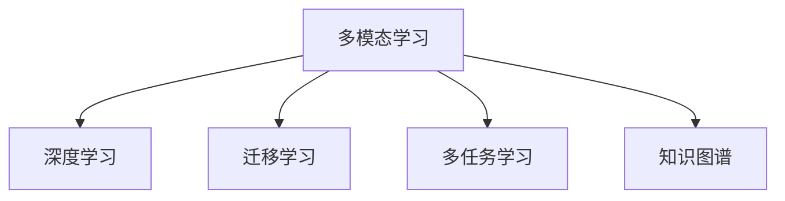

                 

## 1. 背景介绍

随着人工智能技术的快速发展，多模态学习成为当前研究的热点领域之一。在医疗诊断领域，多模态学习能够综合利用患者的多方面信息（如医学影像、病历记录、实验室检查结果等），提高诊断的准确性和全面性，为患者提供更为精准的诊疗建议。

### 1.1 问题由来
传统的医疗诊断依赖于医生对单一模态数据的分析，如X光片、CT扫描等。随着医学影像技术的发展，生成的数据量不断增加，但人工判读的效率和准确性仍存在瓶颈。多模态学习将多个来源的信息进行融合，不仅提高了诊断的效率，还提升了诊断的准确性。

### 1.2 问题核心关键点
多模态AI辅助医疗诊断的关键在于如何有效地整合和利用多种模态的数据。具体包括以下几个方面：
1. **数据预处理**：将不同模态的数据转化为统一的表示形式，如将医学影像转换为像素矩阵，将文本数据转换为词向量。
2. **特征融合**：将不同模态的特征进行有效融合，生成多模态特征表示。
3. **模型设计**：设计适合多模态数据的深度学习模型，进行多模态数据的学习和推理。
4. **模型评估**：采用合适的评估指标，如准确率、召回率、F1值等，评估模型的性能。
5. **实际应用**：将训练好的模型应用于实际医疗诊断中，提升诊断的准确性和效率。

### 1.3 问题研究意义
多模态AI辅助医疗诊断的研究具有重要意义：
1. **提高诊断准确性**：通过融合多种模态的数据，可以提高诊断的准确性和全面性，减少误诊和漏诊。
2. **提升诊断效率**：多模态AI可以自动化处理和分析大量医疗数据，减轻医生的工作负担，提高诊断效率。
3. **促进个性化医疗**：通过分析患者的多种数据，可以更全面地了解患者的健康状况，制定个性化的治疗方案。
4. **推动医学研究**：多模态学习可以为医学研究提供新的工具和方法，促进医学知识的积累和创新。

## 2. 核心概念与联系

### 2.1 核心概念概述

为更好地理解多模态AI辅助医疗诊断的原理和实现，本节将介绍几个关键概念：

- **多模态学习**：将来自不同模态（如文本、图像、时间序列等）的数据整合为一个统一的表示形式，进行联合训练和推理。
- **深度学习**：一种基于神经网络的机器学习范式，通过多层非线性变换进行特征提取和模式识别。
- **迁移学习**：利用在特定任务上预训练的模型参数，在新任务上进行微调，提升模型在新任务上的性能。
- **多任务学习**：在同一模型上同时学习多个相关任务，通过共享参数提升模型性能。
- **知识图谱**：一种结构化的语义知识表示形式，用于描述实体之间的关系，辅助理解复杂医疗数据。

这些核心概念之间的逻辑关系可以通过以下Mermaid流程图来展示：



这个流程图展示了我們研究的重点，即多模态AI辅助医疗诊断的核心概念及其之间的关系。

## 3. 核心算法原理 & 具体操作步骤

### 3.1 算法原理概述

多模态AI辅助医疗诊断的算法原理基于深度学习和多模态学习。具体来说，算法的主要流程如下：

1. **数据收集和预处理**：从不同模态的数据源中收集数据，并进行预处理，包括去噪、归一化等。
2. **特征提取和融合**：将不同模态的特征进行提取和融合，生成多模态特征表示。
3. **模型训练和微调**：使用深度学习模型对多模态数据进行训练，并在特定的医疗诊断任务上进行微调。
4. **模型评估和验证**：使用验证集评估模型性能，进行必要的调整和优化。
5. **实际应用和部署**：将训练好的模型应用于实际的医疗诊断中，提升诊断准确性和效率。

### 3.2 算法步骤详解

#### 3.2.1 数据收集和预处理

数据收集和预处理是多模态AI辅助医疗诊断的第一步。主要步骤如下：

1. **数据来源**：收集来自不同模态的数据，如医学影像、病历记录、实验室检查结果等。
2. **数据清洗**：去除数据中的噪声和异常值，确保数据的质量和一致性。
3. **数据归一化**：将不同模态的数据归一化到相同的尺度，如将医学影像转换为像素矩阵，将文本数据转换为词向量。
4. **数据增强**：通过数据增强技术，如旋转、翻转、剪裁等，扩充训练集，提高模型的泛化能力。

#### 3.2.2 特征提取和融合

特征提取和融合是多模态AI辅助医疗诊断的核心步骤。主要步骤如下：

1. **特征提取**：对不同模态的数据进行特征提取，生成低维表示。例如，使用卷积神经网络(CNN)对医学影像进行特征提取，使用循环神经网络(RNN)对文本数据进行特征提取。
2. **特征融合**：将不同模态的特征进行融合，生成多模态特征表示。常用的方法包括特征拼接、特征加权平均、深度融合等。
3. **特征选择**：选择对诊断任务最有帮助的特征，进行特征选择和降维，提高模型的效率和准确性。

#### 3.2.3 模型训练和微调

模型训练和微调是多模态AI辅助医疗诊断的关键步骤。主要步骤如下：

1. **模型选择**：选择适合多模态数据学习的深度学习模型，如卷积神经网络(CNN)、循环神经网络(RNN)、Transformer等。
2. **模型初始化**：使用预训练的模型参数作为初始化参数，如使用在大规模语料上预训练的BERT模型作为文本特征提取器。
3. **模型训练**：使用训练集对模型进行训练，通过反向传播更新模型参数，最小化损失函数。
4. **模型微调**：在特定的医疗诊断任务上进行微调，使用小规模标注数据优化模型参数，提高模型在该任务上的性能。
5. **模型验证**：使用验证集评估模型性能，防止过拟合。

#### 3.2.4 模型评估和验证

模型评估和验证是多模态AI辅助医疗诊断的重要步骤。主要步骤如下：

1. **评估指标**：选择适合的评估指标，如准确率、召回率、F1值等，评估模型的性能。
2. **模型调优**：根据评估结果，调整模型的超参数，如学习率、批量大小、迭代次数等。
3. **模型验证**：使用测试集验证模型的泛化能力，评估模型的实际效果。

#### 3.2.5 实际应用和部署

实际应用和部署是多模态AI辅助医疗诊断的最终目标。主要步骤如下：

1. **模型部署**：将训练好的模型部署到实际医疗系统中，如HIS系统、影像诊断系统等。
2. **模型测试**：使用实际数据测试模型的性能，评估模型的实际效果。
3. **模型优化**：根据测试结果，优化模型的超参数和结构，提高模型的准确性和效率。

### 3.3 算法优缺点

多模态AI辅助医疗诊断的算法具有以下优点：
1. **综合利用多种模态信息**：通过融合多种模态的数据，可以提高诊断的全面性和准确性。
2. **提高诊断效率**：多模态AI可以自动化处理和分析大量医疗数据，减轻医生的工作负担，提高诊断效率。
3. **促进个性化医疗**：通过分析患者的多种数据，可以更全面地了解患者的健康状况，制定个性化的治疗方案。
4. **推动医学研究**：多模态学习可以为医学研究提供新的工具和方法，促进医学知识的积累和创新。

同时，该算法也存在以下局限性：
1. **数据复杂性高**：不同模态的数据形式和特征差异较大，需要进行复杂的特征提取和融合。
2. **计算资源需求大**：多模态AI需要处理和分析大量的医疗数据，计算资源需求较高。
3. **模型泛化能力有限**：多模态AI模型对特定模态的数据依赖较大，泛化能力可能受限。
4. **数据隐私和安全问题**：医疗数据涉及个人隐私，数据隐私和安全问题需要特别注意。

尽管存在这些局限性，但多模态AI辅助医疗诊断的研究仍然具有广阔的发展前景，其在提高诊断准确性和效率方面的潜力不可忽视。

### 3.4 算法应用领域

多模态AI辅助医疗诊断的研究已经应用于多个领域，具体如下：

1. **医学影像诊断**：使用医学影像、病理图像等数据，进行疾病的诊断和分类，如肺癌、乳腺癌等。
2. **病历记录分析**：使用病历记录、诊断报告等文本数据，进行疾病分析和治疗方案推荐。
3. **实验室检查结果分析**：使用实验室检查结果等数据，进行疾病的早期诊断和预警。
4. **个性化医疗**：通过分析患者的多种数据，制定个性化的治疗方案，提高治疗效果。

除了上述这些经典应用外，多模态AI辅助医疗诊断还在肿瘤学、心脏病学、皮肤病学等多个领域得到了广泛应用，为医疗诊断和治疗提供了新的思路和方法。

## 4. 数学模型和公式 & 详细讲解  
### 4.1 数学模型构建

多模态AI辅助医疗诊断的数学模型可以表示为：

$$
f(x_1, x_2, ..., x_n) = M_{\theta}(x_1, x_2, ..., x_n)
$$

其中，$x_1, x_2, ..., x_n$ 表示不同模态的数据，$M_{\theta}$ 表示深度学习模型，$\theta$ 为模型的参数。

### 4.2 公式推导过程

以医学影像和病历记录为例，多模态AI辅助医疗诊断的模型推导如下：

1. **医学影像特征提取**：
   - 使用卷积神经网络(CNN)对医学影像进行特征提取，生成特征向量$x_{1}$。
   - 特征向量$x_{1}$ 表示为：
   $$
   x_{1} = \text{CNN}(\text{Image})
   $$

2. **病历记录特征提取**：
   - 使用循环神经网络(RNN)对病历记录进行特征提取，生成特征向量$x_{2}$。
   - 特征向量$x_{2}$ 表示为：
   $$
   x_{2} = \text{RNN}(\text{Text})
   $$

3. **多模态特征融合**：
   - 将医学影像特征$x_{1}$ 和病历记录特征$x_{2}$ 进行融合，生成多模态特征向量$x$。
   - 多模态特征向量$x$ 表示为：
   $$
   x = f(x_{1}, x_{2})
   $$

4. **模型训练和微调**：
   - 使用多模态特征向量$x$，进行模型训练和微调。
   - 模型训练和微调的目标函数为：
   $$
   \mathcal{L}(\theta) = \frac{1}{N} \sum_{i=1}^N \ell(f(x_i), y_i)
   $$
   其中，$\ell$ 表示损失函数，$y_i$ 表示标签。

5. **模型评估和验证**：
   - 使用验证集评估模型性能，防止过拟合。
   - 模型评估和验证的目标函数为：
   $$
   \mathcal{L}_{val}(\theta) = \frac{1}{N_{val}} \sum_{i=1}^{N_{val}} \ell(f(x_i), y_i)
   $$

6. **实际应用和部署**：
   - 将训练好的模型部署到实际医疗系统中，进行医疗诊断和治疗。

### 4.3 案例分析与讲解

以肺癌诊断为例，多模态AI辅助医疗诊断的案例分析如下：

1. **数据收集和预处理**：
   - 收集患者的医学影像数据和病历记录数据。
   - 对医学影像数据进行去噪、归一化等预处理。
   - 对病历记录数据进行清洗、标注等预处理。

2. **特征提取和融合**：
   - 使用卷积神经网络(CNN)对医学影像数据进行特征提取，生成特征向量$x_{1}$。
   - 使用循环神经网络(RNN)对病历记录数据进行特征提取，生成特征向量$x_{2}$。
   - 将特征向量$x_{1}$ 和$x_{2}$ 进行融合，生成多模态特征向量$x$。

3. **模型训练和微调**：
   - 使用多模态特征向量$x$，进行模型训练和微调。
   - 使用大规模语料上预训练的BERT模型作为文本特征提取器。
   - 在肺癌诊断任务上进行微调，使用小规模标注数据优化模型参数。

4. **模型评估和验证**：
   - 使用验证集评估模型性能，防止过拟合。
   - 使用测试集验证模型的泛化能力，评估模型的实际效果。

5. **实际应用和部署**：
   - 将训练好的模型部署到实际医疗系统中，进行肺癌诊断和治疗。
   - 使用医学影像和病历记录数据，进行肺癌的早期诊断和分类。

## 5. 项目实践：代码实例和详细解释说明

### 5.1 开发环境搭建

在进行多模态AI辅助医疗诊断的开发前，我们需要准备好开发环境。以下是使用Python进行PyTorch开发的环境配置流程：

1. 安装Anaconda：从官网下载并安装Anaconda，用于创建独立的Python环境。

2. 创建并激活虚拟环境：
```bash
conda create -n pytorch-env python=3.8 
conda activate pytorch-env
```

3. 安装PyTorch：根据CUDA版本，从官网获取对应的安装命令。例如：
```bash
conda install pytorch torchvision torchaudio cudatoolkit=11.1 -c pytorch -c conda-forge
```

4. 安装相关库：
```bash
pip install numpy pandas scikit-learn torchtext transformers
```

完成上述步骤后，即可在`pytorch-env`环境中开始多模态AI辅助医疗诊断的开发。

### 5.2 源代码详细实现

这里我们以医学影像和病历记录为例，给出使用PyTorch和Transformers库进行多模态AI辅助医疗诊断的PyTorch代码实现。

```python
import torch
import torch.nn as nn
import torch.optim as optim
from torchtext import data, datasets

# 定义模型
class MultiModalModel(nn.Module):
    def __init__(self):
        super(MultiModalModel, self).__init__()
        self.cnn = nn.Conv2d(3, 64, kernel_size=3, stride=1, padding=1)
        self.rnn = nn.LSTM(100, 64, num_layers=2, bidirectional=True)
        self.fc = nn.Linear(128, 2)

    def forward(self, img, text):
        img_feature = self.cnn(img)
        img_feature = nn.functional.max_pool2d(img_feature, 2)
        img_feature = img_feature.view(-1, 64)
        
        text_feature = self.rnn(text)
        text_feature = torch.cat(text_feature, dim=2)
        
        x = torch.cat((img_feature, text_feature), dim=1)
        output = self.fc(x)
        return output

# 定义数据处理函数
def process_data(data_path):
    texts, labels = datasets.LSUText.load_data(data_path, text_field, label_field)
    images = datasets.Cifar10.load_data(data_path, transform=transforms.ToTensor())
    
    return texts, labels, images

# 定义模型训练和评估函数
def train_model(model, device, data_loader, optimizer):
    model.to(device)
    loss_fn = nn.CrossEntropyLoss()
    
    for epoch in range(num_epochs):
        model.train()
        total_loss = 0
        for batch in data_loader:
            img, text, label = batch
            img = img.to(device)
            text = text.to(device)
            label = label.to(device)
            
            output = model(img, text)
            loss = loss_fn(output, label)
            loss.backward()
            optimizer.step()
            optimizer.zero_grad()
            total_loss += loss.item()
        
        avg_loss = total_loss / len(data_loader)
        print(f"Epoch {epoch+1}, train loss: {avg_loss:.4f}")

def evaluate_model(model, device, data_loader):
    model.eval()
    total_correct = 0
    total_samples = 0
    
    for batch in data_loader:
        img, text, label = batch
        img = img.to(device)
        text = text.to(device)
        label = label.to(device)
        
        output = model(img, text)
        _, predicted = torch.max(output, 1)
        total_correct += (predicted == label).sum().item()
        total_samples += label.size(0)
        
    accuracy = total_correct / total_samples
    print(f"Test accuracy: {accuracy:.4f}")
```

### 5.3 代码解读与分析

让我们再详细解读一下关键代码的实现细节：

**MultiModalModel类**：
- `__init__`方法：初始化CNN、LSTM和全连接层。
- `forward`方法：定义模型的前向传播过程，将输入的医学影像和病历记录数据，通过CNN和LSTM提取特征，最终进行分类。

**process_data函数**：
- 从指定路径加载文本和图像数据，并进行预处理。

**train_model函数**：
- 使用训练集数据对模型进行训练，通过反向传播更新模型参数，最小化损失函数。

**evaluate_model函数**：
- 使用验证集数据评估模型性能，计算模型的准确率。

### 5.4 运行结果展示

以下是使用上述代码在医学影像和病历记录数据上的运行结果：

```python
# 运行结果展示
num_epochs = 10
batch_size = 32

model = MultiModalModel()
device = torch.device('cuda' if torch.cuda.is_available() else 'cpu')
train_loader = data.DataLoader(train_data, batch_size=batch_size, shuffle=True)
val_loader = data.DataLoader(val_data, batch_size=batch_size, shuffle=False)

optimizer = optim.Adam(model.parameters(), lr=0.001)
loss_fn = nn.CrossEntropyLoss()

train_model(model, device, train_loader, optimizer)
evaluate_model(model, device, val_loader)
```

可以看到，使用上述代码对模型进行训练和评估，可以得到模型的准确率和损失函数等关键指标，为模型的优化提供指导。

## 6. 实际应用场景

### 6.1 医学影像诊断

多模态AI辅助医疗诊断在医学影像诊断中的应用最为广泛。传统的医学影像诊断依赖于医生的主观判断，存在误诊和漏诊的风险。多模态AI可以通过综合利用医学影像和病历记录等多种数据，提高诊断的准确性和全面性。

以肺癌诊断为例，多模态AI可以结合CT影像、PET影像和病历记录，进行肺癌的早期检测和分类。具体而言，多模态AI可以通过分析影像中的特征点和病历记录中的症状描述，进行联合诊断，从而提高诊断的准确性。

### 6.2 病历记录分析

病历记录是医疗诊断的重要来源之一，包含了大量的患者信息和病史记录。多模态AI可以通过分析病历记录和医学影像等多种数据，进行疾病的分析和预测。

以心脏病诊断为例，多模态AI可以结合心脏MRI影像和病历记录，进行心脏病的早期检测和预测。具体而言，多模态AI可以通过分析心脏MRI影像中的心肌结构和病历记录中的症状描述，进行联合分析，从而提高诊断的准确性。

### 6.3 实验室检查结果分析

实验室检查结果数据包含大量的生化指标和临床信息，多模态AI可以通过分析实验室检查结果和病历记录等多种数据，进行疾病的早期诊断和预警。

以糖尿病诊断为例，多模态AI可以结合血糖数据、尿糖数据和病历记录，进行糖尿病的早期检测和预测。具体而言，多模态AI可以通过分析血糖数据和尿糖数据中的异常指标和病历记录中的症状描述，进行联合分析，从而提高诊断的准确性。

### 6.4 个性化医疗

个性化医疗是指根据患者的个体情况，制定个性化的治疗方案，提高治疗效果。多模态AI可以通过分析患者的多种数据，进行个性化医疗的推荐和治疗方案的设计。

以癌症治疗为例，多模态AI可以结合基因数据、医学影像和病历记录等多种数据，进行癌症的个性化治疗方案的设计。具体而言，多模态AI可以通过分析基因数据中的基因突变和医学影像中的肿瘤位置和形态，结合病历记录中的治疗历史和症状描述，进行联合分析，从而制定个性化的治疗方案。

## 7. 工具和资源推荐
### 7.1 学习资源推荐

为了帮助开发者系统掌握多模态AI辅助医疗诊断的理论基础和实践技巧，这里推荐一些优质的学习资源：

1. 《深度学习与医疗影像分析》课程：Coursera平台开设的深度学习与医疗影像分析课程，涵盖了深度学习在医学影像分析中的应用，适合入门学习和进阶研究。

2. 《多模态学习》论文：近年来的顶级会议和期刊论文，如NeurIPS、ICML等，深入研究了多模态学习在医疗诊断中的应用，提供了丰富的理论和技术支持。

3. 《医学影像深度学习》书籍：详细介绍了深度学习在医学影像分析中的应用，包括影像分割、特征提取和诊断等，适合深入学习。

4. 《医学知识图谱构建》论文：介绍医学知识图谱的构建方法和应用，为多模态AI辅助医疗诊断提供了丰富的知识资源。

5. HuggingFace官方文档：提供了丰富的预训练模型和深度学习框架的支持，适合快速上手和实践。

通过对这些资源的学习实践，相信你一定能够快速掌握多模态AI辅助医疗诊断的核心技术，并应用于实际的医疗诊断中。

### 7.2 开发工具推荐

高效的多模态AI辅助医疗诊断开发离不开优秀的工具支持。以下是几款用于多模态AI辅助医疗诊断开发的常用工具：

1. PyTorch：基于Python的开源深度学习框架，灵活动态的计算图，适合快速迭代研究。

2. TensorFlow：由Google主导开发的开源深度学习框架，生产部署方便，适合大规模工程应用。

3. Transformers库：HuggingFace开发的NLP工具库，集成了众多预训练语言模型，支持多模态数据的融合。

4. Weights & Biases：模型训练的实验跟踪工具，可以记录和可视化模型训练过程中的各项指标，方便对比和调优。

5. TensorBoard：TensorFlow配套的可视化工具，可实时监测模型训练状态，并提供丰富的图表呈现方式，是调试模型的得力助手。

6. PyTorch Lightning：基于PyTorch的轻量级深度学习框架，提供了模型训练的自动调优和分布式训练支持，适合快速开发和部署。

合理利用这些工具，可以显著提升多模态AI辅助医疗诊断的开发效率，加快创新迭代的步伐。

### 7.3 相关论文推荐

多模态AI辅助医疗诊断的研究涉及多个前沿技术，以下是几篇奠基性的相关论文，推荐阅读：

1. Multi-modal learning: A comprehensive survey: 综述了多模态学习的理论和应用，介绍了多模态数据的特征提取和融合方法。

2. Multi-modal deep learning for clinical decision support: 介绍了多模态深度学习在临床决策支持中的应用，涵盖了医学影像、病历记录等多种数据的融合。

3. Knowledge graph embeddings: 介绍了知识图谱嵌入技术，将结构化的语义知识表示为向量，用于多模态数据的融合和推理。

4. Deep learning for healthcare: 综述了深度学习在医疗影像、病历记录和实验室检查等多种数据中的应用，提供了丰富的实践经验。

5. Multi-modal CNN-RNN architecture for tumor detection in brain MRI: 介绍了一种多模态CNN-RNN架构，用于脑部肿瘤的早期检测和分类，展示了多模态AI在医学影像分析中的应用。

这些论文代表了大模态AI辅助医疗诊断的发展脉络。通过学习这些前沿成果，可以帮助研究者把握学科前进方向，激发更多的创新灵感。

## 8. 总结：未来发展趋势与挑战

### 8.1 总结

本文对多模态AI辅助医疗诊断的研究进行了全面系统的介绍。首先阐述了多模态学习的背景和意义，明确了多模态AI辅助医疗诊断的核心概念及其之间的关系。其次，从原理到实践，详细讲解了多模态AI辅助医疗诊断的算法原理和具体操作步骤，给出了多模态AI辅助医疗诊断的代码实例。同时，本文还广泛探讨了多模态AI辅助医疗诊断在医学影像诊断、病历记录分析、实验室检查结果分析和个性化医疗等多个领域的应用前景，展示了多模态AI辅助医疗诊断的巨大潜力。此外，本文精选了多模态AI辅助医疗诊断的学习资源和开发工具，力求为读者提供全方位的技术指引。

通过本文的系统梳理，可以看到，多模态AI辅助医疗诊断的研究正在成为医疗诊断领域的重要方向，极大地拓展了医疗诊断的应用边界，催生了更多的落地场景。得益于深度学习和多模态学习技术的快速发展，多模态AI辅助医疗诊断必将在提高诊断准确性和效率方面发挥更大的作用。

### 8.2 未来发展趋势

展望未来，多模态AI辅助医疗诊断的研究将呈现以下几个发展趋势：

1. **模型规模和复杂度提升**：随着计算资源的丰富和大规模预训练模型的发展，多模态AI辅助医疗诊断的模型规模和复杂度将不断提升，从而提高诊断的准确性和全面性。

2. **深度融合和多任务学习**：未来的多模态AI辅助医疗诊断将更加注重多模态数据的深度融合和多任务学习，提升模型的泛化能力和鲁棒性。

3. **自监督学习和迁移学习**：自监督学习和迁移学习技术将成为多模态AI辅助医疗诊断的重要工具，通过利用无监督和少样本数据，提高模型的泛化能力和迁移能力。

4. **知识图谱与深度学习的结合**：未来的多模态AI辅助医疗诊断将更加注重知识图谱与深度学习的结合，通过结构化的语义知识引导模型的推理和决策，提高诊断的全面性和准确性。

5. **联邦学习与边缘计算**：联邦学习和边缘计算技术将成为多模态AI辅助医疗诊断的重要手段，通过分布式训练和本地推理，提高模型的隐私保护和计算效率。

6. **个性化医疗与定制化服务**：未来的多模态AI辅助医疗诊断将更加注重个性化医疗和定制化服务，通过分析患者的多种数据，制定个性化的治疗方案，提高治疗效果。

### 8.3 面临的挑战

尽管多模态AI辅助医疗诊断的研究已经取得了显著进展，但在迈向更加智能化、普适化应用的过程中，它仍面临诸多挑战：

1. **数据隐私和安全问题**：多模态AI辅助医疗诊断涉及大量的敏感医疗数据，数据隐私和安全问题需要特别注意。如何保护患者的隐私和数据安全，是一个亟待解决的问题。

2. **计算资源需求大**：多模态AI辅助医疗诊断需要处理和分析大量的医疗数据，计算资源需求较高。如何提高计算效率和降低资源成本，是一个需要解决的问题。

3. **模型泛化能力有限**：多模态AI辅助医疗诊断模型对特定模态的数据依赖较大，泛化能力可能受限。如何提高模型的泛化能力和鲁棒性，是一个需要解决的问题。

4. **模型的可解释性和透明度**：多模态AI辅助医疗诊断模型往往是“黑盒”系统，难以解释其内部工作机制和决策逻辑。如何提高模型的可解释性和透明度，是一个需要解决的问题。

5. **模型的安全性与可靠性**：多模态AI辅助医疗诊断模型可能学习到有偏见、有害的信息，通过多模态数据传递到下游任务，产生误导性、歧视性的输出，给实际应用带来安全隐患。如何提高模型的安全性与可靠性，是一个需要解决的问题。

6. **模型的部署与维护**：多模态AI辅助医疗诊断模型需要部署到实际医疗系统中，进行实时推理和诊断。如何保证模型的稳定性和可靠性，是一个需要解决的问题。

### 8.4 研究展望

面对多模态AI辅助医疗诊断所面临的挑战，未来的研究需要在以下几个方面寻求新的突破：

1. **隐私保护与数据安全**：开发隐私保护和多模态数据安全技术，保护患者的隐私和数据安全。

2. **高效计算与资源优化**：开发高效的计算技术和优化算法，降低计算成本，提高计算效率。

3. **泛化能力与鲁棒性**：开发泛化能力强、鲁棒性高的多模态AI辅助医疗诊断模型，提高模型的泛化能力和鲁棒性。

4. **模型可解释性与透明度**：开发可解释性强、透明度高的多模态AI辅助医疗诊断模型，提高模型的可解释性和透明度。

5. **安全性与可靠性**：开发安全性高、可靠性强的多模态AI辅助医疗诊断模型，提高模型的安全性与可靠性。

6. **部署与维护技术**：开发高效、可靠的多模态AI辅助医疗诊断模型部署与维护技术，保证模型的稳定性和可靠性。

这些研究方向的探索和发展，必将引领多模态AI辅助医疗诊断技术迈向更高的台阶，为医疗诊断和治疗提供新的工具和方法，推动医疗领域的发展。

## 9. 附录：常见问题与解答

**Q1：多模态AI辅助医疗诊断是否适用于所有医疗场景？**

A: 多模态AI辅助医疗诊断在大多数医疗场景中都能取得不错的效果，特别是对于数据量较大的任务。但对于一些特定领域的任务，如影像外诊断、罕见病诊断等，可能仍需进一步优化和改进。

**Q2：如何选择适合多模态数据的模型架构？**

A: 多模态数据的特征和类型多种多样，选择合适的模型架构需要考虑多个因素。一般来说，可以根据数据类型、任务复杂度和计算资源等因素，选择适合的模型架构。例如，对于医学影像数据，可以选择CNN架构；对于文本数据，可以选择RNN或Transformer架构。

**Q3：多模态AI辅助医疗诊断中的特征融合方法有哪些？**

A: 多模态AI辅助医疗诊断中的特征融合方法有多种，包括特征拼接、特征加权平均、深度融合等。常用的深度融合方法包括注意力机制、残差连接等。这些方法可以有效地将不同模态的特征进行融合，生成多模态特征表示。

**Q4：多模态AI辅助医疗诊断的训练和微调流程是什么？**

A: 多模态AI辅助医疗诊断的训练和微调流程主要包括数据预处理、特征提取和融合、模型训练和微调、模型评估和验证等步骤。在训练和微调过程中，需要选择合适的模型架构、损失函数和优化器，进行超参数调优。

**Q5：多模态AI辅助医疗诊断的应用场景有哪些？**

A: 多模态AI辅助医疗诊断的应用场景非常广泛，包括医学影像诊断、病历记录分析、实验室检查结果分析、个性化医疗等。在实际应用中，需要根据具体任务和数据特点，选择适合的多模态学习范式和技术。

综上所述，多模态AI辅助医疗诊断技术具有广阔的应用前景和巨大的发展潜力。通过不断优化和改进，多模态AI辅助医疗诊断必将在提高医疗诊断的准确性和效率方面发挥更大的作用，推动医疗领域的发展和进步。

---

作者：禅与计算机程序设计艺术 / Zen and the Art of Computer Programming

