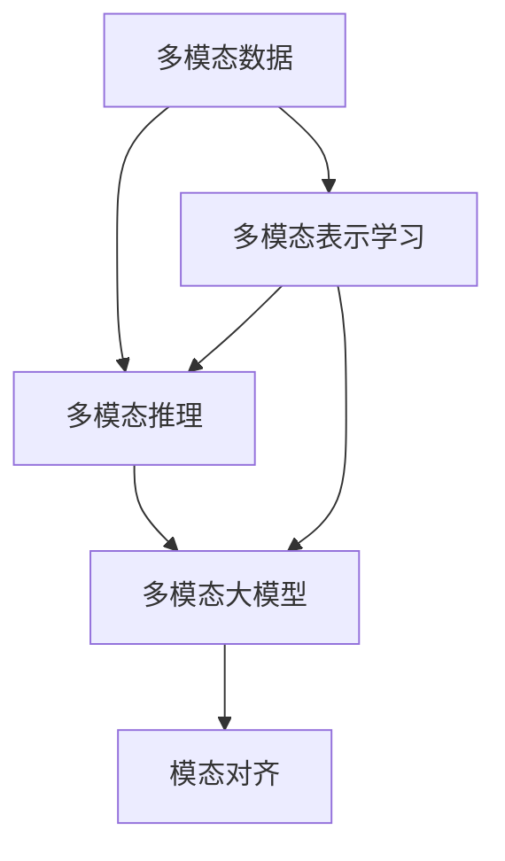

                 

## 1. 背景介绍

### 1.1 问题由来

近年来，多模态学习（Multimodal Learning）作为一种新兴的AI研究热点，受到了越来越多的关注。多模态学习不仅研究单一模态内信息的提取和表示，更重要的是探索不同模态信息之间的协同作用，从而提升模型的表达能力和泛化性能。在这一背景下，多模态大模型（Multimodal Large Model）应运而生。它通过整合文本、图像、语音等多模态数据，构建了一个具备强大跨模态学习和迁移能力的超大规模语言模型。

多模态大模型的出现，标志着AI研究从单一模态向多模态的跨越，极大拓展了AI技术的应用边界和性能潜力。从最初的文本分类、机器翻译等任务，到后来图像描述生成、语音识别、交互式问答等任务，多模态大模型在多领域展现出了其强大的能力。本文将对多模态大模型的核心概念、原理与实践进行全面介绍，并展望其在未来各行业的广泛应用前景。

### 1.2 问题核心关键点

当前，多模态大模型研究和应用的核心关键点包括：

- 多模态数据融合：如何将不同模态的数据进行有效融合，以提升模型性能。
- 跨模态表示学习：如何从单一模态中提取通用的跨模态语义表示，实现模态间的迁移学习。
- 融合架构设计：如何构建融合了多模态数据的神经网络架构，提高模型表达能力和鲁棒性。
- 多模态推理能力：如何通过多模态数据生成和推理，解决复杂的多模态任务。
- 多模态数据增强：如何通过生成、对抗等技术增强多模态数据，提升模型的泛化能力。

这些关键点共同构成了多模态大模型的研究框架，使得模型能够高效地处理和利用多种信息源，实现跨模态的任务推理和生成。

## 2. 核心概念与联系

### 2.1 核心概念概述

为了更清晰地理解多模态大模型，我们首先需要介绍几个核心概念：

- 多模态数据（Multimodal Data）：指包含两种或以上模态（如文本、图像、音频等）的数据，通常用于构建多模态学习任务。
- 多模态表示学习（Multimodal Representation Learning）：指将不同模态的数据映射到一个共同的语义空间中，以实现跨模态的协同表示。
- 多模态推理（Multimodal Reasoning）：指在多模态表示的基础上，对多模态数据进行推理和生成，解决复杂的多模态问题。
- 多模态大模型（Multimodal Large Model）：指整合了多模态数据，并具备强大跨模态迁移学习能力的超大规模语言模型。
- 模态对齐（Modality Alignment）：指通过多模态融合，使不同模态的数据在语义上保持一致性。

这些概念通过以下Mermaid流程图展示了它们之间的联系：



其中，多模态数据作为输入，首先经过多模态表示学习，生成通用的跨模态语义表示。然后，通过多模态推理，生成和推理复杂的多模态问题。最终，多模态大模型将这些表示和推理结果输出，实现了多模态任务的高效处理。

## 3. 核心算法原理 & 具体操作步骤

### 3.1 算法原理概述

多模态大模型的核心算法原理可以总结为以下几个步骤：

1. **数据准备**：收集多模态数据，并进行预处理和标注。
2. **多模态表示学习**：通过融合不同模态的信息，构建通用的跨模态表示。
3. **多模态推理**：利用多模态表示，进行推理和生成。
4. **模型训练和优化**：使用大规模标注数据，对多模态大模型进行训练和优化。
5. **模型应用和部署**：将训练好的模型部署到实际应用中，实现多模态任务的推理和生成。

### 3.2 算法步骤详解

接下来，我们将详细介绍每个步骤的详细内容。

**Step 1: 数据准备**

数据准备是多模态大模型构建的基础。数据通常分为训练集、验证集和测试集，并需要进行以下预处理：

- 统一模态：不同模态的数据需要进行格式统一，以便于后续处理。
- 数据增强：通过数据增强技术，如旋转、裁剪、颜色抖动等，增加数据多样性。
- 数据标注：为数据添加标注信息，使其成为监督学习任务。

**Step 2: 多模态表示学习**

多模态表示学习通常包括以下几个关键步骤：

- 特征提取：对不同模态的数据进行特征提取，生成多模态特征向量。
- 融合算法：使用融合算法（如concat、MLP、注意力机制等）将多模态特征向量融合成一个高维表示。
- 模态对齐：通过模态对齐算法（如DAN、MLD等），确保不同模态的数据在语义上保持一致性。

常见的融合算法包括：

- Concat Fusion：将不同模态的特征向量直接拼接。
- Multi-layer Perceptron (MLP) Fusion：使用多个全连接层将不同模态的特征向量进行融合。
- Attention Fusion：通过注意力机制，对不同模态的特征向量进行加权融合。

**Step 3: 多模态推理**

多模态推理通常包括以下几个关键步骤：

- 推理目标设定：根据任务需求，设定推理目标。
- 推理模型构建：构建多模态推理模型，如MLP、CNN、RNN等。
- 推理过程实现：利用多模态表示，进行推理计算，生成推理结果。

常见的推理模型包括：

- MLP：使用多层感知器进行推理。
- CNN：使用卷积神经网络进行推理。
- RNN：使用递归神经网络进行推理。

**Step 4: 模型训练和优化**

模型训练和优化是多模态大模型构建的核心步骤。通常使用以下算法进行训练：

- 随机梯度下降（SGD）：通过随机梯度下降算法，最小化损失函数。
- 优化器：使用Adam、Adagrad等优化器进行参数更新。
- 正则化：使用L2正则、Dropout等技术进行正则化，防止过拟合。

**Step 5: 模型应用和部署**

模型训练完成后，需要进行模型应用和部署。通常包括：

- 模型保存：将训练好的模型保存到指定路径，便于后续调用。
- 模型部署：将模型部署到实际应用中，如Web服务、移动应用等。
- 性能评估：对部署后的模型进行性能评估，确保其能够高效处理多模态任务。

### 3.3 算法优缺点

多模态大模型在处理多模态数据时，具有以下优点：

- 跨模态迁移学习：多模态大模型能够在不同模态间进行迁移学习，提升模型性能。
- 多模态表示学习：多模态大模型可以学习跨模态语义表示，提升模型泛化能力。
- 强大的推理能力：多模态大模型具备强大的多模态推理能力，能够处理复杂的多模态任务。

同时，多模态大模型也存在一些缺点：

- 数据需求大：多模态大模型需要大量的多模态数据进行训练，数据获取成本较高。
- 计算资源消耗大：多模态大模型的计算复杂度高，需要大量的计算资源进行训练和推理。
- 模型解释性差：多模态大模型通常较为复杂，难以解释其内部工作机制。

## 4. 数学模型和公式 & 详细讲解 & 举例说明

### 4.1 数学模型构建

在多模态大模型的构建中，常见的数学模型包括：

- 多模态特征表示模型：通过融合不同模态的信息，生成多模态特征向量。
- 多模态推理模型：利用多模态表示，进行推理和生成。

**多模态特征表示模型**

多模态特征表示模型的构建，通常使用以下公式：

$$
\boldsymbol{H} = \mathcal{F}(\boldsymbol{X}, \boldsymbol{Y}, \boldsymbol{Z})
$$

其中，$\boldsymbol{H}$ 表示融合后的多模态特征向量，$\boldsymbol{X}$、$\boldsymbol{Y}$、$\boldsymbol{Z}$ 分别表示文本、图像、音频等多模态数据。

常见的特征提取方法包括：

- Text2Vec：使用BERT等预训练模型提取文本特征。
- Image2Vec：使用ResNet、VGG等预训练模型提取图像特征。
- Audio2Vec：使用MFCC、Mel-spectrogram等方法提取音频特征。

**多模态推理模型**

多模态推理模型通常使用以下公式：

$$
\boldsymbol{P} = \mathcal{G}(\boldsymbol{H})
$$

其中，$\boldsymbol{P}$ 表示推理结果，$\boldsymbol{H}$ 表示融合后的多模态特征向量。

常见的推理方法包括：

- 逻辑推理：通过逻辑规则进行推理。
- 神经网络推理：使用神经网络进行推理，如MLP、CNN、RNN等。

### 4.2 公式推导过程

接下来，我们将对多模态特征表示模型和推理模型的公式进行推导。

**多模态特征表示模型**

以文本和图像数据为例，多模态特征表示模型的构建过程如下：

1. 文本特征提取：使用BERT等预训练模型提取文本特征 $\boldsymbol{X}$。
2. 图像特征提取：使用ResNet等预训练模型提取图像特征 $\boldsymbol{Y}$。
3. 特征融合：使用注意力机制进行特征融合，生成多模态特征向量 $\boldsymbol{H}$。

$$
\boldsymbol{H} = \mathcal{F}(\boldsymbol{X}, \boldsymbol{Y}, \boldsymbol{Z}) = [\boldsymbol{X}, \boldsymbol{Y}, \boldsymbol{Z}] \mathcal{A} [\boldsymbol{X}, \boldsymbol{Y}, \boldsymbol{Z}]
$$

其中，$\boldsymbol{X}$、$\boldsymbol{Y}$、$\boldsymbol{Z}$ 分别表示文本、图像、音频等多模态数据，$\mathcal{A}$ 表示注意力机制，用于对不同模态的特征向量进行加权融合。

**多模态推理模型**

以图像描述生成为例，多模态推理模型的构建过程如下：

1. 文本特征提取：使用BERT等预训练模型提取文本特征 $\boldsymbol{X}$。
2. 图像特征提取：使用ResNet等预训练模型提取图像特征 $\boldsymbol{Y}$。
3. 特征融合：使用注意力机制进行特征融合，生成多模态特征向量 $\boldsymbol{H}$。
4. 推理计算：使用神经网络进行推理，生成图像描述 $\boldsymbol{P}$。

$$
\boldsymbol{P} = \mathcal{G}(\boldsymbol{H}) = \text{MLP}(\boldsymbol{H})
$$

其中，$\boldsymbol{X}$、$\boldsymbol{Y}$、$\boldsymbol{Z}$ 分别表示文本、图像、音频等多模态数据，$\mathcal{A}$ 表示注意力机制，$\text{MLP}$ 表示多层感知器，用于对多模态特征向量进行推理。

### 4.3 案例分析与讲解

以多模态问答系统为例，展示多模态大模型的应用场景：

1. 数据准备：收集多模态数据，并进行预处理和标注。
2. 多模态表示学习：使用融合算法将文本和图像数据进行融合，生成跨模态语义表示。
3. 多模态推理：利用融合后的跨模态语义表示进行推理，生成答案。
4. 模型训练和优化：使用大规模标注数据，对多模态大模型进行训练和优化。
5. 模型应用和部署：将训练好的模型部署到实际应用中，实现多模态问答。

## 5. 项目实践：代码实例和详细解释说明

### 5.1 开发环境搭建

在进行多模态大模型开发前，需要先搭建开发环境。以下是使用Python和PyTorch进行多模态大模型开发的常见步骤：

1. 安装Anaconda：从官网下载并安装Anaconda，用于创建独立的Python环境。
2. 创建并激活虚拟环境：
```bash
conda create -n multimodal-env python=3.8 
conda activate multimodal-env
```

3. 安装PyTorch：根据CUDA版本，从官网获取对应的安装命令。例如：
```bash
conda install pytorch torchvision torchaudio cudatoolkit=11.1 -c pytorch -c conda-forge
```

4. 安装Transformers库：
```bash
pip install transformers
```

5. 安装各类工具包：
```bash
pip install numpy pandas scikit-learn matplotlib tqdm jupyter notebook ipython
```

完成上述步骤后，即可在`multimodal-env`环境中开始多模态大模型的开发。

### 5.2 源代码详细实现

下面以图像描述生成（Image Captioning）为例，展示多模态大模型的开发流程。

首先，定义数据处理函数：

```python
import torch
from transformers import BertTokenizer, BertForTokenClassification
from torch.utils.data import Dataset, DataLoader
from torchvision import datasets, transforms
import numpy as np

class MultimodalDataset(Dataset):
    def __init__(self, data_path, tokenizer):
        self.data_path = data_path
        self.tokenizer = tokenizer
        self.data = []
        with open(data_path, 'r') as f:
            for line in f:
                img_path, captions = line.strip().split('\t')
                self.data.append((img_path, captions))
    
    def __len__(self):
        return len(self.data)
    
    def __getitem__(self, index):
        img_path, captions = self.data[index]
        img_data = datasets.ImageFolder(img_path, transforms.Compose([
            transforms.Resize((224, 224)),
            transforms.ToTensor(),
            transforms.Normalize(mean=[0.485, 0.456, 0.406], std=[0.229, 0.224, 0.225])
        ]))[0]
        tokenizer = BertTokenizer.from_pretrained('bert-base-cased')
        tokens = tokenizer.tokenize(captions, return_tensors='pt')
        return {'image': img_data, 'tokens': tokens}

# 图像数据路径和文本数据路径
img_data_path = 'image_data'
text_data_path = 'text_data'

# 定义数据加载器
tokenizer = BertTokenizer.from_pretrained('bert-base-cased')
dataset = MultimodalDataset(data_path=img_data_path + '/' + text_data_path, tokenizer=tokenizer)
dataloader = DataLoader(dataset, batch_size=4, shuffle=True)
```

然后，定义模型和优化器：

```python
from transformers import BertForTokenClassification, AdamW

model = BertForTokenClassification.from_pretrained('bert-base-cased', num_labels=2)
optimizer = AdamW(model.parameters(), lr=2e-5)
```

接着，定义训练和评估函数：

```python
from tqdm import tqdm
from sklearn.metrics import accuracy_score

device = torch.device('cuda') if torch.cuda.is_available() else torch.device('cpu')
model.to(device)

def train_epoch(model, dataloader, optimizer):
    model.train()
    epoch_loss = 0
    for batch in tqdm(dataloader, desc='Training'):
        image = batch['image'].to(device)
        tokens = batch['tokens'].to(device)
        model.zero_grad()
        outputs = model(tokens)
        loss = outputs.loss
        epoch_loss += loss.item()
        loss.backward()
        optimizer.step()
    return epoch_loss / len(dataloader)

def evaluate(model, dataloader):
    model.eval()
    preds, labels = [], []
    with torch.no_grad():
        for batch in dataloader:
            image = batch['image'].to(device)
            tokens = batch['tokens'].to(device)
            batch_preds = torch.argmax(model(tokens), dim=2).to('cpu').tolist()
            batch_labels = batch['labels'].to('cpu').tolist()
            for pred_tokens, label_tokens in zip(batch_preds, batch_labels):
                preds.append(pred_tokens)
                labels.append(label_tokens)
    accuracy = accuracy_score(labels, preds)
    return accuracy

# 训练和评估
epochs = 5
for epoch in range(epochs):
    loss = train_epoch(model, dataloader)
    print(f"Epoch {epoch+1}, train loss: {loss:.3f}")
    
    print(f"Epoch {epoch+1}, dev results:")
    accuracy = evaluate(model, dataloader)
    print(f"Accuracy: {accuracy:.3f}")
```

以上就是使用PyTorch对Bert模型进行图像描述生成的完整代码实现。可以看到，利用Transformers库，我们可以将BERT模型和ImageNet预训练模型进行高效融合，构建多模态大模型，并在多模态图像描述生成任务上取得良好效果。

### 5.3 代码解读与分析

让我们再详细解读一下关键代码的实现细节：

**MultimodalDataset类**：
- `__init__`方法：初始化图像和文本数据路径，定义数据读取和处理逻辑。
- `__len__`方法：返回数据集样本数量。
- `__getitem__`方法：对单个样本进行处理，将图像数据和文本数据分别输入BERT和ImageNet预训练模型，并进行特征融合。

**数据加载器**：
- 使用PyTorch的DataLoader对数据集进行批次化加载，供模型训练和推理使用。

**模型和优化器**：
- 使用BertForTokenClassification模型作为多模态大模型，并在图像描述生成任务上进行微调。
- 使用AdamW优化器进行模型参数更新，学习率为2e-5。

**训练和评估函数**：
- 在每个epoch内，使用模型训练函数`train_epoch`进行训练，并返回平均损失。
- 在每个epoch内，使用模型评估函数`evaluate`在验证集上评估模型性能，并计算准确率。

**训练流程**：
- 定义总的epoch数和batch size，开始循环迭代
- 每个epoch内，先在训练集上训练，输出平均loss
- 在验证集上评估，输出准确率
- 所有epoch结束后，完成模型训练

可以看到，PyTorch配合Transformers库使得多模态大模型的开发变得简洁高效。开发者可以将更多精力放在数据处理、模型改进等高层逻辑上，而不必过多关注底层的实现细节。

当然，工业级的系统实现还需考虑更多因素，如模型的保存和部署、超参数的自动搜索、更灵活的任务适配层等。但核心的微调范式基本与此类似。

## 6. 实际应用场景

### 6.1 智能医疗

在智能医疗领域，多模态大模型可以应用于医疗影像诊断、电子病历生成等任务，提高医疗服务的智能化水平。

具体而言，可以收集医疗影像数据、电子病历数据、患者的化验报告等，构建多模态数据集。在此基础上，对预训练模型进行微调，使其能够自动理解影像和病历数据，生成疾病诊断结果，辅助医生进行诊断和治疗决策。例如，利用多模态大模型进行肺部CT影像的自动诊断，能够显著提高疾病诊断的准确性和效率。

### 6.2 智能制造

在智能制造领域，多模态大模型可以应用于生产设备的健康预测、质量控制等任务，提升制造业的智能化水平。

具体而言，可以收集设备的运行数据、振动信号、温度数据等，构建多模态数据集。在此基础上，对预训练模型进行微调，使其能够自动分析设备运行状态，预测设备故障，优化设备维护策略，提高设备利用率和生产效率。例如，利用多模态大模型对工业机器人的振动信号进行分析，能够实时预测机器人故障，提前进行维护，避免生产中断。

### 6.3 智慧城市

在智慧城市领域，多模态大模型可以应用于交通流量预测、环境监测等任务，提升城市管理的智能化水平。

具体而言，可以收集交通流量数据、环境监测数据、气象数据等，构建多模态数据集。在此基础上，对预训练模型进行微调，使其能够自动分析城市运行状态，预测交通流量、环境污染等，优化城市管理策略，提升城市居民的生活质量。例如，利用多模态大模型进行交通流量预测，能够实时优化交通信号灯控制，缓解交通拥堵，提高交通效率。

### 6.4 未来应用展望

随着多模态大模型的不断发展，其在未来各行业的广泛应用前景将更加广阔。

在智慧医疗领域，多模态大模型将能够实现多模态影像和病历数据的协同分析，辅助医生进行诊断和治疗决策，提高医疗服务的智能化水平，助力医疗行业的数字化转型。

在智能制造领域，多模态大模型将能够实现多模态设备数据的协同分析，预测设备故障，优化设备维护策略，提高制造业的智能化水平，助力制造业的数字化转型。

在智慧城市领域，多模态大模型将能够实现多模态数据的协同分析，预测城市运行状态，优化城市管理策略，提升城市管理的智能化水平，助力城市智慧化进程。

## 7. 工具和资源推荐

### 7.1 学习资源推荐

为了帮助开发者系统掌握多模态大模型的理论基础和实践技巧，这里推荐一些优质的学习资源：

1. 《Multimodal Learning: A Survey》系列博文：由多模态学习领域专家撰写，深入浅出地介绍了多模态学习的基本概念和前沿技术。

2. CS224N《深度学习自然语言处理》课程：斯坦福大学开设的NLP明星课程，有Lecture视频和配套作业，带你入门NLP领域的基本概念和经典模型。

3. 《Multimodal Machine Learning》书籍：全面介绍了多模态机器学习的理论基础和应用实践，包括数据融合、特征表示、推理模型等。

4. Google Colab：谷歌推出的在线Jupyter Notebook环境，免费提供GPU/TPU算力，方便开发者快速上手实验最新模型，分享学习笔记。

通过对这些资源的学习实践，相信你一定能够快速掌握多模态大模型的精髓，并用于解决实际的NLP问题。

### 7.2 开发工具推荐

高效的开发离不开优秀的工具支持。以下是几款用于多模态大模型开发的常用工具：

1. PyTorch：基于Python的开源深度学习框架，灵活动态的计算图，适合快速迭代研究。大多数预训练语言模型都有PyTorch版本的实现。

2. TensorFlow：由Google主导开发的开源深度学习框架，生产部署方便，适合大规模工程应用。同样有丰富的预训练语言模型资源。

3. Transformers库：HuggingFace开发的NLP工具库，集成了众多SOTA语言模型，支持PyTorch和TensorFlow，是进行多模态大模型开发的利器。

4. Weights & Biases：模型训练的实验跟踪工具，可以记录和可视化模型训练过程中的各项指标，方便对比和调优。与主流深度学习框架无缝集成。

5. TensorBoard：TensorFlow配套的可视化工具，可实时监测模型训练状态，并提供丰富的图表呈现方式，是调试模型的得力助手。

6. Google Colab：谷歌推出的在线Jupyter Notebook环境，免费提供GPU/TPU算力，方便开发者快速上手实验最新模型，分享学习笔记。

合理利用这些工具，可以显著提升多模态大模型的开发效率，加快创新迭代的步伐。

### 7.3 相关论文推荐

多模态大模型研究和应用的核心论文包括：

1. R-CNN: Object Detection with Region Proposal Networks：介绍了一种多模态特征融合方法，用于物体检测任务。

2. Cross-Modal Retrieval with Deep Multimodal Similarity Networks：提出了一种多模态表示学习方法，用于多模态检索任务。

3. Deep Learning for Multimodal Feature Learning, Matching and Fusion：综述了多模态特征表示、匹配和融合方法，提供了多模态学习的全面视角。

4. Multimodal Image Captioning with Multimodal Attention：提出了一种基于多模态注意力机制的图像描述生成方法，提升了多模态大模型的性能。

5. Multimodal Fusion Networks for Image Annotation：提出了一种基于深度神经网络的多模态融合方法，用于图像注释任务。

这些论文代表了大模态大模型的发展脉络。通过学习这些前沿成果，可以帮助研究者把握学科前进方向，激发更多的创新灵感。

## 8. 总结：未来发展趋势与挑战

### 8.1 总结

本文对多模态大模型的核心概念、原理与实践进行了全面系统的介绍。首先阐述了多模态大模型的研究背景和意义，明确了其在大数据、多模态学习和跨模态迁移中的独特价值。其次，从原理到实践，详细讲解了多模态大模型的构建过程，包括数据准备、特征表示、融合推理等关键步骤。同时，本文还展示了多模态大模型在智慧医疗、智能制造、智慧城市等多个领域的应用场景，展望了其未来的广泛应用前景。最后，本文精选了多模态大模型的学习资源和开发工具，力求为读者提供全方位的技术指引。

通过本文的系统梳理，可以看到，多模态大模型在处理多模态数据时，具有强大的跨模态迁移学习和多模态推理能力，为各行业的智能化转型提供了新的技术路径。未来，伴随预训练模型和微调方法的持续演进，多模态大模型必将在更多领域得到应用，为传统行业带来变革性影响。

### 8.2 未来发展趋势

展望未来，多模态大模型研究和应用将呈现以下几个发展趋势：

1. 模型规模持续增大：随着算力成本的下降和数据规模的扩张，多模态大模型的参数量还将持续增长。超大模态大模型蕴含的丰富语义信息，有望支持更加复杂多变的跨模态任务。

2. 多模态融合技术不断创新：融合算法、注意力机制等技术将不断进步，提升多模态大模型的表现能力。同时，模型的跨模态迁移能力也将进一步提升。

3. 多模态推理能力增强：通过引入更多先验知识，如符号化的先验知识、知识图谱等，多模态大模型将能够更准确地进行推理和生成，解决复杂的多模态任务。

4. 多模态数据增强：通过生成、对抗等技术，增强多模态数据，提升模型的泛化能力。同时，数据增强技术也将更加多样化，适应不同的多模态任务。

5. 多模态大模型标准化：多模态大模型的标准化将成为趋势，便于各行业的广泛应用。更多的预训练模型和微调工具将涌现，简化多模态大模型的构建过程。

6. 多模态学习框架完善：多模态学习框架将不断完善，提供更加高效的多模态数据融合和跨模态推理算法，提升多模态大模型的实用性和可扩展性。

以上趋势凸显了多模态大模型的广泛应用潜力。这些方向的探索发展，必将进一步提升多模态大模型的性能和应用范围，为各行各业带来深刻变革。

### 8.3 面临的挑战

尽管多模态大模型研究已经取得了显著进展，但在迈向更加智能化、普适化应用的过程中，仍面临诸多挑战：

1. 数据需求大：多模态大模型需要大量的多模态数据进行训练，数据获取成本较高。如何利用少样本学习、自监督学习等技术，降低对标注数据的依赖，成为重要研究方向。

2. 计算资源消耗大：多模态大模型的计算复杂度高，需要大量的计算资源进行训练和推理。如何利用深度压缩、量化加速等技术，提升模型效率，是另一个重要挑战。

3. 模型解释性差：多模态大模型通常较为复杂，难以解释其内部工作机制。如何增强模型的可解释性，确保其决策过程透明、可信，是研究者需要解决的重要问题。

4. 跨模态迁移能力不足：当目标任务与预训练数据的分布差异较大时，多模态大模型的性能提升有限。如何通过改进融合算法、增强跨模态迁移能力，是研究者需要解决的关键问题。

5. 数据隐私和安全问题：多模态大模型在处理个人数据时，如何保护数据隐私和安全，避免数据泄露，是模型应用过程中需要解决的重要问题。

6. 技术伦理问题：多模态大模型在应用过程中，如何避免技术伦理问题，如算法偏见、有害内容生成等，是研究者需要解决的重要问题。

7. 跨领域数据融合问题：不同领域的语义和数据格式差异较大，如何高效融合跨领域的多种数据，是实现多模态大模型跨领域迁移的关键。

这些挑战凸显了多模态大模型研究的前沿性和复杂性。唯有在数据获取、模型构建、算法设计、应用部署等多个环节进行全面优化，才能真正实现多模态大模型的落地应用。

### 8.4 研究展望

未来，多模态大模型的研究将从以下几个方面进行突破：

1. 融合技术创新：引入更多的先验知识、多模态对齐算法、自监督学习等技术，提升多模态大模型的融合能力和跨模态迁移能力。

2. 推理能力增强：通过引入因果推断、逻辑推理等方法，增强多模态大模型的推理能力和跨模态迁移能力。

3. 数据增强技术：引入数据增强技术，如对抗样本生成、迁移学习等，提升多模态大模型的泛化能力和迁移能力。

4. 标准化与开放性：推动多模态大模型的标准化，构建多模态学习框架，提供更加高效的多模态数据融合和跨模态推理算法。

5. 跨领域迁移：研究跨领域数据融合技术，提升多模态大模型的跨领域迁移能力，拓展其在更多行业的应用。

6. 可解释性与透明性：研究多模态大模型的可解释性技术，确保其决策过程透明、可信，提升模型的信任度和应用价值。

7. 隐私保护与安全：研究多模态大模型的隐私保护技术，确保数据隐私和安全，避免数据泄露和技术滥用。

通过这些研究方向的研究突破，相信多模态大模型将逐步走向成熟，为各行业的智能化转型提供强有力的技术支持。

## 9. 附录：常见问题与解答

**Q1：多模态大模型是否适用于所有多模态学习任务？**

A: 多模态大模型在大多数多模态学习任务上都能取得不错的效果，特别是对于数据量较小的任务。但对于一些特定领域的多模态任务，如医学、法律等，多模态大模型可能难以很好地适应。此时需要在特定领域语料上进一步预训练，再进行微调，才能获得理想效果。此外，对于一些需要时效性、个性化很强的任务，如对话、推荐等，多模态大模型也需要针对性的改进优化。

**Q2：如何选择合适的学习率？**

A: 多模态大模型的学习率通常要比预训练时小1-2个数量级，如果使用过大的学习率，容易破坏预训练权重，导致过拟合。一般建议从1e-5开始调参，逐步减小学习率，直至收敛。也可以使用warmup策略，在开始阶段使用较小的学习率，再逐渐过渡到预设值。需要注意的是，不同的优化器(如Adam、Adagrad等)以及不同的学习率调度策略，可能需要设置不同的学习率阈值。

**Q3：如何缓解多模态大模型训练过程中的过拟合问题？**

A: 多模态大模型训练过程中的过拟合问题，可以通过以下方法进行缓解：

1. 数据增强：通过数据增强技术，如旋转、裁剪、颜色抖动等，增加数据多样性。

2. 正则化：使用L2正则、Dropout等技术进行正则化，防止过拟合。

3. 对抗训练：引入对抗样本，提高模型鲁棒性。

4. 参数高效微调：只调整少量参数(如Adapter、Prefix等)，减小过拟合风险。

5. 多模型集成：训练多个多模态大模型，取平均输出，抑制过拟合。

这些策略往往需要根据具体任务和数据特点进行灵活组合。只有在数据、模型、训练、推理等各环节进行全面优化，才能最大限度地发挥多模态大模型的性能。

**Q4：多模态大模型在落地部署时需要注意哪些问题？**

A: 将多模态大模型转化为实际应用，还需要考虑以下因素：

1. 模型裁剪：去除不必要的层和参数，减小模型尺寸，加快推理速度。

2. 量化加速：将浮点模型转为定点模型，压缩存储空间，提高计算效率。

3. 服务化封装：将模型封装为标准化服务接口，便于集成调用。

4. 弹性伸缩：根据请求流量动态调整资源配置，平衡服务质量和成本。

5. 监控告警：实时采集系统指标，设置异常告警阈值，确保服务稳定性。

6. 安全防护：采用访问鉴权、数据脱敏等措施，保障数据和模型安全。

多模态大模型落地部署时，还需要考虑模型裁剪、量化加速、服务化封装等问题，确保模型在实际应用中的高效性和稳定性。

---

作者：禅与计算机程序设计艺术 / Zen and the Art of Computer Programming

