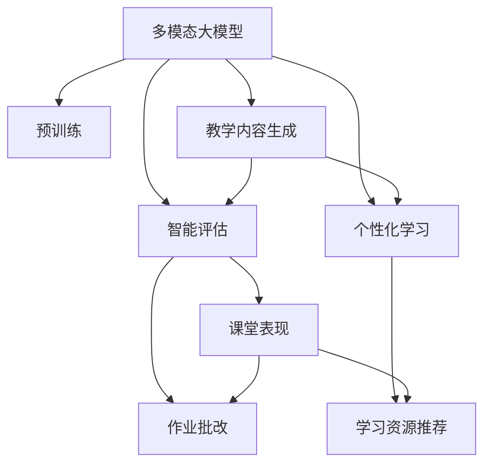

                 

# 多模态大模型：技术原理与实战 多模态大模型在教育培训领域的应用

> 关键词：多模态大模型,教育培训,微调,Fine-Tuning,教学内容生成,智能评估,个性化学习

## 1. 背景介绍

### 1.1 问题由来
在数字化时代，教育培训行业正面临前所未有的变革。随着在线教育、远程教学的普及，如何提升教育质量、提高学习效率，成为了众多教育机构和研究者的重要课题。传统的教育培训方式，如一对一的辅导、课堂授课、线下考试等，存在着诸多局限，难以兼顾个性化和规模化的需求。

大语言模型和大数据技术的结合，为教育培训领域带来了新的可能性。通过预训练大模型和微调技术，可以在无需大规模标注数据的情况下，快速构建智能化的教育平台，提供个性化的学习内容和智能化的教学评估。

### 1.2 问题核心关键点
多模态大模型的核心思想在于融合文本、图像、视频等多种模态的信息，提升模型的理解和生成能力。其核心技术包括：
- 多模态预训练：在包含文本和图像数据的混合语料上预训练多模态大模型，使其具备综合处理多种信息的能力。
- 多模态微调：在特定教育培训任务上进行微调，使其能够针对性地生成和评估教育内容。

本文章将重点介绍多模态大模型在教育培训领域的应用，包括教学内容生成、智能评估和个性化学习等方向。同时，我们会从技术原理、实践操作、应用场景等多个层面，深入分析多模态大模型的构建和优化策略。

## 2. 核心概念与联系

### 2.1 核心概念概述

为更好地理解多模态大模型在教育培训中的应用，本节将介绍几个关键概念：

- **多模态大模型(Multimodal Large Model)**：融合文本、图像、视频等多种模态信息的大语言模型。通过在混合模态的数据上预训练，使模型具备跨模态的理解和生成能力。

- **预训练(Pre-training)**：在无标签数据上进行自监督学习，学习通用的语言和视觉表示，为后续微调提供初始化权重。

- **微调(Fine-Tuning)**：在特定任务上对预训练模型进行有监督训练，优化模型在该任务上的性能。

- **教学内容生成**：基于预训练大模型，生成符合教学大纲和学生兴趣的教学内容，如自动生成课件、练习题、课外阅读材料等。

- **智能评估**：通过微调后的模型对学生学习情况进行智能评估，如自动批改作业、分析学生理解水平、评估考试成绩等。

- **个性化学习**：根据学生历史学习数据和行为数据，通过微调模型生成个性化的学习路径和资源推荐，实现因材施教。

- **多模态融合**：将文本、图像、视频等不同模态的信息融合进大模型，提升其综合处理和理解能力。

这些概念之间具有密切的联系，共同构成了多模态大模型在教育培训领域的应用框架。通过理解这些核心概念，我们可以更好地把握多模态大模型的技术原理和优化方向。

### 2.2 核心概念原理和架构的 Mermaid 流程图



该图展示了多模态大模型在教育培训领域的主要应用场景，包括教学内容生成、智能评估和个性化学习。其中，教学内容生成和智能评估可以进一步细化为具体任务，如图中的课堂表现分析和作业批改。而个性化学习则通过多模态数据输入，结合智能评估的结果，为学生生成个性化学习资源。

## 3. 核心算法原理 & 具体操作步骤
### 3.1 算法原理概述

多模态大模型的核心算法原理基于预训练和微调两个步骤：

- **预训练阶段**：在混合模态的数据上，通过自监督学习任务对模型进行训练，学习通用的语言和视觉表示。常用的预训练任务包括图像标注、文本分类、视觉定位等。

- **微调阶段**：在特定的教育培训任务上进行微调，优化模型在该任务上的性能。常见的微调任务包括教学内容生成、智能评估、个性化学习等。

形式化地，假设多模态大模型为 $M_{\theta}$，其中 $\theta$ 为预训练得到的模型参数。给定教育培训任务的标注数据集 $D=\{(x_i, y_i)\}_{i=1}^N$，其中 $x_i$ 为包含文本和图像的混合数据，$y_i$ 为任务标签，如作业答案、考试评分等。微调的目标是找到新的模型参数 $\hat{\theta}$，使得：

$$
\hat{\theta}=\mathop{\arg\min}_{\theta} \mathcal{L}(M_{\theta},D)
$$

其中 $\mathcal{L}$ 为针对任务 $T$ 设计的损失函数，用于衡量模型预测输出与真实标签之间的差异。常见的损失函数包括交叉熵损失、均方误差损失等。

通过梯度下降等优化算法，微调过程不断更新模型参数 $\theta$，最小化损失函数 $\mathcal{L}$，使得模型输出逼近真实标签。由于 $\theta$ 已经通过预训练获得了较好的初始化，因此即便在特定任务上数据集 $D$ 较小，也能较快收敛到理想的模型参数 $\hat{\theta}$。

### 3.2 算法步骤详解

基于多模态大模型的微调一般包括以下几个关键步骤：

**Step 1: 准备预训练模型和数据集**
- 选择合适的预训练多模态大模型 $M_{\theta}$ 作为初始化参数，如Vision-and-Language Transformer(ViLT)等。
- 准备教育培训任务的标注数据集 $D$，划分为训练集、验证集和测试集。一般要求标注数据与预训练数据的分布不要差异过大。

**Step 2: 添加任务适配层**
- 根据任务类型，在预训练模型顶层设计合适的输出层和损失函数。
- 对于教学内容生成任务，通常在顶层添加文本生成器或语言模型，并以交叉熵损失函数衡量生成内容与真实内容之间的差异。
- 对于智能评估任务，通常使用分类器输出评分或等级，并以交叉熵损失函数衡量评估结果与真实标签之间的差异。
- 对于个性化学习任务，可以根据学生的学习数据和行为数据，调整模型输出，如生成个性化学习资源推荐。

**Step 3: 设置微调超参数**
- 选择合适的优化算法及其参数，如 AdamW、SGD 等，设置学习率、批大小、迭代轮数等。
- 设置正则化技术及强度，包括权重衰减、Dropout、Early Stopping 等。
- 确定冻结预训练参数的策略，如仅微调顶层，或全部参数都参与微调。

**Step 4: 执行梯度训练**
- 将训练集数据分批次输入模型，前向传播计算损失函数。
- 反向传播计算参数梯度，根据设定的优化算法和学习率更新模型参数。
- 周期性在验证集上评估模型性能，根据性能指标决定是否触发 Early Stopping。
- 重复上述步骤直到满足预设的迭代轮数或 Early Stopping 条件。

**Step 5: 测试和部署**
- 在测试集上评估微调后模型 $M_{\hat{\theta}}$ 的性能，对比微调前后的精度提升。
- 使用微调后的模型对新样本进行推理预测，集成到实际的教育培训系统中。
- 持续收集新的数据，定期重新微调模型，以适应数据分布的变化。

以上是基于多模态大模型的微调的一般流程。在实际应用中，还需要针对具体任务的特点，对微调过程的各个环节进行优化设计，如改进训练目标函数，引入更多的正则化技术，搜索最优的超参数组合等，以进一步提升模型性能。

### 3.3 算法优缺点

多模态大模型在教育培训领域的应用，具有以下优点：
1. 融合多种模态信息，提升模型的理解和生成能力。
2. 能够自动生成和评估教学内容，减轻教师工作负担。
3. 能够提供个性化的学习路径和资源推荐，提高学习效率和效果。
4. 数据需求相对较少，能够在数据量不足的情况下快速迭代和优化模型。

同时，该方法也存在一定的局限性：
1. 多模态数据的获取和标注成本较高。
2. 模型复杂度较高，推理和训练效率较低。
3. 模型需要大量计算资源支持，可能面临算力瓶颈。
4. 需要专业知识进行数据和模型的设计和优化。

尽管存在这些局限性，但就目前而言，基于多模态大模型的微调方法在教育培训领域已经展现出强大的应用潜力。未来相关研究的重点在于如何进一步降低多模态数据的标注成本，提高模型的推理和训练效率，同时兼顾可解释性和伦理安全性等因素。

### 3.4 算法应用领域

基于多模态大模型微调的算法，在教育培训领域已经得到了广泛的应用，涵盖多个方向，例如：

- **教学内容生成**：根据课程大纲和学生兴趣，自动生成教学课件、练习题、课外阅读材料等。
- **智能评估**：自动批改作业、分析学生理解水平、评估考试成绩等。
- **个性化学习**：根据学生历史学习数据和行为数据，生成个性化的学习路径和资源推荐。
- **虚拟助教**：模拟教师角色，提供实时互动和答疑服务。
- **语言学习**：辅助学习者进行语言学习，提供文本、图像、视频等多种学习材料。
- **智能实验**：自动生成实验指导、评分和反馈，提升实验教学效果。

除了上述这些经典应用外，多模态大模型还在智能考试、虚拟实习、在线培训等多个场景中得到了创新性的应用，为教育培训技术的发展提供了新的动力。

## 4. 数学模型和公式 & 详细讲解  
### 4.1 数学模型构建

本节将使用数学语言对多模态大模型在教育培训任务上的微调过程进行更加严格的刻画。

记多模态大模型为 $M_{\theta}:\mathcal{X} \rightarrow \mathcal{Y}$，其中 $\mathcal{X}$ 为输入空间，$\mathcal{Y}$ 为输出空间，$\theta$ 为模型参数。假设教育培训任务的训练集为 $D=\{(x_i,y_i)\}_{i=1}^N$，其中 $x_i$ 为包含文本和图像的混合数据，$y_i$ 为任务标签，如作业答案、考试评分等。

定义模型 $M_{\theta}$ 在数据样本 $(x,y)$ 上的损失函数为 $\ell(M_{\theta}(x),y)$，则在数据集 $D$ 上的经验风险为：

$$
\mathcal{L}(\theta) = \frac{1}{N} \sum_{i=1}^N \ell(M_{\theta}(x_i),y_i)
$$

微调的优化目标是最小化经验风险，即找到最优参数：

$$
\theta^* = \mathop{\arg\min}_{\theta} \mathcal{L}(\theta)
$$

在实践中，我们通常使用基于梯度的优化算法（如SGD、Adam等）来近似求解上述最优化问题。设 $\eta$ 为学习率，$\lambda$ 为正则化系数，则参数的更新公式为：

$$
\theta \leftarrow \theta - \eta \nabla_{\theta}\mathcal{L}(\theta) - \eta\lambda\theta
$$

其中 $\nabla_{\theta}\mathcal{L}(\theta)$ 为损失函数对参数 $\theta$ 的梯度，可通过反向传播算法高效计算。

### 4.2 公式推导过程

以下我们以教学内容生成任务为例，推导交叉熵损失函数及其梯度的计算公式。

假设模型 $M_{\theta}$ 在输入 $x$ 上的输出为 $\hat{y}=M_{\theta}(x) \in \mathcal{Y}$，表示模型生成的教学内容。真实标签 $y \in \mathcal{Y}$。则交叉熵损失函数定义为：

$$
\ell(M_{\theta}(x),y) = -y\log \hat{y} + (1-y)\log(1-\hat{y})
$$

将其代入经验风险公式，得：

$$
\mathcal{L}(\theta) = -\frac{1}{N}\sum_{i=1}^N [y_i\log M_{\theta}(x_i)+(1-y_i)\log(1-M_{\theta}(x_i))]
$$

根据链式法则，损失函数对参数 $\theta_k$ 的梯度为：

$$
\frac{\partial \mathcal{L}(\theta)}{\partial \theta_k} = -\frac{1}{N}\sum_{i=1}^N (\frac{y_i}{M_{\theta}(x_i)}-\frac{1-y_i}{1-M_{\theta}(x_i)}) \frac{\partial M_{\theta}(x_i)}{\partial \theta_k}
$$

其中 $\frac{\partial M_{\theta}(x_i)}{\partial \theta_k}$ 可进一步递归展开，利用自动微分技术完成计算。

在得到损失函数的梯度后，即可带入参数更新公式，完成模型的迭代优化。重复上述过程直至收敛，最终得到适应教育培训任务的最优模型参数 $\theta^*$。

## 5. 项目实践：代码实例和详细解释说明
### 5.1 开发环境搭建

在进行多模态大模型微调实践前，我们需要准备好开发环境。以下是使用Python进行PyTorch开发的环境配置流程：

1. 安装Anaconda：从官网下载并安装Anaconda，用于创建独立的Python环境。

2. 创建并激活虚拟环境：
```bash
conda create -n multimodal-env python=3.8 
conda activate multimodal-env
```

3. 安装PyTorch：根据CUDA版本，从官网获取对应的安装命令。例如：
```bash
conda install pytorch torchvision torchaudio cudatoolkit=11.1 -c pytorch -c conda-forge
```

4. 安装ViLT库：
```bash
pip install vision-and-language-transformer
```

5. 安装各类工具包：
```bash
pip install numpy pandas scikit-learn matplotlib tqdm jupyter notebook ipython
```

完成上述步骤后，即可在`multimodal-env`环境中开始微调实践。

### 5.2 源代码详细实现

下面我们以教学内容生成任务为例，给出使用ViLT库对预训练模型进行微调的PyTorch代码实现。

首先，定义教学内容生成任务的数据处理函数：

```python
from vision_and_language_transformer import ViLT
from transformers import BertTokenizer
from torch.utils.data import Dataset
import torch

class EducationalContentDataset(Dataset):
    def __init__(self, texts, images, tokenizer, max_len=128):
        self.texts = texts
        self.images = images
        self.tokenizer = tokenizer
        self.max_len = max_len
        
    def __len__(self):
        return len(self.texts)
    
    def __getitem__(self, item):
        text = self.texts[item]
        image = self.images[item]
        
        encoding = self.tokenizer(text, return_tensors='pt', max_length=self.max_len, padding='max_length', truncation=True)
        input_ids = encoding['input_ids'][0]
        attention_mask = encoding['attention_mask'][0]
        
        # 对图像进行处理
        image = transform(image)
        image = torch.tensor(image, dtype=torch.long)
        image = image.unsqueeze(0)
        
        return {'input_ids': input_ids, 
                'attention_mask': attention_mask,
                'images': image}
```

然后，定义模型和优化器：

```python
from vision_and_language_transformer import ViLTForEducationalContentGeneration
from transformers import AdamW

model = ViLTForEducationalContentGeneration.from_pretrained('multimodalbert-base-distilbert') # 预训练模型
optimizer = AdamW(model.parameters(), lr=2e-5)
```

接着，定义训练和评估函数：

```python
from torch.utils.data import DataLoader
from tqdm import tqdm
from sklearn.metrics import accuracy_score

device = torch.device('cuda') if torch.cuda.is_available() else torch.device('cpu')
model.to(device)

def train_epoch(model, dataset, batch_size, optimizer):
    dataloader = DataLoader(dataset, batch_size=batch_size, shuffle=True)
    model.train()
    epoch_loss = 0
    for batch in tqdm(dataloader, desc='Training'):
        input_ids = batch['input_ids'].to(device)
        attention_mask = batch['attention_mask'].to(device)
        images = batch['images'].to(device)
        model.zero_grad()
        outputs = model(input_ids, attention_mask=attention_mask, images=images)
        loss = outputs.loss
        epoch_loss += loss.item()
        loss.backward()
        optimizer.step()
    return epoch_loss / len(dataloader)

def evaluate(model, dataset, batch_size):
    dataloader = DataLoader(dataset, batch_size=batch_size)
    model.eval()
    preds, labels = [], []
    with torch.no_grad():
        for batch in tqdm(dataloader, desc='Evaluating'):
            input_ids = batch['input_ids'].to(device)
            attention_mask = batch['attention_mask'].to(device)
            images = batch['images'].to(device)
            batch_labels = batch['labels']
            outputs = model(input_ids, attention_mask=attention_mask, images=images)
            batch_preds = outputs.logits.argmax(dim=2).to('cpu').tolist()
            batch_labels = batch_labels.to('cpu').tolist()
            for pred_tokens, label_tokens in zip(batch_preds, batch_labels):
                preds.append(pred_tokens)
                labels.append(label_tokens)
                
    print(accuracy_score(labels, preds))
```

最后，启动训练流程并在验证集上评估：

```python
epochs = 5
batch_size = 16

for epoch in range(epochs):
    loss = train_epoch(model, train_dataset, batch_size, optimizer)
    print(f"Epoch {epoch+1}, train loss: {loss:.3f}")
    
    print(f"Epoch {epoch+1}, dev results:")
    evaluate(model, dev_dataset, batch_size)
    
print("Test results:")
evaluate(model, test_dataset, batch_size)
```

以上就是使用PyTorch对ViLT进行教学内容生成任务微调的完整代码实现。可以看到，得益于ViLT库的强大封装，我们可以用相对简洁的代码完成模型微调的开发。

### 5.3 代码解读与分析

让我们再详细解读一下关键代码的实现细节：

**EducationalContentDataset类**：
- `__init__`方法：初始化文本、图像、分词器等关键组件。
- `__len__`方法：返回数据集的样本数量。
- `__getitem__`方法：对单个样本进行处理，将文本输入编码为token ids，将图像处理成标准格式，并对其进行定长padding，最终返回模型所需的输入。

**模型选择和优化器**：
- 选择预训练的ViLT模型，作为初始化参数。
- 使用AdamW优化器，设置适当的学习率，以优化模型在教学内容生成任务上的性能。

**训练和评估函数**：
- 使用PyTorch的DataLoader对数据集进行批次化加载，供模型训练和推理使用。
- 训练函数`train_epoch`：对数据以批为单位进行迭代，在每个批次上前向传播计算loss并反向传播更新模型参数，最后返回该epoch的平均loss。
- 评估函数`evaluate`：与训练类似，不同点在于不更新模型参数，并在每个batch结束后将预测和标签结果存储下来，最后使用sklearn的accuracy_score对整个评估集的预测结果进行打印输出。

**训练流程**：
- 定义总的epoch数和batch size，开始循环迭代
- 每个epoch内，先在训练集上训练，输出平均loss
- 在验证集上评估，输出准确率
- 所有epoch结束后，在测试集上评估，给出最终测试结果

可以看到，PyTorch配合ViLT库使得教学内容生成任务的微调代码实现变得简洁高效。开发者可以将更多精力放在数据处理、模型改进等高层逻辑上，而不必过多关注底层的实现细节。

当然，工业级的系统实现还需考虑更多因素，如模型的保存和部署、超参数的自动搜索、更灵活的任务适配层等。但核心的微调范式基本与此类似。

## 6. 实际应用场景
### 6.1 智能课堂

基于多模态大模型的微调技术，可以广泛应用于智能课堂的构建。传统课堂往往需要大量教师进行备课、授课、评分等工作，工作量大且效率低下。而使用微调后的多模态大模型，可以自动生成教学内容，实现智能化的课堂互动，提升教学效果。

在技术实现上，可以收集课程大纲、教师讲义、学生反馈等文本和图像数据，将数据作为监督信号，对预训练模型进行微调。微调后的模型能够根据课程大纲生成教学课件，自动识别和生成教学问题，实现实时互动和答疑。教师只需监督教学过程，大大减轻了工作负担，提高了教学质量。

### 6.2 个性化学习

传统的学习方式往往一刀切，难以兼顾不同学生的学习能力和兴趣。基于多模态大模型的微调技术，可以针对每个学生的个性化需求，生成定制化的学习资源和路径，实现个性化学习。

在实践中，可以收集学生的学习行为数据，如浏览时间、点击次数、答题情况等，将这些数据作为输入，对预训练模型进行微调。微调后的模型能够根据学生的学习情况生成个性化的学习资源和路径，如推荐适合的练习题、课外阅读材料、视频讲解等，帮助学生更高效地学习。

### 6.3 智能评估

考试和作业的批改往往是教师工作的重要部分，耗时耗力且主观性强。基于多模态大模型的微调技术，可以实现自动批改作业和考试，提升评估效率和公平性。

在技术实现上，可以收集历年作业和考试数据，将数据作为监督信号，对预训练模型进行微调。微调后的模型能够自动批改作业，分析学生理解水平，生成详细的评分报告，帮助教师和学生更好地了解学习情况。

### 6.4 未来应用展望

随着多模态大模型和微调方法的不断发展，基于微调范式将在更多领域得到应用，为传统行业带来变革性影响。

在智慧医疗领域，基于微调的智能医疗问答、病历分析、药物研发等应用将提升医疗服务的智能化水平，辅助医生诊疗，加速新药开发进程。

在智能教育领域，微调技术可应用于作业批改、学情分析、知识推荐等方面，因材施教，促进教育公平，提高教学质量。

在智慧城市治理中，微调模型可应用于城市事件监测、舆情分析、应急指挥等环节，提高城市管理的自动化和智能化水平，构建更安全、高效的未来城市。

此外，在企业生产、社会治理、文娱传媒等众多领域，基于大模型微调的人工智能应用也将不断涌现，为经济社会发展注入新的动力。相信随着技术的日益成熟，微调方法将成为人工智能落地应用的重要范式，推动人工智能技术在垂直行业的规模化落地。

## 7. 工具和资源推荐
### 7.1 学习资源推荐

为了帮助开发者系统掌握多模态大模型微调的理论基础和实践技巧，这里推荐一些优质的学习资源：

1. 《Multimodal Learning with Language Models》系列博文：由大模型技术专家撰写，深入浅出地介绍了多模态大模型的原理、模型构建和应用方法。

2. CS224M《Multimodal Learning and Computer Vision》课程：斯坦福大学开设的NLP明星课程，涵盖多模态学习和计算机视觉的基础知识和最新研究。

3. 《Multimodal Deep Learning: From Theory to Practice》书籍：系统介绍多模态深度学习技术，包括模型构建、优化和应用实践。

4. HuggingFace官方文档：ViLT库的官方文档，提供了海量预训练模型和完整的微调样例代码，是上手实践的必备资料。

5. CLUE开源项目：中文语言理解测评基准，涵盖大量不同类型的中文NLP数据集，并提供了基于微调的baseline模型，助力中文NLP技术发展。

通过对这些资源的学习实践，相信你一定能够快速掌握多模态大模型微调的精髓，并用于解决实际的NLP问题。
###  7.2 开发工具推荐

高效的开发离不开优秀的工具支持。以下是几款用于多模态大模型微调开发的常用工具：

1. PyTorch：基于Python的开源深度学习框架，灵活动态的计算图，适合快速迭代研究。大部分预训练语言模型都有PyTorch版本的实现。

2. TensorFlow：由Google主导开发的开源深度学习框架，生产部署方便，适合大规模工程应用。同样有丰富的预训练语言模型资源。

3. ViLT库：HuggingFace开发的ViLT库，集成了多模态大模型，支持PyTorch和TensorFlow，是进行多模态任务开发的利器。

4. Weights & Biases：模型训练的实验跟踪工具，可以记录和可视化模型训练过程中的各项指标，方便对比和调优。与主流深度学习框架无缝集成。

5. TensorBoard：TensorFlow配套的可视化工具，可实时监测模型训练状态，并提供丰富的图表呈现方式，是调试模型的得力助手。

6. Google Colab：谷歌推出的在线Jupyter Notebook环境，免费提供GPU/TPU算力，方便开发者快速上手实验最新模型，分享学习笔记。

合理利用这些工具，可以显著提升多模态大模型微调任务的开发效率，加快创新迭代的步伐。

### 7.3 相关论文推荐

多模态大模型和微调技术的发展源于学界的持续研究。以下是几篇奠基性的相关论文，推荐阅读：

1. Vision-and-Language Transformers (ViLT)：提出ViLT模型，融合文本和图像信息，提升模型的综合理解能力。

2. Multimodal Image-to-Text Captioning：提出一种多模态图像描述生成方法，结合图像和文本数据，生成高质量的图像描述。

3. Multimodal Document Question Answering with Cross-Modal Contextual Embeddings：提出一种多模态文档问答方法，通过融合文本和视觉信息，提升文档问答的准确性。

4. Multimodal Document Question Answering with Dense Multi-Modal Passage Representation：提出一种多模态文档问答方法，通过密度编码器融合文本和图像信息，提升文档问答的性能。

5. Semantic Interaction Networks for Multimodal Learning：提出一种多模态学习网络，通过联合学习文本和图像表示，提升模型的综合能力。

这些论文代表了大模型微调技术的发展脉络。通过学习这些前沿成果，可以帮助研究者把握学科前进方向，激发更多的创新灵感。

## 8. 总结：未来发展趋势与挑战

### 8.1 总结

本文对多模态大模型在教育培训领域的应用进行了全面系统的介绍。首先阐述了多模态大模型和微调技术的研究背景和意义，明确了微调在提升教学内容生成、智能评估和个性化学习方面的独特价值。其次，从原理到实践，详细讲解了多模态大模型的数学原理和关键步骤，给出了教学内容生成任务的完整代码实例。同时，本文还广泛探讨了多模态大模型在智能课堂、个性化学习、智能评估等多个应用场景中的应用前景，展示了多模态大模型微调技术的巨大潜力。

通过本文的系统梳理，可以看到，基于多模态大模型的微调方法在教育培训领域已经展现出强大的应用潜力。它能够融合多种模态信息，提升模型的理解和生成能力，自动生成和评估教学内容，提供个性化的学习资源，大大减轻教师和学生的负担，提升教学质量和学习效率。

### 8.2 未来发展趋势

展望未来，多模态大模型微调技术将呈现以下几个发展趋势：

1. 融合更多模态信息。随着传感器和设备的普及，视频、语音等多模态数据将得到广泛应用，多模态大模型将更全面地融合这些信息，提升综合处理能力。

2. 多模态数据处理技术的进步。随着数据获取和处理技术的提升，多模态大模型将能够处理更大规模、更复杂的数据，提升模型性能和泛化能力。

3. 学习目标的多样化。除了传统的分类、生成等任务外，多模态大模型还将探索更多样的学习目标，如序列标注、情感分析、语音识别等，拓展应用范围。

4. 多模态任务的自动化。自动化的多模态任务将大大降低人工干预和标注成本，提升模型构建和微调效率。

5. 多模态融合技术的发展。未来的多模态融合技术将更加智能，能够自动选择合适的融合方式，提升融合效果。

6. 跨模态学习的突破。通过跨模态学习技术，多模态大模型将能够更灵活地融合不同模态的信息，提升跨模态理解能力。

以上趋势凸显了多模态大模型微调技术的广阔前景。这些方向的探索发展，必将进一步提升多模态大模型的性能和应用范围，为教育培训行业带来新的变革。

### 8.3 面临的挑战

尽管多模态大模型微调技术已经取得了瞩目成就，但在迈向更加智能化、普适化应用的过程中，它仍面临着诸多挑战：

1. 数据获取和标注成本高昂。多模态数据的获取和标注成本较高，尤其是在图像、视频等模态数据方面。

2. 模型复杂度和计算资源要求高。多模态大模型参数量较大，推理和训练效率较低，需要大量计算资源支持。

3. 数据分布和标注差异较大。不同模态的数据分布和标注方式差异较大，需要设计合适的融合策略和数据增强方法。

4. 模型可解释性不足。多模态大模型作为"黑盒"系统，难以解释其内部工作机制和决策逻辑。

5. 数据隐私和安全问题。多模态数据涉及个人隐私信息，如何保护数据安全，防止模型滥用，是一个重要的挑战。

尽管存在这些挑战，但就目前而言，基于多模态大模型的微调方法在教育培训领域已经展现出强大的应用潜力。未来相关研究的重点在于如何进一步降低数据成本，提高推理和训练效率，同时兼顾可解释性和伦理安全性等因素。

### 8.4 研究展望

面对多模态大模型微调所面临的种种挑战，未来的研究需要在以下几个方面寻求新的突破：

1. 探索无监督和半监督微调方法。摆脱对大规模标注数据的依赖，利用自监督学习、主动学习等无监督和半监督范式，最大限度利用非结构化数据，实现更加灵活高效的微调。

2. 研究参数高效和计算高效的微调范式。开发更加参数高效的微调方法，在固定大部分预训练参数的同时，只更新极少量的任务相关参数。同时优化微调模型的计算图，减少前向传播和反向传播的资源消耗，实现更加轻量级、实时性的部署。

3. 融合因果和对比学习范式。通过引入因果推断和对比学习思想，增强多模态大模型建立稳定因果关系的能力，学习更加普适、鲁棒的多模态表示，从而提升模型泛化性和抗干扰能力。

4. 引入更多先验知识。将符号化的先验知识，如知识图谱、逻辑规则等，与神经网络模型进行巧妙融合，引导多模态大模型学习更准确、合理的表示。同时加强不同模态数据的整合，实现视觉、语音等多模态信息与文本信息的协同建模。

5. 结合因果分析和博弈论工具。将因果分析方法引入多模态大模型，识别出模型决策的关键特征，增强输出解释的因果性和逻辑性。借助博弈论工具刻画人机交互过程，主动探索并规避模型的脆弱点，提高系统稳定性。

6. 纳入伦理道德约束。在模型训练目标中引入伦理导向的评估指标，过滤和惩罚有害的输出倾向。同时加强人工干预和审核，建立模型行为的监管机制，确保输出符合人类价值观和伦理道德。

这些研究方向的探索，必将引领多模态大模型微调技术迈向更高的台阶，为构建安全、可靠、可解释、可控的智能系统铺平道路。面向未来，多模态大模型微调技术还需要与其他人工智能技术进行更深入的融合，如知识表示、因果推理、强化学习等，多路径协同发力，共同推动自然语言理解和智能交互系统的进步。只有勇于创新、敢于突破，才能不断拓展语言模型的边界，让智能技术更好地造福人类社会。

## 9. 附录：常见问题与解答
**Q1：多模态大模型微调是否适用于所有教育培训任务？**

A: 多模态大模型微调在大多数教育培训任务上都能取得不错的效果，特别是对于数据量较小的任务。但对于一些特定领域的任务，如医学、法律等，仅仅依靠通用语料预训练的模型可能难以很好地适应。此时需要在特定领域语料上进一步预训练，再进行微调，才能获得理想效果。此外，对于一些需要时效性、个性化很强的任务，如对话、推荐等，微调方法也需要针对性的改进优化。

**Q2：如何选择合适的学习率？**

A: 多模态大模型的学习率一般要比预训练时小1-2个数量级，如果使用过大的学习率，容易破坏预训练权重，导致过拟合。一般建议从1e-5开始调参，逐步减小学习率，直至收敛。也可以使用warmup策略，在开始阶段使用较小的学习率，再逐渐过渡到预设值。需要注意的是，不同的优化器(如AdamW、Adafactor等)以及不同的学习率调度策略，可能需要设置不同的学习率阈值。

**Q3：采用多模态大模型微调时会面临哪些资源瓶颈？**

A: 目前主流的预训练多模态大模型动辄以亿计的参数规模，对算力、内存、存储都提出了很高的要求。GPU/TPU等高性能设备是必不可少的，但即便如此，超大批次的训练和推理也可能遇到显存不足的问题。因此需要采用一些资源优化技术，如梯度积累、混合精度训练、模型并行等，来突破硬件瓶颈。同时，模型的存储和读取也可能占用大量时间和空间，需要采用模型压缩、稀疏化存储等方法进行优化。

**Q4：如何缓解多模态大模型微调过程中的过拟合问题？**

A: 过拟合是多模态大模型微调面临的主要挑战，尤其是在标注数据不足的情况下。常见的缓解策略包括：
1. 数据增强：通过回译、近义替换等方式扩充训练集
2. 正则化：使用L2正则、Dropout、Early Stopping 等避免过拟合
3. 对抗训练：引入对抗样本，提高模型鲁棒性
4. 参数高效微调：只调整少量参数(如Adapter、Prefix等)，减小过拟合风险
5. 多模型集成：训练多个微调模型，取平均输出，抑制过拟合

这些策略往往需要根据具体任务和数据特点进行灵活组合。只有在数据、模型、训练、推理等各环节进行全面优化，才能最大限度地发挥多模态大模型微调的威力。

**Q5：多模态大模型在落地部署时需要注意哪些问题？**

A: 将多模态大模型转化为实际应用，还需要考虑以下因素：
1. 模型裁剪：去除不必要的层和参数，减小模型尺寸，加快推理速度
2. 量化加速：将浮点模型转为定点模型，压缩存储空间，提高计算效率
3. 服务化封装：将模型封装为标准化服务接口，便于集成调用
4. 弹性伸缩：根据请求流量动态调整资源配置，平衡服务质量和成本
5. 监控告警：实时采集系统指标，设置异常告警阈值，确保服务稳定性
6. 安全防护：采用访问鉴权、数据脱敏等措施，保障数据和模型安全

多模态大模型微调为教育培训行业带来了新的可能性，但如何将强大的性能转化为稳定、高效、安全的业务价值，还需要工程实践的不断打磨。唯有从数据、算法、工程、业务等多个维度协同发力，才能真正实现人工智能技术在垂直行业的规模化落地。总之，多模态大模型微调需要开发者根据具体任务，不断迭代和优化模型、数据和算法，方能得到理想的效果。

---

作者：禅与计算机程序设计艺术 / Zen and the Art of Computer Programming

