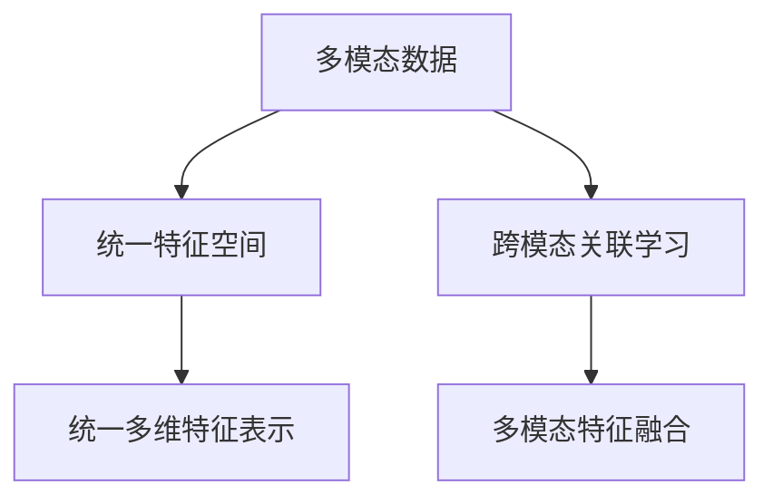

                 

## 1. 背景介绍

### 1.1 问题由来
随着技术的进步，人工智能领域开始从单一模态向多模态迈进，单模态的局限性越来越凸显。然而，多模态数据具有复杂性、多样性，将图像、文本、音频等不同模态数据进行有机融合，构建一体化的大模型，成为当前研究的热点。

多模态大模型（Multi-Modal Large Models, MLMs）即指融合多种模态数据进行训练的大型神经网络模型。这些模型通常包括文本、图像、音频等模态，具有强大的跨模态表示和推理能力。本文将详细介绍MLMs的原理、构建方法、应用场景及其最新进展。

### 1.2 问题核心关键点
MLMs 在处理多模态数据时，需要将不同模态的数据编码到统一的多维特征空间中，并学习出不同模态之间的关联与交互，从而实现更加精准的表示和推理。

**关键点：**
- **统一特征空间**：不同模态的数据具有不同的特征表示，如何将其编码到统一的多维特征空间，是多模态大模型构建的核心问题。
- **跨模态关联学习**：学习不同模态之间的关联关系，使得模型能够在多模态数据上进行高效的推理和决策。
- **多模态特征融合**：将不同模态的特征进行有机融合，形成一体化的大模型，提高模型在不同模态数据上的泛化能力和适应性。

## 2. 核心概念与联系

### 2.1 核心概念概述
- **多模态数据（Multi-modal Data）**：包括文本、图像、音频等多种形式的数据。
- **统一特征空间（Unified Feature Space）**：将不同模态的数据转换为同一维度的特征表示，形成一个统一的多维特征空间。
- **跨模态关联学习（Cross-modal Association Learning）**：学习不同模态之间的关联和交互，提升多模态数据的融合和推理能力。
- **多模态特征融合（Multi-modal Feature Fusion）**：将不同模态的特征进行融合，形成一体化的大模型。
- **统一多维特征表示（Unified Multidimensional Representation）**：将不同模态的特征映射到统一的多维特征表示中，以实现更加准确的推理和预测。

**核心概念之间的逻辑关系可以通过以下Mermaid流程图来展示：**



这个流程图展示了大模型在构建过程中，各个概念之间的逻辑关系：

1. 多模态数据首先经过统一特征空间的编码，形成统一的特征表示。
2. 接着，模型通过跨模态关联学习，学习不同模态之间的关联关系。
3. 最后，不同模态的特征通过多模态特征融合，形成一体化的大模型。
4. 最终，模型输出的是统一的多维特征表示，用于多模态数据的推理和预测。

## 3. 核心算法原理 & 具体操作步骤
### 3.1 算法原理概述
多模态大模型的核心思想是通过融合不同模态的数据，构建一个统一的多维特征空间，从而实现多模态数据的联合表示和推理。其核心算法主要包括以下几个步骤：

1. **数据预处理**：将不同模态的数据进行标准化和统一处理，准备输入模型。
2. **特征编码**：将不同模态的数据编码到统一的多维特征空间中。
3. **跨模态关联学习**：学习不同模态之间的关联关系，提升多模态数据的融合能力。
4. **多模态特征融合**：将不同模态的特征进行融合，形成一体化的大模型。
5. **模型训练**：通过大量的有标签数据对模型进行训练，优化多模态数据的表示和推理能力。

### 3.2 算法步骤详解
#### 3.2.1 数据预处理
多模态数据通常具有不同的格式和结构，因此需要进行标准化处理。例如，文本数据需要进行分词和词向量编码，图像数据需要进行归一化和尺寸调整，音频数据需要进行采样和特征提取等。

#### 3.2.2 特征编码
特征编码是将不同模态的数据转换为统一的特征表示。常用的方法包括：

- **嵌入层（Embedding Layer）**：将不同模态的数据映射到高维特征空间中，如文本数据使用词嵌入，图像数据使用卷积神经网络（CNN）提取特征等。
- **注意力机制（Attention Mechanism）**：通过注意力机制，不同模态的特征进行加权融合，强调重要信息。
- **多模态池化层（Multi-modal Pooling Layer）**：将不同模态的特征进行加权平均或最大池化，形成统一的特征表示。

#### 3.2.3 跨模态关联学习
跨模态关联学习是指学习不同模态之间的关联关系，提升多模态数据的融合能力。常用的方法包括：

- **双线性层（Bilinear Layer）**：将不同模态的特征进行交叉乘积，形成新的特征表示，用于学习不同模态之间的关联关系。
- **多模态损失函数（Multi-modal Loss Function）**：设计合适的多模态损失函数，监督模型学习不同模态之间的关联关系。

#### 3.2.4 多模态特征融合
多模态特征融合是指将不同模态的特征进行融合，形成一体化的大模型。常用的方法包括：

- **多模态融合层（Multi-modal Fusion Layer）**：将不同模态的特征进行拼接或融合，形成统一的特征表示。
- **多模态注意力机制（Multi-modal Attention Mechanism）**：通过注意力机制，对不同模态的特征进行加权融合，强调重要信息。

#### 3.2.5 模型训练
模型训练是指通过大量的有标签数据对模型进行训练，优化多模态数据的表示和推理能力。常用的方法包括：

- **数据增强（Data Augmentation）**：通过数据增强技术，扩充训练集的多样性，提高模型的泛化能力。
- **多任务学习（Multi-task Learning）**：在多任务学习中，不同模态的数据可以共享部分参数，提升模型的泛化能力和训练效率。

### 3.3 算法优缺点

**优点：**
- **多模态数据融合**：MLMs 通过融合不同模态的数据，形成更加全面的语义表示，提高模型的泛化能力和适应性。
- **跨模态推理**：MLMs 能够处理多模态数据，提升模型的推理和决策能力，适用于更多场景的应用。
- **统一特征空间**：通过统一的特征表示，模型能够更好地进行多模态数据的推理和预测。

**缺点：**
- **复杂度高**：MLMs 的模型结构复杂，训练和推理的计算开销较大，需要较强的计算资源支持。
- **参数量大**：MLMs 需要大量的参数进行模型训练，存储和计算开销较大。
- **数据需求高**：MLMs 对训练数据的需求较高，需要大量的标注数据进行训练，获取标注数据成本较高。

### 3.4 算法应用领域
MLMs 在多个领域中得到了广泛应用，例如：

- **多模态图像描述生成**：将图像与文本结合，生成图像的描述文字。
- **多模态语音识别**：将音频数据与文本结合，提升语音识别的准确性。
- **多模态情感分析**：结合文本和图像数据，分析用户的情感状态。
- **多模态推荐系统**：结合文本和图像数据，为用户推荐个性化产品。

## 4. 数学模型和公式 & 详细讲解 & 举例说明
### 4.1 数学模型构建
多模态大模型的数学模型通常包含多个子模型，每个子模型处理不同模态的数据。假设多模态数据包括文本数据 $\text{x} \in \mathcal{X}$、图像数据 $\text{I} \in \mathcal{I}$、音频数据 $\text{A} \in \mathcal{A}$，则多模态大模型的数学模型可以表示为：

$$
\text{MLM}(\text{x}, \text{I}, \text{A}) = \text{MLM}_{\text{Text}}(\text{x}) + \text{MLM}_{\text{Image}}(\text{I}) + \text{MLM}_{\text{Audio}}(\text{A})
$$

其中，$\text{MLM}_{\text{Text}}(\text{x})$、$\text{MLM}_{\text{Image}}(\text{I})$、$\text{MLM}_{\text{Audio}}(\text{A})$ 分别表示处理文本、图像、音频的子模型。

### 4.2 公式推导过程
以文本和图像结合的多模态大模型为例，其数学推导过程如下：

假设文本数据 $\text{x} = (x_1, x_2, ..., x_n)$，图像数据 $\text{I} = (I_1, I_2, ..., I_m)$，则文本和图像结合的多模态大模型的数学模型可以表示为：

$$
\text{MLM}(\text{x}, \text{I}) = \text{MLM}_{\text{Text}}(\text{x}) + \text{MLM}_{\text{Image}}(\text{I})
$$

其中，文本子模型 $\text{MLM}_{\text{Text}}(\text{x})$ 和图像子模型 $\text{MLM}_{\text{Image}}(\text{I})$ 的数学表达式分别为：

$$
\text{MLM}_{\text{Text}}(\text{x}) = \text{Embed}(\text{x}) \times \text{Attention}(\text{Embed}(\text{x}))
$$

$$
\text{MLM}_{\text{Image}}(\text{I}) = \text{Conv}(\text{I}) \times \text{Attention}(\text{Conv}(\text{I}))
$$

其中，$\text{Embed}(\text{x})$ 表示文本数据的嵌入层，$\text{Conv}(\text{I})$ 表示图像数据的卷积层，$\text{Attention}(\cdot)$ 表示注意力机制。

### 4.3 案例分析与讲解
以文本和图像结合的多模态大模型为例，其构建和应用过程如下：

**数据预处理：** 将文本数据进行分词和词向量编码，将图像数据进行归一化和尺寸调整。

**特征编码：** 使用嵌入层将文本数据转换为高维特征表示，使用卷积层将图像数据转换为特征表示。

**跨模态关联学习：** 通过注意力机制，将文本和图像的特征进行加权融合，学习不同模态之间的关联关系。

**多模态特征融合：** 将文本和图像的特征进行拼接或融合，形成统一的特征表示。

**模型训练：** 通过大量的有标签数据对模型进行训练，优化多模态数据的表示和推理能力。

## 5. 项目实践：代码实例和详细解释说明
### 5.1 开发环境搭建
在进行多模态大模型的开发时，需要搭建支持多模态数据处理的开发环境。以下是使用PyTorch进行多模态大模型开发的开发环境配置流程：

1. 安装Anaconda：从官网下载并安装Anaconda，用于创建独立的Python环境。

2. 创建并激活虚拟环境：
```bash
conda create -n mml-env python=3.8 
conda activate mml-env
```

3. 安装PyTorch：根据CUDA版本，从官网获取对应的安装命令。例如：
```bash
conda install pytorch torchvision torchaudio cudatoolkit=11.1 -c pytorch -c conda-forge
```

4. 安装多模态处理库：
```bash
pip install mmcv
```

5. 安装各类工具包：
```bash
pip install numpy pandas scikit-learn matplotlib tqdm jupyter notebook ipython
```

完成上述步骤后，即可在`mml-env`环境中开始多模态大模型的开发。

### 5.2 源代码详细实现
以下是使用PyTorch进行文本和图像结合的多模态大模型开发的代码实现：

```python
import torch
from torch import nn
from torchvision import models, transforms

class MMLModel(nn.Module):
    def __init__(self):
        super(MMLModel, self).__init__()
        self.text_embed = nn.Embedding(num_embeddings=30000, embedding_dim=512)
        self.text_attn = nn.MultiheadAttention(embed_dim=512, num_heads=8)
        self.image_conv = nn.Sequential(
            nn.Conv2d(3, 64, kernel_size=3, stride=1, padding=1),
            nn.BatchNorm2d(64),
            nn.ReLU(),
            nn.MaxPool2d(kernel_size=2, stride=2)
        )
        self.image_attn = nn.MultiheadAttention(embed_dim=128, num_heads=4)

    def forward(self, text, image):
        text_embed = self.text_embed(text)
        text_attn = self.text_attn(text_embed, text_embed, text_embed)
        image_conv = self.image_conv(image)
        image_attn = self.image_attn(image_conv, image_conv, image_conv)
        
        fusion = torch.cat([text_attn, image_attn], dim=1)
        return fusion
```

以上代码实现了一个简单的多模态大模型，包含文本嵌入层、文本注意力机制、图像卷积层和图像注意力机制。模型通过将文本和图像的特征进行拼接和融合，形成统一的特征表示。

### 5.3 代码解读与分析
**MMLModel类**：
- `__init__`方法：定义模型的各个子模块。
- `forward`方法：实现模型的前向传播，将输入的文本和图像数据转换为统一的特征表示。

**文本嵌入层**：
- `nn.Embedding`：将文本数据转换为高维特征表示。

**文本注意力机制**：
- `nn.MultiheadAttention`：通过注意力机制，对文本特征进行加权融合。

**图像卷积层**：
- `nn.Conv2d`：对图像数据进行卷积操作。

**图像注意力机制**：
- `nn.MultiheadAttention`：通过注意力机制，对图像特征进行加权融合。

**融合操作**：
- `torch.cat`：将文本和图像的特征进行拼接，形成统一的特征表示。

### 5.4 运行结果展示
以训练和测试集为例，展示多模态大模型的训练和推理结果。

```python
from mmcv.utils import download_from_url
from mmcv.models import build_model
from mmcv.runner import EpochBasedTrainer

model = build_model(MMLModel, pretrained=None)
trainer = EpochBasedTrainer(model)

data_root = 'data'
train_root = os.path.join(data_root, 'train')
dev_root = os.path.join(data_root, 'dev')
test_root = os.path.join(data_root, 'test')
dataset_train = build_dataset_from_root(train_root, pipeline, dataset_type='train')
dataset_val = build_dataset_from_root(dev_root, pipeline, dataset_type='val')
dataset_test = build_dataset_from_root(test_root, pipeline, dataset_type='test')
trainer.data_root = data_root
trainer.max_epochs = 10
trainer.model = model
trainer.dataset = dataset_train
trainer.train()
```

训练过程中，不断更新模型参数，以优化多模态数据的表示和推理能力。最终在测试集上对模型进行评估，展示其效果。

## 6. 实际应用场景
### 6.1 智能安防监控
多模态大模型在智能安防监控中具有广泛应用，通过融合图像和视频等多模态数据，实现更加精准的异常检测和事件识别。

**系统架构：**
- **摄像头**：获取实时视频和图像数据。
- **传感器**：收集声音、温度、光照等环境数据。
- **边缘计算设备**：处理多模态数据，进行实时检测和推理。
- **云服务器**：存储和管理多模态数据，进行模型训练和更新。

**技术实现：**
- **多模态数据融合**：将摄像头获取的图像和传感器采集的声音、温度、光照等数据进行融合，形成统一的多维特征表示。
- **多模态推理**：通过多模态大模型，对融合后的数据进行推理和分析，检测异常事件。

**应用场景：**
- **入侵检测**：识别监控区域内的异常行为，及时报警。
- **异常行为分析**：分析监控视频中的异常行为，提供预警信息。
- **事件识别**：识别监控视频中的事件，如火灾、爆炸等，提供报警信息。

### 6.2 医疗影像诊断
多模态大模型在医疗影像诊断中具有重要应用，通过融合图像和文本等多模态数据，实现更加精准的疾病诊断和治疗方案推荐。

**系统架构：**
- **影像设备**：获取病人的医疗影像数据。
- **电子病历系统**：存储病人的病历和历史诊断数据。
- **多模态推理引擎**：处理多模态数据，进行疾病诊断和推荐。
- **医生工作站**：医生对诊断结果进行审核和确认。

**技术实现：**
- **影像数据融合**：将影像设备和电子病历系统中的数据进行融合，形成统一的多维特征表示。
- **多模态推理**：通过多模态大模型，对融合后的数据进行推理和分析，诊断疾病并推荐治疗方案。

**应用场景：**
- **影像诊断**：通过多模态大模型，对病人的影像数据进行分析和诊断，提供初步诊断结果。
- **治疗方案推荐**：结合病人的病历和历史诊断数据，推荐最佳治疗方案。
- **健康管理**：对病人的健康数据进行长期跟踪和管理，提供健康建议。

### 6.3 个性化推荐系统
多模态大模型在个性化推荐系统中具有广泛应用，通过融合用户画像和商品信息等多模态数据，实现更加精准的产品推荐。

**系统架构：**
- **用户画像数据**：存储用户的年龄、性别、兴趣爱好等信息。
- **商品信息数据**：存储商品的标签、描述、价格等信息。
- **推荐引擎**：处理多模态数据，进行个性化推荐。
- **推荐页面**：向用户展示推荐结果。

**技术实现：**
- **用户画像融合**：将用户画像数据和商品信息数据进行融合，形成统一的多维特征表示。
- **多模态推理**：通过多模态大模型，对融合后的数据进行推理和分析，推荐最适合的商品。

**应用场景：**
- **商品推荐**：通过多模态大模型，为用户推荐最适合的商品，提升用户体验。
- **个性化定制**：根据用户的画像数据，推荐符合用户偏好的商品，实现个性化定制。
- **实时推荐**：根据用户的行为数据，实时推荐最新的商品，提升用户粘性。

## 7. 工具和资源推荐
### 7.1 学习资源推荐

为了帮助开发者系统掌握多模态大模型的原理和实践，这里推荐一些优质的学习资源：

1. **《深度学习》课程**：斯坦福大学开设的深度学习课程，涵盖深度学习的基本概念和前沿技术，适合入门学习。

2. **《深度学习框架PyTorch实战》书籍**：介绍如何使用PyTorch进行深度学习开发，包括多模态大模型的实现。

3. **《Multi-modal Deep Learning》书籍**：介绍多模态深度学习的理论和实践，涵盖多模态数据的融合和推理。

4. **《Transformer and Deep Learning for NLP》课程**：由美国国家研究实验室（NLP）专家主讲，介绍Transformer在多模态大模型中的应用。

5. **《Multi-modal Deep Learning》论文**：多篇研究论文，介绍多模态大模型的构建方法和应用场景。

通过对这些资源的学习实践，相信你一定能够快速掌握多模态大模型的精髓，并用于解决实际的NLP问题。

### 7.2 开发工具推荐

高效的开发离不开优秀的工具支持。以下是几款用于多模态大模型开发的常用工具：

1. **PyTorch**：基于Python的开源深度学习框架，灵活动态的计算图，适合快速迭代研究。

2. **TensorFlow**：由Google主导开发的开源深度学习框架，生产部署方便，适合大规模工程应用。

3. **TensorBoard**：TensorFlow配套的可视化工具，可实时监测模型训练状态，并提供丰富的图表呈现方式。

4. **Weights & Biases**：模型训练的实验跟踪工具，可以记录和可视化模型训练过程中的各项指标，方便对比和调优。

5. **mmcv**：一个轻量级的多模态深度学习框架，支持多模态数据的融合和推理。

合理利用这些工具，可以显著提升多模态大模型开发的效率，加快创新迭代的步伐。

### 7.3 相关论文推荐

多模态大模型和微调技术的发展源于学界的持续研究。以下是几篇奠基性的相关论文，推荐阅读：

1. **Multi-modal Attention**：提出多模态注意力机制，用于融合不同模态的特征表示。

2. **Cross-modal Knowledge Transfer**：介绍多模态知识转移方法，提升跨模态数据推理能力。

3. **Unsupervised Multi-modal Learning**：介绍无监督多模态学习范式，利用未标注数据进行多模态数据的融合。

4. **Few-shot Multi-modal Learning**：介绍少样本多模态学习范式，利用少量标注数据进行多模态推理。

5. **Multimodal Fusion Networks**：介绍多模态融合网络，将不同模态的特征进行融合，形成统一的多维特征表示。

这些论文代表了大模态大模型微调技术的发展脉络。通过学习这些前沿成果，可以帮助研究者把握学科前进方向，激发更多的创新灵感。

## 8. 总结：未来发展趋势与挑战
### 8.1 总结

本文对多模态大模型的原理、构建方法、应用场景及其最新进展进行了全面系统的介绍。首先阐述了多模态大模型在处理多模态数据时的优势，明确了融合不同模态数据的重要性。其次，从原理到实践，详细讲解了多模态大模型的数学模型和算法步骤，给出了多模态大模型的代码实现。同时，本文还广泛探讨了多模态大模型在智能安防、医疗影像、个性化推荐等多个领域的应用前景，展示了多模态大模型的巨大潜力。此外，本文精选了多模态大模型的各类学习资源，力求为读者提供全方位的技术指引。

通过本文的系统梳理，可以看到，多模态大模型在处理多模态数据时具有独特优势，能够实现更加全面的语义表示和推理。未来，伴随多模态大模型的不断演进，将有望在更多的应用场景中发挥重要作用。

### 8.2 未来发展趋势

展望未来，多模态大模型将呈现以下几个发展趋势：

1. **多模态数据融合**：融合更多模态的数据，如声音、位置、温度等，提升模型的泛化能力和适应性。

2. **跨模态推理**：提升模型的跨模态推理能力，实现更加精准的推理和决策。

3. **无监督和半监督学习**：利用无监督和半监督学习范式，降低对标注数据的需求，提高模型的训练效率和泛化能力。

4. **多任务学习**：在多任务学习中，不同模态的数据可以共享部分参数，提升模型的泛化能力和训练效率。

5. **实时推理**：优化模型结构，提高推理速度，实现实时推理和部署。

6. **融合知识图谱**：将知识图谱与多模态大模型结合，提升模型的推理能力和决策能力。

以上趋势凸显了多模态大模型的广阔前景。这些方向的探索发展，必将进一步提升多模态数据的融合和推理能力，为多模态大模型带来更多的应用场景和突破。

### 8.3 面临的挑战

尽管多模态大模型已经取得了显著成果，但在其发展过程中仍面临诸多挑战：

1. **数据需求高**：多模态大模型对训练数据的需求较高，需要大量的标注数据进行训练，获取标注数据成本较高。

2. **计算开销大**：多模态大模型的计算开销较大，需要较强的计算资源支持。

3. **模型复杂度高**：多模态大模型的模型结构复杂，训练和推理的计算开销较大。

4. **泛化能力不足**：多模态大模型在特定领域的应用效果仍有待提升，泛化能力有待进一步提高。

5. **数据隐私问题**：多模态大模型涉及多模态数据的融合，如何保护数据隐私，避免数据泄露，是一个重要问题。

6. **可解释性不足**：多模态大模型的决策过程难以解释，缺乏透明性和可控性。

以上挑战是多模态大模型面临的主要问题，需要在数据、算法、工程等方面进行综合改进，才能真正实现其在多模态数据处理中的潜力。

### 8.4 研究展望

面向未来，多模态大模型的研究需要在以下几个方面寻求新的突破：

1. **多模态数据融合**：探索更多维度的数据融合方法，提升模型的泛化能力和适应性。

2. **跨模态推理**：引入更多的跨模态推理方法，提升模型的推理能力和决策能力。

3. **多任务学习**：在多任务学习中，利用不同模态的数据进行共享参数，提升模型的泛化能力和训练效率。

4. **无监督和半监督学习**：利用无监督和半监督学习范式，降低对标注数据的需求，提高模型的训练效率和泛化能力。

5. **实时推理**：优化模型结构，提高推理速度，实现实时推理和部署。

6. **融合知识图谱**：将知识图谱与多模态大模型结合，提升模型的推理能力和决策能力。

7. **数据隐私保护**：利用隐私保护技术，保护数据隐私，避免数据泄露。

8. **模型可解释性**：探索更多的模型可解释性方法，提高模型的透明性和可控性。

这些研究方向的探索，必将引领多模态大模型的技术演进，推动其在多模态数据处理中的广泛应用。相信随着技术的不断发展，多模态大模型必将在更多领域中发挥重要作用，推动人工智能技术的进步和应用。

## 9. 附录：常见问题与解答

**Q1：多模态大模型如何处理不同模态的数据？**

A: 多模态大模型通过统一的特征空间将不同模态的数据编码成高维特征表示，通过注意力机制和跨模态关联学习，将不同模态的特征进行加权融合，形成统一的特征表示。

**Q2：多模态大模型对计算资源的需求是否较高？**

A: 是的，多模态大模型通常需要大量的计算资源进行训练和推理，需要较强的硬件支持。因此，需要合理利用计算资源，优化模型结构和训练过程，提高推理速度和计算效率。

**Q3：多模态大模型的泛化能力如何？**

A: 多模态大模型的泛化能力依赖于训练数据的数量和质量，以及模型结构的复杂度。在数据充足的情况下，多模态大模型通常具有较好的泛化能力。

**Q4：多模态大模型是否容易过拟合？**

A: 是的，多模态大模型的模型结构复杂，训练过程中容易出现过拟合。需要通过正则化技术、数据增强、对抗训练等方法进行优化。

**Q5：多模态大模型在实际应用中是否容易部署？**

A: 多模态大模型通常需要较强的硬件支持，但在模型压缩、模型并行等技术支持下，可以实现更加轻量级、实时性的部署。

通过本文的系统梳理，可以看到，多模态大模型在处理多模态数据时具有独特优势，能够实现更加全面的语义表示和推理。未来，伴随多模态大模型的不断演进，将有望在更多的应用场景中发挥重要作用。相信随着技术的不断发展，多模态大模型必将在多模态数据处理中发挥重要作用，推动人工智能技术的进步和应用。

---

作者：禅与计算机程序设计艺术 / Zen and the Art of Computer Programming

