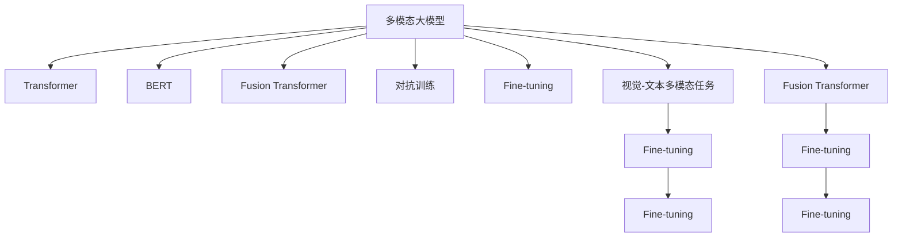

                 

# 多模态大模型：整合视觉与文本信息的前沿科技

> 关键词：多模态大模型,视觉与文本融合,自监督学习,Transformer,BERT,Fusion Transformer,图像-文本多模态任务

## 1. 背景介绍

随着深度学习技术的飞速发展，单一模态的大模型已经无法满足日益增长的应用需求。多模态大模型（Multimodal Large Models）通过融合视觉、文本、语音等多种信息，显著提升了模型的泛化能力和应用范围，成为当前NLP和计算机视觉领域的前沿技术。

### 1.1 问题由来
在自然语言处理（NLP）和计算机视觉（CV）领域，传统的单一模态模型往往难以捕捉到跨模态的信息，限制了其在许多实际场景中的应用。比如，文本描述与图像的匹配、视频与文本的同步标注等，都要求模型具备跨模态的理解能力。

为解决这一问题，研究者们提出了多模态大模型，旨在通过联合训练的方式，学习不同模态数据之间的关联，从而提高跨模态的理解和生成能力。具体来说，多模态大模型通常包含视觉、文本、语音等多种模态的信息，通过联合训练学习多模态之间的语义和结构关系，从而实现更强的跨模态推理和生成能力。

### 1.2 问题核心关键点
多模态大模型的核心在于如何实现不同模态数据之间的有效融合。其关键点包括以下几个方面：
1. 选择合适的模型架构：比如Transformer、BERT等。
2. 确定融合策略：比如时序融合、空间融合、注意力机制等。
3. 设计任务目标：比如图像-文本匹配、视频字幕生成等。
4. 优化训练方法：比如联合训练、半监督学习、对抗训练等。

本文将围绕以上关键点，系统介绍多模态大模型的原理与实践，并给出详细代码实现与实例分析，帮助读者深入理解这一前沿技术。

## 2. 核心概念与联系

### 2.1 核心概念概述

为更好地理解多模态大模型，本节将介绍几个密切相关的核心概念：

- **多模态大模型（Multimodal Large Models）**：包含视觉、文本、语音等多种模态信息的大模型。通过联合训练，学习不同模态数据之间的关联，从而提升跨模态的理解和生成能力。

- **Transformer**：一种常用的深度学习模型，通过自注意力机制实现序列数据的高效处理，已在多种模态大模型中广泛应用。

- **BERT**：一种预训练语言模型，通过大规模无标签文本数据进行预训练，具备强大的语言表示能力，广泛用于文本分类、命名实体识别等任务。

- **Fusion Transformer**：一种专门用于处理多模态数据的Transformer变体，通过设计特定的多头注意力机制，实现多模态数据的联合表示。

- **视觉-文本多模态任务（Visual-Textual Multimodal Tasks）**：如图像描述生成、图像-文本匹配、视频字幕生成等，是当前多模态大模型的主要应用方向。

- **对抗训练（Adversarial Training）**：一种通过引入对抗样本进行模型鲁棒性训练的方法，广泛应用于多模态大模型的训练中。

- **Fine-tuning**：在大模型上进行微调，使其适应特定任务，常用的方法有自监督学习、半监督学习、迁移学习等。

这些核心概念之间的逻辑关系可以通过以下Mermaid流程图来展示：



这个流程图展示了大模型在多模态融合、鲁棒性增强、任务适配等方面的关键步骤和过程。

## 3. 核心算法原理 & 具体操作步骤
### 3.1 算法原理概述

多模态大模型的核心思想是联合训练不同模态的数据，学习它们之间的关联。这可以通过设计特定的多头注意力机制来实现，使得模型能够同时关注视觉、文本、语音等多种信息，并进行跨模态的推理和生成。

具体来说，多模态大模型包含以下三个核心步骤：
1. 数据预处理：将不同模态的数据转化为模型可以处理的格式。
2. 模型融合：设计多模态融合机制，将不同模态的数据进行联合表示。
3. 训练优化：通过联合训练方法，优化模型的参数，使其能够高效地进行跨模态推理和生成。

### 3.2 算法步骤详解

以下是多模态大模型的详细算法步骤：

**Step 1: 数据预处理**

多模态数据通常包含视觉、文本、语音等多种信息。为了便于模型处理，需要将不同模态的数据转化为统一的格式。具体来说，可以通过以下方式进行数据预处理：

- **图像数据预处理**：将图像数据转化为像素值矩阵，并进行归一化、裁剪、缩放等操作，以便于模型处理。
- **文本数据预处理**：将文本数据转化为词向量序列，可以通过BERT等预训练模型进行文本嵌入。
- **语音数据预处理**：将语音数据转化为MFCC（Mel Frequency Cepstral Coefficients）特征，并进行归一化、截断等操作。

**Step 2: 模型融合**

模型融合是实现不同模态数据联合表示的关键步骤。目前常用的模型融合方式包括时序融合和空间融合两种。

- **时序融合（Temporal Fusion）**：将不同模态的数据按时间序列排列，通过多头注意力机制进行融合。例如，对于图像-文本多模态任务，可以按时间顺序排列图像帧和文本描述，然后通过多头注意力机制进行融合。
- **空间融合（Spatial Fusion）**：将不同模态的数据按空间位置排列，通过多头注意力机制进行融合。例如，对于视频字幕生成任务，可以将图像帧和字幕文本按空间位置排列，然后通过多头注意力机制进行融合。

在Fusion Transformer中，通过设计特定的多头注意力机制，实现了不同模态数据的联合表示。Fusion Transformer中多头注意力的定义如下：

$$
H = \text{Softmax}(\frac{QK^T}{\sqrt{d_k}})V
$$

其中，$Q$、$K$、$V$分别表示查询、键、值矩阵，$d_k$为键向量的维度。通过这种方式，模型能够同时关注不同模态的数据，并进行跨模态的推理和生成。

**Step 3: 训练优化**

多模态大模型的训练优化主要包括以下几个方面：

- **联合训练**：通过联合训练方法，优化模型的参数，使得模型能够高效地进行跨模态推理和生成。例如，对于图像-文本多模态任务，可以同时优化图像和文本的数据，使得模型能够同时关注图像和文本信息。
- **自监督学习**：通过自监督学习任务，学习不同模态数据之间的关联。例如，在图像-文本多模态任务中，可以使用基于对比学习的自监督学习任务，学习图像和文本之间的语义关系。
- **对抗训练**：通过对抗训练方法，增强模型的鲁棒性。例如，在图像-文本多模态任务中，可以使用对抗样本进行训练，使得模型能够更好地抵抗对抗攻击。

### 3.3 算法优缺点

多模态大模型具有以下优点：
1. 跨模态理解能力更强：能够同时关注多种模态的信息，提升跨模态推理和生成的能力。
2. 鲁棒性更高：通过对抗训练等方法，增强模型的鲁棒性，提高模型在实际应用中的稳定性。
3. 泛化能力更强：通过联合训练等方法，学习不同模态数据之间的关联，提升模型的泛化能力。

同时，多模态大模型也存在一定的局限性：
1. 数据量要求较高：需要大量的多模态数据进行训练，才能获得较好的效果。
2. 模型复杂度较高：需要设计多模态融合机制，且模型的参数量较大，计算资源消耗较多。
3. 训练难度较大：需要处理不同模态的数据，且需要设计联合训练策略，训练难度较大。

尽管存在这些局限性，但多模态大模型在许多实际应用场景中已经取得了显著的效果，展示了其强大的跨模态推理和生成能力。

### 3.4 算法应用领域

多模态大模型已经在多个领域得到了应用，例如：

- 图像描述生成：通过联合训练视觉和文本信息，生成对图像的描述。
- 图像-文本匹配：通过联合训练视觉和文本信息，判断图像和文本是否匹配。
- 视频字幕生成：通过联合训练视觉、文本、语音信息，生成视频字幕。
- 医学影像分析：通过联合训练视觉和文本信息，进行医学影像的分析诊断。
- 语音识别：通过联合训练视觉、文本、语音信息，提高语音识别的准确度。
- 虚拟现实：通过联合训练视觉、文本、语音信息，提升虚拟现实的沉浸感和互动性。

除了以上这些经典应用外，多模态大模型还被创新性地应用于更多场景中，如智能家居、自动驾驶、智慧城市等，为多个领域带来变革性影响。

## 4. 数学模型和公式 & 详细讲解  
### 4.1 数学模型构建

本节将使用数学语言对多模态大模型的训练过程进行更加严格的刻画。

假设多模态数据集包含$N$个样本，每个样本包含$M$种模态的信息。设图像数据为$I$，文本数据为$T$，语音数据为$S$，且$M=3$。模型参数为$\theta$，包括视觉、文本、语音等不同模态的信息。

定义模型$M_{\theta}$在输入$x$上的输出为$y$，其中$x \in \mathcal{X}$，$\mathcal{X}$为多模态数据的输入空间。模型$M_{\theta}$在图像、文本、语音三种模态下的输出分别为$y_I$、$y_T$、$y_S$。则多模态大模型的联合损失函数为：

$$
\mathcal{L}(\theta) = \frac{1}{N} \sum_{i=1}^N [\ell_I(y_I, I_i) + \ell_T(y_T, T_i) + \ell_S(y_S, S_i)]
$$

其中$\ell_I(y_I, I_i)$、$\ell_T(y_T, T_i)$、$\ell_S(y_S, S_i)$分别为图像、文本、语音三种模态下的损失函数。可以通过交叉熵损失、均方误差损失等方法进行定义。

通过联合损失函数$\mathcal{L}(\theta)$，可以优化模型$M_{\theta}$的参数，使得模型在多模态数据上的输出逼近真实标签。

### 4.2 公式推导过程

以下我们以图像描述生成任务为例，推导Fusion Transformer的训练过程和数学公式。

假设图像数据为$I$，文本数据为$T$，分别经过预处理得到图像嵌入$E_I$和文本嵌入$E_T$。模型$M_{\theta}$的输入为图像嵌入$E_I$和文本嵌入$E_T$的拼接$[X] = [E_I, E_T]$。模型的输出为图像描述文本$y_T$。

定义模型$M_{\theta}$在输入$[X]$上的输出为$y_T$，则Fusion Transformer的输出为：

$$
y_T = \text{Softmax}(\text{MLP}(\text{Fusion Attention}(\text{MLP}(X)))) \text{MLP}(X)
$$

其中，$\text{MLP}$表示多层感知器，$\text{Fusion Attention}$表示多头注意力机制，$\text{Softmax}$表示softmax函数。多头注意力机制的计算公式如下：

$$
H = \text{Softmax}(\frac{QK^T}{\sqrt{d_k}})V
$$

其中，$Q$、$K$、$V$分别表示查询、键、值矩阵，$d_k$为键向量的维度。

通过定义联合损失函数$\mathcal{L}(\theta)$，可以计算模型在图像描述生成任务上的损失，并进行反向传播更新模型参数。具体来说，可以通过以下步骤进行训练：

1. 将图像嵌入$E_I$和文本嵌入$E_T$作为模型输入$[X]$。
2. 通过多头注意力机制$\text{Fusion Attention}$计算图像和文本的联合表示$H$。
3. 通过多层感知器$\text{MLP}$计算模型输出$y_T$。
4. 计算联合损失函数$\mathcal{L}(\theta)$。
5. 反向传播计算参数梯度，根据设定的优化算法更新模型参数。

在得到损失函数的梯度后，即可带入参数更新公式，完成模型的迭代优化。重复上述过程直至收敛，最终得到适应图像描述生成任务的最优模型参数$\theta^*$。

## 5. 项目实践：代码实例和详细解释说明
### 5.1 开发环境搭建

在进行多模态大模型实践前，我们需要准备好开发环境。以下是使用Python进行PyTorch开发的环境配置流程：

1. 安装Anaconda：从官网下载并安装Anaconda，用于创建独立的Python环境。

2. 创建并激活虚拟环境：
```bash
conda create -n pytorch-env python=3.8 
conda activate pytorch-env
```

3. 安装PyTorch：根据CUDA版本，从官网获取对应的安装命令。例如：
```bash
conda install pytorch torchvision torchaudio cudatoolkit=11.1 -c pytorch -c conda-forge
```

4. 安装Transformers库：
```bash
pip install transformers
```

5. 安装各类工具包：
```bash
pip install numpy pandas scikit-learn matplotlib tqdm jupyter notebook ipython
```

完成上述步骤后，即可在`pytorch-env`环境中开始多模态大模型的实践。

### 5.2 源代码详细实现

这里我们以图像描述生成任务为例，给出使用Transformers库对Fusion Transformer模型进行训练的PyTorch代码实现。

首先，定义模型和优化器：

```python
from transformers import FusionTransformer, BertTokenizer
from torch.utils.data import Dataset, DataLoader
import torch
import torch.nn.functional as F

class ImageTextDataset(Dataset):
    def __init__(self, images, captions, tokenizer):
        self.images = images
        self.captions = captions
        self.tokenizer = tokenizer
    
    def __len__(self):
        return len(self.images)
    
    def __getitem__(self, item):
        image = self.images[item]
        caption = self.captions[item]
        
        image_tensor = image.unsqueeze(0).float()
        caption_tokens = self.tokenizer.encode(caption, return_tensors='pt')
        caption_tokens = caption_tokens.to(device)
        
        return {'image': image_tensor, 'caption_tokens': caption_tokens}

# 定义模型
model = FusionTransformer.from_pretrained('fusion_transformer', num_labels=1000)
model.to(device)

# 定义优化器
optimizer = torch.optim.AdamW(model.parameters(), lr=2e-5)

# 定义损失函数
criterion = torch.nn.CrossEntropyLoss()
```

然后，定义数据加载器和训练函数：

```python
# 定义数据加载器
train_dataset = ImageTextDataset(train_images, train_captions, tokenizer)
val_dataset = ImageTextDataset(val_images, val_captions, tokenizer)
test_dataset = ImageTextDataset(test_images, test_captions, tokenizer)
train_loader = DataLoader(train_dataset, batch_size=16, shuffle=True)
val_loader = DataLoader(val_dataset, batch_size=16)
test_loader = DataLoader(test_dataset, batch_size=16)

# 定义训练函数
def train_epoch(model, train_loader, optimizer, criterion):
    model.train()
    train_loss = 0
    for batch in train_loader:
        image = batch['image'].to(device)
        caption_tokens = batch['caption_tokens'].to(device)
        outputs = model(image, caption_tokens)
        loss = criterion(outputs, captions)
        optimizer.zero_grad()
        loss.backward()
        optimizer.step()
        train_loss += loss.item()
    return train_loss / len(train_loader)

# 定义验证函数
def evaluate(model, val_loader, criterion):
    model.eval()
    val_loss = 0
    with torch.no_grad():
        for batch in val_loader:
            image = batch['image'].to(device)
            caption_tokens = batch['caption_tokens'].to(device)
            outputs = model(image, caption_tokens)
            loss = criterion(outputs, captions)
            val_loss += loss.item()
    return val_loss / len(val_loader)
```

最后，启动训练流程并在测试集上评估：

```python
epochs = 5
batch_size = 16

for epoch in range(epochs):
    train_loss = train_epoch(model, train_loader, optimizer, criterion)
    val_loss = evaluate(model, val_loader, criterion)
    print(f'Epoch {epoch+1}, train loss: {train_loss:.3f}, val loss: {val_loss:.3f}')
    
print(f'Epoch {epochs}, test loss: {evaluate(model, test_loader, criterion):.3f}')
```

以上就是使用PyTorch对Fusion Transformer进行图像描述生成任务训练的完整代码实现。可以看到，得益于Transformers库的强大封装，我们可以用相对简洁的代码完成Fusion Transformer模型的加载和训练。

### 5.3 代码解读与分析

让我们再详细解读一下关键代码的实现细节：

**ImageTextDataset类**：
- `__init__`方法：初始化图像、文本数据等关键组件。
- `__len__`方法：返回数据集的样本数量。
- `__getitem__`方法：对单个样本进行处理，将图像、文本数据进行预处理，转化为模型所需的输入。

**模型定义**：
- 使用`FusionTransformer.from_pretrained`方法加载预训练的Fusion Transformer模型。
- 通过`model.to(device)`将模型迁移到GPU/TPU设备上。

**优化器定义**：
- 使用`torch.optim.AdamW`方法定义优化器，设置学习率和参数。

**损失函数定义**：
- 使用`torch.nn.CrossEntropyLoss`方法定义损失函数，用于计算模型输出与真实标签之间的差异。

**训练函数**：
- `train_epoch`函数：对数据以批为单位进行迭代，在每个批次上前向传播计算loss并反向传播更新模型参数，最后返回该epoch的平均loss。
- 在训练过程中，使用`model.train()`和`model.eval()`切换模型训练和评估状态。

**验证函数**：
- `evaluate`函数：与训练类似，不同点在于不更新模型参数，并在每个batch结束后将预测和标签结果存储下来，最后使用损失函数计算整体验证误差。

**训练流程**：
- 定义总的epoch数和batch size，开始循环迭代
- 每个epoch内，先在训练集上训练，输出训练误差
- 在验证集上评估，输出验证误差
- 所有epoch结束后，在测试集上评估，给出最终测试误差

可以看到，PyTorch配合Transformers库使得多模态大模型的训练代码实现变得简洁高效。开发者可以将更多精力放在数据处理、模型改进等高层逻辑上，而不必过多关注底层的实现细节。

当然，工业级的系统实现还需考虑更多因素，如模型的保存和部署、超参数的自动搜索、更灵活的任务适配层等。但核心的多模态大模型微调范式基本与此类似。

## 6. 实际应用场景
### 6.1 智慧城市治理

多模态大模型在智慧城市治理中具有广泛的应用前景。通过联合训练视觉、文本、语音等多种信息，智慧城市系统能够实时监控和管理城市中的各种事务，提供智能化的公共服务。

例如，智慧交通系统可以通过摄像头捕捉交通状况，并将视频数据转化为文本信息，生成实时交通报告。同时，还可以通过语音识别技术，实时采集市民对交通问题的反馈，从而提升交通管理的效率和质量。

### 6.2 医学影像分析

多模态大模型在医学影像分析中同样具备重要价值。通过联合训练视觉、文本、语音等多种信息，医生可以更准确地诊断疾病，制定治疗方案。

例如，医生可以使用多模态大模型，结合影像数据、病理报告、患者语音等多种信息，进行疾病诊断和治疗方案的制定。这不仅可以提高医生的诊断效率和准确度，还可以为患者提供个性化的医疗服务。

### 6.3 视频字幕生成

视频字幕生成是多模态大模型的典型应用场景之一。通过联合训练视觉、文本、语音等多种信息，视频字幕生成模型可以自动为视频生成准确的字幕，提升视频内容的可访问性和可理解性。

例如，视频字幕生成模型可以通过视觉信息捕捉视频中的动作和场景，通过语音信息生成视频中的对话内容，并生成文本字幕。这不仅可以减少人工标注字幕的成本，还可以提高字幕的准确性和时效性。

### 6.4 未来应用展望

随着多模态大模型的不断发展，其在更多领域的应用前景将更加广阔。

在自动驾驶领域，多模态大模型可以融合视觉、雷达、激光等传感器数据，实现更为准确的环境感知和决策，提升自动驾驶的安全性和可靠性。

在虚拟现实（VR）领域，多模态大模型可以融合视觉、听觉、触觉等多种信息，提升VR系统的沉浸感和互动性，为虚拟现实娱乐和教育带来新的突破。

在智慧零售领域，多模态大模型可以融合图像、文本、语音等多种信息，实现商品推荐、库存管理、顾客交互等业务，提升零售行业的智能化水平。

此外，多模态大模型还在工业制造、智能家居、智能农业等多个领域中得到广泛应用，为各个行业带来变革性影响。

## 7. 工具和资源推荐
### 7.1 学习资源推荐

为了帮助开发者系统掌握多模态大模型的理论基础和实践技巧，这里推荐一些优质的学习资源：

1. 《Multimodal Learning》书籍：深入介绍多模态学习的原理和实践，适合进阶学习者。

2. 《Transformer notebooks》教程：提供Transformer的详细代码实现，适合初学者入门。

3. 《Image Text Multimodal Learning》论文：介绍基于Transformer的多模态大模型，适合深度学习从业者阅读。

4. CS231n《计算机视觉：视觉识别和深度学习》课程：斯坦福大学开设的计算机视觉课程，涵盖多模态数据的处理和融合。

5. HuggingFace官方文档：Transformer库的官方文档，提供了海量多模态大模型的预训练模型和微调样例代码。

通过对这些资源的学习实践，相信你一定能够快速掌握多模态大模型的精髓，并用于解决实际的NLP问题。

### 7.2 开发工具推荐

高效的开发离不开优秀的工具支持。以下是几款用于多模态大模型开发的常用工具：

1. PyTorch：基于Python的开源深度学习框架，灵活动态的计算图，适合快速迭代研究。大部分多模态大模型都有PyTorch版本的实现。

2. TensorFlow：由Google主导开发的开源深度学习框架，生产部署方便，适合大规模工程应用。同样有丰富的多模态大模型资源。

3. Transformers库：HuggingFace开发的NLP工具库，集成了众多SOTA多模态大模型，支持PyTorch和TensorFlow，是进行多模态大模型开发的利器。

4. Weights & Biases：模型训练的实验跟踪工具，可以记录和可视化模型训练过程中的各项指标，方便对比和调优。与主流深度学习框架无缝集成。

5. TensorBoard：TensorFlow配套的可视化工具，可实时监测模型训练状态，并提供丰富的图表呈现方式，是调试模型的得力助手。

6. Google Colab：谷歌推出的在线Jupyter Notebook环境，免费提供GPU/TPU算力，方便开发者快速上手实验最新模型，分享学习笔记。

合理利用这些工具，可以显著提升多模态大模型的开发效率，加快创新迭代的步伐。

### 7.3 相关论文推荐

多模态大模型的发展源于学界的持续研究。以下是几篇奠基性的相关论文，推荐阅读：

1. Multimodal Attention Networks（视觉-文本多模态任务的Transformer模型）：提出基于Transformer的多模态大模型，利用多头注意力机制实现多模态数据的融合。

2. VQA: Visual and Language Questions and Answers from Captions（图像-文本匹配任务）：提出基于Transformer的图像-文本匹配模型，利用注意力机制学习图像和文本之间的关联。

3. Show, Attend and Tell（图像描述生成任务）：提出基于Transformer的图像描述生成模型，利用多头注意力机制实现图像和文本的联合表示。

4. X-Transformer（视频字幕生成任务）：提出基于Transformer的视频字幕生成模型，利用多头注意力机制实现视频、字幕、语音等多种模态数据的融合。

5. M2D: Multimodal Multi-Scale Fusion Transformer for Multimodal Recognition Tasks（多模态任务）：提出基于Transformer的多模态大模型，利用多模态融合机制实现不同模态数据之间的关联。

这些论文代表了大模型在多模态融合和任务适配方面的最新进展，值得深入学习和研究。

## 8. 总结：未来发展趋势与挑战
### 8.1 总结

本文对多模态大模型的原理与实践进行了全面系统的介绍。首先阐述了多模态大模型的研究背景和意义，明确了多模态大模型在跨模态理解、生成方面的独特价值。其次，从原理到实践，详细讲解了多模态大模型的数学原理和关键步骤，给出了详细代码实例和分析。同时，本文还广泛探讨了多模态大模型在智慧城市、医学影像、视频字幕等多个领域的应用前景，展示了多模态大模型的强大跨模态推理和生成能力。最后，本文精选了多模态大模型的各类学习资源，力求为读者提供全方位的技术指引。

通过本文的系统梳理，可以看到，多模态大模型正在成为跨模态理解和生成领域的前沿技术，显著提升了模型的泛化能力和应用范围。得益于预训练语言模型和多模态融合机制，多模态大模型在图像描述生成、图像-文本匹配、视频字幕生成等多个任务上取得了显著的效果，成为多模态任务的强大工具。

### 8.2 未来发展趋势

展望未来，多模态大模型将呈现以下几个发展趋势：

1. 模型规模持续增大。随着算力成本的下降和数据规模的扩张，多模态大模型将进一步向更大规模发展。超大规模多模态模型蕴含的丰富多模态知识，有望支撑更加复杂多变的任务，提升模型的泛化能力和应用范围。

2. 融合策略更加多样。未来将出现更多种类的融合策略，如时序融合、空间融合、跨模态注意力等。这些策略将进一步提升模型的跨模态理解和生成能力。

3. 自监督学习应用更广。自监督学习在多模态大模型中具有重要应用价值。未来将涌现更多自监督学习任务，提升模型的预训练效果。

4. 跨模态理解能力更强。通过引入因果推断、对比学习等技术，多模态大模型将进一步提升跨模态理解能力，学习更加普适、鲁棒的多模态表示。

5. 多模态任务多样化。多模态大模型将应用于更多领域，如医学影像分析、智慧交通、视频字幕生成等，进一步拓展应用场景。

以上趋势凸显了多模态大模型的广阔前景。这些方向的探索发展，必将进一步提升多模态大模型的跨模态推理和生成能力，为多模态任务的解决提供更强大的工具。

### 8.3 面临的挑战

尽管多模态大模型已经取得了显著的效果，但在迈向更加智能化、普适化应用的过程中，仍面临诸多挑战：

1. 数据量要求较高。需要大量的多模态数据进行训练，才能获得较好的效果。如何高效获取多模态数据，是实际应用中的重要挑战。

2. 模型复杂度较高。需要设计多模态融合机制，且模型的参数量较大，计算资源消耗较多。如何在保证效果的同时，减小模型的复杂度，是研究中的重要问题。

3. 联合训练难度较大。需要处理不同模态的数据，且需要设计联合训练策略，训练难度较大。如何在不引入过多噪声的情况下，提升多模态大模型的性能，是实际应用中的重要难题。

4. 对抗攻击问题。多模态大模型面临的对抗攻击问题更加复杂。如何设计鲁棒的多模态大模型，提高其对对抗攻击的抵抗能力，是研究中的重要方向。

5. 模型解释性不足。多模态大模型往往缺乏解释性，难以对其内部工作机制和决策逻辑进行解释。如何提升多模态大模型的可解释性，增强其可信度，是实际应用中的重要问题。

6. 伦理安全性问题。多模态大模型面临的伦理和安全问题更加复杂。如何保证模型的公平性、隐私保护等，是研究中的重要方向。

这些挑战凸显了多模态大模型在实际应用中的复杂性。唯有在多模态数据获取、模型复杂度控制、联合训练策略设计、对抗攻击防御、模型可解释性增强、伦理安全问题等方面进行全面研究，才能进一步推动多模态大模型的应用，提升其在跨模态理解和生成方面的性能。

### 8.4 研究展望

面向未来，多模态大模型的研究需要在以下几个方面寻求新的突破：

1. 探索跨模态学习范式。通过引入因果推断、对比学习等技术，提升多模态大模型的跨模态理解能力。

2. 设计鲁棒的多模态大模型。通过对抗训练、数据增强等技术，提升多模态大模型的鲁棒性，提高其对对抗攻击的抵抗能力。

3. 提升模型可解释性。通过引入可解释性增强技术，提升多模态大模型的可解释性，增强其可信度。

4. 优化联合训练策略。通过优化联合训练策略，提升多模态大模型的性能，减小模型的计算资源消耗。

5. 拓展多模态任务范围。通过引入新的多模态任务，进一步拓展多模态大模型的应用范围，提升其跨模态理解能力。

6. 研究伦理安全问题。通过引入伦理安全技术，提升多模态大模型的公平性、隐私保护等，增强其伦理安全性。

这些研究方向的探索，必将引领多模态大模型向更加智能化、普适化应用迈进，为跨模态理解和生成带来新的突破。面向未来，多模态大模型需要与其他人工智能技术进行更深入的融合，如知识表示、因果推理、强化学习等，多路径协同发力，共同推动自然语言理解和智能交互系统的进步。

## 9. 附录：常见问题与解答
**Q1：多模态大模型是否适用于所有多模态任务？**

A: 多模态大模型在大多数多模态任务上都能取得不错的效果，特别是对于数据量较小的任务。但对于一些特定领域的任务，如医学、法律等，仅仅依靠通用语料预训练的模型可能难以很好地适应。此时需要在特定领域语料上进一步预训练，再进行微调，才能获得理想效果。

**Q2：多模态大模型如何进行联合训练？**

A: 多模态大模型的联合训练主要包括以下几个步骤：
1. 预处理多模态数据，将其转化为模型可以处理的格式。
2. 定义多模态损失函数，用于计算不同模态数据之间的联合损失。
3. 前向传播计算模型输出。
4. 反向传播计算参数梯度，根据设定的优化算法更新模型参数。
5. 重复上述步骤直至收敛。

在联合训练过程中，通常需要平衡不同模态数据之间的权重，确保模型能够同时关注多种模态信息。

**Q3：多模态大模型在实际应用中需要注意哪些问题？**

A: 将多模态大模型转化为实际应用，还需要考虑以下因素：
1. 模型裁剪：去除不必要的层和参数，减小模型尺寸，加快推理速度。
2. 量化加速：将浮点模型转为定点模型，压缩存储空间，提高计算效率。
3. 服务化封装：将模型封装为标准化服务接口，便于集成调用。
4. 弹性伸缩：根据请求流量动态调整资源配置，平衡服务质量和成本。
5. 监控告警：实时采集系统指标，设置异常告警阈值，确保服务稳定性。
6. 安全防护：采用访问鉴权、数据脱敏等措施，保障数据和模型安全。

多模态大模型在实际应用中需要从数据、算法、工程、业务等多个维度进行全面优化，才能真正实现其跨模态推理和生成能力。

---

作者：禅与计算机程序设计艺术 / Zen and the Art of Computer Programming

