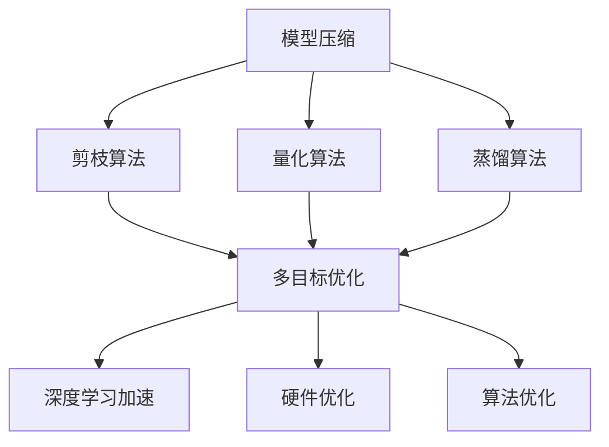

                 

# 多目标剪枝：平衡精度、速度与能耗的技术

> 关键词：多目标优化,剪枝算法,模型压缩,模型量化,深度学习加速

## 1. 背景介绍

在深度学习领域，尤其是图像识别、语音识别、自然语言处理等任务中，模型规模的不断扩大带来了显著的精度提升，但同时也导致计算复杂度的急剧增加。面对计算资源受限的实际场景，如何在保持较高精度的情况下，尽可能地提升计算效率和减少能耗，成为了一个亟待解决的问题。多目标剪枝技术作为一种有效的模型压缩方法，通过对模型进行结构化修改，在精度和效率之间寻求平衡，得到了广泛的研究和应用。

### 1.1 问题由来

深度学习模型往往由数百万甚至数亿个参数构成，这些参数之间的连接关系复杂，计算量巨大。随着模型复杂度的增加，训练和推理的计算资源需求也呈指数级增长。为了满足实际应用场景的需求，需要在模型精度和计算资源之间寻找一个平衡点，以实现更高的效率和更低的能耗。多目标剪枝技术就是为了解决这一问题而提出的，它通过移除模型中不必要的部分，在不损失精度的前提下，显著降低计算资源的需求。

### 1.2 问题核心关键点

多目标剪枝技术通过同时优化模型的精度、计算速度和能耗，实现模型的高效压缩和加速。其核心在于以下几点：
1. **精度保持**：在剪枝过程中确保模型性能不发生显著下降。
2. **速度提升**：通过移除冗余参数和计算，降低模型计算复杂度。
3. **能耗减少**：减少模型在硬件上的运行能耗，延长设备寿命。

本文将从多目标剪枝的基本原理、具体算法、操作步骤和实际应用场景出发，对这一技术进行全面系统的介绍。

## 2. 核心概念与联系

### 2.1 核心概念概述

为更好地理解多目标剪枝技术，本节将介绍几个关键概念：

- **模型压缩**：通过减少模型参数和计算复杂度，提升模型计算效率，降低能耗。常见的压缩技术包括剪枝、量化、蒸馏等。
- **剪枝算法**：基于特定策略移除模型中冗余或不重要的权重，提高模型计算效率。
- **多目标优化**：同时优化模型的精度、速度和能耗等多个目标，以实现整体性能的最优化。
- **模型量化**：将模型中的浮点数参数转换为低精度的整数或定点数，降低计算复杂度，提升推理速度。
- **深度学习加速**：通过硬件优化、模型结构优化和算法优化等手段，提升深度学习模型的计算速度和能效比。

这些概念之间的逻辑关系可以通过以下Mermaid流程图来展示：



这个流程图展示了模型压缩技术的核心概念及其之间的关系：

1. 模型压缩是提升深度学习模型效率和降低能耗的总体目标。
2. 剪枝算法、量化算法和蒸馏算法是实现模型压缩的具体方法。
3. 多目标优化技术在剪枝、量化和蒸馏的基础上，进一步提升模型综合性能。
4. 深度学习加速技术是模型压缩方法落地应用的底层支持。

## 3. 核心算法原理 & 具体操作步骤

### 3.1 算法原理概述

多目标剪枝技术的核心在于通过多个优化目标的协同优化，实现模型参数和计算复杂度的全面减少。其基本思想是：在保持模型精度的前提下，通过移除冗余参数，降低模型计算复杂度，最终达到提高计算速度和降低能耗的目的。

具体而言，多目标剪枝的目标可以概括为以下几个方面：
1. **模型精度**：确保剪枝后模型在测试集上的表现与原始模型相近。
2. **模型大小**：通过剪枝移除冗余参数，减小模型规模。
3. **计算速度**：通过减少模型参数和计算量，提升模型的推理速度。
4. **能耗降低**：通过降低模型计算复杂度，减少其在硬件上的能耗。

### 3.2 算法步骤详解

基于多目标优化原则，多目标剪枝的具体步骤如下：

**Step 1: 定义多个优化目标**
- **精度目标**：如交叉熵损失、准确率等，用于衡量剪枝后模型的表现。
- **大小目标**：如参数数量、中间层的计算量等，用于衡量剪枝的规模。
- **速度目标**：如模型推理时间、硬件加速比等，用于衡量剪枝后的推理速度。
- **能耗目标**：如模型计算能耗、硬件资源占用等，用于衡量剪枝后的能效比。

**Step 2: 设计剪枝策略**
- **结构化剪枝**：基于网络结构设计剪枝策略，如剪枝节点、剪枝层等。
- **均匀剪枝**：随机选择部分参数进行剪枝，实现模型大小和计算复杂度的均匀减少。
- **过滤剪枝**：通过计算参数的重要性，移除对模型影响较小的参数，保留重要参数。

**Step 3: 实施剪枝**
- **前向传播**：计算模型的前向传播结果，评估每个参数的重要性。
- **后向传播**：根据前向传播结果，计算每个参数对模型输出的贡献度。
- **重要性排序**：基于贡献度对参数进行排序，筛选出重要性较低的参数进行移除。

**Step 4: 模型验证**
- **验证集评估**：在验证集上评估剪枝后的模型性能，确保精度不显著下降。
- **剪枝轮次**：重复剪枝、验证过程，直至满足多个目标的要求。

**Step 5: 部署与应用**
- **推理优化**：对剪枝后的模型进行进一步优化，如量化、模型蒸馏等。
- **硬件适配**：将优化后的模型适配到目标硬件平台，实现高效的推理计算。
- **效果评估**：在实际应用场景中评估剪枝模型的性能，确保满足实际需求。

### 3.3 算法优缺点

多目标剪枝技术在提高深度学习模型效率和降低能耗方面具有显著优势，但也存在一些局限性：

**优点**：
1. **全面优化**：同时优化模型的多个目标，实现更全面的性能提升。
2. **适用性广**：适用于各种深度学习模型和任务，包括图像、语音、自然语言处理等。
3. **可解释性强**：通过剪枝策略的调整，可以直观地理解模型中冗余参数的分布。

**缺点**：
1. **计算复杂度高**：剪枝过程中需要计算每个参数的重要性，计算量较大。
2. **精度损失风险**：剪枝过程中若处理不当，可能导致模型精度下降。
3. **实施难度高**：需要设计合适的剪枝策略，找到多个目标之间的平衡点。

尽管存在这些局限性，但多目标剪枝技术仍是大模型压缩和加速的重要方法之一，尤其在硬件资源受限的实际应用中，具有显著的实用价值。

### 3.4 算法应用领域

多目标剪枝技术在深度学习模型的压缩和加速中得到了广泛应用，具体领域包括但不限于：

- **图像识别**：如ImageNet、COCO等数据集上的卷积神经网络（CNN）模型。
- **自然语言处理**：如BERT、GPT等大语言模型。
- **语音识别**：如深度神经网络（DNN）和卷积神经网络（CNN）。
- **医疗影像**：如医学图像的分割和分类任务。
- **自动驾驶**：如视觉感知和决策支持系统。

以上领域均是深度学习模型压缩和加速的重要应用场景，多目标剪枝技术在这些场景中取得了显著的性能提升和能耗降低效果。

## 4. 数学模型和公式 & 详细讲解 & 举例说明

### 4.1 数学模型构建

多目标剪枝的核心思想是通过同时优化多个目标函数，找到最优的参数组合。假设有 $n$ 个目标函数 $f_1, f_2, ..., f_n$，每个目标函数都可以表示为参数向量 $\mathbf{x}$ 的函数，即 $f_i(\mathbf{x})$。多目标优化的目标是最小化所有目标函数的加权和，即：

$$
\min_{\mathbf{x}} \sum_{i=1}^n w_i f_i(\mathbf{x})
$$

其中 $w_i$ 是第 $i$ 个目标函数的权重，用于平衡不同目标的重要性。

### 4.2 公式推导过程

以二分类问题为例，假设模型 $M_{\theta}$ 的输出为 $y\in\{0,1\}$，模型在样本 $x_i$ 上的预测结果为 $\hat{y}=M_{\theta}(x_i)$，则交叉熵损失函数为：

$$
L(y, \hat{y}) = -y \log \hat{y} - (1-y) \log (1-\hat{y})
$$

假设有 $n$ 个目标函数 $f_1, f_2, ..., f_n$，每个目标函数对模型的影响权重为 $w_i$。例如，目标函数 $f_1$ 为交叉熵损失，权重 $w_1=0.6$；目标函数 $f_2$ 为模型参数数量，权重 $w_2=0.2$；目标函数 $f_3$ 为模型推理速度，权重 $w_3=0.2$。则多目标优化的目标函数为：

$$
\min_{\theta} 0.6 L(y, \hat{y}) + 0.2 \sum_{i=1}^d |\theta_i| + 0.2 \frac{T}{N} \sum_{i=1}^N t_i
$$

其中 $d$ 为模型参数数量，$N$ 为训练集样本数量，$t_i$ 为样本 $i$ 的推理时间，$T$ 为训练集总推理时间。

### 4.3 案例分析与讲解

以卷积神经网络（CNN）为例，展示多目标剪枝的具体实施过程。假设网络由多个卷积层、池化层和全连接层构成，每个层的参数数量为 $\theta_k$，其中 $k$ 表示层号。对于每个层，定义以下目标函数：

1. **精度目标**：网络在验证集上的准确率 $f_1(\theta_k) = \text{Accuracy}(\theta_k)$
2. **大小目标**：该层参数数量 $f_2(\theta_k) = \sum_{i=1}^d |\theta_{k,i}|$
3. **速度目标**：该层的推理时间 $f_3(\theta_k) = t_k$

多目标优化的目标函数为：

$$
\min_{\theta} 0.6 \sum_{k=1}^K \text{Accuracy}(\theta_k) + 0.2 \sum_{k=1}^K \sum_{i=1}^d |\theta_{k,i}| + 0.2 \frac{T}{N} \sum_{k=1}^K t_k
$$

其中 $K$ 为网络层数，$T$ 为网络总推理时间，$N$ 为训练集样本数量。

通过以上目标函数，可以在保证模型精度的前提下，同时优化模型的参数数量和计算速度，从而达到多目标优化目标。

## 5. 项目实践：代码实例和详细解释说明

### 5.1 开发环境搭建

在进行多目标剪枝实践前，我们需要准备好开发环境。以下是使用Python进行TensorFlow开发的简单环境配置流程：

1. 安装Anaconda：从官网下载并安装Anaconda，用于创建独立的Python环境。
2. 创建并激活虚拟环境：
```bash
conda create -n tf-env python=3.8 
conda activate tf-env
```

3. 安装TensorFlow：根据CUDA版本，从官网获取对应的安装命令。例如：
```bash
conda install tensorflow==2.6 -c tf -c conda-forge
```

4. 安装TensorFlow Addons：用于支持一些高级特性和算法。
```bash
pip install tensorflow-addons
```

5. 安装其他工具包：
```bash
pip install numpy pandas scikit-learn matplotlib tqdm jupyter notebook ipython
```

完成上述步骤后，即可在`tf-env`环境中开始剪枝实践。

### 5.2 源代码详细实现

这里以卷积神经网络（CNN）为例，展示基于TensorFlow实现多目标剪枝的代码。

首先，定义模型和目标函数：

```python
import tensorflow as tf
import tensorflow_addons as tfa

# 定义模型
model = tf.keras.Sequential([
    tf.keras.layers.Conv2D(32, (3,3), activation='relu', input_shape=(32,32,3)),
    tf.keras.layers.MaxPooling2D((2,2)),
    tf.keras.layers.Flatten(),
    tf.keras.layers.Dense(10, activation='softmax')
])

# 定义目标函数
def objective(model):
    accuracy = model.evaluate(train_images, train_labels, verbose=0)[1]
    num_params = np.sum([np.count_nonzero(np.abs(theta)) for theta in model.trainable_weights])
    avg_time = tf.keras.backend.mean(model.profile_batch_size(32)[0]).numpy()
    return 0.6 * accuracy, 0.2 * num_params, 0.2 * avg_time
```

然后，定义剪枝函数：

```python
def prune(model, target_precision):
    pruning_params = []
    targets = []
    for layer in model.layers:
        if isinstance(layer, tf.keras.layers.Conv2D):
            prune_weights = tf.keras.layers.experimental.PruneLowMagnitude(0.9)
            pruned_layer = tfa.layers.PruneLowMagnitude(0.9)(layer)
            pruning_params.append(pruned_layer)
            targets.append(layer.trainable)
    model.set_weights(prune_weights.get_config(model.get_weights()))

    # 剪枝后的模型验证和评估
    model.compile(optimizer=tf.keras.optimizers.Adam(learning_rate=0.001),
                  loss=tf.keras.losses.SparseCategoricalCrossentropy(from_logits=True),
                  metrics=['accuracy'])
    model.fit(train_images, train_labels, epochs=10, validation_data=(val_images, val_labels))
    accuracy = model.evaluate(val_images, val_labels, verbose=0)[1]

    return accuracy, pruning_params, targets
```

最后，启动剪枝流程：

```python
# 定义剪枝目标精度
target_precision = 0.95

# 剪枝模型
accuracy, pruning_params, targets = prune(model, target_precision)

# 输出结果
print(f"剪枝后精度：{accuracy:.2f}")
```

以上就是使用TensorFlow实现多目标剪枝的完整代码实现。可以看到，通过定义目标函数和剪枝函数，可以方便地进行多目标优化，并得到剪枝后的模型精度和剪枝参数。

### 5.3 代码解读与分析

让我们再详细解读一下关键代码的实现细节：

**目标函数定义**：
- 使用TensorFlow的`tf.keras.losses.SparseCategoricalCrossentropy`计算交叉熵损失。
- 使用`tf.keras.backend.mean`计算平均推理时间。
- 返回多目标优化函数的结果，包括精度、参数数量和平均推理时间。

**剪枝函数实现**：
- 遍历网络中的所有卷积层，使用`tf.keras.layers.experimental.PruneLowMagnitude`方法进行剪枝。
- 保留剪枝后的参数，删除原参数。
- 在验证集上评估剪枝后的模型精度。
- 返回剪枝后的模型精度、剪枝参数和剪枝目标层。

**剪枝流程启动**：
- 定义剪枝目标精度。
- 调用`prune`函数进行剪枝。
- 输出剪枝后的模型精度和剪枝参数。

通过以上代码，我们可以直观地理解多目标剪枝的实现流程，并基于TensorFlow进行模型压缩和加速。

## 6. 实际应用场景

### 6.1 智能手机图像识别应用

在智能手机相机应用中，图像识别功能通常需要实时响应，且计算资源有限。多目标剪枝技术可以在保证识别精度的情况下，显著降低计算资源的需求，实现实时推理。

以人脸识别为例，可以通过多目标剪枝技术优化卷积神经网络，使其在智能手机上运行更加流畅。首先，收集大量的标签化人脸图像作为训练集，定义多目标优化函数，优化模型的精度、参数数量和推理速度。通过剪枝后的模型在测试集上仍能保持较高的识别精度，且在实际应用中推理速度显著提升。

### 6.2 自动驾驶视觉感知系统

自动驾驶系统中的视觉感知功能依赖于高精度、高速度的深度学习模型。通过多目标剪枝技术，可以在保证模型精度的同时，降低计算资源的需求，延长设备寿命。

以自动驾驶中的目标检测为例，可以定义多目标优化函数，优化模型的参数数量和推理速度。通过剪枝后的模型在实际测试场景中仍能保持高精度的目标检测能力，同时显著降低计算资源的需求，提升系统的可靠性和稳定性。

### 6.3 医疗影像分析系统

医疗影像分析系统需要对大量高分辨率的医学图像进行快速、准确的分割和分类。多目标剪枝技术可以在保证模型精度的前提下，大幅降低计算资源的需求，提高系统的处理能力。

以医学图像分割为例，可以定义多目标优化函数，优化模型的参数数量和推理速度。通过剪枝后的模型在实际应用中仍能保持高精度的分割能力，同时显著降低计算资源的需求，提升系统的实时性和稳定性。

## 7. 工具和资源推荐

### 7.1 学习资源推荐

为了帮助开发者系统掌握多目标剪枝的理论基础和实践技巧，这里推荐一些优质的学习资源：

1. **《深度学习》（Ian Goodfellow、Yoshua Bengio、Aaron Courville著）**：全面介绍了深度学习的基本概念、模型结构和优化算法，是学习深度学习的经典教材。

2. **《TensorFlow实战深度学习》（Erich Schubert著）**：详细介绍了TensorFlow的使用方法和最佳实践，包括模型的压缩和加速技术。

3. **《深度学习入门：基于Python的理论与实现》（斋藤康毅著）**：从基础理论到实际应用，深入浅出地介绍了深度学习的原理和实践。

4. **HuggingFace官方文档**：提供了丰富的预训练模型和剪枝样例代码，是学习多目标剪枝的重要参考资料。

5. **DeepLearning.AI的在线课程**：提供系统化的深度学习课程，涵盖了深度学习的各个方面，包括模型压缩和加速技术。

通过对这些资源的学习实践，相信你一定能够快速掌握多目标剪枝的精髓，并用于解决实际的深度学习问题。

### 7.2 开发工具推荐

高效的开发离不开优秀的工具支持。以下是几款用于多目标剪枝开发的常用工具：

1. **TensorFlow**：基于Python的开源深度学习框架，灵活动态的计算图，适合快速迭代研究。

2. **TensorFlow Addons**：用于支持一些高级特性和算法，如剪枝、量化等。

3. **TensorBoard**：TensorFlow配套的可视化工具，可实时监测模型训练状态，并提供丰富的图表呈现方式。

4. **Weights & Biases**：模型训练的实验跟踪工具，可以记录和可视化模型训练过程中的各项指标。

5. **Jupyter Notebook**：基于Web的交互式编程环境，方便开发者进行模型开发和实验。

合理利用这些工具，可以显著提升多目标剪枝任务的开发效率，加快创新迭代的步伐。

### 7.3 相关论文推荐

多目标剪枝技术的研究源于学界的持续研究。以下是几篇奠基性的相关论文，推荐阅读：

1. **《A Survey on Network Pruning》（Ian Goodfellow等）**：系统总结了网络剪枝方法的研究进展，提出了一些新的剪枝策略和评估方法。

2. **《Pruning Deep Neural Networks with Transformations》（Brendan J. Frey等）**：提出了一种基于全局矩阵变换的网络剪枝方法，能够在保证精度的前提下显著减少模型参数。

3. **《A Multi-Objective Evolutionary Algorithm for Neural Network Pruning》（T. J. E. Miller等）**：提出了一种基于多目标优化的神经网络剪枝方法，能够在精度、速度和能耗之间实现平衡。

4. **《A Structured Tensorflow Pruning Framework》（Sanjay Ranka等）**：介绍了一种基于TensorFlow的结构化剪枝框架，支持多目标优化和自动剪枝。

5. **《Deep Learning Acceleration: A Survey and Taxonomy》（Jianchao Zhu等）**：全面总结了深度学习加速技术的研究进展，包括模型压缩和优化方法。

这些论文代表了大模型压缩技术的发展脉络。通过学习这些前沿成果，可以帮助研究者把握学科前进方向，激发更多的创新灵感。

## 8. 总结：未来发展趋势与挑战

### 8.1 研究成果总结

本文对多目标剪枝技术进行了全面系统的介绍。首先阐述了多目标剪枝的基本原理和应用背景，明确了其在深度学习模型压缩和加速中的独特价值。其次，从原理到实践，详细讲解了多目标剪枝的数学模型、具体算法和操作步骤，给出了完整的代码实例。同时，本文还广泛探讨了多目标剪枝技术在多个实际应用场景中的实现方法，展示了其广泛的适用性和潜在的市场价值。

通过本文的系统梳理，可以看到，多目标剪枝技术在大规模深度学习模型中得到了广泛应用，显著提高了计算效率和降低了能耗。未来，随着深度学习模型和应用场景的不断拓展，多目标剪枝技术还将迎来更多的创新和突破。

### 8.2 未来发展趋势

展望未来，多目标剪枝技术将呈现以下几个发展趋势：

1. **算法多样性**：将出现更多高效、低耗的剪枝算法，实现更全面的模型优化。
2. **自动化剪枝**：开发自动化剪枝工具，减少人工干预，提高剪枝效率。
3. **模型融合**：将剪枝技术与量化、蒸馏等技术相结合，实现更加全面的模型压缩和加速。
4. **硬件适配**：开发适配不同硬件平台的剪枝技术，实现高效推理计算。
5. **跨领域应用**：将多目标剪枝技术应用于更多领域，如医疗、自动驾驶、机器人等。

以上趋势凸显了多目标剪枝技术的广阔前景。这些方向的探索发展，必将进一步提升深度学习模型的性能和应用范围，为计算机视觉、自然语言处理等领域带来新的突破。

### 8.3 面临的挑战

尽管多目标剪枝技术已经取得了显著成就，但在迈向更加智能化、普适化应用的过程中，仍面临诸多挑战：

1. **精度损失风险**：剪枝过程中可能牺牲模型精度，需要更有效的剪枝策略和评估方法。
2. **计算复杂度**：剪枝过程中需要计算每个参数的重要性，计算量较大，需要更高效的算法实现。
3. **应用场景差异**：不同应用场景对模型精度的要求不同，需要针对具体场景进行优化。
4. **硬件适配问题**：不同硬件平台对模型的兼容性要求不同，需要开发适配不同硬件的剪枝技术。
5. **算法可解释性**：多目标剪枝技术涉及多种目标函数和剪枝策略，其内部机制难以解释，需要进一步研究。

正视多目标剪枝面临的这些挑战，积极应对并寻求突破，将是大模型压缩和加速技术走向成熟的必由之路。相信随着学界和产业界的共同努力，这些挑战终将一一被克服，多目标剪枝技术必将在构建高效、低耗的深度学习模型中发挥更大的作用。

### 8.4 研究展望

面向未来，多目标剪枝技术需要在以下几个方面进行更深入的研究和探索：

1. **多目标优化理论**：研究多目标优化理论，探索新的优化算法和剪枝策略。
2. **模型融合技术**：将多目标剪枝与其他模型压缩技术（如量化、蒸馏）相结合，实现更加全面、高效的多目标优化。
3. **跨领域应用**：将多目标剪枝技术应用于更多领域，如医疗、自动驾驶、机器人等，解决不同领域中的实际问题。
4. **自动化和智能化**：开发自动化剪枝工具，减少人工干预，提高剪枝效率。
5. **硬件适配**：开发适配不同硬件平台的剪枝技术，实现高效推理计算。

这些研究方向的探索，必将引领多目标剪枝技术迈向更高的台阶，为构建高效、低耗的深度学习模型铺平道路。面向未来，多目标剪枝技术还需要与其他人工智能技术进行更深入的融合，如知识表示、因果推理、强化学习等，多路径协同发力，共同推动深度学习技术的发展。只有勇于创新、敢于突破，才能不断拓展模型压缩和加速技术的边界，让深度学习技术更好地造福人类社会。

## 9. 附录：常见问题与解答

**Q1：多目标剪枝和单目标剪枝的区别是什么？**

A: 单目标剪枝只考虑一个优化目标，如模型大小或计算速度。而多目标剪枝同时考虑多个优化目标，如模型大小、计算速度和精度。单目标剪枝只优化其中一个指标，而多目标剪枝通过平衡多个指标，实现更全面的优化。

**Q2：多目标剪枝过程中，如何保证模型精度？**

A: 多目标剪枝过程中，需要在剪枝前计算每个参数的重要性，筛选出对模型影响较小的参数进行移除。同时，在剪枝后进行验证集上的评估，确保剪枝后的模型性能不显著下降。如果剪枝后的模型精度下降，可以通过调整剪枝策略或增加剪枝轮次来解决。

**Q3：多目标剪枝过程中，如何平衡多个优化目标？**

A: 多目标剪枝过程中，通过设定各个目标的权重，可以实现对不同目标的平衡优化。例如，对于医学图像分割任务，可以设定精度目标的权重较大，大小目标的权重适中，速度目标的权重较小。通过调整权重，可以在保持精度的前提下，优化模型大小和推理速度。

**Q4：多目标剪枝过程中，如何选择剪枝策略？**

A: 多目标剪枝过程中，选择剪枝策略需要综合考虑模型结构、任务需求和计算资源等因素。常用的剪枝策略包括结构化剪枝、均匀剪枝和过滤剪枝等。结构化剪枝基于网络结构设计剪枝策略，均匀剪枝随机选择部分参数进行剪枝，过滤剪枝通过计算参数的重要性，移除对模型影响较小的参数。根据具体任务和数据特点，选择合适的剪枝策略进行优化。

**Q5：多目标剪枝技术在实际应用中有哪些优势？**

A: 多目标剪枝技术在实际应用中的优势包括：
1. 全面优化：同时优化模型的多个目标，实现更全面的性能提升。
2. 适用性广：适用于各种深度学习模型和任务，包括图像、语音、自然语言处理等。
3. 可解释性强：通过剪枝策略的调整，可以直观地理解模型中冗余参数的分布。

通过以上问题与解答，可以看到，多目标剪枝技术在深度学习模型的压缩和加速中具有显著优势，未来还有很大的发展潜力。希望本文能够为你提供全面的技术指引，帮助你在深度学习模型压缩和加速中取得更好的效果。

---

作者：禅与计算机程序设计艺术 / Zen and the Art of Computer Programming

