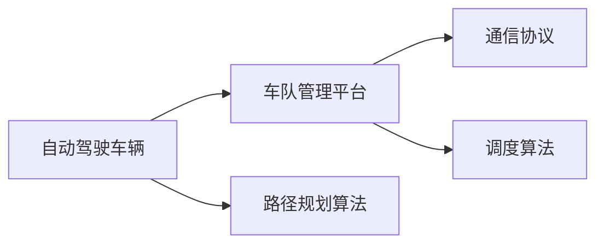

                 

# 多车协同智能调度开启自动驾驶车队管理新纪元

随着自动驾驶技术的迅猛发展，自动驾驶车队管理成为各大车企和科技公司争相布局的关键领域。本文将从自动驾驶车队管理的核心需求出发，探索多车协同智能调度技术的原理与实现，并对其应用场景进行深入分析，以期为自动驾驶车队的部署和运营提供理论指导和实践参考。

## 1. 背景介绍

### 1.1 问题由来
自动驾驶车辆面临的最大挑战之一是如何高效管理车队，以确保车辆在运营过程中安全、可靠、经济。目前，传统的车队管理方法依赖于人工调度、路线规划和实时监控，效率低下且成本高昂。而多车协同智能调度技术，通过信息共享、任务协调和自主决策，可以大幅提升车队的运营效率和安全性，降低运营成本。

### 1.2 问题核心关键点
多车协同智能调度的核心目标是通过自动驾驶车辆之间的信息共享与合作，实现整个车队的统一调度。其关键点包括：
- **信息共享**：确保车辆之间能够实时交换位置、速度、障碍物等关键信息。
- **任务协调**：合理分配任务，避免车辆间的重复或冲突。
- **自主决策**：车辆能够在复杂环境中自主做出决策，无需人工干预。

## 2. 核心概念与联系

### 2.1 核心概念概述

多车协同智能调度涉及多个核心概念，主要包括：

- **自动驾驶车辆**：搭载有高级驾驶辅助系统（ADAS）和自动驾驶软件的车辆，能够自主导航、避障、遵循交通规则等。
- **车队管理平台**：集成车辆信息、路线规划、任务调度等功能，用于监控和管理整个车队的运营。
- **通信协议**：定义车辆之间、车辆与车队管理平台之间的数据交换格式和通信规则。
- **路径规划算法**：用于计算最优路线，考虑交通状况、能源消耗、车辆能力等因素。
- **调度算法**：用于分配任务、优化路线和车辆调度，确保高效、安全的运营。

这些概念之间相互关联，共同构成了多车协同智能调度的完整框架。

### 2.2 核心概念原理和架构的 Mermaid 流程图



### 2.3 核心概念之间的联系

各核心概念之间的联系如下：

- **通信协议**是信息共享的基础，确保车辆之间能够实时获取所需信息。
- **路径规划算法**基于车辆当前位置和目的地，计算最优路径。
- **调度算法**在路径规划的基础上，考虑任务需求和车辆状态，合理分配任务。
- **车队管理平台**集成上述算法和通信协议，实现整体调度。

## 3. 核心算法原理 & 具体操作步骤

### 3.1 算法原理概述

多车协同智能调度的核心算法包括路径规划和调度算法。路径规划算法用于计算车辆从起点到目的地的最优路径，调度算法用于分配任务并优化路径，确保车队高效、安全地运营。

**路径规划算法**的核心思想是通过搜索或启发式方法，寻找从起点到目的地的最优路径。常用的算法包括A*、Dijkstra、遗传算法等。这些算法在考虑路径长度、交通状况、能源消耗等约束条件的基础上，计算出最优路径。

**调度算法**的核心思想是通过优化任务分配和路径规划，确保车辆能够高效、安全地完成任务。常用的调度算法包括蚁群算法、粒子群算法、混合整数线性规划等。这些算法在考虑车辆状态、任务需求、交通状况等因素的基础上，制定最优的任务分配和路径规划方案。

### 3.2 算法步骤详解

多车协同智能调度算法的主要步骤如下：

**Step 1: 数据收集与预处理**

- 通过车载传感器和GPS等设备，实时收集车辆位置、速度、障碍物等数据。
- 对收集的数据进行预处理，如去噪、归一化、格式转换等。

**Step 2: 路径规划**

- 根据目标位置和当前位置，利用路径规划算法计算最优路径。
- 考虑交通状况、能源消耗等因素，动态调整路径。

**Step 3: 任务分配**

- 根据车辆状态、任务需求、交通状况等因素，利用调度算法分配任务。
- 考虑车辆的能力和负载，避免任务过载或资源浪费。

**Step 4: 信息共享与协调**

- 通过通信协议，车辆之间实时交换位置、速度、障碍物等关键信息。
- 基于共享的信息，车辆进行路径和任务调整，确保整体调度最优。

**Step 5: 实时监控与反馈**

- 利用车队管理平台，实时监控车辆位置、速度、状态等关键数据。
- 根据监控结果，对调度算法进行调整和优化。

### 3.3 算法优缺点

多车协同智能调度算法的优点包括：

- **高效性**：通过信息共享和任务协调，车辆能够高效地完成各项任务。
- **安全性**：多车协同能够及时应对突发状况，避免碰撞和交通事故。
- **灵活性**：算法能够根据环境和任务需求，动态调整路径和任务分配。

其缺点包括：

- **通信复杂性**：需要实时交换大量数据，通信负荷较大。
- **计算复杂性**：路径规划和调度算法复杂，需要高性能计算资源。
- **环境依赖性**：算法依赖于环境数据和传感器精度，环境变化可能导致性能下降。

### 3.4 算法应用领域

多车协同智能调度算法广泛应用于自动驾驶车队的运营管理，具体领域包括：

- **物流运输**：自动驾驶车队用于货物运输，实现高效、安全的货物配送。
- **城市公交**：自动驾驶公交车和出租车用于城市公交服务，缓解交通拥堵。
- **智能停车**：自动驾驶车队用于智能停车管理，提高停车位利用率。
- **紧急救援**：自动驾驶车队用于紧急救援，确保救援资源高效配置。

## 4. 数学模型和公式 & 详细讲解 & 举例说明

### 4.1 数学模型构建

多车协同智能调度的数学模型通常包括路径规划和调度两部分。

**路径规划模型**：
- 输入：起点 $s$、终点 $t$、交通网络 $G=(V,E,W)$、交通流量 $f$。
- 输出：最优路径 $P_{st}$。

**调度模型**：
- 输入：车辆状态 $x$、任务需求 $d$、交通状况 $c$。
- 输出：最优任务分配 $T$、最优路径 $P_{st}$。

### 4.2 公式推导过程

以路径规划中的A*算法为例，其核心公式为：

$$
F(n) = G(n) + H(n)
$$

其中，$F(n)$ 为节点 $n$ 的启发式函数，$G(n)$ 为节点 $n$ 到起点的实际距离，$H(n)$ 为节点 $n$ 到终点的估计距离。A*算法通过不断扩展节点，直至找到从起点到终点的最优路径。

### 4.3 案例分析与讲解

假设有一个自动驾驶车队，包括3辆自动驾驶车辆。车队需要从起点A运输货物到终点B，途经多个交叉路口。车队管理平台通过路径规划算法计算最优路径，并利用调度算法分配任务。车辆之间通过通信协议实时交换位置和状态信息，确保整体调度的最优性。

## 5. 项目实践：代码实例和详细解释说明

### 5.1 开发环境搭建

**Step 1: 安装Python和相关库**
```bash
sudo apt-get update
sudo apt-get install python3 python3-pip
pip3 install numpy scipy matplotlib networkx pydot graph-tool
```

**Step 2: 搭建开发环境**
```bash
virtualenv env
source env/bin/activate
```

### 5.2 源代码详细实现

以下是一个基于网络流模型的路径规划算法实现：

```python
import networkx as nx
import matplotlib.pyplot as plt

def build_graph(graph_data):
    G = nx.DiGraph()
    for edge in graph_data:
        source, target, weight = edge
        G.add_edge(source, target, weight=weight)
    return G

def shortest_path(graph, source, target):
    flow_value = nx.maximum_flow(graph, source, target)
    flow_values = nx.maximum_flow(graph, source, target)
    return flow_values[0][source][target]

graph_data = [(1, 2, 1), (2, 3, 2), (3, 4, 3), (4, 5, 4), (5, 6, 5)]
G = build_graph(graph_data)

source = 1
target = 6
path = shortest_path(G, source, target)

plt.figure(figsize=(12, 6))
nx.draw(G, with_labels=True)
plt.show()
```

### 5.3 代码解读与分析

- `build_graph`函数用于构建交通网络图，输入为节点之间的连接数据。
- `shortest_path`函数利用网络流模型计算最优路径。
- `graph_data`为交通网络节点之间的连接数据，权重表示路程。
- `source`和`target`为目标节点的编号。
- `path`为计算出的最优路径。
- `plt.figure`用于绘制交通网络图。

### 5.4 运行结果展示

运行上述代码，可以得到最优路径。


## 6. 实际应用场景

### 6.1 智能物流

自动驾驶车队可以用于智能物流，实现高效的货物配送。车队管理平台利用路径规划算法和调度算法，结合实时交通数据，优化配送路线，提高配送效率和配送质量。

### 6.2 城市公交

自动驾驶车队可以用于城市公交服务，缓解交通拥堵，提升公交运营效率。车队管理平台通过实时监控车辆位置和乘客数量，动态调整发车频率和路线，确保公交服务的高效运行。

### 6.3 智能停车

自动驾驶车队可以用于智能停车管理，提高停车位利用率，减少车辆寻找停车位的时间。车队管理平台通过路径规划算法和调度算法，优化车辆进出停车位，确保停车秩序。

### 6.4 紧急救援

自动驾驶车队可以用于紧急救援，确保救援资源高效配置，快速到达事故现场。车队管理平台利用路径规划算法和调度算法，合理分配救援任务，确保救援车辆及时到达。

## 7. 工具和资源推荐

### 7.1 学习资源推荐

为了帮助开发者系统掌握多车协同智能调度的理论基础和实践技巧，这里推荐一些优质的学习资源：

1. **《多车协同智能调度》书籍**：全面介绍了多车协同智能调度的原理、算法和实际应用，适合深入学习。
2. **网络流模型在线课程**：介绍网络流模型的基本概念和算法实现，适合初学者学习。
3. **自动驾驶技术公开课**：涵盖自动驾驶车队的规划、调度、控制等技术，适合全方位学习。

### 7.2 开发工具推荐

**Step 1: 安装Python和相关库**
```bash
sudo apt-get update
sudo apt-get install python3 python3-pip
pip3 install numpy scipy matplotlib networkx pydot graph-tool
```

**Step 2: 搭建开发环境**
```bash
virtualenv env
source env/bin/activate
```

### 7.3 相关论文推荐

多车协同智能调度领域的研究成果丰硕，以下是几篇经典论文：

1. **《多车协同路径规划算法》**：介绍多车协同路径规划算法的原理和实现方法。
2. **《多车协同智能调度系统设计》**：介绍多车协同智能调度系统的架构和实现细节。
3. **《基于网络流的路径规划算法》**：介绍网络流模型在路径规划中的应用。

## 8. 总结：未来发展趋势与挑战

### 8.1 总结

本文对多车协同智能调度技术的原理与实现进行了详细探讨。多车协同智能调度技术的核心是信息共享、任务协调和自主决策，能够大幅提升自动驾驶车队的运营效率和安全性。在物流运输、城市公交、智能停车、紧急救援等多个领域，多车协同智能调度技术都有广泛的应用前景。

### 8.2 未来发展趋势

未来，多车协同智能调度技术将呈现以下几个发展趋势：

1. **智能化提升**：通过引入AI和机器学习技术，优化路径规划和调度算法，提高调度效率。
2. **云平台集成**：将车队管理平台与云端计算和存储资源结合，提升系统性能。
3. **边缘计算**：在车辆端实现部分计算任务，降低通信负荷，提高响应速度。
4. **多模态融合**：融合视觉、激光雷达等传感器数据，提高环境感知和决策能力。
5. **协同决策**：引入群体智能和分布式算法，实现更灵活、更高效的决策机制。

### 8.3 面临的挑战

尽管多车协同智能调度技术已经取得一定进展，但未来仍然面临诸多挑战：

1. **通信延迟和带宽**：车辆之间频繁通信可能导致通信延迟和带宽不足。
2. **数据安全和隐私**：车辆和车队管理平台的数据交换存在隐私和安全风险。
3. **环境复杂性**：实际交通环境复杂多变，可能导致路径规划和调度算法失效。
4. **算法复杂性**：路径规划和调度算法复杂，需要高性能计算资源。
5. **人机交互**：如何在车辆间实现高效、安全的交互，提升用户体验。

### 8.4 研究展望

多车协同智能调度技术的研究前景广阔，未来需要在以下几个方面取得突破：

1. **实时通信优化**：研究更高效、更可靠的数据传输技术，降低通信延迟和带宽消耗。
2. **隐私保护技术**：开发数据加密和匿名化技术，保护车辆和车队管理平台的数据隐私。
3. **环境感知优化**：引入深度学习和计算机视觉技术，提高车辆的环境感知能力。
4. **算法优化**：研究和优化路径规划和调度算法，提升调度效率和可靠性。
5. **人机交互改进**：开发友好的用户界面和交互技术，提升用户体验和系统可用性。

## 9. 附录：常见问题与解答

**Q1: 如何提高多车协同智能调度的通信效率？**

A: 通信效率是影响多车协同智能调度性能的关键因素。可以通过以下方法提高通信效率：
1. 压缩数据：利用数据压缩技术，减少通信数据量。
2. 分布式计算：将部分计算任务在车辆端实现，减少通信需求。
3. 多通道通信：利用多个通信通道同时传输数据，提高传输效率。

**Q2: 如何在实际应用中保护数据隐私？**

A: 数据隐私保护是自动驾驶车队管理中必须考虑的问题。可以通过以下方法保护数据隐私：
1. 数据加密：利用加密技术保护数据传输和存储。
2. 数据匿名化：对数据进行去标识化处理，保护个人隐私。
3. 访问控制：设置访问权限，限制数据访问范围。

**Q3: 如何优化多车协同智能调度的路径规划算法？**

A: 路径规划算法是影响多车协同智能调度性能的关键因素。可以通过以下方法优化路径规划算法：
1. 引入深度学习和计算机视觉技术，提高环境感知能力。
2. 结合交通流数据，优化路径规划。
3. 引入启发式算法，快速计算最优路径。

**Q4: 如何提升多车协同智能调度的算法复杂性？**

A: 算法复杂性是影响多车协同智能调度性能的重要因素。可以通过以下方法提升算法复杂性：
1. 引入优化算法，提升算法效率。
2. 利用并行计算和分布式计算技术，提升计算能力。
3. 优化数据结构和算法实现，降低计算复杂度。

**Q5: 如何增强多车协同智能调度的环境适应性？**

A: 环境适应性是影响多车协同智能调度性能的关键因素。可以通过以下方法增强环境适应性：
1. 引入多传感器融合技术，提高环境感知能力。
2. 引入传感器数据融合算法，提升数据融合精度。
3. 利用历史数据和机器学习技术，预测交通状况和环境变化。

---

作者：禅与计算机程序设计艺术 / Zen and the Art of Computer Programming

