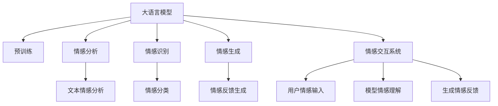

                 

# 大模型在情感交互中的应用挑战

## 1. 背景介绍

情感交互（Emotional Interaction）是指利用自然语言处理（NLP）技术，捕捉和理解人类情感，并提供适当反馈，从而促进有效的人机交流。随着人工智能技术的飞速发展，大语言模型（Large Language Models, LLMs）在情感交互中扮演了重要角色。大模型通过在大规模无标签文本数据上进行预训练，获得了丰富的语言知识和语义理解能力，能够处理复杂的情感信息，并为情感分析、智能客服、虚拟助手等应用提供强大的支持。

### 1.1 问题由来
当前，情感交互技术的应用场景日益广泛，如智能客服、虚拟助手、情感分析系统等。大语言模型在情感识别和反馈生成方面展现了巨大的潜力，但实际应用中也遇到了不少挑战。例如，模型对复杂情感场景的理解能力有限，对多样化的情感表达和语境理解能力有待提升。同时，模型的情感表达输出可能存在偏见、刻板印象等问题，无法真正理解人类情感的丰富性和复杂性。

此外，情感交互系统需要实时响应用户情感变化，并能够提供灵活多变的反馈，这对模型的性能和效率提出了更高要求。因此，针对情感交互任务的特殊需求，对大语言模型进行优化和适应性调整，是提升情感交互系统性能的关键。

### 1.2 问题核心关键点
情感交互任务对大语言模型的挑战主要体现在以下几个方面：

- **情感多样性**：人类情感表达具有多样性和复杂性，如愤怒、悲伤、喜悦、惊讶等，模型需要具备识别和理解这些细微情感的能力。
- **情感语境理解**：情感表达往往依赖于语境，如上下文、用户背景、历史交互记录等，模型需要在复杂的语境中准确识别和提取情感信息。
- **情感反馈生成**：情感交互系统不仅要理解用户情感，还需生成适当的情感反馈，如同情、鼓励、道歉等，满足用户的情感需求。
- **鲁棒性和可解释性**：模型需要在各种场景下保持鲁棒性，并具有良好的可解释性，便于用户理解和信任。
- **实时性**：情感交互系统需要快速响应用户情感变化，提供即时反馈，这对模型的推理速度提出了较高要求。

## 2. 核心概念与联系

### 2.1 核心概念概述

为更好地理解大语言模型在情感交互中的应用，本节将介绍几个密切相关的核心概念：

- **大语言模型(Large Language Model, LLM)**：以自回归(如GPT)或自编码(如BERT)模型为代表的大规模预训练语言模型。通过在大规模无标签文本语料上进行预训练，学习通用的语言表示，具备强大的语言理解和生成能力。

- **预训练(Pre-training)**：指在大规模无标签文本语料上，通过自监督学习任务训练通用语言模型的过程。常见的预训练任务包括言语建模、遮挡语言模型等。预训练使得模型学习到语言的通用表示。

- **情感分析（Sentiment Analysis）**：指通过机器学习或深度学习技术，自动分析和识别文本中包含的情感信息，如正面、负面、中性等。

- **情感识别（Emotion Recognition）**：识别用户通过文本或语音表达的情感状态，并对其进行分类和标注。

- **情感生成（Emotion Generation）**：根据用户输入的情感信息，生成适当的情感反馈或回答。

- **情感交互系统（Emotion Interaction System）**：利用NLP技术，自动捕捉和理解用户情感，并生成相应的情感反馈，实现人机情感交流的智能系统。

- **情感鲁棒性（Emotional Robustness）**：指模型在不同情感场景下，仍能准确理解和生成情感反馈的能力。

- **情感可解释性（Emotional Interpretability）**：指模型输出的情感反馈和判断具备可解释性，用户能够理解和信任模型的输出。

这些核心概念之间的逻辑关系可以通过以下Mermaid流程图来展示：



这个流程图展示了大语言模型在情感交互中的核心概念及其相互关系：

1. 大语言模型通过预训练获得基础能力。
2. 预训练模型可用于情感分析、情感识别和情感生成。
3. 情感交互系统结合预训练模型的功能，自动理解用户情感，并生成适当的情感反馈。
4. 情感分类和反馈生成进一步细化了模型对情感的理解和表达。

## 3. 核心算法原理 & 具体操作步骤
### 3.1 算法原理概述

情感交互任务中，大语言模型通过输入文本或语音信息，自动分析和识别用户情感状态，并根据情感状态生成适当的反馈。其核心思想是利用深度学习技术，对预训练模型进行微调，使其具备对情感信息的识别和生成能力。

形式化地，假设预训练模型为 $M_{\theta}$，其中 $\theta$ 为预训练得到的模型参数。给定情感交互任务 $T$ 的训练集 $D=\{(x_i,y_i)\}_{i=1}^N$，其中 $x_i$ 为输入文本，$y_i$ 为情感标签。微调的目标是找到新的模型参数 $\hat{\theta}$，使得模型在任务 $T$ 上表现最优：

$$
\hat{\theta}=\mathop{\arg\min}_{\theta} \mathcal{L}(M_{\theta},D)
$$

其中 $\mathcal{L}$ 为针对情感交互任务设计的损失函数，用于衡量模型预测输出与真实标签之间的差异。常见的损失函数包括交叉熵损失、均方误差损失等。

通过梯度下降等优化算法，微调过程不断更新模型参数 $\theta$，最小化损失函数 $\mathcal{L}$，使得模型输出逼近真实标签。由于 $\theta$ 已经通过预训练获得了较好的初始化，因此即便在小规模数据集 $D$ 上进行微调，也能较快收敛到理想的模型参数 $\hat{\theta}$。

### 3.2 算法步骤详解

基于监督学习的大语言模型情感交互微调一般包括以下几个关键步骤：

**Step 1: 准备预训练模型和数据集**
- 选择合适的预训练语言模型 $M_{\theta}$ 作为初始化参数，如 BERT、GPT 等。
- 准备情感交互任务的标注数据集 $D$，其中每个样本包括输入文本 $x_i$ 和情感标签 $y_i$。

**Step 2: 添加任务适配层**
- 根据任务类型，在预训练模型顶层设计合适的输出层和损失函数。
- 对于分类任务，通常在顶层添加线性分类器和交叉熵损失函数。
- 对于生成任务，通常使用语言模型的解码器输出概率分布，并以负对数似然为损失函数。

**Step 3: 设置微调超参数**
- 选择合适的优化算法及其参数，如 AdamW、SGD 等，设置学习率、批大小、迭代轮数等。
- 设置正则化技术及强度，包括权重衰减、Dropout、Early Stopping 等。
- 确定冻结预训练参数的策略，如仅微调顶层，或全部参数都参与微调。

**Step 4: 执行梯度训练**
- 将训练集数据分批次输入模型，前向传播计算损失函数。
- 反向传播计算参数梯度，根据设定的优化算法和学习率更新模型参数。
- 周期性在验证集上评估模型性能，根据性能指标决定是否触发 Early Stopping。
- 重复上述步骤直到满足预设的迭代轮数或 Early Stopping 条件。

**Step 5: 测试和部署**
- 在测试集上评估微调后模型 $M_{\hat{\theta}}$ 的性能，对比微调前后的精度提升。
- 使用微调后的模型对新样本进行推理预测，集成到实际的应用系统中。
- 持续收集新的数据，定期重新微调模型，以适应数据分布的变化。

以上是基于监督学习微调大语言模型的一般流程。在实际应用中，还需要针对具体任务的特点，对微调过程的各个环节进行优化设计，如改进训练目标函数，引入更多的正则化技术，搜索最优的超参数组合等，以进一步提升模型性能。

### 3.3 算法优缺点

基于监督学习的大语言模型情感交互微调方法具有以下优点：

- **简单高效**：只需准备少量标注数据，即可对预训练模型进行快速适配，获得较大的性能提升。
- **通用适用**：适用于各种情感交互任务，包括情感分析、情感识别、情感生成等，设计简单的任务适配层即可实现微调。
- **参数高效**：利用参数高效微调技术，在固定大部分预训练权重不变的情况下，仍可取得不错的提升。
- **效果显著**：在学术界和工业界的诸多任务上，基于微调的方法已经刷新了多项SOTA。

同时，该方法也存在一定的局限性：

- **依赖标注数据**：微调的效果很大程度上取决于标注数据的质量和数量，获取高质量标注数据的成本较高。
- **迁移能力有限**：当目标任务与预训练数据的分布差异较大时，微调的性能提升有限。
- **负面效果传递**：预训练模型的固有偏见、有害信息等，可能通过微调传递到下游任务，造成负面影响。
- **可解释性不足**：微调模型的决策过程通常缺乏可解释性，难以对其推理逻辑进行分析和调试。

尽管存在这些局限性，但就目前而言，基于监督学习的微调方法仍是大语言模型应用的最主流范式。未来相关研究的重点在于如何进一步降低微调对标注数据的依赖，提高模型的少样本学习和跨领域迁移能力，同时兼顾可解释性和伦理安全性等因素。

### 3.4 算法应用领域

基于大语言模型情感交互微调的监督学习方法，在NLP领域已经得到了广泛的应用，覆盖了几乎所有常见任务，例如：

- **情感分析（Sentiment Analysis）**：如情感倾向分类、情感极性判断、情感强度评估等。通过微调使模型学习文本-情感映射。
- **情感识别（Emotion Recognition）**：识别用户通过文本或语音表达的情感状态，如愤怒、悲伤、喜悦、惊讶等。
- **情感生成（Emotion Generation）**：根据用户输入的情感信息，生成适当的情感反馈或回答。
- **智能客服（Chatbots）**：对用户的情感表达进行识别和理解，生成合适的回复或建议。
- **虚拟助手（Virtual Assistants）**：在对话中识别用户的情感状态，提供适当的支持和建议。
- **社交媒体监控（Social Media Monitoring）**：对社交媒体上的情感信息进行监控和分析，识别负面情绪和舆情趋势。
- **心理健康评估（Mental Health Assessment）**：通过分析用户的情感表达，评估其心理健康状态，提供相应的心理支持。

除了上述这些经典任务外，大语言模型情感交互微调也被创新性地应用到更多场景中，如可控情感生成、情感驱动的内容生成、情感相关数据增强等，为NLP技术带来了全新的突破。随着预训练模型和微调方法的不断进步，相信NLP技术将在更广阔的应用领域大放异彩。

## 4. 数学模型和公式 & 详细讲解  
### 4.1 数学模型构建

本节将使用数学语言对基于监督学习的大语言模型情感交互微调过程进行更加严格的刻画。

记预训练语言模型为 $M_{\theta}$，其中 $\theta$ 为预训练得到的模型参数。假设情感交互任务的训练集为 $D=\{(x_i,y_i)\}_{i=1}^N$，其中 $x_i$ 为输入文本，$y_i$ 为情感标签。

定义模型 $M_{\theta}$ 在数据样本 $(x,y)$ 上的损失函数为 $\ell(M_{\theta}(x),y)$，则在数据集 $D$ 上的经验风险为：

$$
\mathcal{L}(\theta) = \frac{1}{N} \sum_{i=1}^N \ell(M_{\theta}(x_i),y_i)
$$

微调的优化目标是最小化经验风险，即找到最优参数：

$$
\theta^* = \mathop{\arg\min}_{\theta} \mathcal{L}(\theta)
$$

在实践中，我们通常使用基于梯度的优化算法（如SGD、Adam等）来近似求解上述最优化问题。设 $\eta$ 为学习率，$\lambda$ 为正则化系数，则参数的更新公式为：

$$
\theta \leftarrow \theta - \eta \nabla_{\theta}\mathcal{L}(\theta) - \eta\lambda\theta
$$

其中 $\nabla_{\theta}\mathcal{L}(\theta)$ 为损失函数对参数 $\theta$ 的梯度，可通过反向传播算法高效计算。

### 4.2 公式推导过程

以下我们以情感分类任务为例，推导交叉熵损失函数及其梯度的计算公式。

假设模型 $M_{\theta}$ 在输入 $x$ 上的输出为 $\hat{y}=M_{\theta}(x) \in [0,1]$，表示样本属于正类的概率。真实标签 $y \in \{0,1\}$。则二分类交叉熵损失函数定义为：

$$
\ell(M_{\theta}(x),y) = -[y\log \hat{y} + (1-y)\log (1-\hat{y})]
$$

将其代入经验风险公式，得：

$$
\mathcal{L}(\theta) = -\frac{1}{N}\sum_{i=1}^N [y_i\log M_{\theta}(x_i)+(1-y_i)\log(1-M_{\theta}(x_i))]
$$

根据链式法则，损失函数对参数 $\theta_k$ 的梯度为：

$$
\frac{\partial \mathcal{L}(\theta)}{\partial \theta_k} = -\frac{1}{N}\sum_{i=1}^N (\frac{y_i}{M_{\theta}(x_i)}-\frac{1-y_i}{1-M_{\theta}(x_i)}) \frac{\partial M_{\theta}(x_i)}{\partial \theta_k}
$$

其中 $\frac{\partial M_{\theta}(x_i)}{\partial \theta_k}$ 可进一步递归展开，利用自动微分技术完成计算。

在得到损失函数的梯度后，即可带入参数更新公式，完成模型的迭代优化。重复上述过程直至收敛，最终得到适应情感分类任务的最优模型参数 $\theta^*$。

## 5. 项目实践：代码实例和详细解释说明
### 5.1 开发环境搭建

在进行情感交互任务的微调实践前，我们需要准备好开发环境。以下是使用Python进行PyTorch开发的环境配置流程：

1. 安装Anaconda：从官网下载并安装Anaconda，用于创建独立的Python环境。

2. 创建并激活虚拟环境：
```bash
conda create -n pytorch-env python=3.8 
conda activate pytorch-env
```

3. 安装PyTorch：根据CUDA版本，从官网获取对应的安装命令。例如：
```bash
conda install pytorch torchvision torchaudio cudatoolkit=11.1 -c pytorch -c conda-forge
```

4. 安装Transformers库：
```bash
pip install transformers
```

5. 安装各类工具包：
```bash
pip install numpy pandas scikit-learn matplotlib tqdm jupyter notebook ipython
```

完成上述步骤后，即可在`pytorch-env`环境中开始微调实践。

### 5.2 源代码详细实现

下面我以情感分类任务为例，给出使用Transformers库对BERT模型进行情感微调的PyTorch代码实现。

首先，定义情感分类任务的数据处理函数：

```python
from transformers import BertTokenizer
from torch.utils.data import Dataset
import torch

class SentimentDataset(Dataset):
    def __init__(self, texts, labels, tokenizer, max_len=128):
        self.texts = texts
        self.labels = labels
        self.tokenizer = tokenizer
        self.max_len = max_len
        
    def __len__(self):
        return len(self.texts)
    
    def __getitem__(self, item):
        text = self.texts[item]
        label = self.labels[item]
        
        encoding = self.tokenizer(text, return_tensors='pt', max_length=self.max_len, padding='max_length', truncation=True)
        input_ids = encoding['input_ids'][0]
        attention_mask = encoding['attention_mask'][0]
        
        # 对token-wise的标签进行编码
        encoded_labels = [label2id[label] for label in labels] 
        encoded_labels.extend([label2id['neutral']] * (self.max_len - len(encoded_labels)))
        labels = torch.tensor(encoded_labels, dtype=torch.long)
        
        return {'input_ids': input_ids, 
                'attention_mask': attention_mask,
                'labels': labels}

# 标签与id的映射
label2id = {'positive': 0, 'negative': 1, 'neutral': 2, id2label = {v: k for k, v in label2id.items()}}
```

然后，定义模型和优化器：

```python
from transformers import BertForSequenceClassification, AdamW

model = BertForSequenceClassification.from_pretrained('bert-base-cased', num_labels=len(label2id))

optimizer = AdamW(model.parameters(), lr=2e-5)
```

接着，定义训练和评估函数：

```python
from torch.utils.data import DataLoader
from tqdm import tqdm
from sklearn.metrics import classification_report

device = torch.device('cuda') if torch.cuda.is_available() else torch.device('cpu')
model.to(device)

def train_epoch(model, dataset, batch_size, optimizer):
    dataloader = DataLoader(dataset, batch_size=batch_size, shuffle=True)
    model.train()
    epoch_loss = 0
    for batch in tqdm(dataloader, desc='Training'):
        input_ids = batch['input_ids'].to(device)
        attention_mask = batch['attention_mask'].to(device)
        labels = batch['labels'].to(device)
        model.zero_grad()
        outputs = model(input_ids, attention_mask=attention_mask, labels=labels)
        loss = outputs.loss
        epoch_loss += loss.item()
        loss.backward()
        optimizer.step()
    return epoch_loss / len(dataloader)

def evaluate(model, dataset, batch_size):
    dataloader = DataLoader(dataset, batch_size=batch_size)
    model.eval()
    preds, labels = [], []
    with torch.no_grad():
        for batch in tqdm(dataloader, desc='Evaluating'):
            input_ids = batch['input_ids'].to(device)
            attention_mask = batch['attention_mask'].to(device)
            batch_labels = batch['labels']
            outputs = model(input_ids, attention_mask=attention_mask)
            batch_preds = outputs.logits.argmax(dim=2).to('cpu').tolist()
            batch_labels = batch_labels.to('cpu').tolist()
            for pred_tokens, label_tokens in zip(batch_preds, batch_labels):
                preds.append(pred_tokens[:len(label_tokens)])
                labels.append(label_tokens)
                
    print(classification_report(labels, preds))
```

最后，启动训练流程并在测试集上评估：

```python
epochs = 5
batch_size = 16

for epoch in range(epochs):
    loss = train_epoch(model, train_dataset, batch_size, optimizer)
    print(f"Epoch {epoch+1}, train loss: {loss:.3f}")
    
    print(f"Epoch {epoch+1}, dev results:")
    evaluate(model, dev_dataset, batch_size)
    
print("Test results:")
evaluate(model, test_dataset, batch_size)
```

以上就是使用PyTorch对BERT进行情感分类任务微调的完整代码实现。可以看到，得益于Transformers库的强大封装，我们可以用相对简洁的代码完成BERT模型的加载和微调。

### 5.3 代码解读与分析

让我们再详细解读一下关键代码的实现细节：

**SentimentDataset类**：
- `__init__`方法：初始化文本、标签、分词器等关键组件。
- `__len__`方法：返回数据集的样本数量。
- `__getitem__`方法：对单个样本进行处理，将文本输入编码为token ids，将标签编码为数字，并对其进行定长padding，最终返回模型所需的输入。

**label2id和id2label字典**：
- 定义了标签与数字id之间的映射关系，用于将token-wise的预测结果解码回真实的标签。

**训练和评估函数**：
- 使用PyTorch的DataLoader对数据集进行批次化加载，供模型训练和推理使用。
- 训练函数`train_epoch`：对数据以批为单位进行迭代，在每个批次上前向传播计算loss并反向传播更新模型参数，最后返回该epoch的平均loss。
- 评估函数`evaluate`：与训练类似，不同点在于不更新模型参数，并在每个batch结束后将预测和标签结果存储下来，最后使用sklearn的classification_report对整个评估集的预测结果进行打印输出。

**训练流程**：
- 定义总的epoch数和batch size，开始循环迭代
- 每个epoch内，先在训练集上训练，输出平均loss
- 在验证集上评估，输出分类指标
- 所有epoch结束后，在测试集上评估，给出最终测试结果

可以看到，PyTorch配合Transformers库使得BERT微调的代码实现变得简洁高效。开发者可以将更多精力放在数据处理、模型改进等高层逻辑上，而不必过多关注底层的实现细节。

当然，工业级的系统实现还需考虑更多因素，如模型的保存和部署、超参数的自动搜索、更灵活的任务适配层等。但核心的微调范式基本与此类似。

## 6. 实际应用场景
### 6.1 智能客服系统

基于大语言模型情感交互的微调方法，可以广泛应用于智能客服系统的构建。传统客服往往需要配备大量人力，高峰期响应缓慢，且一致性和专业性难以保证。而使用微调后的情感交互模型，可以7x24小时不间断服务，快速响应客户咨询，用自然流畅的语言解答各类常见问题。

在技术实现上，可以收集企业内部的历史客服对话记录，将问题和最佳答复构建成监督数据，在此基础上对预训练对话模型进行微调。微调后的情感交互模型能够自动理解用户情感，匹配最合适的答案模板进行回复。对于客户提出的新问题，还可以接入检索系统实时搜索相关内容，动态组织生成回答。如此构建的智能客服系统，能大幅提升客户咨询体验和问题解决效率。

### 6.2 金融舆情监测

金融机构需要实时监测市场舆论动向，以便及时应对负面信息传播，规避金融风险。传统的人工监测方式成本高、效率低，难以应对网络时代海量信息爆发的挑战。基于大语言模型情感分析的文本分类和情感分析技术，为金融舆情监测提供了新的解决方案。

具体而言，可以收集金融领域相关的新闻、报道、评论等文本数据，并对其进行情感分类和极性判断。在此基础上对预训练语言模型进行微调，使其能够自动判断文本属于何种情感类别，情感倾向是正面、负面还是中性。将微调后的模型应用到实时抓取的网络文本数据，就能够自动监测不同情感倾向的市场舆情变化，一旦发现负面信息激增等异常情况，系统便会自动预警，帮助金融机构快速应对潜在风险。

### 6.3 个性化推荐系统

当前的推荐系统往往只依赖用户的历史行为数据进行物品推荐，无法深入理解用户的真实兴趣偏好。基于大语言模型情感生成的方法，个性化推荐系统可以更好地挖掘用户行为背后的语义信息，从而提供更精准、多样的推荐内容。

在实践中，可以收集用户浏览、点击、评论、分享等行为数据，提取和用户交互的物品标题、描述、标签等文本内容。将文本内容作为模型输入，用户的后续行为（如是否点击、购买等）作为监督信号，在此基础上微调预训练语言模型。微调后的模型能够从文本内容中准确把握用户的兴趣点。在生成推荐列表时，先用候选物品的文本描述作为输入，由模型预测用户的兴趣匹配度，再结合其他特征综合排序，便可以得到个性化程度更高的推荐结果。

### 6.4 未来应用展望

随着大语言模型情感交互技术的发展，未来将在更多领域得到应用，为传统行业带来变革性影响。

在智慧医疗领域，基于情感交互技术的智能医疗问答、病历分析、药物研发等应用将提升医疗服务的智能化水平，辅助医生诊疗，加速新药开发进程。

在智能教育领域，情感交互技术可应用于作业批改、学情分析、知识推荐等方面，因材施教，促进教育公平，提高教学质量。

在智慧城市治理中，情感交互系统可应用于城市事件监测、舆情分析、应急指挥等环节，提高城市管理的自动化和智能化水平，构建更安全、高效的未来城市。

此外，在企业生产、社会治理、文娱传媒等众多领域，基于大模型情感交互技术的应用也将不断涌现，为经济社会发展注入新的动力。相信随着技术的日益成熟，情感交互方法将成为人工智能落地应用的重要范式，推动人工智能技术向更广阔的领域加速渗透。

## 7. 工具和资源推荐
### 7.1 学习资源推荐

为了帮助开发者系统掌握大语言模型情感交互的理论基础和实践技巧，这里推荐一些优质的学习资源：

1. 《Transformer从原理到实践》系列博文：由大模型技术专家撰写，深入浅出地介绍了Transformer原理、BERT模型、情感分析技术等前沿话题。

2. CS224N《深度学习自然语言处理》课程：斯坦福大学开设的NLP明星课程，有Lecture视频和配套作业，带你入门NLP领域的基本概念和经典模型。

3. 《Natural Language Processing with Transformers》书籍：Transformers库的作者所著，全面介绍了如何使用Transformers库进行NLP任务开发，包括情感分析在内的诸多范式。

4. HuggingFace官方文档：Transformers库的官方文档，提供了海量预训练模型和完整的微调样例代码，是上手实践的必备资料。

5. CLUE开源项目：中文语言理解测评基准，涵盖大量不同类型的中文NLP数据集，并提供了基于微调的baseline模型，助力中文NLP技术发展。

通过对这些资源的学习实践，相信你一定能够快速掌握大语言模型情感交互的精髓，并用于解决实际的NLP问题。
###  7.2 开发工具推荐

高效的开发离不开优秀的工具支持。以下是几款用于大语言模型情感交互开发的常用工具：

1. PyTorch：基于Python的开源深度学习框架，灵活动态的计算图，适合快速迭代研究。大部分预训练语言模型都有PyTorch版本的实现。

2. TensorFlow：由Google主导开发的开源深度学习框架，生产部署方便，适合大规模工程应用。同样有丰富的预训练语言模型资源。

3. Transformers库：HuggingFace开发的NLP工具库，集成了众多SOTA语言模型，支持PyTorch和TensorFlow，是进行情感交互任务开发的利器。

4. Weights & Biases：模型训练的实验跟踪工具，可以记录和可视化模型训练过程中的各项指标，方便对比和调优。与主流深度学习框架无缝集成。

5. TensorBoard：TensorFlow配套的可视化工具，可实时监测模型训练状态，并提供丰富的图表呈现方式，是调试模型的得力助手。

6. Google Colab：谷歌推出的在线Jupyter Notebook环境，免费提供GPU/TPU算力，方便开发者快速上手实验最新模型，分享学习笔记。

合理利用这些工具，可以显著提升大语言模型情感交互任务的开发效率，加快创新迭代的步伐。

### 7.3 相关论文推荐

大语言模型情感交互技术的发展源于学界的持续研究。以下是几篇奠基性的相关论文，推荐阅读：

1. Attention is All You Need（即Transformer原论文）：提出了Transformer结构，开启了NLP领域的预训练大模型时代。

2. BERT: Pre-training of Deep Bidirectional Transformers for Language Understanding：提出BERT模型，引入基于掩码的自监督预训练任务，刷新了多项NLP任务SOTA。

3. Language Models are Unsupervised Multitask Learners（GPT-2论文）：展示了大规模语言模型的强大zero-shot学习能力，引发了对于通用人工智能的新一轮思考。

4. Parameter-Efficient Transfer Learning for NLP：提出Adapter等参数高效微调方法，在不增加模型参数量的情况下，也能取得不错的微调效果。

5. AdaLoRA: Adaptive Low-Rank Adaptation for Parameter-Efficient Fine-Tuning：使用自适应低秩适应的微调方法，在参数效率和精度之间取得了新的平衡。

6. Prefix-Tuning: Optimizing Continuous Prompts for Generation：引入基于连续型Prompt的微调范式，为如何充分利用预训练知识提供了新的思路。

这些论文代表了大语言模型情感交互技术的发展脉络。通过学习这些前沿成果，可以帮助研究者把握学科前进方向，激发更多的创新灵感。

## 8. 总结：未来发展趋势与挑战

### 8.1 总结

本文对基于监督学习的大语言模型情感交互微调方法进行了全面系统的介绍。首先阐述了大语言模型和情感交互技术的研究背景和意义，明确了情感交互在拓展预训练模型应用、提升用户体验方面的独特价值。其次，从原理到实践，详细讲解了情感交互的数学原理和关键步骤，给出了情感交互任务开发的完整代码实例。同时，本文还广泛探讨了情感交互系统在智能客服、金融舆情、个性化推荐等多个行业领域的应用前景，展示了情感交互技术的巨大潜力。此外，本文精选了情感交互技术的各类学习资源，力求为读者提供全方位的技术指引。

通过本文的系统梳理，可以看到，基于大语言模型的情感交互技术正在成为NLP领域的重要范式，极大地拓展了情感交互系统的应用边界，催生了更多的落地场景。受益于大规模语料的预训练，情感交互系统能够更准确地捕捉和理解用户情感，为构建更加智能、人性化的交互环境提供了坚实的基础。未来，伴随预训练语言模型和微调方法的持续演进，相信情感交互技术将在更广阔的应用领域大放异彩，深刻影响人类的生产生活方式。

### 8.2 未来发展趋势

展望未来，大语言模型情感交互技术将呈现以下几个发展趋势：

1. **情感理解深度化**：随着深度学习技术的发展，情感交互系统对复杂情感的理解能力将不断提升，能够更准确地识别细微情感和隐含语义。

2. **情感生成自然化**：未来的情感生成系统将更加自然流畅，能够根据上下文和语境生成更符合人类情感表达习惯的反馈，提升用户体验。

3. **多模态情感交互**：结合视觉、语音、文本等多种模态数据，构建更全面、立体的情感交互模型，增强情感理解和表达的丰富性和多样性。

4. **情感反馈个性化**：通过分析用户的个性化偏好和行为模式，生成更加个性化的情感反馈，提升情感交互的精准性和可控性。

5. **实时情感监测**：实现对用户情感的实时监测和分析，及时响应情感变化，提供即时的情感反馈，增强用户体验。

6. **情感驱动的推荐系统**：利用情感信息提升推荐系统的个性化和智能化水平，为用户提供更加贴心和满意的服务。

这些趋势凸显了大语言模型情感交互技术的广阔前景。这些方向的探索发展，必将进一步提升情感交互系统的性能和应用范围，为构建更加智能、人性化的交互环境提供新的动力。

### 8.3 面临的挑战

尽管大语言模型情感交互技术已经取得了显著进展，但在迈向更加智能化、普适化应用的过程中，它仍面临着诸多挑战：

1. **标注数据稀缺**：情感数据的获取和标注成本较高，特别是在一些垂直领域，如医疗、法律等，难以获取足够的数据。如何利用少量标注数据，甚至无标注数据，训练高质量的情感交互模型，是一个重要研究方向。

2. **情感表达多样性**：人类情感表达复杂多样，情感交互模型需要具备广泛的语言和文化背景知识，以应对各种情感表达方式。如何在预训练中充分考虑情感表达的多样性，是一个需要深入研究的问题。

3. **情感鲁棒性不足**：情感交互模型在不同的情感场景下，需要保持鲁棒性，避免过拟合和泛化性能不足。如何提升模型在不同情感场景下的泛化能力，需要进一步优化。

4. **情感可解释性不足**：情感交互模型的输出通常难以解释，用户无法理解其决策过程和情感判断依据。如何提高模型的可解释性，增强用户信任，是一个重要的研究方向。

5. **计算资源消耗大**：情感交互模型的推理和训练通常需要较大的计算资源和存储空间，如何优化模型结构，降低计算成本，是一个亟待解决的问题。

6. **伦理和安全问题**：情感交互模型在处理敏感情感信息时，可能带来隐私泄露和偏见问题。如何保护用户隐私，消除模型偏见，是一个重要的伦理和安全挑战。

7. **交互场景限制**：情感交互模型在不同交互场景下，性能和效果可能会有所差异。如何在不同的交互场景下，提升模型的适应性和效果，需要进一步研究和优化。

这些挑战需要学界和产业界的共同努力，通过不断创新和改进，才能使情感交互技术更加成熟和可靠，为构建安全、可靠、智能化的交互环境提供坚实基础。

### 8.4 研究展望

面对大语言模型情感交互所面临的挑战，未来的研究需要在以下几个方面寻求新的突破：

1. **无监督和半监督情感交互**：探索利用自监督学习、主动学习等无监督和半监督方法，从非结构化数据中学习情感信息，减少对标注数据的依赖。

2. **情感生成和理解的多模态融合**：结合视觉、语音、文本等多种模态数据，构建更加全面和立体的情感交互模型，增强情感理解和表达的丰富性和多样性。

3. **情感表达的语境感知**：引入上下文感知机制，增强情感交互模型的情感表达能力，使其能够在复杂语境下准确理解和生成情感反馈。

4. **参数高效和计算高效的情感交互**：开发更加参数高效和计算高效的情感交互方法，在保证模型性能的前提下，减少计算资源消耗。

5. **情感交互的可解释性增强**：结合因果分析、逻辑推理等方法，提高情感交互模型的可解释性，增强用户对模型输出的理解和信任。

6. **情感交互的伦理和安全保障**：引入伦理导向的评估指标，过滤和惩罚有害的情感表达，保护用户隐私和数据安全，确保情感交互系统的安全和公正。

这些研究方向将引领大语言模型情感交互技术的进一步发展，为构建更加智能、人性化、安全可靠的交互环境提供坚实基础。面向未来，情感交互技术需要与认知智能、知识表示、多模态信息融合等前沿技术相结合，共同推动自然语言理解和智能交互系统的进步。只有勇于创新、敢于突破，才能不断拓展情感交互技术的边界，让智能技术更好地服务于人类社会。

## 9. 附录：常见问题与解答

**Q1：大语言模型情感交互是否适用于所有情感表达方式？**

A: 大语言模型情感交互适用于各种情感表达方式，包括文本、语音、图像、视频等。通过多模态数据的融合，情感交互系统可以更加全面和立体地理解用户的情感表达，提升交互体验。但不同模态数据的融合和处理方式可能存在差异，需要根据具体任务进行优化。

**Q2：情感交互系统如何处理负面情绪？**

A: 情感交互系统在处理负面情绪时，需要具备较强的情感识别和理解能力，以及情感输出的灵活性和可控性。可以通过训练多轮多任务的情感交互模型，提升对负面情绪的识别和处理能力。同时，系统可以通过加入情感管理策略，如情感抑制、情绪缓解等，引导用户从负面情绪中逐渐恢复。

**Q3：情感交互系统如何在多任务间切换？**

A: 情感交互系统可以通过设计灵活的任务适配层和损失函数，支持多任务的切换和并行处理。例如，在客服对话中，系统可以根据用户需求切换任务，如情感识别、信息查询、问题解答等。在设计多任务适配层时，可以引入条件随机场、层次化网络等方法，增强系统的适应性和灵活性。

**Q4：情感交互系统如何应对突发事件？**

A: 情感交互系统可以结合实时数据流处理技术，实现对突发事件的快速响应和情感监测。例如，在金融舆情监测中，系统可以实时抓取社交媒体上的情感数据，进行情感分析和舆情预警，及时响应市场波动和舆情变化。在突发事件应对中，系统可以通过加入情感管理策略，如情绪安抚、问题解答等，快速稳定用户的情绪，减少负面影响。

**Q5：情感交互系统如何保护用户隐私？**

A: 情感交互系统在处理敏感情感信息时，需要严格保护用户隐私。可以通过数据匿名化、加密存储、访问控制等措施，确保用户数据的安全和隐私。同时，系统应设计透明的隐私政策和用户同意机制，增强用户对数据使用的知情权和控制权。在情感交互过程中，系统应避免过度收集用户情感信息，只收集必要的数据，并明确告知用户数据用途和处理方式。

这些问题的解答，展示了情感交互系统在实际应用中的关键挑战和解决方案。情感交互技术作为大语言模型应用的重要方向，具有广阔的前景和深远的意义。随着技术的不断进步和优化，情感交互系统将为构建更加智能、人性化、安全的交互环境提供新的可能。相信在未来，情感交互技术将进一步融入人们的日常生活，成为推动社会进步和创新的重要力量。

---

作者：禅与计算机程序设计艺术 / Zen and the Art of Computer Programming

