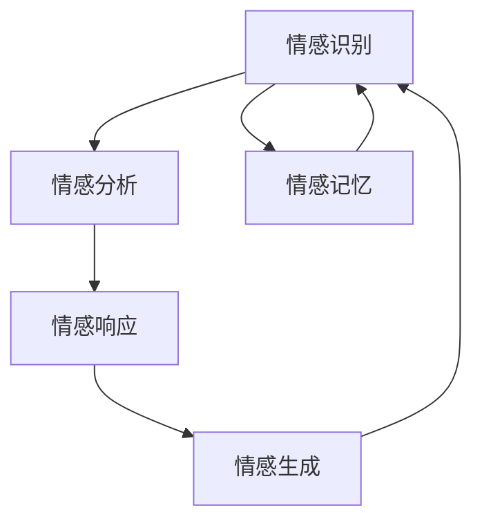

                 

# 大模型在情感交互中的应用挑战

## 1. 背景介绍

### 1.1 问题由来
在当前的人工智能领域，情感交互是其中一个极具挑战性的研究方向。它涉及如何使机器能够理解并回应人类的情感状态，以此来提升人机交互的自然性和互动性。情感交互不仅是自然语言处理(NLP)领域的一个重要应用，也是虚拟助手、客服机器人等应用的核心功能之一。

然而，情感交互的实现并非易事。传统的基于规则的情感识别和响应系统，往往难以捕捉到人类情感的复杂性和多样性。而基于大模型的情感交互系统，尽管在精度和泛化能力上取得了显著的进步，但仍然面临着诸多挑战。

### 1.2 问题核心关键点
在大模型应用于情感交互的过程中，主要面临以下几个核心问题：

- **情感理解的准确性**：大模型在理解人类情感上的准确性和鲁棒性还有待提升。
- **情感回应的自然性**：模型的情感回应是否能够自然、流畅地与人类对话。
- **交互系统的可解释性**：情感交互系统的决策过程是否透明、可解释。
- **用户隐私保护**：如何在情感交互中保护用户的隐私，避免不当数据使用。
- **跨文化适应性**：模型在不同文化背景下的适用性。
- **计算资源需求**：情感交互系统在实时性和计算效率上的需求。

### 1.3 问题研究意义
研究大模型在情感交互中的应用挑战，对于推动情感计算技术的进步、提升人机交互的互动性和自然性，以及保障用户隐私，具有重要的意义：

- **提升人机交互体验**：情感交互能够使机器更好地理解人类情感，从而提供更加自然和贴合的对话。
- **促进人工智能应用**：情感交互是自然语言处理和人工智能的重要分支，研究其应用挑战能够促进整个领域的技术进步。
- **保障用户隐私**：情感交互中涉及大量敏感信息，如何保护用户隐私是必须考虑的重要问题。
- **拓展跨文化应用**：情感交互技术在不同文化背景下的适用性，对于促进全球范围内的技术应用和交流具有重要价值。

## 2. 核心概念与联系

### 2.1 核心概念概述

情感交互涉及以下关键概念：

- **情感识别**：识别用户的情感状态，如高兴、悲伤、愤怒等。
- **情感生成**：生成符合用户情感状态的文本或语音输出。
- **情感分析**：分析用户输入的文本或语音，理解其情感色彩。
- **情感响应**：基于用户情感状态，自动生成适当的回应。
- **情感记忆**：在长期交互过程中，记录和分析用户情感变化。
- **情感交互系统**：集成情感识别、情感生成、情感分析、情感响应和情感记忆功能，提供连贯的自然交互体验。

这些概念之间存在着紧密的联系，共同构成了情感交互的核心框架：

- 情感识别和情感分析为情感响应提供基础。
- 情感生成和情感响应为情感识别和情感分析提供反馈和验证。
- 情感记忆在情感识别和情感响应之间起到桥梁作用，保持交互连贯性。

这些概念的整合，使得情感交互系统能够自然地理解和响应人类情感，从而提供更加人性化的交互体验。

### 2.2 核心概念原理和架构的 Mermaid 流程图



这个流程图展示了情感交互系统的主要流程和组件。情感识别模块负责识别用户的情感状态，情感分析模块对输入内容进行分析，情感响应模块根据分析结果生成回应，情感生成模块产生符合情感的输出，情感记忆模块记录用户的情感变化。这些模块相互协作，构成了情感交互系统的核心功能。

## 3. 核心算法原理 & 具体操作步骤

### 3.1 算法原理概述

基于大模型的情感交互系统，通常采用两种主要技术实现情感识别和响应：

- **监督学习**：使用标注好的情感数据集对模型进行训练，使模型能够从文本中识别情感。
- **无监督学习**：利用情感词汇表和情感词典，通过对文本的情感极性进行标注，训练模型进行情感分类。

### 3.2 算法步骤详解

**Step 1: 准备数据集**

1. **收集数据集**：收集用户与机器之间的对话数据，标注用户的情感状态。常用的数据集包括EmoInt、MSRA Sentiment180等。

2. **预处理数据**：对对话进行清洗，去除噪声和不相关信息。将文本分词，构建词向量表示。

3. **数据标注**：对每个对话中的用户情感状态进行标注。常用的标注方式有词袋模型、情感词典等。

**Step 2: 选择模型和算法**

1. **选择情感分类模型**：如BERT、LSTM等，对情感词汇进行训练。

2. **选择情感生成模型**：如GPT、T5等，基于已识别的情感状态生成回应。

3. **选择情感响应算法**：如规则匹配、机器学习等，基于情感状态选择最合适的回应。

**Step 3: 训练模型**

1. **训练情感分类模型**：使用标注好的数据集，通过监督学习或无监督学习训练情感分类器。

2. **训练情感生成模型**：使用标注好的数据集，训练生成模型，学习生成符合情感的文本或语音。

3. **训练情感响应算法**：使用标注好的数据集，训练情感响应模型，学习匹配情感和响应。

**Step 4: 部署和优化**

1. **部署模型**：将训练好的模型集成到情感交互系统中。

2. **优化系统**：对系统进行优化，如增加缓存、使用多线程等，提高响应速度和系统稳定性。

**Step 5: 测试和迭代**

1. **测试系统**：对系统进行测试，评估情感识别和响应的准确性和自然性。

2. **迭代优化**：根据测试结果，对模型进行微调，优化算法和系统。

### 3.3 算法优缺点

**监督学习情感分类**

优点：
- 准确性高，适用于标注数据充足的情况。
- 能够捕捉复杂情感变化，适用于多维度情感分析。

缺点：
- 对标注数据依赖性强，获取高质量标注数据成本高。
- 模型泛化能力有限，对于新情境可能效果不佳。

**无监督学习情感分类**

优点：
- 对标注数据依赖弱，适用于获取标注数据困难的情况。
- 可以自动扩展情感词典，提高情感分类能力。

缺点：
- 准确性可能不如监督学习高，需要更多训练时间和数据。
- 情感词典和词汇表需要手工构建，可能存在遗漏和误差。

**情感生成**

优点：
- 生成的文本或语音自然流畅，符合情感表达。
- 能够基于上下文信息生成更加贴合的回应。

缺点：
- 计算复杂度高，训练和推理时间较长。
- 生成的文本或语音可能存在歧义，难以完全理解。

**情感响应**

优点：
- 基于情感状态生成合适的回应，提升用户体验。
- 可以通过规则和机器学习结合，实现灵活的情感响应。

缺点：
- 规则匹配可能导致僵化的回应，不够灵活。
- 机器学习模型需要大量数据进行训练，可能存在过拟合。

### 3.4 算法应用领域

基于大模型的情感交互系统已经在多个领域得到应用，如客服、虚拟助手、社交机器人等。这些系统通过识别和理解用户的情感状态，提供个性化的回应和服务，极大地提升了用户体验和满意度。

## 4. 数学模型和公式 & 详细讲解

### 4.1 数学模型构建

情感交互系统的数学模型主要包含情感分类和情感生成两部分。

**情感分类模型**：
假设输入文本为 $x$，输出情感标签为 $y$，情感分类器可以表示为 $f(x; \theta)$，其中 $\theta$ 为模型参数。情感分类器的目标是最大化似然函数：

$$
\max_{\theta} P(y|x) = \max_{\theta} \frac{P(y|x)}{P(x)}
$$

**情感生成模型**：
假设生成模型为 $g(x'; \theta)$，其中 $x'$ 为生成的文本或语音，$\theta$ 为模型参数。情感生成模型的目标是最大化生成文本与真实文本的相似度：

$$
\max_{\theta} P(x'|x) = \max_{\theta} \frac{P(x'|x)}{P(x)}
$$

### 4.2 公式推导过程

**情感分类模型推导**：

$$
P(y|x) = \frac{P(y|x; \theta)P(x| \theta)}{P(x)}
$$

对似然函数取对数，得到交叉熵损失函数：

$$
L(\theta) = -\sum_{i=1}^N \sum_{y=1}^M y \log f(x_i; \theta)
$$

其中 $N$ 为样本数，$M$ 为情感类别数。

**情感生成模型推导**：

使用条件概率表示情感生成模型：

$$
P(x'|x; \theta) = \frac{P(x'; \theta)}{P(x; \theta)}
$$

对于连续文本生成任务，可以使用语言模型的对数似然损失函数：

$$
L(\theta) = -\sum_{i=1}^N \log P(x_i'; \theta)
$$

### 4.3 案例分析与讲解

以BERT模型为例，展示情感分类模型的实现过程。

1. **数据准备**：收集标注好的情感数据集，对数据进行预处理，包括分词、构建词向量表示等。

2. **模型构建**：使用BERT作为情感分类模型，构建情感分类器 $f(x; \theta)$。

3. **损失函数**：使用交叉熵损失函数 $L(\theta)$ 来训练模型。

4. **模型训练**：使用标注好的数据集对模型进行训练，最小化损失函数。

5. **模型评估**：在测试集上评估模型性能，调整超参数。

6. **情感生成**：使用训练好的情感分类器，对新输入的文本进行情感分类。

7. **生成回应**：根据情感分类结果，使用情感生成模型生成回应。

## 5. 项目实践：代码实例和详细解释说明

### 5.1 开发环境搭建

开发环境搭建主要涉及Python、PyTorch等工具的安装和使用。以下是基本的开发环境搭建步骤：

1. **安装Anaconda**：从官网下载并安装Anaconda，用于创建独立的Python环境。

2. **创建虚拟环境**：
```bash
conda create -n my_env python=3.7
conda activate my_env
```

3. **安装PyTorch**：
```bash
conda install pytorch torchvision torchaudio
```

4. **安装其他库**：
```bash
pip install transformers sacremoses pandas numpy
```

### 5.2 源代码详细实现

以下是一个使用BERT进行情感分类的示例代码，包括数据预处理、模型构建和训练等步骤。

```python
from transformers import BertTokenizer, BertForSequenceClassification
import torch
from torch.utils.data import DataLoader
from sklearn.model_selection import train_test_split

# 加载预训练的BERT模型和分词器
tokenizer = BertTokenizer.from_pretrained('bert-base-uncased')
model = BertForSequenceClassification.from_pretrained('bert-base-uncased', num_labels=2)

# 准备数据集
sentences = ['This movie is great!', 'I hate this movie.']
labels = [1, 0]
encoded_input = tokenizer(sentences, return_tensors='pt')

# 划分训练集和测试集
train_texts, test_texts, train_labels, test_labels = train_test_split(sentences, labels, test_size=0.2, random_state=42)

# 训练模型
model.train()
optimizer = torch.optim.Adam(model.parameters(), lr=2e-5)
for epoch in range(3):
    for batch in DataLoader(encoded_input, batch_size=1):
        input_ids = batch['input_ids']
        attention_mask = batch['attention_mask']
        labels = batch['labels']
        outputs = model(input_ids, attention_mask=attention_mask, labels=labels)
        loss = outputs.loss
        optimizer.zero_grad()
        loss.backward()
        optimizer.step()
```

### 5.3 代码解读与分析

这段代码展示了使用BERT模型进行情感分类的基本流程。首先，加载预训练的BERT模型和分词器，准备训练数据集。然后，划分训练集和测试集，使用Adam优化器对模型进行训练。训练过程中，通过反向传播更新模型参数，最小化损失函数。最后，在测试集上评估模型性能。

## 6. 实际应用场景

### 6.1 智能客服系统

智能客服系统可以集成情感交互功能，通过情感识别和情感响应，提升客户满意度。具体应用场景包括：

1. **情感分析**：系统自动分析客户对话中的情感，识别客户情绪。

2. **情感响应**：根据客户情感状态，生成合适的回复，如安抚客户情绪、提供解决方案等。

3. **情感记忆**：记录客户的历史情感变化，提供个性化服务。

通过情感交互功能，智能客服系统能够更加自然、智能地与客户沟通，提升客户体验，减少人工客服的负担。

### 6.2 虚拟助手

虚拟助手集成情感交互功能，能够提供更加人性化的交互体验。具体应用场景包括：

1. **情感识别**：通过语音或文字输入识别用户情感状态。

2. **情感生成**：基于情感状态，生成自然流畅的回应。

3. **情感记忆**：记录用户的历史情感状态，提供个性化服务。

通过情感交互功能，虚拟助手能够更好地理解用户需求，提供更加贴心和个性化的服务。

### 6.3 社交机器人

社交机器人通过情感交互功能，能够与用户进行自然、流畅的对话，提升用户体验。具体应用场景包括：

1. **情感识别**：通过对话识别用户情感状态。

2. **情感生成**：基于情感状态，生成适当的回应。

3. **情感记忆**：记录用户的历史情感变化，提供个性化服务。

通过情感交互功能，社交机器人能够更好地理解用户需求，提供更加自然和个性化的服务。

## 7. 工具和资源推荐

### 7.1 学习资源推荐

1. **《情感计算与社交情感计算》**：由Pavlos Fantos等撰写，全面介绍了情感计算的基本概念、方法和应用。

2. **《自然语言处理综论》**：由Daniel Jurafsky和James H. Martin撰写，介绍了自然语言处理的各个方面，包括情感分析等。

3. **《情感分析与计算》**：由Vincent Tan等撰写，介绍了情感分析的基本方法和应用。

4. **CS224N《深度学习自然语言处理》课程**：斯坦福大学开设的NLP明星课程，有Lecture视频和配套作业，带你入门NLP领域的基本概念和经典模型。

5. **《Transformers from Scratch》**：由Zachary Adams撰写，介绍了Transformers模型的基本原理和实现方法。

### 7.2 开发工具推荐

1. **PyTorch**：基于Python的开源深度学习框架，灵活动态的计算图，适合快速迭代研究。

2. **TensorFlow**：由Google主导开发的开源深度学习框架，生产部署方便，适合大规模工程应用。

3. **Transformers库**：HuggingFace开发的NLP工具库，集成了众多SOTA语言模型，支持PyTorch和TensorFlow，是进行情感交互任务开发的利器。

4. **Weights & Biases**：模型训练的实验跟踪工具，可以记录和可视化模型训练过程中的各项指标，方便对比和调优。

5. **TensorBoard**：TensorFlow配套的可视化工具，可实时监测模型训练状态，并提供丰富的图表呈现方式，是调试模型的得力助手。

### 7.3 相关论文推荐

1. **"Attention is All You Need"**：提出的Transformer结构，开启了NLP领域的预训练大模型时代。

2. **"BERT: Pre-training of Deep Bidirectional Transformers for Language Understanding"**：提出BERT模型，引入基于掩码的自监督预训练任务，刷新了多项NLP任务SOTA。

3. **"Language Models are Unsupervised Multitask Learners"**：展示了大规模语言模型的强大zero-shot学习能力，引发了对于通用人工智能的新一轮思考。

4. **"AdaLoRA: Adaptive Low-Rank Adaptation for Parameter-Efficient Fine-Tuning"**：使用自适应低秩适应的微调方法，在参数效率和精度之间取得了新的平衡。

5. **"Few-shot Text Classification with Pretrained Language Models"**：提出基于预训练语言模型的few-shot文本分类方法，提升了模型在少样本学习任务上的性能。

## 8. 总结：未来发展趋势与挑战

### 8.1 总结

本文对大模型在情感交互中的应用挑战进行了全面系统的介绍。首先阐述了情感交互的研究背景和意义，明确了情感交互在大模型应用中的重要性。其次，从原理到实践，详细讲解了情感交互的数学模型和实现步骤，给出了情感交互任务开发的完整代码实例。同时，本文还广泛探讨了情感交互在客服、虚拟助手、社交机器人等实际应用中的实现方法，展示了情感交互范式的广泛应用前景。

通过本文的系统梳理，可以看到，情感交互技术的研发和应用正在不断进步，为实现更加自然、智能的人机交互提供了新的可能性。未来，伴随大语言模型的不断演进，情感交互技术也将迎来更多的创新和突破。

### 8.2 未来发展趋势

展望未来，情感交互技术将呈现以下几个发展趋势：

1. **多模态情感交互**：未来的情感交互将不仅仅局限于文本，还将融合语音、图像等多模态信息，提供更加全面的情感识别和回应。

2. **自监督和少样本学习**：使用自监督和少样本学习方法，减少对标注数据的依赖，提升模型的泛化能力。

3. **跨领域和跨文化适应**：情感交互技术将在不同文化背景和领域中得到广泛应用，提升全球范围内的情感计算能力。

4. **实时情感分析**：在实时交互过程中，动态分析用户情感状态，提供及时的情感回应和反馈。

5. **可解释性和透明度**：增强情感交互系统的可解释性和透明度，让用户理解模型的决策过程。

6. **伦理和安全**：关注情感交互技术的伦理和安全问题，避免数据滥用和模型偏见。

这些趋势凸显了情感交互技术的广阔前景。情感交互技术的进一步发展，将为构建更加自然、智能的人机交互系统提供更坚实的基础。

### 8.3 面临的挑战

尽管情感交互技术在不断进步，但仍面临着诸多挑战：

1. **情感理解的准确性**：如何提高情感识别的准确性和鲁棒性，尤其在复杂情感和多维度情感变化的情况下。

2. **情感回应的自然性**：如何生成更加自然流畅、符合人类情感表达的回应。

3. **交互系统的可解释性**：如何增强情感交互系统的可解释性和透明度，让用户理解模型的决策过程。

4. **用户隐私保护**：如何在情感交互中保护用户隐私，避免不当数据使用。

5. **跨文化适应性**：情感交互技术在不同文化背景下的适用性，对于促进全球范围内的技术应用和交流具有重要价值。

6. **计算资源需求**：情感交互系统在实时性和计算效率上的需求，如何实现高效计算和资源优化。

这些挑战需要学术界和工业界共同努力，通过技术创新和实际应用，不断克服和解决。

### 8.4 研究展望

未来的研究需要在以下几个方面寻求新的突破：

1. **多模态情感识别**：结合语音、图像等多模态信息，提升情感识别的准确性和鲁棒性。

2. **生成对抗网络**：引入生成对抗网络，提高情感回应的自然性和多样性。

3. **混合模型**：将符号化的先验知识和神经网络模型进行结合，提升情感交互系统的决策能力。

4. **模型压缩**：对情感交互模型进行压缩和优化，提升计算效率和推理速度。

5. **伦理和法律研究**：关注情感交互技术的伦理和安全问题，制定相关法律法规，确保技术应用的合规性。

这些研究方向将推动情感交互技术向更加智能化、普适化方向发展，为构建更加自然、智能的人机交互系统提供新的动力。

## 9. 附录：常见问题与解答

**Q1：情感交互是否适用于所有应用场景？**

A: 情感交互在大多数应用场景中都能发挥作用，但对于一些特殊场景，如医疗、金融等，可能需要结合领域知识和专家系统，才能更好地理解用户情感。此外，对于一些需要高精度和高可靠性的应用，情感交互也需要进一步优化和完善。

**Q2：情感交互的计算资源需求如何？**

A: 情感交互系统在计算资源需求方面较大，尤其是对于实时情感分析和回应。对于大规模和高频次交互的场景，需要使用高性能设备，如GPU/TPU，进行优化和加速。

**Q3：如何提高情感识别的准确性？**

A: 提高情感识别的准确性可以通过以下方法：
1. 使用更多的标注数据进行训练。
2. 引入多模态信息，如语音、图像等，提升情感识别的全面性。
3. 结合多种情感识别模型，如规则匹配、机器学习等，提升识别能力。

**Q4：情感交互系统如何进行实时情感分析？**

A: 进行实时情感分析需要以下步骤：
1. 对输入的对话进行分词和向量表示。
2. 使用情感分类模型对输入进行情感分类。
3. 根据分类结果，生成实时情感回应。
4. 不断迭代和优化情感分类模型，提升实时情感分析的准确性。

**Q5：情感交互系统如何保护用户隐私？**

A: 保护用户隐私可以通过以下方法：
1. 数据匿名化处理，去除个人信息。
2. 限制数据访问权限，确保数据安全。
3. 使用加密技术和安全协议，防止数据泄露。
4. 遵守相关法律法规，确保数据使用合规。

---

作者：禅与计算机程序设计艺术 / Zen and the Art of Computer Programming

