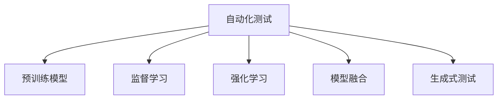

                 

# 大模型在自动化测试中的应用

> 关键词：自动化测试, 大模型, 预训练模型, 监督学习, 强化学习, 黑盒测试, 生成式测试, 模型融合, 智能测试工具

## 1. 背景介绍

### 1.1 问题由来
随着软件规模的不断增长，自动化测试已成为保障软件质量和效率的关键环节。传统自动化测试以脚本驱动为主，依赖人工编写和维护测试脚本，工作量大且维护成本高。近年来，随着深度学习和大模型技术的迅猛发展，越来越多的研究者和工业界人士探索使用大模型辅助自动化测试，以期大幅提升测试效率和测试质量。

### 1.2 问题核心关键点
大模型在自动化测试中的应用主要包括预训练模型、监督学习、强化学习等，具体体现在以下几个方面：

- **预训练模型**：通过在海量数据上预训练，模型能够学习到广泛的语义知识，适用于各种自然语言处理任务。
- **监督学习**：利用少量标注数据进行微调，使模型能够学习特定测试场景的特征，提升自动化测试的准确性。
- **强化学习**：通过在测试环境中进行不断迭代，模型能够逐步优化测试策略，提升自动化测试的完备性和覆盖率。

这些技术使大模型在自动化测试中表现出强大的泛化能力和自适应能力，有望解决传统测试方法的诸多难题。

### 1.3 问题研究意义
大模型在自动化测试中的应用，对于提升软件测试的自动化水平、提高测试效率、降低测试成本、提高软件质量具有重要意义：

1. **提升测试效率**：利用大模型可以快速生成测试用例、执行测试任务，大大减少人工介入，提升测试速度。
2. **降低测试成本**：自动化的测试脚本和测试数据生成能够节约大量人工编写和维护成本。
3. **提高测试质量**：大模型可以学习复杂语义和上下文关系，识别出更多潜在问题，提高测试覆盖率和发现率。
4. **支持多语言测试**：预训练模型可以处理多种语言，支持国际化和本地化测试需求。
5. **应对多变需求**：模型可以适应不同的测试场景和需求，具有较强的自适应性。

本文将全面系统地介绍大模型在自动化测试中的应用，涵盖预训练模型、监督学习、强化学习、模型融合等多个方面，为读者提供详尽的理论和实践指导。

## 2. 核心概念与联系

### 2.1 核心概念概述

为了更好地理解大模型在自动化测试中的应用，本节将介绍几个密切相关的核心概念：

- **自动化测试**：指在软件开发生命周期的各个阶段，通过工具自动化执行测试任务，验证软件的功能、性能、安全性等方面的能力。
- **预训练模型**：指在大量无标签数据上进行的自监督学习，学习通用的语言表示和模式，适用于各种NLP任务。
- **监督学习**：指在少量标注数据上进行的微调，利用已有标签指导模型学习特定任务特征。
- **强化学习**：指在测试环境中通过交互反馈不断优化模型决策策略，提升测试的完备性和覆盖率。
- **模型融合**：指将多个模型进行组合，提升测试的稳定性和鲁棒性。
- **生成式测试**：指利用模型生成测试数据，而非依赖人工编写脚本，具有较高的灵活性和自动化程度。

这些核心概念之间的逻辑关系可以通过以下Mermaid流程图来展示：



这个流程图展示了大模型在自动化测试中的核心概念及其之间的关系：

1. 自动化测试通过使用预训练模型，进行监督学习和强化学习，提升测试效率和质量。
2. 预训练模型提供了通用的语言表示，适用于多种测试任务。
3. 监督学习使模型适应特定测试场景，提升测试准确性。
4. 强化学习通过与测试环境的交互，不断优化测试策略。
5. 模型融合和生成式测试进一步提升测试系统的稳定性和自动化程度。

这些概念共同构成了大模型在自动化测试中的应用框架，使得模型能够更高效、更智能地执行测试任务。

## 3. 核心算法原理 & 具体操作步骤
### 3.1 算法原理概述

大模型在自动化测试中的应用，本质上是将预训练模型与自动化测试任务相结合，利用监督学习、强化学习等技术，提升测试的准确性和完备性。其核心思想是：

- **预训练模型**：在大规模无标签数据上进行的自监督学习，学习通用的语言表示和模式。
- **监督学习**：在少量标注数据上进行的微调，利用已有标签指导模型学习特定任务特征。
- **强化学习**：在测试环境中通过交互反馈不断优化模型决策策略，提升测试的完备性和覆盖率。

通过将大模型与测试任务相结合，模型能够学习到特定测试场景的特征，并在不断迭代中优化测试策略，提升测试效果。

### 3.2 算法步骤详解

基于大模型在自动化测试中的应用，本节将详细介绍其具体的操作步骤：

**Step 1: 准备预训练模型和数据集**
- 选择合适的预训练语言模型（如BERT、GPT等）作为初始化参数。
- 准备测试任务的数据集，划分为训练集、验证集和测试集。

**Step 2: 添加测试适配层**
- 根据测试任务类型，在预训练模型顶层设计合适的输出层和损失函数。
- 对于分类任务，通常在顶层添加线性分类器和交叉熵损失函数。
- 对于生成任务，通常使用语言模型的解码器输出概率分布，并以负对数似然为损失函数。

**Step 3: 设置测试超参数**
- 选择合适的优化算法及其参数，如Adam、SGD等，设置学习率、批大小、迭代轮数等。
- 设置正则化技术及强度，包括权重衰减、Dropout、Early Stopping等。
- 确定冻结预训练参数的策略，如仅微调顶层，或全部参数都参与微调。

**Step 4: 执行监督学习训练**
- 将训练集数据分批次输入模型，前向传播计算损失函数。
- 反向传播计算参数梯度，根据设定的优化算法和学习率更新模型参数。
- 周期性在验证集上评估模型性能，根据性能指标决定是否触发Early Stopping。
- 重复上述步骤直到满足预设的迭代轮数或Early Stopping条件。

**Step 5: 执行强化学习训练**
- 将测试集数据分批次输入模型，执行生成式测试任务，获取测试结果。
- 根据测试结果反馈，更新模型策略，执行迭代优化。
- 在测试环境中不断迭代，逐步优化测试策略，提升测试的完备性和覆盖率。

**Step 6: 测试和部署**
- 在测试集上评估微调后模型，对比微调前后的测试性能提升。
- 使用微调后的模型对新样本进行推理预测，集成到实际的应用系统中。
- 持续收集新的数据，定期重新微调模型，以适应数据分布的变化。

以上是基于大模型在自动化测试中的应用的一般流程。在实际应用中，还需要针对具体测试任务的特点，对微调过程的各个环节进行优化设计，如改进训练目标函数，引入更多的正则化技术，搜索最优的超参数组合等，以进一步提升测试性能。

### 3.3 算法优缺点

大模型在自动化测试中的应用，具有以下优点：
1. 快速生成测试用例：利用大模型的预训练能力，可以快速生成高质量的测试数据，提升测试效率。
2. 学习复杂语义：大模型能够学习到复杂的语义和上下文关系，识别出更多潜在问题，提高测试覆盖率和发现率。
3. 自动化程度高：利用监督学习和强化学习技术，测试过程高度自动化，减少人工干预。
4. 多语言支持：预训练模型支持多语言，适用于国际化和本地化测试需求。

同时，该方法也存在一定的局限性：
1. 依赖标注数据：监督学习效果很大程度上取决于标注数据的质量和数量，获取高质量标注数据的成本较高。
2. 迁移能力有限：当目标测试任务与预训练数据的分布差异较大时，监督学习的性能提升有限。
3. 模型规模大：预训练模型和微调模型规模较大，对计算资源和内存消耗较高。
4. 训练时间较长：预训练和微调过程可能需要较长的训练时间，测试任务的迭代优化也较为耗时。

尽管存在这些局限性，但就目前而言，大模型在自动化测试中的应用已展现出显著的潜力，成为提升测试效率和质量的重要手段。

### 3.4 算法应用领域

大模型在自动化测试中的应用，已经在多个领域得到了广泛应用，例如：

- **软件缺陷检测**：利用预训练模型进行文本匹配和分类，检测代码中的缺陷和漏洞。
- **功能测试**：通过生成式测试，自动生成各类输入数据，测试软件的各项功能。
- **性能测试**：利用强化学习技术，模拟用户行为，评估软件性能和稳定性。
- **安全测试**：检测网络安全漏洞和恶意代码，提升系统安全性。
- **回归测试**：自动化执行代码变更后的测试用例，及时发现回归问题。
- **用户体验测试**：模拟用户行为，评估软件的用户体验和可用性。

除了上述这些经典应用外，大模型在自动化测试中的应用还在不断扩展，如代码自动生成、数据驱动测试、测试用例优化等，为软件测试带来了新的突破。

## 4. 数学模型和公式 & 详细讲解  
### 4.1 数学模型构建

本节将使用数学语言对大模型在自动化测试中的应用进行更加严格的刻画。

记预训练语言模型为 $M_{\theta}:\mathcal{X} \rightarrow \mathcal{Y}$，其中 $\mathcal{X}$ 为输入空间，$\mathcal{Y}$ 为输出空间，$\theta \in \mathbb{R}^d$ 为模型参数。假设测试任务的数据集为 $D=\{(x_i,y_i)\}_{i=1}^N, x_i \in \mathcal{X}, y_i \in \mathcal{Y}$。

定义模型 $M_{\theta}$ 在输入 $x$ 上的损失函数为 $\ell(M_{\theta}(x),y)$，则在数据集 $D$ 上的经验风险为：

$$
\mathcal{L}(\theta) = \frac{1}{N} \sum_{i=1}^N \ell(M_{\theta}(x_i),y_i)
$$

微调的优化目标是最小化经验风险，即找到最优参数：

$$
\theta^* = \mathop{\arg\min}_{\theta} \mathcal{L}(\theta)
$$

在实践中，我们通常使用基于梯度的优化算法（如SGD、Adam等）来近似求解上述最优化问题。设 $\eta$ 为学习率，$\lambda$ 为正则化系数，则参数的更新公式为：

$$
\theta \leftarrow \theta - \eta \nabla_{\theta}\mathcal{L}(\theta) - \eta\lambda\theta
$$

其中 $\nabla_{\theta}\mathcal{L}(\theta)$ 为损失函数对参数 $\theta$ 的梯度，可通过反向传播算法高效计算。

### 4.2 公式推导过程

以下我们以软件缺陷检测任务为例，推导交叉熵损失函数及其梯度的计算公式。

假设模型 $M_{\theta}$ 在输入 $x$ 上的输出为 $\hat{y}=M_{\theta}(x) \in [0,1]$，表示样本属于正类的概率。真实标签 $y \in \{0,1\}$。则二分类交叉熵损失函数定义为：

$$
\ell(M_{\theta}(x),y) = -[y\log \hat{y} + (1-y)\log (1-\hat{y})]
$$

将其代入经验风险公式，得：

$$
\mathcal{L}(\theta) = -\frac{1}{N}\sum_{i=1}^N [y_i\log M_{\theta}(x_i)+(1-y_i)\log(1-M_{\theta}(x_i))]
$$

根据链式法则，损失函数对参数 $\theta_k$ 的梯度为：

$$
\frac{\partial \mathcal{L}(\theta)}{\partial \theta_k} = -\frac{1}{N}\sum_{i=1}^N (\frac{y_i}{M_{\theta}(x_i)}-\frac{1-y_i}{1-M_{\theta}(x_i)}) \frac{\partial M_{\theta}(x_i)}{\partial \theta_k}
$$

其中 $\frac{\partial M_{\theta}(x_i)}{\partial \theta_k}$ 可进一步递归展开，利用自动微分技术完成计算。

在得到损失函数的梯度后，即可带入参数更新公式，完成模型的迭代优化。重复上述过程直至收敛，最终得到适应测试任务的最优模型参数 $\theta^*$。

## 5. 项目实践：代码实例和详细解释说明
### 5.1 开发环境搭建

在进行测试任务开发前，我们需要准备好开发环境。以下是使用Python进行PyTorch开发的环境配置流程：

1. 安装Anaconda：从官网下载并安装Anaconda，用于创建独立的Python环境。

2. 创建并激活虚拟环境：
```bash
conda create -n pytorch-env python=3.8 
conda activate pytorch-env
```

3. 安装PyTorch：根据CUDA版本，从官网获取对应的安装命令。例如：
```bash
conda install pytorch torchvision torchaudio cudatoolkit=11.1 -c pytorch -c conda-forge
```

4. 安装Transformer库：
```bash
pip install transformers
```

5. 安装各类工具包：
```bash
pip install numpy pandas scikit-learn matplotlib tqdm jupyter notebook ipython
```

完成上述步骤后，即可在`pytorch-env`环境中开始测试任务开发。

### 5.2 源代码详细实现

这里以软件缺陷检测任务为例，给出使用Transformers库对BERT模型进行测试任务微调的PyTorch代码实现。

首先，定义软件缺陷检测任务的数据处理函数：

```python
from transformers import BertTokenizer
from torch.utils.data import Dataset
import torch

class DefectDetectionDataset(Dataset):
    def __init__(self, texts, tags, tokenizer, max_len=128):
        self.texts = texts
        self.tags = tags
        self.tokenizer = tokenizer
        self.max_len = max_len
        
    def __len__(self):
        return len(self.texts)
    
    def __getitem__(self, item):
        text = self.texts[item]
        tags = self.tags[item]
        
        encoding = self.tokenizer(text, return_tensors='pt', max_length=self.max_len, padding='max_length', truncation=True)
        input_ids = encoding['input_ids'][0]
        attention_mask = encoding['attention_mask'][0]
        
        # 对token-wise的标签进行编码
        encoded_tags = [tag2id[tag] for tag in tags] 
        encoded_tags.extend([tag2id['O']] * (self.max_len - len(encoded_tags)))
        labels = torch.tensor(encoded_tags, dtype=torch.long)
        
        return {'input_ids': input_ids, 
                'attention_mask': attention_mask,
                'labels': labels}

# 标签与id的映射
tag2id = {'O': 0, 'defect': 1}
id2tag = {v: k for k, v in tag2id.items()}

# 创建dataset
tokenizer = BertTokenizer.from_pretrained('bert-base-cased')

train_dataset = DefectDetectionDataset(train_texts, train_tags, tokenizer)
dev_dataset = DefectDetectionDataset(dev_texts, dev_tags, tokenizer)
test_dataset = DefectDetectionDataset(test_texts, test_tags, tokenizer)
```

然后，定义模型和优化器：

```python
from transformers import BertForTokenClassification, AdamW

model = BertForTokenClassification.from_pretrained('bert-base-cased', num_labels=len(tag2id))

optimizer = AdamW(model.parameters(), lr=2e-5)
```

接着，定义训练和评估函数：

```python
from torch.utils.data import DataLoader
from tqdm import tqdm
from sklearn.metrics import classification_report

device = torch.device('cuda') if torch.cuda.is_available() else torch.device('cpu')
model.to(device)

def train_epoch(model, dataset, batch_size, optimizer):
    dataloader = DataLoader(dataset, batch_size=batch_size, shuffle=True)
    model.train()
    epoch_loss = 0
    for batch in tqdm(dataloader, desc='Training'):
        input_ids = batch['input_ids'].to(device)
        attention_mask = batch['attention_mask'].to(device)
        labels = batch['labels'].to(device)
        model.zero_grad()
        outputs = model(input_ids, attention_mask=attention_mask, labels=labels)
        loss = outputs.loss
        epoch_loss += loss.item()
        loss.backward()
        optimizer.step()
    return epoch_loss / len(dataloader)

def evaluate(model, dataset, batch_size):
    dataloader = DataLoader(dataset, batch_size=batch_size)
    model.eval()
    preds, labels = [], []
    with torch.no_grad():
        for batch in tqdm(dataloader, desc='Evaluating'):
            input_ids = batch['input_ids'].to(device)
            attention_mask = batch['attention_mask'].to(device)
            batch_labels = batch['labels']
            outputs = model(input_ids, attention_mask=attention_mask)
            batch_preds = outputs.logits.argmax(dim=2).to('cpu').tolist()
            batch_labels = batch_labels.to('cpu').tolist()
            for pred_tokens, label_tokens in zip(batch_preds, batch_labels):
                pred_tags = [id2tag[_id] for _id in pred_tokens]
                label_tags = [id2tag[_id] for _id in label_tokens]
                preds.append(pred_tags[:len(label_tags)])
                labels.append(label_tags)
                
    print(classification_report(labels, preds))
```

最后，启动训练流程并在测试集上评估：

```python
epochs = 5
batch_size = 16

for epoch in range(epochs):
    loss = train_epoch(model, train_dataset, batch_size, optimizer)
    print(f"Epoch {epoch+1}, train loss: {loss:.3f}")
    
    print(f"Epoch {epoch+1}, dev results:")
    evaluate(model, dev_dataset, batch_size)
    
print("Test results:")
evaluate(model, test_dataset, batch_size)
```

以上就是使用PyTorch对BERT进行软件缺陷检测任务微调的完整代码实现。可以看到，得益于Transformers库的强大封装，我们可以用相对简洁的代码完成BERT模型的加载和微调。

### 5.3 代码解读与分析

让我们再详细解读一下关键代码的实现细节：

**DefectDetectionDataset类**：
- `__init__`方法：初始化文本、标签、分词器等关键组件。
- `__len__`方法：返回数据集的样本数量。
- `__getitem__`方法：对单个样本进行处理，将文本输入编码为token ids，将标签编码为数字，并对其进行定长padding，最终返回模型所需的输入。

**tag2id和id2tag字典**：
- 定义了标签与数字id之间的映射关系，用于将token-wise的预测结果解码回真实的标签。

**训练和评估函数**：
- 使用PyTorch的DataLoader对数据集进行批次化加载，供模型训练和推理使用。
- 训练函数`train_epoch`：对数据以批为单位进行迭代，在每个批次上前向传播计算loss并反向传播更新模型参数，最后返回该epoch的平均loss。
- 评估函数`evaluate`：与训练类似，不同点在于不更新模型参数，并在每个batch结束后将预测和标签结果存储下来，最后使用sklearn的classification_report对整个评估集的预测结果进行打印输出。

**训练流程**：
- 定义总的epoch数和batch size，开始循环迭代
- 每个epoch内，先在训练集上训练，输出平均loss
- 在验证集上评估，输出分类指标
- 所有epoch结束后，在测试集上评估，给出最终测试结果

可以看到，PyTorch配合Transformers库使得BERT微调的代码实现变得简洁高效。开发者可以将更多精力放在数据处理、模型改进等高层逻辑上，而不必过多关注底层的实现细节。

当然，工业级的系统实现还需考虑更多因素，如模型的保存和部署、超参数的自动搜索、更灵活的任务适配层等。但核心的微调范式基本与此类似。

## 6. 实际应用场景
### 6.1 智能测试工具

基于大模型在自动化测试中的应用，可以开发出多种智能测试工具，以提升测试效率和测试质量。

1. **自动化测试用例生成**：利用预训练模型生成多种测试用例，提升测试覆盖率。
2. **代码缺陷检测**：通过预训练模型检测代码中的潜在缺陷，提高代码质量。
3. **系统性能测试**：利用强化学习技术，模拟用户行为，评估系统性能和稳定性。
4. **应用程序安全测试**：利用大模型检测应用程序中的安全漏洞，提升系统安全性。

这些工具将显著降低测试成本，缩短测试周期，提升测试质量，助力企业加速产品上线。

### 6.2 智能运维平台

智能运维平台也是大模型在自动化测试中的一个重要应用场景。通过利用大模型进行监控、告警和故障诊断，可以提升系统的稳定性和可维护性。

1. **系统监控**：利用生成式测试和监督学习技术，实时监控系统运行状态，及时发现异常。
2. **告警处理**：利用强化学习技术，优化告警处理策略，提升告警准确性和及时性。
3. **故障诊断**：通过预训练模型分析日志和异常信息，快速定位故障原因。

这些技术将使运维工作更加自动化和智能化，降低运维成本，提升服务质量。

### 6.3 智能研发支持

大模型在研发过程中也有广泛的应用。通过利用大模型进行代码审查、需求分析和设计验证，可以提升研发效率和质量。

1. **代码审查**：利用预训练模型检测代码中的潜在问题，提升代码质量。
2. **需求分析**：利用大模型理解用户需求，快速生成需求文档和设计方案。
3. **设计验证**：利用生成式测试和强化学习技术，验证系统设计的正确性和完备性。

这些技术将大大提升研发效率，降低研发成本，提高软件质量。

### 6.4 未来应用展望

随着大模型和测试技术的发展，基于大模型的自动化测试将在更多领域得到应用，为软件和系统的自动化测试带来新的突破。

1. **多模态测试**：结合视觉、音频等多模态信息，提升测试的全面性和准确性。
2. **自动化测试策略优化**：利用强化学习技术，动态优化测试策略，提升测试覆盖率和效率。
3. **跨平台测试**：通过迁移学习和多模型融合技术，实现不同平台和环境下的测试统一。
4. **智能测试平台**：构建统一的测试平台，整合多种测试工具和方法，提升测试系统的可扩展性和灵活性。

未来，大模型在自动化测试中的应用将更加广泛和深入，为软件和系统的自动化测试带来新的变革。

## 7. 工具和资源推荐
### 7.1 学习资源推荐

为了帮助开发者系统掌握大模型在自动化测试中的应用理论基础和实践技巧，这里推荐一些优质的学习资源：

1. **《Transformer from the Basics to the Advanced》**系列博文：由大模型技术专家撰写，深入浅出地介绍了Transformer原理、BERT模型、微调技术等前沿话题。

2. **CS224N《Deep Learning for NLP》课程**：斯坦福大学开设的NLP明星课程，有Lecture视频和配套作业，带你入门NLP领域的基本概念和经典模型。

3. **《Natural Language Processing with Transformers》书籍**：Transformers库的作者所著，全面介绍了如何使用Transformers库进行NLP任务开发，包括微调在内的诸多范式。

4. **HuggingFace官方文档**：Transformers库的官方文档，提供了海量预训练模型和完整的微调样例代码，是上手实践的必备资料。

5. **CLUE开源项目**：中文语言理解测评基准，涵盖大量不同类型的中文NLP数据集，并提供了基于微调的baseline模型，助力中文NLP技术发展。

通过对这些资源的学习实践，相信你一定能够快速掌握大模型在自动化测试中的应用精髓，并用于解决实际的测试问题。
###  7.2 开发工具推荐

高效的开发离不开优秀的工具支持。以下是几款用于大模型在自动化测试中开发常用的工具：

1. **PyTorch**：基于Python的开源深度学习框架，灵活动态的计算图，适合快速迭代研究。大部分预训练语言模型都有PyTorch版本的实现。

2. **TensorFlow**：由Google主导开发的开源深度学习框架，生产部署方便，适合大规模工程应用。同样有丰富的预训练语言模型资源。

3. **Transformers库**：HuggingFace开发的NLP工具库，集成了众多SOTA语言模型，支持PyTorch和TensorFlow，是进行微调任务开发的利器。

4. **Weights & Biases**：模型训练的实验跟踪工具，可以记录和可视化模型训练过程中的各项指标，方便对比和调优。与主流深度学习框架无缝集成。

5. **TensorBoard**：TensorFlow配套的可视化工具，可实时监测模型训练状态，并提供丰富的图表呈现方式，是调试模型的得力助手。

6. **Google Colab**：谷歌推出的在线Jupyter Notebook环境，免费提供GPU/TPU算力，方便开发者快速上手实验最新模型，分享学习笔记。

合理利用这些工具，可以显著提升大模型在自动化测试中的开发效率，加快创新迭代的步伐。

### 7.3 相关论文推荐

大模型在自动化测试中的应用源于学界的持续研究。以下是几篇奠基性的相关论文，推荐阅读：

1. **Attention is All You Need**：提出了Transformer结构，开启了NLP领域的预训练大模型时代。

2. **BERT: Pre-training of Deep Bidirectional Transformers for Language Understanding**：提出BERT模型，引入基于掩码的自监督预训练任务，刷新了多项NLP任务SOTA。

3. **Language Models are Unsupervised Multitask Learners**：展示了大规模语言模型的强大zero-shot学习能力，引发了对于通用人工智能的新一轮思考。

4. **Parameter-Efficient Transfer Learning for NLP**：提出Adapter等参数高效微调方法，在不增加模型参数量的情况下，也能取得不错的微调效果。

5. **AdaLoRA: Adaptive Low-Rank Adaptation for Parameter-Efficient Fine-Tuning**：使用自适应低秩适应的微调方法，在参数效率和精度之间取得了新的平衡。

6. **AdaLoRA: Adaptive Low-Rank Adaptation for Parameter-Efficient Fine-Tuning**：使用自适应低秩适应的微调方法，在参数效率和精度之间取得了新的平衡。

这些论文代表了大模型在自动化测试技术的发展脉络。通过学习这些前沿成果，可以帮助研究者把握学科前进方向，激发更多的创新灵感。

## 8. 总结：未来发展趋势与挑战

### 8.1 总结

本文对大模型在自动化测试中的应用进行了全面系统的介绍。首先阐述了大模型在自动化测试中的研究背景和意义，明确了其在大模型微调中的独特价值。其次，从原理到实践，详细讲解了监督学习、强化学习等大模型微调方法的具体操作步骤，给出了完整的代码实现。同时，本文还广泛探讨了大模型在自动化测试中的多种应用场景，展示了其广泛的应用前景。最后，本文精选了相关学习资源和开发工具，力求为读者提供全方位的技术指引。

通过本文的系统梳理，可以看到，大模型在自动化测试中的应用，能够显著提升测试效率和测试质量，助力软件和系统的快速迭代。未来，伴随大模型和测试技术的持续演进，基于大模型的自动化测试必将迎来新的发展机遇，为软件和系统自动化测试带来革命性变化。

### 8.2 未来发展趋势

展望未来，大模型在自动化测试中的应用将呈现以下几个发展趋势：

1. **模型规模持续增大**：随着算力成本的下降和数据规模的扩张，预训练语言模型的参数量还将持续增长。超大规模语言模型蕴含的丰富语言知识，有望支撑更加复杂多变的自动化测试任务。

2. **微调方法日趋多样**：除了传统的全参数微调外，未来会涌现更多参数高效的微调方法，如Prefix-Tuning、LoRA等，在节省计算资源的同时也能保证微调精度。

3. **持续学习成为常态**：随着数据分布的不断变化，微调模型也需要持续学习新知识以保持性能。如何在不遗忘原有知识的同时，高效吸收新样本信息，将成为重要的研究课题。

4. **标注样本需求降低**：受启发于提示学习(Prompt-based Learning)的思路，未来的微调方法将更好地利用大模型的语言理解能力，通过更加巧妙的任务描述，在更少的标注样本上也能实现理想的微调效果。

5. **多模态微调崛起**：当前的微调主要聚焦于纯文本数据，未来会进一步拓展到图像、视频、语音等多模态数据微调。多模态信息的融合，将显著提升语言模型对现实世界的理解和建模能力。

6. **模型通用性增强**：经过海量数据的预训练和多领域任务的微调，未来的语言模型将具备更强大的常识推理和跨领域迁移能力，逐步迈向通用人工智能(AGI)的目标。

以上趋势凸显了大模型在自动化测试技术的应用前景。这些方向的探索发展，必将进一步提升测试系统的性能和应用范围，为软件和系统的自动化测试带来新的突破。

### 8.3 面临的挑战

尽管大模型在自动化测试中的应用已展现出显著的潜力，但在迈向更加智能化、普适化应用的过程中，它仍面临着诸多挑战：

1. **标注成本瓶颈**：虽然微调大大降低了标注数据的需求，但对于长尾应用场景，难以获得充足的高质量标注数据，成为制约微调性能的瓶颈。如何进一步降低微调对标注样本的依赖，将是一大难题。

2. **模型鲁棒性不足**：当前微调模型面对域外数据时，泛化性能往往大打折扣。对于测试样本的微小扰动，微调模型的预测也容易发生波动。如何提高微调模型的鲁棒性，避免灾难性遗忘，还需要更多理论和实践的积累。

3. **推理效率有待提高**：大规模语言模型虽然精度高，但在实际部署时往往面临推理速度慢、内存占用大等效率问题。如何在保证性能的同时，简化模型结构，提升推理速度，优化资源占用，将是重要的优化方向。

4. **可解释性亟需加强**：当前微调模型更像是"黑盒"系统，难以解释其内部工作机制和决策逻辑。对于医疗、金融等高风险应用，算法的可解释性和可审计性尤为重要。如何赋予微调模型更强的可解释性，将是亟待攻克的难题。

5. **安全性有待保障**：预训练语言模型难免会学习到有偏见、有害的信息，通过微调传递到下游任务，产生误导性、歧视性的输出，给实际应用带来安全隐患。如何从数据和算法层面消除模型偏见，避免恶意用途，确保输出的安全性，也将是重要的研究课题。

6. **知识整合能力不足**：现有的微调模型往往局限于任务内数据，难以灵活吸收和运用更广泛的先验知识。如何让微调过程更好地与外部知识库、规则库等专家知识结合，形成更加全面、准确的信息整合能力，还有很大的想象空间。

正视微调面临的这些挑战，积极应对并寻求突破，将是大模型在自动化测试技术走向成熟的必由之路。相信随着学界和产业界的共同努力，这些挑战终将一一被克服，大模型在自动化测试中的应用必将在构建智能测试系统、提升软件质量方面发挥更大作用。

### 8.4 研究展望

面对大模型在自动化测试中所面临的挑战，未来的研究需要在以下几个方面寻求新的突破：

1. **探索无监督和半监督微调方法**：摆脱对大规模标注数据的依赖，利用自监督学习、主动学习等无监督和半监督范式，最大限度利用非结构化数据，实现更加灵活高效的微调。

2. **研究参数高效和计算高效的微调范式**：开发更加参数高效的微调方法，在固定大部分预训练参数的同时，只更新极少量的任务相关参数。同时优化微调模型的计算图，减少前向传播和反向传播的资源消耗，实现更加轻量级、实时性的部署。

3. **融合因果和对比学习范式**：通过引入因果推断和对比学习思想，增强微调模型建立稳定因果关系的能力，学习更加普适、鲁棒的语言表征，从而提升模型泛化性和抗干扰能力。

4. **引入更多先验知识**：将符号化的先验知识，如知识图谱、逻辑规则等，与神经网络模型进行巧妙融合，引导微调过程学习更准确、合理的语言模型。同时加强不同模态数据的整合，实现视觉、语音等多模态信息与文本信息的协同建模。

5. **结合因果分析和博弈论工具**：将因果分析方法引入微调模型，识别出模型决策的关键特征，增强输出解释的因果性和逻辑性。借助博弈论工具刻画人机交互过程，主动探索并规避模型的脆弱点，提高系统稳定性。

6. **纳入伦理道德约束**：在模型训练目标中引入伦理导向的评估指标，过滤和惩罚有偏见、有害的输出倾向。同时加强人工干预和审核，建立模型行为的监管机制，确保输出符合人类价值观和伦理道德。

这些研究方向的探索，必将引领大模型在自动化测试技术迈向更高的台阶，为构建安全、可靠、可解释、可控的智能测试系统铺平道路。面向未来，大模型在自动化测试技术还需要与其他人工智能技术进行更深入的融合，如知识表示、因果推理、强化学习等，多路径协同发力，共同推动自然语言理解和智能交互系统的进步。只有勇于创新、敢于突破，才能不断拓展语言模型的边界，让智能技术更好地造福人类社会。

## 9. 附录：常见问题与解答

**Q1：大模型在自动化测试中的应用是否适用于所有测试任务？**

A: 大模型在自动化测试中的应用主要适用于基于语言的任务，如代码缺陷检测、性能测试、安全测试等。但对于非语言的任务，如性能测试、稳定性测试等，可能效果有限。因此，在选择应用大模型时，需要根据具体测试任务的特性进行评估。

**Q2：如何选择合适的学习率？**

A: 微调的学习率一般要比预训练时小1-2个数量级，如果使用过大的学习率，容易破坏预训练权重，导致过拟合。一般建议从1e-5开始调参，逐步减小学习率，直至收敛。也可以使用warmup策略，在开始阶段使用较小的学习率，再逐渐过渡到预设值。需要注意的是，不同的优化器(如AdamW、Adafactor等)以及不同的学习率调度策略，可能需要设置不同的学习率阈值。

**Q3：使用大模型进行自动化测试时，是否需要考虑标注数据的质量和数量？**

A: 是的，标注数据的质量和数量对大模型的微调效果有着重要影响。标注数据需要尽量保持真实性、代表性，同时数量越多，微调效果越好。对于标注数据不足的任务，可以通过数据增强、迁移学习等方法进行补充。

**Q4：如何缓解微调过程中的过拟合问题？**

A: 过拟合是微调面临的主要挑战，尤其是在标注数据不足的情况下。常见的缓解策略包括：
1. 数据增强：通过回译、近义替换等方式扩充训练集
2. 正则化：使用L2正则、Dropout、Early Stopping等避免过拟合
3. 对抗训练：引入对抗样本，提高模型鲁棒性
4. 参数高效微调：只调整少量参数(如Adapter、Prefix等)，减小过拟合风险
5. 多模型集成：训练多个微调模型，取平均输出，抑制过拟合

这些策略往往需要根据具体任务和数据特点进行灵活组合。只有在数据、模型、训练、推理等各环节进行全面优化，才能最大限度地发挥大模型微调的威力。

**Q5：使用大模型进行自动化测试时，是否需要考虑计算资源和内存消耗？**

A: 是的，大规模语言模型虽然精度高，但在实际部署时往往面临推理速度慢、内存占用大等效率问题。需要在保证性能的同时，尽量优化模型结构和推理过程，减少计算资源和内存消耗。可以通过剪枝、量化、模型并行等技术手段进行优化。

**Q6：如何利用大模型进行自动化测试任务的优化？**

A: 利用大模型进行自动化测试任务的优化，主要包括以下几个步骤：
1. 准备预训练模型和数据集
2. 添加测试适配层
3. 设置测试超参数
4. 执行监督学习训练
5. 执行强化学习训练
6. 测试和部署

在每个步骤中，都可以通过调整算法参数、优化模型结构等方法，进一步提升测试任务的效果。例如，可以通过改进训练目标函数、引入更多正则化技术、搜索最优的超参数组合等，以进一步提升测试性能。

总之，大模型在自动化测试中的应用，需要结合具体任务的特点，不断迭代和优化模型、数据和算法，方能得到理想的效果。

---

作者：禅与计算机程序设计艺术 / Zen and the Art of Computer Programming

