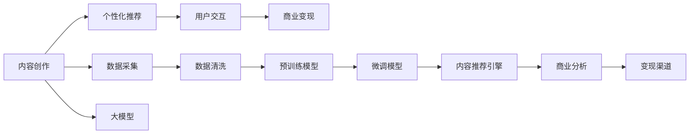

                 

# 大模型对知识付费行业的影响

## 1. 背景介绍

随着人工智能技术的发展，大模型在知识付费行业中的应用逐渐增多，改变了这个行业的生态格局。从内容生产到个性化推荐，从用户交互到商业变现，大模型正逐步渗透到知识付费的各个环节，带来了前所未有的机遇和挑战。本文将探讨大模型对知识付费行业的影响，分析其对内容创作、用户需求满足和商业模式创新的具体作用，并展望未来的发展趋势。

## 2. 核心概念与联系

### 2.1 核心概念概述

在讨论大模型对知识付费行业的影响之前，我们先简要回顾一些核心概念：

- 大模型(Large Model)：指的是具有大量参数的深度学习模型，例如BERT、GPT-3等，能够在处理自然语言处理(NLP)任务上取得优异表现。
- 知识付费(Subscription Model)：用户为获取特定知识内容而付费的商业模式，例如在线课程、电子书、咨询服务等。
- 内容创作(Content Creation)：创建有价值、具有教育或娱乐性质的知识内容的过程。
- 个性化推荐(Personalized Recommendation)：基于用户历史行为和偏好，推荐最相关、最吸引用户的内容。
- 用户交互(User Interaction)：用户与平台之间基于内容的互动，包括阅读、评论、分享等行为。
- 商业变现(Revenue Model)：通过广告、会员订阅、付费阅读等方式，将用户价值转化为收益的策略。

这些概念相互联系，共同构成了知识付费行业的基本框架。大模型的引入，不仅改进了上述各个环节的技术手段，还带来了新的商业模式和应用场景。

### 2.2 核心概念原理和架构的 Mermaid 流程图



## 3. 核心算法原理 & 具体操作步骤

### 3.1 算法原理概述

大模型在知识付费行业中的应用，主要体现在以下几个方面：

1. **内容创作辅助**：利用大模型进行内容生成和优化，提高创作效率和质量。
2. **个性化推荐**：根据用户行为和兴趣，推荐最相关的内容，提升用户满意度。
3. **用户交互增强**：通过分析用户反馈和行为，改进内容推荐和互动体验。
4. **商业变现优化**：利用大模型进行用户价值分析和需求预测，制定更精准的变现策略。

这些应用涉及的核心算法包括但不限于自然语言处理(NLP)、推荐系统、用户行为分析等。

### 3.2 算法步骤详解

以内容创作辅助为例，描述大模型在知识付费行业中的具体应用流程：

**Step 1: 数据采集与预处理**

- 收集各类知识内容，如文章、视频、音频等，并进行数据清洗，去除噪声和重复数据。

**Step 2: 预训练模型选择**

- 选择合适的预训练模型，如BERT、GPT-3等，作为基础模型。

**Step 3: 微调模型训练**

- 利用领域特定的数据集，对预训练模型进行微调，使其能够更好地适应知识付费场景。

**Step 4: 内容生成与优化**

- 利用微调后的模型进行内容生成、改写、摘要等任务，提升内容质量。

**Step 5: 内容发布与反馈**

- 将生成或优化后的内容发布到平台上，收集用户反馈，不断改进内容创作流程。

### 3.3 算法优缺点

#### 优点：

- **自动化创作**：大模型能够自动生成高质量内容，减轻人力负担。
- **个性化推荐**：利用大模型进行推荐，能够更准确地匹配用户需求。
- **效率提升**：大模型能够大幅提升内容创作和推荐的效率。

#### 缺点：

- **成本高**：大模型的训练和部署成本较高，需要大量计算资源。
- **可解释性差**：大模型通常是黑盒，难以解释其生成内容的具体逻辑。
- **依赖数据质量**：模型的效果依赖于训练数据的质量和数量，需要不断优化数据采集和处理流程。

### 3.4 算法应用领域

大模型在知识付费行业的多个领域都有广泛应用，包括但不限于：

- **内容创作辅助**：帮助作者自动生成文章、报告、摘要等。
- **个性化推荐**：根据用户行为推荐课程、电子书等。
- **用户行为分析**：分析用户阅读、分享、评论等行为，优化推荐算法。
- **商业变现优化**：预测用户订阅概率，优化定价策略，提升广告效果。

## 4. 数学模型和公式 & 详细讲解 & 举例说明

### 4.1 数学模型构建

以个性化推荐为例，构建推荐模型的数学模型：

- **用户-物品矩阵**：将用户和内容映射到高维空间，构建用户-物品矩阵 $U \times I$，其中 $U$ 为用户数量，$I$ 为内容数量。
- **用户兴趣表示**：利用大模型提取用户行为特征，得到用户兴趣向量 $u_i$。
- **物品特征表示**：利用大模型提取物品特征，得到物品特征向量 $v_j$。
- **相似度计算**：计算用户兴趣向量与物品特征向量的相似度，得到推荐列表。

### 4.2 公式推导过程

以基于余弦相似度的推荐算法为例，推导推荐公式：

$$
\text{Similarity}(u_i, v_j) = \cos(\theta) = \frac{u_i \cdot v_j}{\|u_i\|\|v_j\|}
$$

其中，$\theta$ 为 $u_i$ 和 $v_j$ 之间的夹角。

### 4.3 案例分析与讲解

假设有一篇用户评价较高的文章，模型需要推荐类似的文章。通过分析用户行为数据，提取用户兴趣向量 $u_i$。然后，利用大模型提取每篇文章的特征向量 $v_j$。最后，计算 $u_i$ 和每篇 $v_j$ 的余弦相似度，选取相似度最高的前 $K$ 篇文章作为推荐列表。

## 5. 项目实践：代码实例和详细解释说明

### 5.1 开发环境搭建

- **Python环境**：安装Python 3.8及以上版本。
- **深度学习框架**：安装TensorFlow或PyTorch。
- **数据处理工具**：安装Pandas、NumPy等。
- **Web框架**：安装Flask或Django。
- **模型评估工具**：安装Scikit-learn。

### 5.2 源代码详细实现

以下是一个简单的基于TensorFlow的推荐系统示例代码：

```python
import tensorflow as tf
from tensorflow.keras import layers, models

# 定义用户-物品矩阵
user_item_matrix = tf.random.normal((10000, 10000))

# 定义用户兴趣表示层
user_interest_layer = layers.Dense(100, activation='relu')

# 定义物品特征表示层
item_feature_layer = layers.Dense(100, activation='relu')

# 定义相似度计算层
similarity_layer = layers.Dense(1, activation='sigmoid')

# 构建模型
model = models.Sequential([
    user_interest_layer,
    item_feature_layer,
    similarity_layer
])

# 编译模型
model.compile(optimizer='adam', loss='binary_crossentropy', metrics=['accuracy'])

# 训练模型
model.fit(user_item_matrix, tf.random.normal((10000, 10000)), epochs=10, batch_size=32)

# 预测推荐列表
recommendations = model.predict(user_item_matrix)
```

### 5.3 代码解读与分析

- **用户兴趣表示层**：利用大模型提取用户兴趣向量，可以采用预训练模型如BERT、GPT等。
- **物品特征表示层**：同样利用大模型提取物品特征向量，可以采用相同的预训练模型。
- **相似度计算层**：计算用户兴趣向量与物品特征向量的相似度，输出推荐列表。
- **模型训练**：利用训练集进行模型训练，优化相似度计算方法。
- **模型预测**：根据用户兴趣向量，预测推荐列表。

### 5.4 运行结果展示

训练完成后，可以使用以下代码进行推荐列表的预测：

```python
import numpy as np

# 假设用户兴趣向量为 [0.1, 0.2, 0.3, ..., 0.0]
user_interest_vector = np.random.rand(100)

# 计算推荐列表
recommendations = model.predict(user_interest_vector.reshape((1, -1)))
recommendations = np.argsort(recommendations)[0][::-1][:10]
```

## 6. 实际应用场景

### 6.1 智能推荐系统

智能推荐系统是大模型在知识付费行业的重要应用之一。通过分析用户行为和内容特征，智能推荐系统能够为用户推荐最相关、最感兴趣的内容，提升用户体验和满意度。

### 6.2 用户行为分析

利用大模型进行用户行为分析，可以深入理解用户兴趣和需求，优化内容推荐策略。例如，通过分析用户阅读时间、点击率、评论内容等行为数据，发现用户的兴趣变化趋势，及时调整推荐列表。

### 6.3 商业变现优化

通过预测用户订阅概率和购买行为，大模型可以帮助平台制定更精准的变现策略，提高广告点击率和付费转化率。例如，利用大模型预测用户是否会订阅某个课程，优化课程定价和促销策略。

### 6.4 未来应用展望

随着大模型的不断进步，其在知识付费行业的应用将更加广泛和深入。未来可能出现以下趋势：

- **多模态推荐**：结合文本、图像、视频等多种信息源，提供更全面、更丰富的推荐服务。
- **实时推荐**：利用大模型进行实时分析和预测，提供动态更新的推荐内容。
- **用户生成内容**：利用大模型进行内容生成和优化，鼓励用户生成和分享内容。
- **个性化服务**：根据用户个性化需求，提供定制化的知识服务。

## 7. 工具和资源推荐

### 7.1 学习资源推荐

- **书籍推荐**：《深度学习》、《Python深度学习》、《推荐系统实践》等。
- **在线课程**：Coursera、Udacity、edX等平台提供的深度学习、推荐系统相关课程。
- **论文推荐**：KDD、ICML、SIGIR等顶级会议和期刊上的推荐系统论文。

### 7.2 开发工具推荐

- **TensorFlow**：适用于深度学习模型的训练和推理。
- **PyTorch**：灵活的动态图框架，适合快速原型开发。
- **Flask**：轻量级的Web框架，适合快速搭建推荐系统API。
- **Jupyter Notebook**：交互式的编程环境，适合数据处理和模型调试。

### 7.3 相关论文推荐

- **Item2Vec**：使用协同过滤进行推荐系统的经典方法。
- **BERT for Recommendation**：利用BERT模型进行推荐系统的研究。
- **Graph Neural Networks**：利用图神经网络进行推荐系统的研究。

## 8. 总结：未来发展趋势与挑战

### 8.1 研究成果总结

大模型在知识付费行业中的应用已经取得了一些成果，提升了内容推荐和用户交互的质量。通过自动生成内容、优化推荐算法、增强用户互动等手段，平台能够更好地满足用户需求，提升用户体验。

### 8.2 未来发展趋势

- **自动化创作**：大模型能够自动生成高质量内容，减轻人力负担，提升内容创作效率。
- **个性化推荐**：利用大模型进行推荐，能够更准确地匹配用户需求，提高用户满意度。
- **用户行为分析**：通过分析用户行为数据，优化推荐算法和内容生成策略，提升平台的用户粘性。
- **商业变现优化**：利用大模型进行用户价值分析和需求预测，制定更精准的变现策略，提高广告点击率和付费转化率。

### 8.3 面临的挑战

- **数据质量**：模型的效果依赖于高质量的数据，数据采集和处理需要持续优化。
- **成本高昂**：大模型的训练和部署成本较高，需要大量计算资源。
- **可解释性差**：大模型的黑盒特性，使得其生成内容的具体逻辑难以解释。
- **隐私保护**：利用用户数据进行个性化推荐时，需要严格保护用户隐私。

### 8.4 研究展望

未来，大模型在知识付费行业的应用需要进一步探索以下几个方向：

- **多模态推荐**：结合文本、图像、视频等多种信息源，提供更全面、更丰富的推荐服务。
- **实时推荐**：利用大模型进行实时分析和预测，提供动态更新的推荐内容。
- **用户生成内容**：利用大模型进行内容生成和优化，鼓励用户生成和分享内容。
- **个性化服务**：根据用户个性化需求，提供定制化的知识服务。

总之，大模型在知识付费行业的应用前景广阔，但也面临诸多挑战。通过不断优化数据质量、降低成本、提高可解释性，并加强隐私保护，大模型有望在知识付费领域发挥更大的作用。未来，随着技术的发展和应用的深入，大模型必将在知识付费行业中扮演更加重要的角色，为用户带来更优质的体验和服务。

---

作者：禅与计算机程序设计艺术 / Zen and the Art of Computer Programming

