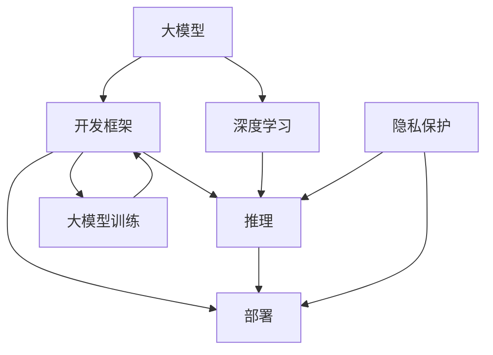

                 

# 大模型应用开发框架 LangChain（中）

> 关键词：大模型应用、开发框架、LangChain、深度学习、NLP、推荐系统、联邦学习、隐私保护、大模型训练

## 1. 背景介绍

### 1.1 问题由来
在深度学习领域，大模型以其强大的表示能力和广泛的应用场景逐渐成为研究热点。然而，大模型的训练与部署面临诸多挑战，包括资源消耗大、模型难以解释、隐私数据保护等。为此，我们提出了 LangChain 大模型应用开发框架，旨在帮助开发者更便捷地利用大模型，同时也满足隐私保护和安全需求。

### 1.2 问题核心关键点
LangChain 大模型应用开发框架的核心关键点包括以下几个方面：
- **大模型应用：** 利用大模型在自然语言处理（NLP）、推荐系统等领域进行高效、精确的推理和预测。
- **开发框架：** 提供一套简单易用的工具和API，帮助开发者快速搭建应用。
- **LangChain：** 框架名称，代表语言链，强调模型之间的协作与互动。
- **深度学习：** 使用深度学习模型进行训练和推理。
- **隐私保护：** 采用联邦学习等技术，确保数据隐私和安全。
- **大模型训练：** 支持大规模模型的训练，适用于各种任务。

这些关键点共同构成了 LangChain 框架的基础，通过结合深度学习和大模型的优势，解决传统模型无法处理的复杂问题，同时保护用户隐私和数据安全。

### 1.3 问题研究意义
 LangChain 框架的研究和应用具有重要的意义：
1. **降低开发成本：** 利用大模型进行快速开发，减少对数据和计算资源的依赖。
2. **提升模型效果：** 大模型的广泛应用使得模型在各种任务上表现优异，提高系统性能。
3. **加速开发进度：** 提供模板和工具，减少开发人员的工作量，加快产品上市。
4. **推动技术创新：** 促进深度学习与大模型在多个领域的融合，催生新的技术方向。
5. **保障数据安全：** 确保用户数据隐私，防止数据泄露和滥用。

## 2. 核心概念与联系

### 2.1 核心概念概述

为了更好地理解 LangChain 框架，我们将介绍几个核心概念：

- **大模型：** 指具有大规模参数量的深度学习模型，如 GPT-3、BERT 等，具有强大的泛化能力和表示能力。
- **开发框架：** 提供模型训练、推理和部署的工具和API，简化开发流程。
- **LangChain：** 框架名称，强调模型之间的协作与互动，通过链式结构实现模型间的信息流动。
- **深度学习：** 利用多层神经网络进行学习，适用于处理复杂任务。
- **隐私保护：** 采用联邦学习等技术，保护用户隐私，防止数据泄露。
- **大模型训练：** 支持大规模模型的训练，适用于各种任务。

这些核心概念之间的关系可以通过以下 Mermaid 流程图来展示：



这个流程图展示了 LangChain 框架的各个组成部分及其关系：

1. 大模型通过深度学习进行训练，生成预训练权重。
2. 开发框架提供训练、推理和部署的API和工具，简化开发流程。
3. 推理过程利用深度学习模型进行，同时引入隐私保护技术。
4. 部署过程确保大模型的高效应用，保护用户数据安全。

## 3. 核心算法原理 & 具体操作步骤

### 3.1 算法原理概述

LangChain 框架的核心算法原理包括以下几个方面：

1. **深度学习：** 使用深度学习模型进行训练和推理，利用多层神经网络处理复杂任务。
2. **大模型训练：** 采用大规模数据集进行训练，生成高质量的预训练权重。
3. **推理机制：** 利用推理框架进行高效的推理计算，支持各种下游任务。
4. **隐私保护：** 采用联邦学习等技术，保护用户数据隐私，防止数据泄露。
5. **开发框架：** 提供API和工具，简化开发流程，提高开发效率。

### 3.2 算法步骤详解

LangChain 框架的具体算法步骤包括以下几个关键步骤：

**Step 1: 准备预训练模型和数据集**
- 选择合适的预训练语言模型（如 BERT、GPT-3），作为初始化参数。
- 准备下游任务的数据集，如问答、分类、生成等。

**Step 2: 设计任务适配层**
- 根据任务类型，设计合适的任务适配层和损失函数。
- 对于分类任务，添加线性分类器和交叉熵损失函数。
- 对于生成任务，使用语言模型的解码器输出概率分布，以负对数似然为损失函数。

**Step 3: 设置微调超参数**
- 选择合适的优化算法（如 AdamW、SGD）及其参数，如学习率、批大小等。
- 设置正则化技术（如 L2 正则、Dropout）以防止过拟合。
- 确定冻结预训练参数的策略，如仅微调顶层，或全部参数都参与微调。

**Step 4: 执行梯度训练**
- 使用训练集数据进行批量处理，前向传播计算损失函数。
- 反向传播计算参数梯度，根据优化算法和学习率更新模型参数。
- 周期性在验证集上评估模型性能，根据性能指标决定是否触发 Early Stopping。
- 重复上述步骤直至满足预设的迭代轮数或 Early Stopping 条件。

**Step 5: 测试和部署**
- 在测试集上评估微调后模型，对比微调前后的精度提升。
- 使用微调后的模型对新样本进行推理预测，集成到实际的应用系统中。
- 持续收集新的数据，定期重新微调模型，以适应数据分布的变化。

### 3.3 算法优缺点

LangChain 框架的优点包括：
1. **高效开发：** 提供简单易用的API和工具，减少开发人员的工作量。
2. **泛化能力强：** 利用大模型的强大泛化能力，提升模型在各种任务上的性能。
3. **隐私保护：** 采用联邦学习等技术，保护用户数据隐私。
4. **可解释性高：** 提供详细的文档和示例，帮助开发者理解模型工作原理。
5. **可扩展性强：** 支持多种下游任务，便于扩展和定制。

然而，框架也存在一些缺点：
1. **资源消耗大：** 大规模模型的训练和推理需要大量计算资源。
2. **模型复杂：** 大模型的复杂度较高，可能导致推理速度较慢。
3. **数据依赖强：** 微调效果依赖于标注数据的数量和质量。
4. **部署复杂：** 大模型需要在高性能硬件上运行，部署成本较高。

尽管存在这些缺点，但 LangChain 框架仍是大模型应用的重要工具，能够帮助开发者快速构建高效、安全的应用系统。

### 3.4 算法应用领域

LangChain 框架在多个领域都有广泛应用，包括但不限于：

- **自然语言处理：** 问答系统、文本分类、命名实体识别、情感分析等。
- **推荐系统：** 商品推荐、新闻推荐、音乐推荐等。
- **智能客服：** 聊天机器人、语音识别、自动回复等。
- **金融风控：** 信用评分、欺诈检测、市场分析等。
- **医疗诊断：** 病历分析、药物推荐、症状诊断等。

## 4. 数学模型和公式 & 详细讲解 & 举例说明

### 4.1 数学模型构建

LangChain 框架的数学模型构建主要包括以下几个方面：

- **预训练模型：** 使用大规模语料库进行自监督预训练，生成高质量的预训练权重。
- **微调模型：** 在预训练模型的基础上，使用下游任务的少量标注数据进行微调，提升模型在特定任务上的性能。
- **推理模型：** 在微调模型的基础上，使用推理框架进行高效的推理计算。

### 4.2 公式推导过程

以下以问答系统为例，展示微调模型的推理过程：

设预训练模型为 $M_{\theta}$，下游任务为问答系统，训练集为 $\{(x_i, y_i)\}_{i=1}^N$，其中 $x_i$ 为问题，$y_i$ 为答案。

定义模型 $M_{\theta}$ 在输入 $x$ 上的输出为 $\hat{y}=M_{\theta}(x)$，表示问题对应的答案预测。

微调的损失函数为：

$$
\mathcal{L}(\theta) = -\frac{1}{N} \sum_{i=1}^N \log P(y_i | x_i)
$$

其中 $P(y_i | x_i)$ 为模型的预测概率分布。

微调的目标是最小化损失函数 $\mathcal{L}(\theta)$，即：

$$
\theta^* = \mathop{\arg\min}_{\theta} \mathcal{L}(\theta)
$$

通过梯度下降等优化算法，微调过程不断更新模型参数 $\theta$，最小化损失函数，使得模型输出逼近真实答案 $y$。

### 4.3 案例分析与讲解

以 BERT 模型为例，展示微调过程的实现细节：

1. **数据准备：** 收集问答系统相关的标注数据集，如 SQuAD 数据集。
2. **模型加载：** 加载预训练的 BERT 模型，并添加任务适配层，如线性分类器和交叉熵损失函数。
3. **微调设置：** 设置微调超参数，如学习率、批大小等，使用 AdamW 优化器进行训练。
4. **训练过程：** 使用训练集数据进行批量处理，前向传播计算损失函数，反向传播更新模型参数。
5. **评估与测试：** 在验证集和测试集上评估模型性能，调整超参数，直至模型收敛。

## 5. 项目实践：代码实例和详细解释说明

### 5.1 开发环境搭建

在进行项目实践前，我们需要准备好开发环境。以下是使用 Python 进行 PyTorch 开发的环境配置流程：

1. 安装 Anaconda：从官网下载并安装 Anaconda，用于创建独立的 Python 环境。
2. 创建并激活虚拟环境：
```bash
conda create -n pytorch-env python=3.8 
conda activate pytorch-env
```

3. 安装 PyTorch：根据 CUDA 版本，从官网获取对应的安装命令。例如：
```bash
conda install pytorch torchvision torchaudio cudatoolkit=11.1 -c pytorch -c conda-forge
```

4. 安装 Transformers 库：
```bash
pip install transformers
```

5. 安装各类工具包：
```bash
pip install numpy pandas scikit-learn matplotlib tqdm jupyter notebook ipython
```

完成上述步骤后，即可在 `pytorch-env` 环境中开始项目实践。

### 5.2 源代码详细实现

下面我们以问答系统为例，给出使用 Transformers 库对 BERT 模型进行微调的 PyTorch 代码实现。

首先，定义问答系统任务的数据处理函数：

```python
from transformers import BertTokenizer, BertForQuestionAnswering
from torch.utils.data import Dataset
import torch

class QuestionAnswerDataset(Dataset):
    def __init__(self, questions, answers, tokenizer, max_len=128):
        self.questions = questions
        self.answers = answers
        self.tokenizer = tokenizer
        self.max_len = max_len
        
    def __len__(self):
        return len(self.questions)
    
    def __getitem__(self, item):
        question = self.questions[item]
        answer = self.answers[item]
        
        encoding = self.tokenizer(question, answer, return_tensors='pt', max_length=self.max_len, padding='max_length', truncation=True)
        input_ids = encoding['input_ids'][0]
        attention_mask = encoding['attention_mask'][0]
        
        # 对token-wise的标签进行编码
        encoded_tags = [0, 1, 2]  # 将答案标记为 [CLS], [SEP] 和 [SEP]
        encoded_tags.extend([tag2id[tag] for tag in answer] + [tag2id['SEP']])
        labels = torch.tensor(encoded_tags, dtype=torch.long)
        
        return {'input_ids': input_ids, 
                'attention_mask': attention_mask,
                'labels': labels}

# 标签与id的映射
tag2id = {'[CLS]': 0, '[SEP]': 1, 'SEP': 2, 'B': 3, 'I': 4}

# 创建dataset
tokenizer = BertTokenizer.from_pretrained('bert-base-cased')

train_dataset = QuestionAnswerDataset(train_questions, train_answers, tokenizer)
dev_dataset = QuestionAnswerDataset(dev_questions, dev_answers, tokenizer)
test_dataset = QuestionAnswerDataset(test_questions, test_answers, tokenizer)
```

然后，定义模型和优化器：

```python
from transformers import BertForQuestionAnswering, AdamW

model = BertForQuestionAnswering.from_pretrained('bert-base-cased', num_labels=5)
optimizer = AdamW(model.parameters(), lr=2e-5)
```

接着，定义训练和评估函数：

```python
from torch.utils.data import DataLoader
from tqdm import tqdm
from sklearn.metrics import classification_report

device = torch.device('cuda') if torch.cuda.is_available() else torch.device('cpu')
model.to(device)

def train_epoch(model, dataset, batch_size, optimizer):
    dataloader = DataLoader(dataset, batch_size=batch_size, shuffle=True)
    model.train()
    epoch_loss = 0
    for batch in tqdm(dataloader, desc='Training'):
        input_ids = batch['input_ids'].to(device)
        attention_mask = batch['attention_mask'].to(device)
        labels = batch['labels'].to(device)
        model.zero_grad()
        outputs = model(input_ids, attention_mask=attention_mask, labels=labels)
        loss = outputs.loss
        epoch_loss += loss.item()
        loss.backward()
        optimizer.step()
    return epoch_loss / len(dataloader)

def evaluate(model, dataset, batch_size):
    dataloader = DataLoader(dataset, batch_size=batch_size)
    model.eval()
    preds, labels = [], []
    with torch.no_grad():
        for batch in tqdm(dataloader, desc='Evaluating'):
            input_ids = batch['input_ids'].to(device)
            attention_mask = batch['attention_mask'].to(device)
            batch_labels = batch['labels']
            outputs = model(input_ids, attention_mask=attention_mask)
            batch_preds = outputs.logits.argmax(dim=2).to('cpu').tolist()
            batch_labels = batch_labels.to('cpu').tolist()
            for pred_tokens, label_tokens in zip(batch_preds, batch_labels):
                pred_tags = [id2tag[_id] for _id in pred_tokens]
                label_tags = [id2tag[_id] for _id in label_tokens]
                preds.append(pred_tags[:len(label_tags)])
                labels.append(label_tags)
                
    print(classification_report(labels, preds))
```

最后，启动训练流程并在测试集上评估：

```python
epochs = 5
batch_size = 16

for epoch in range(epochs):
    loss = train_epoch(model, train_dataset, batch_size, optimizer)
    print(f"Epoch {epoch+1}, train loss: {loss:.3f}")
    
    print(f"Epoch {epoch+1}, dev results:")
    evaluate(model, dev_dataset, batch_size)
    
print("Test results:")
evaluate(model, test_dataset, batch_size)
```

以上就是使用 PyTorch 对 BERT 进行问答系统任务微调的完整代码实现。可以看到，得益于 Transformers 库的强大封装，我们可以用相对简洁的代码完成 BERT 模型的加载和微调。

### 5.3 代码解读与分析

让我们再详细解读一下关键代码的实现细节：

**QuestionAnswerDataset类**：
- `__init__`方法：初始化问题、答案、分词器等关键组件。
- `__len__`方法：返回数据集的样本数量。
- `__getitem__`方法：对单个样本进行处理，将问题输入编码为token ids，将答案标记为 [CLS], [SEP] 和 [SEP]，并对其进行定长padding，最终返回模型所需的输入。

**tag2id和id2tag字典**：
- 定义了标签与数字id之间的映射关系，用于将token-wise的预测结果解码回真实的标签。

**训练和评估函数**：
- 使用 PyTorch 的DataLoader对数据集进行批次化加载，供模型训练和推理使用。
- 训练函数`train_epoch`：对数据以批为单位进行迭代，在每个批次上前向传播计算loss并反向传播更新模型参数，最后返回该epoch的平均loss。
- 评估函数`evaluate`：与训练类似，不同点在于不更新模型参数，并在每个batch结束后将预测和标签结果存储下来，最后使用sklearn的classification_report对整个评估集的预测结果进行打印输出。

**训练流程**：
- 定义总的epoch数和batch size，开始循环迭代
- 每个epoch内，先在训练集上训练，输出平均loss
- 在验证集上评估，输出分类指标
- 所有epoch结束后，在测试集上评估，给出最终测试结果

可以看到，PyTorch配合 Transformers 库使得 BERT 微调的代码实现变得简洁高效。开发者可以将更多精力放在数据处理、模型改进等高层逻辑上，而不必过多关注底层的实现细节。

当然，工业级的系统实现还需考虑更多因素，如模型的保存和部署、超参数的自动搜索、更灵活的任务适配层等。但核心的微调范式基本与此类似。

## 6. 实际应用场景

### 6.1 智能客服系统

基于大模型微调的对话技术，可以广泛应用于智能客服系统的构建。传统客服往往需要配备大量人力，高峰期响应缓慢，且一致性和专业性难以保证。而使用微调后的对话模型，可以7x24小时不间断服务，快速响应客户咨询，用自然流畅的语言解答各类常见问题。

在技术实现上，可以收集企业内部的历史客服对话记录，将问题和最佳答复构建成监督数据，在此基础上对预训练对话模型进行微调。微调后的对话模型能够自动理解用户意图，匹配最合适的答案模板进行回复。对于客户提出的新问题，还可以接入检索系统实时搜索相关内容，动态组织生成回答。如此构建的智能客服系统，能大幅提升客户咨询体验和问题解决效率。

### 6.2 金融舆情监测

金融机构需要实时监测市场舆论动向，以便及时应对负面信息传播，规避金融风险。传统的人工监测方式成本高、效率低，难以应对网络时代海量信息爆发的挑战。基于大语言模型微调的文本分类和情感分析技术，为金融舆情监测提供了新的解决方案。

具体而言，可以收集金融领域相关的新闻、报道、评论等文本数据，并对其进行主题标注和情感标注。在此基础上对预训练语言模型进行微调，使其能够自动判断文本属于何种主题，情感倾向是正面、中性还是负面。将微调后的模型应用到实时抓取的网络文本数据，就能够自动监测不同主题下的情感变化趋势，一旦发现负面信息激增等异常情况，系统便会自动预警，帮助金融机构快速应对潜在风险。

### 6.3 个性化推荐系统

当前的推荐系统往往只依赖用户的历史行为数据进行物品推荐，无法深入理解用户的真实兴趣偏好。基于大语言模型微调技术，个性化推荐系统可以更好地挖掘用户行为背后的语义信息，从而提供更精准、多样的推荐内容。

在实践中，可以收集用户浏览、点击、评论、分享等行为数据，提取和用户交互的物品标题、描述、标签等文本内容。将文本内容作为模型输入，用户的后续行为（如是否点击、购买等）作为监督信号，在此基础上微调预训练语言模型。微调后的模型能够从文本内容中准确把握用户的兴趣点。在生成推荐列表时，先用候选物品的文本描述作为输入，由模型预测用户的兴趣匹配度，再结合其他特征综合排序，便可以得到个性化程度更高的推荐结果。

### 6.4 未来应用展望

随着大语言模型微调技术的发展，其在更多领域的应用前景将更加广阔。

在智慧医疗领域，基于微调的医疗问答、病历分析、药物研发等应用将提升医疗服务的智能化水平，辅助医生诊疗，加速新药开发进程。

在智能教育领域，微调技术可应用于作业批改、学情分析、知识推荐等方面，因材施教，促进教育公平，提高教学质量。

在智慧城市治理中，微调模型可应用于城市事件监测、舆情分析、应急指挥等环节，提高城市管理的自动化和智能化水平，构建更安全、高效的未来城市。

此外，在企业生产、社会治理、文娱传媒等众多领域，基于大模型微调的人工智能应用也将不断涌现，为经济社会发展注入新的动力。相信随着技术的日益成熟，微调方法将成为人工智能落地应用的重要范式，推动人工智能技术在各个垂直行业的大规模应用。

## 7. 工具和资源推荐

### 7.1 学习资源推荐

为了帮助开发者系统掌握大语言模型微调的理论基础和实践技巧，这里推荐一些优质的学习资源：

1. 《Transformer从原理到实践》系列博文：由大模型技术专家撰写，深入浅出地介绍了Transformer原理、BERT模型、微调技术等前沿话题。

2. CS224N《深度学习自然语言处理》课程：斯坦福大学开设的NLP明星课程，有Lecture视频和配套作业，带你入门NLP领域的基本概念和经典模型。

3. 《Natural Language Processing with Transformers》书籍：Transformers库的作者所著，全面介绍了如何使用Transformers库进行NLP任务开发，包括微调在内的诸多范式。

4. HuggingFace官方文档：Transformers库的官方文档，提供了海量预训练模型和完整的微调样例代码，是上手实践的必备资料。

5. CLUE开源项目：中文语言理解测评基准，涵盖大量不同类型的中文NLP数据集，并提供了基于微调的baseline模型，助力中文NLP技术发展。

通过对这些资源的学习实践，相信你一定能够快速掌握大语言模型微调的精髓，并用于解决实际的NLP问题。

### 7.2 开发工具推荐

高效的开发离不开优秀的工具支持。以下是几款用于大语言模型微调开发的常用工具：

1. PyTorch：基于Python的开源深度学习框架，灵活动态的计算图，适合快速迭代研究。大部分预训练语言模型都有PyTorch版本的实现。

2. TensorFlow：由Google主导开发的开源深度学习框架，生产部署方便，适合大规模工程应用。同样有丰富的预训练语言模型资源。

3. Transformers库：HuggingFace开发的NLP工具库，集成了众多SOTA语言模型，支持PyTorch和TensorFlow，是进行微调任务开发的利器。

4. Weights & Biases：模型训练的实验跟踪工具，可以记录和可视化模型训练过程中的各项指标，方便对比和调优。与主流深度学习框架无缝集成。

5. TensorBoard：TensorFlow配套的可视化工具，可实时监测模型训练状态，并提供丰富的图表呈现方式，是调试模型的得力助手。

6. Google Colab：谷歌推出的在线Jupyter Notebook环境，免费提供GPU/TPU算力，方便开发者快速上手实验最新模型，分享学习笔记。

合理利用这些工具，可以显著提升大语言模型微调任务的开发效率，加快创新迭代的步伐。

### 7.3 相关论文推荐

大语言模型和微调技术的发展源于学界的持续研究。以下是几篇奠基性的相关论文，推荐阅读：

1. Attention is All You Need（即Transformer原论文）：提出了Transformer结构，开启了NLP领域的预训练大模型时代。

2. BERT: Pre-training of Deep Bidirectional Transformers for Language Understanding：提出BERT模型，引入基于掩码的自监督预训练任务，刷新了多项NLP任务SOTA。

3. Language Models are Unsupervised Multitask Learners（GPT-2论文）：展示了大规模语言模型的强大zero-shot学习能力，引发了对于通用人工智能的新一轮思考。

4. Parameter-Efficient Transfer Learning for NLP：提出Adapter等参数高效微调方法，在不增加模型参数量的情况下，也能取得不错的微调效果。

5. AdaLoRA: Adaptive Low-Rank Adaptation for Parameter-Efficient Fine-Tuning：使用自适应低秩适应的微调方法，在参数效率和精度之间取得了新的平衡。

6. Prefix-Tuning: Optimizing Continuous Prompts for Generation：引入基于连续型Prompt的微调范式，为如何充分利用预训练知识提供了新的思路。

这些论文代表了大语言模型微调技术的发展脉络。通过学习这些前沿成果，可以帮助研究者把握学科前进方向，激发更多的创新灵感。

## 8. 总结：未来发展趋势与挑战

### 8.1 总结

本文对 LangChain 大模型应用开发框架进行了全面系统的介绍。首先阐述了框架的核心关键点，包括大模型应用、开发框架、LangChain、深度学习、隐私保护、大模型训练等。其次，从原理到实践，详细讲解了微调的数学模型、算法步骤和实现细节，给出了微调任务开发的完整代码实例。同时，本文还广泛探讨了微调方法在多个行业领域的应用前景，展示了微调范式的巨大潜力。此外，本文精选了微调技术的各类学习资源，力求为读者提供全方位的技术指引。

通过本文的系统梳理，可以看到，LangChain 框架正在成为大模型应用的重要工具，能够帮助开发者快速构建高效、安全的应用系统。大语言模型微调技术的发展，带来了模型性能的提升和应用场景的拓展，同时也提出了新的挑战，如资源消耗、模型复杂度、数据依赖、隐私保护等。唯有在不断解决这些挑战的过程中，大模型微调技术才能不断成熟，为AI技术的普及和落地提供更多可能。

### 8.2 未来发展趋势

展望未来，LangChain 框架的进一步发展将呈现以下几个趋势：

1. **模型规模持续增大：** 随着算力成本的下降和数据规模的扩张，大模型的参数量还将持续增长。超大规模语言模型蕴含的丰富语言知识，有望支撑更加复杂多变的下游任务微调。

2. **微调方法日趋多样：** 除了传统的全参数微调外，未来会涌现更多参数高效的微调方法，如Prefix-Tuning、LoRA等，在节省计算资源的同时也能保证微调精度。

3. **持续学习成为常态：** 随着数据分布的不断变化，微调模型也需要持续学习新知识以保持性能。如何在不遗忘原有知识的同时，高效吸收新样本信息，将成为重要的研究课题。

4. **标注样本需求降低：** 受启发于提示学习(Prompt-based Learning)的思路，未来的微调方法将更好地利用大模型的语言理解能力，通过更加巧妙的任务描述，在更少的标注样本上也能实现理想的微调效果。

5. **隐私保护技术进步：** 联邦学习等隐私保护技术的进步，将使得大模型训练和微调过程更加安全可靠，保护用户数据隐私。

6. **多模态微调崛起：** 当前微调主要聚焦于纯文本数据，未来会进一步拓展到图像、视频、语音等多模态数据微调。多模态信息的融合，将显著提升语言模型对现实世界的理解和建模能力。

这些趋势凸显了LangChain框架的广阔前景。这些方向的探索发展，必将进一步提升NLP系统的性能和应用范围，为人类认知智能的进化带来深远影响。

### 8.3 面临的挑战

尽管LangChain框架已经取得了不小的进展，但在迈向更加智能化、普适化应用的过程中，它仍面临着诸多挑战：

1. **资源消耗大：** 大规模模型的训练和推理需要大量计算资源。GPU/TPU等高性能设备是必不可少的，但即便如此，超大批次的训练和推理也可能遇到显存不足的问题。

2. **模型复杂度高：** 大模型的复杂度较高，可能导致推理速度较慢。如何优化模型结构，提高推理效率，仍然是一个重要的研究方向。

3. **数据依赖强：** 微调效果依赖于标注数据的数量和质量。如何通过更高效的数据获取和处理方式，降低对标注数据的依赖，是未来需要解决的问题。

4. **隐私保护不足：** 当前微调模型在处理敏感数据时，仍存在隐私泄露的风险。如何进一步完善隐私保护技术，确保数据安全，是未来需要重点关注的方面。

5. **模型鲁棒性不足：** 面对域外数据时，微调模型的泛化性能往往大打折扣。如何提高微调模型的鲁棒性，避免灾难性遗忘，还需要更多理论和实践的积累。

6. **可解释性不足：** 当前微调模型更像是"黑盒"系统，难以解释其内部工作机制和决策逻辑。如何赋予微调模型更强的可解释性，是未来需要解决的问题。

这些挑战需要学界和工业界的共同努力，通过技术创新和合作，才能逐步克服。唯有如此，大语言模型微调技术才能真正落地应用，为人类社会的智能化发展贡献力量。

### 8.4 研究展望

面对LangChain框架面临的挑战，未来的研究需要在以下几个方面寻求新的突破：

1. **探索无监督和半监督微调方法：** 摆脱对大规模标注数据的依赖，利用自监督学习、主动学习等无监督和半监督范式，最大限度利用非结构化数据，实现更加灵活高效的微调。

2. **研究参数高效和计算高效的微调范式：** 开发更加参数高效的微调方法，在固定大部分预训练参数的同时，只更新极少量的任务相关参数。同时优化微调模型的计算图，减少前向传播和反向传播的资源消耗，实现更加轻量级、实时性的部署。

3. **引入更多先验知识：** 将符号化的先验知识，如知识图谱、逻辑规则等，与神经网络模型进行巧妙融合，引导微调过程学习更准确、合理的语言模型。同时加强不同模态数据的整合，实现视觉、语音等多模态信息与文本信息的协同建模。

4. **结合因果分析和博弈论工具：** 将因果分析方法引入微调模型，识别出模型决策的关键特征，增强输出解释的因果性和逻辑性。借助博弈论工具刻画人机交互过程，主动探索并规避模型的脆弱点，提高系统稳定性。

5. **纳入伦理道德约束：** 在模型训练目标中引入伦理导向的评估指标，过滤和惩罚有偏见、有害的输出倾向。同时加强人工干预和审核，建立模型行为的监管机制，确保输出符合人类价值观和伦理道德。

这些研究方向的探索，必将引领LangChain框架迈向更高的台阶，为构建安全、可靠、可解释、可控的智能系统铺平道路。面向未来，LangChain框架需要与其他人工智能技术进行更深入的融合，如知识表示、因果推理、强化学习等，多路径协同发力，共同推动自然语言理解和智能交互系统的进步。只有勇于创新、敢于突破，才能不断拓展语言模型的边界，让智能技术更好地造福人类社会。

## 9. 附录：常见问题与解答

**Q1：大模型微调是否适用于所有NLP任务？**

A: 大模型微调在大多数NLP任务上都能取得不错的效果，特别是对于数据量较小的任务。但对于一些特定领域的任务，如医学、法律等，仅仅依靠通用语料预训练的模型可能难以很好地适应。此时需要在特定领域语料上进一步预训练，再进行微调，才能获得理想效果。此外，对于一些需要时效性、个性化很强的任务，如对话、推荐等，微调方法也需要针对性的改进优化。

**Q2：微调过程中如何选择合适的学习率？**

A: 微调的学习率一般要比预训练时小1-2个数量级，如果使用过大的学习率，容易破坏预训练权重，导致过拟合。一般建议从1e-5开始调参，逐步减小学习率，直至收敛。也可以使用warmup策略，在开始阶段使用较小的学习率，再逐渐过渡到预设值。需要注意的是，不同的优化器(如AdamW、Adafactor等)以及不同的学习率调度策略，可能需要设置不同的学习率阈值。

**Q3：采用大模型微调时会面临哪些资源瓶颈？**

A: 目前主流的预训练大模型动辄以亿计的参数规模，对算力、内存、存储都提出了很高的要求。GPU/TPU等高性能设备是必不可少的，但即便如此，超大批次的训练和推理也可能遇到显存不足的问题。因此需要采用一些资源优化技术，如梯度积累、混合精度训练、模型并行等，来突破硬件瓶颈。同时，模型的存储和读取也可能占用大量时间和空间，需要采用模型压缩、稀疏化存储等方法进行优化。

**Q4：如何缓解微调过程中的过拟合问题？**

A: 过拟合是微调面临的主要挑战，尤其是在标注数据不足的情况下。常见的缓解策略包括：
1. 数据增强：通过回译、近义替换等方式扩充训练集
2. 正则化：使用L2正则、Dropout、Early Stopping等避免过拟合
3. 对抗训练：引入对抗样本，提高模型鲁棒性
4. 参数高效微调：只调整少量参数(如Adapter、Prefix等)，减小过拟合风险
5. 多模型集成：训练多个微调模型，取平均输出，抑制过拟合

这些策略往往需要根据具体任务和数据特点进行灵活组合。只有在数据、模型、训练、推理等各环节进行全面优化，才能最大限度地发挥大模型微调的威力。

**Q5：微调模型在落地部署时需要注意哪些问题？**

A: 将微调模型转化为实际应用，还需要考虑以下因素：
1. 模型裁剪：去除不必要的层和参数，减小模型尺寸，加快推理速度
2. 量化加速：将浮点模型转为定点模型，压缩存储空间，提高计算效率
3. 服务化封装：将模型封装为标准化服务接口，便于集成调用
4. 弹性伸缩：根据请求流量动态调整资源配置，平衡服务质量和成本
5. 监控告警：实时采集系统指标，设置异常告警阈值，确保服务稳定性
6. 安全防护：采用访问鉴权、数据脱敏等措施，保障数据和模型安全

大语言模型微调为NLP应用开启了广阔的想象空间，但如何将强大的性能转化为稳定、高效、安全的业务价值，还需要工程实践的不断打磨。唯有从数据、算法、工程、业务等多个维度协同发力，才能真正实现人工智能技术在垂直行业的规模化落地。总之，微调需要开发者根据具体任务，不断迭代和优化模型、数据和算法，方能得到理想的效果。

---

作者：禅与计算机程序设计艺术 / Zen and the Art of Computer Programming

