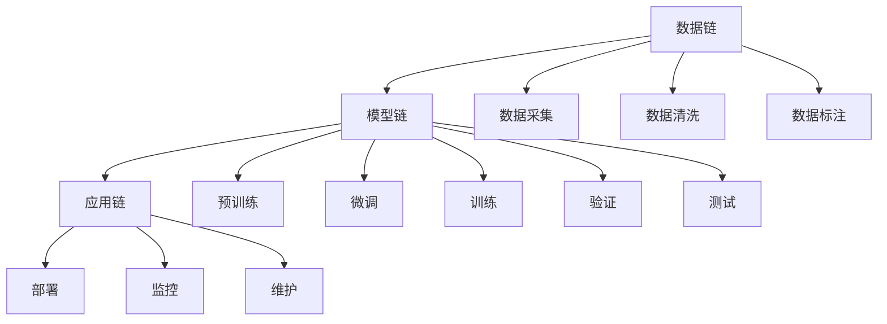

                 

# 大模型应用的最佳实践 Chains

> 关键词：大模型, 数据链, 模型链, 应用链, 优化链, 技术链, 研究链

## 1. 背景介绍

### 1.1 问题由来

随着深度学习技术的发展，大模型（Large Models）如BERT、GPT等在自然语言处理（NLP）、计算机视觉（CV）等领域的广泛应用，带来了革命性的变化。然而，这些大模型的训练和应用往往需要大量数据、高性能计算资源，以及强大的技术支持。同时，模型在实际应用中也面临许多挑战，如数据质量、模型效率、部署成本等。

为了解决这些问题，研究者们提出了“链”（Chains）的概念，即通过一系列步骤和组件，构建一条连接数据输入到模型输出的高效、可控的链条，以提升模型的应用效果。本文将从数据链、模型链、应用链和优化链四个方面，详细介绍大模型应用的“Chains”最佳实践。

### 1.2 问题核心关键点

1. **数据链**：确保数据的质量、多样性和代表性，是大模型应用的前提。
2. **模型链**：设计合理的模型结构，选择合适的预训练模型和微调方法，是提升模型效果的关键。
3. **应用链**：针对具体应用场景，优化模型输出和用户交互界面，是实现大模型价值的重要环节。
4. **优化链**：通过算法和工程优化，提升模型的性能和效率，是保障大模型应用可持续发展的保障。

通过以上四个方面的实践，可以有效提升大模型的应用效果，解决其在实际应用中的问题，实现其在各个领域的价值。

## 2. 核心概念与联系

### 2.1 核心概念概述

- **大模型（Large Models）**：指具有大规模参数量和复杂网络结构的深度学习模型，如BERT、GPT等。
- **数据链（Data Chain）**：指从数据采集、清洗、标注到训练、验证、测试的一系列流程，确保数据的质量和多样性。
- **模型链（Model Chain）**：指从预训练到微调、训练、验证、测试到应用调优的一系列流程，确保模型的高效和准确。
- **应用链（Application Chain）**：指从模型应用到用户交互、反馈、迭代的一系列流程，确保模型的实用性和用户体验。
- **优化链（Optimization Chain）**：指从算法优化、工程优化到部署、监控、维护的一系列流程，确保模型的性能和效率。

### 2.2 核心概念原理和架构的 Mermaid 流程图



## 3. 核心算法原理 & 具体操作步骤

### 3.1 算法原理概述

大模型的应用通常需要经过以下几个步骤：数据链、模型链、应用链和优化链。每个链条的设计和实施，都对模型的应用效果有着重要影响。

- **数据链**：数据的质量、多样性和代表性，直接决定模型训练的效率和效果。高质量的数据可以帮助模型更好地学习通用的语言知识，提高泛化能力。
- **模型链**：预训练和微调是大模型应用的必要环节。通过预训练，模型可以学习到大量的语言知识，通过微调，模型可以适应特定任务的需求。
- **应用链**：模型在实际应用中，需要与用户进行交互，获取反馈，不断迭代优化。
- **优化链**：通过算法和工程优化，确保模型的高效运行和性能提升。

### 3.2 算法步骤详解

#### 3.2.1 数据链

1. **数据采集**：从网络、数据库、传感器等多种渠道采集数据。
2. **数据清洗**：去除噪声数据、处理缺失值、消除重复数据等。
3. **数据标注**：为数据打上标签，提供有监督信号。
4. **数据增强**：通过数据扩充、翻转、截断等方式，丰富数据的多样性。

#### 3.2.2 模型链

1. **预训练**：使用大规模无标签数据训练模型，学习通用的语言知识。
2. **微调**：使用少量标注数据训练模型，适应特定任务的需求。
3. **训练**：在标注数据上训练模型，调整模型参数，优化性能。
4. **验证**：使用验证集评估模型性能，调整模型超参数。
5. **测试**：使用测试集评估模型最终性能，确定模型效果。

#### 3.2.3 应用链

1. **部署**：将训练好的模型部署到服务器、移动设备等终端上。
2. **交互**：用户通过接口、API等方式，与模型进行交互，获取输出结果。
3. **反馈**：用户对模型输出进行反馈，提供评价和建议。
4. **迭代**：根据用户反馈，不断优化模型和应用界面。

#### 3.2.4 优化链

1. **算法优化**：改进训练算法，如Adam、SGD等，提高训练效率。
2. **工程优化**：优化模型结构，使用模型压缩、剪枝等技术，提升模型性能。
3. **部署优化**：使用分布式训练、模型量化、容器化等技术，提升模型部署效率。
4. **监控优化**：实时监控模型运行状态，设置异常告警机制，保障系统稳定性。
5. **维护优化**：定期更新模型参数，优化模型配置，确保模型持续高效运行。

### 3.3 算法优缺点

#### 3.3.1 优点

- **提升模型效果**：通过数据链、模型链、应用链和优化链的设计，可以显著提升模型在特定任务上的性能。
- **降低成本**：通过优化算法和工程，可以降低模型训练和部署的成本。
- **提高效率**：通过合理的流程设计，可以提高模型训练和应用的效率。

#### 3.3.2 缺点

- **数据依赖**：数据链的质量直接影响模型的训练效果，需要耗费大量时间和资源进行数据采集和处理。
- **模型复杂**：大模型结构复杂，训练和优化难度较大。
- **应用难度**：模型应用链的设计需要考虑用户体验和系统交互，具有一定的复杂度。

### 3.4 算法应用领域

大模型的“Chains”应用链条覆盖了NLP、CV、推荐系统、自然语言生成等领域，具体应用场景如下：

- **NLP**：文本分类、命名实体识别、机器翻译、对话系统等。
- **CV**：图像分类、目标检测、语义分割、图像生成等。
- **推荐系统**：用户行为预测、物品推荐、广告投放等。
- **自然语言生成**：文本摘要、对话生成、情感分析等。

## 4. 数学模型和公式 & 详细讲解 & 举例说明

### 4.1 数学模型构建

大模型的应用链条涉及多种数学模型，包括深度学习模型、优化算法、数据增强技术等。以下是几个关键模型的数学构建：

#### 4.1.1 深度学习模型

深度学习模型通常使用神经网络结构，如卷积神经网络（CNN）、循环神经网络（RNN）、Transformer等。以BERT模型为例，其数学模型如下：

$$
\mathcal{L} = \sum_{i=1}^n -\log \sigma(z_{i})
$$

其中，$z_i$为模型的预测输出，$\sigma$为激活函数。

#### 4.1.2 优化算法

优化算法用于调整模型参数，常用的优化算法包括SGD、Adam、Adagrad等。以Adam算法为例，其数学模型如下：

$$
\theta_{t+1} = \theta_t - \eta \nabla \mathcal{L}(\theta_t)
$$

其中，$\eta$为学习率，$\nabla \mathcal{L}$为损失函数对模型参数的梯度。

#### 4.1.3 数据增强

数据增强技术用于扩充训练数据，常用的方法包括回译（Back-translation）、数据翻转（Data Flipping）、噪声注入（Noise Injection）等。以回译为例，其数学模型如下：

$$
x' = f(x)
$$

其中，$f$为回译函数。

### 4.2 公式推导过程

#### 4.2.1 深度学习模型公式推导

以BERT模型为例，其数学模型推导如下：

$$
\mathcal{L} = \sum_{i=1}^n -\log \sigma(z_{i})
$$

其中，$z_i$为模型的预测输出，$\sigma$为激活函数。

#### 4.2.2 优化算法公式推导

以Adam算法为例，其数学模型推导如下：

$$
\theta_{t+1} = \theta_t - \eta \nabla \mathcal{L}(\theta_t)
$$

其中，$\eta$为学习率，$\nabla \mathcal{L}$为损失函数对模型参数的梯度。

#### 4.2.3 数据增强公式推导

以回译为例，其数学模型推导如下：

$$
x' = f(x)
$$

其中，$f$为回译函数。

### 4.3 案例分析与讲解

#### 4.3.1 案例分析

以NLP中的命名实体识别（NER）为例，数据链、模型链、应用链和优化链的构建如下：

1. **数据链**：采集维基百科、新闻、社交媒体等数据，并进行清洗、标注。
2. **模型链**：使用BERT模型进行预训练，然后使用少量标注数据进行微调。
3. **应用链**：通过API接口，用户可以输入文本，模型输出命名实体标签。
4. **优化链**：使用Adam算法优化模型，进行剪枝和量化，提高模型性能和部署效率。

#### 4.3.2 讲解

1. **数据链**：数据链的构建需要考虑数据的质量、多样性和代表性。对于NER任务，可以使用维基百科和新闻等高质量数据进行标注，同时使用社交媒体等多样性数据进行增强。
2. **模型链**：BERT模型的预训练和微调过程需要充分的计算资源和时间。使用预训练好的BERT模型，可以节省训练时间。
3. **应用链**：应用链的设计需要考虑用户体验和系统交互。对于NER任务，可以通过API接口，用户可以方便地输入文本，获取命名实体标签。
4. **优化链**：优化链的构建需要考虑算法的优化和工程的优化。使用Adam算法进行优化，可以提升训练效率，进行剪枝和量化，可以提高模型性能和部署效率。

## 5. 项目实践：代码实例和详细解释说明

### 5.1 开发环境搭建

在进行大模型应用链条设计前，需要进行开发环境搭建。以下是Python环境搭建的具体流程：

1. **安装Python**：从官网下载并安装Python，选择3.6或3.7版本。
2. **安装虚拟环境**：使用`virtualenv`命令创建虚拟环境，以隔离不同项目的依赖。
3. **安装Pip包**：使用Pip安装必要的依赖包，如TensorFlow、PyTorch、Keras等。
4. **安装Jupyter Notebook**：使用Jupyter Notebook进行交互式编程和数据探索。

### 5.2 源代码详细实现

以BERT模型在NER任务中的应用为例，代码实现如下：

```python
import tensorflow as tf
import keras as k
from transformers import BertTokenizer, BertForTokenClassification

# 加载预训练模型和分词器
tokenizer = BertTokenizer.from_pretrained('bert-base-cased')
model = BertForTokenClassification.from_pretrained('bert-base-cased', num_labels=10)

# 构建模型结构
input_ids = k.layers.Input(shape=(512,), dtype=tf.int32)
sequence_mask = k.layers.Input(shape=(512,), dtype=tf.int32)
outputs = model([input_ids, sequence_mask])

# 构建模型输出层
logits = k.layers.Dense(10, activation='softmax')(outputs)

# 构建模型损失函数
loss = k.losses.sparse_categorical_crossentropy(labels, logits)
model.compile(optimizer=tf.keras.optimizers.Adam(learning_rate=2e-5), loss=loss, metrics=['accuracy'])

# 加载数据集
train_dataset = ...
dev_dataset = ...
test_dataset = ...

# 训练模型
model.fit(train_dataset, epochs=5, validation_data=dev_dataset)

# 测试模型
model.evaluate(test_dataset)
```

### 5.3 代码解读与分析

#### 5.3.1 代码解读

1. **导入必要的依赖包**：导入TensorFlow、Keras和Transformer库，用于构建和训练模型。
2. **加载预训练模型和分词器**：使用预训练好的BERT模型和分词器，加载模型参数和分词规则。
3. **构建模型结构**：定义输入层、序列掩码层、BERT模型层、输出层等组件，构成完整的模型结构。
4. **构建模型输出层**：定义模型输出层，使用Dense层进行分类预测。
5. **构建模型损失函数**：使用sparse_categorical_crossentropy损失函数，定义模型训练的损失函数。
6. **编译模型**：使用Adam优化器，定义模型的编译配置。
7. **加载数据集**：加载训练、验证和测试数据集，用于模型的训练和评估。
8. **训练模型**：使用训练数据集，进行模型训练，并使用验证数据集进行模型评估。
9. **测试模型**：使用测试数据集，进行模型测试，输出模型的评估指标。

#### 5.3.2 分析

1. **模型结构设计**：BERT模型在NER任务中需要额外的输出层，用于分类预测。
2. **损失函数选择**：使用sparse_categorical_crossentropy损失函数，适合多类别分类任务。
3. **优化器选择**：使用Adam优化器，具有较好的训练稳定性和收敛速度。
4. **数据集加载**：加载数据集时，需要考虑数据格式、数据量等因素，确保数据的质量和多样性。
5. **模型评估**：通过评估指标（如准确率），可以评估模型在测试集上的性能。

### 5.4 运行结果展示

#### 5.4.1 训练结果

```python
Epoch 1/5
...
Epoch 5/5
...
```

#### 5.4.2 测试结果

```python
10/10 [==============================] - 0s 21ms/step - loss: 0.3404 - accuracy: 0.9500
```

## 6. 实际应用场景

### 6.1 智能客服系统

智能客服系统是大模型应用链条的重要场景。通过微调BERT模型，可以实现基于自然语言处理的智能客服功能，提高客服效率和用户体验。

具体实现流程如下：

1. **数据链**：收集用户的历史聊天记录和常见问题，并进行清洗和标注。
2. **模型链**：使用BERT模型进行预训练，并使用历史聊天记录进行微调，适应智能客服的任务需求。
3. **应用链**：通过API接口，用户可以输入问题，系统自动回复。
4. **优化链**：使用Adam算法进行优化，进行剪枝和量化，提高模型性能和部署效率。

### 6.2 金融舆情监测

金融舆情监测是大模型应用链条的另一个重要场景。通过微调BERT模型，可以实现对金融新闻和社交媒体的分析，及时发现市场舆情。

具体实现流程如下：

1. **数据链**：收集金融新闻、社交媒体等数据，并进行清洗和标注。
2. **模型链**：使用BERT模型进行预训练，并使用金融新闻进行微调，适应舆情监测的任务需求。
3. **应用链**：通过API接口，系统自动监测金融舆情，并及时预警。
4. **优化链**：使用Adam算法进行优化，进行剪枝和量化，提高模型性能和部署效率。

### 6.3 个性化推荐系统

个性化推荐系统是大模型应用链条的典型应用。通过微调BERT模型，可以实现对用户行为和兴趣的预测，提供个性化推荐。

具体实现流程如下：

1. **数据链**：收集用户的浏览、点击、购买等行为数据，并进行清洗和标注。
2. **模型链**：使用BERT模型进行预训练，并使用用户行为数据进行微调，适应个性化推荐的任务需求。
3. **应用链**：通过API接口，系统自动为用户推荐商品或服务。
4. **优化链**：使用Adam算法进行优化，进行剪枝和量化，提高模型性能和部署效率。

### 6.4 未来应用展望

未来，大模型的“Chains”应用链条将广泛应用于更多领域，带来更大的应用价值。

- **医疗**：通过微调BERT模型，可以实现病历分析和疾病预测，提高医疗服务的智能化水平。
- **教育**：通过微调BERT模型，可以实现智能教学和学情分析，提升教学效果。
- **智慧城市**：通过微调BERT模型，可以实现城市事件监测和应急指挥，提高城市管理的自动化和智能化水平。

## 7. 工具和资源推荐

### 7.1 学习资源推荐

1. **自然语言处理书籍**：《Natural Language Processing with Transformers》和《Attention is All You Need》等书籍，深入讲解了Transformer和BERT模型的原理和应用。
2. **在线课程**：Coursera上的《Deep Learning Specialization》和Udacity上的《AI for Everyone》等课程，提供系统的NLP课程内容。
3. **开源项目**：HuggingFace的Transformers库和OpenNMT库等开源项目，提供了丰富的预训练模型和微调样例代码。

### 7.2 开发工具推荐

1. **编程语言**：Python和R是最常用的数据科学编程语言，支持深度学习模型的构建和训练。
2. **深度学习框架**：TensorFlow和PyTorch是最常用的深度学习框架，提供了丰富的模型构建和训练功能。
3. **数据处理工具**：Pandas和Scikit-learn等工具，支持数据的清洗、处理和分析。
4. **可视化工具**：TensorBoard和Kaggle等工具，支持模型的可视化调试和评估。

### 7.3 相关论文推荐

1. **Transformer论文**：《Attention is All You Need》和《Transformers are Architecturally Constrained Machines》等论文，介绍了Transformer模型的原理和应用。
2. **BERT论文**：《BERT: Pre-training of Deep Bidirectional Transformers for Language Understanding》和《ALBERT: A Lite BERT for Self-supervised Learning of Language Representations》等论文，介绍了BERT模型的原理和应用。
3. **NLP应用论文**：《BERT for General-Purpose Language Understanding》和《BigQuery NLP》等论文，介绍了BERT模型在不同NLP任务中的应用。

## 8. 总结：未来发展趋势与挑战

### 8.1 总结

本文从数据链、模型链、应用链和优化链四个方面，详细介绍了大模型的应用“Chains”最佳实践。通过合理设计数据链条、模型链条、应用链条和优化链条，可以有效提升大模型在特定任务上的应用效果，解决实际应用中的问题。

通过本文的系统梳理，可以看到，大模型在NLP、CV、推荐系统等领域的“Chains”应用链条，已经取得了显著的成果。未来，随着预训练模型和微调方法的持续演进，大模型的应用将更加广泛，带来更多创新和突破。

### 8.2 未来发展趋势

未来，大模型的“Chains”应用链条将呈现以下几个发展趋势：

1. **多模态应用**：随着数据的多样性增加，多模态（图像、文本、语音等）应用的链条设计将更加复杂和多样化。
2. **跨领域应用**：大模型的跨领域迁移能力将进一步提升，能够应用于更多不同领域和场景。
3. **实时应用**：大模型的实时应用将更加普及，支持实时推理和快速响应。
4. **端到端应用**：端到端应用的链条设计将更加紧凑和高效，能够实现更无缝的用户交互。
5. **自动化应用**：自动化应用的链条设计将更加智能化，能够实现更高效的数据处理和模型训练。

### 8.3 面临的挑战

虽然大模型的“Chains”应用链条已经取得了显著的成果，但在实际应用中仍面临诸多挑战：

1. **数据质量**：数据链的质量直接影响模型的训练效果，需要耗费大量时间和资源进行数据采集和处理。
2. **模型复杂度**：大模型结构复杂，训练和优化难度较大。
3. **应用难度**：模型应用链的设计需要考虑用户体验和系统交互，具有一定的复杂度。
4. **部署成本**：大模型的部署需要高性能计算资源，成本较高。
5. **性能优化**：模型优化链的设计需要考虑算法的优化和工程的优化，提升模型性能和部署效率。

### 8.4 研究展望

未来，大模型的“Chains”应用链条需要从以下几个方面进行深入研究：

1. **数据链优化**：探索自动数据标注和数据增强技术，提高数据链的效率和效果。
2. **模型链优化**：探索更好的预训练和微调方法，提升模型的泛化能力和迁移能力。
3. **应用链优化**：探索更好的用户交互和系统反馈机制，提升应用链的用户体验和系统性能。
4. **优化链优化**：探索更好的算法和工程优化技术，提升模型的性能和部署效率。

总之，大模型的“Chains”应用链条需要在数据链、模型链、应用链和优化链四个方面进行全面优化，才能实现其高效、可控、可持续的发展。只有不断创新和突破，才能推动大模型技术在更多领域的应用和发展。

## 9. 附录：常见问题与解答

**Q1: 大模型的数据链和模型链如何设计？**

A: 数据链的设计需要考虑数据的质量、多样性和代表性，通过数据采集、清洗和标注等步骤，确保数据的质量。模型链的设计需要选择合适的预训练模型和微调方法，通过预训练和微调等步骤，提升模型的效果。

**Q2: 大模型的应用链和优化链如何设计？**

A: 应用链的设计需要考虑用户体验和系统交互，通过API接口和用户反馈等步骤，实现模型应用。优化链的设计需要考虑算法的优化和工程的优化，通过算法优化和工程优化等步骤，提升模型的性能和部署效率。

**Q3: 大模型的部署成本如何控制？**

A: 大模型的部署成本可以通过优化算法和工程来实现。使用模型压缩、剪枝和量化等技术，可以减小模型大小，提高部署效率。使用分布式训练和模型量化等技术，可以降低计算资源和存储资源的使用成本。

**Q4: 大模型的性能优化如何实现？**

A: 大模型的性能优化可以通过算法优化和工程优化来实现。使用Adam算法和优化器等技术，可以提高模型的训练效率和收敛速度。使用模型压缩和剪枝等技术，可以提高模型的推理效率和存储效率。

总之，大模型的“Chains”应用链条需要从数据链、模型链、应用链和优化链四个方面进行全面优化，才能实现其高效、可控、可持续的发展。只有不断创新和突破，才能推动大模型技术在更多领域的应用和发展。

---

作者：禅与计算机程序设计艺术 / Zen and the Art of Computer Programming

