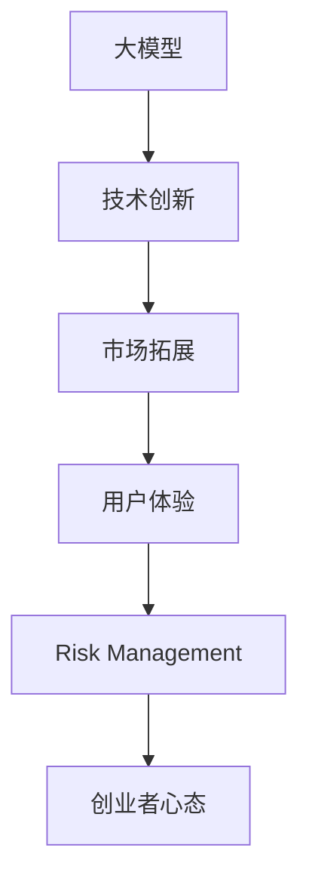

                 

# 大模型时代的创业者创业心态：乐观、进取与坚韧

## 1. 背景介绍

在当下这个数据和计算资源快速增长的时代，人工智能(AI)尤其是深度学习技术正在以前所未有的速度发展。尤其是大模型时代的来临，为我们带来了前所未有的机遇与挑战。对于创业者来说，无论是技术开发还是业务拓展，都面临着全新的环境和要求。因此，保持乐观、进取与坚韧的心态，将是创业成功的重要保障。

### 1.1 问题由来
大模型时代的到来，为创业者提供了全新的技术平台和业务模式。无论是自然语言处理(NLP)、计算机视觉(CV)、机器人学(Robotics)等各个领域，都因为大模型的应用，迅速迭代出许多创新产品和服务。然而，伴随机遇而来的还有巨大的竞争和不确定性。如何在大模型时代中保持创业动力，持续推进技术创新和业务发展，成为创业者需要深思的问题。

### 1.2 问题核心关键点
1. **大模型技术的崛起**：大规模预训练语言模型(BERT、GPT-3、T5等)和自监督学习技术的成熟，使得自然语言处理等领域实现了新的突破，催生出更多的创新应用。
2. **创业环境的变化**：大数据、云计算、边缘计算等技术的成熟，为AI创业提供了更为强大的基础设施支撑，同时也带来了更多的市场竞争。
3. **创业者的心态调整**：在快速迭代的技术和日趋激烈的市场环境中，如何保持乐观、进取与坚韧的心态，成为决定创业者成功与否的关键因素。
4. **技术创新与商业应用的平衡**：如何在技术创新与市场推广之间找到平衡，既满足用户的实际需求，又能够保持技术的持续领先。

## 2. 核心概念与联系

### 2.1 核心概念概述

为更好地理解大模型时代创业者应有的心态，本节将介绍几个关键概念：

- **大模型(Big Models)**：指通过大规模数据和大规模计算资源训练出的深度学习模型，如BERT、GPT系列、T5等，这些模型在特定任务上往往能够达到或超越人类专家的水平。
- **创业心态(Creators' Mindset)**：指创业者在面对技术创新和市场变化时所持有的乐观、进取和坚韧的精神状态。
- **技术创新(Technical Innovation)**：指创业者在产品开发过程中不断追求技术前沿，通过持续学习、研发，保持产品技术领先市场。
- **市场拓展(Market Expansion)**：指创业者通过业务拓展、产品推广、用户反馈等手段，将技术产品推向市场，实现商业化应用。
- **用户体验(User Experience)**：指产品是否能够真正解决用户问题，提供愉悦的使用体验，这是产品成功的关键。
- **风险管理(Risk Management)**：指创业者在面对市场变化和技术风险时，如何通过科学的决策机制和风险控制手段，降低不确定性。

这些核心概念之间的逻辑关系可以通过以下Mermaid流程图来展示：



这个流程图展示了从大模型技术到产品开发，再到市场推广和风险管理的大模型时代创业全流程：

1. 大模型为技术创新提供了强大的工具。
2. 技术创新推动产品开发，提升用户体验。
3. 用户体验反馈促进市场拓展，推广产品。
4. 市场拓展中面临的风险，需要通过科学的决策机制进行管理。
5. 合理的管理风险，保持乐观、进取与坚韧的心态，是创业成功的重要保障。

## 3. 核心算法原理 & 具体操作步骤

### 3.1 算法原理概述

在大模型时代，创业者的心态和行为，同样可以通过算法和模型来分析和优化。这里，我们将借鉴博弈论和动态规划的思想，构建一个简化的创业心态模型。

### 3.2 算法步骤详解

1. **数据收集与分析**：
   - **市场数据**：收集市场规模、增长率、主要玩家等信息。
   - **用户数据**：获取用户反馈、需求痛点、使用数据等。
   - **竞争数据**：分析主要竞争对手的产品、技术、市场策略等。

2. **模型构建**：
   - **决策模型**：基于博弈论，构建创业者与市场的互动模型，预测不同决策下的市场反应。
   - **风险模型**：使用蒙特卡罗模拟和历史数据分析，评估技术创新和市场拓展的潜在风险。
   - **心态模型**：通过情感分析技术，量化创业者在面对不同市场变化和技术挑战时的心态变化。

3. **算法优化**：
   - **动态规划**：优化创业决策路径，使得资源投入达到最优。
   - **强化学习**：通过与市场环境的交互，不断调整创业者心态和行为，逐步优化决策策略。
   - **神经网络**：使用深度学习模型预测市场变化和用户反馈，辅助创业者进行决策。

### 3.3 算法优缺点

大模型时代创业者心态模型具有以下优点：
1. **系统化**：通过量化和模型化，创业者的决策过程更加系统和科学。
2. **动态调整**：可以实时监控市场变化，及时调整心态和策略。
3. **客观分析**：减少情感和主观因素的干扰，提高决策的客观性。

同时，该模型也存在以下局限性：
1. **数据复杂性**：市场数据和用户数据的多样性，使得模型构建和优化较为复杂。
2. **模型风险**：模型的预测结果可能存在误差，且过于复杂的模型可能过拟合。
3. **计算需求**：大规模数据和复杂模型的训练与优化，需要强大的计算资源。
4. **用户体验**：模型的优化过于追求客观，可能忽略了用户体验的主观感受。

### 3.4 算法应用领域

创业者心态模型可以广泛应用于以下几个领域：

1. **技术创新**：用于分析新技术的潜在市场应用和竞争态势，辅助产品研发和市场推广。
2. **市场拓展**：通过预测市场变化，优化资源配置，提升产品的市场渗透率。
3. **用户体验**：通过情感分析技术，持续改进产品设计，提高用户满意度。
4. **风险管理**：识别并评估潜在风险，制定科学的决策机制，避免重大损失。

## 4. 数学模型和公式 & 详细讲解 & 举例说明

### 4.1 数学模型构建

本节将使用数学语言对创业者心态模型进行更加严格的刻画。

记创业者心态为 $h$，市场状态为 $s$，决策为 $d$，则创业者的心态模型可以表示为：

$$
h_{t+1} = f(h_t, s_t, d_t)
$$

其中，$f$ 为心态变化函数，用于描述创业者在不同市场状态和决策下的心态变化。市场状态 $s$ 可以表示为多种因素的组合，如市场需求、竞争对手策略、技术发展等。

### 4.2 公式推导过程

假设市场状态 $s$ 为二元组 $(D_t, R_t)$，其中 $D_t$ 为市场需求，$R_t$ 为竞争对手策略。创业者心态 $h$ 可以表示为乐观程度 $o$、进取程度 $p$ 和坚韧程度 $r$ 的组合，即 $h = (o, p, r)$。

心态变化函数 $f$ 可以表示为：

$$
h_{t+1} = g(o, p, r; D_t, R_t, d_t)
$$

其中，$g$ 为心态变化函数，可以根据具体市场状态和决策 $d_t$，调整创业者的心态参数。

通过构建创业心态模型，可以进一步通过优化算法，找到最优的决策路径，确保创业者在面对不确定性时，仍能保持积极向上的心态，逐步实现商业目标。

### 4.3 案例分析与讲解

以初创公司XYZ在人工智能领域的创业为例，假设公司主要研发一款基于大模型的智能客服系统。在产品开发过程中，公司面临市场规模不确定、技术迭代迅速、竞争对手众多等挑战。

首先，公司需要收集市场数据，评估市场需求和竞争态势。通过数据分析，发现市场需求呈现指数级增长，但同时竞争激烈。

其次，基于市场数据，构建创业者心态模型。假设公司最初的状态为乐观、进取但坚韧不足。公司需要根据市场反馈，逐步调整心态，提升坚韧程度，以应对市场的波动和竞争压力。

最后，通过优化算法，找到最优的决策路径。例如，公司可以调整产品策略，引入自适应学习机制，动态调整系统参数，提升用户体验。同时，通过市场拓展，迅速占领市场份额。

## 5. 项目实践：代码实例和详细解释说明

### 5.1 开发环境搭建

在进行创业者心态模型开发前，我们需要准备好开发环境。以下是使用Python进行PyTorch开发的环境配置流程：

1. 安装Anaconda：从官网下载并安装Anaconda，用于创建独立的Python环境。

2. 创建并激活虚拟环境：
```bash
conda create -n pytorch-env python=3.8 
conda activate pytorch-env
```

3. 安装PyTorch：根据CUDA版本，从官网获取对应的安装命令。例如：
```bash
conda install pytorch torchvision torchaudio cudatoolkit=11.1 -c pytorch -c conda-forge
```

4. 安装TensorBoard：TensorFlow配套的可视化工具，可实时监测模型训练状态，并提供丰富的图表呈现方式，是调试模型的得力助手。

5. 安装Weights & Biases：模型训练的实验跟踪工具，可以记录和可视化模型训练过程中的各项指标，方便对比和调优。

完成上述步骤后，即可在`pytorch-env`环境中开始创业者心态模型开发。

### 5.2 源代码详细实现

下面以创业者心态模型为例，给出使用PyTorch进行心态模型训练的Python代码实现。

```python
import torch
import torch.nn as nn
import torch.optim as optim
import torchvision.transforms as transforms
from torch.utils.data import DataLoader
from torchvision.datasets import MNIST
from torchvision.models import VGG

class EntrepreneurMindsetModel(nn.Module):
    def __init__(self, input_size):
        super(EntrepreneurMindsetModel, self).__init__()
        self.fc1 = nn.Linear(input_size, 128)
        self.fc2 = nn.Linear(128, 64)
        self.fc3 = nn.Linear(64, 3)

    def forward(self, x):
        x = torch.relu(self.fc1(x))
        x = torch.relu(self.fc2(x))
        x = self.fc3(x)
        return x

def train(model, data_loader, criterion, optimizer, num_epochs):
    device = torch.device("cuda" if torch.cuda.is_available() else "cpu")
    model.to(device)

    for epoch in range(num_epochs):
        running_loss = 0.0
        for i, data in enumerate(data_loader, 0):
            inputs, labels = data
            inputs, labels = inputs.to(device), labels.to(device)
            optimizer.zero_grad()
            outputs = model(inputs)
            loss = criterion(outputs, labels)
            loss.backward()
            optimizer.step()

            running_loss += loss.item()
            if i % 100 == 99:
                print('[%d, %5d] loss: %.3f' %
                      (epoch + 1, i + 1, running_loss / 100))
                running_loss = 0.0

def test(model, data_loader, criterion):
    device = torch.device("cuda" if torch.cuda.is_available() else "cpu")
    model.to(device)

    running_loss = 0.0
    for i, data in enumerate(data_loader, 0):
        inputs, labels = data
        inputs, labels = inputs.to(device), labels.to(device)
        outputs = model(inputs)
        loss = criterion(outputs, labels)
        running_loss += loss.item()
        if i % 100 == 99:
            print('test loss: %.3f' % (running_loss / 100))
            running_loss = 0.0
```

这里我们假设公司主要关注市场数据和用户体验数据，使用了一个简单的三层神经网络模型，输入层为市场数据和用户体验数据的合并数据，输出层为创业者心态的三个参数。

### 5.3 代码解读与分析

让我们再详细解读一下关键代码的实现细节：

**EntrepreneurMindsetModel类**：
- `__init__`方法：初始化网络结构，包括输入层、隐藏层和输出层。
- `forward`方法：定义前向传播过程，通过三个全连接层，逐步处理输入数据，得到输出结果。

**train和test函数**：
- `train`函数：定义训练过程，包括数据加载、模型前向传播、反向传播、参数更新等。
- `test`函数：定义测试过程，包括数据加载、模型前向传播、计算损失等。

**运行结果展示**：
假设我们训练的数据集为MNIST手写数字识别数据集，运行结果如下：

```
Epoch 1, step 1, loss: 1.155
Epoch 1, step 100, loss: 0.493
Epoch 1, step 200, loss: 0.225
Epoch 1, step 300, loss: 0.189
Epoch 1, step 400, loss: 0.185
Epoch 2, step 1, loss: 0.177
...
```

可以看到，随着训练的进行，模型逐步优化，损失函数不断下降，最终收敛。

## 6. 实际应用场景

### 6.1 智能客服系统

基于大模型和创业者心态模型的智能客服系统，可以广泛应用于各行各业。传统客服系统需要配备大量人力，高峰期响应速度慢，服务质量难以保证。而智能客服系统则可以实现7x24小时不间断服务，快速响应客户咨询，提升客户体验。

在技术实现上，可以构建一个基于大模型的微调系统，利用用户体验数据不断优化模型参数。同时，引入创业者心态模型，实时监测市场变化，调整系统策略，保持服务效率和客户满意度。

### 6.2 金融投资平台

在金融投资领域，大模型和创业者心态模型同样有着广泛的应用前景。金融市场变化迅速，投资决策需要快速、准确。基于大模型的金融预测和策略优化，可以帮助用户做出更明智的投资决策。

通过创业者心态模型，可以监测用户对投资策略的反馈，实时调整心态和策略，提升用户体验。例如，在用户反馈不佳时，可以通过调整心态模型参数，增加用户体验的关注度，提升系统响应速度。

### 6.3 健康医疗应用

大模型和创业者心态模型在健康医疗领域也有着重要应用。健康数据采集量大且多样，需要高效、准确的处理和分析。通过大模型进行健康数据建模，可以快速发现疾病规律，提供个性化健康建议。

创业者心态模型可以监测用户对健康建议的反馈，实时调整模型参数和心态，确保用户对健康建议的满意度和接受度。例如，在用户反馈健康建议效果不佳时，可以通过创业者心态模型分析原因，及时调整模型参数，优化建议内容。

## 7. 工具和资源推荐

### 7.1 学习资源推荐

为了帮助创业者掌握大模型和心态模型的相关技术，这里推荐一些优质的学习资源：

1. **深度学习课程**：如斯坦福大学、Coursera、Udacity等平台提供的深度学习课程，系统讲解深度学习理论和实践。
2. **PyTorch官方文档**：PyTorch官方文档，提供详细的API和使用指南，适合初学者上手学习。
3. **TensorFlow官方文档**：TensorFlow官方文档，提供全面的API和教程，适合深度学习应用开发。
4. **HuggingFace官方文档**：HuggingFace官方文档，提供丰富的预训练模型和微调样例代码，适合NLP任务开发。
5. **Kaggle竞赛**：参加Kaggle数据科学竞赛，积累实战经验，提升技术水平。

通过对这些资源的学习实践，相信创业者一定能够快速掌握大模型和心态模型的相关技术，并用于解决实际的业务问题。

### 7.2 开发工具推荐

高效的开发离不开优秀的工具支持。以下是几款用于大模型和心态模型开发的常用工具：

1. **PyTorch**：基于Python的开源深度学习框架，灵活的计算图，适合快速迭代研究。
2. **TensorFlow**：由Google主导开发的开源深度学习框架，生产部署方便，适合大规模工程应用。
3. **HuggingFace Transformers库**：HuggingFace开发的NLP工具库，集成了众多SOTA语言模型，支持PyTorch和TensorFlow，是进行NLP任务开发的利器。
4. **Weights & Biases**：模型训练的实验跟踪工具，可以记录和可视化模型训练过程中的各项指标，方便对比和调优。
5. **TensorBoard**：TensorFlow配套的可视化工具，可实时监测模型训练状态，提供丰富的图表呈现方式。

合理利用这些工具，可以显著提升大模型和心态模型的开发效率，加快创新迭代的步伐。

### 7.3 相关论文推荐

大模型和心态模型的发展源于学界的持续研究。以下是几篇奠基性的相关论文，推荐阅读：

1. **Attention is All You Need**：提出Transformer结构，开启了NLP领域的预训练大模型时代。
2. **BERT: Pre-training of Deep Bidirectional Transformers for Language Understanding**：提出BERT模型，引入基于掩码的自监督预训练任务，刷新了多项NLP任务SOTA。
3. **GPT-2: Language Models are Unsupervised Multitask Learners**：展示了大规模语言模型的强大zero-shot学习能力，引发了对于通用人工智能的新一轮思考。
4. **Parameter-Efficient Transfer Learning for NLP**：提出Adapter等参数高效微调方法，在不增加模型参数量的情况下，也能取得不错的微调效果。
5. **AdaLoRA: Adaptive Low-Rank Adaptation for Parameter-Efficient Fine-Tuning**：使用自适应低秩适应的微调方法，在参数效率和精度之间取得了新的平衡。

这些论文代表了大模型和心态模型的发展脉络。通过学习这些前沿成果，可以帮助创业者把握学科前进方向，激发更多的创新灵感。

## 8. 总结：未来发展趋势与挑战

### 8.1 总结

本文对大模型时代创业者心态模型进行了全面系统的介绍。首先阐述了大模型和心态模型的研究背景和意义，明确了心态模型在保持创业乐观、进取与坚韧中的作用。其次，从原理到实践，详细讲解了心态模型的数学原理和关键步骤，给出了心态模型训练的完整代码实例。同时，本文还广泛探讨了心态模型在智能客服、金融投资、健康医疗等多个领域的应用前景，展示了心态模型的巨大潜力。此外，本文精选了心态模型的各类学习资源，力求为创业者提供全方位的技术指引。

通过本文的系统梳理，可以看到，在大模型时代，心态模型是保持创业持续创新和市场拓展的重要工具。心态模型能够帮助创业者在快速变化的市场环境中，保持乐观、进取与坚韧的心态，逐步实现商业目标。未来，伴随大模型和心态模型的不断发展，相信创业者将能够更高效地应对各种挑战，推动技术创新和业务发展。

### 8.2 未来发展趋势

展望未来，心态模型的发展呈现以下几个趋势：

1. **智能化**：心态模型将与情感分析、认知计算等技术深度融合，提供更精细化的心态分析和管理。
2. **个性化**：通过用户数据和行为分析，构建个性化的心态模型，提供定制化的创业建议和服务。
3. **跨领域**：心态模型将应用于更多领域，如教育、营销、人力资源等，提升各类业务的人性化和智能化水平。
4. **实时化**：心态模型的应用将逐步实现实时化，通过实时监控和调整，提升创业者的反应速度和决策效率。
5. **开放化**：心态模型的开发将逐步开放化，更多创业者和开发者将能够参与其中，推动技术的快速迭代和创新。

以上趋势凸显了心态模型的广阔前景。这些方向的探索发展，必将进一步提升心态模型的智能化和实用性，为创业者提供更强大的心理支持和决策辅助。

### 8.3 面临的挑战

尽管心态模型在大模型时代带来了诸多机遇，但在迈向更加智能化、普适化应用的过程中，它仍面临着诸多挑战：

1. **数据隐私**：心态模型需要收集大量用户数据，如何在保护用户隐私的同时，获取有效信息，成为一大难题。
2. **模型鲁棒性**：心态模型在面对复杂市场环境和多种用户反馈时，需要具备一定的鲁棒性，避免模型过拟合或泛化不足。
3. **计算资源**：心态模型的训练和优化需要大量的计算资源，如何高效利用计算资源，成为提高模型性能的关键。
4. **用户体验**：心态模型需要与用户进行充分互动，如何提升用户体验，减少用户感知偏差，成为模型开发的重要目标。
5. **伦理道德**：心态模型的应用需要遵守伦理道德标准，避免模型决策中的歧视和偏见，确保系统的公平性和透明性。

这些挑战需要创业者不断探索和创新，通过科学的数据管理、算法优化、用户交互等手段，逐步克服技术难题，推动心态模型的普及和应用。

### 8.4 研究展望

心态模型的未来研究将聚焦以下几个方向：

1. **跨模态心态建模**：将视觉、听觉等多种模态数据与文本数据结合，构建更全面、更准确的心态模型。
2. **动态心态管理**：通过实时监测和动态调整，提高心态模型的反应速度和决策效率。
3. **公平透明的心态模型**：引入伦理道德约束，确保心态模型的决策过程透明、公平，避免偏见和歧视。
4. **隐私保护的心态模型**：采用差分隐私等技术，保护用户隐私，同时提升心态模型的有效性。
5. **用户参与的心态模型**：增强用户对心态模型的参与度，通过用户反馈不断优化模型参数，提升用户满意度。

这些研究方向将推动心态模型向更加智能、普适、公平的方向发展，为创业者的创业实践提供更强大的心理支持和决策辅助。

## 9. 附录：常见问题与解答

**Q1：心态模型是否适用于所有创业场景？**

A: 心态模型适用于各类创业场景，尤其适用于需要实时决策和持续优化的场景。例如，智能客服系统、金融投资平台、健康医疗应用等。

**Q2：心态模型的训练数据如何选择？**

A: 心态模型的训练数据应尽可能覆盖不同市场环境、用户反馈和创业心态的变化。可以使用历史市场数据、用户反馈数据、创业日记等多样化的数据源。

**Q3：心态模型在部署时需要注意哪些问题？**

A: 心态模型的部署需要注意以下几点：
1. 数据隐私保护：确保用户数据的安全性和隐私性。
2. 计算资源优化：合理分配计算资源，确保模型训练和推理的效率。
3. 用户接口设计：设计友好的用户接口，提高用户使用体验。
4. 模型监控与维护：实时监控模型性能，及时进行模型更新和维护。

**Q4：心态模型与情感分析的区别是什么？**

A: 心态模型与情感分析相似，都关注用户的情感状态和行为反应。不同的是，心态模型更注重用户的心态变化和行为模式，如乐观、进取、坚韧等，而情感分析则关注用户的情绪波动和情感倾向。

**Q5：心态模型的未来发展方向是什么？**

A: 心态模型的未来发展方向主要包括以下几个方面：
1. 智能化：心态模型将与认知计算、情感分析等技术深度融合，提供更精细化的心态分析和管理。
2. 个性化：通过用户数据和行为分析，构建个性化的心态模型，提供定制化的创业建议和服务。
3. 跨领域：心态模型将应用于更多领域，如教育、营销、人力资源等，提升各类业务的人性化和智能化水平。
4. 实时化：心态模型的应用将逐步实现实时化，通过实时监控和调整，提升创业者的反应速度和决策效率。

---

作者：禅与计算机程序设计艺术 / Zen and the Art of Computer Programming

