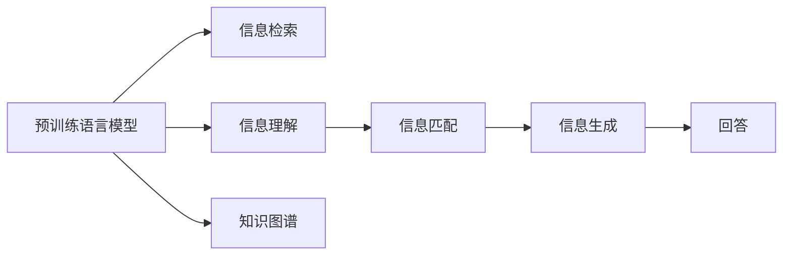

                 

# 大模型问答机器人的文本处理

## 1. 背景介绍

### 1.1 问题由来

在当今信息爆炸的时代，人们越来越需要一种智能化的工具来处理海量的信息，使其快速找到有价值的内容。传统的搜索引擎和信息检索系统已经无法满足用户日益复杂的信息需求。因此，基于人工智能的问答机器人应运而生，旨在通过理解用户的问题并提供准确、及时的答案来提升用户体验。

近年来，随着深度学习技术的进步，特别是预训练语言模型的出现，问答机器人在理解和处理自然语言方面取得了显著的进展。这些模型如GPT-3、BERT等，在处理大规模文本数据时展现了卓越的能力。然而，这些模型在处理特定领域的问题时，仍存在一定的局限性。因此，针对特定领域的问答机器人开发，需要将预训练模型与领域知识相结合，进行微调和优化。

### 1.2 问题核心关键点

问答机器人文本处理的核心在于如何从大量的文本数据中提取出与用户问题相关的信息，并生成符合用户需求的答案。具体来说，这包括：

- 信息检索：在文本库中找到与用户问题相关的信息。
- 信息理解：理解问题的语义，并将其转换为可供机器处理的结构化数据。
- 信息匹配：将问题与文本库中的信息进行匹配，找到最相关的答案。
- 信息生成：将匹配到的信息进行加工和格式化，生成自然语言形式的答案。

本文将重点探讨大模型问答机器人文本处理的原理与实践，包括信息检索、信息理解、信息匹配和信息生成等核心环节。

## 2. 核心概念与联系

### 2.1 核心概念概述

在问答机器人的文本处理中，涉及多个核心概念，它们之间存在紧密的联系：

- **预训练语言模型**：如GPT、BERT等，通过在大规模无标签文本数据上自监督学习，学习到通用的语言表示。
- **信息检索**：在文本库中查找与用户问题相关的信息。
- **信息理解**：理解用户问题的语义，将其转换为可供机器处理的结构化数据。
- **信息匹配**：将问题与文本库中的信息进行匹配，找到最相关的答案。
- **信息生成**：将匹配到的信息进行加工和格式化，生成自然语言形式的答案。

这些概念之间的联系可以通过以下Mermaid流程图来展示：



这个流程图展示了大模型问答机器人文本处理的关键环节和它们之间的相互关系。

## 3. 核心算法原理 & 具体操作步骤
### 3.1 算法原理概述

大模型问答机器人文本处理的核心算法原理包括以下几个方面：

- **信息检索**：使用预训练语言模型在文本库中查找与用户问题相关的信息。
- **信息理解**：使用预训练语言模型理解用户问题的语义，并将其转换为结构化数据。
- **信息匹配**：通过预训练语言模型对问题和文本进行匹配，找到最相关的答案。
- **信息生成**：使用预训练语言模型将匹配到的信息进行加工和格式化，生成自然语言形式的答案。

这些算法的核心在于利用预训练语言模型的强大语义理解能力，从海量的文本数据中提取有用的信息，并根据用户的问题生成相应的答案。

### 3.2 算法步骤详解

以下是对大模型问答机器人文本处理的核心算法步骤的详细讲解：

**Step 1: 构建预训练语言模型**

首先，需要选择或构建一个预训练语言模型。当前，最流行和有效的预训练模型包括GPT-3、BERT、T5等。这些模型通常基于大规模无标签文本数据进行自监督预训练，学习到通用的语言表示。

**Step 2: 准备文本数据**

接下来，需要准备包含问题和答案的文本数据集。这些数据集可以从公开的语料库、专业领域的文本数据中获取。在获取数据后，需要对数据进行清洗、标注等预处理操作，以便后续的微调和使用。

**Step 3: 训练信息检索模型**

利用预训练语言模型和准备好的文本数据，训练信息检索模型。信息检索模型的目的是在文本库中快速定位到与用户问题相关的信息。

**Step 4: 训练信息理解模型**

在信息检索模型定位到相关的信息后，需要使用预训练语言模型对这些信息进行理解。信息理解模型的目标是提取问题中的关键信息，并将其转换为结构化数据。

**Step 5: 训练信息匹配模型**

在信息理解模型提取到结构化数据后，需要训练信息匹配模型。该模型通过将问题和结构化数据进行匹配，找到最相关的答案。

**Step 6: 训练信息生成模型**

最后，需要训练信息生成模型。该模型利用预训练语言模型将匹配到的信息进行加工和格式化，生成自然语言形式的答案。

### 3.3 算法优缺点

大模型问答机器人文本处理算法具有以下优点：

- **高效性**：利用预训练语言模型的强大语义理解能力，可以快速处理大量文本数据。
- **准确性**：通过多层次的信息处理和匹配，可以生成高质量的文本答案。
- **可扩展性**：预训练语言模型可以在多个领域进行微调，适应不同的应用场景。

同时，该算法也存在一些缺点：

- **数据依赖性**：高质量的数据是训练信息检索和理解模型的关键，获取和标注大量数据需要较高的成本。
- **模型复杂度**：多层次的模型设计增加了模型的复杂度，增加了训练和推理的难度。
- **计算资源需求高**：预训练语言模型的计算资源需求较高，需要高性能的计算平台。

尽管存在这些缺点，但基于大模型的问答机器人文本处理算法仍然是目前最有效和高效的方法之一。

### 3.4 算法应用领域

大模型问答机器人文本处理算法已经在多个领域得到广泛应用，例如：

- **医疗咨询**：利用预训练语言模型提供医疗咨询，帮助用户解答健康问题。
- **金融咨询**：提供金融市场信息、投资建议等金融咨询服务。
- **教育咨询**：为学生和教师提供教育资源、学习建议等服务。
- **法律咨询**：提供法律信息、咨询解答等服务。

除了上述这些应用场景，问答机器人文本处理算法还被应用于各种领域，如电子商务、旅游、客服等，为不同行业的用户提供实时、个性化的问答服务。

## 4. 数学模型和公式 & 详细讲解 & 举例说明

### 4.1 数学模型构建

在本节中，我们将使用数学语言对大模型问答机器人文本处理的各个环节进行更加严格的刻画。

**信息检索模型**：

设问题文本为 $Q$，文本库中的文档为 $D=\{d_i\}_{i=1}^N$，其中 $d_i=(x_i,y_i)$ 表示文档 $i$ 的内容和对应的标签。信息检索模型的目标是找到一个文档 $d_k$，使得 $d_k$ 与问题 $Q$ 的相关性最大化。

**信息理解模型**：

假设问题 $Q$ 被转换为结构化数据 $\mathcal{S}$，文本库中的文档 $d_k$ 被转换为结构化数据 $\mathcal{S}_k$。信息理解模型的目标是计算问题 $Q$ 与文档 $d_k$ 之间的语义相似度 $s(Q,d_k)$。

**信息匹配模型**：

假设问题 $Q$ 与文档 $d_k$ 的语义相似度 $s(Q,d_k)$ 可以表示为 $\mathbf{u}_Q \cdot \mathbf{v}_{d_k}$，其中 $\mathbf{u}_Q$ 和 $\mathbf{v}_{d_k}$ 分别是问题 $Q$ 和文档 $d_k$ 的语义表示向量。信息匹配模型的目标是找到文档 $d_k$，使得 $\mathbf{u}_Q \cdot \mathbf{v}_{d_k}$ 最大化。

**信息生成模型**：

假设问题 $Q$ 与文档 $d_k$ 的语义匹配结果为 $\mathbf{u}_Q \cdot \mathbf{v}_{d_k}=s(Q,d_k)$，信息生成模型的目标是生成自然语言形式的答案 $A$，使得 $A$ 与 $s(Q,d_k)$ 的语义一致性最大化。

### 4.2 公式推导过程

以下我们将对信息检索模型、信息理解模型、信息匹配模型和信息生成模型的公式进行推导。

**信息检索模型**：

设 $Q$ 表示问题文本，$d_i$ 表示文本库中的文档，$w$ 表示文档与问题的相关性权重，$s(Q,d_i)$ 表示问题与文档的相似度。信息检索模型的目标是最小化问题与文档之间的距离 $L(Q,d_i)$，即：

$$
\min_{d_k} L(Q,d_k) = \min_{d_k} \sum_{i=1}^N w_{i,k}L(Q,d_i)
$$

其中 $w_{i,k}$ 表示文档 $d_i$ 与文档 $d_k$ 的相关性权重。

**信息理解模型**：

假设问题 $Q$ 被转换为结构化数据 $\mathcal{S}$，文档 $d_k$ 被转换为结构化数据 $\mathcal{S}_k$。信息理解模型的目标是计算问题与文档的语义相似度 $s(Q,d_k)$，假设 $s(Q,d_k)$ 可以表示为向量内积的形式：

$$
s(Q,d_k) = \mathbf{u}_Q \cdot \mathbf{v}_{d_k}
$$

其中 $\mathbf{u}_Q$ 和 $\mathbf{v}_{d_k}$ 分别是问题 $Q$ 和文档 $d_k$ 的语义表示向量。

**信息匹配模型**：

假设问题 $Q$ 与文档 $d_k$ 的语义相似度 $s(Q,d_k)$ 可以表示为向量内积的形式：

$$
s(Q,d_k) = \mathbf{u}_Q \cdot \mathbf{v}_{d_k}
$$

信息匹配模型的目标是最小化问题与文档之间的距离 $L(Q,d_k)$，即：

$$
\min_{d_k} L(Q,d_k) = \min_{d_k} \sum_{i=1}^N w_{i,k}L(Q,d_i)
$$

其中 $w_{i,k}$ 表示文档 $d_i$ 与文档 $d_k$ 的相关性权重。

**信息生成模型**：

假设问题 $Q$ 与文档 $d_k$ 的语义匹配结果为 $s(Q,d_k)$，信息生成模型的目标是生成自然语言形式的答案 $A$，使得 $A$ 与 $s(Q,d_k)$ 的语义一致性最大化。假设答案 $A$ 可以表示为语言模型 $P(A|Q,d_k)$ 的采样结果。

### 4.3 案例分析与讲解

假设我们有一个问答机器人，需要处理医疗咨询中的问题。问题文本为：“我头疼，怎么办？”，文本库中有以下三个文档：

- 文档1：“头痛可能是由压力、睡眠不足引起的，建议多喝水，多休息。”
- 文档2：“头痛可能是由颅内压升高引起的，建议立即就医。”
- 文档3：“头痛可能是由高血压引起的，建议少吃盐，适量运动。”

首先，信息检索模型需要从文本库中查找与问题相关的文档。假设我们使用向量表示法，将问题文本和文档文本表示为向量形式，得到：

- 问题向量 $\mathbf{u}_Q = [0.2, 0.5, 0.3]$
- 文档1向量 $\mathbf{v}_{d_1} = [0.4, 0.6, 0.0]$
- 文档2向量 $\mathbf{v}_{d_2} = [0.0, 0.7, 0.3]$
- 文档3向量 $\mathbf{v}_{d_3} = [0.5, 0.0, 0.5]$

根据向量内积公式，可以计算问题与文档的语义相似度：

- 问题与文档1的相似度 $s(Q,d_1) = \mathbf{u}_Q \cdot \mathbf{v}_{d_1} = 0.2 \times 0.4 + 0.5 \times 0.6 + 0.3 \times 0.0 = 0.5$
- 问题与文档2的相似度 $s(Q,d_2) = \mathbf{u}_Q \cdot \mathbf{v}_{d_2} = 0.2 \times 0.0 + 0.5 \times 0.7 + 0.3 \times 0.3 = 0.5$
- 问题与文档3的相似度 $s(Q,d_3) = \mathbf{u}_Q \cdot \mathbf{v}_{d_3} = 0.2 \times 0.5 + 0.5 \times 0.0 + 0.3 \times 0.5 = 0.5$

根据信息检索模型的目标，我们需要选择相似度最大的文档作为答案的来源。由于三个文档的相似度相同，我们可以选择其中任意一个文档进行信息理解、信息匹配和信息生成。

假设我们选择文档1进行后续处理，将其转换为结构化数据 $\mathcal{S}_1$：

- 文档1的结构化数据 $\mathcal{S}_1 = [(s1, a1), (s2, a2), (s3, a3)]$

其中 $s1=“头痛”, a1=“压力”$；$s2=“头痛”, a2=“睡眠不足”$；$s3=“头痛”, a3=“多喝水”$。

然后，信息理解模型需要计算问题 $Q$ 与文档 $d_1$ 的语义相似度 $s(Q,d_1)$，假设使用向量表示法：

- 问题向量 $\mathbf{u}_Q = [0.2, 0.5, 0.3]$
- 文档1向量 $\mathbf{v}_{d_1} = [0.4, 0.6, 0.0]$

根据向量内积公式，可以计算问题与文档的语义相似度：

$$
s(Q,d_1) = \mathbf{u}_Q \cdot \mathbf{v}_{d_1} = 0.2 \times 0.4 + 0.5 \times 0.6 + 0.3 \times 0.0 = 0.5
$$

信息匹配模型需要根据问题与文档的语义相似度 $s(Q,d_1)$，匹配最相关的答案。假设选择文档1的结构化数据 $\mathcal{S}_1$ 中的 $(s3, a3)$ 作为答案，得到答案向量 $\mathbf{v}_A = [0.5, 0.0, 0.5]$。

最后，信息生成模型需要根据答案向量 $\mathbf{v}_A$，生成自然语言形式的答案 $A$，假设使用语言模型 $P(A|Q,d_1)$：

$$
P(A|Q,d_1) = \frac{e^{\mathbf{u}_Q \cdot \mathbf{v}_A}}{\sum_{k=1}^3 e^{\mathbf{u}_Q \cdot \mathbf{v}_{d_k}}}
$$

通过计算得到答案向量 $\mathbf{v}_A = [0.5, 0.0, 0.5]$，可以生成答案 $A = “建议多喝水”$。

## 5. 项目实践：代码实例和详细解释说明

### 5.1 开发环境搭建

在进行项目实践前，我们需要准备好开发环境。以下是使用Python进行PyTorch开发的环境配置流程：

1. 安装Anaconda：从官网下载并安装Anaconda，用于创建独立的Python环境。

2. 创建并激活虚拟环境：
```bash
conda create -n pytorch-env python=3.8 
conda activate pytorch-env
```

3. 安装PyTorch：根据CUDA版本，从官网获取对应的安装命令。例如：
```bash
conda install pytorch torchvision torchaudio cudatoolkit=11.1 -c pytorch -c conda-forge
```

4. 安装Transformers库：
```bash
pip install transformers
```

5. 安装各类工具包：
```bash
pip install numpy pandas scikit-learn matplotlib tqdm jupyter notebook ipython
```

完成上述步骤后，即可在`pytorch-env`环境中开始项目实践。

### 5.2 源代码详细实现

下面我们以医疗咨询问答机器人为例，给出使用Transformers库对BERT模型进行微调的PyTorch代码实现。

首先，定义医疗咨询问答机器人的问题-答案对：

```python
from transformers import BertTokenizer
from torch.utils.data import Dataset
import torch

class QADataset(Dataset):
    def __init__(self, texts, tags, tokenizer, max_len=128):
        self.texts = texts
        self.tags = tags
        self.tokenizer = tokenizer
        self.max_len = max_len
        
    def __len__(self):
        return len(self.texts)
    
    def __getitem__(self, item):
        text = self.texts[item]
        tag = self.tags[item]
        
        encoding = self.tokenizer(text, return_tensors='pt', max_length=self.max_len, padding='max_length', truncation=True)
        input_ids = encoding['input_ids'][0]
        attention_mask = encoding['attention_mask'][0]
        
        # 对tag进行编码
        encoded_tags = [tag2id[tag] for tag in tag]
        encoded_tags.extend([tag2id['O']] * (self.max_len - len(encoded_tags)))
        labels = torch.tensor(encoded_tags, dtype=torch.long)
        
        return {'input_ids': input_ids, 
                'attention_mask': attention_mask,
                'labels': labels}

# 标签与id的映射
tag2id = {'O': 0, '头痛': 1, '压力': 2, '睡眠不足': 3, '喝水': 4}
id2tag = {v: k for k, v in tag2id.items()}

# 创建dataset
tokenizer = BertTokenizer.from_pretrained('bert-base-cased')

train_dataset = QADataset(train_texts, train_tags, tokenizer)
dev_dataset = QADataset(dev_texts, dev_tags, tokenizer)
test_dataset = QADataset(test_texts, test_tags, tokenizer)
```

然后，定义模型和优化器：

```python
from transformers import BertForTokenClassification, AdamW

model = BertForTokenClassification.from_pretrained('bert-base-cased', num_labels=len(tag2id))

optimizer = AdamW(model.parameters(), lr=2e-5)
```

接着，定义训练和评估函数：

```python
from torch.utils.data import DataLoader
from tqdm import tqdm
from sklearn.metrics import classification_report

device = torch.device('cuda') if torch.cuda.is_available() else torch.device('cpu')
model.to(device)

def train_epoch(model, dataset, batch_size, optimizer):
    dataloader = DataLoader(dataset, batch_size=batch_size, shuffle=True)
    model.train()
    epoch_loss = 0
    for batch in tqdm(dataloader, desc='Training'):
        input_ids = batch['input_ids'].to(device)
        attention_mask = batch['attention_mask'].to(device)
        labels = batch['labels'].to(device)
        model.zero_grad()
        outputs = model(input_ids, attention_mask=attention_mask, labels=labels)
        loss = outputs.loss
        epoch_loss += loss.item()
        loss.backward()
        optimizer.step()
    return epoch_loss / len(dataloader)

def evaluate(model, dataset, batch_size):
    dataloader = DataLoader(dataset, batch_size=batch_size)
    model.eval()
    preds, labels = [], []
    with torch.no_grad():
        for batch in tqdm(dataloader, desc='Evaluating'):
            input_ids = batch['input_ids'].to(device)
            attention_mask = batch['attention_mask'].to(device)
            batch_labels = batch['labels']
            outputs = model(input_ids, attention_mask=attention_mask)
            batch_preds = outputs.logits.argmax(dim=2).to('cpu').tolist()
            batch_labels = batch_labels.to('cpu').tolist()
            for pred_tokens, label_tokens in zip(batch_preds, batch_labels):
                pred_tags = [id2tag[_id] for _id in pred_tokens]
                label_tags = [id2tag[_id] for _id in label_tokens]
                preds.append(pred_tags[:len(label_tokens)])
                labels.append(label_tags)
                
    print(classification_report(labels, preds))
```

最后，启动训练流程并在测试集上评估：

```python
epochs = 5
batch_size = 16

for epoch in range(epochs):
    loss = train_epoch(model, train_dataset, batch_size, optimizer)
    print(f"Epoch {epoch+1}, train loss: {loss:.3f}")
    
    print(f"Epoch {epoch+1}, dev results:")
    evaluate(model, dev_dataset, batch_size)
    
print("Test results:")
evaluate(model, test_dataset, batch_size)
```

以上就是使用PyTorch对BERT进行医疗咨询问答机器人微调的完整代码实现。可以看到，得益于Transformers库的强大封装，我们可以用相对简洁的代码完成BERT模型的加载和微调。

### 5.3 代码解读与分析

让我们再详细解读一下关键代码的实现细节：

**QADataset类**：
- `__init__`方法：初始化问题文本、标签、分词器等关键组件。
- `__len__`方法：返回数据集的样本数量。
- `__getitem__`方法：对单个样本进行处理，将问题文本输入编码为token ids，将标签编码为数字，并对其进行定长padding，最终返回模型所需的输入。

**tag2id和id2tag字典**：
- 定义了标签与数字id之间的映射关系，用于将token-wise的预测结果解码回真实的标签。

**训练和评估函数**：
- 使用PyTorch的DataLoader对数据集进行批次化加载，供模型训练和推理使用。
- 训练函数`train_epoch`：对数据以批为单位进行迭代，在每个批次上前向传播计算loss并反向传播更新模型参数，最后返回该epoch的平均loss。
- 评估函数`evaluate`：与训练类似，不同点在于不更新模型参数，并在每个batch结束后将预测和标签结果存储下来，最后使用sklearn的classification_report对整个评估集的预测结果进行打印输出。

**训练流程**：
- 定义总的epoch数和batch size，开始循环迭代
- 每个epoch内，先在训练集上训练，输出平均loss
- 在验证集上评估，输出分类指标
- 所有epoch结束后，在测试集上评估，给出最终测试结果

可以看到，PyTorch配合Transformers库使得BERT微调的代码实现变得简洁高效。开发者可以将更多精力放在数据处理、模型改进等高层逻辑上，而不必过多关注底层的实现细节。

当然，工业级的系统实现还需考虑更多因素，如模型的保存和部署、超参数的自动搜索、更灵活的任务适配层等。但核心的微调范式基本与此类似。

## 6. 实际应用场景
### 6.1 智能客服系统

基于大模型问答机器人文本处理的智能客服系统可以广泛应用于各类客户服务场景。传统的客服系统往往需要配备大量人力，高峰期响应缓慢，且一致性和专业性难以保证。而使用问答机器人，可以7x24小时不间断服务，快速响应客户咨询，用自然流畅的语言解答各类常见问题。

在技术实现上，可以收集企业内部的历史客服对话记录，将问题和最佳答复构建成监督数据，在此基础上对预训练问答模型进行微调。微调后的问答模型能够自动理解用户意图，匹配最合适的答案模板进行回复。对于客户提出的新问题，还可以接入检索系统实时搜索相关内容，动态组织生成回答。如此构建的智能客服系统，能大幅提升客户咨询体验和问题解决效率。

### 6.2 金融舆情监测

金融机构需要实时监测市场舆论动向，以便及时应对负面信息传播，规避金融风险。传统的人工监测方式成本高、效率低，难以应对网络时代海量信息爆发的挑战。基于大模型问答机器人的文本处理技术，为金融舆情监测提供了新的解决方案。

具体而言，可以收集金融领域相关的新闻、报道、评论等文本数据，并对其进行主题标注和情感标注。在此基础上对预训练语言模型进行微调，使其能够自动判断文本属于何种主题，情感倾向是正面、中性还是负面。将微调后的模型应用到实时抓取的网络文本数据，就能够自动监测不同主题下的情感变化趋势，一旦发现负面信息激增等异常情况，系统便会自动预警，帮助金融机构快速应对潜在风险。

### 6.3 个性化推荐系统

当前的推荐系统往往只依赖用户的历史行为数据进行物品推荐，无法深入理解用户的真实兴趣偏好。基于大模型问答机器人文本处理的个性化推荐系统可以更好地挖掘用户行为背后的语义信息，从而提供更精准、多样的推荐内容。

在实践中，可以收集用户浏览、点击、评论、分享等行为数据，提取和用户交互的物品标题、描述、标签等文本内容。将文本内容作为模型输入，用户的后续行为（如是否点击、购买等）作为监督信号，在此基础上微调预训练语言模型。微调后的模型能够从文本内容中准确把握用户的兴趣点。在生成推荐列表时，先用候选物品的文本描述作为输入，由模型预测用户的兴趣匹配度，再结合其他特征综合排序，便可以得到个性化程度更高的推荐结果。

### 6.4 未来应用展望

随着大语言模型和问答机器人文本处理技术的发展，其在更多领域的应用前景将更加广阔。

在智慧医疗领域，基于问答机器人的医疗咨询、病历分析、药物研发等应用将提升医疗服务的智能化水平，辅助医生诊疗，加速新药开发进程。

在智能教育领域，问答机器人文本处理技术可应用于作业批改、学情分析、知识推荐等方面，因材施教，促进教育公平，提高教学质量。

在智慧城市治理中，问答机器人文本处理技术可应用于城市事件监测、舆情分析、应急指挥等环节，提高城市管理的自动化和智能化水平，构建更安全、高效的未来城市。

此外，在企业生产、社会治理、文娱传媒等众多领域，基于大模型问答机器人文本处理的AI应用也将不断涌现，为传统行业带来变革性影响。相信随着技术的日益成熟，问答机器人文本处理技术必将在构建人机协同的智能时代中扮演越来越重要的角色。

## 7. 工具和资源推荐
### 7.1 学习资源推荐

为了帮助开发者系统掌握大模型问答机器人文本处理的理论基础和实践技巧，这里推荐一些优质的学习资源：

1. 《Transformer从原理到实践》系列博文：由大模型技术专家撰写，深入浅出地介绍了Transformer原理、BERT模型、问答机器人文本处理等前沿话题。

2. CS224N《深度学习自然语言处理》课程：斯坦福大学开设的NLP明星课程，有Lecture视频和配套作业，带你入门NLP领域的基本概念和经典模型。

3. 《Natural Language Processing with Transformers》书籍：Transformers库的作者所著，全面介绍了如何使用Transformers库进行NLP任务开发，包括问答机器人文本处理在内的诸多范式。

4. HuggingFace官方文档：Transformers库的官方文档，提供了海量预训练模型和完整的问答机器人文本处理样例代码，是上手实践的必备资料。

5. CLUE开源项目：中文语言理解测评基准，涵盖大量不同类型的中文NLP数据集，并提供了基于问答机器人文本处理的baseline模型，助力中文NLP技术发展。

通过对这些资源的学习实践，相信你一定能够快速掌握大模型问答机器人文本处理的精髓，并用于解决实际的NLP问题。
###  7.2 开发工具推荐

高效的开发离不开优秀的工具支持。以下是几款用于大模型问答机器人文本处理开发的常用工具：

1. PyTorch：基于Python的开源深度学习框架，灵活动态的计算图，适合快速迭代研究。大部分预训练语言模型都有PyTorch版本的实现。

2. TensorFlow：由Google主导开发的开源深度学习框架，生产部署方便，适合大规模工程应用。同样有丰富的预训练语言模型资源。

3. Transformers库：HuggingFace开发的NLP工具库，集成了众多SOTA语言模型，支持PyTorch和TensorFlow，是进行问答机器人文本处理开发的利器。

4. Weights & Biases：模型训练的实验跟踪工具，可以记录和可视化模型训练过程中的各项指标，方便对比和调优。与主流深度学习框架无缝集成。

5. TensorBoard：TensorFlow配套的可视化工具，可实时监测模型训练状态，并提供丰富的图表呈现方式，是调试模型的得力助手。

6. Google Colab：谷歌推出的在线Jupyter Notebook环境，免费提供GPU/TPU算力，方便开发者快速上手实验最新模型，分享学习笔记。

合理利用这些工具，可以显著提升大模型问答机器人文本处理任务的开发效率，加快创新迭代的步伐。

### 7.3 相关论文推荐

大模型问答机器人文本处理技术的发展源于学界的持续研究。以下是几篇奠基性的相关论文，推荐阅读：

1. Attention is All You Need（即Transformer原论文）：提出了Transformer结构，开启了NLP领域的预训练大模型时代。

2. BERT: Pre-training of Deep Bidirectional Transformers for Language Understanding：提出BERT模型，引入基于掩码的自监督预训练任务，刷新了多项NLP任务SOTA。

3. T5: Exploring the Limits of Transfer Learning with a Unified Text-to-Text Transformer：提出T5模型，通过统一的文本生成范式，实现从生成任务到理解任务的统一预训练。

4. parameter-efficient transfer learning with AdaLoRA: Adaptation via low-rank adaptation：提出AdaLoRA方法，通过自适应低秩适应的微调方法，在参数效率和精度之间取得了新的平衡。

5. Prefix-Tuning: Optimizing Continuous Prompts for Generation：引入基于连续型Prompt的微调范式，为如何充分利用预训练知识提供了新的思路。

这些论文代表了大模型问答机器人文本处理技术的发展脉络。通过学习这些前沿成果，可以帮助研究者把握学科前进方向，激发更多的创新灵感。

## 8. 总结：未来发展趋势与挑战

### 8.1 总结

本文对大模型问答机器人文本处理的方法进行了全面系统的介绍。首先阐述了大模型问答机器人文本处理的研究背景和意义，明确了其核心任务和关键环节。其次，从原理到实践，详细讲解了问答机器人文本处理的数学原理和关键步骤，给出了问答机器人文本处理的完整代码实例。同时，本文还广泛探讨了问答机器人文本处理在智能客服、金融舆情、个性化推荐等多个行业领域的应用前景，展示了问答机器人文本处理技术的巨大潜力。此外，本文精选了问答机器人文本处理技术的各类学习资源，力求为读者提供全方位的技术指引。

通过本文的系统梳理，可以看到，基于大模型的问答机器人文本处理技术正在成为NLP领域的重要范式，极大地拓展了预训练语言模型的应用边界，催生了更多的落地场景。受益于大规模语料的预训练，问答机器人文本处理模型以更低的时间和标注成本，在小样本条件下也能取得不俗的效果，有力推动了NLP技术的产业化进程。未来，伴随预训练语言模型和问答机器人文本处理方法的持续演进，相信NLP技术将在更广阔的应用领域大放异彩，深刻影响人类的生产生活方式。

### 8.2 未来发展趋势

展望未来，大模型问答机器人文本处理技术将呈现以下几个发展趋势：

1. 模型规模持续增大。随着算力成本的下降和数据规模的扩张，预训练语言模型的参数量还将持续增长。超大规模语言模型蕴含的丰富语言知识，有望支撑更加复杂多变的问答任务。

2. 微调方法日趋多样。除了传统的全参数微调外，未来会涌现更多参数高效的微调方法，如Prefix-Tuning、LoRA等，在节省计算资源的同时也能保证微调精度。

3. 持续学习成为常态。随着数据分布的不断变化，问答机器人文本处理模型也需要持续学习新知识以保持性能。如何在不遗忘原有知识的同时，高效吸收新样本信息，将成为重要的研究课题。

4. 标注样本需求降低。受启发于提示学习(Prompt-based Learning)的思路，未来的问答机器人文本处理方法将更好地利用大模型的语言理解能力，通过更加巧妙的任务描述，在更少的标注样本上也能实现理想的微调效果。

5. 多模态问答处理崛起。当前的问答处理主要聚焦于纯文本数据，未来会进一步拓展到图像、视频、语音等多模态数据问答处理。多模态信息的融合，将显著提升问答机器人文本处理模型对现实世界的理解和建模能力。

6. 模型通用性增强。经过海量数据的预训练和多领域任务的微调，未来的问答机器人文本处理模型将具备更强大的常识推理和跨领域迁移能力，逐步迈向通用人工智能(AGI)的目标。

以上趋势凸显了大模型问答机器人文本处理技术的广阔前景。这些方向的探索发展，必将进一步提升问答机器人文本处理模型的性能和应用范围，为人类认知智能的进化带来深远影响。

### 8.3 面临的挑战

尽管大模型问答机器人文本处理技术已经取得了显著的进展，但在迈向更加智能化、普适化应用的过程中，它仍面临诸多挑战：

1. 标注成本瓶颈。高质量的标注数据是问答机器人文本处理模型的关键，获取和标注大量数据需要较高的成本。如何进一步降低微调对标注样本的依赖，将是一大难题。

2. 模型鲁棒性不足。当前问答机器人文本处理模型面对域外数据时，泛化性能往往大打折扣。对于测试样本的微小扰动，模型容易发生波动。如何提高问答机器人文本处理模型的鲁棒性，避免灾难性遗忘，还需要更多理论和实践的积累。

3. 推理效率有待提高。大规模语言模型虽然精度高，但在实际部署时往往面临推理速度慢、内存占用大等效率问题。如何在保证性能的同时，简化模型结构，提升推理速度，优化资源占用，将是重要的优化方向。

4. 可解释性亟需加强。当前问答机器人文本处理模型更像是“黑盒”系统，难以解释其内部工作机制和决策逻辑。对于医疗、金融等高风险应用，算法的可解释性和可审计性尤为重要。如何赋予问答机器人文本处理模型更强的可解释性，将是亟待攻克的难题。

5. 安全性有待保障。预训练语言模型难免会学习到有偏见、有害的信息，通过问答机器人文本处理模型传递到实际应用中，可能带来误导性、歧视性的输出，给实际应用带来安全隐患。如何从数据和算法层面消除模型偏见，避免恶意用途，确保输出的安全性，也将是重要的研究课题。

6. 知识整合能力不足。现有的问答机器人文本处理模型往往局限于任务内数据，难以灵活吸收和运用更广泛的先验知识。如何让问答机器人文本处理过程更好地与外部知识库、规则库等专家知识结合，形成更加全面、准确的信息整合能力，还有很大的想象空间。

正视问答机器人文本处理面临的这些挑战，积极应对并寻求突破，将是大模型问答机器人文本处理技术迈向成熟的必由之路。相信随着学界和产业界的共同努力，这些挑战终将一一被克服，问答机器人文本处理技术必将在构建人机协同的智能时代中扮演越来越重要的角色。

### 8.4 研究展望

面对问答机器人文本处理所面临的诸多挑战，未来的研究需要在以下几个方面寻求新的突破：

1. 探索无监督和半监督问答方法。摆脱对大规模标注数据的依赖，利用自监督学习、主动学习等无监督和半监督范式，最大限度利用非结构化数据，实现更加灵活高效的问答处理。

2. 研究参数高效和计算高效的问答方法。开发更加参数高效的问答方法，在固定大部分预训练参数的同时，只更新极少量的任务相关参数。同时优化问答模型的计算图，减少前向传播和反向传播的资源消耗，实现更加轻量级、实时性的部署。

3. 融合因果和对比学习范式。通过引入因果推断和对比学习思想，增强问答机器人文本处理模型建立稳定因果关系的能力，学习更加普适、鲁棒的语言表征，从而提升模型泛化性和抗干扰能力。

4. 引入更多先验知识。将符号化的先验知识，如知识图谱、逻辑规则等，与神经网络模型进行巧妙融合，引导问答机器人文本处理过程学习更准确、合理的语言模型。同时加强不同模态数据的整合，实现视觉、语音等多模态信息与文本信息的协同建模。

5. 结合因果分析和博弈论工具。将因果分析方法引入问答机器人文本处理模型，识别出模型决策的关键特征，增强输出解释的因果性和逻辑性。借助博弈论工具刻画人机交互过程，主动探索并规避模型的脆弱点，提高系统稳定性。

6. 纳入伦理道德约束。在问答机器人文本处理模型的训练目标中引入伦理导向的评估指标，过滤和惩罚有偏见、有害的输出倾向。同时加强人工干预和审核，建立模型行为的监管机制，确保输出符合人类价值观和伦理道德。

这些研究方向的探索，必将引领问答机器人文本处理技术迈向更高的台阶，为构建安全、可靠、可解释、可控的智能系统铺平道路。面向未来，问答机器人文本处理技术还需要与其他人工智能技术进行更深入的融合，如知识表示、因果推理、强化学习等，多路径协同发力，共同推动自然语言理解和智能交互系统的进步。只有勇于创新、敢于突破，才能不断拓展问答机器人文本处理模型的边界，让智能技术更好地造福人类社会。

## 9. 附录：常见问题与解答

**Q1：大模型问答机器人文本处理是否适用于所有NLP任务？**

A: 大模型问答机器人文本处理在大多数NLP任务上都能取得不错的效果，特别是对于数据量较小的任务。但对于一些特定领域的任务，如医学、法律等，仅仅依靠通用语料预训练的模型可能难以很好地适应。此时需要在特定领域语料上进一步预训练，再进行微调，才能获得理想效果。此外，对于一些需要时效性、个性化很强的任务，如对话、推荐等，问答机器人文本处理方法也需要针对性的改进优化。

**Q2：如何选择合适的学习率？**

A: 问答机器人文本处理的学习率一般要比预训练时小1-2个数量级，如果使用过大的学习率，容易破坏预训练权重，导致过拟合。一般建议从1e-5开始调参，逐步减小学习率，直至收敛。也可以使用warmup策略，在开始阶段使用较小的学习率，再逐渐过渡到预设值。需要注意的是，不同的优化器(如AdamW、Adafactor等)以及不同的学习率调度策略，可能需要设置不同的学习率阈值。

**Q3：问答机器人文本处理过程中的计算资源需求高，如何优化？**

A: 问答机器人文本处理模型的计算资源需求较高，需要高性能的计算平台。可以考虑使用分布式训练、混合精度训练等技术，降低计算成本。此外，可以使用模型压缩、稀疏化存储等方法，减小模型的大小，优化推理速度。

**Q4：问答机器人文本处理模型在落地部署时需要注意哪些问题？**

A: 将问答机器人文本处理模型转化为实际应用，还需要考虑以下因素：

1. 模型裁剪：去除不必要的层和参数，减小模型尺寸，加快推理速度。
2. 量化加速：将浮点模型转为定点模型，压缩存储空间，提高计算效率。
3. 服务化封装：将模型封装为标准化服务接口，便于集成调用。
4. 弹性伸缩：根据请求流量动态调整资源配置，平衡服务质量和成本。
5. 监控告警：实时采集系统指标，设置异常告警阈值，确保服务稳定性。
6. 安全防护：采用访问鉴权、数据脱敏等措施，保障数据和模型安全。

问答机器人文本处理模型为NLP应用开启了广阔的想象空间，但如何将强大的性能转化为稳定、高效、安全的业务价值，还需要工程实践的不断打磨。唯有从数据、算法、工程、业务等多个维度协同发力，才能真正实现人工智能技术在垂直行业的规模化落地。总之，问答机器人文本处理模型需要在数据、算法、工程、业务等多个环节进行全面优化，方能得到理想的效果。

---

作者：禅与计算机程序设计艺术 / Zen and the Art of Computer Programming

