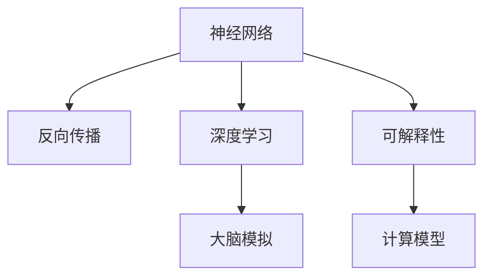

                 

# 大脑工作原理与机器模拟的探讨

## 1. 背景介绍

### 1.1 问题由来

人类大脑的复杂性和神秘性一直是科学家们探索的重要领域。大脑作为人类认知、思维、情感和行为的物质基础，其工作原理和机制的揭秘对人工智能的研究具有重要指导意义。随着人工智能技术的不断进步，尤其是深度学习的发展，人们开始尝试通过机器模拟大脑工作原理，以期实现更高效、智能、可靠的人工智能系统。

### 1.2 问题核心关键点

当前人工智能领域对大脑工作原理的研究，主要聚焦于以下几个关键问题：

- **神经网络结构与大脑结构的关系**：探索神经网络的结构是否能够模拟大脑神经元的连接和运作方式。
- **学习机制与大脑学习机制的对比**：分析神经网络中的反向传播、梯度下降等学习算法是否与大脑的学习机制相符。
- **计算模型与大脑计算机制的匹配**：考察深度学习中的卷积、池化、非线性激活等计算模型是否能够模拟大脑的计算和处理方式。
- **推理和决策过程**：研究神经网络如何进行复杂推理和决策，以及其是否与大脑的推理和决策过程相似。
- **可解释性和可控性**：探索神经网络能否具备类似大脑的可解释性和行为可控性，以便于在实际应用中对系统进行有效管理。

这些问题在神经科学和人工智能领域均有着广泛的研究基础和初步成果，但如何系统、深入地探讨这些问题，仍是一个复杂且富有挑战性的任务。

## 2. 核心概念与联系

### 2.1 核心概念概述

为深入探讨大脑工作原理与机器模拟的关系，本节将介绍几个关键概念：

- **神经网络（Neural Networks）**：模拟大脑神经元之间的连接和运作方式，通过大量人工神经元之间的相互作用来处理信息。
- **反向传播（Backpropagation）**：一种深度学习的核心算法，用于优化神经网络中的参数，使其更好地适应训练数据。
- **深度学习（Deep Learning）**：基于神经网络架构的机器学习技术，通过多层次的非线性变换来提高模型的表达能力。
- **大脑模拟（Brain Simulation）**：通过计算机模型模拟大脑的神经元、突触和网络结构，探索大脑的工作原理和功能。
- **可解释性（Explainability）**：确保人工智能系统的决策过程和行为可以被理解，以便于人类解释和信任。
- **计算模型（Computational Models）**：基于数学和物理模型，模拟大脑和神经网络的计算和处理过程。

这些核心概念之间的逻辑关系可以通过以下Mermaid流程图来展示：



这个流程图展示了神经网络在深度学习中的应用，以及它与大脑模拟、可解释性等概念的关系。

### 2.2 核心概念原理和架构

神经网络主要由以下几部分组成：

1. **输入层**：接收输入数据，通常对应大脑的感觉输入区域，如视觉、听觉等。
2. **隐藏层**：神经元通过激活函数进行计算和处理，通常对应大脑的认知和计算区域。
3. **输出层**：产生最终的输出结果，通常对应大脑的决策和行为区域。

神经网络中的每个神经元都可以看作是一个简单的计算单元，其输入和输出由权重和偏置控制。反向传播算法通过计算梯度来更新这些权重和偏置，使得神经网络能够不断优化，以更好地适应训练数据。

大脑模拟通常基于神经元和突触模型，模拟大脑的神经网络结构和运作方式。这种模拟可以帮助我们更好地理解大脑的认知过程和信息处理机制，进而设计更高效、更智能的神经网络。

## 3. 核心算法原理 & 具体操作步骤

### 3.1 算法原理概述

大脑工作原理与机器模拟的研究，涉及到多个学科的交叉和融合，包括神经科学、认知科学、计算机科学等。其中，神经网络作为机器模拟大脑工作原理的主要工具，其算法原理和具体操作步骤如下：

1. **神经网络结构设计**：根据大脑神经网络的结构特点，设计对应的神经网络结构，包括输入层、隐藏层、输出层等。
2. **参数初始化**：对神经网络的权重和偏置进行初始化，通常使用随机初始化或预训练模型等方式。
3. **数据准备**：收集和预处理训练数据，将其分为训练集、验证集和测试集。
4. **前向传播**：将输入数据通过神经网络进行正向传递，计算每层的输出。
5. **损失函数计算**：计算神经网络输出与实际标签之间的差异，得到损失函数值。
6. **反向传播**：通过反向传播算法计算梯度，更新神经网络的权重和偏置。
7. **参数更新**：根据优化算法（如SGD、Adam等）和损失函数梯度，更新神经网络的参数。
8. **迭代训练**：重复上述步骤，直至达到预设的训练轮数或收敛条件。
9. **模型评估**：在测试集上评估模型性能，使用各种评估指标（如准确率、召回率、F1-score等）。

### 3.2 算法步骤详解

下面是基于神经网络模拟大脑工作原理的具体操作步骤：

**Step 1: 神经网络结构设计**

1. **层数和单元数设计**：根据任务复杂度和数据规模，设计合适的神经网络结构。通常包括输入层、隐藏层和输出层，其中隐藏层数量和单元数需要仔细选择。
2. **激活函数选择**：选择合适的激活函数（如ReLU、Sigmoid、Tanh等），确保神经网络能够处理非线性变换。

**Step 2: 参数初始化**

1. **权重和偏置初始化**：使用随机初始化（如Gaussian或Uniform分布）或预训练模型的方式，初始化神经网络的权重和偏置。
2. **正则化**：应用L2正则、Dropout等技术，防止过拟合。

**Step 3: 数据准备**

1. **数据收集**：收集训练数据，并对其进行预处理，包括数据增强、归一化等。
2. **数据划分**：将数据划分为训练集、验证集和测试集，确保模型在独立数据集上的泛化能力。

**Step 4: 前向传播**

1. **输入数据**：将输入数据通过神经网络进行正向传递，计算每层的输出。
2. **激活函数**：对每个神经元的输出进行激活函数处理，得到下一层的输入。

**Step 5: 损失函数计算**

1. **计算损失**：使用合适的损失函数（如交叉熵、均方误差等）计算神经网络输出与实际标签之间的差异。
2. **梯度计算**：通过反向传播算法计算每个神经元的梯度。

**Step 6: 反向传播**

1. **梯度传递**：将梯度从输出层向输入层传递，更新每个神经元的权重和偏置。
2. **优化算法**：使用优化算法（如SGD、Adam等）根据梯度更新参数。

**Step 7: 参数更新**

1. **参数更新公式**：根据优化算法和梯度，更新神经网络的参数。
2. **学习率调整**：根据训练效果，动态调整学习率，确保模型收敛。

**Step 8: 迭代训练**

1. **训练循环**：重复执行前向传播、损失计算、反向传播和参数更新，直至达到预设的训练轮数或收敛条件。
2. **早停机制**：在验证集上评估模型性能，若性能不再提升，则停止训练。

**Step 9: 模型评估**

1. **测试集评估**：在测试集上评估模型性能，使用各种评估指标评估模型效果。
2. **结果分析**：分析模型在测试集上的表现，评估模型的泛化能力和鲁棒性。

### 3.3 算法优缺点

基于神经网络模拟大脑工作原理的算法具有以下优点：

1. **高泛化能力**：神经网络通过多层次的非线性变换，能够处理复杂的输入数据，具有较强的泛化能力。
2. **可解释性**：神经网络中的激活函数和权重可以被解释，有助于理解模型的决策过程。
3. **并行计算**：神经网络的计算可以通过并行计算加速，提高训练效率。

同时，该算法也存在以下缺点：

1. **黑盒问题**：神经网络通常被视为"黑盒"，其内部工作机制难以理解，缺乏可解释性。
2. **过拟合风险**：神经网络在大规模数据集上的训练可能导致过拟合，影响泛化能力。
3. **计算资源需求高**：神经网络需要大量的计算资源进行训练和推理，对硬件要求较高。
4. **参数复杂**：神经网络的参数数量巨大，优化复杂，容易出现梯度消失或爆炸的问题。

## 4. 数学模型和公式 & 详细讲解 & 举例说明

### 4.1 数学模型构建

本节将使用数学语言对神经网络模拟大脑工作原理的过程进行更加严格的刻画。

记神经网络为 $N(\theta)$，其中 $\theta$ 为神经网络的参数，包括权重和偏置。输入数据为 $x$，神经网络输出为 $y$。假设神经网络的结构为 $N(\theta) = \phi(W_1\phi(W_2\ldots\phi(W_Lx)\ldots)\phi(W_{L+1})$，其中 $\phi$ 为激活函数，$W_i$ 为权重矩阵。

神经网络的损失函数 $\mathcal{L}(\theta)$ 定义为：

$$
\mathcal{L}(\theta) = \frac{1}{N}\sum_{i=1}^N \ell(y_i,N(\theta;x_i))
$$

其中 $\ell$ 为损失函数（如交叉熵损失）。

神经网络的输出 $y$ 由输入 $x$ 和参数 $\theta$ 决定，通过前向传播和反向传播更新参数 $\theta$，最小化损失函数 $\mathcal{L}(\theta)$。

### 4.2 公式推导过程

以单层神经网络为例，推导其计算过程和梯度更新公式。

1. **前向传播**：

$$
z = Wx + b
$$

$$
a = \sigma(z)
$$

其中 $z$ 为加权输入，$b$ 为偏置，$\sigma$ 为激活函数，$a$ 为输出。

2. **损失函数计算**：

$$
\ell(y,N(\theta;x)) = \frac{1}{N}\sum_{i=1}^N [y_i \log N(\theta;x_i) + (1-y_i) \log (1-N(\theta;x_i))]
$$

3. **梯度计算**：

$$
\frac{\partial \mathcal{L}(\theta)}{\partial z_i} = \frac{\partial \ell(y,N(\theta;x))}{\partial z_i} = \frac{\partial \ell(y,N(\theta;x))}{\partial a_i} \frac{\partial a_i}{\partial z_i}
$$

4. **反向传播**：

$$
\frac{\partial \mathcal{L}(\theta)}{\partial W} = \frac{\partial \mathcal{L}(\theta)}{\partial z} \frac{\partial z}{\partial W}
$$

$$
\frac{\partial \mathcal{L}(\theta)}{\partial b} = \frac{\partial \mathcal{L}(\theta)}{\partial z} \frac{\partial z}{\partial b}
$$

5. **参数更新**：

$$
W \leftarrow W - \eta \frac{\partial \mathcal{L}(\theta)}{\partial W}
$$

$$
b \leftarrow b - \eta \frac{\partial \mathcal{L}(\theta)}{\partial b}
$$

其中 $\eta$ 为学习率。

通过以上推导，我们可以看到，神经网络模拟大脑工作原理的过程主要通过前向传播、损失计算、梯度计算和参数更新等步骤实现，从而优化神经网络参数，使其更好地适应训练数据。

### 4.3 案例分析与讲解

**案例分析：图像分类**

1. **数据准备**：收集图像分类数据集，如MNIST、CIFAR等，并进行预处理。
2. **神经网络设计**：设计卷积神经网络（CNN）结构，包括卷积层、池化层、全连接层等。
3. **模型训练**：使用反向传播算法和随机梯度下降（SGD）优化器训练模型。
4. **模型评估**：在测试集上评估模型性能，使用准确率、召回率等指标。

通过上述步骤，神经网络可以模拟大脑处理图像分类的过程，从原始像素数据到最终的分类结果。

## 5. 项目实践：代码实例和详细解释说明

### 5.1 开发环境搭建

在进行神经网络模拟大脑工作原理的实践前，我们需要准备好开发环境。以下是使用Python进行TensorFlow开发的环境配置流程：

1. 安装Anaconda：从官网下载并安装Anaconda，用于创建独立的Python环境。

2. 创建并激活虚拟环境：
```bash
conda create -n tf-env python=3.8 
conda activate tf-env
```

3. 安装TensorFlow：根据CUDA版本，从官网获取对应的安装命令。例如：
```bash
conda install tensorflow -c tf -c conda-forge
```

4. 安装各类工具包：
```bash
pip install numpy pandas scikit-learn matplotlib tqdm jupyter notebook ipython
```

完成上述步骤后，即可在`tf-env`环境中开始实践。

### 5.2 源代码详细实现

下面以图像分类任务为例，给出使用TensorFlow进行神经网络训练的Python代码实现。

首先，定义图像分类任务的数据处理函数：

```python
import tensorflow as tf
from tensorflow.keras.preprocessing.image import ImageDataGenerator

def prepare_data(data_dir, batch_size):
    train_datagen = ImageDataGenerator(rescale=1./255)
    train_generator = train_datagen.flow_from_directory(
        data_dir, 
        target_size=(28, 28), 
        batch_size=batch_size, 
        class_mode='categorical'
    )

    test_datagen = ImageDataGenerator(rescale=1./255)
    test_generator = test_datagen.flow_from_directory(
        data_dir, 
        target_size=(28, 28), 
        batch_size=batch_size, 
        class_mode='categorical', 
        shuffle=False
    )
    
    return train_generator, test_generator
```

然后，定义神经网络模型：

```python
from tensorflow.keras import layers, models

def build_model(input_shape):
    model = models.Sequential([
        layers.Conv2D(32, (3, 3), activation='relu', input_shape=input_shape),
        layers.MaxPooling2D((2, 2)),
        layers.Conv2D(64, (3, 3), activation='relu'),
        layers.MaxPooling2D((2, 2)),
        layers.Conv2D(64, (3, 3), activation='relu'),
        layers.Flatten(),
        layers.Dense(64, activation='relu'),
        layers.Dense(10, activation='softmax')
    ])
    
    return model
```

接着，定义训练和评估函数：

```python
from tensorflow.keras.optimizers import Adam

def train_model(model, train_generator, test_generator, epochs):
    model.compile(optimizer=Adam(learning_rate=0.001), loss='categorical_crossentropy', metrics=['accuracy'])

    history = model.fit(
        train_generator, 
        steps_per_epoch=len(train_generator),
        epochs=epochs,
        validation_data=test_generator, 
        validation_steps=len(test_generator)
    )
    
    test_loss, test_acc = model.evaluate(test_generator, steps=len(test_generator))
    print(f'Test accuracy: {test_acc:.4f}')
    
    return history, test_acc
```

最后，启动训练流程并在测试集上评估：

```python
data_dir = 'path/to/dataset'
batch_size = 64

train_generator, test_generator = prepare_data(data_dir, batch_size)
model = build_model(input_shape=(28, 28, 1))
history, test_acc = train_model(model, train_generator, test_generator, epochs=10)

print(f'Epoch {epochs+1}, train accuracy: {history.history["accuracy"][-1]:.4f}')
print(f'Epoch {epochs+1}, test accuracy: {test_acc:.4f}')
```

以上就是使用TensorFlow进行神经网络训练的完整代码实现。可以看到，借助TensorFlow强大的API，神经网络的搭建和训练过程变得简洁高效。

### 5.3 代码解读与分析

让我们再详细解读一下关键代码的实现细节：

**prepare_data函数**：
- `ImageDataGenerator`：用于数据增强和标准化，生成训练和测试数据集。
- `flow_from_directory`：从目录中加载图像，自动进行数据预处理和批处理。

**build_model函数**：
- `Sequential`：定义模型结构，包括卷积层、池化层、全连接层等。
- `Conv2D`：定义卷积层，包括卷积核大小、激活函数等。
- `MaxPooling2D`：定义池化层，减小特征图尺寸。
- `Flatten`：将特征图展开为一维向量。
- `Dense`：定义全连接层，包括激活函数和输出维度。

**train_model函数**：
- `compile`：编译模型，指定优化器、损失函数和评估指标。
- `fit`：进行模型训练，指定训练集、验证集、批次大小和训练轮数。
- `evaluate`：在测试集上评估模型性能，计算损失和准确率。

**训练流程**：
- 定义数据集和模型。
- 编译模型，指定优化器和损失函数。
- 训练模型，指定训练集、验证集、批次大小和训练轮数。
- 在测试集上评估模型性能，输出测试准确率。

可以看到，TensorFlow的高级API使得神经网络的搭建和训练过程变得简单直接，大大降低了开发门槛。同时，TensorFlow的灵活性和扩展性也为更复杂的神经网络设计和优化提供了可能。

当然，工业级的系统实现还需考虑更多因素，如模型保存和部署、超参数优化、分布式训练等。但核心的训练过程基本与此类似。

## 6. 实际应用场景

### 6.1 智能医疗诊断

神经网络模拟大脑工作原理在医疗诊断领域具有广泛的应用前景。通过模拟大脑的认知和推理能力，神经网络可以帮助医生快速、准确地诊断疾病。

在实践应用中，可以收集大量的医学影像数据和病例数据，训练深度神经网络模型进行图像分割、病变检测等任务。在实际应用中，医生只需输入患者的影像数据，系统便能自动分析并给出诊断结果，极大提高了诊断效率和准确性。

### 6.2 自动驾驶

自动驾驶系统需要高度的感知和决策能力，神经网络模拟大脑工作原理可以帮助实现这一目标。通过模拟大脑的视觉、听觉和触觉感知能力，神经网络能够实时处理传感器数据，做出最优驾驶决策。

在自动驾驶应用中，神经网络可以通过模拟大脑的感知和决策过程，实现目标检测、路径规划、避障等功能。同时，神经网络的多模态处理能力，使其能够更好地融合视觉、听觉、雷达等多源数据，提高系统的鲁棒性和安全性。

### 6.3 金融预测

神经网络模拟大脑工作原理在金融预测领域同样具有广泛的应用。通过模拟大脑的逻辑推理和决策能力，神经网络可以预测股票市场走势、风险评估等。

在金融预测应用中，神经网络可以通过模拟大脑的推理和决策过程，分析历史数据和市场动态，预测未来的股票价格和波动。同时，神经网络的泛化能力和鲁棒性，使其能够适应不同市场环境，提高预测的准确性和可靠性。

### 6.4 未来应用展望

随着神经网络模拟大脑工作原理技术的不断进步，其在各个领域的应用前景将更加广阔。

在智慧城市、教育、娱乐等领域，神经网络可以模拟大脑的感知、认知和决策能力，实现更高效、智能的服务和应用。同时，神经网络的多模态处理能力和鲁棒性，使其能够更好地应对复杂和多变的环境，提高系统的稳定性和可靠性。

## 7. 工具和资源推荐

### 7.1 学习资源推荐

为了帮助开发者系统掌握神经网络模拟大脑工作原理的理论基础和实践技巧，这里推荐一些优质的学习资源：

1. **《深度学习》课程**：斯坦福大学李飞飞教授开设的深度学习课程，涵盖神经网络、反向传播、深度学习等内容，是学习神经网络模拟大脑工作原理的重要基础。
2. **《深度学习入门》书籍**：通过通俗易懂的语言和丰富的案例，帮助读者快速入门深度学习，了解神经网络的基本原理和应用。
3. **TensorFlow官方文档**：TensorFlow的官方文档提供了全面的API介绍和示例代码，是学习神经网络模拟大脑工作原理的重要参考资料。
4. **《Neural Networks and Deep Learning》书籍**：由Michael Nielsen编写，详细介绍了神经网络的基本原理和实现方法，适合深入学习。
5. **Kaggle竞赛**：参与Kaggle竞赛，通过实际项目应用神经网络模拟大脑工作原理，积累经验和技能。

通过对这些资源的学习实践，相信你一定能够快速掌握神经网络模拟大脑工作原理的精髓，并用于解决实际的神经网络问题。

### 7.2 开发工具推荐

高效的开发离不开优秀的工具支持。以下是几款用于神经网络模拟大脑工作原理开发的常用工具：

1. **TensorFlow**：由Google主导开发的深度学习框架，提供了丰富的API和优化器，适合各种规模的神经网络应用。
2. **PyTorch**：Facebook开发的深度学习框架，灵活性和扩展性强，适合研究人员和开发者使用。
3. **MXNet**：由Apache开发的深度学习框架，支持多种编程语言和硬件平台，适合大规模分布式训练。
4. **Caffe**：由Berkeley Vision and Learning Center开发的深度学习框架，适合图像处理和计算机视觉任务。
5. **Keras**：基于TensorFlow和Theano的高级神经网络API，适合快速搭建和训练神经网络。

合理利用这些工具，可以显著提升神经网络模拟大脑工作原理的开发效率，加快创新迭代的步伐。

### 7.3 相关论文推荐

神经网络模拟大脑工作原理的研究源于学界的持续研究。以下是几篇奠基性的相关论文，推荐阅读：

1. **《深度神经网络》**：Yann LeCun等人撰写，详细介绍了深度神经网络的基本原理和应用，是神经网络领域的经典之作。
2. **《神经网络与深度学习》**：Michael Nielsen撰写，通过通俗易懂的语言和丰富的案例，介绍了神经网络的基本原理和实现方法。
3. **《ImageNet大规模视觉识别挑战赛》**：Alex Krizhevsky等人提出的深度卷积神经网络模型，在图像分类任务上取得了显著的效果。
4. **《Caffe: Convolutional Architecture for Fast Modeling》**：Jianlong Wu等人撰写的论文，介绍了Caffe框架的基本原理和实现方法。
5. **《TensorFlow: A System for Large-Scale Machine Learning》**：Jeff Dean等人撰写的论文，介绍了TensorFlow框架的基本原理和实现方法。

这些论文代表了大规模神经网络研究和应用的发展脉络。通过学习这些前沿成果，可以帮助研究者把握学科前进方向，激发更多的创新灵感。

## 8. 总结：未来发展趋势与挑战

### 8.1 总结

本文对神经网络模拟大脑工作原理的研究进行了全面系统的介绍。首先阐述了神经网络模拟大脑工作原理的研究背景和意义，明确了神经网络在大规模深度学习中的重要地位。其次，从原理到实践，详细讲解了神经网络的计算过程和训练方法，给出了神经网络训练的完整代码实例。同时，本文还广泛探讨了神经网络模拟大脑工作原理在多个领域的应用前景，展示了神经网络技术的广阔应用潜力。

通过本文的系统梳理，可以看到，神经网络模拟大脑工作原理在深度学习领域具有重要意义，已成为人工智能技术发展的重要方向。神经网络通过对大脑工作原理的模拟，在各个领域取得了显著的成果，推动了人工智能技术的不断进步。

### 8.2 未来发展趋势

展望未来，神经网络模拟大脑工作原理技术将呈现以下几个发展趋势：

1. **计算效率提升**：神经网络模拟大脑工作原理需要处理大量数据和复杂计算，未来的研究将更加注重计算效率和资源优化，使得神经网络能够在更短的时间内训练和推理。
2. **模型泛化能力增强**：通过更好地模拟大脑的认知和推理过程，神经网络将具备更强的泛化能力和鲁棒性，能够在更多复杂和多变的环境下表现出色。
3. **多模态处理能力增强**：未来的神经网络将具备更强的多模态处理能力，能够同时处理视觉、听觉、触觉等多源数据，提高系统的感知能力和决策能力。
4. **自适应和自学习能力的提升**：未来的神经网络将具备更强的自适应和自学习能力，能够实时调整和优化模型参数，适应环境变化。
5. **伦理和安全性考量**：神经网络模拟大脑工作原理在带来巨大应用价值的同时，也带来了伦理和安全性的挑战。未来的研究将更加注重神经网络的透明性、可解释性和安全性，确保系统的可控性和可信度。

以上趋势凸显了神经网络模拟大脑工作原理技术的广阔前景。这些方向的探索发展，必将进一步提升神经网络的性能和应用范围，为人工智能技术的发展带来新的突破。

### 8.3 面临的挑战

尽管神经网络模拟大脑工作原理技术已经取得了显著的进展，但在迈向更加智能化、普适化应用的过程中，仍面临诸多挑战：

1. **计算资源需求高**：神经网络模拟大脑工作原理需要处理大量数据和复杂计算，对算力和存储资源提出了很高的要求。未来的研究需要更加注重计算效率和资源优化。
2. **模型复杂性高**：神经网络模拟大脑工作原理的模型结构复杂，参数数量巨大，优化困难。未来的研究需要更加注重模型简化和优化。
3. **数据质量和多样性不足**：神经网络模拟大脑工作原理需要大量高质量和多样化的数据进行训练。数据质量和多样性不足的问题仍然存在，未来需要进一步探索如何高效获取和利用数据。
4. **模型可解释性不足**：神经网络模拟大脑工作原理的模型通常被视为"黑盒"系统，缺乏可解释性。未来需要探索更好的可解释性方法，确保模型的透明性和可信度。
5. **伦理和安全性问题**：神经网络模拟大脑工作原理的模型可能会学习到有害和偏见的内容，给社会带来潜在风险。未来需要探索更好的伦理和安全性措施，确保模型的使用安全可靠。

这些挑战将在大规模神经网络研究中始终存在，需要在未来进一步探索和解决。

### 8.4 研究展望

面对神经网络模拟大脑工作原理所面临的挑战，未来的研究需要在以下几个方面寻求新的突破：

1. **计算模型优化**：探索新的计算模型和优化算法，提高神经网络的处理效率和资源利用率。
2. **模型简化与优化**：研究更加简单和高效的神经网络结构，减少参数量和计算复杂度。
3. **数据获取与处理**：探索更高效的数据获取和处理方法，提高数据的质量和多样性。
4. **可解释性提升**：探索更好的可解释性方法，提高模型的透明性和可信度。
5. **伦理与安全性保障**：探索更好的伦理和安全性措施，确保神经网络的使用安全可靠。

这些研究方向将引领神经网络模拟大脑工作原理技术迈向更高的台阶，为构建安全、可靠、可解释、可控的智能系统铺平道路。面向未来，神经网络模拟大脑工作原理技术还需要与其他人工智能技术进行更深入的融合，如知识表示、因果推理、强化学习等，多路径协同发力，共同推动人工智能技术的发展。只有勇于创新、敢于突破，才能不断拓展神经网络的边界，让智能技术更好地造福人类社会。

## 9. 附录：常见问题与解答

**Q1：如何理解神经网络模拟大脑工作原理的意义？**

A: 神经网络模拟大脑工作原理的意义在于，通过理解和模拟大脑的认知、推理和决策过程，可以设计更加高效、智能和可靠的人工智能系统。神经网络通过对大脑神经网络结构的模拟，能够处理复杂的输入数据，具备强大的表达能力和泛化能力。

**Q2：神经网络模拟大脑工作原理的计算过程和训练方法是什么？**

A: 神经网络模拟大脑工作原理的计算过程和训练方法主要包括前向传播、损失计算、梯度计算和参数更新等步骤。具体步骤如下：
1. 输入数据通过神经网络进行前向传播，计算每层的输出。
2. 损失函数计算神经网络输出与实际标签之间的差异。
3. 梯度计算通过反向传播算法计算每个神经元的梯度。
4. 参数更新通过优化算法根据梯度更新神经网络的参数。
5. 重复执行前向传播、损失计算、梯度计算和参数更新，直至达到预设的训练轮数或收敛条件。

**Q3：神经网络模拟大脑工作原理的应用场景有哪些？**

A: 神经网络模拟大脑工作原理的应用场景包括医疗诊断、自动驾驶、金融预测、图像分类等。通过模拟大脑的感知、认知和决策能力，神经网络能够在这些领域实现高效、智能的应用。

**Q4：神经网络模拟大脑工作原理的优缺点有哪些？**

A: 神经网络模拟大脑工作原理具有以下优点：
1. 高泛化能力：神经网络通过多层次的非线性变换，能够处理复杂的输入数据，具备较强的泛化能力。
2. 可解释性：神经网络中的激活函数和权重可以被解释，有助于理解模型的决策过程。
3. 并行计算：神经网络的计算可以通过并行计算加速，提高训练效率。

同时，该算法也存在以下缺点：
1. 黑盒问题：神经网络通常被视为"黑盒"，其内部工作机制难以理解，缺乏可解释性。
2. 过拟合风险：神经网络在大规模数据集上的训练可能导致过拟合，影响泛化能力。
3. 计算资源需求高：神经网络需要大量的计算资源进行训练和推理，对硬件要求较高。
4. 参数复杂：神经网络的参数数量巨大，优化复杂，容易出现梯度消失或爆炸的问题。

**Q5：未来神经网络模拟大脑工作原理的发展方向有哪些？**

A: 未来神经网络模拟大脑工作原理的发展方向包括计算效率提升、模型泛化能力增强、多模态处理能力增强、自适应和自学习能力提升、伦理和安全性考量等。这些方向将引领神经网络模拟大脑工作原理技术迈向更高的台阶，为人工智能技术的发展带来新的突破。

---

作者：禅与计算机程序设计艺术 / Zen and the Art of Computer Programming

