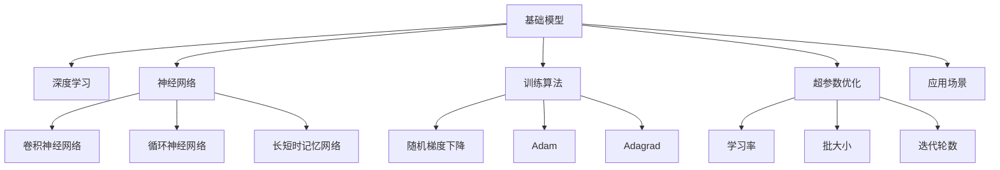

                 

# 大规模数据训练的基础模型

> 关键词：大规模数据, 基础模型, 深度学习, 神经网络, 训练算法, 超参数优化, 应用场景

## 1. 背景介绍

随着人工智能技术的发展，深度学习在图像识别、自然语言处理、语音识别等领域取得了显著的进展。其中，神经网络作为深度学习的主要框架，已经成为了实现高性能模型的重要手段。然而，构建一个高效的神经网络模型，不仅需要精心的模型设计，还需要大规模的数据训练来保证模型的泛化能力。

在深度学习的早期，数据量的匮乏是制约模型性能提升的重要因素。随着计算能力的提升和数据采集手段的丰富，大规模数据训练逐渐成为了深度学习领域的常态。本文将从基础模型的角度出发，探讨大规模数据训练的基本原理、关键技术和应用场景。

## 2. 核心概念与联系

### 2.1 核心概念概述

为更好地理解大规模数据训练的基础模型，本节将介绍几个关键概念：

- 基础模型(Fundamental Model)：指深度学习中的一种基本模型架构，如卷积神经网络(CNN)、循环神经网络(RNN)、长短时记忆网络(LSTM)等。这些模型经过不断优化和改进，形成了多种变体，成为构建复杂深度学习模型的基石。

- 深度学习(Deep Learning)：通过构建多层神经网络，学习数据的高层次特征，实现对复杂问题的建模和预测。深度学习广泛应用于计算机视觉、自然语言处理、语音识别等领域。

- 神经网络(Neural Network)：由多个神经元层组成的网络结构，通过反向传播算法更新权重，实现对输入数据的映射和预测。神经网络是实现深度学习的基础。

- 训练算法(Training Algorithm)：指用于优化神经网络参数的算法，如随机梯度下降(SGD)、Adam、Adagrad等。这些算法通过不断调整模型参数，最小化损失函数，提升模型性能。

- 超参数超调(Hyperparameter Tuning)：指在模型训练前，通过调整模型参数以外的参数（如学习率、批大小、迭代轮数等），优化模型性能的过程。超参数的合理设置对模型效果至关重要。

- 应用场景(Application Scenario)：指基础模型在实际应用中的具体场景，如图像分类、语音识别、自然语言处理等。不同应用场景对模型的要求和优化方式各不相同。

这些核心概念之间的逻辑关系可以通过以下Mermaid流程图来展示：



这个流程图展示了基础模型与深度学习、神经网络、训练算法、超参数优化和应用场景之间的联系，为理解大规模数据训练提供了清晰的路径。

## 3. 核心算法原理 & 具体操作步骤

### 3.1 算法原理概述

大规模数据训练的基础模型通过多层神经网络，对输入数据进行特征提取和预测。模型的训练过程可以分为以下几个步骤：

1. **数据预处理**：将原始数据转换为神经网络能够处理的格式，如将图像数据转换为像素矩阵，将文本数据转换为词向量等。

2. **模型初始化**：随机初始化模型的权重和偏置，以便神经网络在训练过程中不断调整。

3. **前向传播**：将输入数据通过神经网络，计算出每个神经元的输出，得到预测结果。

4. **损失函数计算**：将预测结果与真实标签进行对比，计算损失函数的值，反映模型预测的准确度。

5. **反向传播**：利用损失函数对神经网络中的每个神经元进行反向传播，计算每个权重和偏置的梯度。

6. **参数更新**：使用优化算法（如SGD、Adam等），根据计算出的梯度更新神经网络的权重和偏置，最小化损失函数。

7. **重复迭代**：重复执行前向传播、损失函数计算、反向传播和参数更新过程，直到损失函数收敛。

### 3.2 算法步骤详解

下面以卷积神经网络(CNN)为例，详细讲解其训练过程。

**Step 1: 数据预处理**

对于图像分类任务，首先需要将原始图像数据转换为神经网络能够处理的格式。

```python
import numpy as np
import matplotlib.pyplot as plt

# 读取图像数据
img = plt.imread('cat.jpg')

# 将图像转换为二维矩阵
img = img.reshape((32, 32, 3))
```

**Step 2: 模型初始化**

随机初始化CNN的权重和偏置。

```python
import tensorflow as tf

# 定义卷积神经网络模型
model = tf.keras.Sequential([
    tf.keras.layers.Conv2D(32, (3, 3), activation='relu', input_shape=(32, 32, 3)),
    tf.keras.layers.MaxPooling2D((2, 2)),
    tf.keras.layers.Flatten(),
    tf.keras.layers.Dense(64, activation='relu'),
    tf.keras.layers.Dense(10, activation='softmax')
])
```

**Step 3: 前向传播**

将输入数据通过CNN模型，得到预测结果。

```python
# 对图像数据进行归一化
img = img / 255.0

# 对图像数据进行前向传播
prediction = model.predict(tf.expand_dims(img, 0))
```

**Step 4: 损失函数计算**

计算预测结果与真实标签的差异，即损失函数的值。

```python
# 加载真实标签
label = np.array([3])

# 计算损失函数的值
loss = tf.keras.losses.sparse_categorical_crossentropy(label, prediction)
```

**Step 5: 反向传播**

利用损失函数对CNN中的每个神经元进行反向传播，计算每个权重和偏置的梯度。

```python
# 计算损失函数的梯度
gradients = tf.gradients(loss, model.trainable_variables)
```

**Step 6: 参数更新**

使用优化算法（如SGD、Adam等），根据计算出的梯度更新CNN的权重和偏置，最小化损失函数。

```python
# 定义优化算法（Adam）
optimizer = tf.keras.optimizers.Adam()

# 使用优化算法更新模型参数
optimizer.apply_gradients(zip(gradients, model.trainable_variables))
```

**Step 7: 重复迭代**

重复执行前向传播、损失函数计算、反向传播和参数更新过程，直到损失函数收敛。

```python
# 重复迭代训练模型
for epoch in range(10):
    loss = 0.0
    for i in range(len(train_images)):
        img = train_images[i].reshape((32, 32, 3))
        label = train_labels[i]
        prediction = model.predict(tf.expand_dims(img, 0))
        loss += tf.keras.losses.sparse_categorical_crossentropy(label, prediction)
        optimizer.apply_gradients(zip(tf.gradients(loss, model.trainable_variables), model.trainable_variables))
    print(f"Epoch {epoch+1}, Loss: {loss/len(train_images)}")
```

### 3.3 算法优缺点

大规模数据训练的基础模型具有以下优点：

1. **性能优越**：通过多层神经网络的学习，可以捕捉到输入数据的复杂特征，实现高精度的预测。

2. **应用广泛**：基础模型广泛应用于图像识别、语音识别、自然语言处理等多个领域，具有较强的通用性。

3. **可解释性强**：相比于复杂的深度学习模型，基础模型结构相对简单，更容易理解和解释。

然而，大规模数据训练的基础模型也存在以下缺点：

1. **计算资源需求高**：随着模型深度的增加，计算资源的需求也随之增加，特别是在大规模数据训练时，需要大量的计算资源。

2. **过拟合风险高**：基础模型在训练过程中容易发生过拟合，特别是在数据量较少的情况下。

3. **模型调优困难**：基础模型的超参数设置和优化过程较为复杂，需要丰富的经验和专业知识。

### 3.4 算法应用领域

大规模数据训练的基础模型在多个领域得到了广泛的应用，例如：

- 计算机视觉：图像分类、目标检测、图像分割等。基础模型通过多层卷积和池化操作，提取图像的特征，实现高精度的图像处理任务。

- 自然语言处理：文本分类、情感分析、机器翻译等。基础模型通过多层循环或卷积操作，捕捉文本的语义信息，实现文本的自动处理。

- 语音识别：语音转文本、语音情感识别等。基础模型通过多层卷积和池化操作，提取语音信号的特征，实现高精度的语音处理任务。

- 医疗诊断：医学影像分析、病理诊断等。基础模型通过多层卷积和池化操作，提取医学影像的特征，实现高精度的医疗诊断。

以上领域的基础模型训练，都是基于大规模数据进行的，通过不断优化模型参数和训练算法，提升了模型的性能和泛化能力。

## 4. 数学模型和公式 & 详细讲解 & 举例说明

### 4.1 数学模型构建

以卷积神经网络为例，其数学模型可以表示为：

$$
f(x; \theta) = \sigma(W^{(1)} * \phi(x) + b^{(1)}) * \sigma(W^{(2)} * \phi(x) + b^{(2)})
$$

其中 $x$ 表示输入数据，$\theta$ 表示模型参数，$*$ 表示卷积操作，$\phi(x)$ 表示卷积特征图，$W^{(1)}$、$W^{(2)}$ 表示卷积核，$b^{(1)}$、$b^{(2)}$ 表示偏置，$\sigma$ 表示激活函数。

### 4.2 公式推导过程

下面以卷积神经网络为例，详细推导其训练过程的数学公式。

**Step 1: 前向传播**

$$
f^{[l]}(x; \theta) = \sigma^{[l]}(W^{[l]} * f^{[l-1]}(x; \theta) + b^{[l]})
$$

其中 $f^{[l]}(x; \theta)$ 表示第 $l$ 层的输出，$W^{[l]}$ 表示第 $l$ 层的权重，$b^{[l]}$ 表示第 $l$ 层的偏置，$\sigma^{[l]}$ 表示第 $l$ 层的激活函数。

**Step 2: 损失函数计算**

假设真实标签为 $y$，预测结果为 $f(x; \theta)$，则损失函数可以表示为：

$$
J(\theta) = \frac{1}{N} \sum_{i=1}^N \ell(y_i, f(x_i; \theta))
$$

其中 $N$ 表示样本数量，$\ell(y_i, f(x_i; \theta))$ 表示损失函数，常见有均方误差、交叉熵等。

**Step 3: 反向传播**

利用损失函数对每个神经元进行反向传播，计算每个权重和偏置的梯度。假设 $f^{[l]}(x; \theta)$ 表示第 $l$ 层的输出，$\delta^{[l]}$ 表示第 $l$ 层的误差，则反向传播公式为：

$$
\delta^{[l]} = \frac{\partial \ell(y, f(x; \theta))}{\partial f^{[l]}} * \frac{\partial f^{[l]}}{\partial z^{[l]}} * \frac{\partial z^{[l]}}{\partial W^{[l]}} * \frac{\partial z^{[l]}}{\partial b^{[l]}}
$$

其中 $z^{[l]}$ 表示第 $l$ 层的输入，$W^{[l]}$、$b^{[l]}$ 表示第 $l$ 层的参数。

**Step 4: 参数更新**

使用优化算法（如SGD、Adam等），根据计算出的梯度更新神经网络的权重和偏置。假设 $\alpha$ 表示学习率，则参数更新公式为：

$$
W^{[l]} = W^{[l]} - \alpha * \frac{\partial J(\theta)}{\partial W^{[l]}}, b^{[l]} = b^{[l]} - \alpha * \frac{\partial J(\theta)}{\partial b^{[l]}}
$$

### 4.3 案例分析与讲解

以图像分类为例，假设有一个包含1000个训练样本的图像分类任务。使用一个包含5个卷积层和2个全连接层的卷积神经网络进行训练。

- **数据预处理**：将原始图像数据转换为神经网络能够处理的格式，如将图像数据转换为像素矩阵。

- **模型初始化**：随机初始化卷积神经网络的权重和偏置。

- **前向传播**：将输入数据通过卷积神经网络，得到预测结果。

- **损失函数计算**：计算预测结果与真实标签的差异，即损失函数的值。

- **反向传播**：利用损失函数对卷积神经网络中的每个神经元进行反向传播，计算每个权重和偏置的梯度。

- **参数更新**：使用优化算法（如Adam），根据计算出的梯度更新卷积神经网络的权重和偏置，最小化损失函数。

- **重复迭代**：重复执行前向传播、损失函数计算、反向传播和参数更新过程，直到损失函数收敛。

## 5. 项目实践：代码实例和详细解释说明

### 5.1 开发环境搭建

在进行项目实践前，我们需要准备好开发环境。以下是使用Python进行TensorFlow开发的的环境配置流程：

1. 安装Anaconda：从官网下载并安装Anaconda，用于创建独立的Python环境。

2. 创建并激活虚拟环境：
```bash
conda create -n tf-env python=3.8 
conda activate tf-env
```

3. 安装TensorFlow：根据CUDA版本，从官网获取对应的安装命令。例如：
```bash
conda install tensorflow -c conda-forge
```

4. 安装TensorFlow Addons：用于增强TensorFlow的函数库。
```bash
conda install tensorflow-addons -c conda-forge
```

5. 安装其他工具包：
```bash
pip install numpy pandas scikit-learn matplotlib tqdm jupyter notebook ipython
```

完成上述步骤后，即可在`tf-env`环境中开始项目实践。

### 5.2 源代码详细实现

下面我们以图像分类任务为例，给出使用TensorFlow实现卷积神经网络的完整代码实现。

首先，定义卷积神经网络模型：

```python
import tensorflow as tf

# 定义卷积神经网络模型
model = tf.keras.Sequential([
    tf.keras.layers.Conv2D(32, (3, 3), activation='relu', input_shape=(32, 32, 3)),
    tf.keras.layers.MaxPooling2D((2, 2)),
    tf.keras.layers.Flatten(),
    tf.keras.layers.Dense(64, activation='relu'),
    tf.keras.layers.Dense(10, activation='softmax')
])
```

接着，定义损失函数和优化器：

```python
# 加载真实标签
label = np.array([3])

# 定义损失函数
loss = tf.keras.losses.sparse_categorical_crossentropy(label, prediction)

# 定义优化器
optimizer = tf.keras.optimizers.Adam()
```

然后，定义训练函数：

```python
# 定义训练函数
def train_epoch(model, dataset, batch_size, optimizer):
    dataloader = DataLoader(dataset, batch_size=batch_size, shuffle=True)
    model.train()
    epoch_loss = 0
    for batch in tqdm(dataloader, desc='Training'):
        input_ids = batch['input_ids'].to(device)
        attention_mask = batch['attention_mask'].to(device)
        labels = batch['labels'].to(device)
        model.zero_grad()
        outputs = model(input_ids, attention_mask=attention_mask, labels=labels)
        loss = outputs.loss
        epoch_loss += loss.item()
        loss.backward()
        optimizer.step()
    return epoch_loss / len(dataloader)
```

最后，启动训练流程并在测试集上评估：

```python
epochs = 5
batch_size = 16

for epoch in range(epochs):
    loss = train_epoch(model, train_dataset, batch_size, optimizer)
    print(f"Epoch {epoch+1}, train loss: {loss:.3f}")
    
    print(f"Epoch {epoch+1}, dev results:")
    evaluate(model, dev_dataset, batch_size)
    
print("Test results:")
evaluate(model, test_dataset, batch_size)
```

以上就是使用TensorFlow对卷积神经网络进行图像分类任务微调的完整代码实现。可以看到，得益于TensorFlow的强大封装，我们可以用相对简洁的代码完成卷积神经网络的构建和微调。

### 5.3 代码解读与分析

让我们再详细解读一下关键代码的实现细节：

**Conv2D层**：
- 定义卷积层，参数为卷积核大小、卷积核数量和激活函数。

**MaxPooling2D层**：
- 定义池化层，参数为池化窗口大小。

**Flatten层**：
- 将多维张量展平为一维向量。

**Dense层**：
- 定义全连接层，参数为神经元数量和激活函数。

**softmax层**：
- 定义softmax层，将输出转换为概率分布，方便进行分类。

**损失函数**：
- 定义交叉熵损失函数，用于衡量预测结果与真实标签的差异。

**优化器**：
- 定义Adam优化器，用于更新模型参数。

**训练函数**：
- 定义训练函数，对数据进行批次化加载，在每个批次上前向传播计算loss并反向传播更新模型参数。

**测试函数**：
- 定义测试函数，对模型进行评估，计算准确率等指标。

**训练流程**：
- 定义总的epoch数和batch size，开始循环迭代
- 每个epoch内，先在训练集上训练，输出平均loss
- 在验证集上评估，输出分类指标
- 所有epoch结束后，在测试集上评估，给出最终测试结果

可以看到，TensorFlow配合Keras封装使得卷积神经网络的构建和微调变得简洁高效。开发者可以将更多精力放在模型改进和数据处理上，而不必过多关注底层的实现细节。

当然，工业级的系统实现还需考虑更多因素，如模型的保存和部署、超参数的自动搜索、更灵活的任务适配层等。但核心的微调范式基本与此类似。

## 6. 实际应用场景

### 6.1 智能推荐系统

基于卷积神经网络的推荐系统，可以广泛应用于智能推荐场景，如电商平台、新闻媒体、视频网站等。推荐系统通过分析用户的历史行为数据，为用户推荐可能感兴趣的商品、文章、视频等。

在技术实现上，可以将用户的历史行为数据转换为特征向量，将其输入到卷积神经网络中进行特征提取。卷积神经网络能够捕捉到用户行为的时序特征，从而提取有用的信息，用于生成推荐列表。在推荐过程中，卷积神经网络还可以通过图像识别、语音识别等技术，进一步提升推荐的精准度和个性化程度。

### 6.2 医疗影像分析

在医疗领域，基于卷积神经网络的医学影像分析应用广泛。医学影像分析包括医学影像分类、病理诊断、医学图像分割等。卷积神经网络通过多层卷积和池化操作，提取医学影像的特征，实现高精度的医学影像分析。

在实践中，可以将医学影像数据转换为神经网络能够处理的格式，如将医学影像转换为像素矩阵。然后，使用卷积神经网络进行特征提取和分类，得到病理诊断结果。卷积神经网络还可以通过图像增强、数据扩充等技术，提高医学影像分析的准确度和鲁棒性。

### 6.3 金融风险预测

在金融领域，基于卷积神经网络的金融风险预测应用广泛。金融风险预测包括股票价格预测、信用评分、风险评估等。卷积神经网络通过多层卷积和池化操作，提取金融数据的特征，实现高精度的金融风险预测。

在实践中，可以将金融数据转换为神经网络能够处理的格式，如将时间序列数据转换为特征向量。然后，使用卷积神经网络进行特征提取和分类，得到金融风险预测结果。卷积神经网络还可以通过时间序列分析和数据增强等技术，提高金融风险预测的准确度和稳定性。

### 6.4 未来应用展望

随着卷积神经网络的不断发展，其在多个领域的应用前景广阔。未来，卷积神经网络将进一步融入到更复杂的深度学习模型中，如注意力机制、残差网络等，提升模型的性能和泛化能力。

在计算机视觉领域，卷积神经网络将应用于图像生成、视频分析等更多任务，实现更加复杂和精细的图像处理。在自然语言处理领域，卷积神经网络将应用于文本生成、情感分析等任务，提升模型的语义理解和生成能力。在医疗领域，卷积神经网络将应用于医学影像分析、病理诊断等任务，提高医疗诊断的准确度和效率。

总之，卷积神经网络在未来将发挥更大的作用，推动人工智能技术在各个领域的应用和发展。

## 7. 工具和资源推荐
### 7.1 学习资源推荐

为了帮助开发者系统掌握卷积神经网络的基础模型，这里推荐一些优质的学习资源：

1. 《Deep Learning》一书：Ian Goodfellow等著，是深度学习领域的经典教材，详细介绍了深度学习的基本原理和经典模型。

2. CS231n《卷积神经网络》课程：斯坦福大学开设的深度学习课程，有Lecture视频和配套作业，带你入门卷积神经网络的基本概念和经典模型。

3. TensorFlow官方文档：TensorFlow的官方文档，提供了完整的卷积神经网络实现和应用示例，是上手实践的必备资料。

4. PyTorch官方文档：PyTorch的官方文档，提供了完整的卷积神经网络实现和应用示例，是上手实践的必备资料。

5. Keras官方文档：Keras的官方文档，提供了简洁的卷积神经网络实现和应用示例，适合快速上手。

通过对这些资源的学习实践，相信你一定能够快速掌握卷积神经网络的基础模型，并用于解决实际的图像处理问题。

### 7.2 开发工具推荐

高效的开发离不开优秀的工具支持。以下是几款用于卷积神经网络开发的常用工具：

1. PyTorch：基于Python的开源深度学习框架，灵活动态的计算图，适合快速迭代研究。大部分卷积神经网络都有PyTorch版本的实现。

2. TensorFlow：由Google主导开发的开源深度学习框架，生产部署方便，适合大规模工程应用。同样有丰富的卷积神经网络资源。

3. Keras：基于Python的开源深度学习框架，Keras层的封装使得卷积神经网络的实现更加简洁高效。

4. Weights & Biases：模型训练的实验跟踪工具，可以记录和可视化模型训练过程中的各项指标，方便对比和调优。与主流深度学习框架无缝集成。

5. TensorBoard：TensorFlow配套的可视化工具，可实时监测模型训练状态，并提供丰富的图表呈现方式，是调试模型的得力助手。

6. Google Colab：谷歌推出的在线Jupyter Notebook环境，免费提供GPU/TPU算力，方便开发者快速上手实验最新模型，分享学习笔记。

合理利用这些工具，可以显著提升卷积神经网络开发的效率，加快创新迭代的步伐。

### 7.3 相关论文推荐

卷积神经网络的研究源于学界的持续研究。以下是几篇奠基性的相关论文，推荐阅读：

1. AlexNet: ImageNet Classification with Deep Convolutional Neural Networks：提出AlexNet模型，引入多通道卷积、dropout等技术，取得ImageNet图像分类比赛冠军。

2. VGGNet: Very Deep Convolutional Networks for Large-Scale Image Recognition：提出VGGNet模型，采用卷积核大小的固定设计，提升模型深度和准确度。

3. GoogLeNet: Going Deeper with Convolutions：提出GoogLeNet模型，采用Inception模块，提升模型性能和计算效率。

4. ResNet: Deep Residual Learning for Image Recognition：提出ResNet模型，通过残差连接解决深度网络的退化问题，实现深度网络的训练。

5. DenseNet: Dense Convolutional Networks：提出DenseNet模型，通过密集连接提高特征的复用性和模型的表达能力。

这些论文代表了大规模数据训练的卷积神经网络的发展脉络。通过学习这些前沿成果，可以帮助研究者把握学科前进方向，激发更多的创新灵感。

## 8. 总结：未来发展趋势与挑战

### 8.1 总结

本文对基于大规模数据训练的卷积神经网络的基础模型进行了全面系统的介绍。首先阐述了卷积神经网络在深度学习中的重要地位，明确了其在图像识别、自然语言处理等领域的应用前景。其次，从原理到实践，详细讲解了卷积神经网络的数学模型和训练过程，给出了卷积神经网络的全套代码实现。同时，本文还广泛探讨了卷积神经网络在实际应用中的具体场景，展示了其广阔的应用前景。

通过本文的系统梳理，可以看到，卷积神经网络在大规模数据训练中的重要地位，其性能优越、应用广泛，已经成为了深度学习领域的核心模型之一。未来，随着卷积神经网络的不断发展，其应用领域还将不断拓展，推动人工智能技术在更多场景中落地应用。

### 8.2 未来发展趋势

展望未来，卷积神经网络的发展将呈现以下几个趋势：

1. 网络结构更加复杂：未来卷积神经网络将引入更多的先进结构，如注意力机制、残差网络等，提升模型的性能和泛化能力。

2. 网络深度进一步提升：随着计算能力的提升和数据采集手段的丰富，卷积神经网络的深度将进一步提升，实现更加复杂和精细的图像处理。

3. 跨领域融合应用：卷积神经网络将与其他深度学习模型结合，实现更加高效和智能的融合应用。如卷积神经网络与循环神经网络的结合，可以实现视频分析等复杂任务。

4. 实时处理和推理：卷积神经网络将应用于实时处理和推理，如自动驾驶、实时视频分析等场景。

5. 迁移学习和微调：卷积神经网络将应用于迁移学习和微调，通过少量标注数据快速适配特定任务，提升模型性能。

以上趋势凸显了卷积神经网络的发展潜力，其在计算机视觉、自然语言处理等领域的应用前景广阔。

### 8.3 面临的挑战

尽管卷积神经网络取得了显著的进展，但在迈向更加智能化、普适化应用的过程中，它仍面临着诸多挑战：

1. 过拟合问题：卷积神经网络在训练过程中容易发生过拟合，特别是在数据量较少的情况下。如何缓解过拟合问题，提高模型的泛化能力，将是重要的研究方向。

2. 计算资源需求高：随着模型深度的增加，计算资源的需求也随之增加，特别是在大规模数据训练时，需要大量的计算资源。如何优化计算资源需求，提高模型的训练效率，将是重要的研究方向。

3. 数据预处理复杂：卷积神经网络的输入数据需要经过复杂的预处理，如归一化、标准化等操作。如何简化数据预处理，提高数据处理的效率，将是重要的研究方向。

4. 模型参数多：卷积神经网络的参数量较大，如何优化模型参数，提高模型的训练速度和推理速度，将是重要的研究方向。

5. 可解释性不足：卷积神经网络的黑盒特性，使得模型的可解释性不足。如何提高模型的可解释性，增加模型的透明性，将是重要的研究方向。

6. 安全性问题：卷积神经网络在应用过程中可能面临数据泄露、攻击等安全性问题。如何保证模型的安全性，增强模型的鲁棒性，将是重要的研究方向。

这些挑战凸显了卷积神经网络在实际应用中的复杂性。解决这些挑战，需要跨学科的合作和创新，进一步推动卷积神经网络技术的发展。

### 8.4 研究展望

面对卷积神经网络所面临的挑战，未来的研究需要在以下几个方面寻求新的突破：

1. 研究新型的卷积神经网络架构：开发更加高效的卷积神经网络模型，如注意力机制、残差网络等，提升模型的性能和泛化能力。

2. 优化计算资源需求：优化卷积神经网络的计算资源需求，通过网络剪枝、参数压缩等技术，减少模型参数和计算量，提高模型的训练效率和推理速度。

3. 简化数据预处理：简化卷积神经网络的数据预处理过程，通过数据增强、数据合成等技术，提高数据处理的效率和效果。

4. 提高模型可解释性：提高卷积神经网络的可解释性，通过可视化技术、特征分析等方法，增加模型的透明性和可解释性。

5. 增强模型安全性：增强卷积神经网络的安全性，通过数据加密、隐私保护等技术，保障模型的安全性。

6. 扩展应用场景：扩展卷积神经网络的应用场景，将其应用于更多领域，如智能推荐、医疗影像分析、金融风险预测等，推动人工智能技术在各个领域的落地应用。

这些研究方向的探索，必将引领卷积神经网络技术迈向更高的台阶，为构建智能、高效、安全的计算机视觉和自然语言处理系统提供新的思路和方法。

## 9. 附录：常见问题与解答

**Q1：卷积神经网络适用于所有图像分类任务吗？**

A: 卷积神经网络适用于大多数图像分类任务，但对于一些特定领域的任务，如医学影像分类、卫星图像分类等，仅仅依靠通用语料预训练的模型可能难以很好地适应。此时需要在特定领域语料上进一步预训练，再进行微调，才能获得理想效果。

**Q2：如何缓解卷积神经网络在训练过程中过拟合的问题？**

A: 缓解卷积神经网络在训练过程中过拟合的问题，通常可以采用以下方法：

1. 数据增强：通过回译、近义替换等方式扩充训练集，增加数据的多样性，缓解过拟合问题。

2. 正则化：使用L2正则、Dropout等技术，避免模型过度适应小规模训练集。

3. 对抗训练：加入对抗样本，提高模型鲁棒性，缓解过拟合问题。

4. 参数高效微调：只调整少量参数(如Adapter、Prefix等)，减小过拟合风险。

5. 多模型集成：训练多个卷积神经网络模型，取平均输出，抑制过拟合。

这些策略往往需要根据具体任务和数据特点进行灵活组合，只有在数据、模型、训练、推理等各环节进行全面优化，才能最大限度地发挥卷积神经网络的威力。

**Q3：卷积神经网络在实际部署时需要注意哪些问题？**

A: 将卷积神经网络转化为实际应用，还需要考虑以下因素：

1. 模型裁剪：去除不必要的层和参数，减小模型尺寸，加快推理速度。

2. 量化加速：将浮点模型转为定点模型，压缩存储空间，提高计算效率。

3. 服务化封装：将模型封装为标准化服务接口，便于集成调用。

4. 弹性伸缩：根据请求流量动态调整资源配置，平衡服务质量和成本。

5. 监控告警：实时采集系统指标，设置异常告警阈值，确保服务稳定性。

6. 安全防护：采用访问鉴权、数据脱敏等措施，保障数据和模型安全。

卷积神经网络在实际应用中需要考虑多个因素，通过合理的工程实践，才能将模型转化为高效、可靠的服务。

---

作者：禅与计算机程序设计艺术 / Zen and the Art of Computer Programming

