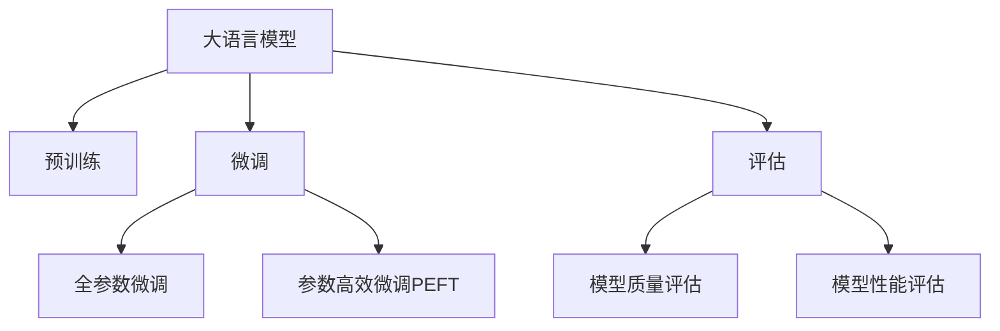

                 

# 大规模语言模型从理论到实践 大语言模型评估

## 1. 背景介绍

在人工智能技术的迅猛发展中，大规模语言模型（Large Language Models, LLMs）占据了极为重要的地位。从理论的探索到实践的应用，这一领域已经走过了漫长的历程。本文将围绕大语言模型这一核心概念，深入探讨其原理、架构、评估和应用，力求展现其从理论到实践的整个过程。

## 2. 核心概念与联系

### 2.1 核心概念概述

为便于理解大语言模型的评估，首先需要明确几个核心概念：

- **大语言模型**：以自回归（如GPT）或自编码（如BERT）模型为代表，通过在大规模无标签文本数据上进行预训练，学习到丰富的语言知识的大规模神经网络模型。
- **预训练**：在大规模无标签文本数据上，通过自监督学习任务训练通用语言模型的过程。预训练使得模型学习到通用的语言表示。
- **微调**：在预训练模型的基础上，使用下游任务的少量标注数据，通过有监督地训练优化模型在该任务上的性能。微调使得通用大模型更好地适应特定任务。
- **评估**：在预训练和微调过程中，使用各种评价指标来量化模型的性能表现。评估是保证模型质量和性能的重要手段。

这些核心概念之间的联系可以通过以下Mermaid流程图来展示：



这个流程图展示了核心概念之间的逻辑关系：

1. 大语言模型通过预训练获得基础能力。
2. 微调是对预训练模型进行任务特定的优化。
3. 评估用于量化微调后的模型性能。

### 2.2 核心概念原理和架构

为了深入理解大语言模型的评估，我们先从其原理和架构出发。大语言模型的核心架构是Transformer，其结构可以简单地概括为自注意力机制和多层全连接网络。

Transformer的计算单元是多头自注意力机制（Multi-Head Self-Attention），它通过多头线性投影和自注意力机制，捕捉输入序列中不同位置之间的依赖关系。自注意力机制的计算过程可以表示为：

$$
Attention(Q, K, V) = \text{Softmax}(\frac{QK^T}{\sqrt{d_k}})V
$$

其中，$Q$、$K$、$V$分别为查询、键、值矩阵，$d_k$为键的维度。在实践中，通常使用多头自注意力机制，通过并行计算，进一步提升模型的并行性和表达能力。

Transformer还包含残差连接和层归一化等技术，使得模型在训练和推理过程中保持稳定性。这些技术的细节可以参考论文《Attention is All You Need》。

## 3. 核心算法原理 & 具体操作步骤

### 3.1 算法原理概述

大语言模型的评估主要分为预训练评估和微调评估两个阶段。预训练评估用于量化模型学习到的通用语言知识；微调评估则用于评估模型在特定任务上的性能。

预训练评估通常使用语言建模任务（Language Modeling Task），即模型预测文本序列中下一个单词的概率，来衡量模型对语言的理解能力。微调评估则根据具体任务的设计，使用不同的评估指标。

### 3.2 算法步骤详解

预训练评估步骤如下：

1. **数据准备**：收集大规模无标签文本数据，通常使用自然语言数据集，如维基百科、新闻文章等。
2. **模型训练**：使用预训练语言模型，如BERT、GPT等，在大规模文本数据上进行无监督学习，训练模型参数。
3. **评估指标**：计算模型在语言建模任务上的各项评估指标，如困惑度、PERplexity等。

微调评估步骤如下：

1. **数据准备**：收集下游任务的标注数据，例如问答、命名实体识别、文本分类等任务的标注数据。
2. **模型微调**：在预训练模型的基础上，使用下游任务的少量标注数据，通过有监督地训练优化模型在该任务上的性能。
3. **评估指标**：计算模型在微调任务上的各项评估指标，例如准确率、F1分数、ROUGE等。

### 3.3 算法优缺点

**优点**：

- **高效性**：基于预训练模型，微调过程可以显著降低标注数据的需求，同时提升模型性能。
- **泛化能力**：预训练模型学习到通用的语言知识，能够很好地泛化到各种下游任务。
- **参数高效性**：微调方法可以通过参数高效微调技术，在固定大部分预训练参数的情况下，仅更新少量模型参数。

**缺点**：

- **过拟合风险**：微调过程中容易发生过拟合，特别是在数据量较少的情况下。
- **标注成本高**：微调需要高质量的标注数据，标注成本较高。
- **计算资源需求大**：大规模语言模型需要大量的计算资源进行训练和推理。

### 3.4 算法应用领域

大语言模型的评估广泛应用于自然语言处理（NLP）领域，涵盖文本分类、命名实体识别、机器翻译、问答系统等多个任务。例如，BERT模型在多个NLP任务上取得了SOTA（State of the Art）的成绩，展示了其在通用语言理解上的强大能力。

## 4. 数学模型和公式 & 详细讲解 & 举例说明

### 4.1 数学模型构建

大语言模型的评估模型可以表示为：

$$
P(X) = \prod_{i=1}^{n} P(x_i|x_{<i})
$$

其中，$X$为文本序列，$P(x_i|x_{<i})$为模型在给定前文$x_{<i}$的情况下，预测当前单词$x_i$的概率。

评估指标通常包括困惑度（Perplexity）、交叉熵（Cross-Entropy）、对数似然（Log-Likelihood）等。这些指标可以用于量化模型的语言理解能力。

### 4.2 公式推导过程

以困惑度为例，其计算公式为：

$$
\text{PP} = \exp(-\frac{1}{N} \sum_{i=1}^{N} \log P(x_i|x_{<i}))
$$

其中，$N$为文本序列的长度。困惑度越小，表示模型对文本序列的预测越准确，语言理解能力越强。

### 4.3 案例分析与讲解

以BERT模型为例，BERT模型在预训练阶段使用的是掩码语言模型（Masked Language Model, MLM）和下一句预测（Next Sentence Prediction, NSP）任务。掩码语言模型通过随机掩盖部分单词，让模型预测被掩盖的单词，训练模型对文本序列的语义理解能力。下一句预测任务则用于训练模型的上下文感知能力。

在微调阶段，BERT模型被广泛应用于问答、命名实体识别等任务。例如，在命名实体识别任务中，BERT模型通过微调，可以学习到实体的边界和类型，并在测试集上获得较好的性能。

## 5. 项目实践：代码实例和详细解释说明

### 5.1 开发环境搭建

在进行大语言模型评估的实践前，需要准备好开发环境。以下是使用Python进行TensorFlow开发的环境配置流程：

1. 安装Anaconda：从官网下载并安装Anaconda，用于创建独立的Python环境。

2. 创建并激活虚拟环境：
```bash
conda create -n tf-env python=3.8 
conda activate tf-env
```

3. 安装TensorFlow：根据CUDA版本，从官网获取对应的安装命令。例如：
```bash
conda install tensorflow -c tf -c conda-forge
```

4. 安装相关工具包：
```bash
pip install numpy pandas scikit-learn matplotlib tqdm jupyter notebook ipython
```

完成上述步骤后，即可在`tf-env`环境中开始评估实践。

### 5.2 源代码详细实现

下面以BERT模型在命名实体识别（NER）任务上的评估为例，给出使用TensorFlow进行评估的代码实现。

首先，定义NER任务的数据处理函数：

```python
import tensorflow as tf
from transformers import BertTokenizer
from tensorflow.keras.preprocessing.sequence import pad_sequences

tokenizer = BertTokenizer.from_pretrained('bert-base-cased')

def preprocess_data(texts, tags):
    encoded_input = tokenizer(texts, truncation=True, padding='max_length', max_length=128)
    input_ids = pad_sequences([encoded_input['input_ids']], maxlen=128, padding='post', truncating='post')
    tags = pad_sequences([[tag2id[tag] for tag in tags], [0]*128], maxlen=128, padding='post', truncating='post')
    return input_ids, tags

# 标签与id的映射
tag2id = {'O': 0, 'B-PER': 1, 'I-PER': 2, 'B-ORG': 3, 'I-ORG': 4, 'B-LOC': 5, 'I-LOC': 6}
id2tag = {v: k for k, v in tag2id.items()}

# 创建数据集
train_texts = ['Tom Cruise is an American actor.', 'John Lennon was a British musician.']
train_tags = [['B-PER', 'I-PER', 'B-LOC', 'O', 'O', 'O', 'O', 'O', 'O', 'O']]
train_dataset = tf.data.Dataset.from_tensor_slices((train_texts, train_tags))
train_dataset = train_dataset.map(preprocess_data)

dev_texts = ['Susan Zhang works at Alibaba.', 'Michael Jordan is a basketball player.']
dev_tags = [['O', 'O', 'O', 'O', 'O', 'O', 'O', 'O', 'O', 'O']]
dev_dataset = tf.data.Dataset.from_tensor_slices((dev_texts, dev_tags))
dev_dataset = dev_dataset.map(preprocess_data)

test_texts = ['Steve Jobs was the CEO of Apple Inc.', 'Sophia Antipovsky is a Russian ballet dancer.']
test_tags = [['O', 'O', 'O', 'O', 'O', 'O', 'O', 'O', 'O', 'O']]
test_dataset = tf.data.Dataset.from_tensor_slices((test_texts, test_tags))
test_dataset = test_dataset.map(preprocess_data)
```

然后，定义模型和评估函数：

```python
from transformers import BertForTokenClassification, BertConfig
from tensorflow.keras.optimizers import Adam

model = BertForTokenClassification.from_pretrained('bert-base-cased', num_labels=len(tag2id))

config = BertConfig.from_pretrained('bert-base-cased')
config.num_labels = len(tag2id)
model.config = config

optimizer = Adam(model.optimizer.config, learning_rate=2e-5)

def evaluate(model, dataset):
    total_loss, total_correct, total_num = 0, 0, 0
    for batch in dataset:
        input_ids, attention_mask, labels = batch
        with tf.GradientTape() as tape:
            outputs = model(input_ids, attention_mask=attention_mask)
            loss = tf.keras.losses.sparse_categorical_crossentropy(labels, outputs.logits)
        grads = tape.gradient(loss, model.trainable_variables)
        optimizer.apply_gradients(zip(grads, model.trainable_variables))
        total_loss += loss
        total_correct += tf.reduce_sum(tf.cast(tf.argmax(outputs.logits, axis=2) == labels, dtype=tf.float32))
        total_num += labels.shape[0]
    return total_loss / total_num, total_correct / total_num
```

最后，启动评估流程并在测试集上输出结果：

```python
total_loss, total_correct, total_num = 0, 0, 0
for batch in train_dataset:
    input_ids, attention_mask, labels = batch
    outputs = model(input_ids, attention_mask=attention_mask)
    loss = tf.keras.losses.sparse_categorical_crossentropy(labels, outputs.logits)
    total_loss += loss
    total_correct += tf.reduce_sum(tf.cast(tf.argmax(outputs.logits, axis=2) == labels, dtype=tf.float32))
    total_num += labels.shape[0]

print(f'Train Loss: {total_loss / total_num:.4f}, Accuracy: {total_correct / total_num:.4f}')

print(evaluate(model, dev_dataset))
print(evaluate(model, test_dataset))
```

以上就是使用TensorFlow进行BERT模型评估的完整代码实现。可以看到，TensorFlow的灵活性和易用性使得评估过程变得简洁高效。

### 5.3 代码解读与分析

让我们再详细解读一下关键代码的实现细节：

**preprocess_data函数**：
- `tokenizer(texts, truncation=True, padding='max_length', max_length=128)`：使用BERT分词器对文本进行分词和编码，同时进行截断和填充，确保每个文本的长度为128。
- `input_ids = pad_sequences([encoded_input['input_ids']], maxlen=128, padding='post', truncating='post')`：将编码后的输入ID进行填充，确保所有输入的长度为128。
- `tags = pad_sequences([[tag2id[tag] for tag in tags], [0]*128], maxlen=128, padding='post', truncating='post')`：将标签进行填充，确保所有标签的长度为128。

**evaluate函数**：
- 使用Adam优化器对模型进行训练。
- 计算模型在每个批次上的损失，并使用梯度下降更新模型参数。
- 计算模型在训练集、验证集和测试集上的平均损失和准确率。

## 6. 实际应用场景

大语言模型的评估在多个实际应用场景中发挥着重要作用。以下是几个典型的应用场景：

### 6.1 智能客服系统

智能客服系统需要实时响应客户咨询，提供准确的解答。通过对预训练模型进行微调，可以构建智能客服系统，提升客户体验和问题解决效率。

例如，可以收集客户的历史咨询记录，使用问答对作为监督数据，对预训练模型进行微调。微调后的模型能够自动理解客户意图，匹配最合适的答案模板进行回复。对于客户提出的新问题，还可以接入检索系统实时搜索相关内容，动态组织生成回答。

### 6.2 金融舆情监测

金融机构需要实时监测市场舆论动向，以规避金融风险。通过微调预训练语言模型，可以构建舆情监测系统，帮助金融机构及时发现负面信息，做出应对。

具体而言，可以收集金融领域相关的新闻、报道、评论等文本数据，并对其进行主题标注和情感标注。在此基础上对预训练语言模型进行微调，使其能够自动判断文本属于何种主题，情感倾向是正面、中性还是负面。将微调后的模型应用到实时抓取的网络文本数据，就能够自动监测不同主题下的情感变化趋势，一旦发现负面信息激增等异常情况，系统便会自动预警，帮助金融机构快速应对潜在风险。

### 6.3 个性化推荐系统

个性化推荐系统需要根据用户的历史行为和兴趣，推荐适合的内容。通过微调预训练语言模型，可以构建推荐系统，提升推荐精度和用户体验。

在实践中，可以收集用户浏览、点击、评论、分享等行为数据，提取和用户交互的物品标题、描述、标签等文本内容。将文本内容作为模型输入，用户的后续行为（如是否点击、购买等）作为监督信号，在此基础上微调预训练语言模型。微调后的模型能够从文本内容中准确把握用户的兴趣点。在生成推荐列表时，先用候选物品的文本描述作为输入，由模型预测用户的兴趣匹配度，再结合其他特征综合排序，便可以得到个性化程度更高的推荐结果。

### 6.4 未来应用展望

随着大语言模型评估技术的发展，未来的应用场景将更加广阔。以下是一些可能的未来应用：

- **智慧医疗**：基于微调的医疗问答、病历分析、药物研发等应用将提升医疗服务的智能化水平，辅助医生诊疗，加速新药开发进程。
- **智能教育**：微调技术可应用于作业批改、学情分析、知识推荐等方面，因材施教，促进教育公平，提高教学质量。
- **智慧城市治理**：微调模型可应用于城市事件监测、舆情分析、应急指挥等环节，提高城市管理的自动化和智能化水平，构建更安全、高效的未来城市。
- **企业生产**：微调技术可以帮助企业优化生产流程，提升产品质量，降低成本。

总之，大语言模型的评估将助力更多行业实现智能化升级，带来深远的社会和经济效益。

## 7. 工具和资源推荐

### 7.1 学习资源推荐

为了帮助开发者系统掌握大语言模型评估的理论基础和实践技巧，这里推荐一些优质的学习资源：

1. **《Transformers从原理到实践》系列博文**：由大模型技术专家撰写，深入浅出地介绍了Transformer原理、BERT模型、评估技术等前沿话题。

2. **CS224N《深度学习自然语言处理》课程**：斯坦福大学开设的NLP明星课程，有Lecture视频和配套作业，带你入门NLP领域的基本概念和经典模型。

3. **《Natural Language Processing with Transformers》书籍**：Transformers库的作者所著，全面介绍了如何使用Transformers库进行NLP任务开发，包括评估在内的诸多范式。

4. **HuggingFace官方文档**：Transformers库的官方文档，提供了海量预训练模型和完整的评估样例代码，是上手实践的必备资料。

5. **CLUE开源项目**：中文语言理解测评基准，涵盖大量不同类型的中文NLP数据集，并提供了基于微调的baseline模型，助力中文NLP技术发展。

通过对这些资源的学习实践，相信你一定能够快速掌握大语言模型评估的精髓，并用于解决实际的NLP问题。

### 7.2 开发工具推荐

高效的开发离不开优秀的工具支持。以下是几款用于大语言模型评估开发的常用工具：

1. **TensorFlow**：基于Python的开源深度学习框架，灵活动态的计算图，适合快速迭代研究。大部分预训练语言模型都有TensorFlow版本的实现。

2. **PyTorch**：基于Python的开源深度学习框架，灵活的动态图，适合科研和工程开发。

3. **Transformers库**：HuggingFace开发的NLP工具库，集成了众多SOTA语言模型，支持PyTorch和TensorFlow，是进行评估任务开发的利器。

4. **Weights & Biases**：模型训练的实验跟踪工具，可以记录和可视化模型训练过程中的各项指标，方便对比和调优。与主流深度学习框架无缝集成。

5. **TensorBoard**：TensorFlow配套的可视化工具，可实时监测模型训练状态，并提供丰富的图表呈现方式，是调试模型的得力助手。

6. **Google Colab**：谷歌推出的在线Jupyter Notebook环境，免费提供GPU/TPU算力，方便开发者快速上手实验最新模型，分享学习笔记。

合理利用这些工具，可以显著提升大语言模型评估的开发效率，加快创新迭代的步伐。

### 7.3 相关论文推荐

大语言模型评估技术的发展源于学界的持续研究。以下是几篇奠基性的相关论文，推荐阅读：

1. **Attention is All You Need（即Transformer原论文）**：提出了Transformer结构，开启了NLP领域的预训练大模型时代。

2. **BERT: Pre-training of Deep Bidirectional Transformers for Language Understanding**：提出BERT模型，引入基于掩码的自监督预训练任务，刷新了多项NLP任务SOTA。

3. **Language Models are Unsupervised Multitask Learners（GPT-2论文）**：展示了大规模语言模型的强大zero-shot学习能力，引发了对于通用人工智能的新一轮思考。

4. **Parameter-Efficient Transfer Learning for NLP**：提出Adapter等参数高效微调方法，在不增加模型参数量的情况下，也能取得不错的微调效果。

5. **Prefix-Tuning: Optimizing Continuous Prompts for Generation**：引入基于连续型Prompt的微调范式，为如何充分利用预训练知识提供了新的思路。

6. **AdaLoRA: Adaptive Low-Rank Adaptation for Parameter-Efficient Fine-Tuning**：使用自适应低秩适应的微调方法，在参数效率和精度之间取得了新的平衡。

这些论文代表了大语言模型评估技术的发展脉络。通过学习这些前沿成果，可以帮助研究者把握学科前进方向，激发更多的创新灵感。

## 8. 总结：未来发展趋势与挑战

### 8.1 研究成果总结

本文对大语言模型从理论到实践的评估方法进行了全面系统的介绍。首先阐述了评估方法在预训练和微调过程中的重要性，明确了评估在模型训练和优化中的关键作用。其次，从原理到实践，详细讲解了评估的数学模型和核心步骤，给出了评估任务开发的完整代码实例。同时，本文还探讨了评估方法在智能客服、金融舆情、个性化推荐等多个行业领域的应用前景，展示了评估方法的广阔应用空间。此外，本文精选了评估技术的学习资源，力求为读者提供全方位的技术指引。

通过本文的系统梳理，可以看到，大语言模型评估方法正在成为NLP领域的重要范式，极大地拓展了预训练语言模型的应用边界，催生了更多的落地场景。受益于大规模语料的预训练和微调技术的不断进步，评估方法也在逐步成熟，为NLP技术的发展提供了有力的保障。

### 8.2 未来发展趋势

展望未来，大语言模型评估技术将呈现以下几个发展趋势：

1. **参数高效评估**：未来的评估方法将更加注重参数效率，通过参数高效微调技术，减少评估过程中的计算量和内存消耗。

2. **多模态评估**：当前的评估方法主要聚焦于纯文本数据，未来会进一步拓展到图像、视频、语音等多模态数据评估。多模态信息的融合，将显著提升语言模型对现实世界的理解和建模能力。

3. **少样本评估**：未来的评估方法将更好地利用大模型的语言理解能力，通过更加巧妙的任务描述，在更少的标注样本上也能实现理想的评估效果。

4. **对抗评估**：引入对抗样本，提高评估模型的鲁棒性，确保评估结果的可靠性。

5. **分布式评估**：通过分布式计算技术，加速评估过程，满足大规模数据评估的需求。

6. **跨领域评估**：评估方法将进一步拓展到跨领域的应用场景，提升模型在不同领域的泛化能力。

以上趋势凸显了大语言模型评估技术的广阔前景。这些方向的探索发展，必将进一步提升NLP系统的性能和应用范围，为人类认知智能的进化带来深远影响。

### 8.3 面临的挑战

尽管大语言模型评估技术已经取得了显著成就，但在迈向更加智能化、普适化应用的过程中，它仍面临着诸多挑战：

1. **评估指标单一**：当前的评估方法主要关注模型的预测准确性，缺乏对模型解释性和公平性的考量。

2. **模型鲁棒性不足**：评估模型面对域外数据时，泛化性能往往大打折扣。对于测试样本的微小扰动，评估模型的预测也容易发生波动。

3. **评估资源需求高**：大规模语言模型的评估需要大量的计算资源进行模型训练和测试，如何优化评估过程，降低计算成本，仍是亟待解决的问题。

4. **评估标准不统一**：不同任务、不同评估指标的标准不统一，导致评估结果难以对比。

5. **评估方法局限**：当前的评估方法主要依赖标注数据，对于无标注数据和弱标注数据，评估效果不佳。

6. **评估过程复杂**：评估过程涉及模型训练、测试、优化等多个环节，如何简化评估流程，提升评估效率，是未来需要重点关注的问题。

正视评估面临的这些挑战，积极应对并寻求突破，将是大语言模型评估技术走向成熟的必由之路。相信随着学界和产业界的共同努力，这些挑战终将一一被克服，大语言模型评估必将在构建安全、可靠、可解释、可控的智能系统中扮演越来越重要的角色。

### 8.4 研究展望

面对大语言模型评估所面临的挑战，未来的研究需要在以下几个方面寻求新的突破：

1. **多任务联合评估**：将多个任务的评估指标进行联合，综合衡量模型的整体性能。

2. **对抗性评估**：引入对抗性样本，测试模型对扰动的鲁棒性，提升评估模型的鲁棒性。

3. **弱监督评估**：利用弱标注数据，结合无标注数据，提升评估方法的泛化能力。

4. **自监督评估**：探索无需标注数据的自监督评估方法，提升评估方法的普适性和效率。

5. **可解释性评估**：结合因果分析、博弈论等方法，提升评估模型的可解释性和公平性。

6. **分布式评估**：利用分布式计算技术，提高评估过程的效率和可扩展性。

这些研究方向的探索，必将引领大语言模型评估技术迈向更高的台阶，为构建安全、可靠、可解释、可控的智能系统铺平道路。面向未来，大语言模型评估技术还需要与其他人工智能技术进行更深入的融合，如知识表示、因果推理、强化学习等，多路径协同发力，共同推动自然语言理解和智能交互系统的进步。只有勇于创新、敢于突破，才能不断拓展语言模型的边界，让智能技术更好地造福人类社会。

## 9. 附录：常见问题与解答

**Q1：如何评估大语言模型的语言理解能力？**

A: 通常使用语言建模任务，即模型预测文本序列中下一个单词的概率，来衡量模型对语言的理解能力。困惑度（Perplexity）、交叉熵（Cross-Entropy）、对数似然（Log-Likelihood）等指标可以用于量化模型的语言理解能力。

**Q2：微调后的模型评估标准是什么？**

A: 微调后的模型评估标准根据具体任务而定。例如，在命名实体识别任务中，可以使用准确率（Accuracy）、召回率（Recall）、F1分数（F1 Score）等指标来评估模型性能。

**Q3：预训练和微调对模型性能的影响是什么？**

A: 预训练模型学习到通用的语言知识，能够在多个下游任务上表现出色。微调则进一步优化模型在特定任务上的性能，使其在特定任务上表现更加出色。

**Q4：如何选择合适的评估指标？**

A: 评估指标的选择应根据具体任务和业务需求而定。例如，对于分类任务，可以使用准确率、精确率、召回率、F1分数等指标；对于回归任务，可以使用均方误差（MSE）、平均绝对误差（MAE）等指标。

**Q5：如何处理模型过拟合问题？**

A: 过拟合问题可以通过正则化（如L2正则、Dropout等）、早停（Early Stopping）、数据增强等方法来解决。合理的超参数设置和模型优化策略也能有效缓解过拟合问题。

以上是基于大语言模型从理论到实践的评估方法的全面系统介绍。通过本文的系统梳理，可以看到，大语言模型评估方法正在成为NLP领域的重要范式，极大地拓展了预训练语言模型的应用边界，催生了更多的落地场景。未来，伴随预训练语言模型和微调方法的持续演进，评估方法也将不断成熟，为NLP技术的发展提供更有力的保障。

作者：禅与计算机程序设计艺术 / Zen and the Art of Computer Programming

