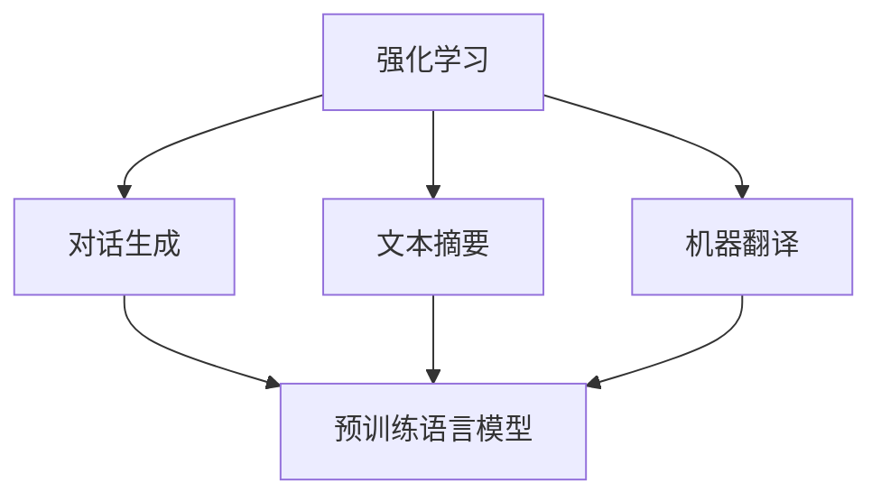

                 

# 大规模语言模型从理论到实践 强化学习概述

## 1. 背景介绍

### 1.1 问题由来
强化学习（Reinforcement Learning, RL）是一种基于试错的学习方式，它与监督学习和无监督学习不同，后者依赖于事先标注好的数据集。在强化学习中，学习者（通常是一组参数化的策略）通过与环境交互，根据环境的反馈（通常是奖励或惩罚信号）不断调整策略，最终学习到最优策略。

近年来，强化学习在许多领域取得了显著的进展，包括游戏（如AlphaGo、AlphaStar）、机器人控制、自动驾驶等。在自然语言处理（NLP）领域，强化学习也开始崭露头角，广泛应用于对话生成、文本摘要、机器翻译等任务，为大规模语言模型（Large Language Model, LLM）的训练和优化提供了新的思路。

### 1.2 问题核心关键点
强化学习在大语言模型中的应用，核心在于利用强化学习的框架，对预训练模型进行任务适配，使其能够更好地适应特定任务。这一范式有助于解决传统微调方法中数据标注成本高、模型过拟合等问题。

具体而言，强化学习的关键点包括：
- 设计适当的奖励函数，引导模型学习目标任务。
- 选择合适的策略学习算法，优化模型参数。
- 处理高维连续空间，增强模型的泛化能力。
- 控制学习过程，避免路径爆炸和局部最优。

本文将详细介绍强化学习在大语言模型中的应用，包括算法原理、具体操作步骤、实际应用场景等，以期为NLP从业者提供全面的理论和技术支持。

## 2. 核心概念与联系

### 2.1 核心概念概述

为更好地理解强化学习在大语言模型中的应用，本节将介绍几个密切相关的核心概念：

- 强化学习（Reinforcement Learning, RL）：基于试错的学习方法，通过与环境交互，不断调整策略以最大化累积奖励。
- 预训练语言模型（Pre-trained Language Model, PLM）：如BERT、GPT等，通过大规模无标签文本数据进行自监督预训练，获得通用的语言表示。
- 对话生成（Dialogue Generation）：构建能够自动生成响应，与用户进行自然交互的系统。
- 文本摘要（Text Summarization）：将长篇文本转换为简短、关键的信息摘要。
- 机器翻译（Machine Translation, MT）：将一种语言的文本转换为另一种语言的文本。

这些核心概念之间的逻辑关系可以通过以下Mermaid流程图来展示：



这个流程图展示了大语言模型和强化学习的核心概念及其之间的关系：

1. 预训练语言模型通过大规模无标签文本数据进行预训练，获得通用的语言表示。
2. 强化学习利用预训练模型作为"环境"，通过交互调整策略，优化模型在特定任务上的性能。
3. 强化学习在大语言模型的基础上，可以用于对话生成、文本摘要、机器翻译等NLP任务。

这些概念共同构成了大语言模型的学习和应用框架，使其能够在各种场景下发挥强大的语言理解和生成能力。通过理解这些核心概念，我们可以更好地把握强化学习在大语言模型中的应用。

## 3. 核心算法原理 & 具体操作步骤

### 3.1 算法原理概述

强化学习在大语言模型中的应用，本质上是一种任务适配（Task Adaptation）方法，即通过强化学习框架，对预训练模型进行特定任务的学习。其核心思想是：将预训练模型作为环境，通过与任务目标的交互，学习最优的策略参数，使得模型能够在特定任务上获得最佳性能。

形式化地，假设预训练语言模型为 $M_{\theta}$，其中 $\theta$ 为模型参数。给定一个任务 $T$，强化学习的目标是找到最优策略 $\pi$，使得在任务 $T$ 上的累积奖励 $J_{T}(\pi)$ 最大化。这里 $J_{T}(\pi)$ 为任务 $T$ 上的期望奖励，可以定义为：

$$
J_{T}(\pi) = \mathbb{E}\left[\sum_{t=0}^{\infty} \gamma^t R(s_t, a_t, s_{t+1})\right]
$$

其中 $s_t$ 表示当前状态，$a_t$ 表示当前策略下的动作（即模型输出的单词序列），$R(s_t, a_t, s_{t+1})$ 表示状态转移时的奖励。

在实际应用中，我们通常使用蒙特卡洛（Monte Carlo）方法、时序差分学习（Temporal Difference Learning）等方法，通过不断与环境交互，逐步优化策略 $\pi$，使得模型在特定任务上的性能逐渐提升。

### 3.2 算法步骤详解

强化学习在大语言模型中的应用，一般包括以下几个关键步骤：

**Step 1: 设计奖励函数**

设计奖励函数是强化学习任务适配的第一步。需要根据任务特点，设计合适的奖励函数 $R(s_t, a_t, s_{t+1})$，引导模型学习目标任务。例如，对于对话生成任务，奖励函数可以设计为对用户响应的满意度评分；对于文本摘要任务，奖励函数可以设计为摘要文本与原始文本的相关度评分。

**Step 2: 确定策略学习算法**

选择合适的策略学习算法是强化学习任务适配的关键。常用的策略学习算法包括：

- 策略梯度方法（Policy Gradient Methods）：直接优化策略 $\pi$，通过梯度上升更新参数。
- 基于值的方法（Value-Based Methods）：先学习状态值函数 $V(s_t)$ 或动作值函数 $Q(s_t, a_t)$，再根据值函数优化策略 $\pi$。
- 模型预测方法（Model-Based Methods）：利用模型 $M$ 预测下一步状态和奖励，通过最大化累计奖励来优化策略。

**Step 3: 优化模型参数**

使用策略学习算法，优化模型参数 $\theta$，使得在特定任务上获得最佳性能。这通常包括：

- 设计损失函数：根据奖励函数设计损失函数 $L(\theta)$，通过优化损失函数来更新模型参数。
- 优化器选择：选择合适的优化器（如Adam、SGD等）和超参数，如学习率、批大小等，进行模型参数更新。
- 训练过程控制：设定训练轮数、早期停止条件等，控制训练过程，避免过拟合和欠拟合。

**Step 4: 评估和部署**

在训练完成后，评估模型在特定任务上的性能，并进行模型部署。这通常包括：

- 验证集评估：在验证集上评估模型的性能，选择最优模型进行后续测试。
- 测试集评估：在测试集上评估模型的性能，对比微调前后的效果提升。
- 模型部署：将模型集成到实际应用系统中，进行大规模部署。

以上是强化学习在大语言模型中的应用的一般流程。在实际应用中，还需要根据具体任务特点，对算法步骤进行优化设计，如改进奖励函数设计、引入更多正则化技术、搜索最优的超参数组合等，以进一步提升模型性能。

### 3.3 算法优缺点

强化学习在大语言模型中的应用，具有以下优点：

- 动态适应性强：强化学习可以根据任务目标，动态调整模型参数，适应任务变化。
- 泛化能力强：通过强化学习，模型能够从无标签数据中学习任务特征，泛化能力更强。
- 数据标注成本低：强化学习不需要大量标注数据，只需少量带有奖励信号的数据即可训练。
- 模型性能提升明显：通过强化学习微调，模型在特定任务上能够显著提升性能。

同时，该方法也存在一定的局限性：

- 学习过程复杂：强化学习需要大量的试错过程，学习效率较低。
- 策略优化困难：选择合适的策略学习算法和奖励函数，是强化学习的关键难题。
- 路径爆炸问题：高维连续空间中的优化问题，容易导致路径爆炸和局部最优。
- 控制难度高：控制学习过程，避免过拟合和欠拟合，需要丰富的经验。

尽管存在这些局限性，但强化学习在大语言模型中的应用，已经展现出强大的潜力和生命力，为NLP任务的优化提供了新的路径。未来相关研究的重点在于如何进一步提高强化学习的学习效率和策略优化能力，同时兼顾模型性能和泛化能力。

### 3.4 算法应用领域

强化学习在大语言模型中的应用，已经在NLP领域得到了广泛的应用，覆盖了多个任务类型，例如：

- 对话生成：构建能够自动生成响应，与用户进行自然交互的系统。
- 文本摘要：将长篇文本转换为简短、关键的信息摘要。
- 机器翻译：将一种语言的文本转换为另一种语言的文本。
- 文本分类：如情感分析、主题分类等。
- 命名实体识别：识别文本中的人名、地名、机构名等特定实体。
- 关系抽取：从文本中抽取实体之间的语义关系。

除了上述这些经典任务外，强化学习也被创新性地应用到更多场景中，如文本纠错、文本生成、文本补全等，为NLP技术带来了全新的突破。随着强化学习方法的不断进步，相信NLP技术将在更广阔的应用领域大放异彩。

## 4. 数学模型和公式 & 详细讲解 & 举例说明

### 4.1 数学模型构建

本节将使用数学语言对强化学习在大语言模型中的应用进行更加严格的刻画。

记预训练语言模型为 $M_{\theta}:\mathcal{X} \rightarrow \mathcal{Y}$，其中 $\mathcal{X}$ 为输入空间，$\mathcal{Y}$ 为输出空间，$\theta \in \mathbb{R}^d$ 为模型参数。假设强化学习任务的目标是最大化任务 $T$ 上的期望奖励 $J_{T}(\pi)$。

定义状态 $s_t$ 为模型在时间步 $t$ 的输出状态，动作 $a_t$ 为模型在时间步 $t$ 输出的单词序列，奖励 $R(s_t, a_t, s_{t+1})$ 表示状态转移时的奖励。任务 $T$ 上的期望奖励可以表示为：

$$
J_{T}(\pi) = \mathbb{E}\left[\sum_{t=0}^{\infty} \gamma^t R(s_t, a_t, s_{t+1})\right]
$$

其中 $\gamma \in [0,1]$ 为折扣因子，控制未来奖励的权重。

### 4.2 公式推导过程

以下我们以对话生成任务为例，推导强化学习模型在对话生成中的应用。

假设对话模型 $M_{\theta}$ 在时间步 $t$ 输出的动作为 $a_t = M_{\theta}(s_t)$，其中 $s_t$ 为当前对话状态。奖励函数 $R(s_t, a_t, s_{t+1})$ 可以设计为对用户响应的满意度评分。

定义对话生成模型的累计奖励为：

$$
J_{D}(\pi) = \mathbb{E}\left[\sum_{t=0}^{\infty} \gamma^t R(s_t, a_t, s_{t+1})\right]
$$

在实际应用中，我们通常使用基于值的强化学习方法，如Q-learning，来优化对话生成模型。Q-learning的核心思想是学习状态值函数 $Q(s_t, a_t)$，使得 $Q(s_t, a_t)$ 近似于模型在状态 $s_t$ 下采取动作 $a_t$ 的累积期望奖励。

Q-learning的目标是最小化损失函数 $L(Q(s_t, a_t))$，使得 $Q(s_t, a_t)$ 逼近 $J_{D}(\pi)$。其更新公式为：

$$
Q(s_t, a_t) \leftarrow Q(s_t, a_t) + \eta(\mathcal{R}(s_t, a_t, s_{t+1}) - Q(s_t, a_t))
$$

其中 $\mathcal{R}(s_t, a_t, s_{t+1})$ 为当前状态 $s_t$ 下采取动作 $a_t$ 的实际奖励，$\eta$ 为学习率。

在得到状态值函数 $Q(s_t, a_t)$ 后，即可使用Q-learning更新模型参数 $\theta$，使得在对话生成任务上获得最佳性能。

## 5. 项目实践：代码实例和详细解释说明

### 5.1 开发环境搭建

在进行强化学习实践前，我们需要准备好开发环境。以下是使用Python进行PyTorch开发的环境配置流程：

1. 安装Anaconda：从官网下载并安装Anaconda，用于创建独立的Python环境。

2. 创建并激活虚拟环境：
```bash
conda create -n pytorch-env python=3.8 
conda activate pytorch-env
```

3. 安装PyTorch：根据CUDA版本，从官网获取对应的安装命令。例如：
```bash
conda install pytorch torchvision torchaudio cudatoolkit=11.1 -c pytorch -c conda-forge
```

4. 安装TensorFlow：
```bash
pip install tensorflow
```

5. 安装TensorBoard：
```bash
pip install tensorboard
```

6. 安装OpenAI Gym：
```bash
pip install gym
```

完成上述步骤后，即可在`pytorch-env`环境中开始强化学习实践。

### 5.2 源代码详细实现

这里我们以对话生成任务为例，给出使用Reinforcement Learning库对GPT-2模型进行对话生成微调的PyTorch代码实现。

首先，定义对话生成环境的接口和模型：

```python
from transformers import GPT2Tokenizer, GPT2LMHeadModel
import gym
import torch

class DialogueEnv(gym.Env):
    def __init__(self, model, tokenizer):
        self.model = model
        self.tokenizer = tokenizer
        self.state = None
        self.last_state = None
        self.last_reward = None

    def reset(self):
        self.state = None
        self.last_state = None
        self.last_reward = None
        return self

    def step(self, action):
        token_ids = self.tokenizer.encode(str(action), return_tensors='pt', add_special_tokens=True)
        input_ids = token_ids if self.state is None else torch.cat([self.state, token_ids], dim=-1)
        attention_mask = input_ids.new_ones(input_ids.shape)
        outputs = self.model(input_ids, attention_mask=attention_mask)
        logits = outputs.logits
        probs = logits.softmax(dim=-1)
        next_token = probs.sample()

        reward = self.calculate_reward(next_token)
        self.state = next_token
        self.last_state = self.state
        self.last_reward = reward

        return self.state, reward, False, {}

    def calculate_reward(self, next_token):
        if next_token == tokenizer.eos_token_id:
            return 1.0
        else:
            return 0.0

class DialogueAgent:
    def __init__(self, model, optimizer):
        self.model = model
        self.optimizer = optimizer
        self.total_reward = 0
        self.total_steps = 0

    def act(self, state):
        with torch.no_grad():
            token_ids = self.tokenizer.encode(str(state), return_tensors='pt', add_special_tokens=True)
            input_ids = token_ids if state is None else torch.cat([state, token_ids], dim=-1)
            attention_mask = input_ids.new_ones(input_ids.shape)
            outputs = self.model(input_ids, attention_mask=attention_mask)
            logits = outputs.logits
            probs = logits.softmax(dim=-1)
            next_token = probs.sample()
            return self.tokenizer.decode(next_token)

    def train(self, env):
        for episode in range(1000):
            state = env.reset()
            episode_reward = 0

            while True:
                action = self.act(state)
                state, reward, done, _ = env.step(action)
                episode_reward += reward

                if done:
                    break

            self.total_reward += episode_reward
            self.total_steps += 1

            if self.total_steps % 100 == 0:
                print(f'Episode {episode+1}, reward: {episode_reward:.2f}')
```

然后，定义对话生成任务的奖励函数：

```python
class RewardFunction:
    def __init__(self, model, tokenizer):
        self.model = model
        self.tokenizer = tokenizer

    def __call__(self, state):
        token_ids = self.tokenizer.encode(str(state), return_tensors='pt', add_special_tokens=True)
        input_ids = token_ids if state is None else torch.cat([state, token_ids], dim=-1)
        attention_mask = input_ids.new_ones(input_ids.shape)
        outputs = self.model(input_ids, attention_mask=attention_mask)
        logits = outputs.logits
        probs = logits.softmax(dim=-1)
        next_token = probs.sample()

        if next_token == tokenizer.eos_token_id:
            return 1.0
        else:
            return 0.0
```

最后，启动训练流程并在测试集上评估：

```python
tokenizer = GPT2Tokenizer.from_pretrained('gpt2')
model = GPT2LMHeadModel.from_pretrained('gpt2', pad_token_id=tokenizer.eos_token_id)

optimizer = torch.optim.Adam(model.parameters(), lr=2e-5)

env = DialogueEnv(model, tokenizer)
agent = DialogueAgent(model, optimizer)

for episode in range(1000):
    state = env.reset()
    episode_reward = 0

    while True:
        action = agent.act(state)
        state, reward, done, _ = env.step(action)
        episode_reward += reward

        if done:
            break

    agent.total_reward += episode_reward
    agent.total_steps += 1

    if agent.total_steps % 100 == 0:
        print(f'Episode {episode+1}, reward: {episode_reward:.2f}')

print(f'Total reward: {agent.total_reward:.2f}, total steps: {agent.total_steps}')
```

以上就是使用PyTorch对GPT-2进行对话生成任务强化学习的完整代码实现。可以看到，得益于Reinforcement Learning库的强大封装，我们可以用相对简洁的代码完成强化学习模型的训练和评估。

### 5.3 代码解读与分析

让我们再详细解读一下关键代码的实现细节：

**DialogueEnv类**：
- `__init__`方法：初始化对话环境，包括模型和分词器等关键组件。
- `reset`方法：重置对话环境，将状态重置为初始状态。
- `step`方法：执行对话交互，返回状态和奖励。

**RewardFunction类**：
- `__init__`方法：初始化奖励函数，包括模型和分词器等关键组件。
- `__call__`方法：根据当前状态，计算奖励值。

**DialogueAgent类**：
- `__init__`方法：初始化对话代理，包括模型和优化器等关键组件。
- `act`方法：根据当前状态，选择下一个动作（即生成下一个单词）。
- `train`方法：在对话环境中训练对话代理，累计记录奖励。

**训练流程**：
- 使用PyTorch的GPT-2模型作为对话生成模型。
- 定义对话环境，包括模型和分词器。
- 定义对话代理，包括模型和优化器。
- 使用对话代理在对话环境中训练，计算累计奖励并输出。

可以看到，Reinforcement Learning库使得强化学习模型的训练和评估变得简洁高效。开发者可以将更多精力放在模型改进和策略优化等高层逻辑上，而不必过多关注底层的实现细节。

当然，工业级的系统实现还需考虑更多因素，如模型的保存和部署、超参数的自动搜索、更灵活的策略设计等。但核心的强化学习范式基本与此类似。

## 6. 实际应用场景

### 6.1 智能客服系统

基于强化学习的对话生成技术，可以广泛应用于智能客服系统的构建。传统客服往往需要配备大量人力，高峰期响应缓慢，且一致性和专业性难以保证。而使用强化学习的对话生成模型，可以7x24小时不间断服务，快速响应客户咨询，用自然流畅的语言解答各类常见问题。

在技术实现上，可以收集企业内部的历史客服对话记录，将问题和最佳答复构建成监督数据，在此基础上对预训练对话模型进行强化学习微调。微调后的对话模型能够自动理解用户意图，匹配最合适的答案模板进行回复。对于客户提出的新问题，还可以接入检索系统实时搜索相关内容，动态组织生成回答。如此构建的智能客服系统，能大幅提升客户咨询体验和问题解决效率。

### 6.2 金融舆情监测

金融机构需要实时监测市场舆论动向，以便及时应对负面信息传播，规避金融风险。传统的人工监测方式成本高、效率低，难以应对网络时代海量信息爆发的挑战。基于强化学习的文本分类和情感分析技术，为金融舆情监测提供了新的解决方案。

具体而言，可以收集金融领域相关的新闻、报道、评论等文本数据，并对其进行主题标注和情感标注。在此基础上对预训练语言模型进行强化学习微调，使其能够自动判断文本属于何种主题，情感倾向是正面、中性还是负面。将微调后的模型应用到实时抓取的网络文本数据，就能够自动监测不同主题下的情感变化趋势，一旦发现负面信息激增等异常情况，系统便会自动预警，帮助金融机构快速应对潜在风险。

### 6.3 个性化推荐系统

当前的推荐系统往往只依赖用户的历史行为数据进行物品推荐，无法深入理解用户的真实兴趣偏好。基于强化学习的个性化推荐系统，可以更好地挖掘用户行为背后的语义信息，从而提供更精准、多样的推荐内容。

在实践中，可以收集用户浏览、点击、评论、分享等行为数据，提取和用户交互的物品标题、描述、标签等文本内容。将文本内容作为模型输入，用户的后续行为（如是否点击、购买等）作为监督信号，在此基础上强化学习微调预训练语言模型。微调后的模型能够从文本内容中准确把握用户的兴趣点。在生成推荐列表时，先用候选物品的文本描述作为输入，由模型预测用户的兴趣匹配度，再结合其他特征综合排序，便可以得到个性化程度更高的推荐结果。

### 6.4 未来应用展望

随着强化学习方法的不断进步，基于微调范式将在更多领域得到应用，为传统行业带来变革性影响。

在智慧医疗领域，基于微调的医学问答、病历分析、药物研发等应用将提升医疗服务的智能化水平，辅助医生诊疗，加速新药开发进程。

在智能教育领域，强化学习的文本分类和情感分析技术，可以应用于作业批改、学情分析、知识推荐等方面，因材施教，促进教育公平，提高教学质量。

在智慧城市治理中，强化学习的对话生成技术，可以应用于城市事件监测、舆情分析、应急指挥等环节，提高城市管理的自动化和智能化水平，构建更安全、高效的未来城市。

此外，在企业生产、社会治理、文娱传媒等众多领域，基于大模型微调的人工智能应用也将不断涌现，为经济社会发展注入新的动力。相信随着技术的日益成熟，微调方法将成为人工智能落地应用的重要范式，推动人工智能技术向更广阔的领域加速渗透。

## 7. 工具和资源推荐

### 7.1 学习资源推荐

为了帮助开发者系统掌握强化学习在大语言模型中的应用，这里推荐一些优质的学习资源：

1. 《Reinforcement Learning: An Introduction》：由Richard S. Sutton和Andrew G. Barto撰写，全面介绍了强化学习的理论基础和实践技巧，是强化学习领域的经典教材。

2. OpenAI Gym：OpenAI开发的通用环境库，提供了丰富的环境接口，适合进行强化学习实验。

3. Deep Reinforcement Learning Specialization：由David Silver在Coursera上开设的深度强化学习课程，涵盖强化学习的基本原理、算法和应用，适合入门学习。

4. Reinforcement Learning with PyTorch：由Adam Pearce-Williams所著，详细介绍了使用PyTorch进行强化学习实践的方法，包括模型搭建、训练和优化等。

5. TensorFlow Agents：Google开发的强化学习框架，支持多种强化学习算法，适合进行大规模强化学习实验。

通过对这些资源的学习实践，相信你一定能够快速掌握强化学习在大语言模型中的应用，并用于解决实际的NLP问题。

### 7.2 开发工具推荐

高效的开发离不开优秀的工具支持。以下是几款用于强化学习开发和训练的常用工具：

1. PyTorch：基于Python的开源深度学习框架，灵活动态的计算图，适合快速迭代研究。

2. TensorFlow：由Google主导开发的开源深度学习框架，生产部署方便，适合大规模工程应用。

3. OpenAI Gym：OpenAI开发的通用环境库，提供了丰富的环境接口，适合进行强化学习实验。

4. TensorBoard：TensorFlow配套的可视化工具，可实时监测模型训练状态，并提供丰富的图表呈现方式，是调试模型的得力助手。

5. Weights & Biases：模型训练的实验跟踪工具，可以记录和可视化模型训练过程中的各项指标，方便对比和调优。

6. Gym-wrapper：OpenAI Gym的Python封装库，提供方便的API接口，支持多种环境接口和强化学习算法。

合理利用这些工具，可以显著提升强化学习模型的开发效率，加快创新迭代的步伐。

### 7.3 相关论文推荐

强化学习在大语言模型中的应用，源于学界的持续研究。以下是几篇奠基性的相关论文，推荐阅读：

1. Learning to Execute by Asymmetric Rewards (L2ER)：提出了一种基于Asymmetric Rewards的强化学习框架，用于任务执行和语言生成。

2. Policy Distillation for Stable and Accurate Reinforcement Learning：提出了一种政策蒸馏方法，用于加速强化学习模型的训练和收敛。

3. Policy Improvement with Variational Autoencoders (PIVA)：提出了一种基于变分自编码器的策略优化方法，用于优化强化学习模型的策略。

4. Model-Based Policy Optimization (MBPO)：提出了一种模型预测的策略优化方法，用于优化复杂环境的强化学习模型。

5. Successor Features for Generalization in Reinforcement Learning：提出了一种Successor Features方法，用于加速强化学习模型的泛化。

这些论文代表了大语言模型强化学习的研究进展。通过学习这些前沿成果，可以帮助研究者把握学科前进方向，激发更多的创新灵感。

## 8. 总结：未来发展趋势与挑战

### 8.1 总结

本文对强化学习在大语言模型中的应用进行了全面系统的介绍。首先阐述了强化学习的研究背景和意义，明确了强化学习在大语言模型中的独特价值。其次，从原理到实践，详细讲解了强化学习的数学原理和关键步骤，给出了强化学习任务开发的完整代码实例。同时，本文还广泛探讨了强化学习在智能客服、金融舆情、个性化推荐等多个领域的应用前景，展示了强化学习范式的巨大潜力。此外，本文精选了强化学习技术的各类学习资源，力求为读者提供全方位的技术指引。

通过本文的系统梳理，可以看到，强化学习在大语言模型中的应用，正在成为NLP领域的重要范式，极大地拓展了预训练语言模型的应用边界，催生了更多的落地场景。受益于大规模语料的预训练和强化学习的优化，强化学习技术在特定任务上能够显著提升模型性能，推动NLP技术的产业化进程。未来，伴随强化学习方法的不断进步，基于微调范式必将在更多领域得到应用，为传统行业带来变革性影响。

### 8.2 未来发展趋势

展望未来，强化学习在大语言模型中的应用将呈现以下几个发展趋势：

1. 模型规模持续增大。随着算力成本的下降和数据规模的扩张，预训练语言模型的参数量还将持续增长。超大规模语言模型蕴含的丰富语言知识，有望支撑更加复杂多变的下游任务强化学习。

2. 强化学习技术日趋多样。除了传统的强化学习算法外，未来会涌现更多先进的强化学习方法，如模型预测、策略蒸馏等，在保证学习效率的同时，提高模型性能。

3. 持续学习成为常态。随着数据分布的不断变化，强化学习模型也需要持续学习新知识以保持性能。如何在不遗忘原有知识的同时，高效吸收新样本信息，将成为重要的研究课题。

4. 标注样本需求降低。受启发于强化学习的思路，未来的微调方法将更好地利用大模型的语言理解能力，通过更加巧妙的任务描述，在更少的标注样本上也能实现理想的微调效果。

5. 少样本学习崛起。未来的强化学习算法，将能够在更少的数据上学习任务特征，从而实现更高效的微调。

6. 模型通用性增强。经过海量数据的预训练和强化学习，未来的语言模型将具备更强大的常识推理和跨领域迁移能力，逐步迈向通用人工智能(AGI)的目标。

以上趋势凸显了大语言模型强化学习技术的广阔前景。这些方向的探索发展，必将进一步提升NLP系统的性能和应用范围，为人类认知智能的进化带来深远影响。

### 8.3 面临的挑战

尽管强化学习在大语言模型中的应用已经取得了显著进展，但在迈向更加智能化、普适化应用的过程中，它仍面临着诸多挑战：

1. 学习过程复杂。强化学习需要大量的试错过程，学习效率较低，需要优化算法和策略。

2. 策略优化困难。选择合适的策略学习算法和奖励函数，是强化学习的关键难题，需要丰富的经验和理论支撑。

3. 路径爆炸问题。高维连续空间中的优化问题，容易导致路径爆炸和局部最优，需要更高效的探索策略。

4. 控制难度高。控制学习过程，避免过拟合和欠拟合，需要丰富的经验和技巧。

5. 模型复杂性高。大语言模型参数量庞大，难以进行高效的训练和优化。

6. 数据标注成本高。强化学习需要大量带有奖励信号的数据，标注成本较高。

尽管存在这些挑战，但强化学习在大语言模型中的应用，已经展现出强大的潜力和生命力，为NLP任务的优化提供了新的路径。未来相关研究的重点在于如何进一步提高强化学习的学习效率和策略优化能力，同时兼顾模型性能和泛化能力。

### 8.4 研究展望

面对强化学习在大语言模型中面临的挑战，未来的研究需要在以下几个方面寻求新的突破：

1. 探索无监督和半监督强化学习方法。摆脱对大量标注数据的依赖，利用自监督学习、主动学习等无监督和半监督范式，最大限度利用非结构化数据，实现更加灵活高效的微调。

2. 研究参数高效和计算高效的强化学习范式。开发更加参数高效的强化学习算法，在固定大部分预训练参数的同时，只更新极少量的任务相关参数。同时优化强化学习模型的计算图，减少前向传播和反向传播的资源消耗，实现更加轻量级、实时性的部署。

3. 引入更多先验知识。将符号化的先验知识，如知识图谱、逻辑规则等，与神经网络模型进行巧妙融合，引导强化学习过程学习更准确、合理的语言模型。

4. 结合因果分析和博弈论工具。将因果分析方法引入强化学习模型，识别出模型决策的关键特征，增强输出解释的因果性和逻辑性。借助博弈论工具刻画人机交互过程，主动探索并规避模型的脆弱点，提高系统稳定性。

5. 纳入伦理道德约束。在强化学习模型的训练目标中引入伦理导向的评估指标，过滤和惩罚有偏见、有害的输出倾向。同时加强人工干预和审核，建立模型行为的监管机制，确保输出符合人类价值观和伦理道德。

这些研究方向的探索，必将引领强化学习技术在大语言模型中的应用走向更高的台阶，为构建安全、可靠、可解释、可控的智能系统铺平道路。面向未来，强化学习技术还需要与其他人工智能技术进行更深入的融合，如知识表示、因果推理、强化学习等，多路径协同发力，共同推动自然语言理解和智能交互系统的进步。只有勇于创新、敢于突破，才能不断拓展语言模型的边界，让智能技术更好地造福人类社会。

## 9. 附录：常见问题与解答

**Q1：强化学习是否适用于所有NLP任务？**

A: 强化学习在大多数NLP任务上都能取得不错的效果，特别是对于数据量较小的任务。但对于一些特定领域的任务，如医学、法律等，仅仅依靠通用语料预训练的模型可能难以很好地适应。此时需要在特定领域语料上进一步预训练，再进行强化学习微调。此外，对于一些需要时效性、个性化很强的任务，如对话、推荐等，强化学习方法也需要针对性的改进优化。

**Q2：如何选择适当的奖励函数？**

A: 设计合适的奖励函数是强化学习的关键。需要根据任务特点，设计能够引导模型学习目标任务的奖励函数。例如，对于对话生成任务，奖励函数可以设计为对用户响应的满意度评分；对于文本摘要任务，奖励函数可以设计为摘要文本与原始文本的相关度评分。在实际应用中，通常需要进行多轮迭代和优化，才能找到最优的奖励函数。

**Q3：在训练过程中如何避免路径爆炸？**

A: 路径爆炸问题是强化学习中常见的问题，通常需要采用一些探索策略来避免。常用的方法包括：

- 探索与利用的平衡：通过引入$\epsilon$-greedy策略，在探索和利用之间平衡，避免过拟合和欠拟合。
- 模型预测：通过模型预测下一个状态的奖励，减少路径探索的范围，提高学习效率。
- 经验回放：通过经验回放（Experience Replay）技术，随机抽取历史经验进行训练，避免路径重复，提高泛化能力。

这些方法都需要根据具体任务进行灵活应用，以确保学习过程的稳定性和高效性。

**Q4：在强化学习中如何处理高维连续空间？**

A: 强化学习在处理高维连续空间时，通常会面临维度灾难和计算效率低下的问题。常用的解决方法包括：

- 特征提取：通过特征提取技术，将高维状态表示为低维状态，降低优化难度。
- 模型压缩：通过模型压缩技术，减少模型参数量，提高计算效率。
- 分布式训练：通过分布式训练技术，并行化训练过程，加速模型收敛。

这些方法都需要结合具体任务进行优化，以确保模型的高效性和泛化能力。

**Q5：强化学习在大语言模型中的应用是否有局限性？**

A: 强化学习在大语言模型中的应用，虽然具有强大的泛化能力和动态适应性，但也存在一些局限性。主要包括以下几点：

- 数据标注成本高：强化学习需要大量带有奖励信号的数据，标注成本较高。
- 学习过程复杂：强化学习需要大量的试错过程，学习效率较低。
- 策略优化困难：选择合适的策略学习算法和奖励函数，是强化学习的关键难题。
- 路径爆炸问题：高维连续空间中的优化问题，容易导致路径爆炸和局部最优。
- 模型复杂性高：大语言模型参数量庞大，难以进行高效的训练和优化。

尽管存在这些局限性，但强化学习在大语言模型中的应用，已经展现出强大的潜力和生命力，为NLP任务的优化提供了新的路径。未来相关研究的重点在于如何进一步提高强化学习的学习效率和策略优化能力，同时兼顾模型性能和泛化能力。

**Q6：如何保证强化学习模型的公平性和安全性？**

A: 保证强化学习模型的公平性和安全性，是模型开发和部署中需要重点考虑的问题。主要可以从以下几个方面入手：

- 数据公平性：确保训练数据的多样性和代表性，避免模型偏见。
- 算法公平性：在模型训练目标中引入公平性约束，过滤和惩罚有偏见、有害的输出倾向。
- 安全防护：采用访问鉴权、数据脱敏等措施，保障数据和模型安全。

这些措施需要在模型训练和部署过程中不断优化，以确保模型输出符合人类价值观和伦理道德。

---

作者：禅与计算机程序设计艺术 / Zen and the Art of Computer Programming

