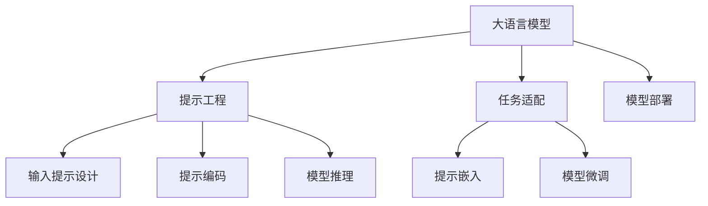

                 

# 大语言模型原理与工程实践：大语言模型为什么需要提示工程

大语言模型（Large Language Models, LLMs），如GPT-3、BERT等，通过大规模无标签数据的预训练，学到了丰富的语言知识和常识，能够在众多自然语言处理（Natural Language Processing, NLP）任务中表现出强大的能力。然而，这些模型在应用过程中仍然面临诸多挑战，其中，提示工程（Prompt Engineering）作为一种提升模型性能的有效方法，已成为大语言模型工程实践中的关键技术。

本文将系统性地介绍提示工程的核心概念、算法原理及操作步骤，并结合数学模型、代码实例和实际应用场景，帮助读者深入理解这一重要技术，并通过工具和资源推荐、未来展望等部分，为读者提供全面的技术指导。

## 1. 背景介绍

### 1.1 问题由来

大语言模型在自然语言处理领域的广泛应用，使得开发者开始关注如何更高效地使用这些模型。尽管大语言模型在许多任务上表现出色，但在实际应用中，却存在以下问题：

- **泛化能力不足**：大模型在特定领域或任务上的表现，往往不如微调过的小模型，特别是当任务样本量有限时。
- **参数量庞大**：大语言模型参数量庞大，计算资源消耗高，导致推理速度慢、内存占用大。
- **难以调试**：大语言模型内部逻辑复杂，难以解释其决策过程，导致调试困难。
- **缺乏灵活性**：大模型需要大批量标注数据进行微调，但实际应用中，标注数据获取成本高且难以保证质量。

为了解决这些问题，提示工程应运而生，通过精心设计输入提示（Prompt），引导模型按期望方式生成或分类，从而提升模型性能，降低计算资源消耗，提高模型的灵活性和可解释性。

## 2. 核心概念与联系

### 2.1 核心概念概述

提示工程是一种通过在输入数据中添加特定的提示信息，以指导模型输出或决策的技术。其核心思想是：将大语言模型视作一个"黑盒"，通过设计良好的提示，使模型能够更好地适应特定任务，提升性能。

### 2.2 核心概念原理和架构的 Mermaid 流程图(Mermaid 流程节点中不要有括号、逗号等特殊字符)



该流程图展示了提示工程的核心流程：
1. 首先，选择合适的预训练大语言模型作为基础模型（A）。
2. 针对具体任务设计输入提示（C）。
3. 对提示进行编码处理（D）。
4. 输入提示和模型一起进行推理（E）。
5. 任务适配层（F）用于将大语言模型适应具体任务。
6. 提示嵌入（G）和模型微调（H）是提升模型性能的关键步骤。
7. 最后将微调后的模型部署到实际应用场景（I）。

### 2.3 提示工程与微调的关系

提示工程与微调有着密切的关系。微调是针对特定任务对预训练模型进行优化，以提高模型在该任务上的性能。而提示工程则是一种更精细的微调手段，通过优化输入提示设计，进一步提升模型的表现。微调往往需要大量标注数据，而提示工程可以在较少标注数据的情况下，仍能有效提升模型性能。

## 3. 核心算法原理 & 具体操作步骤

### 3.1 算法原理概述

提示工程的核心在于设计有效的提示（Prompt），使得模型能够准确理解和执行特定的任务。提示可以包含任务目标、输入数据格式、预期的输出形式等信息，从而指导模型生成或分类。

假设有一个通用的语言模型 $M$，输入为文本 $x$，输出为序列 $y$，任务目标为 $t$。提示工程的目标是通过输入提示 $p$，使得模型在给定输入 $x$ 和提示 $p$ 的情况下，输出序列 $y$ 满足 $t$。

形式化地，提示工程的优化目标可以表示为：
$$
\arg\min_{x, p} \| y - M(x, p) \|_t
$$
其中 $\| \cdot \|_t$ 表示在任务 $t$ 上的距离度量，例如分类任务上的交叉熵。

### 3.2 算法步骤详解

提示工程的具体步骤可以分为以下几个阶段：

**Step 1: 定义任务目标和提示格式**

根据具体任务，定义任务目标和提示格式。例如，对于文本分类任务，提示可以包含类别标签，如 "是/否"、"正面/负面" 等。

**Step 2: 设计提示模板**

设计合适的提示模板。提示模板应包含任务相关的信息，同时要尽可能简洁，避免过长和复杂的输入格式。

**Step 3: 编码提示**

将提示模板编码成模型能够处理的格式，如向量化、分词等。对于不同的语言模型，编码方式可能有所不同。

**Step 4: 训练模型**

使用带有提示的训练数据集对模型进行微调。微调过程可以与普通的微调步骤相同，通过梯度下降等优化算法更新模型参数。

**Step 5: 验证和优化**

在验证集上评估提示效果，通过调整提示模板和超参数，进一步优化模型性能。

**Step 6: 部署和应用**

将优化后的提示模型部署到实际应用中，对新的输入数据进行推理或分类。

### 3.3 算法优缺点

提示工程具有以下优点：
1. 灵活高效。可以通过简洁的提示模板，在较少标注数据的情况下，提升模型性能。
2. 降低计算资源消耗。只需要更新模型的一小部分参数，就可以实现性能提升。
3. 增强可解释性。通过提示模板的设计，可以更清晰地理解模型的决策过程。

但同时，提示工程也存在以下缺点：
1. 设计复杂。提示模板的设计需要经验和创意，且不同任务和模型需要设计不同的提示模板。
2. 难以自动化。目前提示设计仍依赖人工，自动化提示生成仍然是一个研究热点。
3. 依赖标注数据。提示设计仍需要大量标注数据进行训练和验证。

## 4. 数学模型和公式 & 详细讲解 & 举例说明（备注：数学公式请使用latex格式，latex嵌入文中独立段落使用 $$，段落内使用 $)
### 4.1 数学模型构建

提示工程中的数学模型通常涉及输入提示、模型输出和任务目标三者之间的关系。以文本分类任务为例，假设输入为文本 $x$，提示为 $p$，输出为类别 $y$，任务目标为 $t$。

提示工程的目标是使得模型在给定输入 $x$ 和提示 $p$ 的情况下，输出 $y$ 与 $t$ 的距离最小化。可以构建以下损失函数：
$$
\mathcal{L} = \sum_{i=1}^n \ell(y_i, M(x_i, p))
$$
其中 $y_i$ 为真实类别标签，$M(x_i, p)$ 为模型在输入 $x_i$ 和提示 $p$ 下的输出。$\ell$ 为任务特定的损失函数，如交叉熵。

### 4.2 公式推导过程

对于二分类任务，假设模型的输出为 $y$ 的概率分布 $P(y|x, p)$，损失函数可以进一步简化为：
$$
\mathcal{L} = -\sum_{i=1}^n \log P(y_i|x_i, p)
$$
目标是最小化该损失函数，使得模型输出的概率分布 $P(y|x, p)$ 与真实标签 $y_i$ 的概率分布尽可能接近。

### 4.3 案例分析与讲解

以情感分析任务为例，我们可以设计如下提示模板：
- 对于正面情感，提示为 "这是正面情感的评论"。
- 对于负面情感，提示为 "这是负面情感的评论"。

假设模型输出的概率分布为 $P(y|x, p)$，任务目标为正向情感，损失函数可以表示为：
$$
\mathcal{L} = -\log P(y|x, p)
$$
在训练过程中，我们需要最大化 $\log P(y|x, p)$，即增加正向情感的输出概率，同时减少负向情感的输出概率。

## 5. 项目实践：代码实例和详细解释说明
### 5.1 开发环境搭建

提示工程的开发环境搭建与大模型微调类似，主要需要安装深度学习框架和相关的NLP库。以下是一个使用PyTorch框架搭建提示工程环境的示例：

```bash
# 安装PyTorch和相关NLP库
pip install torch torchtext transformers
```

### 5.2 源代码详细实现

以下是一个简单的提示工程示例代码，以情感分析任务为例：

```python
import torch
import torch.nn as nn
import torch.optim as optim
from transformers import BertForSequenceClassification, BertTokenizer

class PromptEngine:
    def __init__(self, model_name='bert-base-uncased', task='classification', num_labels=2):
        self.model = BertForSequenceClassification.from_pretrained(model_name, num_labels=num_labels)
        self.tokenizer = BertTokenizer.from_pretrained(model_name)
        self.task = task
        
    def encode_prompt(self, prompt):
        tokens = self.tokenizer.encode(prompt, add_special_tokens=True)
        return tokens
    
    def train(self, train_dataset, epochs=3, batch_size=16):
        device = torch.device('cuda' if torch.cuda.is_available() else 'cpu')
        self.model.to(device)
        
        optimizer = optim.AdamW(self.model.parameters(), lr=2e-5)
        criterion = nn.CrossEntropyLoss()
        
        for epoch in range(epochs):
            self.model.train()
            running_loss = 0.0
            for batch in train_dataset:
                inputs = self.tokenizer(batch, return_tensors='pt').to(device)
                outputs = self.model(inputs['input_ids'], attention_mask=inputs['attention_mask'])
                labels = inputs['labels'].to(device)
                optimizer.zero_grad()
                loss = criterion(outputs.logits, labels)
                loss.backward()
                optimizer.step()
                running_loss += loss.item()
            print(f"Epoch {epoch+1}, loss: {running_loss/len(train_dataset)}")
        
    def evaluate(self, dev_dataset):
        self.model.eval()
        correct = 0
        total = 0
        with torch.no_grad():
            for batch in dev_dataset:
                inputs = self.tokenizer(batch, return_tensors='pt').to(device)
                outputs = self.model(inputs['input_ids'], attention_mask=inputs['attention_mask'])
                _, preds = outputs.logits.max(1)
                total += len(batch)
                correct += preds.eq(inputs['labels']).to(torch.uint8).sum().item()
        print(f"Accuracy: {100 * correct / total:.2f}%")
        
    def inference(self, test_data):
        self.model.eval()
        with torch.no_grad():
            for batch in test_data:
                inputs = self.tokenizer(batch, return_tensors='pt').to(device)
                outputs = self.model(inputs['input_ids'], attention_mask=inputs['attention_mask'])
                _, preds = outputs.logits.max(1)
                return preds
```

### 5.3 代码解读与分析

提示工程的代码实现分为以下几个关键步骤：
1. **模型加载**：通过 `BertForSequenceClassification` 加载预训练的BERT模型。
2. **提示编码**：使用 `BertTokenizer` 对输入提示进行编码，将其转换为模型能够处理的格式。
3. **模型训练**：在训练集上，使用带有提示的输入数据对模型进行微调，最小化损失函数。
4. **模型评估**：在验证集上评估模型性能，计算准确率。
5. **模型推理**：对测试集数据进行推理，返回预测结果。

## 6. 实际应用场景

### 6.1 智能客服系统

在智能客服系统中，提示工程可以显著提升系统对用户问题的理解和响应能力。通过设计合理的提示模板，使得模型能够自动理解用户意图，匹配最合适的答案模板进行回复。例如，可以使用提示模板 "我需要查询账户余额，请执行账户余额查询操作"，引导模型生成正确的回复。

### 6.2 金融舆情监测

金融舆情监测系统需要实时监测市场舆论动向。通过提示工程，可以为模型设计特定的提示模板，如 "市场最近出现哪些负面新闻？"，使得模型能够自动识别出负面新闻，及时报警。

### 6.3 个性化推荐系统

个性化推荐系统需要根据用户的历史行为和兴趣，推荐符合其喜好的物品。通过提示工程，可以设计出用户行为描述模板，如 "用户最近浏览了哪些商品？"，引导模型根据用户行为推荐相关商品。

### 6.4 未来应用展望

未来，提示工程在大语言模型中的应用将更加广泛，涵盖更多领域和任务。随着提示模板设计的自动化研究进展，提示工程将更加高效和自动化，进一步提升模型的性能和灵活性。

## 7. 工具和资源推荐

### 7.1 学习资源推荐

1. **《Prompt Engineering in NLP》**：一本详细介绍提示工程技术和应用的书，涵盖提示设计、实验验证、自动化等方面。
2. **Coursera上的《NLP with Attention》课程**：由深度学习领域的专家主讲，介绍了提示工程在NLP中的应用。
3. **HuggingFace官方文档**：提供了丰富的提示模板示例和微调样例代码，是提示工程实践的重要资源。
4. **arXiv论文**：如《Prompt Engineering for Text Generation with GPT-3》、《Evaluating Prompts for Few-shot Learning》等，研究提示模板在模型推理中的效果。

### 7.2 开发工具推荐

1. **PyTorch**：强大的深度学习框架，支持复杂的神经网络模型。
2. **TensorFlow**：谷歌开发的深度学习框架，适用于大规模模型训练。
3. **HuggingFace Transformers**：提供了预训练语言模型的封装，便于微调和推理。
4. **Weights & Biases**：模型训练和实验跟踪工具，方便模型调试和优化。
5. **TensorBoard**：谷歌开源的可视化工具，用于监测模型训练状态。

### 7.3 相关论文推荐

1. **《Improving Language Models by Prompt Engineering》**：介绍了提示工程在大语言模型中的应用，提出多种提示模板设计方法。
2. **《Prompt Engineering for Few-shot Learning》**：研究了提示模板在零样本和少样本学习中的应用，展示了显著的效果提升。
3. **《Prompt Tuning and Transformer-XL for Zero-Shot Generation》**：通过优化提示模板，实现了更高效的语言生成。

## 8. 总结：未来发展趋势与挑战

### 8.1 未来发展趋势

未来，提示工程将在大语言模型中扮演更加重要的角色，其发展趋势主要包括以下几个方面：
1. **自动化提示设计**：提示模板的设计将逐步自动化，通过机器学习算法自动生成最优提示。
2. **多模态提示**：结合视觉、语音等多模态信息，设计多模态提示，提升模型的泛化能力。
3. **自适应提示**：根据用户反馈和模型输出，动态调整提示模板，进一步提升系统性能。
4. **可解释性提升**：通过增强提示模板的可解释性，帮助理解模型的决策过程。

### 8.2 面临的挑战

尽管提示工程在提升模型性能方面取得了显著效果，但仍面临一些挑战：
1. **提示设计复杂**：提示模板的设计需要丰富的经验和创意，难以自动化。
2. **资源消耗高**：提示工程需要大量标注数据进行训练和验证，资源消耗较大。
3. **模型泛化性不足**：提示模板设计依赖于特定任务和数据，模型的泛化能力有限。
4. **可解释性不足**：提示工程中的决策过程仍缺乏可解释性，难以调试和优化。

### 8.3 研究展望

未来，提示工程的研究将集中在以下几个方向：
1. **自动化提示设计**：开发更高效的提示模板生成算法，提升自动化水平。
2. **多模态融合**：研究如何更好地融合多模态信息，提升模型的泛化能力和鲁棒性。
3. **可解释性增强**：开发更具可解释性的提示模板设计方法，增强模型的透明度和可调试性。
4. **零样本和少样本学习**：研究如何在极少量标注数据的情况下，使用提示工程提升模型性能。

## 9. 附录：常见问题与解答

### 9.1 提示工程与微调的区别

提示工程和微调虽然都涉及模型训练，但二者有所区别：
- **微调**：在预训练模型基础上，通过有监督学习优化模型性能。微调需要大量标注数据，但可以提升模型在特定任务上的效果。
- **提示工程**：通过设计提示模板，引导模型生成或分类。提示工程在较少标注数据的情况下，仍能有效提升模型性能。

### 9.2 如何设计高效的提示模板

设计高效的提示模板需要注意以下几点：
1. **简洁明了**：提示模板应尽量简洁，避免过于复杂和冗长。
2. **明确任务**：提示模板应明确表达任务目标和输入格式。
3. **多样化**：设计多种提示模板，根据不同任务和数据选择最优的模板。
4. **反馈调整**：根据模型输出，动态调整提示模板，进一步优化模型性能。

### 9.3 提示工程的局限性

提示工程仍存在一些局限性，主要包括：
1. **设计复杂**：提示模板的设计需要经验和创意，难以自动化。
2. **数据依赖**：提示工程仍需要大量标注数据进行训练和验证，数据获取成本较高。
3. **泛化性不足**：提示模板设计依赖于特定任务和数据，模型的泛化能力有限。

### 9.4 未来研究方向

未来的研究可以从以下几个方向进行：
1. **自动化提示设计**：开发更高效的提示模板生成算法，提升自动化水平。
2. **多模态融合**：研究如何更好地融合多模态信息，提升模型的泛化能力和鲁棒性。
3. **可解释性增强**：开发更具可解释性的提示模板设计方法，增强模型的透明度和可调试性。

---

作者：禅与计算机程序设计艺术 / Zen and the Art of Computer Programming

