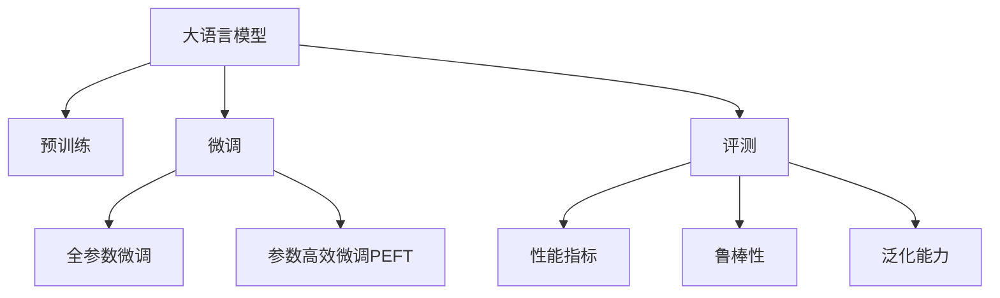

                 

# 大语言模型原理与工程实践：大语言模型的评测

> 关键词：大语言模型,评测,模型评估,性能指标,自然语言处理(NLP),Transformer,预训练,微调,Fine-tuning

## 1. 背景介绍

### 1.1 问题由来
近年来，随着深度学习技术的飞速发展，大语言模型（Large Language Models, LLMs）在自然语言处理（Natural Language Processing, NLP）领域取得了巨大的突破。这些大语言模型通过在大规模无标签文本数据上进行预训练，学习到了丰富的语言知识和常识，具备了强大的语言理解和生成能力。然而，如何全面、系统地评测大语言模型的性能，以便于选择和优化模型，成为学术界和产业界共同关注的焦点。

### 1.2 问题核心关键点
评测大语言模型性能的核心关键点包括：

- 选择合适的评测指标和数据集。常见的评测指标包括BLEU、ROUGE、F1-score、Perplexity等。常用的评测数据集包括GLUE、CoLA、SQuAD等。
- 设计合理的实验流程和评估方法。包括交叉验证、A/B测试、超参数搜索等。
- 应用先进的统计学和机器学习技术。如集成学习、偏差校正、稳健估计等。
- 考虑模型的泛化能力和鲁棒性。不仅要看模型在训练数据上的表现，还要评估其在未见过的数据上的泛化能力。

## 2. 核心概念与联系

### 2.1 核心概念概述

为更好地理解大语言模型的评测方法，本节将介绍几个密切相关的核心概念：

- 大语言模型（LLMs）：以自回归（如GPT）或自编码（如BERT）模型为代表的大规模预训练语言模型。通过在大规模无标签文本语料上进行预训练，学习到了通用的语言表示，具备强大的语言理解和生成能力。

- 预训练（Pre-training）：指在大规模无标签文本语料上，通过自监督学习任务训练通用语言模型的过程。常见的预训练任务包括言语建模、遮挡语言模型等。预训练使得模型学习到了语言的通用表示。

- 微调（Fine-tuning）：指在预训练模型的基础上，使用下游任务的少量标注数据，通过有监督地训练来优化模型在该任务上的性能。通常只需要调整顶层分类器或解码器，并以较小的学习率更新全部或部分模型参数。

- 模型评测（Model Evaluation）：评估模型在不同任务上的性能，包括准确率、召回率、F1-score、BLEU等指标。通过评测可以了解模型在不同任务上的表现，指导模型改进。

- 模型鲁棒性（Robustness）：指模型在面对噪声、对抗样本、领域偏移等情况下的稳定性。鲁棒性高的模型能够更好地应对实际应用中的复杂性。

- 模型泛化能力（Generalization）：指模型在新数据上的表现。泛化能力强的模型能够更准确地预测未见过的数据。

这些核心概念之间的逻辑关系可以通过以下Mermaid流程图来展示：



这个流程图展示了大语言模型的核心概念及其之间的关系：

1. 大语言模型通过预训练获得基础能力。
2. 微调是对预训练模型进行任务特定的优化，可以分为全参数微调和参数高效微调（PEFT）。
3. 评测用于全面评估模型的性能，包括模型精度、鲁棒性和泛化能力。
4. 鲁棒性和泛化能力是模型性能评估的重要组成部分。

这些概念共同构成了大语言模型的学习与应用框架，使其能够在各种场景下发挥强大的语言理解和生成能力。通过理解这些核心概念，我们可以更好地把握大语言模型的工作原理和评估方向。

## 3. 核心算法原理 & 具体操作步骤
### 3.1 算法原理概述

评测大语言模型性能，本质上是一个对模型在各种任务上的表现进行综合评估的过程。其核心思想是：通过设计合适的评测指标和数据集，对模型在不同任务上的表现进行量化和比较，以选择最合适的模型。

形式化地，假设模型为 $M_{\theta}$，其中 $\theta$ 为模型参数。在任务 $T$ 上，使用标准数据集 $D=\{(x_i,y_i)\}_{i=1}^N$，设计损失函数 $\ell(y_i,M_{\theta}(x_i))$，计算模型的评测指标 $\text{Metric}(D,M_{\theta})$。

常见评测指标包括：

- 精确率（Precision）：在所有预测为正例的样本中，实际为正例的样本比例。
- 召回率（Recall）：在所有实际为正例的样本中，预测为正例的样本比例。
- F1-score：精确率和召回率的调和平均数。
- BLEU：评估文本序列匹配度，通常用于评估机器翻译结果。
- 交叉熵（Cross-Entropy）：评估分类任务上的预测与真实标签之间的差异。
- 均方误差（MSE）：评估回归任务上的预测与真实值之间的差异。

模型评测的总体目标是找到最优模型，即满足所有评测指标的模型。

### 3.2 算法步骤详解

大语言模型评测的一般流程包括：

**Step 1: 准备数据集和评测指标**
- 选择合适的评测数据集，如GLUE、CoLA、SQuAD等，这些数据集通常包含多任务评测。
- 设计合适的评测指标，如BLEU、ROUGE、F1-score、Precision-Recall曲线等。

**Step 2: 训练和测试模型**
- 在训练集上训练模型，记录模型在测试集上的表现。
- 对于分类任务，记录混淆矩阵。
- 对于回归任务，记录预测值和真实值的误差。

**Step 3: 计算评测指标**
- 使用评测指标计算模型的性能。例如，使用BLEU评估机器翻译结果，使用F1-score评估命名实体识别任务。

**Step 4: 综合评估**
- 根据不同任务上的评测指标，对模型的整体性能进行综合评估。

**Step 5: 可视化结果**
- 使用图表展示模型的评测结果，如Precision-Recall曲线、ROC曲线等。

以上是评测大语言模型的一般流程。在实际应用中，还需要针对具体任务的特点，对评测过程的各个环节进行优化设计，如改进损失函数，引入更多的评测指标等，以进一步提升评测的准确性和可靠性。

### 3.3 算法优缺点

大语言模型评测方法具有以下优点：
1. 全面系统。覆盖了多任务、多指标的评测，全面评估模型性能。
2. 客观公正。通过标准数据集和指标，避免主观偏差。
3. 指导性强。提供模型改进方向，指导后续的模型优化。
4. 易于比较。方便比较不同模型之间的性能差异。

同时，该方法也存在一定的局限性：
1. 依赖数据集。评测效果很大程度上取决于评测数据集的质量和代表性。
2. 无法评估鲁棒性。常见的评测指标无法完全评估模型的鲁棒性。
3. 计算复杂度高。一些高级评测指标的计算复杂度较高，耗时较长。

尽管存在这些局限性，但就目前而言，基于标准数据集和指标的评测方法仍是评估大语言模型性能的主要手段。未来相关研究的重点在于如何进一步降低评测对数据集的依赖，提高模型鲁棒性的评测方法，同时兼顾计算效率和指标表达。

### 3.4 算法应用领域

大语言模型的评测方法在NLP领域已经得到了广泛的应用，涵盖了几乎所有常见的NLP任务，例如：

- 文本分类：如情感分析、主题分类、意图识别等。通过评测模型在分类任务上的精确率和召回率，评估模型性能。
- 命名实体识别：识别文本中的人名、地名、机构名等特定实体。通过评测模型在命名实体识别任务上的F1-score和BLEU，评估模型性能。
- 关系抽取：从文本中抽取实体之间的语义关系。通过评测模型在关系抽取任务上的精确率和召回率，评估模型性能。
- 问答系统：对自然语言问题给出答案。通过评测模型在问答系统任务上的BLEU和F1-score，评估模型性能。
- 机器翻译：将源语言文本翻译成目标语言。通过评测模型在机器翻译任务上的BLEU，评估模型性能。
- 文本摘要：将长文本压缩成简短摘要。通过评测模型在文本摘要任务上的BLEU和ROUGE，评估模型性能。
- 对话系统：使机器能够与人自然对话。通过评测模型在对话系统任务上的BLEU和F1-score，评估模型性能。

除了上述这些经典任务外，大语言模型的评测方法也被创新性地应用到更多场景中，如可控文本生成、常识推理、代码生成、数据增强等，为NLP技术带来了全新的突破。随着预训练模型和评测方法的不断进步，相信NLP技术将在更广阔的应用领域大放异彩。

## 4. 数学模型和公式 & 详细讲解  
### 4.1 数学模型构建

本节将使用数学语言对大语言模型的评测过程进行更加严格的刻画。

记模型为 $M_{\theta}$，其中 $\theta$ 为模型参数。假设评测任务 $T$ 的训练集为 $D=\{(x_i,y_i)\}_{i=1}^N, x_i \in \mathcal{X}, y_i \in \mathcal{Y}$。

定义模型 $M_{\theta}$ 在输入 $x$ 上的预测为 $\hat{y}=M_{\theta}(x) \in \mathcal{Y}$，与真实标签 $y$ 之间的距离（如交叉熵、均方误差等）记为 $\ell(y_i,M_{\theta}(x_i))$。则在数据集 $D$ 上的经验风险为：

$$
\mathcal{L}(\theta) = \frac{1}{N} \sum_{i=1}^N \ell(y_i,M_{\theta}(x_i))
$$

常见损失函数包括：

- 交叉熵损失：$\ell(y_i,M_{\theta}(x_i)) = -y_i\log M_{\theta}(x_i) - (1-y_i)\log (1-M_{\theta}(x_i))$
- 均方误差损失：$\ell(y_i,M_{\theta}(x_i)) = (y_i - M_{\theta}(x_i))^2$

根据评测指标的定义，模型的性能可以表示为：

- 精确率：$P = \frac{TP}{TP+FP}$
- 召回率：$R = \frac{TP}{TP+FN}$
- F1-score：$F = 2\frac{P \times R}{P+R}$
- BLEU：$BLEU = \prod_{i=1}^m \min(1, \frac{C_i}{L_i})$
- 其中，$TP$ 表示真正例，$FP$ 表示假正例，$FN$ 表示假负例，$C_i$ 表示模型生成的$i$个单词与参考序列中的$i$个单词的匹配数量，$L_i$ 表示参考序列中的$i$个单词数，$m$ 表示最大匹配长度。

### 4.2 公式推导过程

以下我们以二分类任务为例，推导交叉熵损失函数及其梯度的计算公式。

假设模型 $M_{\theta}$ 在输入 $x$ 上的输出为 $\hat{y}=M_{\theta}(x) \in [0,1]$，表示样本属于正类的概率。真实标签 $y \in \{0,1\}$。则二分类交叉熵损失函数定义为：

$$
\ell(M_{\theta}(x),y) = -[y\log \hat{y} + (1-y)\log (1-\hat{y})]
$$

将其代入经验风险公式，得：

$$
\mathcal{L}(\theta) = -\frac{1}{N}\sum_{i=1}^N [y_i\log M_{\theta}(x_i)+(1-y_i)\log(1-M_{\theta}(x_i))]
$$

根据链式法则，损失函数对参数 $\theta_k$ 的梯度为：

$$
\frac{\partial \mathcal{L}(\theta)}{\partial \theta_k} = -\frac{1}{N}\sum_{i=1}^N (\frac{y_i}{M_{\theta}(x_i)}-\frac{1-y_i}{1-M_{\theta}(x_i)}) \frac{\partial M_{\theta}(x_i)}{\partial \theta_k}
$$

其中 $\frac{\partial M_{\theta}(x_i)}{\partial \theta_k}$ 可进一步递归展开，利用自动微分技术完成计算。

在得到损失函数的梯度后，即可带入参数更新公式，完成模型的迭代优化。重复上述过程直至收敛，最终得到适应下游任务的最优模型参数 $\theta^*$。

## 5. 项目实践：代码实例和详细解释说明
### 5.1 开发环境搭建

在进行模型评测实践前，我们需要准备好开发环境。以下是使用Python进行PyTorch开发的环境配置流程：

1. 安装Anaconda：从官网下载并安装Anaconda，用于创建独立的Python环境。

2. 创建并激活虚拟环境：
```bash
conda create -n pytorch-env python=3.8 
conda activate pytorch-env
```

3. 安装PyTorch：根据CUDA版本，从官网获取对应的安装命令。例如：
```bash
conda install pytorch torchvision torchaudio cudatoolkit=11.1 -c pytorch -c conda-forge
```

4. 安装Transformers库：
```bash
pip install transformers
```

5. 安装各类工具包：
```bash
pip install numpy pandas scikit-learn matplotlib tqdm jupyter notebook ipython
```

完成上述步骤后，即可在`pytorch-env`环境中开始模型评测实践。

### 5.2 源代码详细实现

这里我们以文本分类任务为例，给出使用Transformers库对BERT模型进行评测的PyTorch代码实现。

首先，定义文本分类任务的数据处理函数：

```python
from transformers import BertTokenizer
from torch.utils.data import Dataset
import torch

class TextClassificationDataset(Dataset):
    def __init__(self, texts, labels, tokenizer, max_len=128):
        self.texts = texts
        self.labels = labels
        self.tokenizer = tokenizer
        self.max_len = max_len
        
    def __len__(self):
        return len(self.texts)
    
    def __getitem__(self, item):
        text = self.texts[item]
        label = self.labels[item]
        
        encoding = self.tokenizer(text, return_tensors='pt', max_length=self.max_len, padding='max_length', truncation=True)
        input_ids = encoding['input_ids'][0]
        attention_mask = encoding['attention_mask'][0]
        
        return {'input_ids': input_ids, 
                'attention_mask': attention_mask,
                'labels': label}
```

然后，定义模型和评测指标：

```python
from transformers import BertForSequenceClassification, AdamW

model = BertForSequenceClassification.from_pretrained('bert-base-cased', num_labels=2)

optimizer = AdamW(model.parameters(), lr=2e-5)

loss_fn = torch.nn.CrossEntropyLoss()
metric = torch.nn.BCEWithLogitsLoss()
```

接着，定义训练和评估函数：

```python
from torch.utils.data import DataLoader
from tqdm import tqdm
from sklearn.metrics import classification_report

device = torch.device('cuda') if torch.cuda.is_available() else torch.device('cpu')
model.to(device)

def train_epoch(model, dataset, batch_size, optimizer, loss_fn, metric):
    dataloader = DataLoader(dataset, batch_size=batch_size, shuffle=True)
    model.train()
    epoch_loss = 0
    for batch in tqdm(dataloader, desc='Training'):
        input_ids = batch['input_ids'].to(device)
        attention_mask = batch['attention_mask'].to(device)
        labels = batch['labels'].to(device)
        model.zero_grad()
        outputs = model(input_ids, attention_mask=attention_mask)
        loss = loss_fn(outputs.logits, labels)
        epoch_loss += loss.item()
        loss.backward()
        optimizer.step()
    return epoch_loss / len(dataloader)

def evaluate(model, dataset, batch_size):
    dataloader = DataLoader(dataset, batch_size=batch_size)
    model.eval()
    preds, labels = [], []
    with torch.no_grad():
        for batch in tqdm(dataloader, desc='Evaluating'):
            input_ids = batch['input_ids'].to(device)
            attention_mask = batch['attention_mask'].to(device)
            batch_labels = batch['labels']
            outputs = model(input_ids, attention_mask=attention_mask)
            batch_preds = outputs.logits.argmax(dim=1).to('cpu').tolist()
            batch_labels = batch_labels.to('cpu').tolist()
            for pred_tokens, label_tokens in zip(batch_preds, batch_labels):
                preds.append(pred_tokens)
                labels.append(label_tokens)
                
    print(classification_report(labels, preds))
```

最后，启动训练和评估流程：

```python
epochs = 5
batch_size = 16

for epoch in range(epochs):
    loss = train_epoch(model, train_dataset, batch_size, optimizer, loss_fn, metric)
    print(f"Epoch {epoch+1}, train loss: {loss:.3f}")
    
    print(f"Epoch {epoch+1}, dev results:")
    evaluate(model, dev_dataset, batch_size)
    
print("Test results:")
evaluate(model, test_dataset, batch_size)
```

以上就是使用PyTorch对BERT进行文本分类任务评测的完整代码实现。可以看到，得益于Transformers库的强大封装，我们可以用相对简洁的代码完成BERT模型的加载和评测。

### 5.3 代码解读与分析

让我们再详细解读一下关键代码的实现细节：

**TextClassificationDataset类**：
- `__init__`方法：初始化文本、标签、分词器等关键组件。
- `__len__`方法：返回数据集的样本数量。
- `__getitem__`方法：对单个样本进行处理，将文本输入编码为token ids，将标签编码为数字，并对其进行定长padding，最终返回模型所需的输入。

**model, optimizer, loss_fn, metric定义**：
- `model`：加载预训练模型BERT。
- `optimizer`：定义AdamW优化器，用于更新模型参数。
- `loss_fn`：定义交叉熵损失函数，用于计算模型预测与真实标签之间的差异。
- `metric`：定义二分类交叉熵损失函数，用于评估模型在分类任务上的性能。

**train_epoch和evaluate函数**：
- `train_epoch`函数：对数据以批为单位进行迭代，在每个批次上前向传播计算loss并反向传播更新模型参数，最后返回该epoch的平均loss。
- `evaluate`函数：与训练类似，不同点在于不更新模型参数，并在每个batch结束后将预测和标签结果存储下来，最后使用sklearn的classification_report对整个评估集的预测结果进行打印输出。

**训练和评估流程**：
- 定义总的epoch数和batch size，开始循环迭代
- 每个epoch内，先在训练集上训练，输出平均loss
- 在验证集上评估，输出分类指标
- 所有epoch结束后，在测试集上评估，给出最终测试结果

可以看到，PyTorch配合Transformers库使得BERT评测的代码实现变得简洁高效。开发者可以将更多精力放在数据处理、模型改进等高层逻辑上，而不必过多关注底层的实现细节。

当然，工业级的系统实现还需考虑更多因素，如模型的保存和部署、超参数的自动搜索、更灵活的任务适配层等。但核心的评测范式基本与此类似。

## 6. 实际应用场景
### 6.1 智能客服系统

基于大语言模型的文本分类技术，可以广泛应用于智能客服系统的构建。传统客服往往需要配备大量人力，高峰期响应缓慢，且一致性和专业性难以保证。而使用文本分类技术进行客户意图识别，能够快速响应客户咨询，用自然流畅的语言解答各类常见问题。

在技术实现上，可以收集企业内部的历史客服对话记录，将问题和最佳答复构建成监督数据，在此基础上对预训练文本分类模型进行微调。微调后的文本分类模型能够自动理解用户意图，匹配最合适的答案模板进行回复。对于客户提出的新问题，还可以接入检索系统实时搜索相关内容，动态组织生成回答。如此构建的智能客服系统，能大幅提升客户咨询体验和问题解决效率。

### 6.2 金融舆情监测

金融机构需要实时监测市场舆论动向，以便及时应对负面信息传播，规避金融风险。传统的人工监测方式成本高、效率低，难以应对网络时代海量信息爆发的挑战。基于文本分类技术的金融舆情监测，为金融舆情监测提供了新的解决方案。

具体而言，可以收集金融领域相关的新闻、报道、评论等文本数据，并对其进行主题标注和情感标注。在此基础上对预训练文本分类模型进行微调，使其能够自动判断文本属于何种主题，情感倾向是正面、中性还是负面。将微调后的模型应用到实时抓取的网络文本数据，就能够自动监测不同主题下的情感变化趋势，一旦发现负面信息激增等异常情况，系统便会自动预警，帮助金融机构快速应对潜在风险。

### 6.3 个性化推荐系统

当前的推荐系统往往只依赖用户的历史行为数据进行物品推荐，无法深入理解用户的真实兴趣偏好。基于文本分类技术的个性化推荐系统，可以更好地挖掘用户行为背后的语义信息，从而提供更精准、多样的推荐内容。

在实践中，可以收集用户浏览、点击、评论、分享等行为数据，提取和用户交互的物品标题、描述、标签等文本内容。将文本内容作为模型输入，用户的后续行为（如是否点击、购买等）作为监督信号，在此基础上微调预训练文本分类模型。微调后的模型能够从文本内容中准确把握用户的兴趣点。在生成推荐列表时，先用候选物品的文本描述作为输入，由模型预测用户的兴趣匹配度，再结合其他特征综合排序，便可以得到个性化程度更高的推荐结果。

### 6.4 未来应用展望

随着文本分类技术的发展，未来将有更多场景可以使用文本分类技术进行建模和优化。以下列举几个潜在的未来应用场景：

1. 医疗问答系统：医疗领域存在大量专业性强的文本数据，如病历、论文等。通过文本分类技术，可以有效提取并识别疾病名称、症状描述等信息，为医疗问答系统提供支撑。

2. 智能文档管理：企业内部文档管理系统通常包含大量的非结构化文本数据。通过文本分类技术，可以对文档进行自动分类和归档，提高文档检索和管理的效率。

3. 法律文本分析：法律领域有大量的合同、判决书等文本数据。通过文本分类技术，可以自动识别法律文本中的重要信息，辅助法律工作者处理案件。

4. 社交媒体分析：社交媒体平台每天产生大量的文本数据。通过文本分类技术，可以对用户评论、帖子等进行情感分析，及时掌握用户情绪变化，进行舆情监测和风险预警。

5. 教育领域：教育领域有大量的学习资料、作业、答案等文本数据。通过文本分类技术，可以对文本进行自动分类和分析，辅助教师和学生进行教学和学习。

这些未来应用场景展示了文本分类技术在多个领域的可能性和潜力，相信随着技术的不断演进，文本分类技术将在更广阔的应用领域大放异彩。

## 7. 工具和资源推荐
### 7.1 学习资源推荐

为了帮助开发者系统掌握大语言模型的评测方法，这里推荐一些优质的学习资源：

1. 《Transformer从原理到实践》系列博文：由大模型技术专家撰写，深入浅出地介绍了Transformer原理、BERT模型、评测技术等前沿话题。

2. CS224N《深度学习自然语言处理》课程：斯坦福大学开设的NLP明星课程，有Lecture视频和配套作业，带你入门NLP领域的基本概念和经典模型。

3. 《Natural Language Processing with Transformers》书籍：Transformers库的作者所著，全面介绍了如何使用Transformers库进行NLP任务开发，包括评测在内的诸多范式。

4. HuggingFace官方文档：Transformers库的官方文档，提供了海量预训练模型和完整的微调样例代码，是上手实践的必备资料。

5. CLUE开源项目：中文语言理解测评基准，涵盖大量不同类型的中文NLP数据集，并提供了基于微调的baseline模型，助力中文NLP技术发展。

通过对这些资源的学习实践，相信你一定能够快速掌握大语言模型评测的精髓，并用于解决实际的NLP问题。
###  7.2 开发工具推荐

高效的开发离不开优秀的工具支持。以下是几款用于大语言模型评测开发的常用工具：

1. PyTorch：基于Python的开源深度学习框架，灵活动态的计算图，适合快速迭代研究。大部分预训练语言模型都有PyTorch版本的实现。

2. TensorFlow：由Google主导开发的开源深度学习框架，生产部署方便，适合大规模工程应用。同样有丰富的预训练语言模型资源。

3. Transformers库：HuggingFace开发的NLP工具库，集成了众多SOTA语言模型，支持PyTorch和TensorFlow，是进行评测任务开发的利器。

4. Weights & Biases：模型训练的实验跟踪工具，可以记录和可视化模型训练过程中的各项指标，方便对比和调优。与主流深度学习框架无缝集成。

5. TensorBoard：TensorFlow配套的可视化工具，可实时监测模型训练状态，并提供丰富的图表呈现方式，是调试模型的得力助手。

6. Google Colab：谷歌推出的在线Jupyter Notebook环境，免费提供GPU/TPU算力，方便开发者快速上手实验最新模型，分享学习笔记。

合理利用这些工具，可以显著提升大语言模型评测任务的开发效率，加快创新迭代的步伐。

### 7.3 相关论文推荐

大语言模型和评测技术的发展源于学界的持续研究。以下是几篇奠基性的相关论文，推荐阅读：

1. Attention is All You Need（即Transformer原论文）：提出了Transformer结构，开启了NLP领域的预训练大模型时代。

2. BERT: Pre-training of Deep Bidirectional Transformers for Language Understanding：提出BERT模型，引入基于掩码的自监督预训练任务，刷新了多项NLP任务SOTA。

3. Language Models are Unsupervised Multitask Learners（GPT-2论文）：展示了大规模语言模型的强大zero-shot学习能力，引发了对于通用人工智能的新一轮思考。

4. Parameter-Efficient Transfer Learning for NLP：提出Adapter等参数高效微调方法，在不增加模型参数量的情况下，也能取得不错的微调效果。

5. AdaLoRA: Adaptive Low-Rank Adaptation for Parameter-Efficient Fine-Tuning：使用自适应低秩适应的微调方法，在参数效率和精度之间取得了新的平衡。

这些论文代表了大语言模型评测技术的发展脉络。通过学习这些前沿成果，可以帮助研究者把握学科前进方向，激发更多的创新灵感。

## 8. 总结：未来发展趋势与挑战
### 8.1 总结

本文对大语言模型的评测方法进行了全面系统的介绍。首先阐述了大语言模型评测的重要性，明确了评测在模型选择、优化和应用中的关键作用。其次，从原理到实践，详细讲解了评测的数学模型和关键步骤，给出了评测任务开发的完整代码实例。同时，本文还广泛探讨了文本分类技术在智能客服、金融舆情、个性化推荐等多个行业领域的应用前景，展示了文本分类技术的巨大潜力。

通过本文的系统梳理，可以看到，文本分类技术在多领域、多任务中具备广泛的应用前景，且通过标准的评测方法，可以全面评估模型的性能，为模型改进提供指导。未来，伴随预训练语言模型和评测方法的不断进步，相信文本分类技术将在更广阔的应用领域大放异彩，深刻影响人类的生产生活方式。

### 8.2 未来发展趋势

展望未来，文本分类技术将呈现以下几个发展趋势：

1. 模型规模持续增大。随着算力成本的下降和数据规模的扩张，预训练语言模型的参数量还将持续增长。超大规模语言模型蕴含的丰富语言知识，有望支撑更加复杂多变的文本分类任务。

2. 评测方法日趋多样。除了传统的交叉熵、BLEU等评测指标，未来会涌现更多参数高效和计算高效的评测方法，如AdaLoRA、BASNet等，在保证评测精度的同时，提高评测效率。

3. 模型鲁棒性增强。随着数据分布的不断变化，文本分类模型需要具备更强的泛化能力和鲁棒性，以应对实际应用中的复杂性和不确定性。

4. 参数效率提高。参数高效文本分类方法如Adapter、LoRA等，在不增加模型参数量的情况下，仍可取得不错的分类效果。

5. 零样本和少样本学习成为热点。受启发于Prompt Learning的思路，未来的文本分类方法将更好地利用预训练知识，通过精巧设计的输入文本，在更少的标注样本上实现高效的文本分类。

6. 多模态融合成为趋势。文本分类不仅仅局限于文本数据，未来会进一步拓展到图像、视频、语音等多模态数据分类。多模态信息的融合，将显著提升文本分类模型的表现和应用范围。

以上趋势凸显了文本分类技术的广阔前景。这些方向的探索发展，必将进一步提升文本分类系统的性能和应用范围，为文本数据的高效处理和信息提取提供新的解决方案。相信随着技术的日益成熟，文本分类技术必将在更多的行业领域得到应用，为经济社会发展注入新的动力。

### 8.3 面临的挑战

尽管文本分类技术已经取得了瞩目成就，但在迈向更加智能化、普适化应用的过程中，它仍面临着诸多挑战：

1. 数据标注成本高。标注大规模数据集需要大量人力物力，成本较高，难以覆盖所有文本分类任务。如何降低标注成本，提高数据集的多样性和代表性，是未来研究的重点。

2. 模型泛化能力不足。当前模型在面对域外数据时，泛化性能往往大打折扣。如何提高模型的泛化能力，使其在实际应用中更加稳定可靠，是需要进一步解决的问题。

3. 计算资源消耗大。文本分类模型在处理大规模数据集时，计算资源消耗较大，需要在硬件和算法层面进行优化。如何高效地处理大规模文本数据，降低计算成本，是提高文本分类模型实用性的关键。

4. 模型解释性差。当前文本分类模型往往是"黑盒"系统，难以解释其内部工作机制和决策逻辑。如何赋予模型更强的可解释性，提升系统的透明度和可信度，将是大模型应用中的重要课题。

5. 安全性有待保障。预训练语言模型难免会学习到有偏见、有害的信息，通过文本分类传递到下游任务，产生误导性、歧视性的输出，给实际应用带来安全隐患。如何从数据和算法层面消除模型偏见，避免恶意用途，确保输出的安全性，也将是重要的研究课题。

6. 跨领域迁移能力不足。当前模型往往局限于特定领域，难以灵活吸收和运用更广泛的先验知识。如何让文本分类模型更好地与外部知识库、规则库等专家知识结合，形成更加全面、准确的信息整合能力，还有很大的想象空间。

正视文本分类面临的这些挑战，积极应对并寻求突破，将是大语言模型评测走向成熟的必由之路。相信随着学界和产业界的共同努力，这些挑战终将一一被克服，文本分类技术必将在构建人机协同的智能时代中扮演越来越重要的角色。

### 8.4 研究展望

面对文本分类所面临的种种挑战，未来的研究需要在以下几个方面寻求新的突破：

1. 探索无监督和半监督文本分类方法。摆脱对大规模标注数据的依赖，利用自监督学习、主动学习等无监督和半监督范式，最大限度利用非结构化数据，实现更加灵活高效的文本分类。

2. 研究参数高效和计算高效的评测范式。开发更加参数高效的文本分类方法，在固定大部分预训练参数的同时，只更新极少量的任务相关参数。同时优化评测模型的计算图，减少前向传播和反向传播的资源消耗，实现更加轻量级、实时性的部署。

3. 引入更多先验知识。将符号化的先验知识，如知识图谱、逻辑规则等，与神经网络模型进行巧妙融合，引导文本分类过程学习更准确、合理的文本表示。同时加强不同模态数据的整合，实现视觉、语音等多模态信息与文本信息的协同建模。

4. 结合因果分析和博弈论工具。将因果分析方法引入文本分类模型，识别出模型决策的关键特征，增强输出解释的因果性和逻辑性。借助博弈论工具刻画人机交互过程，主动探索并规避模型的脆弱点，提高系统稳定性。

5. 纳入伦理道德约束。在模型训练目标中引入伦理导向的评估指标，过滤和惩罚有偏见、有害的输出倾向。同时加强人工干预和审核，建立模型行为的监管机制，确保输出符合人类价值观和伦理道德。

这些研究方向的探索，必将引领文本分类技术迈向更高的台阶，为构建安全、可靠、可解释、可控的智能系统铺平道路。面向未来，文本分类技术还需要与其他人工智能技术进行更深入的融合，如知识表示、因果推理、强化学习等，多路径协同发力，共同推动自然语言理解和智能交互系统的进步。只有勇于创新、敢于突破，才能不断拓展文本分类的边界，让智能技术更好地造福人类社会。

## 9. 附录：常见问题与解答

**Q1：文本分类任务中，应该如何选择合适的模型和训练策略？**

A: 在选择文本分类模型和训练策略时，需要综合考虑以下几个因素：

1. 数据集大小和质量：数据集越大，模型越容易学习到丰富的语言知识。同时，标注数据的质量也影响模型的表现。高质量的标注数据能更好地指导模型学习。

2. 任务复杂度：文本分类任务分为简单、中等和复杂三类。简单任务（如情感分析）可以使用轻量级模型，如BERT-base。中等任务（如命名实体识别）需要较深的模型，如BERT-large。复杂任务（如法律文本分类）则需要更深的模型和更多的训练时间。

3. 训练时间和计算资源：深度模型需要更多的训练时间和计算资源。如果计算资源有限，可以考虑使用参数高效的模型，如 Adapter、LoRA 等。

4. 目标精度：根据任务需求，设定模型精度目标。通常在验证集上评估模型性能，调整训练策略。

**Q2：文本分类任务中，应该如何评估模型性能？**

A: 文本分类任务的评估通常使用以下指标：

1. 精确率（Precision）：在所有预测为正例的样本中，实际为正例的样本比例。

2. 召回率（Recall）：在所有实际为正例的样本中，预测为正例的样本比例。

3. F1-score：精确率和召回率的调和平均数。

4. 交叉熵（Cross-Entropy）：评估分类任务上的预测与真实标签之间的差异。

5. BLEU：评估文本序列匹配度，通常用于评估机器翻译结果。

6. ROUGE：评估文本相似度，通常用于评估文本抽取结果。

7. 混淆矩阵（Confusion Matrix）：用于可视化模型的预测结果，帮助分析模型在不同类别上的表现。

选择适合的评估指标，可以全面评估模型在不同任务上的性能，指导模型改进。

**Q3：文本分类任务中，应该如何进行模型优化？**

A: 模型优化通常包括以下几个步骤：

1. 数据增强：通过回译、近义替换等方式扩充训练集。

2. 超参数搜索：使用网格搜索、随机搜索、贝叶斯优化等方法，搜索最优超参数组合。

3. 模型裁剪：去除不必要的层和参数，减小模型尺寸，加快推理速度。

4. 量化加速：将浮点模型转为定点模型，压缩存储空间，提高计算效率。

5. 集成学习：使用多个模型进行集成，提高模型泛化能力和鲁棒性。

6. 模型压缩：使用稀疏化存储、剪枝等技术，减小模型尺寸，提高推理速度。

以上优化方法可以结合使用，根据具体情况进行调整。

**Q4：文本分类任务中，应该如何提高模型的鲁棒性？**

A: 提高模型鲁棒性可以从以下几个方面入手：

1. 数据多样性：使用多样化的数据集进行训练，包括不同类型的文本、不同的语域等。

2. 数据平衡：确保训练数据集中各类别的样本数量平衡，避免模型对某些类别过拟合。

3. 对抗训练：引入对抗样本，提高模型对噪声、对抗样本的鲁棒性。

4. 正则化：使用L2正则、Dropout等技术，防止模型过拟合。

5. 模型裁剪：去除不必要的层和参数，减小模型尺寸，提高模型的泛化能力。

6. 参数高效微调：只更新少量参数，固定大部分预训练权重不变，避免过拟合。

以上方法可以结合使用，根据具体情况进行调整。

**Q5：文本分类任务中，应该如何提升模型的泛化能力？**

A: 提升模型泛化能力可以从以下几个方面入手：

1. 数据多样性：使用多样化的数据集进行训练，包括不同类型的文本、不同的语域等。

2. 数据平衡：确保训练数据集中各类别的样本数量平衡，避免模型对某些类别过拟合。

3. 正则化：使用L2正则、Dropout等技术，防止模型过拟合。

4. 模型裁剪：去除不必要的层和参数，减小模型尺寸，提高模型的泛化能力。

5. 参数高效微调：只更新少量参数，固定大部分预训练权重不变，避免过拟合。

6. 集成学习：使用多个模型进行集成，提高模型泛化能力和鲁棒性。

7. 数据增强：通过回译、近义替换等方式扩充训练集。

以上方法可以结合使用，根据具体情况进行调整。

**Q6：文本分类任务中，应该如何解释模型的预测结果？**

A: 文本分类模型的预测结果通常通过混淆矩阵、ROC曲线、Precision-Recall曲线等进行可视化展示。同时，可以使用LIME、SHAP等工具对模型进行局部可解释性分析，帮助理解模型的决策过程。此外，在训练过程中，可以通过插入不同的输入文本，观察模型在相似输入上的表现，推断模型的决策逻辑。

**Q7：文本分类任务中，应该如何处理长文本数据？**

A: 处理长文本数据可以采用以下方法：

1. 分词：将长文本分割成多个短文本，单独进行分类。

2. 摘要：提取文本的关键信息，生成摘要，再进行分类。

3. 词向量化：使用词向量表示文本，减小文本长度，提高处理效率。

4. 卷积神经网络：使用卷积神经网络对长文本进行分类，减少文本长度，提高处理效率。

5. 自注意力机制：使用自注意力机制对长文本进行分类，减小文本长度，提高处理效率。

以上方法可以结合使用，根据具体情况进行调整。

---

作者：禅与计算机程序设计艺术 / Zen and the Art of Computer Programming

