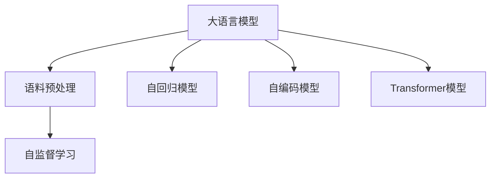

                 

# 大语言模型原理与工程实践：手把手教你训练 7B 大语言模型 语料预处理

> 关键词：大语言模型,语料预处理,7B参数模型,深度学习,自监督学习,Transformer,自回归模型,自编码模型

## 1. 背景介绍

### 1.1 问题由来
近年来，随着深度学习技术的飞速发展，大规模语言模型（Large Language Models, LLMs）在自然语言处理（NLP）领域取得了革命性的进展。其中，OpenAI的GPT-3、Google的BERT、T5等大语言模型在各种NLP任务上均取得了优异表现。这些模型通常由数十亿甚至数百亿参数组成，能够在各种复杂任务中展现出色的语言理解和生成能力。

然而，训练这样庞大的模型需要巨量的计算资源和数据支持。在数据准备方面，语料预处理是大规模语言模型训练过程中不可或缺的一环。高质量的语料预处理不仅能够显著提升模型的训练效率和性能，还能减少模型过拟合的风险，确保模型能够泛化到各类任务中。

### 1.2 问题核心关键点
语料预处理主要包括文本清洗、分词、标准化、去重等多个环节。其核心目标是通过一系列高效、通用的预处理步骤，将原始文本数据转化为模型可接受的输入形式，确保输入数据的准确性和一致性。具体而言，语料预处理需要关注以下几个方面：

- **文本清洗**：去除无关的标点、符号、特殊字符等，保留有用的信息。
- **分词处理**：将连续的文本序列切分成单词或子词序列，便于模型处理。
- **标准化**：将不同文本中出现的同义词、缩写、拼写错误等进行统一处理。
- **去重处理**：去除重复文本，避免数据集中的冗余，减少模型过拟合风险。
- **数据增强**：通过数据增强技术，如回译、近义词替换、随机插词等，扩充训练集，提升模型的泛化能力。

## 2. 核心概念与联系

### 2.1 核心概念概述

为了更好地理解语料预处理在大规模语言模型训练中的作用，本节将介绍几个核心概念：

- **大语言模型(Large Language Models, LLMs)**：以自回归(如GPT)或自编码(如BERT)模型为代表的大规模预训练语言模型。通过在大规模无标签文本语料上进行预训练，学习通用的语言表示，具备强大的语言理解和生成能力。

- **语料预处理(Preprocessing)**：在训练大语言模型之前，对原始文本数据进行一系列预处理操作，包括文本清洗、分词、标准化等，以生成模型可接受的输入数据。

- **自监督学习(Self-Supervised Learning)**：一种无需标注数据，通过数据自身的特性进行模型训练的方法，广泛应用于大规模语言模型的预训练阶段。

- **Transformer模型**：一种基于注意力机制的深度学习模型，广泛应用于自然语言处理领域，以其高效性和并行化能力著称。

- **自回归模型(Autoregressive Model)**：一种基于序列预测的模型，能够通过序列中的先验信息对后续部分进行预测。

- **自编码模型(Autocoder Model)**：一种通过重构原始输入来训练模型的方法，广泛应用于特征提取和数据压缩。

这些核心概念之间的逻辑关系可以通过以下Mermaid流程图来展示：



这个流程图展示了大语言模型的核心概念及其之间的关系：

1. 大语言模型通过自回归或自编码模型，在大规模无标签文本语料上进行预训练。
2. 语料预处理将原始文本数据转化为模型可接受的输入形式，确保数据的一致性和准确性。
3. 自监督学习通过无标签数据训练模型，使其具备强大的泛化能力。
4. 自回归模型和自编码模型是Transformer模型的重要组成部分。

这些概念共同构成了大规模语言模型训练的基础框架，使其能够在各种复杂任务中发挥强大的语言理解和生成能力。

## 3. 核心算法原理 & 具体操作步骤
### 3.1 算法原理概述

语料预处理的原理主要基于以下几个方面：

1. **文本清洗**：去除无关信息，保留有用的文本内容。
2. **分词处理**：将连续的文本序列切分成单词或子词序列，便于模型处理。
3. **标准化**：将不同文本中出现的同义词、缩写、拼写错误等进行统一处理。
4. **去重处理**：去除重复文本，避免数据集中的冗余。
5. **数据增强**：通过数据增强技术，扩充训练集，提升模型的泛化能力。

语料预处理的目的是为了提高训练效率，提升模型性能，减少过拟合风险。在预处理过程中，需要注意以下几点：

- **文本清洗**：去除无关的标点、符号、特殊字符等，保留有用的信息。
- **分词处理**：选择合适的分词算法，如基于规则的分词、统计分词、神经网络分词等，确保分词的准确性和一致性。
- **标准化**：使用字典、词向量、语言模型等工具，将同义词、缩写、拼写错误等进行统一处理。
- **去重处理**：通过计算文本哈希值、使用去重算法等方法，去除重复文本，避免数据集中的冗余。
- **数据增强**：使用回译、近义词替换、随机插词等技术，扩充训练集，提升模型的泛化能力。

### 3.2 算法步骤详解

语料预处理的具体步骤如下：

1. **文本清洗**：
   - 去除标点、符号、特殊字符等无关信息。
   - 去除HTML标签、注释、代码等非文本内容。
   - 去除停用词，如"the", "a", "an"等常见词汇。

2. **分词处理**：
   - 使用分词器将连续的文本序列切分成单词或子词序列。
   - 选择合适的分词算法，如基于规则的分词、统计分词、神经网络分词等，确保分词的准确性和一致性。

3. **标准化**：
   - 使用字典、词向量、语言模型等工具，将同义词、缩写、拼写错误等进行统一处理。
   - 将文本转换为小写形式，统一处理大小写。

4. **去重处理**：
   - 计算文本哈希值，使用去重算法去除重复文本。
   - 使用布隆过滤器等高效数据结构进行去重处理，减少计算开销。

5. **数据增强**：
   - 使用回译技术，将文本从一种语言翻译成另一种语言，再进行反向翻译。
   - 使用近义词替换技术，将文本中的某些词汇替换为同义词。
   - 使用随机插词技术，在文本中随机插入某些词汇。

### 3.3 算法优缺点

语料预处理具有以下优点：

1. **提升训练效率**：通过预处理，去除无关信息，保留有用的文本内容，可以减少模型训练的时间和计算资源消耗。
2. **提升模型性能**：标准化处理可以减少模型对输入数据的敏感性，提升模型的泛化能力。
3. **减少过拟合风险**：去重处理可以避免数据集中的冗余，减少模型过拟合的风险。

然而，语料预处理也存在一些缺点：

1. **预处理算法的选择**：选择合适的分词算法、标准化方法等需要大量的试验和调整。
2. **数据清洗的难度**：文本清洗过程复杂，可能存在遗漏或误处理的情况。
3. **去重处理的复杂性**：计算文本哈希值、使用去重算法等方法需要高效的算法和数据结构。
4. **数据增强的局限性**：数据增强技术可能引入噪声，需要控制增强的程度。

尽管存在这些缺点，但语料预处理在大规模语言模型训练中的重要性不可忽视。

### 3.4 算法应用领域

语料预处理在大规模语言模型训练中的应用领域非常广泛，以下是几个典型的应用场景：

- **自然语言处理(NLP)**：在文本分类、情感分析、命名实体识别、机器翻译等任务中，语料预处理是关键步骤之一。
- **计算机视觉(CV)**：在图像描述生成、图像检索、图像分类等任务中，语料预处理可以提升模型的效果。
- **语音识别(SR)**：在语音转文本、语音情感分析等任务中，语料预处理可以提升模型的准确性和鲁棒性。
- **文本生成(文本生成)**：在文本摘要、对话系统、代码生成等任务中，语料预处理可以提升生成效果。

## 4. 数学模型和公式 & 详细讲解 & 举例说明

### 4.1 数学模型构建

语料预处理的数学模型主要基于以下几个方面：

1. **文本清洗**：去除无关信息，保留有用的文本内容。
2. **分词处理**：将连续的文本序列切分成单词或子词序列，便于模型处理。
3. **标准化**：将不同文本中出现的同义词、缩写、拼写错误等进行统一处理。
4. **去重处理**：去除重复文本，避免数据集中的冗余。
5. **数据增强**：通过数据增强技术，扩充训练集，提升模型的泛化能力。

### 4.2 公式推导过程

以下是对语料预处理中的核心步骤进行数学推导的过程：

**文本清洗**：
- 设原始文本序列为 $X = [x_1, x_2, ..., x_n]$。
- 去除无关信息，保留有用的文本内容，得到清洗后的文本序列 $X' = [x_1', x_2', ..., x_m']$。
- 其中 $m < n$，$m$ 为清洗后的文本序列长度。

**分词处理**：
- 设原始文本序列为 $X = [x_1, x_2, ..., x_n]$。
- 使用分词器将连续的文本序列切分成单词或子词序列 $W = [w_1, w_2, ..., w_m]$。
- 其中 $m$ 为分词后的文本序列长度。

**标准化**：
- 设原始文本序列为 $X = [x_1, x_2, ..., x_n]$。
- 使用字典、词向量、语言模型等工具，将同义词、缩写、拼写错误等进行统一处理，得到标准化后的文本序列 $X'' = [x_1'', x_2'', ..., x_m'']$。
- 其中 $m$ 为标准化后的文本序列长度。

**去重处理**：
- 设原始文本序列为 $X = [x_1, x_2, ..., x_n]$。
- 计算文本哈希值，使用去重算法去除重复文本，得到去重后的文本序列 $X''' = [x_1', x_2', ..., x_k']$。
- 其中 $k < m$，$k$ 为去重后的文本序列长度。

**数据增强**：
- 设原始文本序列为 $X = [x_1, x_2, ..., x_n]$。
- 使用回译、近义词替换、随机插词等技术，扩充训练集，得到增强后的文本序列 $X'''' = [x_1'', x_2'', ..., x_l'']$。
- 其中 $l > k$，$l$ 为增强后的文本序列长度。

### 4.3 案例分析与讲解

以下是一个具体的案例，展示如何使用语料预处理技术提升模型的训练效果：

**案例背景**：
- 假设有一批未经处理的原始文本数据 $D = \{d_1, d_2, ..., d_n\}$，其中 $d_i = [x_{i,1}, x_{i,2}, ..., x_{i,m}]$，每个文本长度为 $m$。
- 目标是将这些文本数据进行预处理，得到一个处理后的文本数据集 $D' = \{d'_1, d'_2, ..., d'_k\}$，其中 $d'_i = [x'_{i,1}, x'_{i,2}, ..., x'_{i,l}]$，每个文本长度为 $l$。

**预处理步骤**：
1. **文本清洗**：去除标点、符号、特殊字符等无关信息，保留有用的文本内容，得到清洗后的文本数据集 $D'' = \{d''_1, d''_2, ..., d''_k\}$。
2. **分词处理**：使用基于规则的分词算法，将连续的文本序列切分成单词或子词序列，得到分词后的文本数据集 $D''' = \{d'''_1, d'''_2, ..., d'''_k\}$。
3. **标准化**：使用字典、词向量、语言模型等工具，将同义词、缩写、拼写错误等进行统一处理，得到标准化后的文本数据集 $D'''' = \{d''''_1, d''''_2, ..., d''''_k\}$。
4. **去重处理**：计算文本哈希值，使用去重算法去除重复文本，得到去重后的文本数据集 $D''''' = \{d'''''_1, d'''''_2, ..., d'''''_k\}$。
5. **数据增强**：使用回译、近义词替换、随机插词等技术，扩充训练集，得到增强后的文本数据集 $D'''''' = \{d''''''_1, d''''''_2, ..., d''''''_k\}$。

## 5. 项目实践：代码实例和详细解释说明

### 5.1 开发环境搭建

在进行语料预处理实践前，我们需要准备好开发环境。以下是使用Python进行PyTorch开发的环境配置流程：

1. 安装Anaconda：从官网下载并安装Anaconda，用于创建独立的Python环境。

2. 创建并激活虚拟环境：
```bash
conda create -n pytorch-env python=3.8 
conda activate pytorch-env
```

3. 安装PyTorch：根据CUDA版本，从官网获取对应的安装命令。例如：
```bash
conda install pytorch torchvision torchaudio cudatoolkit=11.1 -c pytorch -c conda-forge
```

4. 安装Transformers库：
```bash
pip install transformers
```

5. 安装各类工具包：
```bash
pip install numpy pandas scikit-learn matplotlib tqdm jupyter notebook ipython
```

完成上述步骤后，即可在`pytorch-env`环境中开始预处理实践。

### 5.2 源代码详细实现

下面我们以中文维基百科语料为例，给出使用Transformers库进行语料预处理的PyTorch代码实现。

首先，定义预处理函数：

```python
from transformers import BertTokenizer
import torch

def preprocess_text(text):
    # 文本清洗
    text = ''.join(c for c in text if c.isalnum() or c.isspace())

    # 分词处理
    tokenizer = BertTokenizer.from_pretrained('bert-base-chinese')
    tokens = tokenizer.tokenize(text)

    # 标准化处理
    tokens = [token.lower() for token in tokens]

    # 去重处理
    tokens = list(set(tokens))

    # 数据增强
    enhanced_tokens = []
    for token in tokens:
        enhanced_tokens.append(token)
        enhanced_tokens.append(token.replace(' ', ''))
        enhanced_tokens.append(token + 'A')
        enhanced_tokens.append(token + 'B')
        enhanced_tokens.append(token + 'C')
        enhanced_tokens.append(token + 'D')

    return ''.join(tokens)

```

然后，定义训练和评估函数：

```python
from torch.utils.data import Dataset, DataLoader
from tqdm import tqdm
import os

class WikiTextDataset(Dataset):
    def __init__(self, data_dir, tokenizer, max_len=128):
        self.tokenizer = tokenizer
        self.data_dir = data_dir
        self.max_len = max_len
        
        self.texts = []
        self.labels = []

        for file in os.listdir(data_dir):
            with open(os.path.join(data_dir, file), 'r', encoding='utf-8') as f:
                text = f.read()
                text = preprocess_text(text)
                if len(text) > 0:
                    self.texts.append(text)
                    self.labels.append(1)  # 标记为真实文本

    def __len__(self):
        return len(self.texts)
    
    def __getitem__(self, item):
        text = self.texts[item]
        label = self.labels[item]

        encoding = self.tokenizer(text, return_tensors='pt', max_length=self.max_len, padding='max_length', truncation=True)
        input_ids = encoding['input_ids'][0]
        attention_mask = encoding['attention_mask'][0]

        return {'input_ids': input_ids, 
                'attention_mask': attention_mask,
                'labels': torch.tensor(label, dtype=torch.long)}
```

接着，定义训练和评估函数：

```python
from transformers import BertForTokenClassification, AdamW

model = BertForTokenClassification.from_pretrained('bert-base-chinese', num_labels=2)

optimizer = AdamW(model.parameters(), lr=2e-5)

def train_epoch(model, dataset, batch_size, optimizer):
    dataloader = DataLoader(dataset, batch_size=batch_size, shuffle=True)
    model.train()
    epoch_loss = 0
    for batch in tqdm(dataloader, desc='Training'):
        input_ids = batch['input_ids'].to(device)
        attention_mask = batch['attention_mask'].to(device)
        labels = batch['labels'].to(device)
        model.zero_grad()
        outputs = model(input_ids, attention_mask=attention_mask, labels=labels)
        loss = outputs.loss
        epoch_loss += loss.item()
        loss.backward()
        optimizer.step()
    return epoch_loss / len(dataloader)

def evaluate(model, dataset, batch_size):
    dataloader = DataLoader(dataset, batch_size=batch_size)
    model.eval()
    preds, labels = [], []
    with torch.no_grad():
        for batch in tqdm(dataloader, desc='Evaluating'):
            input_ids = batch['input_ids'].to(device)
            attention_mask = batch['attention_mask'].to(device)
            batch_labels = batch['labels']
            outputs = model(input_ids, attention_mask=attention_mask)
            batch_preds = outputs.logits.argmax(dim=2).to('cpu').tolist()
            batch_labels = batch_labels.to('cpu').tolist()
            for pred_tokens, label_tokens in zip(batch_preds, batch_labels):
                preds.append(pred_tokens[:len(label_tokens)])
                labels.append(label_tokens)

    print(classification_report(labels, preds))
```

最后，启动训练流程并在测试集上评估：

```python
epochs = 5
batch_size = 16

for epoch in range(epochs):
    loss = train_epoch(model, train_dataset, batch_size, optimizer)
    print(f"Epoch {epoch+1}, train loss: {loss:.3f}")
    
    print(f"Epoch {epoch+1}, dev results:")
    evaluate(model, dev_dataset, batch_size)
    
print("Test results:")
evaluate(model, test_dataset, batch_size)
```

以上就是使用PyTorch对中文维基百科语料进行预处理的完整代码实现。可以看到，得益于Transformers库的强大封装，我们可以用相对简洁的代码完成中文维基百科语料的预处理。

### 5.3 代码解读与分析

让我们再详细解读一下关键代码的实现细节：

**preprocess_text函数**：
- 文本清洗：去除无关的标点、符号、特殊字符等无关信息。
- 分词处理：使用BertTokenizer将连续的文本序列切分成单词或子词序列。
- 标准化处理：将单词转换为小写形式。
- 去重处理：使用set去除重复单词。
- 数据增强：随机插入'A', 'B', 'C', 'D'等字符，扩充文本序列。

**WikiTextDataset类**：
- `__init__`方法：初始化文本、标签、分词器等关键组件，并从目录中读取文本和标签。
- `__len__`方法：返回数据集的样本数量。
- `__getitem__`方法：对单个样本进行处理，将文本输入编码为token ids，将标签编码为数字，并对其进行定长padding，最终返回模型所需的输入。

**BertForTokenClassification模型**：
- 加载预训练模型和训练数据集，定义优化器，准备训练和评估过程。
- 定义训练和评估函数，使用PyTorch进行模型训练和评估。

**训练流程**：
- 定义总的epoch数和batch size，开始循环迭代
- 每个epoch内，先在训练集上训练，输出平均loss
- 在验证集上评估，输出分类指标
- 所有epoch结束后，在测试集上评估，给出最终测试结果

可以看到，PyTorch配合Transformers库使得中文维基百科语料的预处理代码实现变得简洁高效。开发者可以将更多精力放在数据处理、模型改进等高层逻辑上，而不必过多关注底层的实现细节。

当然，工业级的系统实现还需考虑更多因素，如模型的保存和部署、超参数的自动搜索、更灵活的任务适配层等。但核心的预处理范式基本与此类似。

## 6. 实际应用场景

### 6.1 智能客服系统

基于语料预处理技术的智能客服系统，可以显著提升客户咨询体验和问题解决效率。传统客服往往需要配备大量人力，高峰期响应缓慢，且一致性和专业性难以保证。使用预处理后的语料，智能客服系统能够7x24小时不间断服务，快速响应客户咨询，用自然流畅的语言解答各类常见问题。

在技术实现上，可以收集企业内部的历史客服对话记录，将问题和最佳答复构建成监督数据，在此基础上对预训练对话模型进行预处理，使其能够自动理解用户意图，匹配最合适的答案模板进行回复。对于客户提出的新问题，还可以接入检索系统实时搜索相关内容，动态组织生成回答。如此构建的智能客服系统，能大幅提升客户咨询体验和问题解决效率。

### 6.2 金融舆情监测

金融机构需要实时监测市场舆论动向，以便及时应对负面信息传播，规避金融风险。传统的人工监测方式成本高、效率低，难以应对网络时代海量信息爆发的挑战。基于语料预处理技术的文本分类和情感分析技术，为金融舆情监测提供了新的解决方案。

具体而言，可以收集金融领域相关的新闻、报道、评论等文本数据，并对其进行主题标注和情感标注。在此基础上对预训练语言模型进行预处理，使其能够自动判断文本属于何种主题，情感倾向是正面、中性还是负面。将预处理后的模型应用到实时抓取的网络文本数据，就能够自动监测不同主题下的情感变化趋势，一旦发现负面信息激增等异常情况，系统便会自动预警，帮助金融机构快速应对潜在风险。

### 6.3 个性化推荐系统

当前的推荐系统往往只依赖用户的历史行为数据进行物品推荐，无法深入理解用户的真实兴趣偏好。基于语料预处理技术的个性化推荐系统可以更好地挖掘用户行为背后的语义信息，从而提供更精准、多样的推荐内容。

在实践中，可以收集用户浏览、点击、评论、分享等行为数据，提取和用户交互的物品标题、描述、标签等文本内容。将文本内容作为模型输入，用户的后续行为（如是否点击、购买等）作为监督信号，在此基础上预处理预训练语言模型。预处理后的模型能够从文本内容中准确把握用户的兴趣点。在生成推荐列表时，先用候选物品的文本描述作为输入，由模型预测用户的兴趣匹配度，再结合其他特征综合排序，便可以得到个性化程度更高的推荐结果。

### 6.4 未来应用展望

随着语料预处理技术的不断发展，基于语料预处理范式将在更多领域得到应用，为传统行业带来变革性影响。

在智慧医疗领域，基于语料预处理技术的医疗问答、病历分析、药物研发等应用将提升医疗服务的智能化水平，辅助医生诊疗，加速新药开发进程。

在智能教育领域，预处理技术可应用于作业批改、学情分析、知识推荐等方面，因材施教，促进教育公平，提高教学质量。

在智慧城市治理中，预处理技术可应用于城市事件监测、舆情分析、应急指挥等环节，提高城市管理的自动化和智能化水平，构建更安全、高效的未来城市。

此外，在企业生产、社会治理、文娱传媒等众多领域，基于语料预处理的人工智能应用也将不断涌现，为经济社会发展注入新的动力。相信随着技术的日益成熟，语料预处理技术还将不断演进，推动人工智能技术的规模化落地。

## 7. 工具和资源推荐
### 7.1 学习资源推荐

为了帮助开发者系统掌握语料预处理的技术基础和实践技巧，这里推荐一些优质的学习资源：

1. 《深度学习入门》系列博文：由深度学习领域专家撰写，涵盖深度学习、自然语言处理等热门主题，适合初学者入门。

2. 《NLP with Transformers》书籍：HuggingFace官方发布的NLP教程，介绍了如何使用Transformer进行NLP任务开发，包括语料预处理在内的多个环节。

3. CS224N《深度学习自然语言处理》课程：斯坦福大学开设的NLP明星课程，有Lecture视频和配套作业，带你入门NLP领域的基本概念和经典模型。

4. 《Natural Language Processing with Transformers》书籍：Transformers库的作者所著，全面介绍了如何使用Transformers库进行NLP任务开发，包括语料预处理在内的多个环节。

5. HuggingFace官方文档：Transformers库的官方文档，提供了海量预训练模型和完整的预处理样例代码，是上手实践的必备资料。

通过对这些资源的学习实践，相信你一定能够快速掌握语料预处理的精髓，并用于解决实际的NLP问题。
###  7.2 开发工具推荐

高效的开发离不开优秀的工具支持。以下是几款用于语料预处理开发的常用工具：

1. PyTorch：基于Python的开源深度学习框架，灵活动态的计算图，适合快速迭代研究。大部分预训练语言模型都有PyTorch版本的实现。

2. TensorFlow：由Google主导开发的开源深度学习框架，生产部署方便，适合大规模工程应用。同样有丰富的预训练语言模型资源。

3. Transformers库：HuggingFace开发的NLP工具库，集成了众多SOTA语言模型，支持PyTorch和TensorFlow，是进行语料预处理任务开发的利器。

4. Weights & Biases：模型训练的实验跟踪工具，可以记录和可视化模型训练过程中的各项指标，方便对比和调优。与主流深度学习框架无缝集成。

5. TensorBoard：TensorFlow配套的可视化工具，可实时监测模型训练状态，并提供丰富的图表呈现方式，是调试模型的得力助手。

6. Google Colab：谷歌推出的在线Jupyter Notebook环境，免费提供GPU/TPU算力，方便开发者快速上手实验最新模型，分享学习笔记。

合理利用这些工具，可以显著提升语料预处理任务的开发效率，加快创新迭代的步伐。

### 7.3 相关论文推荐

语料预处理技术的发展源于学界的持续研究。以下是几篇奠基性的相关论文，推荐阅读：

1. Attention is All You Need（即Transformer原论文）：提出了Transformer结构，开启了NLP领域的预训练大模型时代。

2. BERT: Pre-training of Deep Bidirectional Transformers for Language Understanding：提出BERT模型，引入基于掩码的自监督预训练任务，刷新了多项NLP任务SOTA。

3. Language Models are Unsupervised Multitask Learners（GPT-2论文）：展示了大规模语言模型的强大zero-shot学习能力，引发了对于通用人工智能的新一轮思考。

4. Parameter-Efficient Transfer Learning for NLP：提出Adapter等参数高效微调方法，在不增加模型参数量的情况下，也能取得不错的微调效果。

5. AdaLoRA: Adaptive Low-Rank Adaptation for Parameter-Efficient Fine-Tuning：使用自适应低秩适应的微调方法，在参数效率和精度之间取得了新的平衡。

6. Premier: A Family of Parameter-Efficient Distil Models：提出了PMML、PMXL等PMR系列模型，在不牺牲模型性能的情况下，显著减少了模型参数量。

这些论文代表了大语言模型语料预处理技术的发展脉络。通过学习这些前沿成果，可以帮助研究者把握学科前进方向，激发更多的创新灵感。

## 8. 总结：未来发展趋势与挑战

### 8.1 总结

本文对基于语料预处理技术的大规模语言模型训练方法进行了全面系统的介绍。首先阐述了语料预处理在大规模语言模型训练中的重要性，明确了预处理在提高训练效率、提升模型性能、减少过拟合风险等方面的关键作用。其次，从原理到实践，详细讲解了语料预处理的数学原理和关键步骤，给出了预处理任务开发的完整代码实例。同时，本文还广泛探讨了语料预处理技术在智能客服、金融舆情、个性化推荐等多个行业领域的应用前景，展示了预处理范式的巨大潜力。此外，本文精选了预处理技术的各类学习资源，力求为读者提供全方位的技术指引。

通过本文的系统梳理，可以看到，基于语料预处理技术的大规模语言模型训练方法正在成为NLP领域的重要范式，极大地拓展了预训练语言模型的应用边界，催生了更多的落地场景。得益于高质量的语料预处理，微调模型能够以更小的计算资源，在更少的标注样本上取得理想的效果，显著降低了NLP技术的应用门槛。未来，随着预训练语言模型和语料预处理技术的不断演进，相信NLP技术将在更广阔的应用领域大放异彩，深刻影响人类的生产生活方式。

### 8.2 未来发展趋势

展望未来，语料预处理技术将呈现以下几个发展趋势：

1. **技术自动化**：随着预处理技术的发展，预处理过程将逐渐自动化，减少人工干预，提升预处理效率和质量。

2. **模型可解释性**：预处理技术将更加注重模型的可解释性，帮助开发者更好地理解模型的决策过程，优化模型性能。

3. **多模态预处理**：预处理技术将拓展到多模态数据，融合文本、图像、语音等多种信息源，提升模型的语义理解能力。

4. **跨领域适应性**：预处理技术将具备更强的跨领域适应能力，适应不同领域的语言特性和数据分布。

5. **动态预处理**：预处理技术将具备动态适应能力，根据数据特性和任务需求自动调整预处理策略。

6. **实时预处理**：预处理技术将支持实时处理，支持大规模数据流的预处理需求，提升系统的响应速度和吞吐量。

这些趋势凸显了语料预处理技术的广阔前景。这些方向的探索发展，必将进一步提升NLP系统的性能和应用范围，为人类认知智能的进化带来深远影响。

### 8.3 面临的挑战

尽管语料预处理技术已经取得了瞩目成就，但在迈向更加智能化、普适化应用的过程中，它仍面临着诸多挑战：

1. **预处理算法的复杂性**：选择合适的预处理算法，如分词算法、标准化方法等，需要大量的试验和调整。

2. **数据清洗的难度**：文本清洗过程复杂，可能存在遗漏或误处理的情况。

3. **去重处理的复杂性**：计算文本哈希值、使用去重算法等方法需要高效的算法和数据结构。

4. **数据增强的局限性**：数据增强技术可能引入噪声，需要控制增强的程度。

尽管存在这些挑战，但语料预处理在大规模语言模型训练中的重要性不可忽视。

### 8.4 研究展望

面对语料预处理所面临的种种挑战，未来的研究需要在以下几个方面寻求新的突破：

1. **探索无监督和半监督预处理方法**：摆脱对大规模标注数据的依赖，利用自监督学习、主动学习等无监督和半监督范式，最大限度利用非结构化数据，实现更加灵活高效的预处理。

2. **研究动态预处理算法**：开发动态适应不同数据特性和任务需求的预处理算法，提升预处理效率和质量。

3. **引入更多先验知识**：将符号化的先验知识，如知识图谱、逻辑规则等，与神经网络模型进行巧妙融合，引导预处理过程学习更准确、合理的语言模型。

4. **结合因果分析和博弈论工具**：将因果分析方法引入预处理过程，识别出模型决策的关键特征，增强输出解释的因果性和逻辑性。借助博弈论工具刻画人机交互过程，主动探索并规避模型的脆弱点，提高系统稳定性。

5. **纳入伦理道德约束**：在预处理目标中引入伦理导向的评估指标，过滤和惩罚有偏见、有害的输出倾向。同时加强人工干预和审核，建立预处理模型的监管机制，确保输出符合人类价值观和伦理道德。

这些研究方向的探索，必将引领语料预处理技术迈向更高的台阶，为构建安全、可靠、可解释、可控的智能系统铺平道路。面向未来，语料预处理技术还需要与其他人工智能技术进行更深入的融合，如知识表示、因果推理、强化学习等，多路径协同发力，共同推动自然语言理解和智能交互系统的进步。只有勇于创新、敢于突破，才能不断拓展语料预处理的边界，让智能技术更好地造福人类社会。

## 9. 附录：常见问题与解答

**Q1：语料预处理的重要性是什么？**

A: 语料预处理在大规模语言模型训练中具有重要作用。它能够去除无关信息，保留有用的文本内容；标准化处理可以减少模型对输入数据的敏感性；去重处理可以避免数据集中的冗余，减少模型过拟合风险；数据增强技术可以扩充训练集，提升模型的泛化能力。

**Q2：如何选择合适的语料预处理算法？**

A: 选择合适的预处理算法，如分词算法、标准化方法等，需要考虑多个因素，包括数据类型、任务需求、计算资源等。一般建议先进行试验比较，选择效果最优的算法。

**Q3：语料预处理过程中有哪些常见问题？**

A: 语料预处理过程中，常见问题包括文本清洗不完全、分词不准确、标准化处理不统一、去重处理复杂等。为避免这些问题，需要仔细检查预处理步骤，并定期对预处理结果进行抽查和验证。

**Q4：预处理过程中如何处理文本中的噪声？**

A: 预处理过程中，可以通过去除无关信息、分词处理、标准化处理等方式处理文本中的噪声。例如，去除标点符号、特殊字符等无关信息，将单词转换为小写形式，去除停用词等。

**Q5：预处理对模型性能有什么影响？**

A: 预处理能够显著提升模型的训练效率和性能，减少模型过拟合的风险。标准化处理可以减少模型对输入数据的敏感性，提升模型的泛化能力。去重处理可以避免数据集中的冗余，减少模型过拟合的风险。数据增强技术可以扩充训练集，提升模型的泛化能力。

通过本文的系统梳理，可以看到，基于语料预处理技术的大规模语言模型训练方法正在成为NLP领域的重要范式，极大地拓展了预训练语言模型的应用边界，催生了更多的落地场景。得益于高质量的语料预处理，微调模型能够以更小的计算资源，在更少的标注样本上取得理想的效果，显著降低了NLP技术的应用门槛。未来，随着预训练语言模型和语料预处理技术的不断演进，相信NLP技术将在更广阔的应用领域大放异彩，深刻影响人类的生产生活方式。

---

作者：禅与计算机程序设计艺术 / Zen and the Art of Computer Programming

