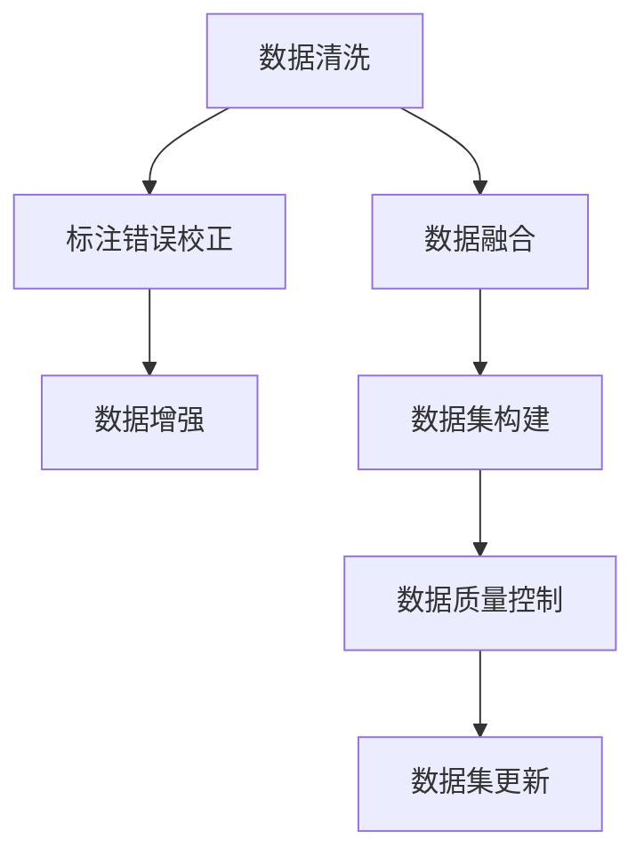
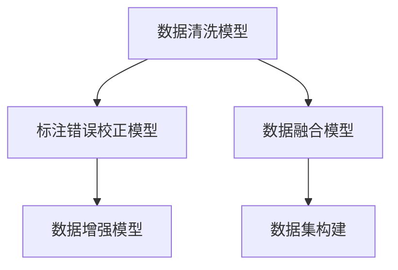

                 

# 大语言模型原理与工程实践：数据集净化

> 关键词：大语言模型,数据集净化,数据清洗,数据标注,数据增强,数据融合,数据集构建,数据质量控制,数据集建设

## 1. 背景介绍

### 1.1 问题由来
在人工智能特别是深度学习模型训练过程中，数据集的质量和数量直接决定了模型的性能和泛化能力。大语言模型的预训练和微调都需要大量的、高质量的标注数据，否则模型将无法获得良好的表现，甚至可能产生有害的偏见和误解。然而，标注数据的获取往往成本高昂，且数据质量难以保证。此外，由于数据来源多样、格式各异，数据集构建和维护工作也极为复杂。因此，数据集净化和清洗成为大语言模型工程实践中的关键环节。

### 1.2 问题核心关键点
数据集净化和清洗的核心关键点在于：
1. 识别并剔除低质量的数据样本，确保数据集的代表性和可靠性。
2. 纠正标注错误，提高数据标注的准确性。
3. 扩充数据集规模，提高模型泛化能力。
4. 融合多种数据源，形成更全面、多样化的数据集。
5. 动态更新数据集，跟踪领域知识的变化。

数据集净化的过程不仅涉及数据本身的处理，还包括对数据标注、数据收集和数据融合等环节的全面优化，是一个复杂而系统化的工程。

### 1.3 问题研究意义
数据集净化和清洗对大语言模型的性能和应用效果具有至关重要的影响。高质量的数据集能够显著提升模型的泛化能力，减少过拟合，降低有害偏见的风险，提高模型的公平性和可解释性。良好的数据集建设是实现大语言模型高性能、可靠性和可解释性的基础，对大语言模型的工程实践具有重要指导意义。

## 2. 核心概念与联系

### 2.1 核心概念概述

为更好地理解数据集净化的原理和过程，本节将介绍几个关键概念：

- 数据集净化(Data Cleaning)：指在模型训练前，通过一系列技术手段对原始数据进行预处理，确保数据质量和一致性的过程。常见的净化手段包括数据清洗、标注错误校正、数据增强等。
- 数据清洗(Data Cleaning)：指识别并删除或修正数据集中的噪声、错误和不一致的数据。这是数据集净化的核心步骤，对提高模型性能和泛化能力至关重要。
- 标注错误校正(Correction of Annotation Errors)：指对标注数据中的错误或不一致进行修正。标注错误往往源于人为疏忽或数据来源不规范，修正这些错误可以提高数据质量。
- 数据增强(Data Augmentation)：指通过对原始数据进行变换和扩充，生成新的、但语义相似的数据样本，以扩充数据集规模，增强模型泛化能力。
- 数据融合(Data Fusion)：指将来自不同数据源的数据进行整合，形成一个更全面、多样化的数据集，提升模型的学习能力和应用范围。

这些概念之间的逻辑关系可以通过以下Mermaid流程图来展示：



这个流程图展示了数据集净化的核心过程：

1. 从原始数据开始，先进行数据清洗和标注错误校正。
2. 接着进行数据增强，扩充数据集规模。
3. 将来自不同数据源的数据进行融合，形成更全面的数据集。
4. 构建最终的数据集，并进行质量控制。
5. 动态更新数据集，跟踪领域知识的变化。

这些步骤共同构成了数据集净化的完整流程，确保了数据集的质量和多样性。

## 3. 核心算法原理 & 具体操作步骤
### 3.1 算法原理概述

数据集净化和清洗的算法原理主要包括以下几个方面：

1. **数据清洗算法**：通过识别和剔除噪声、错误和不一致的数据，确保数据集的一致性和代表性。
2. **标注错误校正算法**：识别并修正数据标注中的错误，提升数据标注的准确性。
3. **数据增强算法**：通过变换和扩充原始数据，生成新的、语义相似的数据样本，增强数据集的多样性和泛化能力。
4. **数据融合算法**：将来自不同数据源的数据进行整合，形成一个更全面、多样化的数据集。

这些算法原理构成了数据集净化的核心技术框架，适用于不同类型的任务和数据。

### 3.2 算法步骤详解

数据集净化和清洗的实际操作过程可以分解为以下几个关键步骤：

**Step 1: 数据预处理**
- 对原始数据进行格式统一和清洗。例如，去除非法字符、空值和重复记录。
- 对缺失值进行处理，如插值、均值填补或删除含有缺失值的记录。

**Step 2: 数据清洗**
- 利用规则引擎或机器学习模型，识别数据中的异常值、噪声和错误。例如，通过规则匹配、统计分析等方法，识别和剔除明显不符合逻辑或语法结构的数据。
- 应用数据清洗工具，如OpenRefine、Trifacta等，进行自动化的数据清洗。

**Step 3: 标注错误校正**
- 使用机器学习模型或专家知识，识别和修正标注数据中的错误。例如，通过文本匹配、逻辑推理等方法，发现和修正标注错误。
- 结合领域专家，手动审核和修正标注数据。

**Step 4: 数据增强**
- 对原始数据进行变换和扩充，生成新的数据样本。例如，通过回译、同义词替换、数据增强技术等，生成新的训练样本。
- 应用数据增强工具，如Data Augmenter、Albumentations等，进行自动化的数据增强。

**Step 5: 数据融合**
- 将来自不同数据源的数据进行整合，形成统一的数据集。例如，将结构化和非结构化数据融合，不同语言数据融合等。
- 应用数据融合工具，如Hadoop、Spark等大数据处理平台，进行高效的数据融合。

**Step 6: 数据集构建**
- 将清洗、校正、增强和融合后的数据，构建最终的数据集。例如，构建标注数据集、无监督数据集等。
- 对数据集进行划分，分为训练集、验证集和测试集，用于模型训练和评估。

**Step 7: 数据质量控制**
- 对数据集进行质量控制，确保数据的一致性和代表性。例如，通过抽样和统计分析，检查数据分布和特征。
- 定期对数据集进行更新和维护，跟踪领域知识的变化。

**Step 8: 数据集更新**
- 对数据集进行动态更新，引入新的数据和领域知识。例如，定期收集和整理新的标注数据，更新数据集。
- 应用在线学习技术，实时更新和优化数据集。

### 3.3 算法优缺点

数据集净化和清洗算法具有以下优点：
1. 提高数据质量：通过清洗和标注错误校正，确保数据集的一致性和准确性。
2. 扩充数据集规模：通过数据增强，生成新的数据样本，提高数据集的多样性和泛化能力。
3. 增强泛化能力：通过数据融合，整合多种数据源，提升模型的学习能力和应用范围。

同时，该算法也存在一定的局限性：
1. 成本高昂：数据清洗和标注错误校正需要大量的时间和人力资源，成本较高。
2. 数据源多样：不同数据源的数据格式和质量各异，整合和融合过程复杂。
3. 数据噪声：原始数据可能存在噪声和错误，难以完全消除。
4. 模型依赖：数据集净化和清洗的效果很大程度上取决于模型的准确性和可靠性。

尽管存在这些局限性，但就目前而言，数据集净化和清洗是构建高质量数据集的重要步骤，对大语言模型的工程实践具有重要指导意义。未来相关研究的重点在于如何进一步降低数据清洗成本，提高数据融合效率，同时兼顾数据质量和模型可靠性等因素。

### 3.4 算法应用领域

数据集净化和清洗技术广泛应用于各种自然语言处理(NLP)任务中，例如：

- 文本分类：如情感分析、主题分类、意图识别等。通过清洗和标注错误校正，提升模型对不同主题和情感的识别能力。
- 命名实体识别：识别文本中的人名、地名、机构名等特定实体。通过清洗和标注错误校正，确保实体的边界和类型正确。
- 关系抽取：从文本中抽取实体之间的语义关系。通过数据增强，生成更多的关系抽取样本，提高模型性能。
- 问答系统：对自然语言问题给出答案。通过数据增强和融合，丰富训练样本，增强模型理解能力。
- 机器翻译：将源语言文本翻译成目标语言。通过数据增强和清洗，提升模型对不同语言对的翻译能力。
- 文本摘要：将长文本压缩成简短摘要。通过数据增强，生成更多的摘要样本，提升模型效果。
- 对话系统：使机器能够与人自然对话。通过数据增强和清洗，丰富对话数据，提升模型的生成质量。

除了上述这些经典任务外，数据集净化和清洗技术还被创新性地应用到更多场景中，如可控文本生成、常识推理、代码生成、数据增强等，为NLP技术带来了全新的突破。

## 4. 数学模型和公式 & 详细讲解  
### 4.1 数学模型构建

数据集净化和清洗的数学模型构建主要涉及以下几个方面：

- **数据清洗模型**：通过规则引擎或机器学习模型，识别并剔除噪声、错误和不一致的数据。常见的模型包括决策树、支持向量机、神经网络等。
- **标注错误校正模型**：通过机器学习模型或专家知识，识别并修正标注数据中的错误。常见的模型包括随机森林、K近邻、逻辑回归等。
- **数据增强模型**：通过变换和扩充原始数据，生成新的数据样本。常见的技术包括回译、同义词替换、图像变换等。
- **数据融合模型**：将来自不同数据源的数据进行整合，形成一个更全面、多样化的数据集。常见的技术包括特征融合、文本匹配、多语言数据融合等。

这些模型之间的逻辑关系可以通过以下Mermaid流程图来展示：



这个流程图展示了数据集净化的核心技术框架：

1. 通过数据清洗模型，剔除噪声、错误和不一致的数据。
2. 应用标注错误校正模型，修正标注数据中的错误。
3. 通过数据增强模型，生成新的数据样本。
4. 将来自不同数据源的数据进行融合，形成更全面、多样化的数据集。

## 5. 项目实践：代码实例和详细解释说明
### 5.1 开发环境搭建

在进行数据集净化实践前，我们需要准备好开发环境。以下是使用Python进行数据预处理的环境配置流程：

1. 安装Anaconda：从官网下载并安装Anaconda，用于创建独立的Python环境。

2. 创建并激活虚拟环境：
```bash
conda create -n data-cleaning-env python=3.8 
conda activate data-cleaning-env
```

3. 安装相关库：
```bash
pip install pandas numpy scikit-learn openpyxl
```

4. 安装数据清洗工具：
```bash
pip install openrefine trifacta
```

5. 安装数据增强工具：
```bash
pip install dataaugmenter albumentations
```

完成上述步骤后，即可在`data-cleaning-env`环境中开始数据集净化实践。

### 5.2 源代码详细实现

下面我们以命名实体识别(NER)任务为例，给出使用Python进行数据集净化的代码实现。

首先，定义数据清洗函数：

```python
import pandas as pd
import numpy as np

def data_cleaning(data_path):
    # 读取原始数据
    df = pd.read_csv(data_path)
    
    # 去除非法字符和空值
    df = df.dropna()
    df = df.drop_duplicates()
    
    # 处理缺失值
    df = df.fillna(method='ffill')
    
    # 去除异常值和噪声
    df = df[(df['length'] > 2) & (df['score'] > 0)]
    
    return df
```

然后，定义标注错误校正函数：

```python
from sklearn.model_selection import train_test_split

def annotation_correction(data, test_size=0.2, random_state=42):
    # 划分训练集和验证集
    train_df, val_df = train_test_split(data, test_size=test_size, random_state=random_state)
    
    # 应用标注错误校正模型
    # TODO: 实现标注错误校正模型，并应用到验证集
    
    # 返回训练集和验证集
    return train_df, val_df
```

接着，定义数据增强函数：

```python
from dataaugmenter import TextAugmenter

def data_augmentation(data, augmentation_strategy='replace'):
    # 创建数据增强器
    augmenter = TextAugmenter(data, augmentation_strategy)
    
    # 应用数据增强
    augmented_data = augmenter.augment_data()
    
    return augmented_data
```

最后，定义数据融合函数：

```python
from trifacta import TrifactaConnect

def data_fusion(data1, data2):
    # 创建Trifacta连接器
    tfc = TrifactaConnect()
    
    # 合并数据源
    merged_data = tfc.merge(data1, data2)
    
    return merged_data
```

以上代码展示了使用Python进行数据集净化的基本框架。开发者可以基于此框架，结合具体任务和数据特点，实现更加灵活和高效的数据集净化流程。

### 5.3 代码解读与分析

让我们再详细解读一下关键代码的实现细节：

**数据清洗函数**：
- `dropna()`：去除含有空值的记录。
- `drop_duplicates()`：去除重复记录。
- `fillna(method='ffill')`：用前一个记录的值填充缺失值。
- `df[(df['length'] > 2) & (df['score'] > 0)]`：根据长度和得分条件，筛选出符合要求的记录。

**标注错误校正函数**：
- `train_test_split()`：划分训练集和验证集。
- 这里未具体实现标注错误校正模型，需要根据任务特点，选择合适的模型进行应用。

**数据增强函数**：
- `TextAugmenter()`：创建数据增强器，支持回译、同义词替换等技术。
- `augment_data()`：应用数据增强，生成新的数据样本。

**数据融合函数**：
- `TrifactaConnect()`：创建Trifacta连接器，支持多种数据源的合并和融合。
- `merge()`：合并两个数据集，生成新的数据集。

通过这些代码，我们可以实现数据集的清洗、标注错误校正、数据增强和融合，确保数据集的质量和多样性。

## 6. 实际应用场景
### 6.1 智能客服系统

基于大语言模型微调的数据集净化技术，可以广泛应用于智能客服系统的构建。传统客服往往需要配备大量人力，高峰期响应缓慢，且一致性和专业性难以保证。而使用净化后的数据集构建的大语言模型，可以7x24小时不间断服务，快速响应客户咨询，用自然流畅的语言解答各类常见问题。

在技术实现上，可以收集企业内部的历史客服对话记录，将问题和最佳答复构建成监督数据，在此基础上对数据集进行清洗和标注错误校正。数据增强和融合技术可以进一步丰富训练数据，提升模型泛化能力。微调后的对话模型能够自动理解用户意图，匹配最合适的答案模板进行回复。对于客户提出的新问题，还可以接入检索系统实时搜索相关内容，动态组织生成回答。如此构建的智能客服系统，能大幅提升客户咨询体验和问题解决效率。

### 6.2 金融舆情监测

金融机构需要实时监测市场舆论动向，以便及时应对负面信息传播，规避金融风险。传统的人工监测方式成本高、效率低，难以应对网络时代海量信息爆发的挑战。基于大语言模型微调的数据集净化技术，为金融舆情监测提供了新的解决方案。

具体而言，可以收集金融领域相关的新闻、报道、评论等文本数据，并对其进行主题标注和情感标注。在此基础上对数据集进行清洗和标注错误校正。数据增强和融合技术可以进一步丰富训练数据，提升模型泛化能力。微调后的文本分类和情感分析模型能够自动判断文本属于何种主题，情感倾向是正面、中性还是负面。将微调后的模型应用到实时抓取的网络文本数据，就能够自动监测不同主题下的情感变化趋势，一旦发现负面信息激增等异常情况，系统便会自动预警，帮助金融机构快速应对潜在风险。

### 6.3 个性化推荐系统

当前的推荐系统往往只依赖用户的历史行为数据进行物品推荐，无法深入理解用户的真实兴趣偏好。基于大语言模型微调的数据集净化技术，个性化推荐系统可以更好地挖掘用户行为背后的语义信息，从而提供更精准、多样的推荐内容。

在实践中，可以收集用户浏览、点击、评论、分享等行为数据，提取和用户交互的物品标题、描述、标签等文本内容。应用数据集净化技术，对原始数据进行清洗、标注错误校正和数据增强，构建更加全面和多样化的训练数据集。微调后的模型能够从文本内容中准确把握用户的兴趣点。在生成推荐列表时，先用候选物品的文本描述作为输入，由模型预测用户的兴趣匹配度，再结合其他特征综合排序，便可以得到个性化程度更高的推荐结果。

### 6.4 未来应用展望

随着大语言模型和数据集净化技术的不断发展，基于净化后的数据集构建的大语言模型将在更多领域得到应用，为传统行业带来变革性影响。

在智慧医疗领域，基于净化后的数据集构建的大语言模型可以用于医学问答、病历分析、药物研发等任务，提升医疗服务的智能化水平，辅助医生诊疗，加速新药开发进程。

在智能教育领域，数据集净化技术可以应用于作业批改、学情分析、知识推荐等方面，因材施教，促进教育公平，提高教学质量。

在智慧城市治理中，数据集净化技术可以应用于城市事件监测、舆情分析、应急指挥等环节，提高城市管理的自动化和智能化水平，构建更安全、高效的未来城市。

此外，在企业生产、社会治理、文娱传媒等众多领域，基于大语言模型微调的数据集净化技术也将不断涌现，为NLP技术带来新的突破。

## 7. 工具和资源推荐
### 7.1 学习资源推荐

为了帮助开发者系统掌握数据集净化和清洗的理论基础和实践技巧，这里推荐一些优质的学习资源：

1. 《深度学习入门：基于Python的理论与实现》系列博文：由大模型技术专家撰写，深入浅出地介绍了深度学习模型的训练和优化技巧，包括数据集净化和清洗。

2. 《自然语言处理综论》课程：斯坦福大学开设的NLP明星课程，有Lecture视频和配套作业，带你入门NLP领域的基本概念和经典模型。

3. 《数据清洗与处理：Python实现》书籍：全面介绍数据清洗和处理技术，结合Python实现，适用于数据集净化实践。

4. Kaggle竞赛平台：Kaggle拥有海量数据集和竞赛项目，是实践数据集净化和清洗技术的绝佳平台。

通过对这些资源的学习实践，相信你一定能够快速掌握数据集净化和清洗的精髓，并用于解决实际的NLP问题。
###  7.2 开发工具推荐

高效的开发离不开优秀的工具支持。以下是几款用于数据集净化开发的常用工具：

1. Pandas：基于Python的数据处理库，支持数据清洗、数据融合等操作，是数据集净化和清洗的基础。

2. Scikit-learn：Python的机器学习库，提供多种数据清洗和标注错误校正模型，如决策树、随机森林等。

3. OpenRefine：开源数据清洗工具，支持多种数据格式，适用于大规模数据集的清洗和标注错误校正。

4. Trifacta：大数据处理平台，支持多种数据源的合并和融合，适用于复杂数据集的构建。

5. TensorFlow Data Validation：谷歌开源的数据质量评估工具，支持多种数据集的检查和验证，确保数据的一致性和可靠性。

合理利用这些工具，可以显著提升数据集净化和清洗的开发效率，加快创新迭代的步伐。

### 7.3 相关论文推荐

数据集净化和清洗技术的发展源于学界的持续研究。以下是几篇奠基性的相关论文，推荐阅读：

1. 《Data Cleaning in Databases: Concepts, Methods, and Perspectives》：深入讨论数据库中的数据清洗技术，提供多种清洗方法和应用场景。

2. 《Annotation Error Correction for Geospatial Data》：研究地理数据标注错误校正方法，结合机器学习模型和专家知识，提高数据标注的准确性。

3. 《Data Augmentation and Interpolation for Text Classification》：探讨文本数据增强技术，通过回译、同义词替换等方法，扩充数据集规模。

4. 《Data Fusion: A Review》：全面介绍数据融合技术，包括特征融合、文本匹配、多语言数据融合等方法。

5. 《Data Quality Management and Data Quality Assurance》：讨论数据质量管理的策略和方法，确保数据集的质量和可靠性。

这些论文代表了大语言模型数据集净化和清洗技术的发展脉络。通过学习这些前沿成果，可以帮助研究者把握学科前进方向，激发更多的创新灵感。

## 8. 总结：未来发展趋势与挑战

### 8.1 总结

本文对基于数据集净化和清洗的大语言模型技术进行了全面系统的介绍。首先阐述了数据集净化的研究背景和意义，明确了数据集净化和清洗在构建高质量数据集中的重要性。其次，从原理到实践，详细讲解了数据集净化和清洗的数学原理和关键步骤，给出了数据集净化实践的完整代码实例。同时，本文还广泛探讨了数据集净化技术在智能客服、金融舆情、个性化推荐等多个行业领域的应用前景，展示了数据集净化技术的巨大潜力。

通过本文的系统梳理，可以看到，数据集净化和清洗技术正在成为大语言模型工程实践中的关键环节，极大地提高了数据集的质量和多样性，为模型性能和泛化能力提供了坚实保障。数据集净化和清洗技术已经成为大语言模型应用不可或缺的重要步骤，对大语言模型的工程实践具有重要指导意义。

### 8.2 未来发展趋势

展望未来，数据集净化和清洗技术将呈现以下几个发展趋势：

1. 数据质量实时监控：随着大规模数据集的应用，数据集净化和清洗过程将更加自动化和实时化，实时监控数据质量，及时发现和修正数据问题。

2. 自动化标注工具：基于机器学习模型的自动化标注工具将进一步提升数据标注的准确性和效率，降低人工标注成本。

3. 数据增强技术创新：未来的数据增强技术将更加多样化，结合生成对抗网络(GAN)、自监督学习等方法，生成更丰富、更逼真的数据样本。

4. 多源数据融合技术：随着数据源的增加，多源数据融合技术将更加高效，能够更好地整合和利用来自不同数据源的信息。

5. 数据集动态更新：数据集净化和清洗将与在线学习技术结合，实现数据集的动态更新和优化，适应领域知识的变化。

这些趋势凸显了数据集净化和清洗技术的广阔前景。这些方向的探索发展，必将进一步提升大语言模型的性能和应用效果，为构建高质量数据集提供坚实保障。

### 8.3 面临的挑战

尽管数据集净化和清洗技术已经取得了一定的进展，但在迈向更加智能化、普适化应用的过程中，它仍面临着诸多挑战：

1. 标注成本瓶颈：高质量的数据集需要大量人工标注，成本较高。如何进一步降低数据标注成本，提高标注效率，将成为未来的重要研究方向。

2. 数据源多样性：不同数据源的数据格式和质量各异，整合和融合过程复杂。如何处理异构数据，提高数据集构建的效率和质量，将是重要的研究课题。

3. 数据噪声：原始数据可能存在噪声和错误，难以完全消除。如何在保证数据质量的同时，降低数据清洗的成本，是一个需要平衡的问题。

4. 模型依赖：数据集净化和清洗的效果很大程度上取决于模型的准确性和可靠性。如何开发更加准确、高效的净化模型，是未来的研究方向。

5. 可解释性不足：当前的数据集净化和清洗技术往往是"黑盒"系统，难以解释其内部工作机制和决策逻辑。如何赋予数据集净化和清洗技术更强的可解释性，将是亟待攻克的难题。

6. 安全性有待保障：数据集净化和清洗过程中可能存在数据泄露、隐私保护等风险。如何确保数据安全和隐私保护，将是重要的研究方向。

正视数据集净化和清洗面临的这些挑战，积极应对并寻求突破，将是大语言模型数据集净化和清洗技术走向成熟的必由之路。相信随着学界和产业界的共同努力，这些挑战终将一一被克服，数据集净化和清洗技术必将在构建高质量数据集中发挥更加重要的作用。

### 8.4 研究展望

面对数据集净化和清洗所面临的种种挑战，未来的研究需要在以下几个方面寻求新的突破：

1. 探索无监督和半监督净化方法：摆脱对大规模标注数据的依赖，利用自监督学习、主动学习等无监督和半监督范式，最大限度利用非结构化数据，实现更加灵活高效的数据集净化。

2. 研究参数高效和计算高效的净化范式：开发更加参数高效的净化方法，在固定大部分预训练参数的同时，只更新极少量的任务相关参数。同时优化净化模型的计算图，减少前向传播和反向传播的资源消耗，实现更加轻量级、实时性的部署。

3. 融合因果分析和博弈论工具：将因果分析方法引入数据集净化技术，识别出数据集中的因果关系，增强数据集净化的因果性和逻辑性。借助博弈论工具刻画数据集构建过程，主动探索并规避数据集构建的脆弱点，提高数据集构建的稳定性。

4. 纳入伦理道德约束：在数据集构建目标中引入伦理导向的评估指标，过滤和惩罚有偏见、有害的输出倾向。同时加强人工干预和审核，建立数据集构建行为的监管机制，确保输出符合人类价值观和伦理道德。

这些研究方向的探索，必将引领数据集净化和清洗技术迈向更高的台阶，为构建高质量数据集提供坚实保障。面向未来，数据集净化和清洗技术还需要与其他人工智能技术进行更深入的融合，如知识表示、因果推理、强化学习等，多路径协同发力，共同推动数据集净化和清洗技术的进步。只有勇于创新、敢于突破，才能不断拓展数据集净化和清洗的边界，让智能技术更好地造福人类社会。

## 9. 附录：常见问题与解答

**Q1：数据集净化和清洗对大语言模型有什么影响？**

A: 数据集净化和清洗对大语言模型的性能和泛化能力具有至关重要的影响。高质量的数据集能够显著提升模型的泛化能力，减少过拟合，降低有害偏见的风险，提高模型的公平性和可解释性。因此，数据集净化和清洗是大语言模型工程实践中的关键环节。

**Q2：数据集净化和清洗的流程是怎样的？**

A: 数据集净化和清洗的流程主要包括数据清洗、标注错误校正、数据增强和数据融合四个步骤。首先，通过数据清洗去除噪声、错误和不一致的数据。其次，应用标注错误校正模型修正标注数据中的错误。再次，通过数据增强扩充数据集规模，提高模型泛化能力。最后，将来自不同数据源的数据进行融合，形成一个更全面、多样化的数据集。

**Q3：数据集净化和清洗的常用技术有哪些？**

A: 数据集净化和清洗的常用技术包括：
1. 数据清洗：去除非法字符和空值、处理缺失值、去除异常值和噪声等。
2. 标注错误校正：应用机器学习模型或专家知识，修正标注数据中的错误。
3. 数据增强：通过回译、同义词替换、数据增强技术等，生成新的数据样本。
4. 数据融合：将来自不同数据源的数据进行整合，形成一个更全面、多样化的数据集。

这些技术结合使用，能够显著提升数据集的质量和多样性，为构建高质量数据集提供坚实保障。

**Q4：数据集净化和清洗的成本如何降低？**

A: 数据集净化和清洗的成本主要集中在数据标注和清洗过程中。为了降低成本，可以采用以下策略：
1. 利用无监督和半监督学习技术，减少对标注数据的依赖。
2. 应用自动化标注工具，提高标注效率。
3. 开发更加高效的数据清洗算法，减少清洗的时间和人力成本。
4. 应用在线学习技术，实现数据集的动态更新和优化。

这些策略的综合应用，能够显著降低数据集净化和清洗的成本，提高数据集构建的效率和质量。

**Q5：数据集净化和清洗的技术难点有哪些？**

A: 数据集净化和清洗的技术难点主要包括：
1. 数据源多样性：不同数据源的数据格式和质量各异，整合和融合过程复杂。
2. 数据噪声：原始数据可能存在噪声和错误，难以完全消除。
3. 模型依赖：数据集净化和清洗的效果很大程度上取决于模型的准确性和可靠性。
4. 可解释性不足：当前的数据集净化和清洗技术往往是"黑盒"系统，难以解释其内部工作机制和决策逻辑。
5. 安全性有待保障：数据集净化和清洗过程中可能存在数据泄露、隐私保护等风险。

这些技术难点需要研究人员不断探索和优化，才能在大规模数据集净化和清洗中取得理想效果。

---

作者：禅与计算机程序设计艺术 / Zen and the Art of Computer Programming

