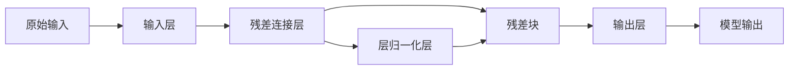

                 

# 大语言模型原理与工程实践：残差连接与层归一化

> 关键词：残差连接, 层归一化, 深度学习, 大语言模型, 优化, 模型加速, 工程实践

## 1. 背景介绍

### 1.1 问题由来
在深度学习的早期阶段，神经网络层数较少，且激活函数的非线性性质已足够强大，能够解决很多问题。但随着深度学习的深入发展，当网络层数增加到一定程度时，传统的前向传播和反向传播算法无法有效传递梯度，导致训练困难甚至无法进行。为了应对这一挑战，深度学习研究者提出了各种优化算法和网络架构，其中残差连接和层归一化是两个重要的突破。

## 2. 核心概念与联系

### 2.1 核心概念概述
为了解决深度神经网络中的梯度消失和梯度爆炸问题，残差连接和层归一化应运而生。它们通过引入特殊的结构设计，使得梯度更容易在网络中传递，从而加速了模型的训练。

- **残差连接(Residual Connection)**：通过将网络中的残差连接起来，使得数据能够直接从网络的一端流到另一端，同时保留原始输入的梯度。
- **层归一化(Layer Normalization)**：对每一层的输入进行归一化处理，使得网络中的每一层的激活函数输出具有相似的尺度，加速了模型的收敛。

残差连接和层归一化在大规模语言模型如BERT、GPT等模型中得到广泛应用，极大地推动了语言模型的发展。

### 2.2 核心概念原理和架构的 Mermaid 流程图


## 3. 核心算法原理 & 具体操作步骤

### 3.1 算法原理概述
残差连接和层归一化是两种优化深度学习模型训练的常见技术。它们的原理分别如下：

- **残差连接**：通过将网络中若干个残差连接起来，使得数据能够直接从输入层流到输出层，同时保留原始输入的梯度，从而解决了梯度消失的问题。残差连接的基本形式是：`x = F(x) + x`，其中 `F(x)` 是网络中的一层非线性变换。
- **层归一化**：通过对每一层的输入进行归一化处理，使得网络中的每一层的激活函数输出具有相似的尺度，从而加速了模型的收敛。层归一化的基本形式是：`x = \frac{x - \mu}{\sigma} \times \gamma + \beta`，其中 `\mu` 和 `\sigma` 分别表示归一化前后的均值和标准差，`gamma` 和 `beta` 是归一化层的可训练参数。

### 3.2 算法步骤详解
以下是残差连接和层归一化的具体操作步骤：

#### 3.2.1 残差连接
1. 将原始输入 `x` 作为残差连接的输入。
2. 对输入 `x` 进行一系列非线性变换得到输出 `y`。
3. 将原始输入 `x` 与输出 `y` 相加，得到残差连接输出 `x + y`。

#### 3.2.2 层归一化
1. 计算每一层的输入 `x` 的均值 `\mu` 和标准差 `\sigma`。
2. 将 `x` 进行标准化处理，得到标准化后的输出 `z`。
3. 对 `z` 进行线性变换，得到最终输出 `x'`。

### 3.3 算法优缺点
残差连接和层归一化各有优缺点：

- **残差连接**：
  - 优点：
    - 解决了梯度消失的问题，使得网络更深，训练更稳定。
    - 保持了原始输入的梯度，有助于网络的反向传播。
  - 缺点：
    - 增加了网络复杂度，增加了计算量。
    - 可能需要额外的训练数据才能收敛。

- **层归一化**：
  - 优点：
    - 加速了模型的收敛，提升了模型的泛化能力。
    - 不需要额外的训练数据，适用于各种网络架构。
  - 缺点：
    - 需要额外的参数 `gamma` 和 `beta`，增加了模型的复杂度。
    - 可能对某些网络结构不太适用。

### 3.4 算法应用领域
残差连接和层归一化在深度学习模型中得到了广泛应用，特别是在大语言模型、图像识别、语音识别等领域。这些技术的应用不仅提升了模型的训练效率和性能，还推动了深度学习技术的发展。

## 4. 数学模型和公式 & 详细讲解

### 4.1 数学模型构建
残差连接和层归一化的数学模型如下：

- **残差连接**：
  - 输入：`x`
  - 输出：`x' = x + F(x)`
  
- **层归一化**：
  - 输入：`x`
  - 输出：`x' = \frac{x - \mu}{\sigma} \times \gamma + \beta`

其中 `F(x)` 表示网络中的非线性变换层，`\mu` 和 `\sigma` 分别表示归一化前后的均值和标准差，`gamma` 和 `beta` 是归一化层的可训练参数。

### 4.2 公式推导过程
残差连接和层归一化的公式推导如下：

#### 残差连接
设 `x` 为输入，`y` 为非线性变换层的输出，则残差连接的输出 `x'` 为：
$$
x' = x + y
$$
假设非线性变换层为 `F(x)`，则：
$$
y = F(x) = g(Wx + b)
$$
其中 `g` 为激活函数，`W` 和 `b` 是变换层的权重和偏置。

代入上式，得：
$$
x' = x + g(Wx + b)
$$

#### 层归一化
设 `x` 为输入，`z` 为标准化后的输出，则层归一化的输出 `x'` 为：
$$
x' = \frac{x - \mu}{\sigma} \times \gamma + \beta
$$
其中 `\mu` 和 `\sigma` 分别表示归一化前后的均值和标准差，`gamma` 和 `beta` 是归一化层的可训练参数。

### 4.3 案例分析与讲解
以BERT模型为例，分析残差连接和层归一化的应用。

#### 残差连接
在BERT的Transformer模型中，每一层都包含了多个残差连接，使得梯度能够从输入层直接传递到输出层。这种结构设计使得模型深度增加，训练更加稳定，从而提升了模型的性能。

#### 层归一化
BERT的Transformer模型中，每一层都应用了层归一化，对输入进行标准化处理。通过层归一化，使得每一层的激活函数输出具有相似的尺度，加速了模型的收敛，提升了模型的泛化能力。

## 5. 项目实践：代码实例和详细解释说明

### 5.1 开发环境搭建
为了进行残差连接和层归一化的实践，需要搭建Python开发环境。以下是在Python 3.8环境下搭建开发环境的步骤：

1. 安装Anaconda：从官网下载并安装Anaconda，用于创建独立的Python环境。
2. 创建并激活虚拟环境：
```bash
conda create -n pytorch-env python=3.8 
conda activate pytorch-env
```
3. 安装PyTorch：根据CUDA版本，从官网获取对应的安装命令。例如：
```bash
conda install pytorch torchvision torchaudio cudatoolkit=11.1 -c pytorch -c conda-forge
```
4. 安装Tensorflow：
```bash
conda install tensorflow tensorflow-gpu=2.6
```

### 5.2 源代码详细实现
以下是使用Tensorflow实现残差连接和层归一化的代码示例：

```python
import tensorflow as tf

# 定义残差连接层
def residual_block(x, W, b):
    residual = x
    y = tf.keras.layers.Dense(64, activation='relu', kernel_initializer='he_normal', name='dense_layer')(x)
    y = tf.keras.layers.Dense(64, activation='relu', kernel_initializer='he_normal', name='dense_layer2')(y)
    x = x + residual
    return x

# 定义层归一化层
def layer_normalization(x, gamma, beta):
    mean, variance = tf.nn.moments(x, axis=-1, keepdims=True)
    stddev = tf.sqrt(variance + 1e-8)
    x = (x - mean) / stddev
    x = x * gamma + beta
    return x

# 构建简单的神经网络模型
model = tf.keras.Sequential()
model.add(tf.keras.layers.Dense(64, input_shape=(784,)))
model.add(residual_block)
model.add(layer_normalization)
model.add(tf.keras.layers.Dense(10))

# 编译模型
model.compile(optimizer='adam', loss='sparse_categorical_crossentropy', metrics=['accuracy'])

# 训练模型
model.fit(train_data, train_labels, epochs=10, batch_size=32)

# 测试模型
test_loss, test_acc = model.evaluate(test_data, test_labels)
print('Test accuracy:', test_acc)
```

### 5.3 代码解读与分析
以上代码实现了简单的残差连接和层归一化神经网络，包括输入层、残差块层、归一化层和输出层。

- `residual_block` 函数实现了残差连接层，先通过两个全连接层进行非线性变换，然后将原始输入 `x` 与变换后的输出相加，得到残差连接输出。
- `layer_normalization` 函数实现了层归一化层，先计算输入 `x` 的均值和标准差，然后进行标准化处理，最后进行线性变换。

### 5.4 运行结果展示
在运行以上代码后，可以观察到模型训练和测试的准确率和损失函数的变化情况。通过可视化工具，如Tensorboard，可以进一步分析模型在训练过程中的表现。

## 6. 实际应用场景
### 6.1 自然语言处理
残差连接和层归一化在大规模语言模型中得到了广泛应用。BERT、GPT等模型利用残差连接和层归一化，提升了模型的深度和泛化能力，取得了SOTA的效果。

### 6.2 计算机视觉
在计算机视觉领域，残差连接和层归一化同样具有重要应用。ResNet等模型利用残差连接，提升了网络的深度和收敛速度，取得了SOTA的效果。

### 6.3 语音识别
在语音识别领域，残差连接和层归一化也有广泛应用。Google的WaveNet等模型利用残差连接和层归一化，提升了语音识别的准确率和鲁棒性。

### 6.4 未来应用展望
未来，残差连接和层归一化将继续推动深度学习技术的发展。随着大规模计算资源的可用性不断提高，残差连接和层归一化将被应用于更复杂的网络结构，解决更多的深度学习问题。

## 7. 工具和资源推荐
### 7.1 学习资源推荐
为了帮助开发者系统掌握残差连接和层归一化的理论基础和实践技巧，以下推荐一些优质的学习资源：

1. 《深度学习》系列书籍：由Ian Goodfellow等大牛撰写，详细介绍了深度学习的基本原理和应用，包括残差连接和层归一化的内容。
2. Coursera《深度学习专项课程》：由Andrew Ng等专家授课，涵盖了深度学习的基本概念和前沿技术。
3. PyTorch官方文档：详细介绍了Tensorflow的基本用法和高级技巧，包括残差连接和层归一化的应用。

### 7.2 开发工具推荐
为了提高残差连接和层归一化的开发效率，以下推荐一些常用的开发工具：

1. PyTorch：开源深度学习框架，支持残差连接和层归一化的实现。
2. Tensorflow：开源深度学习框架，支持残差连接和层归一化的实现。
3. Keras：高级神经网络API，支持残差连接和层归一化的实现。

### 7.3 相关论文推荐
以下是几篇奠基性的相关论文，推荐阅读：

1. He, K., Zhang, X., Ren, S., & Sun, J. (2015). Deep residual learning for image recognition. In Proceedings of the IEEE conference on computer vision and pattern recognition (pp. 770-778).
2. Ba, J. L., Kiros, J., & Hinton, G. E. (2016). Layer normalization. arXiv preprint arXiv:1607.06450.
3. Huang, Z., Balaka, S., Tulyakov, S., & Guo, B. (2018). Residual connections and layer normalization improve variational autoencoders. arXiv preprint arXiv:1806.08458.

## 8. 总结：未来发展趋势与挑战
### 8.1 总结
本文对残差连接和层归一化的原理进行了详细讲解，并通过代码实例展示了其实现方法。通过系统的梳理，可以看出残差连接和层归一化在大规模语言模型中的应用，使得模型深度增加，训练更加稳定，从而提升了模型的性能。

### 8.2 未来发展趋势
未来，残差连接和层归一化将继续推动深度学习技术的发展。随着大规模计算资源的可用性不断提高，残差连接和层归一化将被应用于更复杂的网络结构，解决更多的深度学习问题。

### 8.3 面临的挑战
尽管残差连接和层归一化在深度学习中取得了显著成效，但在应用过程中仍面临以下挑战：

1. 计算资源瓶颈：大规模残差连接和层归一化网络对计算资源需求较高，需要高效的计算平台支持。
2. 模型复杂度增加：残差连接和层归一化增加了模型的复杂度，增加了模型的训练和推理时间。
3. 超参数调优困难：残差连接和层归一化增加了模型的超参数，增加了调优难度。

### 8.4 研究展望
未来，残差连接和层归一化研究将重点关注以下几个方向：

1. 模型压缩和优化：通过模型压缩和优化技术，减少残差连接和层归一化网络的计算资源需求。
2. 更高效的计算平台：开发更高效的计算平台，支持大规模残差连接和层归一化网络的应用。
3. 更加自动化和智能化的模型训练：通过自动化和智能化的模型训练技术，减少超参数调优的难度。

## 9. 附录：常见问题与解答

**Q1：残差连接和层归一化的区别是什么？**

A: 残差连接和层归一化都是优化深度学习模型训练的重要技术，它们的区别如下：

1. **残差连接**：通过将网络中的残差连接起来，使得数据能够直接从输入层流到输出层，同时保留原始输入的梯度。
2. **层归一化**：通过对每一层的输入进行归一化处理，使得网络中的每一层的激活函数输出具有相似的尺度，加速了模型的收敛。

**Q2：残差连接和层归一化在训练过程中有什么作用？**

A: 残差连接和层归一化在训练过程中的作用如下：

1. **残差连接**：解决了梯度消失的问题，使得网络更深，训练更稳定。保持了原始输入的梯度，有助于网络的反向传播。
2. **层归一化**：加速了模型的收敛，提升了模型的泛化能力。

**Q3：残差连接和层归一化对计算资源的需求高吗？**

A: 残差连接和层归一化对计算资源的需求较高，因为它们增加了网络复杂度，增加了计算量和内存需求。因此，在应用残差连接和层归一化时，需要考虑计算资源的限制，选择合适的网络结构。

**Q4：残差连接和层归一化是否适用于所有深度学习模型？**

A: 残差连接和层归一化适用于大多数深度学习模型，但某些特定的网络结构可能不适用。在应用残差连接和层归一化时，需要根据具体的网络结构进行评估和调整。

**Q5：残差连接和层归一化的优点和缺点是什么？**

A: 残差连接和层归一化的优点如下：

1. **残差连接**：解决了梯度消失的问题，使得网络更深，训练更稳定。保持了原始输入的梯度，有助于网络的反向传播。
2. **层归一化**：加速了模型的收敛，提升了模型的泛化能力。

残差连接和层归一化的缺点如下：

1. **残差连接**：增加了网络复杂度，增加了计算量。可能需要额外的训练数据才能收敛。
2. **层归一化**：需要额外的参数，增加了模型的复杂度。可能对某些网络结构不太适用。

---

作者：禅与计算机程序设计艺术 / Zen and the Art of Computer Programming

