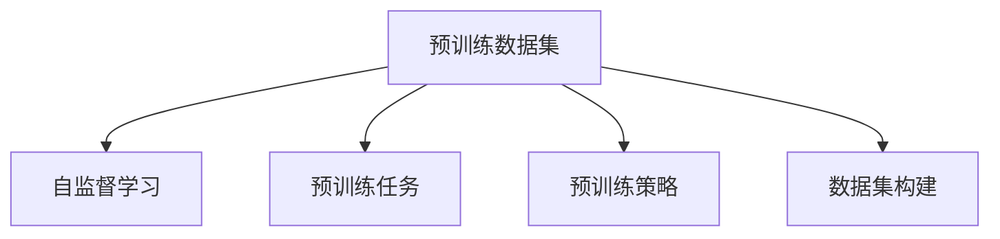

                 

# 大语言模型原理与工程实践：预训练数据构建

> 关键词：大语言模型,预训练数据,自监督学习,预训练任务,预训练策略,数据集构建,Transformer,BERT

## 1. 背景介绍

### 1.1 问题由来
近年来，深度学习技术在自然语言处理(NLP)领域的迅猛发展，尤其是大规模预训练语言模型（Large Language Models, LLMs）的涌现，显著提升了语言理解和生成能力。这些模型如BERT、GPT等，通过在大规模无标签文本数据上进行自监督预训练，学习了丰富的语言知识和上下文理解能力。预训练语言模型的成功，离不开高质量、大规模的预训练数据集的构建。

### 1.2 问题核心关键点
预训练数据集的质量直接决定了模型的性能。高质量的预训练数据集应当具备以下特点：
- **规模庞大**：数据集应该包含足够多的文本样本，涵盖多种语言风格和主题，确保模型能够学习到多样化的语言表示。
- **分布均衡**：不同类型和长度的文本样本应当均衡分布，避免模型偏向某一特定风格或长度的文本。
- **质量高**：数据集应当经过严格的文本清洗和校验，确保数据的正确性和一致性，避免引入噪音和偏置。
- **任务相关**：数据集应当与目标任务的语料库特征一致，使得预训练模型能够更好地迁移应用到下游任务。

本文聚焦于预训练数据构建的技术和方法，探讨如何构建高质量、大规模的预训练数据集，以助力大语言模型的训练和优化。

## 2. 核心概念与联系

### 2.1 核心概念概述

为更好地理解预训练数据构建的过程，本节将介绍几个密切相关的核心概念：

- 预训练数据集（Pre-training Dataset）：指用于预训练大语言模型的文本数据集，其质量直接影响模型的训练效果。
- 自监督学习（Self-supervised Learning）：指在大规模无标签数据上，通过设计一些自监督任务来训练模型的学习范式。
- 预训练任务（Pre-training Task）：指设计在预训练阶段用于训练模型的特定任务，如掩码语言模型、下位语言推理等。
- 预训练策略（Pre-training Strategy）：指在大规模文本数据上如何进行预训练，包括数据收集、处理、划分、采样等。
- 数据集构建（Dataset Construction）：指从原始文本数据中提取和构建用于预训练的数据集，包括数据清洗、标注、分词、编码等步骤。

这些概念之间的逻辑关系可以通过以下Mermaid流程图来展示：



这个流程图展示了大语言模型预训练数据的构建核心概念及其之间的关系：

1. 预训练数据集是自监督学习和预训练任务的基础。
2. 自监督学习通过设计预训练任务，在无标签数据上进行训练。
3. 预训练策略指导数据集的构建和处理过程。
4. 数据集构建过程包括数据收集、清洗、标注和编码等环节。

这些概念共同构成了大语言模型预训练数据构建的框架，为其训练和优化提供了坚实的基础。

## 3. 核心算法原理 & 具体操作步骤

### 3.1 算法原理概述

预训练语言模型的构建，本质上是通过自监督学习在大规模无标签文本数据上训练模型的过程。其核心思想是：在大规模无标签文本数据上，设计一些自监督任务，使得模型能够自主学习语言的知识和表示。常见的预训练任务包括掩码语言模型、下位语言推理、文本分类、语言建模等。

形式化地，假设预训练语言模型为 $M_{\theta}$，其中 $\theta$ 为模型参数。给定预训练数据集 $D=\{x_1, x_2, \ldots, x_N\}$，预训练的目标是最小化经验风险，即：

$$
\theta^* = \mathop{\arg\min}_{\theta} \mathcal{L}(M_{\theta},D)
$$

其中 $\mathcal{L}$ 为预训练任务的损失函数，用于衡量模型在预训练任务上的表现。常见的预训练任务损失函数包括掩码语言模型损失、自编码器损失、对比损失等。

### 3.2 算法步骤详解

基于自监督学习的预训练数据构建一般包括以下几个关键步骤：

**Step 1: 数据收集与预处理**
- 收集大规模无标签文本数据，确保数据集的丰富性和多样性。
- 对原始文本进行预处理，包括去除HTML标签、去重、分词等。

**Step 2: 划分数据集**
- 将预处理后的数据集划分为训练集和验证集。
- 根据任务需求，进一步划分为更小的训练集、验证集和测试集。

**Step 3: 预训练任务设计**
- 设计适合预训练任务的损失函数。
- 选择合适的采样策略，如随机采样、层次采样等。

**Step 4: 模型训练**
- 使用优化算法（如AdamW、SGD等）进行模型训练。
- 根据损失函数和采样策略，迭代更新模型参数。

**Step 5: 模型评估**
- 在验证集上评估模型性能。
- 根据评估结果，调整超参数和采样策略。

**Step 6: 保存模型**
- 保存训练后的模型参数和配置文件，便于后续微调使用。

### 3.3 算法优缺点

基于自监督学习的预训练数据构建方法具有以下优点：
1. 无需标注数据。使用大规模无标签数据进行预训练，不需要标注数据的获取和标注成本。
2. 泛化能力强。预训练任务通常设计为具有普适性的语言表征学习目标，模型能够泛化到多种任务上。
3. 效果显著。预训练模型在各种NLP任务上取得了优异的性能，证明其自监督学习方法的强大能力。

同时，该方法也存在一些局限性：
1. 数据集构建复杂。高质量数据集的构建需要大量资源和时间，且对数据质量要求高。
2. 预训练任务设计困难。设计适合自监督任务并非易事，需要深入理解和掌握语言学知识。
3. 模型复杂度高。大规模预训练模型往往参数量巨大，训练和推理成本高。

尽管存在这些局限性，但基于自监督学习的预训练方法仍然是大语言模型构建的主流范式。未来相关研究的重点在于如何进一步降低预训练数据构建的复杂度，提高模型的参数效率和训练速度，同时兼顾数据质量和模型性能。

### 3.4 算法应用领域

基于自监督学习的预训练方法在NLP领域已经得到了广泛的应用，覆盖了几乎所有常见任务，例如：

- 文本分类：如情感分析、主题分类、意图识别等。通过预训练学习文本-标签映射。
- 命名实体识别：识别文本中的人名、地名、机构名等特定实体。通过预训练学习实体边界和类型。
- 关系抽取：从文本中抽取实体之间的语义关系。通过预训练学习实体-关系三元组。
- 问答系统：对自然语言问题给出答案。通过预训练学习问题-答案对。
- 机器翻译：将源语言文本翻译成目标语言。通过预训练学习语言-语言映射。
- 文本摘要：将长文本压缩成简短摘要。通过预训练学习文章-摘要对。
- 对话系统：使机器能够与人自然对话。通过预训练学习对话历史和回复生成。

除了上述这些经典任务外，预训练方法也被创新性地应用到更多场景中，如可控文本生成、常识推理、代码生成、数据增强等，为NLP技术带来了全新的突破。随着预训练模型的不断进步，相信预训练方法将在更广阔的应用领域大放异彩。

## 4. 数学模型和公式 & 详细讲解 & 举例说明

### 4.1 数学模型构建

本节将使用数学语言对自监督预训练的数据构建过程进行更加严格的刻画。

记预训练语言模型为 $M_{\theta}$，其中 $\theta$ 为模型参数。假设预训练数据集为 $D=\{x_1, x_2, \ldots, x_N\}$，预训练任务为 $T$，其损失函数为 $\ell$。

定义预训练模型 $M_{\theta}$ 在数据样本 $x_i$ 上的损失函数为 $\ell(M_{\theta}(x_i))$，则在数据集 $D$ 上的经验风险为：

$$
\mathcal{L}(\theta) = \frac{1}{N} \sum_{i=1}^N \ell(M_{\theta}(x_i))
$$

预训练的目标是最小化经验风险，即找到最优参数：

$$
\theta^* = \mathop{\arg\min}_{\theta} \mathcal{L}(\theta)
$$

在实践中，我们通常使用基于梯度的优化算法（如AdamW、SGD等）来近似求解上述最优化问题。设 $\eta$ 为学习率，$\lambda$ 为正则化系数，则参数的更新公式为：

$$
\theta \leftarrow \theta - \eta \nabla_{\theta}\mathcal{L}(\theta) - \eta\lambda\theta
$$

其中 $\nabla_{\theta}\mathcal{L}(\theta)$ 为损失函数对参数 $\theta$ 的梯度，可通过反向传播算法高效计算。

### 4.2 公式推导过程

以下我们以掩码语言模型（Masked Language Model, MLM）为例，推导预训练模型的梯度计算公式。

假设预训练模型 $M_{\theta}$ 在输入 $x$ 上的输出为 $\hat{x}=M_{\theta}(x)$，表示模型对文本的预测。设 $x$ 中 $m$ 个单词被随机遮盖，模型需要预测这些遮盖单词的原始内容。掩码语言模型的损失函数定义为：

$$
\ell(M_{\theta}(x)) = -\log \prod_{i=1}^m P(x_i|x_{-i})
$$

其中 $P(x_i|x_{-i})$ 为掩码后文本的似然概率，即在遮盖其他单词的情况下，预测被遮盖单词的正确概率。

将其代入经验风险公式，得：

$$
\mathcal{L}(\theta) = -\frac{1}{N}\sum_{i=1}^N \log \prod_{j=1}^m P(x_{i,j}|x_{i,-j})
$$

根据链式法则，损失函数对参数 $\theta_k$ 的梯度为：

$$
\frac{\partial \mathcal{L}(\theta)}{\partial \theta_k} = -\frac{1}{N}\sum_{i=1}^N \frac{\partial \log \prod_{j=1}^m P(x_{i,j}|x_{i,-j})}{\partial \theta_k}
$$

其中：

$$
\frac{\partial \log P(x_{i,j}|x_{i,-j})}{\partial \theta_k} = \frac{\partial}{\partial \theta_k} \log \frac{e^{\theta_k x_{i,j}}}{\sum_k e^{\theta_k x_{i,j}}}
$$

进一步展开得：

$$
\frac{\partial \mathcal{L}(\theta)}{\partial \theta_k} = -\frac{1}{N}\sum_{i=1}^N \sum_{j=1}^m \left( \frac{x_{i,j}}{P(x_{i,j}|x_{i,-j})} - \frac{1}{P(x_{i,j}|x_{i,-j})} \right) \frac{\partial P(x_{i,j}|x_{i,-j})}{\partial \theta_k}
$$

通过计算可得梯度表达式，最终完成模型的梯度更新过程。

## 5. 项目实践：代码实例和详细解释说明

### 5.1 开发环境搭建

在进行预训练数据构建实践前，我们需要准备好开发环境。以下是使用Python进行PyTorch开发的环境配置流程：

1. 安装Anaconda：从官网下载并安装Anaconda，用于创建独立的Python环境。

2. 创建并激活虚拟环境：
```bash
conda create -n pytorch-env python=3.8 
conda activate pytorch-env
```

3. 安装PyTorch：根据CUDA版本，从官网获取对应的安装命令。例如：
```bash
conda install pytorch torchvision torchaudio cudatoolkit=11.1 -c pytorch -c conda-forge
```

4. 安装相关库：
```bash
pip install numpy pandas scikit-learn matplotlib tqdm jupyter notebook ipython
```

完成上述步骤后，即可在`pytorch-env`环境中开始预训练数据构建实践。

### 5.2 源代码详细实现

下面我们以构建中文维基百科预训练数据集为例，给出使用PyTorch和Transformers库进行预训练数据构建的代码实现。

首先，我们需要收集中文维基百科的数据。假设数据已经保存到本地目录`data`中，包含多个`*.txt`文件。

然后，我们需要进行数据预处理，包括去除HTML标签、去重、分词等操作。可以使用`jieba`库进行中文分词：

```python
import jieba
from tqdm import tqdm

with open('data/allwiki.txt', 'r', encoding='utf-8') as f:
    all_text = f.read()

# 分词
all_words = []
for word in jieba.cut(all_text):
    all_words.append(word)
```

接着，我们需要将分词后的文本数据划分为训练集和验证集。可以使用`train_test_split`函数进行划分：

```python
from sklearn.model_selection import train_test_split

train_text, valid_text = train_test_split(all_words, test_size=0.2, random_state=42)
```

然后，我们需要对划分后的文本数据进行编码，准备用于预训练模型的输入。可以使用`TokenizedDataset`类来实现：

```python
from transformers import BertTokenizer, TokenizedDataset

tokenizer = BertTokenizer.from_pretrained('bert-base-chinese')
train_dataset = TokenizedDataset(train_text, tokenizer, max_len=512)
valid_dataset = TokenizedDataset(valid_text, tokenizer, max_len=512)
```

最后，我们可以使用PyTorch的`DataLoader`来加载预训练数据集，准备进行模型的训练和验证：

```python
train_loader = DataLoader(train_dataset, batch_size=32, shuffle=True)
valid_loader = DataLoader(valid_dataset, batch_size=32, shuffle=False)
```

至此，我们已经准备好数据集，可以进行模型的预训练了。

### 5.3 代码解读与分析

让我们再详细解读一下关键代码的实现细节：

**分词和编码**：
- 使用`jieba`库对原始文本进行分词，得到一个单词列表`all_words`。
- 使用`BertTokenizer`对分词后的文本进行编码，生成模型需要的输入格式。

**数据划分**：
- 使用`train_test_split`函数将单词列表划分为训练集和验证集，按比例为80%和20%。

**数据加载**：
- 使用`TokenizedDataset`类将编码后的文本数据转换为模型可以处理的格式。
- 使用`DataLoader`将数据集划分为批处理，方便模型训练和验证。

可以看到，使用PyTorch和Transformers库进行预训练数据构建的代码实现相对简单高效。开发者可以将更多精力放在数据处理和模型训练等高层逻辑上，而不必过多关注底层的实现细节。

## 6. 实际应用场景

### 6.1 中文维基百科预训练

中文维基百科预训练数据集是构建中文预训练语言模型的基础。中文维基百科包含大量的高质量文本数据，涵盖了广泛的主题和语料类型，是预训练模型的理想来源。通过中文维基百科预训练，可以学习到丰富的中文语言知识和上下文理解能力，为后续的中文语言理解和生成任务奠定坚实的基础。

在实际应用中，中文维基百科预训练数据集可以用于训练BERT、RoBERTa等中文预训练语言模型。这些模型在情感分析、文本分类、命名实体识别等中文NLP任务上取得了优异的性能，展示了预训练语言模型的强大能力。

### 6.2 大规模新闻语料预训练

大规模新闻语料是构建新闻领域预训练语言模型的重要数据源。新闻语料具有高度的时效性和多样性，涵盖国内外各类新闻报道、评论和社论等。通过新闻语料预训练，可以学习到新闻语言的特定风格和表达方式，提升模型在新闻领域的理解能力。

在实际应用中，大规模新闻语料可以用于训练GPT系列、T5等预训练语言模型。这些模型在新闻摘要、情感分析、主题分类等任务上表现出色，能够快速处理大量的新闻文本数据，提供高效的新闻理解服务。

### 6.3 学术文献预训练

学术文献是构建特定领域预训练语言模型的重要数据源。学术文献具有高度的学术价值和专业性，涵盖了各学科领域的研究成果和进展。通过学术文献预训练，可以学习到特定领域的语言知识和专业术语，提升模型在该领域的应用效果。

在实际应用中，学术文献预训练数据集可以用于训练SciBERT、MedBERT等特定领域预训练语言模型。这些模型在学术文本分类、信息抽取、知识图谱构建等任务上表现优异，能够为学术研究和知识挖掘提供有力的技术支持。

### 6.4 未来应用展望

随着预训练语言模型的不断进步，预训练数据构建技术将呈现以下几个发展趋势：

1. **大规模数据集的构建**：随着预训练模型参数量的增大，大规模数据集的构建变得尤为重要。未来将有更多高质量的大规模数据集被开发和共享，为预训练模型的训练提供更多优质的数据源。

2. **多语言预训练数据集**：多语言预训练数据集的构建将推动全球范围内的NLP技术发展。未来预训练数据集将支持更多的语言，涵盖更多种语言风格和语料类型，提升跨语言模型的性能。

3. **实时数据生成**：实时数据生成技术将使得预训练模型能够持续不断地从新的数据源中学习，保持模型知识和技能的更新。

4. **自动化数据构建**：自动化数据构建技术将使得预训练模型的构建更加高效和便捷，降低人工干预和维护成本。

5. **领域特定预训练数据集**：针对不同领域的具体需求，开发领域特定的预训练数据集，提升模型在该领域的泛化能力和适应性。

6. **多模态数据预训练**：多模态数据预训练将使得预训练模型能够同时处理文本、图像、视频等多种模态的数据，提升模型的综合理解能力。

以上趋势展示了预训练数据构建技术的广阔前景。这些方向的探索和发展，必将进一步提升预训练语言模型的性能和应用范围，为自然语言理解和智能交互系统的进步提供坚实的技术基础。

## 7. 工具和资源推荐

### 7.1 学习资源推荐

为了帮助开发者系统掌握预训练数据构建的理论基础和实践技巧，这里推荐一些优质的学习资源：

1. 《Deep Learning for Natural Language Processing》书籍：由Coursera开设的NLP课程，涵盖预训练数据构建、自监督学习等关键内容，适合NLP初学者入门。

2. CS224N《深度学习自然语言处理》课程：斯坦福大学开设的NLP明星课程，有Lecture视频和配套作业，带你深入理解预训练语言模型及其构建。

3. 《Hugging Face官方文档》：官方文档详细介绍了各预训练语言模型的构建流程和参数配置，是预训练数据构建实践的必备资料。

4. Hugging Face Blog：官方博客提供了大量预训练数据构建和微调模型的实践案例，可供开发者参考和学习。

5. arXiv论文库：包含大量预训练数据构建和语言模型训练的最新研究成果，帮助开发者了解前沿技术和趋势。

通过对这些资源的学习实践，相信你一定能够快速掌握预训练数据构建的精髓，并用于解决实际的NLP问题。

### 7.2 开发工具推荐

高效的预训练数据构建离不开优秀的工具支持。以下是几款用于预训练数据构建开发的常用工具：

1. PyTorch：基于Python的开源深度学习框架，灵活动态的计算图，适合快速迭代研究。大部分预训练语言模型都有PyTorch版本的实现。

2. TensorFlow：由Google主导开发的开源深度学习框架，生产部署方便，适合大规模工程应用。同样有丰富的预训练语言模型资源。

3. Transformers库：HuggingFace开发的NLP工具库，集成了众多SOTA语言模型，支持PyTorch和TensorFlow，是预训练数据构建的利器。

4. Weights & Biases：模型训练的实验跟踪工具，可以记录和可视化模型训练过程中的各项指标，方便对比和调优。与主流深度学习框架无缝集成。

5. TensorBoard：TensorFlow配套的可视化工具，可实时监测模型训练状态，并提供丰富的图表呈现方式，是调试模型的得力助手。

6. Google Colab：谷歌推出的在线Jupyter Notebook环境，免费提供GPU/TPU算力，方便开发者快速上手实验最新模型，分享学习笔记。

合理利用这些工具，可以显著提升预训练数据构建的开发效率，加快创新迭代的步伐。

### 7.3 相关论文推荐

预训练数据构建技术的发展源于学界的持续研究。以下是几篇奠基性的相关论文，推荐阅读：

1. Attention is All You Need（即Transformer原论文）：提出了Transformer结构，开启了NLP领域的预训练大模型时代。

2. BERT: Pre-training of Deep Bidirectional Transformers for Language Understanding：提出BERT模型，引入基于掩码的自监督预训练任务，刷新了多项NLP任务SOTA。

3. The T5 Architecture：提出T5模型，通过简单预训练任务设计，实现了从语言建模到各种下游任务的统一预训练。

4. MASS: Masked Sequence-to-Sequence Pre-training for Language Generation：提出MASS模型，通过多任务自监督预训练，提升了语言生成模型的性能。

5. BigQuery LLM：提出BigQuery LLM模型，利用BigQuery大规模数据源进行自监督预训练，提高了预训练语言模型的规模和质量。

6. Pegasus: Pre-training with Extractive Data-Augmentation：提出Pegasus模型，利用数据增强技术提升了预训练语言模型的性能和泛化能力。

这些论文代表了大语言模型预训练数据构建的发展脉络。通过学习这些前沿成果，可以帮助研究者把握学科前进方向，激发更多的创新灵感。

## 8. 总结：未来发展趋势与挑战

### 8.1 总结

本文对自监督学习的大语言模型预训练方法进行了全面系统的介绍。首先阐述了预训练数据构建的背景和重要性，明确了预训练数据在模型训练和优化中的核心作用。其次，从原理到实践，详细讲解了自监督学习的数学原理和关键步骤，给出了预训练数据构建的完整代码实例。同时，本文还广泛探讨了预训练数据构建在NLP领域的应用场景，展示了预训练方法的广泛应用前景。此外，本文精选了预训练数据构建的学习资源，力求为读者提供全方位的技术指引。

通过本文的系统梳理，可以看到，自监督学习的预训练数据构建方法在NLP领域已经取得了显著成效，为预训练语言模型的训练和优化提供了坚实的基础。未来，伴随预训练模型和自监督学习方法的不断进步，预训练技术必将进一步提升NLP系统的性能和应用范围，为构建智能交互系统提供坚实的技术基础。

### 8.2 未来发展趋势

展望未来，预训练数据构建技术将呈现以下几个发展趋势：

1. **大规模数据集的构建**：随着预训练模型参数量的增大，大规模数据集的构建变得尤为重要。未来将有更多高质量的大规模数据集被开发和共享，为预训练模型的训练提供更多优质的数据源。

2. **多语言预训练数据集**：多语言预训练数据集的构建将推动全球范围内的NLP技术发展。未来预训练数据集将支持更多的语言，涵盖更多种语言风格和语料类型，提升跨语言模型的性能。

3. **实时数据生成**：实时数据生成技术将使得预训练模型能够持续不断地从新的数据源中学习，保持模型知识和技能的更新。

4. **自动化数据构建**：自动化数据构建技术将使得预训练模型的构建更加高效和便捷，降低人工干预和维护成本。

5. **领域特定预训练数据集**：针对不同领域的具体需求，开发领域特定的预训练数据集，提升模型在该领域的泛化能力和适应性。

6. **多模态数据预训练**：多模态数据预训练将使得预训练模型能够同时处理文本、图像、视频等多种模态的数据，提升模型的综合理解能力。

以上趋势展示了预训练数据构建技术的广阔前景。这些方向的探索和发展，必将进一步提升预训练语言模型的性能和应用范围，为自然语言理解和智能交互系统的进步提供坚实的技术基础。

### 8.3 面临的挑战

尽管预训练数据构建技术已经取得了显著成效，但在迈向更加智能化、普适化应用的过程中，它仍面临着诸多挑战：

1. **数据质量瓶颈**：高质量预训练数据集的构建需要大量资源和时间，且对数据质量要求高。如何进一步降低预训练数据构建的复杂度，提高数据构建效率，仍是一个重要问题。

2. **预训练任务设计困难**：设计适合自监督任务并非易事，需要深入理解和掌握语言学知识。如何设计更加高效和多样化的预训练任务，提升模型的泛化能力，仍是一个重要的研究方向。

3. **模型复杂度高**：大规模预训练模型往往参数量巨大，训练和推理成本高。如何在保证性能的同时，简化模型结构，提升推理速度，优化资源占用，将是重要的优化方向。

4. **模型训练时间和资源消耗**：预训练模型需要大量时间和资源进行训练，如何优化训练流程，减少训练时间和资源消耗，提高训练效率，仍是一个重要的研究方向。

5. **模型泛化性和稳定性**：预训练模型在不同任务上的泛化性能和稳定性仍需进一步提升。如何在不同领域和任务上保持模型的泛化能力和稳定性，仍是一个重要的研究方向。

6. **模型可解释性和透明性**：预训练模型往往作为"黑盒"系统，难以解释其内部工作机制和决策逻辑。如何赋予模型更强的可解释性，提高模型的透明性，仍是一个重要的研究方向。

正视预训练数据构建面临的这些挑战，积极应对并寻求突破，将是大语言模型预训练技术走向成熟的必由之路。相信随着学界和产业界的共同努力，这些挑战终将一一被克服，预训练数据构建技术必将在构建智能交互系统、推动NLP技术进步中发挥更大的作用。

### 8.4 研究展望

面对预训练数据构建所面临的挑战，未来的研究需要在以下几个方面寻求新的突破：

1. **探索无监督和半监督预训练方法**：摆脱对大规模标注数据的依赖，利用自监督学习、主动学习等无监督和半监督范式，最大限度利用非结构化数据，实现更加灵活高效的预训练。

2. **研究参数高效和计算高效的预训练范式**：开发更加参数高效的预训练方法，在固定大部分预训练参数的同时，只更新极少量的任务相关参数。同时优化预训练模型的计算图，减少前向传播和反向传播的资源消耗，实现更加轻量级、实时性的部署。

3. **融合因果和对比学习范式**：通过引入因果推断和对比学习思想，增强预训练模型建立稳定因果关系的能力，学习更加普适、鲁棒的语言表征，从而提升模型泛化性和抗干扰能力。

4. **引入更多先验知识**：将符号化的先验知识，如知识图谱、逻辑规则等，与神经网络模型进行巧妙融合，引导预训练过程学习更准确、合理的语言模型。同时加强不同模态数据的整合，实现视觉、语音等多模态信息与文本信息的协同建模。

5. **结合因果分析和博弈论工具**：将因果分析方法引入预训练模型，识别出模型决策的关键特征，增强输出解释的因果性和逻辑性。借助博弈论工具刻画人机交互过程，主动探索并规避模型的脆弱点，提高系统稳定性。

6. **纳入伦理道德约束**：在模型训练目标中引入伦理导向的评估指标，过滤和惩罚有偏见、有害的输出倾向。同时加强人工干预和审核，建立模型行为的监管机制，确保输出符合人类价值观和伦理道德。

这些研究方向的探索，必将引领预训练数据构建技术迈向更高的台阶，为构建安全、可靠、可解释、可控的智能系统铺平道路。面向未来，预训练数据构建技术还需要与其他人工智能技术进行更深入的融合，如知识表示、因果推理、强化学习等，多路径协同发力，共同推动自然语言理解和智能交互系统的进步。只有勇于创新、敢于突破，才能不断拓展预训练语言模型的边界，让智能技术更好地造福人类社会。

## 9. 附录：常见问题与解答

**Q1：如何构建高质量的大规模预训练数据集？**

A: 构建高质量的大规模预训练数据集需要考虑以下几个方面：
1. **数据收集**：收集大规模无标签文本数据，确保数据集的丰富性和多样性。可以从维基百科、新闻网站、学术论文、社交媒体等渠道获取数据。
2. **数据预处理**：对原始文本进行预处理，包括去除HTML标签、去重、分词等操作，确保数据的正确性和一致性。
3. **数据划分**：将预处理后的数据集划分为训练集和验证集，并根据任务需求进一步划分为更小的训练集、验证集和测试集。
4. **数据采样**：选择合适的采样策略，如随机采样、层次采样等，确保数据的多样性和代表性。
5. **数据清洗**：去除噪音和无关信息，确保数据集的质量。

**Q2：如何选择预训练任务？**

A: 选择预训练任务时需要考虑以下几个方面：
1. **任务相关性**：选择与目标任务相关性较高的预训练任务，确保预训练模型能够迁移应用到下游任务。
2. **任务多样性**：选择多样化的预训练任务，确保模型能够学习到丰富的语言知识和表征。
3. **任务难度**：选择难度适中的预训练任务，确保模型能够在有限的时间内完成训练。
4. **任务可解释性**：选择具有良好可解释性的预训练任务，确保模型输出的结果能够被理解和解释。

**Q3：如何进行大规模预训练模型训练？**

A: 大规模预训练模型训练需要考虑以下几个方面：
1. **计算资源**：需要使用GPU/TPU等高性能设备进行训练，确保模型能够在有限的时间内完成训练。
2. **模型参数**：选择合适大小的模型参数，确保模型能够在有限的时间和资源下完成训练。
3. **训练策略**：选择合适的训练策略，如学习率调整、梯度累积、混合精度训练等，确保模型能够在有限的时间内完成训练。
4. **训练监控**：实时监测模型训练状态，确保模型在训练过程中的稳定性和收敛性。

**Q4：如何评估预训练模型的性能？**

A: 评估预训练模型性能需要考虑以下几个方面：
1. **评估指标**：选择合适的评估指标，如准确率、召回率、F1分数等，确保评估指标与任务相关。
2. **评估数据集**：使用独立的验证集和测试集进行评估，确保评估数据的代表性。
3. **模型调优**：根据评估结果进行模型调优，提高模型的性能。
4. **模型保存**：保存训练后的模型参数和配置文件，便于后续微调使用。

**Q5：如何在多语言场景下构建预训练数据集？**

A: 在多语言场景下构建预训练数据集需要考虑以下几个方面：
1. **多语言数据集**：收集多语言的文本数据，确保数据集的多样性和覆盖范围。
2. **多语言处理**：使用多语言处理工具，如Multi-BERT、XLM等，处理多语言文本数据。
3. **多语言采样**：选择适合多语言的采样策略，确保数据的多样性和代表性。
4. **多语言模型**：选择适合多语言的预训练模型，确保模型能够在多语言场景下进行预训练。

通过本文的系统梳理，可以看到，自监督学习的大语言模型预训练数据构建方法在NLP领域已经取得了显著成效，为预训练语言模型的训练和优化提供了坚实的基础。未来，伴随预训练模型和自监督学习方法的不断进步，预训练技术必将进一步提升NLP系统的性能和应用范围，为构建智能交互系统提供坚实的技术基础。相信随着学界和产业界的共同努力，这些挑战终将一一被克服，预训练数据构建技术必将在构建智能交互系统、推动NLP技术进步中发挥更大的作用。

---

作者：禅与计算机程序设计艺术 / Zen and the Art of Computer Programming

