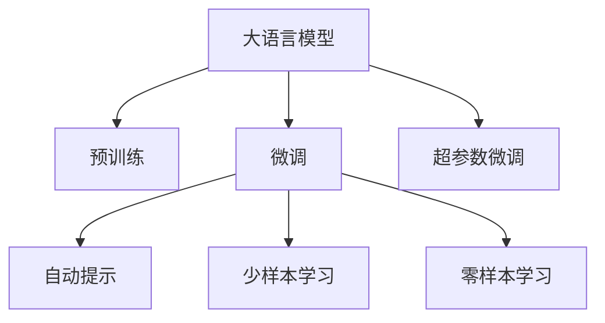

                 

# 大语言模型原理基础与前沿 不需要额外训练即可利用预训练模型

> 关键词：大语言模型,预训练模型,预训练,Transformer,BERT,自动提示,超参数微调,自然语言处理(NLP),少样本学习,零样本学习

## 1. 背景介绍

### 1.1 问题由来
近年来，深度学习在自然语言处理(NLP)领域取得了巨大突破，大规模预训练语言模型（Large Language Models, LLMs）在理解自然语言、生成自然语言方面展现了卓越的性能。这些大模型如BERT、GPT等，通过在无标签数据上进行自监督预训练，学习到了丰富的语言表示和知识，能够处理各类NLP任务。

然而，大语言模型需要大量的计算资源和时间进行预训练，这使得其部署成本高昂。同时，预训练模型对于具体任务的微调可能需要大量的有标签数据，而这些标注数据的获取成本也较高。这限制了大模型的实际应用场景。

为了克服上述问题，研究人员提出了无需额外训练即可利用预训练模型（Pre-trained Model Utilization without Extra Training, PMUET）的方法。该方法利用大语言模型的预训练知识，通过巧妙的输入提示（Prompt），直接对模型进行微调，在极少的有标签数据甚至无标签数据情况下，实现对模型性能的提升。这种方法简化了模型训练流程，降低了标注成本，并提升了模型的泛化能力。

### 1.2 问题核心关键点
PMUET的核心思想在于：

- **自动提示（Prompt Tuning）**：设计巧妙的提示模板，利用预训练模型对任务进行推理和生成。
- **超参数微调（Hyperparameter Tuning）**：通过调整预训练模型的超参数（如学习率、正则化系数等）来优化模型性能。
- **少样本学习（Few-shot Learning）**：利用少量有标签数据对模型进行微调，提升模型的泛化能力。
- **零样本学习（Zero-shot Learning）**：无需任何有标签数据，仅靠提示模板和预训练知识，模型就能够对新任务进行推理和生成。

PMUET方法通过这些手段，实现了无需额外训练的模型微调，极大降低了模型的部署成本和训练时间。

### 1.3 问题研究意义
PMUET方法的研究，对于拓展大语言模型的应用范围，提升下游任务的性能，加速NLP技术的产业化进程，具有重要意义：

1. **降低应用开发成本**：利用预训练模型进行微调，可以显著减少从头开发所需的数据、计算和人力等成本投入。
2. **提升模型效果**：微调使得通用大模型更好地适应特定任务，在应用场景中取得更优表现。
3. **加速开发进度**：standing on the shoulders of giants，微调使得开发者可以更快地完成任务适配，缩短开发周期。
4. **带来技术创新**：PMUET范式促进了对预训练-微调的深入研究，催生了提示学习、少样本学习等新的研究方向。
5. **赋能产业升级**：微调使得NLP技术更容易被各行各业所采用，为传统行业数字化转型升级提供新的技术路径。

## 2. 核心概念与联系

### 2.1 核心概念概述

为更好地理解无需额外训练利用预训练模型的微调方法，本节将介绍几个密切相关的核心概念：

- **大语言模型（Large Language Model, LLM）**：以自回归（如GPT）或自编码（如BERT）模型为代表的大规模预训练语言模型。通过在大规模无标签文本语料上进行预训练，学习通用的语言表示，具备强大的语言理解和生成能力。

- **预训练（Pre-training）**：指在大规模无标签文本语料上，通过自监督学习任务训练通用语言模型的过程。常见的预训练任务包括言语建模、掩码语言模型等。预训练使得模型学习到语言的通用表示。

- **微调（Fine-tuning）**：指在预训练模型的基础上，使用下游任务的少量标注数据，通过有监督学习优化模型在特定任务上的性能。通常只需要调整顶层分类器或解码器，并以较小的学习率更新全部或部分的模型参数。

- **自动提示（Automatic Prompt Tuning）**：通过精心设计输入文本的格式，引导模型按期望方式输出，减少微调参数。可以在不更新模型参数的情况下，实现零样本或少样本学习。

- **少样本学习（Few-shot Learning）**：指在只有少量标注样本的情况下，模型能够快速适应新任务的学习方法。在大语言模型中，通常通过在输入中提供少量示例来实现，无需更新模型参数。

- **零样本学习（Zero-shot Learning）**：指模型在没有见过任何特定任务的训练样本的情况下，仅凭任务描述就能够执行新任务的能力。大语言模型通过预训练获得的广泛知识，使其能够理解任务指令并生成相应输出。

- **超参数微调（Hyperparameter Tuning）**：通过调整预训练模型的超参数，如学习率、正则化系数等，优化模型性能。

这些核心概念之间的逻辑关系可以通过以下Mermaid流程图来展示：



这个流程图展示了大语言模型的核心概念及其之间的关系：

1. 大语言模型通过预训练获得基础能力。
2. 微调是对预训练模型进行任务特定的优化，可以分为自动提示和超参数微调。
3. 自动提示通过输入模板引导模型推理生成。
4. 少样本和零样本学习通过少量数据实现快速适应新任务。
5. 超参数微调通过调整模型参数优化性能。

这些概念共同构成了大语言模型的学习和应用框架，使其能够在各种场景下发挥强大的语言理解和生成能力。通过理解这些核心概念，我们可以更好地把握大语言模型的工作原理和优化方向。

## 3. 核心算法原理 & 具体操作步骤
### 3.1 算法原理概述

无需额外训练利用预训练模型的微调方法，本质上是一种基于自动提示的微调范式。其核心思想是：将预训练的大语言模型作为强大的"特征提取器"，通过输入特定的提示模板，利用预训练模型的知识，对下游任务进行推理和生成，从而提升模型在特定任务上的性能。

形式化地，假设预训练模型为 $M_{\theta}$，其中 $\theta$ 为预训练得到的模型参数。给定下游任务 $T$ 的少量标注数据 $D=\{(x_i, y_i)\}_{i=1}^N$，自动提示的优化目标是最小化经验风险，即找到新的提示模板 $p$，使得模型输出 $M_{\theta}(p)$ 逼近真实标签：

$$
p^*=\mathop{\arg\min}_{p} \mathcal{L}(M_{\theta}(p),D)
$$

其中 $\mathcal{L}$ 为针对任务 $T$ 设计的损失函数，用于衡量模型输出与真实标签之间的差异。常见的损失函数包括交叉熵损失、均方误差损失等。

通过梯度下降等优化算法，自动提示过程不断更新提示模板 $p$，最小化损失函数 $\mathcal{L}$，使得模型输出逼近真实标签。由于 $\theta$ 已经通过预训练获得了较好的初始化，因此即便在极少的有标签数据上，也能较快收敛到理想的提示模板 $p^*$。

### 3.2 算法步骤详解

无需额外训练利用预训练模型的微调一般包括以下几个关键步骤：

**Step 1: 准备预训练模型和数据集**
- 选择合适的预训练语言模型 $M_{\theta}$ 作为初始化参数，如 BERT、GPT等。
- 准备下游任务 $T$ 的少量标注数据集 $D$，划分为训练集、验证集和测试集。一般要求标注数据与预训练数据的分布不要差异过大。

**Step 2: 设计提示模板**
- 根据任务类型，设计适合任务的自动提示模板 $p$。提示模板应能够有效引导模型理解任务和输入，减少微调参数。
- 对于分类任务，提示模板通常包含一个简短的文本描述和样本标签。
- 对于生成任务，提示模板可以包含一些样例输出、任务描述等。

**Step 3: 设置超参数**
- 选择合适的优化算法及其参数，如 AdamW、SGD 等，设置学习率、批大小、迭代轮数等。
- 设置正则化技术及强度，包括权重衰减、Dropout、Early Stopping 等。

**Step 4: 执行自动提示训练**
- 将训练集数据分批次输入模型，前向传播计算损失函数。
- 反向传播计算提示模板 $p$ 的梯度，根据设定的优化算法和学习率更新提示模板 $p$。
- 周期性在验证集上评估模型性能，根据性能指标决定是否触发 Early Stopping。
- 重复上述步骤直到满足预设的迭代轮数或 Early Stopping 条件。

**Step 5: 测试和部署**
- 在测试集上评估自动提示后模型 $M_{\theta}(p^*)$ 的性能，对比自动提示前后的精度提升。
- 使用自动提示后的模型对新样本进行推理预测，集成到实际的应用系统中。
- 持续收集新的数据，定期重新自动提示模型，以适应数据分布的变化。

以上是无需额外训练利用预训练模型的微调范式的一般流程。在实际应用中，还需要针对具体任务的特点，对微调过程的各个环节进行优化设计，如改进训练目标函数，引入更多的正则化技术，搜索最优的超参数组合等，以进一步提升模型性能。

### 3.3 算法优缺点

无需额外训练利用预训练模型的微调方法具有以下优点：

1. **无需标注数据**：自动提示方法可以在极少的有标签数据甚至无标签数据情况下进行微调，大幅降低标注成本。
2. **泛化能力强**：通过自动提示，模型能够快速适应新任务，泛化性能好，适应性高。
3. **参数高效**：自动提示方法通常只更新少量的提示模板参数，模型参数基本保持不变，参数效率高。
4. **可解释性强**：自动提示方法无需更新模型参数，输出的结果可以直接通过提示模板解释，可解释性强。
5. **灵活性高**：自动提示方法可以针对不同的任务设计不同的提示模板，灵活性高。

同时，该方法也存在一定的局限性：

1. **提示模板设计复杂**：提示模板的设计需要经验和技巧，设计不当可能导致模型输出效果差。
2. **泛化能力有限**：虽然自动提示方法泛化能力强，但在极端情况下（如噪声干扰、输入格式错误等），模型可能输出错误结果。
3. **依赖预训练模型**：自动提示方法依赖于预训练模型的性能，预训练模型质量差时，效果可能不佳。
4. **提示模板开销**：提示模板通常包含较多文本，提示模板本身的设计和维护也增加了一定的开销。

尽管存在这些局限性，但就目前而言，无需额外训练利用预训练模型的微调方法仍是大语言模型应用的重要手段。未来相关研究的重点在于如何进一步降低自动提示对提示模板的依赖，提高模型的自适应能力，同时兼顾可解释性和伦理安全性等因素。

### 3.4 算法应用领域

无需额外训练利用预训练模型的微调方法在NLP领域已经得到了广泛的应用，覆盖了几乎所有常见任务，例如：

- 文本分类：如情感分析、主题分类、意图识别等。通过自动提示使得模型理解任务描述和输入，快速分类文本。
- 命名实体识别：识别文本中的人名、地名、机构名等特定实体。通过自动提示模板，模型能够正确识别实体边界和类型。
- 关系抽取：从文本中抽取实体之间的语义关系。通过自动提示模板，模型能够学习实体-关系三元组。
- 问答系统：对自然语言问题给出答案。将问题-答案对作为自动提示模板，训练模型学习匹配答案。
- 机器翻译：将源语言文本翻译成目标语言。通过自动提示模板，模型能够理解源语言和目标语言之间的映射。
- 文本摘要：将长文本压缩成简短摘要。通过自动提示模板，模型能够抓取文本要点。
- 对话系统：使机器能够与人自然对话。通过自动提示模板，模型能够理解对话历史并生成响应。

除了上述这些经典任务外，自动提示方法也被创新性地应用到更多场景中，如可控文本生成、常识推理、代码生成、数据增强等，为NLP技术带来了全新的突破。随着预训练模型和自动提示方法的不断进步，相信NLP技术将在更广阔的应用领域大放异彩。

## 4. 数学模型和公式 & 详细讲解  
### 4.1 数学模型构建

本节将使用数学语言对无需额外训练利用预训练模型的微调过程进行更加严格的刻画。

记预训练语言模型为 $M_{\theta}$，其中 $\theta$ 为预训练得到的模型参数。假设自动提示方法选择的提示模板为 $p$，下游任务为 $T$，给定训练集 $D=\{(x_i, y_i)\}_{i=1}^N$。

定义模型 $M_{\theta}(p)$ 在输入 $x$ 上的输出为 $y$，自动提示的优化目标是最小化经验风险，即找到最优的提示模板 $p$：

$$
p^*=\mathop{\arg\min}_{p} \mathcal{L}(M_{\theta}(p),D)
$$

其中 $\mathcal{L}$ 为针对任务 $T$ 设计的损失函数，用于衡量模型输出 $y$ 与真实标签 $y_i$ 之间的差异。常见的损失函数包括交叉熵损失、均方误差损失等。

在实践中，我们通常使用基于梯度的优化算法（如SGD、AdamW等）来近似求解上述最优化问题。设 $\eta$ 为学习率，$\lambda$ 为正则化系数，则提示模板的更新公式为：

$$
p \leftarrow p - \eta \nabla_{p}\mathcal{L}(M_{\theta}(p),D) - \eta\lambda p
$$

其中 $\nabla_{p}\mathcal{L}(M_{\theta}(p),D)$ 为损失函数对提示模板 $p$ 的梯度，可通过反向传播算法高效计算。

### 4.2 公式推导过程

以下我们以二分类任务为例，推导交叉熵损失函数及其梯度的计算公式。

假设模型 $M_{\theta}(p)$ 在输入 $x$ 上的输出为 $\hat{y}=M_{\theta}(p)(x)$，表示样本属于正类的概率。真实标签 $y \in \{0,1\}$。则二分类交叉熵损失函数定义为：

$$
\ell(M_{\theta}(p)(x),y) = -[y\log \hat{y} + (1-y)\log (1-\hat{y})]
$$

将其代入经验风险公式，得：

$$
\mathcal{L}(p) = -\frac{1}{N}\sum_{i=1}^N [y_i\log M_{\theta}(p)(x_i)+(1-y_i)\log(1-M_{\theta}(p)(x_i))]
$$

根据链式法则，损失函数对提示模板 $p$ 的梯度为：

$$
\frac{\partial \mathcal{L}(p)}{\partial p} = -\frac{1}{N}\sum_{i=1}^N (\frac{y_i}{M_{\theta}(p)(x_i)}-\frac{1-y_i}{1-M_{\theta}(p)(x_i)}) \frac{\partial M_{\theta}(p)(x_i)}{\partial p}
$$

其中 $\frac{\partial M_{\theta}(p)(x_i)}{\partial p}$ 可进一步递归展开，利用自动微分技术完成计算。

在得到损失函数的梯度后，即可带入提示模板更新公式，完成自动提示过程的迭代优化。重复上述过程直至收敛，最终得到适应下游任务的最优提示模板 $p^*$。

## 5. 项目实践：代码实例和详细解释说明
### 5.1 开发环境搭建

在进行自动提示实践前，我们需要准备好开发环境。以下是使用Python进行PyTorch开发的环境配置流程：

1. 安装Anaconda：从官网下载并安装Anaconda，用于创建独立的Python环境。

2. 创建并激活虚拟环境：
```bash
conda create -n pytorch-env python=3.8 
conda activate pytorch-env
```

3. 安装PyTorch：根据CUDA版本，从官网获取对应的安装命令。例如：
```bash
conda install pytorch torchvision torchaudio cudatoolkit=11.1 -c pytorch -c conda-forge
```

4. 安装Transformers库：
```bash
pip install transformers
```

5. 安装各类工具包：
```bash
pip install numpy pandas scikit-learn matplotlib tqdm jupyter notebook ipython
```

完成上述步骤后，即可在`pytorch-env`环境中开始自动提示实践。

### 5.2 源代码详细实现

下面我们以命名实体识别(NER)任务为例，给出使用Transformers库对BERT模型进行自动提示的PyTorch代码实现。

首先，定义NER任务的数据处理函数：

```python
from transformers import BertTokenizer
from torch.utils.data import Dataset
import torch

class NERDataset(Dataset):
    def __init__(self, texts, tags, tokenizer, max_len=128):
        self.texts = texts
        self.tags = tags
        self.tokenizer = tokenizer
        self.max_len = max_len
        
    def __len__(self):
        return len(self.texts)
    
    def __getitem__(self, item):
        text = self.texts[item]
        tags = self.tags[item]
        
        encoding = self.tokenizer(text, return_tensors='pt', max_length=self.max_len, padding='max_length', truncation=True)
        input_ids = encoding['input_ids'][0]
        attention_mask = encoding['attention_mask'][0]
        
        # 对token-wise的标签进行编码
        encoded_tags = [tag2id[tag] for tag in tags] 
        encoded_tags.extend([tag2id['O']] * (self.max_len - len(encoded_tags)))
        labels = torch.tensor(encoded_tags, dtype=torch.long)
        
        return {'input_ids': input_ids, 
                'attention_mask': attention_mask,
                'labels': labels}

# 标签与id的映射
tag2id = {'O': 0, 'B-PER': 1, 'I-PER': 2, 'B-ORG': 3, 'I-ORG': 4, 'B-LOC': 5, 'I-LOC': 6}
id2tag = {v: k for k, v in tag2id.items()}

# 创建dataset
tokenizer = BertTokenizer.from_pretrained('bert-base-cased')

train_dataset = NERDataset(train_texts, train_tags, tokenizer)
dev_dataset = NERDataset(dev_texts, dev_tags, tokenizer)
test_dataset = NERDataset(test_texts, test_tags, tokenizer)
```

然后，定义模型和优化器：

```python
from transformers import BertForTokenClassification, AdamW

model = BertForTokenClassification.from_pretrained('bert-base-cased', num_labels=len(tag2id))

optimizer = AdamW(model.parameters(), lr=2e-5)
```

接着，定义训练和评估函数：

```python
from torch.utils.data import DataLoader
from tqdm import tqdm
from sklearn.metrics import classification_report

device = torch.device('cuda') if torch.cuda.is_available() else torch.device('cpu')
model.to(device)

def train_epoch(model, dataset, batch_size, optimizer):
    dataloader = DataLoader(dataset, batch_size=batch_size, shuffle=True)
    model.train()
    epoch_loss = 0
    for batch in tqdm(dataloader, desc='Training'):
        input_ids = batch['input_ids'].to(device)
        attention_mask = batch['attention_mask'].to(device)
        labels = batch['labels'].to(device)
        model.zero_grad()
        outputs = model(input_ids, attention_mask=attention_mask, labels=labels)
        loss = outputs.loss
        epoch_loss += loss.item()
        loss.backward()
        optimizer.step()
    return epoch_loss / len(dataloader)

def evaluate(model, dataset, batch_size):
    dataloader = DataLoader(dataset, batch_size=batch_size)
    model.eval()
    preds, labels = [], []
    with torch.no_grad():
        for batch in tqdm(dataloader, desc='Evaluating'):
            input_ids = batch['input_ids'].to(device)
            attention_mask = batch['attention_mask'].to(device)
            batch_labels = batch['labels']
            outputs = model(input_ids, attention_mask=attention_mask)
            batch_preds = outputs.logits.argmax(dim=2).to('cpu').tolist()
            batch_labels = batch_labels.to('cpu').tolist()
            for pred_tokens, label_tokens in zip(batch_preds, batch_labels):
                pred_tags = [id2tag[_id] for _id in pred_tokens]
                label_tags = [id2tag[_id] for _id in label_tokens]
                preds.append(pred_tags[:len(label_tags)])
                labels.append(label_tags)
                
    print(classification_report(labels, preds))
```

最后，启动训练流程并在测试集上评估：

```python
epochs = 5
batch_size = 16

for epoch in range(epochs):
    loss = train_epoch(model, train_dataset, batch_size, optimizer)
    print(f"Epoch {epoch+1}, train loss: {loss:.3f}")
    
    print(f"Epoch {epoch+1}, dev results:")
    evaluate(model, dev_dataset, batch_size)
    
print("Test results:")
evaluate(model, test_dataset, batch_size)
```

以上就是使用PyTorch对BERT模型进行命名实体识别任务自动提示的完整代码实现。可以看到，得益于Transformers库的强大封装，我们可以用相对简洁的代码完成BERT模型的加载和自动提示。

### 5.3 代码解读与分析

让我们再详细解读一下关键代码的实现细节：

**NERDataset类**：
- `__init__`方法：初始化文本、标签、分词器等关键组件。
- `__len__`方法：返回数据集的样本数量。
- `__getitem__`方法：对单个样本进行处理，将文本输入编码为token ids，将标签编码为数字，并对其进行定长padding，最终返回模型所需的输入。

**tag2id和id2tag字典**：
- 定义了标签与数字id之间的映射关系，用于将token-wise的预测结果解码回真实的标签。

**训练和评估函数**：
- 使用PyTorch的DataLoader对数据集进行批次化加载，供模型训练和推理使用。
- 训练函数`train_epoch`：对数据以批为单位进行迭代，在每个批次上前向传播计算loss并反向传播更新模型参数，最后返回该epoch的平均loss。
- 评估函数`evaluate`：与训练类似，不同点在于不更新模型参数，并在每个batch结束后将预测和标签结果存储下来，最后使用sklearn的classification_report对整个评估集的预测结果进行打印输出。

**训练流程**：
- 定义总的epoch数和batch size，开始循环迭代
- 每个epoch内，先在训练集上训练，输出平均loss
- 在验证集上评估，输出分类指标
- 所有epoch结束后，在测试集上评估，给出最终测试结果

可以看到，PyTorch配合Transformers库使得BERT自动提示的代码实现变得简洁高效。开发者可以将更多精力放在数据处理、模型改进等高层逻辑上，而不必过多关注底层的实现细节。

当然，工业级的系统实现还需考虑更多因素，如模型的保存和部署、超参数的自动搜索、更灵活的任务适配层等。但核心的自动提示范式基本与此类似。

## 6. 实际应用场景
### 6.1 智能客服系统

基于自动提示的对话技术，可以广泛应用于智能客服系统的构建。传统客服往往需要配备大量人力，高峰期响应缓慢，且一致性和专业性难以保证。而使用自动提示的对话模型，可以7x24小时不间断服务，快速响应客户咨询，用自然流畅的语言解答各类常见问题。

在技术实现上，可以收集企业内部的历史客服对话记录，将问题和最佳答复构建成监督数据，在此基础上对预训练对话模型进行自动提示。自动提示后的对话模型能够自动理解用户意图，匹配最合适的答案模板进行回复。对于客户提出的新问题，还可以接入检索系统实时搜索相关内容，动态组织生成回答。如此构建的智能客服系统，能大幅提升客户咨询体验和问题解决效率。

### 6.2 金融舆情监测

金融机构需要实时监测市场舆论动向，以便及时应对负面信息传播，规避金融风险。传统的人工监测方式成本高、效率低，难以应对网络时代海量信息爆发的挑战。基于自动提示的文本分类和情感分析技术，为金融舆情监测提供了新的解决方案。

具体而言，可以收集金融领域相关的新闻、报道、评论等文本数据，并对其进行主题标注和情感标注。在此基础上对预训练语言模型进行自动提示，使其能够自动判断文本属于何种主题，情感倾向是正面、中性还是负面。将自动提示后的模型应用到实时抓取的网络文本数据，就能够自动监测不同主题下的情感变化趋势，一旦发现负面信息激增等异常情况，系统便会自动预警，帮助金融机构快速应对潜在风险。

### 6.3 个性化推荐系统

当前的推荐系统往往只依赖用户的历史行为数据进行物品推荐，无法深入理解用户的真实兴趣偏好。基于自动提示的个性化推荐系统可以更好地挖掘用户行为背后的语义信息，从而提供更精准、多样的推荐内容。

在实践中，可以收集用户浏览、点击、评论、分享等行为数据，提取和用户交互的物品标题、描述、标签等文本内容。将文本内容作为模型输入，用户的后续行为（如是否点击、购买等）作为监督信号，在此基础上微调预训练语言模型。自动提示后的模型能够从文本内容中准确把握用户的兴趣点。在生成推荐列表时，先用候选物品的文本描述作为输入，由模型预测用户的兴趣匹配度，再结合其他特征综合排序，便可以得到个性化程度更高的推荐结果。

### 6.4 未来应用展望

随着自动提示和微调方法的不断发展，基于自动提示的微调技术将在更多领域得到应用，为传统行业带来变革性影响。

在智慧医疗领域，基于自动提示的问答、病历分析、药物研发等应用将提升医疗服务的智能化水平，辅助医生诊疗，加速新药开发进程。

在智能教育领域，自动提示技术可应用于作业批改、学情分析、知识推荐等方面，因材施教，促进教育公平，提高教学质量。

在智慧城市治理中，自动提示模型可应用于城市事件监测、舆情分析、应急指挥等环节，提高城市管理的自动化和智能化水平，构建更安全、高效的未来城市。

此外，在企业生产、社会治理、文娱传媒等众多领域，基于自动提示的AI应用也将不断涌现，为经济社会发展注入新的动力。相信随着技术的日益成熟，自动提示方法将成为人工智能落地应用的重要范式，推动人工智能向更广阔的领域加速渗透。

## 7. 工具和资源推荐
### 7.1 学习资源推荐

为了帮助开发者系统掌握大语言模型自动提示的理论基础和实践技巧，这里推荐一些优质的学习资源：

1. 《Transformer从原理到实践》系列博文：由大模型技术专家撰写，深入浅出地介绍了Transformer原理、BERT模型、自动提示技术等前沿话题。

2. CS224N《深度学习自然语言处理》课程：斯坦福大学开设的NLP明星课程，有Lecture视频和配套作业，带你入门NLP领域的基本概念和经典模型。

3. 《Natural Language Processing with Transformers》书籍：Transformers库的作者所著，全面介绍了如何使用Transformers库进行NLP任务开发，包括自动提示在内的诸多范式。

4. HuggingFace官方文档：Transformers库的官方文档，提供了海量预训练模型和完整的自动提示样例代码，是上手实践的必备资料。

5. CLUE开源项目：中文语言理解测评基准，涵盖大量不同类型的中文NLP数据集，并提供了基于自动提示的baseline模型，助力中文NLP技术发展。

通过对这些资源的学习实践，相信你一定能够快速掌握大语言模型自动提示的精髓，并用于解决实际的NLP问题。
###  7.2 开发工具推荐

高效的开发离不开优秀的工具支持。以下是几款用于大语言模型自动提示开发的常用工具：

1. PyTorch：基于Python的开源深度学习框架，灵活动态的计算图，适合快速迭代研究。大部分预训练语言模型都有PyTorch版本的实现。

2. TensorFlow：由Google主导开发的开源深度学习框架，生产部署方便，适合大规模工程应用。同样有丰富的预训练语言模型资源。

3. Transformers库：HuggingFace开发的NLP工具库，集成了众多SOTA语言模型，支持PyTorch和TensorFlow，是进行自动提示任务开发的利器。

4. Weights & Biases：模型训练的实验跟踪工具，可以记录和可视化模型训练过程中的各项指标，方便对比和调优。与主流深度学习框架无缝集成。

5. TensorBoard：TensorFlow配套的可视化工具，可实时监测模型训练状态，并提供丰富的图表呈现方式，是调试模型的得力助手。

6. Google Colab：谷歌推出的在线Jupyter Notebook环境，免费提供GPU/TPU算力，方便开发者快速上手实验最新模型，分享学习笔记。

合理利用这些工具，可以显著提升大语言模型自动提示的开发效率，加快创新迭代的步伐。

### 7.3 相关论文推荐

大语言模型自动提示的研究源于学界的持续研究。以下是几篇奠基性的相关论文，推荐阅读：

1. Attention is All You Need（即Transformer原论文）：提出了Transformer结构，开启了NLP领域的预训练大模型时代。

2. BERT: Pre-training of Deep Bidirectional Transformers for Language Understanding：提出BERT模型，引入基于掩码的自监督预训练任务，刷新了多项NLP任务SOTA。

3. Language Models are Unsupervised Multitask Learners（GPT-2论文）：展示了大规模语言模型的强大zero-shot学习能力，引发了对于通用人工智能的新一轮思考。

4. Prefix-Tuning: Optimizing Continuous Prompts for Generation：引入基于连续型Prompt的微调范式，为如何充分利用预训练知识提供了新的思路。

5. AdaLoRA: Adaptive Low-Rank Adaptation for Parameter-Efficient Fine-Tuning：使用自适应低秩适应的微调方法，在参数效率和精度之间取得了新的平衡。

这些论文代表了大语言模型自动提示的研究发展脉络。通过学习这些前沿成果，可以帮助研究者把握学科前进方向，激发更多的创新灵感。

## 8. 总结：未来发展趋势与挑战

### 8.1 总结

本文对无需额外训练利用预训练模型的微调方法进行了全面系统的介绍。首先阐述了自动提示技术的研究背景和意义，明确了自动提示在拓展预训练模型应用、提升下游任务性能方面的独特价值。其次，从原理到实践，详细讲解了自动提示的数学原理和关键步骤，给出了自动提示任务开发的完整代码实例。同时，本文还广泛探讨了自动提示方法在智能客服、金融舆情、个性化推荐等多个行业领域的应用前景，展示了自动提示范式的巨大潜力。此外，本文精选了自动提示技术的各类学习资源，力求为读者提供全方位的技术指引。

通过本文的系统梳理，可以看到，无需额外训练利用预训练模型的微调方法正在成为NLP领域的重要范式，极大地拓展了预训练语言模型的应用边界，催生了更多的落地场景。受益于大规模语料的预训练，自动提示方法在极少的有标签数据甚至无标签数据情况下，也能取得理想的微调效果，有力推动了NLP技术的产业化进程。未来，伴随预训练语言模型和自动提示方法的不断进步，相信NLP技术将在更广阔的应用领域大放异彩，深刻影响人类的生产生活方式。

### 8.2 未来发展趋势

展望未来，大语言模型自动提示技术将呈现以下几个发展趋势：

1. **提示模板设计更加智能化**：随着深度学习模型的进步，自动提示的模板设计将从手工设计走向自动化生成，甚至能够通过模型本身学习最佳的模板形式。

2. **多模态自动提示崛起**：当前的自动提示方法主要聚焦于文本数据，未来将拓展到图像、视频、语音等多模态数据自动提示。多模态信息的融合，将显著提升语言模型对现实世界的理解和建模能力。

3. **零样本和少样本学习能力提升**：自动提示方法在极少的有标签数据甚至无标签数据情况下，能够快速适应新任务，未来将进一步提升其零样本和少样本学习能力，实现更为灵活的微调。

4. **自动提示与模型微调结合**：自动提示方法不仅能提升模型的零样本和少样本学习能力，还能与模型微调相结合，进一步提升模型性能。未来将出现更多自动提示与微调结合的创新方法。

5. **模型泛化能力增强**：自动提示方法不仅能提升模型的泛化能力，还能通过自动提示与知识图谱、逻辑规则等专家知识结合，形成更加全面、准确的信息整合能力，增强模型的泛化能力。

6. **伦理和安全问题重视**：自动提示方法在生成文本时需要重视伦理和安全性问题，避免生成有害信息，确保模型输出的合规性和安全性。

这些趋势凸显了自动提示技术的广阔前景。这些方向的探索发展，必将进一步提升自动提示方法的效果，为构建安全、可靠、可解释、可控的智能系统铺平道路。面向未来，自动提示技术还需要与其他人工智能技术进行更深入的融合，如知识表示、因果推理、强化学习等，多路径协同发力，共同推动自然语言理解和智能交互系统的进步。只有勇于创新、敢于突破，才能不断拓展语言模型的边界，让智能技术更好地造福人类社会。

### 8.3 面临的挑战

尽管大语言模型自动提示技术已经取得了瞩目成就，但在迈向更加智能化、普适化应用的过程中，它仍面临着诸多挑战：

1. **提示模板设计复杂**：自动提示方法的性能高度依赖于提示模板的设计，模板设计不当可能导致模型输出效果差。
2. **泛化能力有限**：尽管自动提示方法泛化能力强，但在极端情况下（如噪声干扰、输入格式错误等），模型可能输出错误结果。
3. **依赖预训练模型**：自动提示方法依赖于预训练模型的性能，预训练模型质量差时，效果可能不佳。
4. **提示模板开销**：提示模板通常包含较多文本，提示模板本身的设计和维护也增加了一定的开销。
5. **伦理和安全问题**：自动提示方法在生成文本时需要重视伦理和安全性问题，避免生成有害信息，确保模型输出的合规性和安全性。

尽管存在这些局限性，但就目前而言，无需额外训练利用预训练模型的微调方法仍是大语言模型应用的重要手段。未来相关研究的重点在于如何进一步降低自动提示对提示模板的依赖，提高模型的自适应能力，同时兼顾可解释性和伦理安全性等因素。

### 8.4 研究展望

面对自动提示方法面临的种种挑战，未来的研究需要在以下几个方面寻求新的突破：

1. **探索无监督和半监督自动提示方法**：摆脱对大规模标注数据的依赖，利用自监督学习、主动学习等无监督和半监督范式，最大限度利用非结构化数据，实现更加灵活高效的自动提示。

2. **研究参数高效和计算高效的自动提示范式**：开发更加参数高效的自动提示方法，在固定大部分预训练参数的同时，只更新极少量的任务相关参数。同时优化自动提示模型的计算图，减少前向传播和反向传播的资源消耗，实现更加轻量级、实时性的部署。

3. **引入因果和对比学习范式**：通过引入因果推断和对比学习思想，增强自动提示模型建立稳定因果关系的能力，学习更加普适、鲁棒的语言表征，从而提升模型泛化性和抗干扰能力。

4. **结合因果分析和博弈论工具**：将因果分析方法引入自动提示模型，识别出模型决策的关键特征，增强输出解释的因果性和逻辑性。借助博弈论工具刻画人机交互过程，主动探索并规避模型的脆弱点，提高系统稳定性。

5. **纳入伦理道德约束**：在模型训练目标中引入伦理导向的评估指标，过滤和惩罚有偏见、有害的输出倾向。同时加强人工干预和审核，建立模型行为的监管机制，确保输出符合人类价值观和伦理道德。

这些研究方向的探索，必将引领大语言模型自动提示技术迈向更高的台阶，为构建安全、可靠、可解释、可控的智能系统铺平道路。面向未来，大语言模型自动提示技术还需要与其他人工智能技术进行更深入的融合，如知识表示、因果推理、强化学习等，多路径协同发力，共同推动自然语言理解和智能交互系统的进步。只有勇于创新、敢于突破，才能不断拓展语言模型的边界，让智能技术更好地造福人类社会。

## 9. 附录：常见问题与解答
**Q1：自动提示方法是否适用于所有NLP任务？**

A: 自动提示方法在大多数NLP任务上都能取得不错的效果，特别是对于数据量较小的任务。但对于一些特定领域的任务，如医学、法律等，仅仅依靠通用语料预训练的模型可能难以很好地适应。此时需要在特定领域语料上进一步预训练，再进行自动提示，才能获得理想效果。此外，对于一些需要时效性、个性化很强的任务，如对话、推荐等，自动提示方法也需要针对性的改进优化。

**Q2：自动提示过程中如何选择合适的提示模板？**

A: 提示模板的设计需要经验和技巧，设计不当可能导致模型输出效果差。常见的方法包括：
1. 基于任务描述设计提示模板，引导模型理解任务和输入。
2. 基于已有的数据示例设计提示模板，提供明确的参考。
3. 使用模型自动生成的模板，通过反馈循环优化模板设计。

在实际应用中，通常需要尝试多种提示模板，对比效果后选择最优模板。

**Q3：自动提示方法在落地部署时需要注意哪些问题？**

A: 将自动提示模型转化为实际应用，还需要考虑以下因素：
1. 模型裁剪：去除不必要的层和参数，减小模型尺寸，加快推理速度。
2. 量化加速：将浮点模型转为定点模型，压缩存储空间，提高计算效率。
3. 服务化封装：将模型封装为标准化服务接口，便于集成调用。
4. 弹性伸缩：根据请求流量动态调整资源配置，平衡服务质量和成本。
5. 监控告警：实时采集系统指标，设置异常告警阈值，确保服务稳定性。
6. 安全防护：采用访问鉴权、数据脱敏等措施，保障数据和模型安全。

自动提示方法需要开发者根据具体任务，不断迭代和优化模型、数据和算法，方能得到理想的效果。

---

作者：禅与计算机程序设计艺术 / Zen and the Art of Computer Programming

