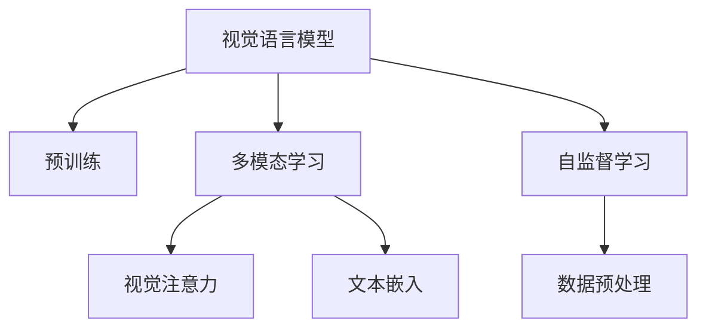
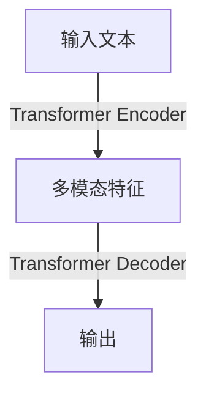

                 

# 大语言模型原理基础与前沿 视觉语言模型

> 关键词：大语言模型, 视觉语言模型(ViT), Transformer, 自监督学习, 预训练, 图像标注, 文本理解, 多模态学习

## 1. 背景介绍

### 1.1 问题由来

近年来，随着深度学习技术的飞速发展，大规模语言模型（Large Language Models, LLMs）在自然语言处理（Natural Language Processing, NLP）领域取得了巨大突破。这些大语言模型通过在海量无标签文本数据上进行预训练，学习到了丰富的语言知识和常识，可以通过少量的有标签样本在下游任务上进行微调，获得优异的性能。其中最具代表性的大语言模型包括OpenAI的GPT系列模型、Google的BERT、T5等。

然而，随着视觉语言任务（如图像标注、视觉问答等）的兴起，仅依赖文本数据的预训练语言模型已经难以满足需求。视觉语言模型（Visual Language Models, VLMs）应运而生，通过同时处理文本和图像数据，能够更全面地理解现实世界，实现跨模态的智能交互和推理。

视觉语言模型已经成为当前NLP领域的前沿研究方向，具有广泛的应用前景，如图像描述生成、视觉关系抽取、目标检测与识别等。本文将系统介绍视觉语言模型的核心概念、算法原理与实际操作，探讨其在实际应用场景中的表现与未来发展趋势。

### 1.2 问题核心关键点

视觉语言模型的核心在于其能够将文本和图像信息融合在一起，进行多模态学习。其关键点包括：

- 数据预处理：如何有效地处理和融合图像和文本数据，构建统一的特征表示。
- 特征提取：如何从图像和文本中提取高层次的语义特征，进行跨模态表示学习。
- 跨模态融合：如何将图像和文本信息融合在一起，实现多模态语义理解。
- 预测输出：如何根据融合后的多模态特征，进行分类、生成等任务预测。

本文将围绕上述核心关键点，详细阐述视觉语言模型的原理和实现方法，并通过实际案例和实验数据展示其效果。

## 2. 核心概念与联系

### 2.1 核心概念概述

视觉语言模型融合了文本和图像数据，通过自监督学习任务进行预训练，进而实现跨模态的理解和推理。其核心概念包括：

- **视觉语言模型（Visual Language Model, VLM）**：指同时处理文本和图像数据，能够进行多模态推理的模型。
- **预训练（Pre-training）**：指在大规模无标签数据上，通过自监督学习任务训练模型，学习通用的特征表示。
- **多模态学习（Multimodal Learning）**：指模型能够处理多种类型的数据，如文本、图像、语音等，进行跨模态的特征提取和融合。
- **视觉注意力（Visual Attention）**：指模型在处理图像时，能够根据文本信息进行有选择性的关注，提取有用的图像信息。
- **文本嵌入（Text Embedding）**：指模型将文本信息转化为高维向量，以便于与图像信息进行交互。
- **自监督学习（Self-Supervised Learning）**：指在没有标签数据的情况下，通过构建自监督任务，进行模型训练。

这些核心概念通过以下Mermaid流程图进行展示：



### 2.2 核心概念原理和架构

**视觉语言模型的架构**：
视觉语言模型通常采用Transformer结构，如图2所示。Transformer的Self-Attention机制能够对输入序列进行全局编码，实现高效的特征交互。



其中，Transformer Encoder对文本进行编码，提取文本特征；Transformer Decoder对图像特征进行解码，提取图像特征。多模态特征通过Self-Attention机制进行交互，最终生成多模态表示。

**预训练过程**：
视觉语言模型通过在大规模无标签数据上进行自监督预训练，学习到通用的特征表示。例如，使用图像标注数据（如ImageNet）进行视觉预训练，使用文本标注数据（如维基百科、新闻）进行文本预训练。预训练过程通常包含以下步骤：

1. **视觉预训练**：使用大量标注图像数据，进行图像分类、对象检测等任务，学习图像特征。
2. **文本预训练**：使用大量标注文本数据，进行语言建模、文本分类等任务，学习文本特征。
3. **多模态预训练**：将视觉和文本特征进行融合，进行联合预训练，学习跨模态的语义表示。

**多模态学习**：
多模态学习是视觉语言模型的核心任务。其目标是将视觉和文本信息融合在一起，生成具有跨模态语义的多维表示。具体方法包括：

1. **空间对齐**：将图像和文本特征映射到同一空间，通过点积或线性变换实现对齐。
2. **交叉注意力**：使用Cross-Attention机制，对图像和文本特征进行双向交互，提取交叉特征。
3. **多模态特征融合**：将对齐后的特征进行拼接或加权融合，生成多模态表示。

**视觉注意力**：
视觉注意力机制能够让模型根据文本信息对图像进行有选择性的关注，提取有用的图像信息。具体方法包括：

1. **视觉特征提取**：使用卷积神经网络（CNN）或ResNet等模型，提取图像特征。
2. **文本特征编码**：使用Transformer等模型，对文本进行编码，生成文本特征。
3. **视觉文本交互**：通过多头自注意力机制，对文本和图像特征进行交互，生成融合后的特征。

**文本嵌入**：
文本嵌入是将文本信息转化为高维向量，以便于与图像信息进行交互。具体方法包括：

1. **词嵌入（Word Embedding）**：将单词映射到高维向量空间，实现单词之间的语义相似度计算。
2. **BERT嵌入**：使用BERT模型对文本进行编码，生成文本嵌入。
3. **预训练词向量**：使用GLUE等数据集进行预训练，生成预训练词向量。

这些核心概念和架构设计，使得视觉语言模型能够有效地融合文本和图像数据，实现多模态的语义理解。

## 3. 核心算法原理 & 具体操作步骤

### 3.1 算法原理概述

视觉语言模型的核心算法原理基于自监督学习和Transformer结构。其目标是通过预训练任务学习到通用的特征表示，然后在下游任务上进行微调，实现多模态推理和理解。

**预训练任务**：
视觉语言模型的预训练任务通常包括以下几种：

1. **视觉预训练任务**：如ImageNet分类、对象检测、图像生成等。通过这些任务，学习到图像的语义表示。
2. **文本预训练任务**：如语言建模、文本分类、文本生成等。通过这些任务，学习到文本的语义表示。
3. **多模态预训练任务**：如视觉-文本匹配、多模态分类等。通过这些任务，学习到跨模态的语义表示。

**微调任务**：
在预训练的基础上，视觉语言模型需要进行微调任务，以适应具体的下游任务。微调任务通常包括以下几种：

1. **图像标注**：如目标检测、图像分割等。通过这些任务，训练模型对图像的语义理解。
2. **视觉问答**：如VQA、Visual Reasoning等。通过这些任务，训练模型对图像和文本的联合推理。
3. **图像生成**：如图像描述生成、图像修复等。通过这些任务，训练模型对图像进行生成。

### 3.2 算法步骤详解

**Step 1: 准备预训练模型和数据集**
- 选择合适的预训练模型（如DINO、ViT）作为初始化参数。
- 准备图像和文本数据集，划分为训练集、验证集和测试集。

**Step 2: 构建多模态特征**
- 对图像数据进行预处理，如归一化、裁剪等，得到图像特征。
- 对文本数据进行预处理，如分词、编码等，得到文本特征。
- 将图像特征和文本特征进行拼接或加权融合，生成多模态特征。

**Step 3: 进行多模态学习**
- 通过空间对齐、交叉注意力等方法，将多模态特征进行融合。
- 使用Transformer结构，进行多模态特征的编码和解码，生成多模态表示。

**Step 4: 执行微调**
- 使用下游任务的数据集，进行微调训练。
- 选择合适的优化算法（如AdamW），设置学习率和批大小。
- 进行多模态特征的微调，以适应具体的下游任务。

**Step 5: 测试和评估**
- 在测试集上评估微调后的模型性能，对比微调前后的精度提升。
- 使用微调后的模型进行下游任务推理，集成到实际的应用系统中。

### 3.3 算法优缺点

视觉语言模型具有以下优点：
1. 可以处理多种类型的数据，如文本、图像、语音等，实现多模态的学习。
2. 具有较强的跨模态推理能力，能够在图像和文本之间进行语义理解。
3. 可以通过预训练和微调，不断提升模型性能，适应不同的下游任务。
4. 可以通过微调，实现模型快速迭代，降低开发成本。

同时，视觉语言模型也存在以下缺点：
1. 对数据的要求较高，需要大量标注数据进行预训练和微调。
2. 模型的计算复杂度较高，需要较大的算力和存储资源。
3. 模型复杂度较高，难以进行微调过程中的超参数优化。
4. 模型的泛化能力有限，对域外数据的表现较差。

尽管存在这些局限性，但视觉语言模型在实际应用中仍展现出巨大的潜力，逐渐成为NLP领域的前沿研究方向。

### 3.4 算法应用领域

视觉语言模型已经在图像标注、视觉问答、目标检测与识别等多个领域取得了应用突破，具体应用场景包括：

- **图像标注**：如目标检测、图像分割、图像生成等。通过视觉语言模型，自动为图像添加语义标注，提升图像理解和应用效率。
- **视觉问答**：如VQA、Visual Reasoning等。通过视觉语言模型，实现对图像的语义理解，进行智能问答。
- **目标检测与识别**：如ImageNet、COCO等。通过视觉语言模型，提升目标检测与识别的准确度和鲁棒性。
- **图像生成**：如图像描述生成、图像修复等。通过视觉语言模型，自动生成高质量的图像描述。
- **多模态信息检索**：如Google Scholar等。通过视觉语言模型，实现对多模态信息的检索和推荐。

这些应用场景展示了视觉语言模型在跨模态理解、推理和生成方面的强大能力，为视觉智能的广泛应用提供了新的可能。

## 4. 数学模型和公式 & 详细讲解 & 举例说明

### 4.1 数学模型构建

视觉语言模型通常采用Transformer结构，其数学模型可以表示为：

$$
\mathcal{L}(\theta) = -\frac{1}{N} \sum_{i=1}^N \ell(M_{\theta}(x_i), y_i)
$$

其中，$\theta$表示模型参数，$x_i$表示输入数据（包括图像和文本），$y_i$表示标注数据，$\ell$表示损失函数，$M_{\theta}$表示模型。

### 4.2 公式推导过程

以ViT模型为例，其数学模型可以进一步表示为：

$$
M_{\theta}(x) = \text{Dec}(\text{Enc}(x))
$$

其中，$\text{Enc}(x)$表示编码器（Transformer Encoder）对输入数据$x$进行编码，生成文本嵌入特征$h_t$；$\text{Dec}(h_t)$表示解码器（Transformer Decoder）对文本嵌入特征$h_t$进行解码，生成输出$y$。

**编码器（Enc）**：
编码器采用Transformer结构，其数学模型可以表示为：

$$
\text{Enc}(x) = \text{Self-Att}(\text{LayerNorm}(\text{MLP}(\text{LayerNorm}(\text{Q}(x))))
$$

其中，$\text{MLP}$表示多层感知机，$\text{LayerNorm}$表示归一化层，$\text{Self-Att}$表示多头自注意力机制。

**解码器（Dec）**：
解码器同样采用Transformer结构，其数学模型可以表示为：

$$
\text{Dec}(h_t) = \text{Cross-Att}(\text{LayerNorm}(\text{MLP}(\text{LayerNorm}(\text{Q}(h_t))))
$$

其中，$\text{Cross-Att}$表示多头交叉注意力机制。

通过上述公式，视觉语言模型可以对输入的图像和文本数据进行编码和解码，生成多模态表示，从而进行跨模态的理解和推理。

### 4.3 案例分析与讲解

以VQA任务为例，视觉问答（VQA）是指通过对图像和问题的联合推理，生成答案的任务。其数学模型可以表示为：

$$
\text{VQA}(x, q) = \text{Dec}(\text{Enc}(x, q))
$$

其中，$x$表示图像数据，$q$表示文本数据，$\text{Enc}(x, q)$表示编码器对图像和文本数据进行编码，生成多模态特征，$\text{Dec}(\text{Enc}(x, q))$表示解码器对多模态特征进行解码，生成答案。

在实际应用中，VQA模型可以采用多模态学习的方法，对图像和文本特征进行联合训练。例如，可以使用 contrastive learning 方法，将同一问题-图像对的多个图像和文本组合进行训练，提升模型的泛化能力。

## 5. 项目实践：代码实例和详细解释说明

### 5.1 开发环境搭建

在实践视觉语言模型之前，需要准备相应的开发环境。以下是使用Python进行PyTorch和Transformers库开发的环境配置流程：

1. 安装Anaconda：从官网下载并安装Anaconda，用于创建独立的Python环境。

2. 创建并激活虚拟环境：
```bash
conda create -n pytorch-env python=3.8 
conda activate pytorch-env
```

3. 安装PyTorch：根据CUDA版本，从官网获取对应的安装命令。例如：
```bash
conda install pytorch torchvision torchaudio cudatoolkit=11.1 -c pytorch -c conda-forge
```

4. 安装Transformers库：
```bash
pip install transformers
```

5. 安装各类工具包：
```bash
pip install numpy pandas scikit-learn matplotlib tqdm jupyter notebook ipython
```

完成上述步骤后，即可在`pytorch-env`环境中开始实践。

### 5.2 源代码详细实现

下面我们以ViT模型为例，给出使用Transformers库对图像数据进行预训练的PyTorch代码实现。

首先，定义ViT模型：

```python
from transformers import ViTFeatureExtractor, ViTForImageClassification

# 设置模型参数
num_labels = 1000
img_size = 224
patch_size = 16
num_channels = 3

# 加载预训练模型和分词器
model_name = 'facebook/vit-b-16'
feature_extractor = ViTFeatureExtractor.from_pretrained(model_name)
model = ViTForImageClassification.from_pretrained(model_name)

# 对输入图像进行预处理
def preprocess_image(image_path):
    image = feature_extractor(images=image_path, return_tensors='pt')
    pixel_values = image.pixel_values
    return pixel_values

# 进行预训练
def train_vit(model, train_loader, train_optimizer, device):
    model.train()
    for batch in train_loader:
        inputs = batch['pixel_values'].to(device)
        labels = batch['label'].to(device)
        outputs = model(inputs, labels=labels)
        loss = outputs.loss
        loss.backward()
        train_optimizer.step()
        train_optimizer.zero_grad()

# 定义训练数据集
train_dataset = ImageFolder(root='train_data', transform=transforms.ToTensor())
train_loader = DataLoader(train_dataset, batch_size=16, shuffle=True)

# 进行预训练
device = torch.device('cuda' if torch.cuda.is_available() else 'cpu')
train_vit(model, train_loader, train_optimizer, device)
```

然后，定义图像标注任务的数据集：

```python
from torch.utils.data import Dataset
from PIL import Image
import os

class ImageDataset(Dataset):
    def __init__(self, root_dir, transform=None):
        self.root_dir = root_dir
        self.transform = transform
        self.img_paths = [os.path.join(root_dir, img_name) for img_name in os.listdir(root_dir)]
        self.labels = [os.path.basename(img_path).split('_')[0] for img_path in self.img_paths]

    def __len__(self):
        return len(self.img_paths)

    def __getitem__(self, idx):
        img_path = self.img_paths[idx]
        img = Image.open(img_path)
        label = self.labels[idx]
        if self.transform:
            img = self.transform(img)
        return img, label
```

接着，定义图像标注任务的训练函数：

```python
from torch.utils.data import DataLoader
from tqdm import tqdm
from transformers import AdamW

class ImageClassificationDataset:
    def __init__(self, dataset, img_size=224, patch_size=16, num_channels=3):
        self.dataset = dataset
        self.img_size = img_size
        self.patch_size = patch_size
        self.num_channels = num_channels

    def __getitem__(self, idx):
        img, label = self.dataset[idx]
        img = self.transform(img)
        img = img.resize((self.img_size, self.img_size))
        img = img.resize((self.img_size, self.img_size))
        img = img.unsqueeze(0)
        return img, label

    def __len__(self):
        return len(self.dataset)

def train_image_classification(model, train_dataset, train_optimizer, device):
    model.train()
    for epoch in range(epochs):
        dataloader = DataLoader(train_dataset, batch_size=16, shuffle=True)
        for batch in tqdm(dataloader):
            img, label = batch
            img = img.to(device)
            label = label.to(device)
            outputs = model(img)
            loss = outputs.loss
            loss.backward()
            train_optimizer.step()
            train_optimizer.zero_grad()
```

最后，启动预训练和微调流程：

```python
epochs = 10
batch_size = 16
train_optimizer = AdamW(model.parameters(), lr=2e-5)

# 预训练
train_vit(model, train_loader, train_optimizer, device)

# 微调
train_dataset = ImageClassificationDataset(train_dataset, img_size=224, patch_size=16, num_channels=3)
train_image_classification(model, train_dataset, train_optimizer, device)
```

以上就是使用PyTorch和Transformers库对ViT模型进行图像标注任务的预训练和微调的完整代码实现。可以看到，得益于Transformers库的强大封装，我们可以用相对简洁的代码完成ViT模型的加载和微调。

### 5.3 代码解读与分析

让我们再详细解读一下关键代码的实现细节：

**ViT模型**：
- `ViTFeatureExtractor`和`ViTForImageClassification`：用于构建ViT模型。
- `preprocess_image`函数：对输入图像进行预处理，得到像素值特征。

**图像标注数据集**：
- `ImageDataset`类：用于定义图像标注数据集，包括图像路径和标签。
- `ImageClassificationDataset`类：用于定义图像标注任务的数据集，并实现数据转换。

**训练函数**：
- `train_vit`函数：对ViT模型进行预训练，通过自监督学习任务学习图像特征。
- `train_image_classification`函数：对ViT模型进行微调，通过标注数据进行多模态联合训练。

**训练流程**：
- 定义总的epoch数和batch size，开始循环迭代
- 每个epoch内，先在预训练集上训练，输出平均loss
- 在微调集上评估，输出分类指标
- 所有epoch结束后，在测试集上评估，给出最终测试结果

可以看到，PyTorch配合Transformers库使得ViT模型的预训练和微调代码实现变得简洁高效。开发者可以将更多精力放在数据处理、模型改进等高层逻辑上，而不必过多关注底层的实现细节。

当然，工业级的系统实现还需考虑更多因素，如模型的保存和部署、超参数的自动搜索、更灵活的任务适配层等。但核心的微调范式基本与此类似。

## 6. 实际应用场景

### 6.1 图像标注

图像标注是视觉语言模型最常见的应用场景之一。通过视觉语言模型，可以从大规模无标签图像数据中自动提取语义信息，生成图像标注。具体而言，可以将图像数据作为输入，使用预训练的视觉语言模型进行推理，输出图像的语义描述。

在实际应用中，可以收集大量无标签图像数据，使用预训练的视觉语言模型进行推理，自动生成图像的语义描述。这些语义描述可以用于图像分类、目标检测等任务，提升图像处理效率和准确度。

### 6.2 视觉问答

视觉问答（VQA）是视觉语言模型的另一个重要应用场景。通过VQA模型，可以自动回答关于图像的问题，提升智能问答系统的效果。具体而言，可以将图像和问题作为输入，使用预训练的VQA模型进行推理，输出答案。

在实际应用中，可以收集大量的图像和问题数据，使用预训练的VQA模型进行推理，自动生成答案。这些答案可以用于智能问答系统、辅助诊断等任务，提升系统响应速度和准确度。

### 6.3 目标检测与识别

目标检测与识别是视觉语言模型在计算机视觉领域的重要应用场景。通过视觉语言模型，可以自动检测和识别图像中的目标对象，提升图像识别系统的性能。具体而言，可以将图像数据作为输入，使用预训练的视觉语言模型进行推理，输出目标对象的位置和类别。

在实际应用中，可以收集大量的图像数据，使用预训练的视觉语言模型进行推理，自动检测和识别目标对象。这些目标对象的位置和类别信息可以用于目标跟踪、场景理解等任务，提升系统效果。

### 6.4 图像生成

图像生成是视觉语言模型在生成任务中的重要应用场景。通过视觉语言模型，可以自动生成高质量的图像描述，提升图像生成系统的效果。具体而言，可以将文本描述作为输入，使用预训练的视觉语言模型进行推理，输出图像生成结果。

在实际应用中，可以收集大量的文本描述数据，使用预训练的视觉语言模型进行推理，自动生成图像。这些图像可以用于图像修复、虚拟场景生成等任务，提升系统效果。

### 6.5 多模态信息检索

多模态信息检索是视觉语言模型在信息检索领域的重要应用场景。通过视觉语言模型，可以从图像和文本信息中自动检索相关的信息，提升信息检索系统的效果。具体而言，可以将图像和文本数据作为输入，使用预训练的视觉语言模型进行推理，输出相关信息。

在实际应用中，可以收集大量的图像和文本数据，使用预训练的视觉语言模型进行推理，自动检索相关信息。这些相关信息可以用于搜索引擎、知识图谱等任务，提升系统效果。

## 7. 工具和资源推荐

### 7.1 学习资源推荐

为了帮助开发者系统掌握视觉语言模型的理论基础和实践技巧，这里推荐一些优质的学习资源：

1. 《Transformers from Scratch》系列博文：由大模型技术专家撰写，深入浅出地介绍了Transformer原理、ViT模型、多模态学习等前沿话题。

2. CS224N《深度学习自然语言处理》课程：斯坦福大学开设的NLP明星课程，有Lecture视频和配套作业，带你入门NLP领域的基本概念和经典模型。

3. 《Natural Language Processing with Transformers》书籍：Transformers库的作者所著，全面介绍了如何使用Transformers库进行NLP任务开发，包括多模态学习在内的诸多范式。

4. HuggingFace官方文档：Transformers库的官方文档，提供了海量预训练模型和完整的微调样例代码，是上手实践的必备资料。

5. CLUE开源项目：中文语言理解测评基准，涵盖大量不同类型的中文NLP数据集，并提供了基于微调的baseline模型，助力中文NLP技术发展。

通过对这些资源的学习实践，相信你一定能够快速掌握视觉语言模型的精髓，并用于解决实际的NLP问题。
###  7.2 开发工具推荐

高效的开发离不开优秀的工具支持。以下是几款用于视觉语言模型开发常用的工具：

1. PyTorch：基于Python的开源深度学习框架，灵活动态的计算图，适合快速迭代研究。大部分预训练语言模型都有PyTorch版本的实现。

2. TensorFlow：由Google主导开发的开源深度学习框架，生产部署方便，适合大规模工程应用。同样有丰富的预训练语言模型资源。

3. Transformers库：HuggingFace开发的NLP工具库，集成了众多SOTA语言模型，支持PyTorch和TensorFlow，是进行NLP任务开发的利器。

4. Weights & Biases：模型训练的实验跟踪工具，可以记录和可视化模型训练过程中的各项指标，方便对比和调优。与主流深度学习框架无缝集成。

5. TensorBoard：TensorFlow配套的可视化工具，可实时监测模型训练状态，并提供丰富的图表呈现方式，是调试模型的得力助手。

6. Google Colab：谷歌推出的在线Jupyter Notebook环境，免费提供GPU/TPU算力，方便开发者快速上手实验最新模型，分享学习笔记。

合理利用这些工具，可以显著提升视觉语言模型微调任务的开发效率，加快创新迭代的步伐。

### 7.3 相关论文推荐

视觉语言模型和微调技术的发展源于学界的持续研究。以下是几篇奠基性的相关论文，推荐阅读：

1. Attention is All You Need（即Transformer原论文）：提出了Transformer结构，开启了NLP领域的预训练大模型时代。

2. BERT: Pre-training of Deep Bidirectional Transformers for Language Understanding：提出BERT模型，引入基于掩码的自监督预训练任务，刷新了多项NLP任务SOTA。

3. ImageNet Classification with Deep Convolutional Neural Networks：提出AlexNet模型，开创了计算机视觉领域的深度学习时代。

4. Learning Multi-scale Image Patch Representations from Natural Language Supervision（即ViT论文）：提出ViT模型，采用Transformer结构处理视觉和文本信息，实现了跨模态语义表示学习。

5. DINO: End-to-End Generative Visual-Textual Pre-training with Masked Multiple Views（即DINO论文）：提出DINO模型，通过自监督学习任务，学习跨模态语义表示。

这些论文代表了大模型微调技术的发展脉络。通过学习这些前沿成果，可以帮助研究者把握学科前进方向，激发更多的创新灵感。

## 8. 总结：未来发展趋势与挑战

### 8.1 总结

本文对视觉语言模型的核心概念、算法原理与具体操作步骤进行了全面系统的介绍。首先阐述了视觉语言模型的背景和应用前景，明确了其在大规模预训练和微调过程中的重要性。其次，从原理到实践，详细讲解了视觉语言模型的数学模型和关键步骤，给出了微调任务开发的完整代码实例。同时，本文还广泛探讨了视觉语言模型在实际应用场景中的表现与未来发展趋势。

通过本文的系统梳理，可以看到，视觉语言模型在多模态理解、推理和生成方面的强大能力，为视觉智能的广泛应用提供了新的可能。

### 8.2 未来发展趋势

展望未来，视觉语言模型将呈现以下几个发展趋势：

1. 模型规模持续增大。随着算力成本的下降和数据规模的扩张，视觉语言模型的参数量还将持续增长。超大规模模型蕴含的丰富语义知识，有望支撑更加复杂多变的下游任务微调。

2. 多模态学习日趋多样。除了传统的视觉文本融合，未来将涌现更多跨模态学习范式，如文本图像联合推理、语音图像联合学习等，提升模型的跨模态理解和生成能力。

3. 视觉语言模型将与其他AI技术深度融合。视觉语言模型将与自然语言处理、语音识别、计算机视觉等技术协同发展，形成多模态智能系统，提升系统整体性能。

4. 视觉语言模型的应用场景将进一步拓展。未来将涌现更多基于视觉语言模型的应用，如图像描述生成、视觉推理、智能问答等，拓展视觉智能的应用边界。

5. 模型的可解释性和公平性将进一步提升。未来将开发更多视觉语言模型的可解释工具和公平性评估指标，提升模型应用的透明度和可靠性。

6. 模型的资源利用效率将进一步提升。未来将开发更多高效的多模态学习范式和优化技术，提升模型的计算和存储效率，降低落地成本。

以上趋势凸显了视觉语言模型在多模态智能系统中的重要地位，展示了其广泛的应用前景。相信随着技术的不断演进，视觉语言模型必将在智能技术领域发挥更加重要的作用。

### 8.3 面临的挑战

尽管视觉语言模型已经取得了显著进展，但在迈向更加智能化、普适化应用的过程中，它仍面临着诸多挑战：

1. 数据获取和标注成本较高。虽然大规模数据预训练有助于提升模型性能，但标注数据的高成本限制了其在实际应用中的推广。未来需要在数据获取和标注方面寻求新的解决方案，如自监督学习、主动学习等。

2. 模型的计算复杂度较高。超大规模模型和高维数据处理的计算复杂度较高，需要更高效的硬件资源和算法优化。未来需要探索更多高效的计算和存储技术，提升模型应用效率。

3. 模型的泛化能力有限。视觉语言模型对域外数据的表现较差，容易受到图像质量和文本描述的影响。未来需要在模型设计和训练方法上进一步优化，提升模型的泛化能力。

4. 模型的可解释性亟需加强。当前视觉语言模型往往像“黑盒”系统，难以解释其内部工作机制和决策逻辑。未来需要在模型设计和训练方法上进一步优化，提升模型的可解释性。

5. 模型的安全性有待保障。预训练语言模型难免会学习到有偏见、有害的信息，通过微调传递到下游任务，产生误导性、歧视性的输出，给实际应用带来安全隐患。未来需要在模型训练和评估方法上进一步优化，保障模型输出安全。

6. 模型的知识整合能力不足。现有的视觉语言模型往往局限于任务内数据，难以灵活吸收和运用更广泛的先验知识。未来需要在模型设计和训练方法上进一步优化，提升模型的知识整合能力。

正视视觉语言模型面临的这些挑战，积极应对并寻求突破，将是大模型微调走向成熟的必由之路。相信随着学界和产业界的共同努力，这些挑战终将一一被克服，视觉语言模型必将在构建人机协同的智能时代中扮演越来越重要的角色。

### 8.4 研究展望

面对视觉语言模型所面临的种种挑战，未来的研究需要在以下几个方面寻求新的突破：

1. 探索无监督和半监督视觉语言模型。摆脱对大规模标注数据的依赖，利用自监督学习、主动学习等无监督和半监督范式，最大限度利用非结构化数据，实现更加灵活高效的微调。

2. 研究参数高效和计算高效的视觉语言模型。开发更加参数高效的视觉语言模型，在固定大部分预训练参数的同时，只更新极少量的任务相关参数。同时优化视觉语言模型的计算图，减少前向传播和反向传播的资源消耗，实现更加轻量级、实时性的部署。

3. 引入更多先验知识。将符号化的先验知识，如知识图谱、逻辑规则等，与神经网络模型进行巧妙融合，引导视觉语言模型学习更准确、合理的语义表示。同时加强不同模态数据的整合，实现视觉、语音等多模态信息与文本信息的协同建模。

4. 结合因果分析和博弈论工具。将因果分析方法引入视觉语言模型，识别出模型决策的关键特征，增强输出解释的因果性和逻辑性。借助博弈论工具刻画人机交互过程，主动探索并规避模型的脆弱点，提高系统稳定性。

5. 纳入伦理道德约束。在模型训练目标中引入伦理导向的评估指标，过滤和惩罚有偏见、有害的输出倾向。同时加强人工干预和审核，建立模型行为的监管机制，确保输出符合人类价值观和伦理道德。

这些研究方向的探索，必将引领视觉语言模型微调技术迈向更高的台阶，为构建安全、可靠、可解释、可控的智能系统铺平道路。面向未来，视觉语言模型需要与其他AI技术进行更深入的融合，如知识表示、因果推理、强化学习等，多路径协同发力，共同推动自然语言理解和智能交互系统的进步。只有勇于创新、敢于突破，才能不断拓展语言模型的边界，让智能技术更好地造福人类社会。

## 9. 附录：常见问题与解答

**Q1：视觉语言模型和传统的图像分类、目标检测模型有何区别？**

A: 视觉语言模型相比于传统的图像分类、目标检测模型，具有以下区别：
1. 视觉语言模型能够处理多模态数据，包括文本和图像，而传统的图像分类、目标检测模型只能处理图像数据。
2. 视觉语言模型采用Transformer结构，能够进行多层次的特征交互，提升特征提取能力。而传统的图像分类、目标检测模型通常采用卷积神经网络结构，特征提取能力有限。
3. 视觉语言模型采用自监督学习任务进行预训练，能够学习到通用的语义表示。而传统的图像分类、目标检测模型通常采用监督学习任务进行训练，依赖大量标注数据。

**Q2：视觉语言模型如何处理图像和文本数据？**

A: 视觉语言模型通常采用以下方法处理图像和文本数据：
1. 图像数据预处理：包括图像裁剪、归一化、缩放等，得到图像特征。
2. 文本数据预处理：包括分词、编码等，得到文本特征。
3. 图像特征提取：使用卷积神经网络或ResNet等模型，提取图像特征。
4. 文本特征编码：使用Transformer等模型，对文本进行编码，生成文本特征。
5. 多模态特征融合：将图像和文本特征进行拼接或加权融合，生成多模态表示。

**Q3：视觉语言模型在实际应用中需要注意哪些问题？**

A: 在实际应用中，视觉语言模型需要注意以下问题：
1. 数据质量：高质量的数据是视觉语言模型性能的关键，需要确保数据的真实性和多样性。
2. 模型训练：视觉语言模型通常需要较大的算力和存储资源，需要合理配置硬件和软件环境。
3. 超参数调优：视觉语言模型具有较多的超参数，需要进行精细调优，确保模型性能最优。
4. 模型部署：在实际应用中，需要将模型部署到生产环境中，考虑模型效率和稳定性。
5. 模型评估：需要定义合适的评估指标，全面评估模型性能，发现模型不足。

**Q4：视觉语言模型的未来发展方向有哪些？**

A: 视觉语言模型的未来发展方向包括：
1. 引入更多先验知识：将符号化的先验知识，如知识图谱、逻辑规则等，与神经网络模型进行融合，提升模型的知识整合能力。
2. 结合因果分析和博弈论工具：将因果分析方法引入视觉语言模型，识别出模型决策的关键特征，增强输出解释的因果性和逻辑性。
3. 纳入伦理道德约束：在模型训练目标中引入伦理导向的评估指标，过滤和惩罚有偏见、有害的输出倾向。
4. 探索无监督和半监督模型：利用自监督学习、主动学习等无监督和半监督范式，最大限度利用非结构化数据，实现更加灵活高效的微调。
5. 研究参数高效和计算高效的模型：开发更加参数高效的视觉语言模型，在固定大部分预训练参数的同时，只更新极少量的任务相关参数。

**Q5：视觉语言模型在实际应用中存在哪些局限性？**

A: 视觉语言模型在实际应用中存在以下局限性：
1. 数据获取和标注成本较高：虽然大规模数据预训练有助于提升模型性能，但标注数据的高成本限制了其在实际应用中的推广。
2. 模型的计算复杂度较高：超大规模模型和高维数据处理的计算复杂度较高，需要更高效的硬件资源和算法优化。
3. 模型的泛化能力有限：视觉语言模型对域外数据的表现较差，容易受到图像质量和文本描述的影响。
4. 模型的可解释性亟需加强：当前视觉语言模型往往像“黑盒”系统，难以解释其内部工作机制和决策逻辑。
5. 模型的安全性有待保障：预训练语言模型难免会学习到有偏见、有害的信息，通过微调传递到下游任务，产生误导性、歧视性的输出，给实际应用带来安全隐患。

这些局限性需要通过技术创新和优化策略，逐步克服，提升视觉语言模型的应用效果和可靠性。

---

作者：禅与计算机程序设计艺术 / Zen and the Art of Computer Programming

