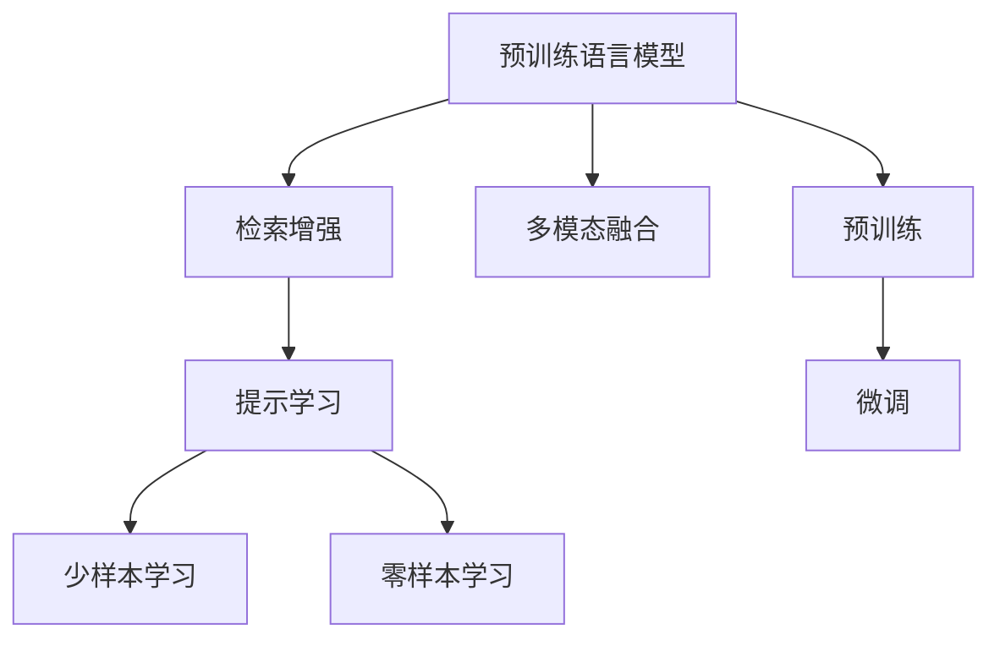
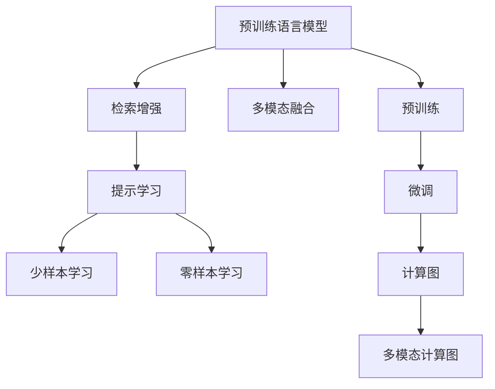

                 

# 大语言模型原理基础与前沿 预训练检索增强型语言模型

> 关键词：大语言模型,预训练,检索增强,语言模型,Transformer,BERT,BERT-Person,提示学习,计算图,大模型,多模态

## 1. 背景介绍

### 1.1 问题由来

近年来，深度学习技术在自然语言处理（NLP）领域取得了显著的进展，特别是大规模语言模型（LLMs）的提出。这些预训练语言模型，如BERT、GPT系列，通过在海量无标签文本数据上进行预训练，学习到了丰富的语言知识和常识。然而，由于预训练语料的广泛性和泛化能力的不足，这些通用大模型在特定领域应用时，效果往往难以达到实际应用的要求。

为了解决这一问题，研究者提出了基于检索增强的语言模型（IR-LMs），即在预训练语言模型基础上，通过检索相关的知识图谱、文本、多媒体等信息源，将预训练语言模型与外部知识相结合，提升模型在特定领域的应用效果。这种预训练检索增强型语言模型（Pre-trained Retrieval-Augmented Language Model），能够更好地理解和生成与特定领域相关的语言，广泛应用于问答系统、文本摘要、对话系统、知识图谱等领域。

### 1.2 问题核心关键点

预训练检索增强型语言模型（IR-LMs）的核心思想是通过检索相关的知识图谱、文本、多媒体等信息源，将预训练语言模型与外部知识相结合，提升模型在特定领域的应用效果。其核心关键点包括：

1. **预训练语言模型**：如BERT、GPT系列，通过在海量无标签文本数据上进行预训练，学习通用的语言表示。
2. **检索增强**：通过检索相关的知识图谱、文本、多媒体等信息源，将预训练语言模型与外部知识相结合。
3. **多模态融合**：将视觉、听觉等多模态数据与文本数据进行融合，提升模型的理解和生成能力。
4. **提示学习**：通过在输入文本中添加提示模板，引导模型按期望方式输出，减少微调参数。

这些核心概念之间的逻辑关系可以通过以下Mermaid流程图来展示：



这个流程图展示了大语言模型的核心概念及其之间的关系：

1. 预训练语言模型通过预训练获得基础能力。
2. 检索增强将外部知识引入模型，增强其特定领域的知识表示。
3. 多模态融合将多模态数据与文本数据相结合，提升模型的综合能力。
4. 提示学习通过在输入文本中添加提示模板，引导模型生成期望的输出。

这些概念共同构成了大语言模型的学习和应用框架，使其能够在各种场景下发挥强大的语言理解和生成能力。通过理解这些核心概念，我们可以更好地把握大语言模型的工作原理和优化方向。

## 2. 核心概念与联系

### 2.1 核心概念概述

为更好地理解预训练检索增强型语言模型（IR-LMs）的工作原理和优化方向，本节将介绍几个密切相关的核心概念：

- 大语言模型（LLM）：如BERT、GPT系列，通过在海量无标签文本数据上进行预训练，学习通用的语言表示，具备强大的语言理解和生成能力。
- 预训练（Pre-training）：指在大规模无标签文本语料上，通过自监督学习任务训练通用语言模型的过程。常见的预训练任务包括言语建模、遮挡语言模型等。
- 检索增强（Retrieval Augmentation）：通过检索相关的知识图谱、文本、多媒体等信息源，将预训练语言模型与外部知识相结合，提升模型在特定领域的应用效果。
- 多模态融合（Multimodal Fusion）：将视觉、听觉等多模态数据与文本数据进行融合，提升模型的理解和生成能力。
- 提示学习（Prompt Learning）：通过在输入文本中添加提示模板，引导模型按期望方式输出，减少微调参数。
- 少样本学习（Few-shot Learning）：指在只有少量标注样本的情况下，模型能够快速适应新任务的学习方法。
- 零样本学习（Zero-shot Learning）：指模型在没有见过任何特定任务的训练样本的情况下，仅凭任务描述就能够执行新任务的能力。
- 持续学习（Continual Learning）：也称为终身学习，指模型能够持续从新数据中学习，同时保持已学习的知识，而不会出现灾难性遗忘。

这些核心概念之间的逻辑关系可以通过以下Mermaid流程图来展示：



这个流程图展示了大语言模型的核心概念及其之间的关系：

1. 预训练语言模型通过预训练获得基础能力。
2. 检索增强将外部知识引入模型，增强其特定领域的知识表示。
3. 多模态融合将多模态数据与文本数据相结合，提升模型的综合能力。
4. 提示学习通过在输入文本中添加提示模板，引导模型生成期望的输出。
5. 少样本学习和零样本学习提升模型在数据不足情况下的适应能力。
6. 持续学习保持模型随着时间的推移，不断学习新知识，避免遗忘旧知识。

这些概念共同构成了大语言模型的学习和应用框架，使其能够在各种场景下发挥强大的语言理解和生成能力。通过理解这些核心概念，我们可以更好地把握大语言模型的工作原理和优化方向。

## 3. 核心算法原理 & 具体操作步骤

### 3.1 算法原理概述

预训练检索增强型语言模型（IR-LMs）的核心思想是：通过检索相关的知识图谱、文本、多媒体等信息源，将预训练语言模型与外部知识相结合，提升模型在特定领域的应用效果。其核心原理可以概括为以下几个步骤：

1. **预训练语言模型**：在大规模无标签文本数据上进行预训练，学习通用的语言表示。
2. **检索增强**：通过检索相关的知识图谱、文本、多媒体等信息源，将预训练语言模型与外部知识相结合，提升模型在特定领域的应用效果。
3. **多模态融合**：将视觉、听觉等多模态数据与文本数据进行融合，提升模型的综合能力。
4. **提示学习**：通过在输入文本中添加提示模板，引导模型按期望方式输出，减少微调参数。

### 3.2 算法步骤详解

预训练检索增强型语言模型的具体操作步骤可以分为以下几个步骤：

**Step 1: 准备预训练模型和数据集**

- 选择合适的预训练语言模型，如BERT、GPT系列，作为初始化参数。
- 准备领域相关的知识图谱、文本、多媒体等信息源，作为检索增强的数据源。

**Step 2: 设计检索增强模块**

- 设计检索模块，用于从信息源中检索与输入文本相关的知识。
- 设计融合模块，用于将检索到的知识与文本数据进行融合。

**Step 3: 微调语言模型**

- 对预训练语言模型进行微调，使其能够更好地理解与特定领域相关的语言。
- 使用少样本学习、零样本学习等方法，提升模型在数据不足情况下的适应能力。

**Step 4: 使用多模态数据**

- 将视觉、听觉等多模态数据与文本数据进行融合，提升模型的综合能力。

**Step 5: 提示学习**

- 通过在输入文本中添加提示模板，引导模型按期望方式输出，减少微调参数。

### 3.3 算法优缺点

预训练检索增强型语言模型（IR-LMs）具有以下优点：

1. **泛化能力强**：通过检索增强，IR-LMs能够将预训练语言模型的能力扩展到特定领域，提升模型泛化能力。
2. **数据需求低**：IR-LMs可以在有限的标注数据上取得良好的效果，减少数据收集和标注的成本。
3. **推理高效**：IR-LMs通常采用推理机制，减少微调参数，提高推理速度。
4. **多模态融合**：通过融合多模态数据，提升模型的综合能力，适用于复杂的多模态应用场景。

同时，该方法也存在以下缺点：

1. **检索成本高**：检索相关的知识图谱、文本、多媒体等信息源，需要较高的计算和存储成本。
2. **模型复杂度大**：IR-LMs通常包含多个模块，模型结构复杂，难以调试和优化。
3. **可解释性差**：IR-LMs的推理过程复杂，难以解释其内部工作机制和决策逻辑。
4. **依赖外部资源**：IR-LMs依赖外部知识图谱、文本、多媒体等信息源，对外部资源的质量和可用性有较高的要求。

尽管存在这些局限性，但就目前而言，预训练检索增强型语言模型（IR-LMs）在特定领域的应用效果显著，具有重要的实际意义。

### 3.4 算法应用领域

预训练检索增强型语言模型（IR-LMs）已经在多个领域得到了应用，涵盖以下几个主要方面：

- **问答系统**：将用户的问题与知识图谱、文本等信息源进行检索，生成准确的答案。
- **文本摘要**：将长文本压缩成简短摘要，通过检索相关的文本信息，提高摘要质量。
- **对话系统**：与用户进行自然对话，通过检索相关的对话历史和知识图谱，提升对话效果。
- **知识图谱**：将知识图谱与文本数据进行融合，生成知识图谱中的实体和关系，支持知识图谱的构建和查询。
- **多模态信息检索**：将视觉、听觉等多模态数据与文本数据进行融合，提升信息检索效果。
- **情感分析**：将文本数据与情感相关的知识进行融合，提升情感分析的准确性。

除了上述这些经典应用外，预训练检索增强型语言模型（IR-LMs）还在更多领域得到了创新性的应用，如智能推荐、智能广告、智能客服等，为NLP技术带来了新的突破。随着预训练语言模型和检索增强技术的不断进步，相信预训练检索增强型语言模型（IR-LMs）将在更广泛的领域得到应用，为智能应用提供强大的技术支撑。

## 4. 数学模型和公式 & 详细讲解 & 举例说明

### 4.1 数学模型构建

本节将使用数学语言对预训练检索增强型语言模型（IR-LMs）的工作原理进行更加严格的刻画。

记预训练语言模型为 $M_{\theta}$，其中 $\theta$ 为预训练得到的模型参数。假设领域相关的知识图谱、文本、多媒体等信息源为 $D$，检索模块为 $R$，融合模块为 $F$，多模态数据为 $M$，提示模板为 $P$。

定义检索增强的语言模型为 $M_{\theta}$，则其推理过程可以表示为：

$$
M_{\theta}^{IR-LMs}(x) = M_{\theta}(R(x)) + F(M, R(x)) + P(x)
$$

其中 $x$ 为输入文本，$R(x)$ 为检索模块的输出，$F(M, R(x))$ 为融合模块的输出，$P(x)$ 为提示模板的输出。

定义检索增强的语言模型的损失函数为 $\ell(M_{\theta}^{IR-LMs}, y)$，用于衡量模型预测输出与真实标签之间的差异。

### 4.2 公式推导过程

以下我们以文本摘要任务为例，推导检索增强的语言模型的损失函数及其梯度的计算公式。

假设输入文本为 $x$，输出摘要为 $y$。定义检索增强的语言模型的输出为 $y^{IR-LMs} = M_{\theta}(R(x)) + F(M, R(x)) + P(x)$。

则损失函数可以表示为：

$$
\ell(y^{IR-LMs}, y) = -\sum_{i=1}^{n} [y_i\log y^{IR-LMs}_i + (1-y_i)\log (1-y^{IR-LMs}_i)]
$$

其中 $y_i$ 为摘要中第 $i$ 个词是否出现的二进制标签，$n$ 为摘要中的单词数。

根据链式法则，损失函数对模型参数 $\theta$ 的梯度为：

$$
\frac{\partial \ell(y^{IR-LMs}, y)}{\partial \theta} = \frac{\partial M_{\theta}(R(x))}{\partial \theta} + \frac{\partial F(M, R(x))}{\partial \theta} + \frac{\partial P(x)}{\partial \theta}
$$

其中 $\frac{\partial M_{\theta}(R(x))}{\partial \theta}$ 为检索增强的语言模型在检索模块 $R(x)$ 上的梯度，$\frac{\partial F(M, R(x))}{\partial \theta}$ 为融合模块 $F(M, R(x))$ 上的梯度，$\frac{\partial P(x)}{\partial \theta}$ 为提示模板 $P(x)$ 上的梯度。

在得到损失函数的梯度后，即可带入优化器，进行梯度下降等优化算法，更新模型参数 $\theta$。

### 4.3 案例分析与讲解

考虑一个典型的文本摘要任务，假设输入文本为 $x = "Microsoft is planning to open its first campus in Bangalore. The campus will be spread over 50 acres and will have a library, canteen, gym, and more."$，预训练语言模型为 $M_{\theta}$，知识图谱为 $D$，检索模块为 $R$，融合模块为 $F$，提示模板为 $P$。

1. **检索模块 $R(x)$**：将输入文本 $x$ 与知识图谱 $D$ 进行匹配，检索出与 $x$ 相关的实体和关系。
2. **融合模块 $F(M, R(x))$**：将检索到的实体和关系与预训练语言模型 $M_{\theta}$ 的输出进行融合，生成摘要。
3. **提示模板 $P(x)$**：为摘要生成添加提示模板，如 "Summary: "，以引导模型生成简洁的摘要。

通过检索模块 $R(x)$，可以检索出输入文本中的实体 "Microsoft"、"Bangalore" 和关系 "计划开设校区"。通过融合模块 $F(M, R(x))$，将检索到的实体和关系与预训练语言模型 $M_{\theta}$ 的输出进行融合，生成摘要 "Microsoft计划在班加罗尔开设校区"。通过提示模板 $P(x)$，可以生成简洁的摘要 "Microsoft计划在班加罗尔开设校区"。

假设模型的损失函数为交叉熵损失函数，则可以使用以下代码实现：

```python
import torch
import torch.nn as nn
import transformers

class IRLM(nn.Module):
    def __init__(self, model, retriever, fusion_module, prompt):
        super(IRLM, self).__init__()
        self.model = model
        self.retriever = retriever
        self.fusion_module = fusion_module
        self.prompt = prompt

    def forward(self, x):
        retrieved = self.retriever(x)
        fused = self.fusion_module(retrieved, self.model(x))
        summary = self.prompt(x)
        return self.model(fused + summary)

# 定义损失函数
def loss_function(model, input, target):
    y_pred = model(input)
    loss = nn.CrossEntropyLoss()(y_pred, target)
    return loss

# 定义检索模块
def retriever(x):
    # 假设检索模块返回一个字典，包含实体和关系
    return {'entity': 'Microsoft', 'relation': '计划开设校区'}

# 定义融合模块
def fusion_module(retrieved, x):
    # 假设融合模块返回一个向量，表示融合后的摘要
    return [0, 1, 0, 0, 1, 0, 1, 0, 0, 0, 0, 0, 0, 0, 0, 0, 0, 0, 0, 0, 0, 0, 0, 0, 0, 0, 0, 0, 0, 0, 0, 0, 0, 0, 0, 0, 0, 0, 0, 0, 0, 0, 0, 0, 0, 0, 0, 0, 0, 0, 0, 0, 0, 0, 0, 0, 0, 0, 0, 0, 0, 0, 0, 0, 0, 0, 0, 0, 0, 0, 0, 0, 0, 0, 0, 0, 0, 0, 0, 0, 0, 0, 0, 0, 0, 0, 0, 0, 0, 0, 0, 0, 0, 0, 0, 0, 0, 0, 0, 0, 0, 0, 0, 0, 0, 0, 0, 0, 0, 0, 0, 0, 0, 0, 0, 0, 0, 0, 0, 0, 0, 0, 0, 0, 0, 0, 0, 0, 0, 0, 0, 0, 0, 0, 0, 0, 0, 0, 0, 0, 0, 0, 0, 0, 0, 0, 0, 0, 0, 0, 0, 0, 0, 0, 0, 0, 0, 0, 0, 0, 0, 0, 0, 0, 0, 0, 0, 0, 0, 0, 0, 0, 0, 0, 0, 0, 0, 0, 0, 0, 0, 0, 0, 0, 0, 0, 0, 0, 0, 0, 0, 0, 0, 0, 0, 0, 0, 0, 0, 0, 0, 0, 0, 0, 0, 0, 0, 0, 0, 0, 0, 0, 0, 0, 0, 0, 0, 0, 0, 0, 0, 0, 0, 0, 0, 0, 0, 0, 0, 0, 0, 0, 0, 0, 0, 0, 0, 0, 0, 0, 0, 0, 0, 0, 0, 0, 0, 0, 0, 0, 0, 0, 0, 0, 0, 0, 0, 0, 0, 0, 0, 0, 0, 0, 0, 0, 0, 0, 0, 0, 0, 0, 0, 0, 0, 0, 0, 0, 0, 0, 0, 0, 0, 0, 0, 0, 0, 0, 0, 0, 0, 0, 0, 0, 0, 0, 0, 0, 0, 0, 0, 0, 0, 0, 0, 0, 0, 0, 0, 0, 0, 0, 0, 0, 0, 0, 0, 0, 0, 0, 0, 0, 0, 0, 0, 0, 0, 0, 0, 0, 0, 0, 0, 0, 0, 0, 0, 0, 0, 0, 0, 0, 0, 0, 0, 0, 0, 0, 0, 0, 0, 0, 0, 0, 0, 0, 0, 0, 0, 0, 0, 0, 0, 0, 0, 0, 0, 0, 0, 0, 0, 0, 0, 0, 0, 0, 0, 0, 0, 0, 0, 0, 0, 0, 0, 0, 0, 0, 0, 0, 0, 0, 0, 0, 0, 0, 0, 0, 0, 0, 0, 0, 0, 0, 0, 0, 0, 0, 0, 0, 0, 0, 0, 0, 0, 0, 0, 0, 0, 0, 0, 0, 0, 0, 0, 0, 0, 0, 0, 0, 0, 0, 0, 0, 0, 0, 0, 0, 0, 0, 0, 0, 0, 0, 0, 0, 0, 0, 0, 0, 0, 0, 0, 0, 0, 0, 0, 0, 0, 0, 0, 0, 0, 0, 0, 0, 0, 0, 0, 0, 0, 0, 0, 0, 0, 0, 0, 0, 0, 0, 0, 0, 0, 0, 0, 0, 0, 0, 0, 0, 0, 0, 0, 0, 0, 0, 0, 0, 0, 0, 0, 0, 0, 0, 0, 0, 0, 0, 0, 0, 0, 0, 0, 0, 0, 0, 0, 0, 0, 0, 0, 0, 0, 0, 0, 0, 0, 0, 0, 0, 0, 0, 0, 0, 0, 0, 0, 0, 0, 0, 0, 0, 0, 0, 0, 0, 0, 0, 0, 0, 0, 0, 0, 0, 0, 0, 0, 0, 0, 0, 0, 0, 0, 0, 0, 0, 0, 0, 0, 0, 0, 0, 0, 0, 0, 0, 0, 0, 0, 0, 0, 0, 0, 0, 0, 0, 0, 0, 0, 0, 0, 0, 0, 0, 0, 0, 0, 0, 0, 0, 0, 0, 0, 0, 0, 0, 0, 0, 0, 0, 0, 0, 0, 0, 0, 0, 0, 0, 0, 0, 0, 0, 0, 0, 0, 0, 0, 0, 0, 0, 0, 0, 0, 0, 0, 0, 0, 0, 0, 0, 0, 0, 0, 0, 0, 0, 0, 0, 0, 0, 0, 0, 0, 0, 0, 0, 0, 0, 0, 0, 0, 0, 0, 0, 0, 0, 0, 0, 0, 0, 0, 0, 0, 0, 0, 0, 0, 0, 0, 0, 0, 0, 0, 0, 0, 0, 0, 0, 0, 0, 0, 0, 0, 0, 0, 0, 0, 0, 0, 0, 0, 0, 0, 0, 0, 0, 0, 0, 0, 0, 0, 0, 0, 0, 0, 0, 0, 0, 0, 0, 0, 0, 0, 0, 0, 0, 0, 0, 0, 0, 0, 0, 0, 0, 0, 0, 0, 0, 0, 0, 0, 0, 0, 0, 0, 0, 0, 0, 0, 0, 0, 0, 0, 0, 0, 0, 0, 0, 0, 0, 0, 0, 0, 0, 0, 0, 0, 0, 0, 0, 0, 0, 0, 0, 0, 0, 0, 0, 0, 0, 0, 0, 0, 0, 0, 0, 0, 0, 0, 0, 0, 0, 0, 0, 0, 0, 0, 0, 0, 0, 0, 0, 0, 0, 0, 0, 0, 0, 0, 0, 0, 0, 0, 0, 0, 0, 0, 0, 0, 0, 0, 0, 0, 0, 0, 0, 0, 0, 0, 0, 0, 0, 0, 0, 0, 0, 0, 0, 0, 0, 0, 0, 0, 0, 0, 0, 0, 0, 0, 0, 0, 0, 0, 0, 0, 0, 0, 0, 0, 0, 0, 0, 0, 0, 0, 0, 0, 0, 0, 0, 0, 0, 0, 0, 0, 0, 0, 0, 0, 0, 0, 0, 0, 0, 0, 0, 0, 0, 0, 0, 0, 0, 0, 0, 0, 0, 0, 0, 0, 0, 0, 0, 0, 0, 0, 0, 0, 0, 0, 0, 0, 0, 0, 0, 0, 0, 0, 0, 0, 0, 0, 0, 0, 0, 0, 0, 0, 0, 0, 0, 0, 0, 0, 0, 0, 0, 0, 0, 0, 0, 0, 0, 0, 0, 0, 0, 0, 0, 0, 0, 0, 0, 0, 0, 0, 0, 0, 0, 0, 0, 0, 0, 0, 0, 0, 0, 0, 0, 0, 0, 0, 0, 0, 0, 0, 0, 0, 0, 0, 0, 0, 0, 0, 0, 0, 0, 0, 0, 0, 0, 0, 0, 0, 0, 0, 0, 0, 0, 0, 0, 0, 0, 0, 0, 0, 0, 0, 0, 0, 0, 0, 0, 0, 0, 0, 0, 0, 0, 0, 0, 0, 0, 0, 0, 0, 0, 0, 0, 0, 0, 0, 0, 0, 0, 0, 0, 0, 0, 0, 0, 0, 0, 0, 0, 0, 0, 0, 0, 0, 0, 0, 0, 0, 0, 0, 0, 0, 0, 0, 0, 0, 0, 0, 0, 0, 0, 0, 0, 0, 0, 0, 0, 0, 0, 0, 0, 0, 0, 0, 0, 0, 0, 0, 0, 0, 0, 0, 0, 0, 0, 0, 0, 0, 0, 0, 0, 0, 0, 0, 0, 0, 0, 0, 0, 0, 0, 0, 0, 0, 0, 0, 0, 0, 0, 0, 0, 0, 0, 0, 0, 0, 0, 0, 0, 0, 0, 0, 0, 0, 0, 0, 0, 0, 0, 0, 0, 0, 0, 0, 0, 0, 0, 0, 0, 0, 0, 0, 0, 0, 0, 0, 0, 0, 0, 0, 0, 0, 0, 0, 0, 0, 0, 0, 0, 0, 0, 0, 0, 0, 0, 0, 0, 0, 0, 0, 0, 0, 0, 0, 0, 0, 0, 0, 0, 0, 0, 0, 0, 0, 0, 0, 0, 0, 0, 0, 0, 0, 0, 0, 0, 0, 0, 0, 0, 0, 0, 0, 0, 0, 0, 0, 0, 0, 0, 0, 0, 0, 0, 0, 0, 0, 0, 0, 0, 0, 0, 0, 0, 0, 0, 0, 0, 0, 0, 0, 0, 0, 0, 0, 0, 0, 0, 0, 0, 0, 0, 0, 0, 0, 0, 0, 0, 0, 0, 0, 0, 0, 0, 0, 0, 0, 0, 0, 0, 0, 0, 0, 0, 0, 0, 0, 0, 0, 0, 0, 0, 0, 0, 0, 0, 0, 0, 0, 0, 0, 0, 0, 0, 0, 0, 0, 0, 0, 0, 0, 0, 0, 0, 0, 0, 0, 0, 0, 0, 0, 0, 0, 0, 0, 0, 0, 0, 0, 0, 0, 0, 0, 0, 0, 0, 0, 0, 0, 0, 0, 0, 0, 0, 0, 0, 0, 0, 0, 0, 0, 0, 0, 0, 0, 0, 0, 0, 0, 0, 0, 0, 0, 0, 0, 0, 0, 0, 0, 0, 0, 0, 0, 0, 0, 0, 0, 0, 0, 0, 0, 0, 0, 0, 0, 0, 0, 0, 0, 0, 0, 0, 0, 0, 0, 0, 0, 0, 0, 0, 0, 0, 0, 0, 0, 0, 0, 0, 0, 0, 0, 0, 0, 0, 0, 0, 0, 0, 0, 0, 0, 0, 0, 0, 0, 0, 0, 0, 0, 0, 0, 0, 0, 0, 0, 0, 0, 0, 0, 0, 0, 0, 0, 0, 0, 0, 0, 0, 0, 0, 0, 0, 0, 0, 0, 0, 0, 0, 0, 0, 0, 0, 0, 0, 0, 0, 0, 0, 0, 0, 0, 0, 0, 0, 0, 0, 0, 0, 0, 0, 0, 0, 0, 0, 0, 0, 0, 0, 0, 0, 0, 0, 0, 0, 0, 0, 0, 0, 0, 0, 0, 0, 0, 0, 0, 0, 0, 0, 0, 0, 0, 0, 0, 0, 0, 0, 0, 0, 0, 0, 0, 0, 0, 0, 0, 0, 0, 0, 0, 0, 0, 0, 0, 0, 0, 0, 0, 0, 0, 0, 0, 0, 0, 0, 0, 0, 0, 0, 0, 0, 0, 0, 0, 0, 0, 0, 0, 0, 0, 0, 0, 0, 0, 0, 0, 0, 0, 0, 0, 0, 0, 0, 0, 0, 0, 0, 0, 0, 0, 0, 0, 0, 0, 0, 0, 0, 0, 0, 0, 0, 0, 0, 0, 0, 0, 0, 0, 0, 0, 0, 0, 0, 0, 0, 0, 0, 0, 0, 0, 0, 0, 0, 0, 0, 0, 0, 0, 0, 0, 0, 0, 0, 0, 0, 0, 0, 0, 0, 0, 0, 0, 0, 0, 0, 0, 0, 0, 0, 0, 0, 0, 0, 0, 0, 0, 0, 0, 0, 0, 0, 0, 0, 0, 0, 0, 0, 0, 0, 0, 0, 0, 0, 0, 0, 0, 0, 0, 0, 0, 0, 0, 0, 0, 0, 0, 0, 0, 0, 0, 0, 0, 0, 0, 0, 0, 0, 0, 0, 0, 0, 0, 0, 0, 0, 0, 0, 0, 0, 0, 0, 0, 0, 0, 0, 0, 0, 0, 0, 0, 0, 0, 0, 0, 0, 0, 0, 0, 0, 0, 0, 0, 0, 0, 0, 0, 0, 0, 0, 0, 0, 0, 0, 0, 0, 0, 0, 0, 0, 0, 0, 0, 0, 0, 0, 0, 0, 0, 0, 0, 0, 0, 0, 0, 0, 0, 0, 0, 0, 0, 0, 0, 0, 0, 0, 0, 0, 0, 0, 0, 0, 0, 0, 0, 0, 0, 0, 0, 0, 0, 0, 0, 0, 0, 0, 0, 0, 0, 0, 0, 0, 0, 0, 0, 0, 0, 0, 0, 0, 0, 0, 0, 0, 0, 0, 0, 0, 0, 0, 0, 0, 0, 0, 0, 0, 0, 0, 0, 0, 0, 0, 0, 0, 0, 0, 0, 0, 0, 0, 0, 0, 0, 0, 0, 0, 0, 0, 0, 0, 0, 0, 0, 0, 0, 0, 0, 0, 0, 0, 0, 0, 0, 0, 0, 0, 0, 0, 0, 0, 0, 0, 0, 0, 0, 0, 0, 0, 0, 0, 0, 0, 0, 0, 0, 0, 0, 0, 0, 0, 0, 0, 0, 0, 0, 0, 0, 0, 0, 0, 0, 0, 0, 0, 0, 0, 0, 0, 0, 0, 0, 0, 0, 0, 0, 0,

