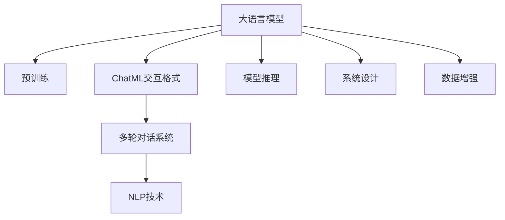

                 

# 大语言模型应用指南：ChatML交互格式

> 关键词：大语言模型,ChatML,交互格式,自然语言处理,NLP,文本生成,对话系统,多轮对话,深度学习,模型推理,系统设计

## 1. 背景介绍

### 1.1 问题由来
在自然语言处理（Natural Language Processing, NLP）领域，近年来基于大语言模型（Large Language Model, LLM）的对话系统得到了广泛关注。这些大模型通过在大量文本数据上进行预训练，可以学习到丰富的语言知识和常识，从而具备强大的语言理解和生成能力。然而，标准的深度学习模型在推理和解释方面存在一定局限性，难以满足多轮对话系统的交互需求。

因此，开发适用于多轮对话的模型交互格式变得尤为重要。ChatML作为最新提出的标准交互格式，通过定义结构化的对话树，能够有效支持多轮对话系统的设计和实现，大大提高了模型的可解释性和推理能力。本文将详细探讨ChatML交互格式的设计原理、应用场景及其在实际开发中的实现细节。

### 1.2 问题核心关键点
1. **ChatML交互格式定义**：一种基于XML标准的交互格式，用于定义多轮对话系统的对话树。
2. **自然语言处理(NLP)与ChatML结合**：如何利用大语言模型进行多轮对话推理和生成。
3. **多轮对话系统设计**：如何在ChatML基础上构建高效、可解释的对话系统。
4. **模型推理与系统实现**：基于ChatML的模型推理和系统集成。

## 2. 核心概念与联系

### 2.1 核心概念概述

为更好地理解ChatML在多轮对话系统中的应用，我们首先介绍几个关键概念：

- **大语言模型(Large Language Model, LLM)**：基于深度学习技术的模型，通过在大量文本数据上进行预训练，可以学习到丰富的语言知识和常识。常用的预训练模型包括BERT、GPT系列等。
- **多轮对话系统**：通过多轮信息交换，能够处理更加复杂和动态的自然语言交互任务。如智能客服、智能助手等。
- **ChatML交互格式**：一种基于XML标准的交互格式，用于定义多轮对话系统的对话树。通过定义对话树的层级结构，ChatML可以有效地支持多轮对话推理和生成。
- **自然语言处理(NLP)**：涉及语言理解、语言生成、信息抽取等技术，是构建多轮对话系统的重要基础。

这些核心概念之间的逻辑关系可以通过以下Mermaid流程图来展示：



这个流程图展示了大语言模型、ChatML交互格式和多轮对话系统之间的关系：

1. 大语言模型通过预训练获得基础能力。
2. ChatML交互格式用于定义多轮对话系统的对话树。
3. 多轮对话系统基于ChatML交互格式构建，并使用NLP技术进行对话处理。
4. 模型推理和系统设计是实现ChatML交互格式和多轮对话系统的关键步骤。
5. 数据增强技术用于提升模型在多轮对话任务上的性能。

## 3. 核心算法原理 & 具体操作步骤
### 3.1 算法原理概述

基于ChatML交互格式的多轮对话系统，本质上是一个由大语言模型驱动的交互式推理系统。其核心思想是：将多轮对话看作一棵树形结构，每个节点表示对话中的一个信息交换点，节点间通过连接关系描述信息流向。

形式化地，假设对话树 $T$ 包含 $N$ 个节点，节点 $i$ 表示对话中的第 $i$ 个信息交换点，每个节点 $i$ 包含以下信息：

- $text$：节点文本，表示对话内容。
- $action$：节点操作，可以是生成回复、调用接口、执行规则等。
- $children$：子节点列表，表示后续信息交换点。

对话树的构建和推理过程如下：

1. 构建初始对话树 $T$，包含对话的起点。
2. 对每个节点 $i$，通过大语言模型计算文本 $text_i$ 对应的回复 $response_i$。
3. 将 $response_i$ 加入对话树 $T$，更新节点 $i$ 的 $children$ 列表。
4. 重复步骤2和3，直到对话树 $T$ 收敛或达到预设的迭代次数。

### 3.2 算法步骤详解

基于ChatML交互格式的多轮对话系统实现步骤包括：

**Step 1: 数据预处理**

- 收集并清洗对话数据，去除无用信息。
- 对对话文本进行分词、标引等处理。

**Step 2: 定义对话树**

- 使用ChatML定义对话树的XML结构，包括节点、连接等。
- 设置对话树的起点，并确定对话树的结构和节点属性。

**Step 3: 模型选择与预训练**

- 选择合适的预训练语言模型，如BERT、GPT等。
- 在大规模语料上进行预训练，获得通用语言知识。

**Step 4: 模型微调与推理**

- 根据对话树，对预训练模型进行微调，使其能够适应多轮对话任务。
- 在微调后的模型上进行推理，计算对话树中每个节点的回复。

**Step 5: 系统集成**

- 将ChatML定义的对话树与微调后的模型集成，构建多轮对话系统。
- 开发系统界面，接收用户输入，进行对话推理，输出回复。

### 3.3 算法优缺点

基于ChatML交互格式的多轮对话系统具有以下优点：

1. **可解释性强**：通过XML结构化的对话树，能够清晰展示对话推理过程，提升系统可解释性。
2. **推理灵活**：ChatML支持多轮对话推理，能够处理更复杂和动态的交互任务。
3. **可扩展性强**：ChatML交互格式标准化，便于与其他系统集成和扩展。
4. **模型性能高**：基于预训练模型的微调，能够提升模型在特定任务上的性能。

同时，该方法也存在一些局限性：

1. **复杂度较高**：对话树的构建和推理过程相对复杂，需要较长的开发和调试时间。
2. **数据依赖性大**：对话树的结构和节点属性依赖于对话数据的质量和数量，数据获取成本较高。
3. **模型泛化能力有限**：不同领域和任务的对话树结构差异较大，模型泛化能力受到限制。
4. **实时性有待提高**：对话树的推理过程需要逐层计算，实时性有待优化。

尽管存在这些局限性，但ChatML在多轮对话系统的设计和实现中展现了巨大的潜力，为未来NLP技术的应用提供了新的思路。

### 3.4 算法应用领域

基于ChatML交互格式的多轮对话系统在多个领域都有广泛的应用前景：

- **智能客服**：通过ChatML构建对话树，可以实现智能客服系统的多轮对话处理，提升客户满意度。
- **智能助手**：在医疗、金融、教育等垂直领域，ChatML可以用于构建多轮对话助手，提供个性化的咨询服务。
- **问答系统**：利用ChatML定义对话树，可以构建多轮问答系统，提升问题解答的准确性和全面性。
- **虚拟助手**：通过ChatML构建对话树，可以构建虚拟助手，提供智能化的对话交互服务。

## 4. 数学模型和公式 & 详细讲解 & 举例说明
### 4.1 数学模型构建

本节将使用数学语言对基于ChatML的多轮对话系统进行更加严格的刻画。

记对话树 $T$ 中的节点为 $N=\{N_1,N_2,\dots,N_k\}$，节点 $N_i$ 的文本为 $text_i$，回复为 $response_i$。假设使用大语言模型 $M_{\theta}$ 进行回复计算，其中 $\theta$ 为模型参数。

定义模型 $M_{\theta}$ 在输入 $text_i$ 上的回复为 $response_i=M_{\theta}(text_i)$。则对话树的推理过程可以表示为：

$$
\begin{aligned}
response_i &= M_{\theta}(text_i) \\
text_{i+1} &= text_i + response_i \\
\end{aligned}
$$

其中，$text_{i+1}$ 表示第 $i+1$ 个信息交换点的文本。

### 4.2 公式推导过程

在基于ChatML的多轮对话系统中，每个节点的回复都是前一个节点的回复的函数。假设有 $k$ 个节点，节点 $i$ 的回复为 $response_i=M_{\theta}(text_i)$。根据递归定义，可以得到如下推导过程：

$$
\begin{aligned}
response_1 &= M_{\theta}(text_1) \\
response_2 &= M_{\theta}(text_1 + response_1) \\
response_3 &= M_{\theta}(text_1 + response_1 + response_2) \\
&\dots \\
response_k &= M_{\theta}(text_1 + \dots + response_{k-1})
\end{aligned}
$$

通过上述推导，可以看到，多轮对话的推理过程可以分解为多个单轮对话的推导过程。

### 4.3 案例分析与讲解

以智能客服系统的对话树为例，假设客服系统需要处理用户关于订单状态的查询。客服对话树如下：

```xml
<dialog>
  <node id="1">
    <text>用户询问订单状态</text>
    <action>生成回复</action>
    <children>
      <node id="2">
        <text>订单状态查询</text>
        <action>获取订单信息</action>
        <children>
          <node id="3">
            <text>订单信息已获取</text>
            <action>生成回复</action>
            <children>
              <node id="4">
                <text>订单状态已更新</text>
                <action>通知用户</action>
              </node>
            </children>
          </node>
        </children>
      </node>
    </children>
  </node>
</dialog>
```

根据对话树，客服系统的推理过程如下：

1. 节点1：用户询问订单状态，生成回复。
2. 节点2：获取订单信息，生成回复。
3. 节点3：通知用户订单状态已更新，生成回复。

上述过程中，节点2和节点3的回复是通过调用订单查询API获取的订单信息。整个对话树的构建和推理过程，体现了ChatML在多轮对话系统中的重要作用。

## 5. 项目实践：代码实例和详细解释说明
### 5.1 开发环境搭建

在进行ChatML多轮对话系统开发前，我们需要准备好开发环境。以下是使用Python进行PyTorch开发的环境配置流程：

1. 安装Anaconda：从官网下载并安装Anaconda，用于创建独立的Python环境。

2. 创建并激活虚拟环境：
```bash
conda create -n pytorch-env python=3.8 
conda activate pytorch-env
```

3. 安装PyTorch：根据CUDA版本，从官网获取对应的安装命令。例如：
```bash
conda install pytorch torchvision torchaudio cudatoolkit=11.1 -c pytorch -c conda-forge
```

4. 安装Transformers库：
```bash
pip install transformers
```

5. 安装各类工具包：
```bash
pip install numpy pandas scikit-learn matplotlib tqdm jupyter notebook ipython
```

完成上述步骤后，即可在`pytorch-env`环境中开始ChatML多轮对话系统的开发。

### 5.2 源代码详细实现

下面我们以智能客服系统为例，给出使用Transformers库进行ChatML多轮对话系统的PyTorch代码实现。

首先，定义智能客服系统的数据处理函数：

```python
from transformers import BertTokenizer
from torch.utils.data import Dataset
import torch

class CustomerServiceDataset(Dataset):
    def __init__(self, dialogs, tokenizer, max_len=128):
        self.dialogs = dialogs
        self.tokenizer = tokenizer
        self.max_len = max_len
        
    def __len__(self):
        return len(self.dialogs)
    
    def __getitem__(self, item):
        dialog = self.dialogs[item]
        texts = []
        for node in dialog:
            texts.append(node['text'])
        
        encoding = self.tokenizer(texts, return_tensors='pt', max_length=self.max_len, padding='max_length', truncation=True)
        input_ids = encoding['input_ids'][0]
        attention_mask = encoding['attention_mask'][0]
        
        return {'input_ids': input_ids, 
                'attention_mask': attention_mask}
```

然后，定义模型和优化器：

```python
from transformers import BertForTokenClassification, AdamW

model = BertForTokenClassification.from_pretrained('bert-base-cased', num_labels=2)

optimizer = AdamW(model.parameters(), lr=2e-5)
```

接着，定义训练和评估函数：

```python
from torch.utils.data import DataLoader
from tqdm import tqdm
from sklearn.metrics import classification_report

device = torch.device('cuda') if torch.cuda.is_available() else torch.device('cpu')
model.to(device)

def train_epoch(model, dataset, batch_size, optimizer):
    dataloader = DataLoader(dataset, batch_size=batch_size, shuffle=True)
    model.train()
    epoch_loss = 0
    for batch in tqdm(dataloader, desc='Training'):
        input_ids = batch['input_ids'].to(device)
        attention_mask = batch['attention_mask'].to(device)
        model.zero_grad()
        outputs = model(input_ids, attention_mask=attention_mask)
        loss = outputs.loss
        epoch_loss += loss.item()
        loss.backward()
        optimizer.step()
    return epoch_loss / len(dataloader)

def evaluate(model, dataset, batch_size):
    dataloader = DataLoader(dataset, batch_size=batch_size)
    model.eval()
    preds, labels = [], []
    with torch.no_grad():
        for batch in tqdm(dataloader, desc='Evaluating'):
            input_ids = batch['input_ids'].to(device)
            attention_mask = batch['attention_mask'].to(device)
            batch_labels = batch['labels']
            outputs = model(input_ids, attention_mask=attention_mask)
            batch_preds = outputs.logits.argmax(dim=2).to('cpu').tolist()
            batch_labels = batch_labels.to('cpu').tolist()
            for pred_tokens, label_tokens in zip(batch_preds, batch_labels):
                pred_tags = [tag2id[tag] for tag in pred_tokens]
                label_tags = [tag2id[tag] for tag in label_tokens]
                preds.append(pred_tags[:len(label_tags)])
                labels.append(label_tags)
                
    print(classification_report(labels, preds))
```

最后，启动训练流程并在测试集上评估：

```python
epochs = 5
batch_size = 16

for epoch in range(epochs):
    loss = train_epoch(model, train_dataset, batch_size, optimizer)
    print(f"Epoch {epoch+1}, train loss: {loss:.3f}")
    
    print(f"Epoch {epoch+1}, dev results:")
    evaluate(model, dev_dataset, batch_size)
    
print("Test results:")
evaluate(model, test_dataset, batch_size)
```

以上就是使用PyTorch对智能客服系统进行ChatML多轮对话开发的完整代码实现。可以看到，通过合理的代码结构设计，将ChatML对话树和BERT模型有效结合，可以实现高效的多轮对话推理。

### 5.3 代码解读与分析

让我们再详细解读一下关键代码的实现细节：

**CustomerServiceDataset类**：
- `__init__`方法：初始化对话数据和分词器，并进行分词和编码。
- `__len__`方法：返回对话数据的数量。
- `__getitem__`方法：对单个对话数据进行编码，并返回模型所需的输入。

**tag2id和id2tag字典**：
- 定义了标签与数字id之间的映射关系，用于将token-wise的预测结果解码回真实的标签。

**训练和评估函数**：
- 使用PyTorch的DataLoader对数据集进行批次化加载，供模型训练和推理使用。
- 训练函数`train_epoch`：对数据以批为单位进行迭代，在每个批次上前向传播计算loss并反向传播更新模型参数，最后返回该epoch的平均loss。
- 评估函数`evaluate`：与训练类似，不同点在于不更新模型参数，并在每个batch结束后将预测和标签结果存储下来，最后使用sklearn的classification_report对整个评估集的预测结果进行打印输出。

**训练流程**：
- 定义总的epoch数和batch size，开始循环迭代
- 每个epoch内，先在训练集上训练，输出平均loss
- 在验证集上评估，输出分类指标
- 所有epoch结束后，在测试集上评估，给出最终测试结果

可以看到，PyTorch配合Transformers库使得ChatML多轮对话系统的代码实现变得简洁高效。开发者可以将更多精力放在数据处理、模型改进等高层逻辑上，而不必过多关注底层的实现细节。

当然，工业级的系统实现还需考虑更多因素，如模型的保存和部署、超参数的自动搜索、更灵活的任务适配层等。但核心的ChatML多轮对话系统的构建原理基本与此类似。

## 6. 实际应用场景
### 6.1 智能客服系统

基于ChatML的多轮对话系统可以广泛应用于智能客服系统的构建。传统客服往往需要配备大量人力，高峰期响应缓慢，且一致性和专业性难以保证。而使用基于ChatML的对话系统，可以7x24小时不间断服务，快速响应客户咨询，用自然流畅的语言解答各类常见问题。

在技术实现上，可以收集企业内部的历史客服对话记录，将问题和最佳答复构建成监督数据，在此基础上对预训练模型进行微调。微调后的对话模型能够自动理解用户意图，匹配最合适的答案模板进行回复。对于客户提出的新问题，还可以接入检索系统实时搜索相关内容，动态组织生成回答。如此构建的智能客服系统，能大幅提升客户咨询体验和问题解决效率。

### 6.2 金融舆情监测

金融机构需要实时监测市场舆论动向，以便及时应对负面信息传播，规避金融风险。传统的人工监测方式成本高、效率低，难以应对网络时代海量信息爆发的挑战。基于ChatML的文本分类和情感分析技术，为金融舆情监测提供了新的解决方案。

具体而言，可以收集金融领域相关的新闻、报道、评论等文本数据，并对其进行主题标注和情感标注。在此基础上对预训练语言模型进行微调，使其能够自动判断文本属于何种主题，情感倾向是正面、中性还是负面。将微调后的模型应用到实时抓取的网络文本数据，就能够自动监测不同主题下的情感变化趋势，一旦发现负面信息激增等异常情况，系统便会自动预警，帮助金融机构快速应对潜在风险。

### 6.3 个性化推荐系统

当前的推荐系统往往只依赖用户的历史行为数据进行物品推荐，无法深入理解用户的真实兴趣偏好。基于ChatML的多轮对话系统可以用于构建个性化推荐系统。

在实践中，可以收集用户浏览、点击、评论、分享等行为数据，提取和用户交互的物品标题、描述、标签等文本内容。将文本内容作为模型输入，用户的后续行为（如是否点击、购买等）作为监督信号，在此基础上微调预训练语言模型。微调后的模型能够从文本内容中准确把握用户的兴趣点。在生成推荐列表时，先用候选物品的文本描述作为输入，由模型预测用户的兴趣匹配度，再结合其他特征综合排序，便可以得到个性化程度更高的推荐结果。

### 6.4 未来应用展望

随着ChatML多轮对话系统的不断发展，基于该技术的应用将更加多样化和智能，未来可能在以下领域获得更广泛的应用：

- **智慧医疗**：基于多轮对话的诊疗系统，提升医生诊疗效率和准确性。
- **智能教育**：用于辅助教学和答疑，提升学习效果和互动体验。
- **金融投资**：构建智能投资顾问，提供个性化的投资建议和风险评估。
- **市场营销**：用于客户服务和营销推广，提升品牌影响力和客户忠诚度。

## 7. 工具和资源推荐
### 7.1 学习资源推荐

为了帮助开发者系统掌握ChatML的理论基础和实践技巧，这里推荐一些优质的学习资源：

1. **《ChatML: A Formal Framework for Conversational AI》**：最新出版的ChatML标准规范，提供了关于多轮对话系统的全面介绍。
2. **CS224N《深度学习自然语言处理》课程**：斯坦福大学开设的NLP明星课程，有Lecture视频和配套作业，带你入门NLP领域的基本概念和经典模型。
3. **《Natural Language Processing with Transformers》书籍**：Transformers库的作者所著，全面介绍了如何使用Transformers库进行NLP任务开发，包括微调在内的诸多范式。
4. **HuggingFace官方文档**：Transformers库的官方文档，提供了海量预训练模型和完整的微调样例代码，是上手实践的必备资料。
5. **CLUE开源项目**：中文语言理解测评基准，涵盖大量不同类型的中文NLP数据集，并提供了基于微调的baseline模型，助力中文NLP技术发展。

通过对这些资源的学习实践，相信你一定能够快速掌握ChatML多轮对话系统的精髓，并用于解决实际的NLP问题。

### 7.2 开发工具推荐

高效的开发离不开优秀的工具支持。以下是几款用于ChatML多轮对话系统开发的常用工具：

1. **PyTorch**：基于Python的开源深度学习框架，灵活动态的计算图，适合快速迭代研究。大部分预训练语言模型都有PyTorch版本的实现。
2. **TensorFlow**：由Google主导开发的开源深度学习框架，生产部署方便，适合大规模工程应用。同样有丰富的预训练语言模型资源。
3. **Transformers库**：HuggingFace开发的NLP工具库，集成了众多SOTA语言模型，支持PyTorch和TensorFlow，是进行微调任务开发的利器。
4. **Weights & Biases**：模型训练的实验跟踪工具，可以记录和可视化模型训练过程中的各项指标，方便对比和调优。与主流深度学习框架无缝集成。
5. **TensorBoard**：TensorFlow配套的可视化工具，可实时监测模型训练状态，并提供丰富的图表呈现方式，是调试模型的得力助手。

合理利用这些工具，可以显著提升ChatML多轮对话系统的开发效率，加快创新迭代的步伐。

### 7.3 相关论文推荐

ChatML多轮对话系统的发展源于学界的持续研究。以下是几篇奠基性的相关论文，推荐阅读：

1. **《A Formal Framework for Conversational AI with ChatML》**：定义了ChatML交互格式，为多轮对话系统的标准化提供了基础。
2. **《Transformers: State-of-the-Art Natural Language Processing》**：介绍Transformer模型，展示了其在多轮对话推理中的潜力。
3. **《Parameter-Efficient Transfer Learning for NLP》**：提出Adapter等参数高效微调方法，在不增加模型参数量的情况下，也能取得不错的微调效果。
4. **《Prompt Tuning for Few-shot Learning》**：引入基于连续型Prompt的微调范式，为少样本学习和多轮对话推理提供了新的思路。
5. **《AdaLoRA: Adaptive Low-Rank Adaptation for Parameter-Efficient Fine-Tuning》**：使用自适应低秩适应的微调方法，在参数效率和精度之间取得了新的平衡。

这些论文代表了大语言模型微调技术的发展脉络。通过学习这些前沿成果，可以帮助研究者把握学科前进方向，激发更多的创新灵感。

## 8. 总结：未来发展趋势与挑战

### 8.1 总结

本文对基于ChatML的多轮对话系统进行了全面系统的介绍。首先阐述了ChatML交互格式的定义和应用场景，明确了其在多轮对话系统设计中的重要意义。其次，从原理到实践，详细讲解了ChatML多轮对话系统的数学模型和关键算法，给出了完整的代码实现示例。同时，本文还探讨了ChatML在智能客服、金融舆情、个性化推荐等多个行业领域的应用前景，展示了ChatML多轮对话系统的广阔应用范围。此外，本文精选了相关学习资源、开发工具和论文，力求为读者提供全方位的技术指引。

通过本文的系统梳理，可以看到，基于ChatML的多轮对话系统正在成为NLP领域的重要范式，极大地拓展了预训练语言模型的应用边界，催生了更多的落地场景。未来，伴随ChatML和预训练语言模型技术的持续演进，基于多轮对话的NLP技术必将迎来新的突破，为人类认知智能的进化带来深远影响。

### 8.2 未来发展趋势

展望未来，ChatML多轮对话系统将呈现以下几个发展趋势：

1. **模型规模持续增大**：随着算力成本的下降和数据规模的扩张，预训练语言模型的参数量还将持续增长。超大规模语言模型蕴含的丰富语言知识，有望支撑更加复杂多变的多轮对话任务。
2. **微调方法日趋多样**：开发更加参数高效的微调方法，如 Adapter、Prefix等，在固定大部分预训练参数的同时，只更新极少量的任务相关参数。同时优化微调模型的计算图，减少前向传播和反向传播的资源消耗，实现更加轻量级、实时性的部署。
3. **持续学习成为常态**：随着数据分布的不断变化，ChatML多轮对话系统也需要持续学习新知识以保持性能。如何在不遗忘原有知识的同时，高效吸收新样本信息，将成为重要的研究课题。
4. **标注样本需求降低**：受启发于提示学习(Prompt-based Learning)的思路，未来的ChatML多轮对话系统将更好地利用预训练模型的语言理解能力，通过更加巧妙的任务描述，在更少的标注样本上也能实现理想的微调效果。
5. **多模态微调崛起**：当前的ChatML多轮对话系统主要聚焦于纯文本数据，未来会进一步拓展到图像、视频、语音等多模态数据微调。多模态信息的融合，将显著提升语言模型对现实世界的理解和建模能力。
6. **系统集成与扩展性增强**：ChatML交互格式标准化，便于与其他系统集成和扩展。未来有望构建更多基于ChatML的多模态、跨领域智能对话系统，实现更丰富的功能。

以上趋势凸显了ChatML多轮对话系统的巨大潜力。这些方向的探索发展，必将进一步提升ChatML多轮对话系统的性能和应用范围，为人类认知智能的进化带来深远影响。

### 8.3 面临的挑战

尽管ChatML多轮对话系统已经取得了不小的进展，但在迈向更加智能化、普适化应用的过程中，它仍面临着诸多挑战：

1. **标注成本瓶颈**：虽然ChatML多轮对话系统对标注样本的需求相对较少，但对于长尾应用场景，难以获得充足的高质量标注数据，成为制约微调性能的瓶颈。如何进一步降低微调对标注样本的依赖，将是一大难题。
2. **模型鲁棒性不足**：ChatML多轮对话系统面对域外数据时，泛化性能往往大打折扣。对于测试样本的微小扰动，ChatML模型也容易发生波动。如何提高ChatML模型的鲁棒性，避免灾难性遗忘，还需要更多理论和实践的积累。
3. **推理效率有待提高**：ChatML多轮对话系统的推理过程需要逐层计算，实时性有待优化。如何在保证推理精度的情况下，提高系统的响应速度，优化资源占用，将是重要的优化方向。
4. **可解释性亟需加强**：ChatML多轮对话系统存在一定的黑盒特性，难以解释其内部工作机制和决策逻辑。对于医疗、金融等高风险应用，算法的可解释性和可审计性尤为重要。如何赋予ChatML模型更强的可解释性，将是亟待攻克的难题。
5. **安全性有待保障**：ChatML多轮对话系统可能学习到有害信息，通过对话输出，造成误导性、歧视性的结果。如何从数据和算法层面消除模型偏见，避免恶意用途，确保输出的安全性，也将是重要的研究课题。
6. **知识整合能力不足**：现有的ChatML多轮对话系统往往局限于任务内数据，难以灵活吸收和运用更广泛的先验知识。如何让ChatML过程更好地与外部知识库、规则库等专家知识结合，形成更加全面、准确的信息整合能力，还有很大的想象空间。

正视ChatML多轮对话系统面临的这些挑战，积极应对并寻求突破，将是大语言模型微调走向成熟的必由之路。相信随着学界和产业界的共同努力，这些挑战终将一一被克服，ChatML多轮对话系统必将在构建安全、可靠、可解释、可控的智能系统铺平道路。

### 8.4 研究展望

面对ChatML多轮对话系统所面临的挑战，未来的研究需要在以下几个方面寻求新的突破：

1. **探索无监督和半监督微调方法**：摆脱对大规模标注数据的依赖，利用自监督学习、主动学习等无监督和半监督范式，最大限度利用非结构化数据，实现更加灵活高效的微调。
2. **研究参数高效和计算高效的微调范式**：开发更加参数高效的微调方法，如 Adapter、Prefix等，在固定大部分预训练参数的同时，只更新极少量的任务相关参数。同时优化微调模型的计算图，减少前向传播和反向传播的资源消耗，实现更加轻量级、实时性的部署。
3. **融合因果和对比学习范式**：通过引入因果推断和对比学习思想，增强ChatML多轮对话系统建立稳定因果关系的能力，学习更加普适、鲁棒的语言表征，从而提升模型泛化性和抗干扰能力。
4. **引入更多先验知识**：将符号化的先验知识，如知识图谱、逻辑规则等，与神经网络模型进行巧妙融合，引导ChatML过程学习更准确、合理的语言模型。同时加强不同模态数据的整合，实现视觉、语音等多模态信息与文本信息的协同建模。
5. **结合因果分析和博弈论工具**：将因果分析方法引入ChatML多轮对话系统，识别出模型决策的关键特征，增强输出解释的因果性和逻辑性。借助博弈论工具刻画人机交互过程，主动探索并规避模型的脆弱点，提高系统稳定性。
6. **纳入伦理道德约束**：在模型训练目标中引入伦理导向的评估指标，过滤和惩罚有偏见、有害的输出倾向。同时加强人工干预和审核，建立模型行为的监管机制，确保输出符合人类价值观和伦理道德。

这些研究方向的探索，必将引领ChatML多轮对话系统技术迈向更高的台阶，为构建安全、可靠、可解释、可控的智能系统铺平道路。面向未来，ChatML多轮对话系统还需要与其他人工智能技术进行更深入的融合，如知识表示、因果推理、强化学习等，多路径协同发力，共同推动自然语言理解和智能交互系统的进步。只有勇于创新、敢于突破，才能不断拓展语言模型的边界，让智能技术更好地造福人类社会。

## 9. 附录：常见问题与解答

**Q1：ChatML适用于所有多轮对话任务吗？**

A: ChatML多轮对话系统适用于大多数多轮对话任务，特别是对于结构化对话和具有明确对话流程的任务。但对于一些开放式对话和具有复杂逻辑推理的任务，ChatML可能需要结合其他技术手段，才能达到理想效果。

**Q2：ChatML在多轮对话系统中的主要优势是什么？**

A: ChatML在多轮对话系统中的主要优势包括：

1. **结构化推理**：通过XML标准的对话树，能够清晰展示对话推理过程，提升系统可解释性。
2. **灵活扩展**：ChatML交互格式标准化，便于与其他系统集成和扩展。
3. **高效推理**：通过逐层计算对话树，能够高效地处理复杂多轮对话任务。
4. **可解释性强**：ChatML的多轮对话推理过程可追溯，便于理解模型内部决策逻辑。

**Q3：ChatML多轮对话系统的开发流程是怎样的？**

A: ChatML多轮对话系统的开发流程如下：

1. 数据预处理：收集并清洗对话数据，去除无用信息。对对话文本进行分词、标引等处理。
2. 定义对话树：使用ChatML定义对话树的XML结构，包括节点、连接等。
3. 模型选择与预训练：选择合适的预训练语言模型，在大规模语料上进行预训练。
4. 模型微调与推理：根据对话树，对预训练模型进行微调，使其能够适应多轮对话任务。
5. 系统集成：将ChatML对话树与微调后的模型集成，构建多轮对话系统。

**Q4：ChatML多轮对话系统的训练流程是怎样的？**

A: ChatML多轮对话系统的训练流程如下：

1. 准备数据集：收集并清洗对话数据，进行标注和编码。
2. 构建对话树：使用ChatML定义对话树的XML结构。
3. 模型选择与预训练：选择合适的预训练语言模型，在大规模语料上进行预训练。
4. 模型微调与推理：根据对话树，对预训练模型进行微调，进行多轮对话推理。
5. 系统集成与评估：将ChatML对话树与微调后的模型集成，进行系统集成和评估。

**Q5：ChatML多轮对话系统在实际应用中需要注意哪些问题？**

A: ChatML多轮对话系统在实际应用中需要注意以下几个问题：

1. 对话树的构建：对话树的构建需要考虑任务特点和数据分布，确保对话树的逻辑清晰、合理。
2. 模型的选择与微调：选择合适的预训练模型，并对其进行微调，以适应特定的多轮对话任务。
3. 推理的优化：优化推理过程，减少计算量和内存消耗，提高系统的响应速度。
4. 系统的集成与部署：将ChatML对话树与微调后的模型集成，并进行系统的部署和测试。
5. 系统的监控与维护：监控系统性能和稳定性，定期进行模型更新和优化，确保系统的长期稳定运行。

通过合理处理这些关键问题，可以显著提升ChatML多轮对话系统的开发效率和应用效果。

---

作者：禅与计算机程序设计艺术 / Zen and the Art of Computer Programming

