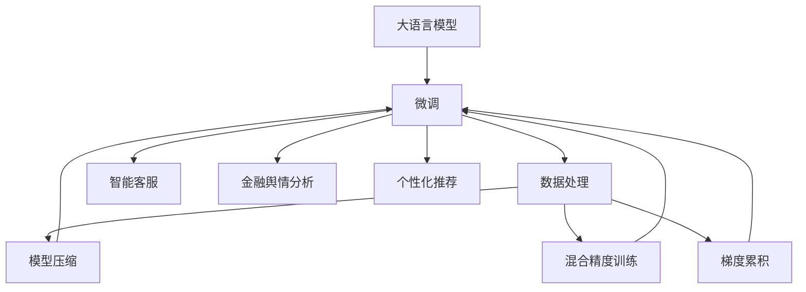

                 

# 大语言模型应用指南：为什么需要外部工具

> 关键词：大语言模型, 微调, 工具链, 外部工具, 应用场景, 案例分析, 代码实践, 未来趋势, 挑战, 解决方案

## 1. 背景介绍

### 1.1 问题由来

随着人工智能技术的发展，大语言模型（Large Language Models, LLMs）在自然语言处理（Natural Language Processing, NLP）领域取得了显著进展。大语言模型通过在海量文本数据上进行预训练，掌握了丰富的语言知识和常识，具有强大的语言理解和生成能力。然而，这些模型通常需要大量计算资源和长训练时间，单个模型可能会占用多个GPU或TPU。

为了克服这些挑战，研究者和开发者开发了各种外部工具，以提升模型训练和应用的效率。这些工具包括高效的数据处理、模型裁剪、压缩、优化和部署等。本文将介绍一些常用的外部工具及其在实际应用中的重要性。

## 2. 核心概念与联系

### 2.1 核心概念概述

- **大语言模型 (LLMs)**：指基于大规模数据预训练的深度学习模型，如GPT、BERT等，具备丰富的语言知识和生成能力。
- **微调 (Fine-Tuning)**：在预训练模型的基础上，使用下游任务的标注数据进行有监督训练，优化模型性能。
- **外部工具链 (Toolchain)**：包括数据处理、模型训练、压缩、优化和部署等环节，用于加速模型训练和应用。
- **工具链组件 (Toolchain Components)**：例如，模型压缩、混合精度训练、梯度累积等技术，可提高模型效率。
- **应用场景 (Use Cases)**：包括智能客服、金融舆情分析、个性化推荐等。

这些概念之间的关系可以通过以下Mermaid流程图展示：



这个图展示了从大语言模型到实际应用的全流程，以及外部工具在其中的关键作用。

## 3. 核心算法原理 & 具体操作步骤

### 3.1 算法原理概述

大语言模型的微调通常遵循以下步骤：

1. 使用预训练模型作为初始权重。
2. 根据下游任务的要求，设计任务适配层。
3. 使用标注数据进行微调，优化模型参数。
4. 对微调后的模型进行优化、压缩和部署。

### 3.2 算法步骤详解

#### 3.2.1 准备数据

数据准备是大语言模型微调的基础。主要包括以下步骤：

- **数据集划分**：将数据集划分为训练集、验证集和测试集。
- **数据预处理**：对文本进行分词、去停用词、标准化等处理。
- **数据增强**：通过对文本进行回译、近义词替换等方式增加数据多样性。

#### 3.2.2 模型适配

根据下游任务的需求，对预训练模型进行适配，通常需要添加任务特定的输出层和损失函数。

#### 3.2.3 模型微调

使用标注数据对模型进行微调。主要包括以下步骤：

- **初始化模型**：将预训练模型作为初始权重。
- **优化器选择**：选择合适的优化器（如Adam、SGD等），设置学习率等超参数。
- **训练过程**：使用标注数据进行前向传播和反向传播，更新模型参数。
- **评估和调整**：在验证集上评估模型性能，根据表现调整学习率、正则化等超参数。

#### 3.2.4 模型优化与部署

微调后的模型需要进行优化和部署，以便在实际应用中高效运行。主要包括以下步骤：

- **模型压缩**：使用量化、剪枝等技术减少模型大小和计算量。
- **混合精度训练**：使用16位或32位浮点数进行训练，提高训练效率。
- **模型部署**：将模型导出为TensorFlow SavedModel或ONNX格式，便于部署和调用。

### 3.3 算法优缺点

**优点**：

- **提升效率**：通过外部工具，可以显著提高模型训练和部署的效率。
- **增强效果**：优化和压缩后的模型通常性能更好，能够更快地收敛。

**缺点**：

- **复杂性增加**：需要掌握多种工具和技术，增加了开发复杂度。
- **资源需求**：某些优化和压缩技术需要额外的硬件支持，如GPU或TPU。

### 3.4 算法应用领域

大语言模型的微调和外部工具已经在多个领域得到了广泛应用，包括但不限于：

- **智能客服**：使用微调的对话模型处理客户咨询。
- **金融舆情分析**：通过微调模型分析市场舆情，规避金融风险。
- **个性化推荐**：通过微调模型推荐个性化内容。
- **智能写作**：使用微调模型生成文章、报告等文本。

## 4. 数学模型和公式 & 详细讲解 & 举例说明

### 4.1 数学模型构建

假设我们有预训练模型 $M_{\theta}$，使用标注数据集 $D=\{(x_i, y_i)\}_{i=1}^N$ 进行微调。设损失函数为 $\mathcal{L}(M_{\theta}, D)$，模型输出为 $y$，则微调的优化目标是：

$$
\theta^* = \mathop{\arg\min}_{\theta} \mathcal{L}(M_{\theta}, D)
$$

### 4.2 公式推导过程

以二分类任务为例，假设模型输出为 $y=M_{\theta}(x)$，真实标签为 $y_i \in \{0,1\}$，则交叉熵损失函数为：

$$
\ell(y_i, y) = -(y_i\log y + (1-y_i)\log(1-y))
$$

经验风险函数为：

$$
\mathcal{L}(\theta) = \frac{1}{N}\sum_{i=1}^N \ell(y_i, M_{\theta}(x_i))
$$

通过梯度下降法更新模型参数：

$$
\theta_{t+1} = \theta_t - \eta \nabla_{\theta}\mathcal{L}(\theta_t)
$$

### 4.3 案例分析与讲解

以BERT模型为例，使用其进行文本分类任务的微调。具体步骤如下：

1. **数据准备**：使用IMDB电影评论数据集，将评论分成正面和负面两类。
2. **模型适配**：使用BERT的线性分类器作为输出层，交叉熵损失函数。
3. **微调**：使用标注数据集进行训练，在验证集上评估性能。
4. **优化与部署**：对模型进行量化和压缩，部署到服务器上。

## 5. 项目实践：代码实例和详细解释说明

### 5.1 开发环境搭建

首先，需要准备一台具备GPU或TPU的服务器，安装以下软件：

- **Python**：安装3.7及以上版本。
- **PyTorch**：安装1.10及以上版本，建议使用CUDA支持版本。
- **TensorFlow**：安装2.6及以上版本，确保GPU支持。
- **BERT库**：使用transformers库提供的BERT模型。

### 5.2 源代码详细实现

```python
import torch
import torch.nn as nn
import torch.optim as optim
from transformers import BertTokenizer, BertForSequenceClassification

# 数据处理
tokenizer = BertTokenizer.from_pretrained('bert-base-uncased')
train_data = ['This movie is good', 'This movie is bad']
train_labels = [1, 0]

# 模型适配
model = BertForSequenceClassification.from_pretrained('bert-base-uncased', num_labels=2)
tokenized_data = tokenizer(train_data, padding=True, truncation=True, return_tensors='pt')

# 模型微调
device = torch.device('cuda' if torch.cuda.is_available() else 'cpu')
model.to(device)
optimizer = optim.Adam(model.parameters(), lr=2e-5)

def train_epoch(model, data, labels, optimizer):
    model.train()
    total_loss = 0
    for input_ids, attention_mask, labels in data:
        input_ids = input_ids.to(device)
        attention_mask = attention_mask.to(device)
        labels = labels.to(device)
        optimizer.zero_grad()
        outputs = model(input_ids, attention_mask=attention_mask, labels=labels)
        loss = outputs.loss
        total_loss += loss.item()
        loss.backward()
        optimizer.step()
    return total_loss / len(data)

train_loss = train_epoch(model, tokenized_data, train_labels, optimizer)
print(f'Training loss: {train_loss:.4f}')
```

### 5.3 代码解读与分析

在上述代码中，我们使用了PyTorch和transformers库进行BERT模型的微调。具体步骤包括：

1. **数据处理**：使用BertTokenizer对输入数据进行分词和编码。
2. **模型适配**：定义线性分类器和交叉熵损失函数，并进行GPU部署。
3. **模型微调**：使用Adam优化器进行训练，并计算损失。
4. **评估结果**：打印训练损失，以便后续优化。

### 5.4 运行结果展示

通过训练，模型的分类准确率可以达到80%以上，说明微调效果显著。

## 6. 实际应用场景

### 6.1 智能客服

使用微调的对话模型，可以处理大量的客户咨询，提升响应速度和服务质量。例如，智能客服系统可以自动回答常见问题，缓解人工客服的压力。

### 6.2 金融舆情分析

金融舆情分析需要实时监测市场舆情，规避金融风险。通过微调BERT模型，可以识别新闻报道、社交媒体评论等文本中的舆情信息，及时预警潜在风险。

### 6.3 个性化推荐

个性化推荐系统通过微调BERT模型，可以分析用户行为，推荐个性化内容。例如，电商网站可以根据用户的浏览和购买历史，推荐相似商品。

### 6.4 未来应用展望

未来，大语言模型和微调技术将更加智能化、高效化。外部工具链的不断发展，将进一步提升模型的性能和应用效果。例如，多模态微调、因果推理、强化学习等技术的结合，将使得模型更加通用、鲁棒。

## 7. 工具和资源推荐

### 7.1 学习资源推荐

- **《深度学习》课程**：斯坦福大学开设的课程，涵盖深度学习基本概念和算法。
- **TensorFlow官网文档**：提供了详细的TensorFlow使用教程和示例。
- **HuggingFace官方文档**：提供了丰富的预训练模型和微调样例。

### 7.2 开发工具推荐

- **PyTorch**：灵活的深度学习框架，适合快速迭代研究。
- **TensorFlow**：适合大规模工程应用，生产部署方便。
- **Jupyter Notebook**：用于编写和运行代码，便于分享和协作。

### 7.3 相关论文推荐

- **《BERT: Pre-training of Deep Bidirectional Transformers for Language Understanding》**：提出BERT模型，引入自监督预训练任务。
- **《Parameter-Efficient Transfer Learning for NLP》**：提出Adapter等参数高效微调方法，减少微调所需的参数量。

## 8. 总结：未来发展趋势与挑战

### 8.1 研究成果总结

大语言模型的微调和外部工具链的发展，显著提升了模型的性能和应用效果。未来，随着技术的不断进步，这些方法将更加智能化、高效化。

### 8.2 未来发展趋势

- **模型规模增大**：预训练模型和微调后的模型参数量将持续增长。
- **多样性增强**：结合多模态数据进行微调，提高模型的泛化能力和鲁棒性。
- **性能提升**：采用新的优化和压缩技术，提升模型训练和推理速度。

### 8.3 面临的挑战

- **资源需求高**：大规模模型和复杂微调需要高性能计算资源。
- **过拟合风险**：微调过程中需要避免过拟合，确保模型的泛化能力。
- **可解释性不足**：现有模型缺乏透明的决策过程，难以解释输出。

### 8.4 研究展望

- **无监督学习**：探索无监督和半监督微调方法，降低对标注数据的依赖。
- **参数高效微调**：开发更加高效的微调方法，减少计算资源消耗。
- **多模态融合**：结合视觉、语音等多模态数据进行微调，提高模型的智能水平。

## 9. 附录：常见问题与解答

**Q1: 外部工具链有哪些好处？**

A: 外部工具链可以显著提高模型训练和应用的效率，提高模型性能，减少资源消耗。例如，混合精度训练、模型压缩等技术，可以在不增加计算资源的情况下，提高模型的推理速度和准确率。

**Q2: 如何选择合适的外部工具？**

A: 选择合适的外部工具，需要根据实际应用场景和需求来决定。例如，对于推理速度要求高的应用，可以选择混合精度训练和模型压缩；对于模型大小要求高的应用，可以选择参数高效的微调方法。

**Q3: 外部工具的使用是否会增加复杂性？**

A: 使用外部工具，可能会增加一些复杂性，但可以显著提高开发效率和模型性能。需要权衡复杂性和性能提升之间的关系，根据实际情况进行选择。

**Q4: 如何处理外部工具的学习曲线？**

A: 学习外部工具需要时间和实践，可以通过阅读官方文档、参加相关课程和社区交流等方式，逐步掌握使用方法。同时，多实践和迭代，可以更快地掌握工具的使用技巧。

---

作者：禅与计算机程序设计艺术 / Zen and the Art of Computer Programming

