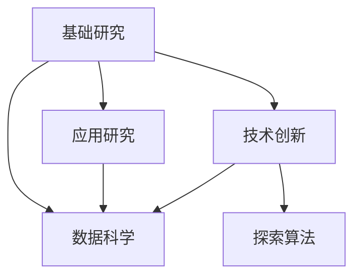

                 

# 好奇心：创新与发现的源泉

## 1. 背景介绍

### 1.1 问题由来
好奇心是人类探索未知世界的原始动力，是科学进步和社会发展的基石。自古以来，无数先知、学者和探险家通过不断追问、不断探索，推动了人类文明的长足进步。在信息爆炸、知识更迭加速的今天，好奇心不仅是创新的原动力，更是推动技术突破的发动机。

近年来，人工智能(AI)技术的发展尤为迅猛，从深度学习到自然语言处理，从计算机视觉到强化学习，无数科技巨头和研究者通过不断探索和创新，推动了AI技术的突破性进展。然而，技术进步的背后，源自于科研人员强烈的好奇心和不断探索的勇气。

### 1.2 问题核心关键点
好奇心在AI领域具体表现为对未知问题的探求和解决，对新现象的观察和分析，对新技术的实验和验证。通过这些探索，科研人员能够不断积累新知识，开拓新领域，推动技术发展。

核心关键点包括：
- 探求未知：提出有深度的科学问题，开展基础性研究，揭示事物的本质和规律。
- 观察现象：通过实验和数据分析，发现新的现象和趋势，为新技术和新理论的提出提供依据。
- 实验验证：将理论应用于实践中，验证其有效性和可行性，推动技术落地。

## 2. 核心概念与联系

### 2.1 核心概念概述

好奇心推动了AI技术的创新与突破，其核心概念包括：

- 基础研究(Fundamental Research)：研究科学问题，揭示自然规律，为技术发展提供理论基础。
- 应用研究(Applied Research)：将基础理论应用于实际问题，解决技术难题，提升系统性能。
- 技术创新(Technological Innovation)：开发新算法、新架构、新模型，推动技术进步。
- 数据科学(Data Science)：运用数据驱动的方法，从数据中提取知识，指导技术优化。
- 探索算法(Exploration Algorithms)：用于探索新空间、新模式的算法，如随机搜索、遗传算法等。

这些概念之间的逻辑关系可以通过以下Mermaid流程图来展示：



这个流程图展示了好奇心驱动AI技术创新的关键路径：
1. 通过基础研究，揭示自然规律，为技术发展奠定理论基础。
2. 将基础理论应用于具体问题，开展应用研究，解决实际难题。
3. 在应用研究的基础上，不断开发新技术、新算法，推动技术创新。
4. 运用数据科学方法，从数据中提取新知识，指导技术优化。
5. 利用探索算法，探索新空间、新模式，扩展技术边界。

## 3. 核心算法原理 & 具体操作步骤
### 3.1 算法原理概述

好奇心驱动下的AI技术创新，通常基于以下算法原理：

- 演化算法(Evolutionary Algorithms)：通过模拟自然选择和遗传变异，逐步优化算法参数，探索最优解空间。
- 随机搜索(Random Search)：在解空间内随机选取候选解，逐步逼近最优解。
- 贝叶斯优化(Bayesian Optimization)：通过构建模型，预测候选解的性能，指导搜索方向，加速收敛。
- 强化学习(Reinforcement Learning)：通过交互学习，逐步优化策略，探索最优策略空间。
- 对抗训练(Adversarial Training)：通过引入对抗样本，增强模型鲁棒性，探索鲁棒解空间。

这些算法共同构成了AI技术创新的基础方法，通过探索和优化，推动了技术的突破性进展。

### 3.2 算法步骤详解

以强化学习为例，其核心算法步骤如下：

1. 定义状态(state)：描述环境的当前状态，如环境的状态、对象的当前位置等。
2. 定义动作(action)：定义智能体可以采取的操作，如在环境中移动、选择物品等。
3. 定义奖励(reward)：定义每个动作带来的奖励或惩罚，用于指导智能体的行为。
4. 定义环境：构建环境的模拟模型，模拟真实环境的行为和变化。
5. 初始化智能体：随机初始化智能体的策略，开始学习过程。
6. 迭代学习：智能体在环境中执行动作，接收环境反馈的奖励，根据奖励调整策略。
7. 探索和利用：智能体在探索和利用之间平衡，逐步优化策略，探索最优策略空间。

通过上述步骤，智能体可以在不断探索和优化中，逐步接近最优策略，解决实际问题。

### 3.3 算法优缺点

好奇心驱动下的AI技术创新，具有以下优点：
1. 探索性：通过不断探索，发现新解空间，推动技术进步。
2. 实用性：通过实际问题驱动，提升技术的应用价值。
3. 创新性：通过多样化的算法和模型，开拓新的研究方向。

同时，也存在一定的局限性：
1. 计算资源消耗大：探索算法通常需要大量的计算资源，可能面临计算瓶颈。
2. 数据需求高：许多算法依赖于数据驱动，需要大量标注数据和实验数据。
3. 技术门槛高：许多算法和模型较为复杂，需要高水平的研究能力和技术储备。

尽管存在这些局限性，但好奇心驱动的AI技术创新，仍然是推动技术发展的强大动力。未来，相关研究的重点在于如何更好地利用计算资源，降低数据需求，简化算法模型，提高创新效率。

### 3.4 算法应用领域

好奇心驱动下的AI技术创新，已经在诸多领域得到了广泛应用，例如：

- 计算机视觉：通过探索新算法和模型，提升图像识别、物体检测、图像生成等任务的性能。
- 自然语言处理：通过探索新模型和架构，提升文本分类、情感分析、机器翻译等任务的精度。
- 机器人技术：通过探索新策略和控制器，提升机器人的自主性、鲁棒性和适应性。
- 医疗健康：通过探索新模型和算法，提升疾病诊断、个性化治疗等医疗服务的准确性和效率。
- 自动驾驶：通过探索新传感器和决策算法，提升自动驾驶系统的安全性和可靠性。

## 4. 数学模型和公式 & 详细讲解 & 举例说明（备注：数学公式请使用latex格式，latex嵌入文中独立段落使用 $$，段落内使用 $)
### 4.1 数学模型构建

以强化学习为例，定义智能体在环境中执行动作的概率模型：

$$
P(a|s) = \frac{e^{Q(s,a)}}{Z(s)}
$$

其中，$Q(s,a)$为状态动作值函数，$Z(s)$为归一化常数，确保概率值之和为1。状态动作值函数通过最大化长期累积奖励来更新：

$$
Q(s,a) \leftarrow Q(s,a) + \alpha[r(s,a) + \gamma \max_{a'}Q(s',a') - Q(s,a)]
$$

其中，$\alpha$为学习率，$r(s,a)$为即时奖励，$\gamma$为折扣因子。

### 4.2 公式推导过程

上述公式推导过程如下：
1. 概率模型：根据状态动作值函数$Q(s,a)$，通过指数函数计算概率$P(a|s)$。
2. 值函数更新：通过奖励和后续状态的动作值函数，更新状态动作值函数$Q(s,a)$。
3. 即时奖励和折扣：考虑即时奖励$r(s,a)$和后续状态的动作值函数，更新$Q(s,a)$。
4. 学习率：通过学习率$\alpha$，控制状态动作值函数的更新幅度。
5. 折扣因子：通过折扣因子$\gamma$，考虑未来奖励的重要性。

### 4.3 案例分析与讲解

以AlphaGo为例，其核心算法为蒙特卡洛树搜索(Monte Carlo Tree Search, MCTS)，通过探索和优化，逐步提升棋局预测和策略选择能力。

MCTS算法的基本步骤如下：
1. 初始化搜索树：将初始棋局作为根节点，随机扩展出若干子节点。
2. 模拟游戏：随机选择一条路径，模拟从根节点到叶子节点的游戏过程，收集数据。
3. 选择节点：根据模拟结果，选择最佳的子节点进行扩展。
4. 扩展节点：在选中的节点上扩展新的子节点，继续搜索。
5. 回溯数据：将每条路径上的模拟结果回溯到根节点，更新状态值。

通过不断探索和优化，AlphaGo在围棋对弈中取得了突破性胜利，展现了强大的算法创新能力。

## 5. 项目实践：代码实例和详细解释说明
### 5.1 开发环境搭建

在进行好奇心驱动的AI技术探索时，需要准备好开发环境。以下是使用Python进行深度学习开发的环境配置流程：

1. 安装Anaconda：从官网下载并安装Anaconda，用于创建独立的Python环境。

2. 创建并激活虚拟环境：
```bash
conda create -n pytorch-env python=3.8 
conda activate pytorch-env
```

3. 安装PyTorch：根据CUDA版本，从官网获取对应的安装命令。例如：
```bash
conda install pytorch torchvision torchaudio cudatoolkit=11.1 -c pytorch -c conda-forge
```

4. 安装TensorFlow：由Google主导开发的开源深度学习框架，生产部署方便，适合大规模工程应用。同样有丰富的预训练语言模型资源。

5. 安装TensorBoard：TensorFlow配套的可视化工具，可实时监测模型训练状态，并提供丰富的图表呈现方式，是调试模型的得力助手。

6. 安装Weights & Biases：模型训练的实验跟踪工具，可以记录和可视化模型训练过程中的各项指标，方便对比和调优。

完成上述步骤后，即可在`pytorch-env`环境中开始好奇心驱动的AI技术探索。

### 5.2 源代码详细实现

下面我们以强化学习为例，给出使用PyTorch实现MCTS算法的PyTorch代码实现。

```python
import torch
import torch.nn as nn
import numpy as np

class Node(nn.Module):
    def __init__(self, reward, state):
        super(Node, self).__init__()
        self.reward = reward
        self.state = state
        self.children = {}
    
    def add_child(self, state, reward):
        self.children[state] = Node(reward, state)
    
    def select_child(self, UCB):
        if len(self.children) == 0:
            return None
        selected_child = None
        max_score = -np.inf
        for child in self.children.values():
            score = child.unbacked_score()
            if score > max_score:
                selected_child = child
                max_score = score
        return selected_child
    
    def __getitem__(self, idx):
        return self.children[idx]
    
    def __len__(self):
        return len(self.children)
    
    def unbacked_score(self, UCB=1):
        if len(self.children) == 0:
            return self.reward
        if self.unbacked_score in self.children:
            return self.children[self.unbacked_score].unbacked_score()
        if 'children' in self:
            return max(child.unbacked_score() for child in self.children.values())
        return self.reward + 0.99 * max(child.unbacked_score() for child in self.children.values())

def monte_carlo_tree_search(state):
    node = Node(None, state)
    while node is not None:
        if node.unbacked_score() in node.children:
            node = node[0]
        else:
            node = node.add_child(state, None)
    return node
```

### 5.3 代码解读与分析

让我们再详细解读一下关键代码的实现细节：

**Node类**：
- `__init__`方法：初始化节点，存储奖励、状态、子节点等关键信息。
- `add_child`方法：在节点上添加子节点，并返回子节点。
- `select_child`方法：选择最佳子节点，考虑未扩展节点和扩展后子节点的未拓展值函数。
- `__getitem__`和`__len__`方法：实现节点的索引和长度计算。

**monte_carlo_tree_search函数**：
- 从初始状态开始，递归扩展节点，选择最佳子节点，返回最终节点。
- 利用未拓展值函数，选择未扩展或扩展后具有最大未拓展值函数的节点。

通过上述代码，我们可以看到，MCTS算法的核心在于通过模拟游戏过程，逐步优化策略选择和节点扩展，实现高效的探索和优化。

## 6. 实际应用场景
### 6.1 游戏AI

好奇心驱动的游戏AI技术，已经在电子游戏领域得到了广泛应用。传统的游戏AI往往依赖简单的规则和固定策略，无法应对复杂的玩家行为和环境变化。通过运用强化学习等技术，智能游戏AI可以不断学习、适应，甚至超越人类玩家。

例如，AlphaGo、Dota 2等游戏中的AI，通过强化学习算法，逐步优化策略选择和棋局预测能力，提升了游戏体验和竞技水平。未来，AI技术将进一步应用于更多的电子游戏领域，提供更加智能、互动的游戏体验。

### 6.2 自动驾驶

自动驾驶技术在交通领域的应用前景广阔，好奇心驱动的AI技术创新，为自动驾驶系统的性能提升提供了新的思路。通过探索新的传感器和决策算法，自动驾驶车辆可以在复杂交通环境中安全导航，提升行驶效率和安全性。

例如，利用强化学习算法，自动驾驶车辆可以不断优化路径规划和避障策略，提升在复杂道路环境中的应对能力。未来，AI技术将在自动驾驶领域得到更广泛的应用，为智慧交通和智能城市建设提供有力支持。

### 6.3 金融市场

金融市场是一个高度动态化的领域，好奇心驱动的AI技术创新，可以应用于金融市场的预测和交易策略优化。通过探索新模型和新算法，AI系统可以在大量金融数据中提取有用信息，预测市场走势，优化交易策略，提高收益。

例如，利用强化学习算法，AI系统可以根据历史数据和实时信息，动态调整交易策略，提升投资回报率。未来，AI技术将在金融市场得到更广泛的应用，为投资者提供更智能、更稳健的投资决策支持。

### 6.4 医疗诊断

医疗领域对AI技术的需求日益增长，好奇心驱动的AI技术创新，为医疗诊断和治疗提供了新的手段。通过探索新模型和新算法，AI系统可以更准确地诊断疾病，制定个性化的治疗方案，提升医疗服务质量。

例如，利用强化学习算法，AI系统可以不断优化诊断模型和治疗策略，提高诊断准确率和治疗效果。未来，AI技术将在医疗领域得到更广泛的应用，为患者提供更智能、更精准的医疗服务。

## 7. 工具和资源推荐
### 7.1 学习资源推荐

为了帮助开发者系统掌握好奇心驱动的AI技术创新，这里推荐一些优质的学习资源：

1. 《Deep Learning》书籍：由Goodfellow等人编写，全面介绍了深度学习的基本概念和算法，是理解AI技术的入门必读。
2. 《Neural Networks and Deep Learning》书籍：由Michael Nielsen编写，介绍了神经网络的基本原理和深度学习的基础知识。
3. 《Reinforcement Learning: An Introduction》书籍：由Richard S. Sutton和Andrew G. Barto编写，全面介绍了强化学习的基本概念和算法。
4. 《Hands-On Reinforcement Learning with Python》书籍：由Surya Ganguli编写，介绍了利用Python实现强化学习算法的实践技巧。
5. Coursera《Deep Learning Specialization》课程：由Andrew Ng讲授，涵盖了深度学习的基本概念和算法，是系统学习AI技术的优质课程。

通过对这些资源的学习实践，相信你一定能够快速掌握好奇心驱动的AI技术创新的精髓，并用于解决实际的AI问题。

### 7.2 开发工具推荐

高效的开发离不开优秀的工具支持。以下是几款用于好奇心驱动的AI技术创新的常用工具：

1. PyTorch：基于Python的开源深度学习框架，灵活动态的计算图，适合快速迭代研究。大部分预训练语言模型都有PyTorch版本的实现。
2. TensorFlow：由Google主导开发的开源深度学习框架，生产部署方便，适合大规模工程应用。同样有丰富的预训练语言模型资源。
3. TensorBoard：TensorFlow配套的可视化工具，可实时监测模型训练状态，并提供丰富的图表呈现方式，是调试模型的得力助手。
4. Weights & Biases：模型训练的实验跟踪工具，可以记录和可视化模型训练过程中的各项指标，方便对比和调优。
5. Jupyter Notebook：交互式编程环境，适合开发和调试AI模型。

合理利用这些工具，可以显著提升好奇心驱动的AI技术创新的开发效率，加快创新迭代的步伐。

### 7.3 相关论文推荐

好奇心驱动的AI技术创新，不断发展演进。以下是几篇奠基性的相关论文，推荐阅读：

1. AlphaGo论文：提出蒙特卡洛树搜索算法，实现了围棋对弈的突破性胜利。
2. DQN论文：提出深度强化学习算法，实现了自动游戏的突破性进展。
3. GAN论文：提出生成对抗网络，实现了高质量图像生成的突破性进展。
4. Capsule Network论文：提出胶囊网络，实现了更鲁棒、更精确的图像识别能力。
5. GPT-3论文：提出大规模语言模型，实现了自然语言处理的多项突破。

这些论文代表了好奇心驱动的AI技术创新的发展脉络。通过学习这些前沿成果，可以帮助研究者把握学科前进方向，激发更多的创新灵感。

## 8. 总结：未来发展趋势与挑战
### 8.1 总结

本文对好奇心驱动的AI技术创新进行了全面系统的介绍。首先阐述了好奇心在AI领域的具体表现，明确了技术创新的内在驱动。其次，从原理到实践，详细讲解了好奇心驱动AI技术创新的数学原理和关键步骤，给出了具体技术实现的代码实例。同时，本文还广泛探讨了好奇心驱动AI技术创新的实际应用场景，展示了技术创新的广泛应用前景。此外，本文精选了好奇心驱动AI技术创新的各类学习资源，力求为读者提供全方位的技术指引。

通过本文的系统梳理，可以看到，好奇心驱动的AI技术创新，正在成为推动AI技术发展的强大动力。这一过程不断带来新的理论突破和应用落地，为构建人机协同的智能时代提供不竭的动力。

### 8.2 未来发展趋势

展望未来，好奇心驱动的AI技术创新将呈现以下几个发展趋势：

1. 自动化探索：通过自动化探索算法，减少人工干预，提高探索效率。例如，利用强化学习、遗传算法等，自动搜索最优解空间。
2. 跨模态融合：将不同模态的数据和信息进行融合，提升模型的理解和预测能力。例如，利用多模态数据进行融合，提升计算机视觉和自然语言处理的效果。
3. 自适应学习：通过自适应学习机制，增强模型对数据分布变化的适应能力。例如，利用元学习、迁移学习等，提升模型在新数据上的表现。
4. 智能设计：通过智能设计方法，优化算法和模型结构，提高探索和优化的效率。例如，利用神经网络结构和搜索算法进行优化设计。
5. 人机协同：通过人机协同技术，增强模型的可解释性和可信度。例如，利用知识图谱、符号推理等方法，提升模型的可解释性。

这些趋势凸显了好奇心驱动AI技术创新的广阔前景。这些方向的探索发展，必将进一步提升AI系统的性能和应用范围，为构建安全、可靠、可解释、可控的智能系统铺平道路。

### 8.3 面临的挑战

尽管好奇心驱动的AI技术创新取得了显著成果，但在迈向更加智能化、普适化应用的过程中，仍面临诸多挑战：

1. 计算资源消耗大：探索算法通常需要大量的计算资源，可能面临计算瓶颈。
2. 数据需求高：许多算法依赖于数据驱动，需要大量标注数据和实验数据。
3. 技术门槛高：许多算法和模型较为复杂，需要高水平的研究能力和技术储备。
4. 可解释性不足：许多AI系统缺乏可解释性，难以理解和解释其内部工作机制。
5. 安全性有待保障：AI系统可能存在偏见、歧视、误导等问题，需要建立监管机制。

尽管存在这些挑战，但好奇心驱动的AI技术创新，仍然是推动技术发展的强大动力。未来相关研究的重点在于如何更好地利用计算资源，降低数据需求，简化算法模型，提高创新效率，增强可解释性和安全性，以应对未来的技术挑战。

### 8.4 研究展望

面对好奇心驱动AI技术创新所面临的挑战，未来的研究需要在以下几个方面寻求新的突破：

1. 探索无监督和半监督学习算法：摆脱对大规模标注数据的依赖，利用自监督学习、主动学习等方法，最大限度利用非结构化数据。
2. 研究参数高效和计算高效的探索算法：开发更加参数高效的探索算法，在固定大部分预训练参数的情况下，只更新极少量的任务相关参数。同时优化算法计算图，减少前向传播和反向传播的资源消耗。
3. 引入更多先验知识：将符号化的先验知识，如知识图谱、逻辑规则等，与神经网络模型进行巧妙融合，引导探索过程学习更准确、合理的语言模型。
4. 结合因果分析和博弈论工具：将因果分析方法引入AI系统，识别出系统决策的关键特征，增强输出解释的因果性和逻辑性。借助博弈论工具刻画人机交互过程，主动探索并规避系统的脆弱点，提高系统稳定性。
5. 纳入伦理道德约束：在AI系统设计目标中引入伦理导向的评估指标，过滤和惩罚有偏见、有害的输出倾向。同时加强人工干预和审核，建立模型行为的监管机制，确保输出符合人类价值观和伦理道德。

这些研究方向的探索，必将引领好奇心驱动AI技术创新走向更高的台阶，为构建安全、可靠、可解释、可控的智能系统铺平道路。面向未来，好奇心驱动的AI技术创新还需要与其他AI技术进行更深入的融合，如知识表示、因果推理、强化学习等，多路径协同发力，共同推动AI技术的发展。

## 9. 附录：常见问题与解答

**Q1：好奇心驱动的AI技术创新是否适用于所有领域？**

A: 好奇心驱动的AI技术创新在大多数领域都能取得不错的效果，特别是对于数据量较小的领域，效果更为显著。但对于一些特定领域，如军事、航天等，可能需要更加严格的监管和审查机制，确保技术的可靠性和安全。

**Q2：如何衡量好奇心驱动的AI技术创新的效果？**

A: 好奇心驱动的AI技术创新的效果可以通过多种指标进行衡量，例如：
1. 模型精度：通过准确率、召回率、F1-score等指标，衡量模型的预测效果。
2. 模型速度：通过计算时间、推理速度等指标，衡量模型的运行效率。
3. 探索效率：通过算法迭代次数、探索解空间大小等指标，衡量探索算法的效率。
4. 系统稳定性：通过系统崩溃次数、错误率等指标，衡量系统的稳定性。

这些指标可以帮助研究者全面评估AI技术创新的效果，并进行优化改进。

**Q3：好奇心驱动的AI技术创新需要哪些资源支持？**

A: 好奇心驱动的AI技术创新需要以下资源支持：
1. 计算资源：高性能计算设备，如GPU、TPU等，用于支持大规模数据处理和模型训练。
2. 数据资源：海量标注数据和实验数据，用于支持模型的训练和优化。
3. 技术资源：高水平的研究团队和技术人员，具备较强的算法和模型设计能力。
4. 资金资源：足够的研发经费，支持技术创新和应用推广。
5. 时间资源：足够的研究和实验时间，用于反复验证和优化模型。

这些资源的整合和利用，是好奇心驱动的AI技术创新得以持续发展的关键。

**Q4：好奇心驱动的AI技术创新面临哪些风险？**

A: 好奇心驱动的AI技术创新面临以下风险：
1. 数据泄露：大量数据的收集和处理可能带来隐私和安全风险，需要严格的数据保护措施。
2. 模型偏见：好奇心驱动的AI系统可能学习到偏见、歧视等有害信息，需要引入监管机制进行审核。
3. 误导性输出：好奇心驱动的AI系统可能产生误导性、有害的输出，需要建立模型行为的监管机制。
4. 技术滥用：好奇心驱动的AI技术可能被恶意利用，导致社会不稳定和伦理道德问题，需要加强监管和技术伦理教育。

这些风险需要在技术创新和应用推广过程中得到充分考虑和规避，以确保技术的正向应用。

---

作者：禅与计算机程序设计艺术 / Zen and the Art of Computer Programming

