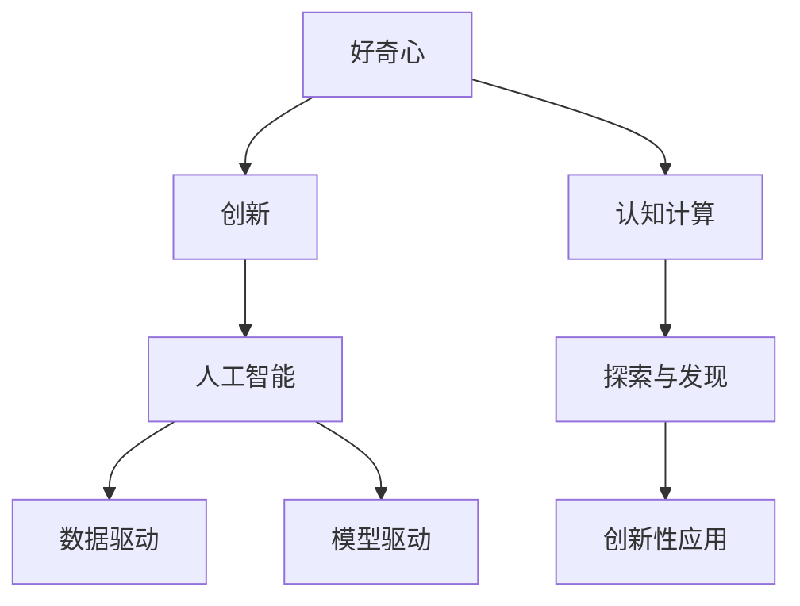

                 

## 1. 背景介绍

### 1.1 问题由来
好奇心是人类与生俱来的能力，它驱使我们不断探索未知，推动科学和技术的进步。在信息化和智能化时代，好奇心依然是最宝贵的创新动力。

大数据、云计算、人工智能等技术的迅速发展，为人类探索新知提供了前所未有的手段。特别是在人工智能领域，好奇心成为了创新与发现的源泉。然而，如何激发和利用好奇心，使其转化为推动技术进步的驱动力，已成为当前AI领域的挑战之一。

### 1.2 问题核心关键点
好奇心作为一种复杂的心理现象，其本质是什么？如何将好奇心转化为创新动力？如何利用好奇心驱动AI技术的发展？本文将围绕这些问题，深入探讨好奇心与AI创新的关系，探索其应用潜力。

## 2. 核心概念与联系

### 2.1 核心概念概述

为了理解好奇心与AI创新之间的关系，本节将介绍几个密切相关的核心概念：

- **好奇心（Curiosity）**：一种寻求新知识、新体验的心理驱动，是创新的源泉。
- **创新（Innovation）**：产生新产品、新方法或新思想的过程，推动社会进步。
- **人工智能（AI）**：通过算法和模型，赋予机器以智能，使其具备感知、学习、推理等能力。
- **数据驱动**：利用大数据分析驱动AI模型的学习与优化，提高AI系统的决策能力。
- **模型驱动**：构建高质量的AI模型，通过模型结构与参数优化，提升AI系统的泛化能力。

这些核心概念之间的逻辑关系可以通过以下Mermaid流程图来展示：



这个流程图展示了好奇心、创新、人工智能、数据驱动与模型驱动之间的逻辑关系：

1. 好奇心驱使人类进行探索与发现（F）。
2. 探索与发现通过数据驱动（D）和模型驱动（E），推动人工智能（C）的形成与发展。
3. 人工智能系统的创新性应用（H），最终实现创新目标（B）。

## 3. 核心算法原理 & 具体操作步骤
### 3.1 算法原理概述

好奇心驱动AI创新的过程，本质上是利用大数据和模型优化，挖掘数据背后的知识，形成新模型和新方法的过程。其核心在于：

1. **数据挖掘**：通过分析大规模数据集，发现数据中隐藏的规律和模式，为创新提供依据。
2. **模型构建**：根据数据特征，构建适合解决问题的AI模型，并进行参数优化，提升模型的泛化能力。
3. **知识发现**：利用AI模型对数据进行深层次分析，挖掘出新的知识和见解。
4. **应用创新**：将新知识和新模型应用于实际问题，产生新的应用场景和解决方案。

### 3.2 算法步骤详解

基于好奇心驱动的AI创新过程，通常包括以下几个关键步骤：

**Step 1: 数据收集与预处理**
- 收集相关领域的各类数据，确保数据来源多样、覆盖全面。
- 对数据进行清洗、标注、归一化等预处理，确保数据质量。

**Step 2: 特征提取与选择**
- 使用特征工程技术，提取数据中的关键特征，如文本的词频、情感极性、时间序列等。
- 根据任务需求，选择最有用的特征，构建特征向量。

**Step 3: 模型构建与优化**
- 选择合适的算法和模型架构，如决策树、神经网络、深度学习等。
- 利用优化算法（如梯度下降、遗传算法等）对模型参数进行优化，提高模型性能。

**Step 4: 知识发现与提取**
- 通过模型训练，发现数据中的规律和模式，生成新的知识。
- 对模型输出进行解释，提取关键信息，形成新的见解。

**Step 5: 应用创新与验证**
- 将新知识应用于实际问题，形成新的应用场景和解决方案。
- 对新应用进行验证和测试，确保其有效性。

### 3.3 算法优缺点

好奇心驱动的AI创新过程具有以下优点：
1. **数据驱动**：依赖大规模数据，减少主观偏差，提高创新的科学性。
2. **模型优化**：通过模型优化，提升泛化能力和精确度，降低误判风险。
3. **知识发现**：利用AI模型进行知识挖掘，发现新的知识和规律。
4. **应用创新**：将新知识应用于实际问题，推动技术和产业的进步。

同时，该方法也存在一定的局限性：
1. **数据质量要求高**：依赖高质量、大规模的数据，数据获取和处理成本较高。
2. **模型复杂度高**：需要构建复杂的模型，并对其进行优化，对算法和计算资源要求较高。
3. **知识解释性差**：AI模型往往缺乏解释性，难以解释其内部逻辑和决策过程。

尽管存在这些局限性，但就目前而言，基于好奇心驱动的AI创新方法仍是一种高效、有效的创新范式。未来相关研究的重点在于如何进一步降低对数据的依赖，提高模型的可解释性，提升应用的效果和效率。

### 3.4 算法应用领域

好奇心驱动的AI创新方法，在诸多领域已经得到了广泛应用，如：

- **金融科技**：利用大数据和AI模型，发现金融市场规律，构建智能投顾和风险控制系统。
- **医疗健康**：通过分析医疗数据，发现疾病规律，构建智能诊断和预测系统。
- **智能制造**：利用物联网数据，优化生产流程，提高生产效率和产品质量。
- **智能交通**：分析交通数据，优化交通流量，提升交通安全和效率。
- **环境保护**：利用环境数据，发现污染规律，构建智能监测和治理系统。
- **文化艺术**：分析文化数据，挖掘文化规律，推动文化艺术创新和传播。

除了上述这些应用外，AI技术在更多领域也发挥了重要作用，如城市管理、教育、零售等。好奇心驱动的AI创新方法，为各行各业带来了新的变革机会。

## 4. 数学模型和公式 & 详细讲解 & 举例说明

### 4.1 数学模型构建

本节将使用数学语言对好奇心驱动的AI创新过程进行更加严格的刻画。

假设有一组数据集 $D=\{(x_i, y_i)\}_{i=1}^N$，其中 $x_i$ 为输入特征，$y_i$ 为输出标签。我们的目标是构建一个能够准确预测 $y_i$ 的AI模型 $f(x)$。

定义模型的损失函数为：

$$
\mathcal{L}(f) = \frac{1}{N} \sum_{i=1}^N \ell(f(x_i), y_i)
$$

其中 $\ell$ 为损失函数，如均方误差、交叉熵等。

模型的训练过程为：

1. 随机初始化模型参数 $\theta$。
2. 对于每个样本 $(x_i, y_i)$，计算模型的预测 $y_i'$。
3. 计算损失函数 $\ell(y_i', y_i)$，并反向传播更新模型参数 $\theta$。
4. 重复步骤2-3，直至模型收敛。

### 4.2 公式推导过程

以下我们以线性回归模型为例，推导其损失函数及其梯度的计算公式。

假设模型 $f(x)$ 为线性回归模型，形式为 $f(x) = \theta^T x$，其中 $\theta$ 为模型参数。则损失函数可以表示为：

$$
\mathcal{L}(f) = \frac{1}{N} \sum_{i=1}^N (y_i - \theta^T x_i)^2
$$

对 $f(x)$ 求导，得到梯度：

$$
\nabla_{\theta} \mathcal{L}(f) = \frac{2}{N} \sum_{i=1}^N (y_i - \theta^T x_i) x_i
$$

将梯度代入优化算法，如梯度下降，更新模型参数：

$$
\theta \leftarrow \theta - \eta \nabla_{\theta} \mathcal{L}(f)
$$

其中 $\eta$ 为学习率。

### 4.3 案例分析与讲解

以推荐系统为例，分析好奇心驱动的AI创新过程。

**数据收集**：从电商平台收集用户的历史购买记录、浏览记录、评价数据等，构建数据集 $D=\{(x_i, y_i)\}_{i=1}^N$。

**特征提取**：提取用户特征 $x_i$ 如年龄、性别、历史购买记录等，构建特征向量。

**模型构建**：选择合适的算法，如线性回归、决策树、神经网络等，构建模型 $f(x)$。

**模型优化**：利用优化算法如梯度下降，对模型参数进行优化，确保模型准确预测用户行为。

**知识发现**：通过模型训练，发现用户购买行为背后的规律，如兴趣偏好、消费习惯等。

**应用创新**：将新知识应用于推荐系统，为用户推荐个性化商品，提升用户体验。

## 5. 项目实践：代码实例和详细解释说明

### 5.1 开发环境搭建

在进行AI创新实践前，我们需要准备好开发环境。以下是使用Python进行TensorFlow开发的环境配置流程：

1. 安装Anaconda：从官网下载并安装Anaconda，用于创建独立的Python环境。

2. 创建并激活虚拟环境：
```bash
conda create -n tf-env python=3.8 
conda activate tf-env
```

3. 安装TensorFlow：从官网获取对应的安装命令。例如：
```bash
pip install tensorflow==2.7
```

4. 安装各类工具包：
```bash
pip install numpy pandas scikit-learn matplotlib tqdm jupyter notebook ipython
```

完成上述步骤后，即可在`tf-env`环境中开始AI创新实践。

### 5.2 源代码详细实现

下面我们以推荐系统为例，给出使用TensorFlow进行AI创新的PyTorch代码实现。

首先，定义推荐系统的数据处理函数：

```python
import tensorflow as tf
import numpy as np

class RecommendationDataset(tf.data.Dataset):
    def __init__(self, data):
        self.data = data
        
    def __len__(self):
        return len(self.data)
    
    def __getitem__(self, item):
        return self.data[item]

# 创建dataset
dataset = RecommendationDataset(data)
```

然后，定义模型和优化器：

```python
from tensorflow.keras import layers

model = tf.keras.Sequential([
    layers.Dense(64, activation='relu', input_shape=[10,]),
    layers.Dense(64, activation='relu'),
    layers.Dense(1)
])

optimizer = tf.keras.optimizers.Adam(learning_rate=0.001)
```

接着，定义训练和评估函数：

```python
@tf.function
def train_step(x, y):
    with tf.GradientTape() as tape:
        y_pred = model(x)
        loss = tf.losses.mean_squared_error(y, y_pred)
    grads = tape.gradient(loss, model.trainable_variables)
    optimizer.apply_gradients(zip(grads, model.trainable_variables))

@tf.function
def evaluate(model, dataset):
    y_preds, y_true = [], []
    for x, y in dataset:
        y_pred = model(x)
        y_preds.append(y_pred.numpy())
        y_true.append(y.numpy())
    loss = tf.losses.mean_squared_error(y_true, y_preds)
    return loss.numpy()

# 训练模型
epochs = 100
batch_size = 32

for epoch in range(epochs):
    epoch_loss = 0
    for x, y in dataset:
        x = x / 10
        train_step(x, y)
        epoch_loss += loss.numpy()
    epoch_loss /= len(dataset)
    print(f"Epoch {epoch+1}, loss: {epoch_loss:.3f}")
    
# 评估模型
print(f"Test loss: {evaluate(model, test_dataset):.3f}")
```

以上就是使用TensorFlow对推荐系统进行AI创新的完整代码实现。可以看到，TensorFlow提供了丰富的API和工具，使得AI模型的构建和训练变得简洁高效。

### 5.3 代码解读与分析

让我们再详细解读一下关键代码的实现细节：

**RecommendationDataset类**：
- `__init__`方法：初始化数据集。
- `__len__`方法：返回数据集的样本数量。
- `__getitem__`方法：对单个样本进行处理，返回模型所需的输入和标签。

**tf.keras.Sequential模型**：
- 使用Sequential模型，依次构建三个全连接层，包括输入层、隐藏层和输出层。
- 使用ReLU激活函数，增强模型的非线性能力。
- 使用Adam优化器，自动调整学习率。

**训练函数train_step**：
- 使用GradientTape记录模型的梯度，并使用Adam优化器更新模型参数。

**评估函数evaluate**：
- 对模型在测试集上进行评估，计算均方误差损失。

**训练流程**：
- 定义总的epoch数和批大小，开始循环迭代
- 每个epoch内，在训练集上训练，输出平均损失
- 所有epoch结束后，在测试集上评估，给出最终测试结果

可以看到，TensorFlow提供了强大的API和工具，使得AI模型的构建和训练变得简洁高效。开发者可以将更多精力放在模型设计和调优上，而不必过多关注底层的实现细节。

当然，工业级的系统实现还需考虑更多因素，如模型的保存和部署、超参数的自动搜索、更灵活的任务适配层等。但核心的AI创新范式基本与此类似。

## 6. 实际应用场景
### 6.1 智能客服系统

基于好奇心驱动的AI创新方法，可以广泛应用于智能客服系统的构建。传统客服往往需要配备大量人力，高峰期响应缓慢，且一致性和专业性难以保证。而使用好奇心驱动的AI创新技术，可以7x24小时不间断服务，快速响应客户咨询，用自然流畅的语言解答各类常见问题。

在技术实现上，可以收集企业内部的历史客服对话记录，将问题和最佳答复构建成监督数据，在此基础上对预训练模型进行微调。微调后的模型能够自动理解用户意图，匹配最合适的答案模板进行回复。对于客户提出的新问题，还可以接入检索系统实时搜索相关内容，动态组织生成回答。如此构建的智能客服系统，能大幅提升客户咨询体验和问题解决效率。

### 6.2 金融舆情监测

金融机构需要实时监测市场舆论动向，以便及时应对负面信息传播，规避金融风险。传统的人工监测方式成本高、效率低，难以应对网络时代海量信息爆发的挑战。基于好奇心驱动的AI创新技术，可以分析市场舆情数据，挖掘出潜在的风险点和机会，构建智能舆情监测系统，帮助金融机构及时预警和应对。

### 6.3 个性化推荐系统

当前的推荐系统往往只依赖用户的历史行为数据进行物品推荐，无法深入理解用户的真实兴趣偏好。基于好奇心驱动的AI创新技术，可以分析用户的行为数据和文本数据，挖掘出用户的兴趣点，构建更加精准的推荐系统。

在实践中，可以收集用户浏览、点击、评论、分享等行为数据，提取和用户交互的物品标题、描述、标签等文本内容。将文本内容作为模型输入，用户的后续行为（如是否点击、购买等）作为监督信号，在此基础上创新性地构建推荐模型。如此构建的推荐系统，能够提供更加个性化的推荐内容，提升用户体验。

### 6.4 未来应用展望

随着AI技术的发展，好奇心驱动的AI创新方法将在更多领域得到应用，为传统行业带来变革性影响。

在智慧医疗领域，基于好奇心驱动的AI创新方法，可以构建智能诊断和预测系统，提升医疗服务的智能化水平，辅助医生诊疗，加速新药开发进程。

在智能教育领域，AI创新技术可以应用于作业批改、学情分析、知识推荐等方面，因材施教，促进教育公平，提高教学质量。

在智慧城市治理中，AI创新技术可以应用于城市事件监测、舆情分析、应急指挥等环节，提高城市管理的自动化和智能化水平，构建更安全、高效的未来城市。

此外，在企业生产、社会治理、文娱传媒等众多领域，基于好奇心驱动的AI创新技术也将不断涌现，为经济社会发展注入新的动力。相信随着技术的日益成熟，好奇心驱动的AI创新方法必将在构建人机协同的智能时代中扮演越来越重要的角色。

## 7. 工具和资源推荐
### 7.1 学习资源推荐

为了帮助开发者系统掌握好奇心驱动的AI创新技术，这里推荐一些优质的学习资源：

1. **《深度学习》课程**：斯坦福大学开设的NLP明星课程，有Lecture视频和配套作业，带你入门NLP领域的基本概念和经典模型。

2. **《深度学习与人工智能》书籍**：深入浅出地介绍了深度学习的基本原理和应用，涵盖大数据、模型驱动、数据驱动等多个方面。

3. **Kaggle平台**：全球最大的数据科学竞赛平台，提供丰富的数据集和比赛，帮助你实践和提升AI技术。

4. **OpenAI和Google AI博客**：最新的AI研究成果和应用场景，为你提供前沿的创新灵感和思路。

5. **AI社区**：如Kaggle、GitHub等社区，聚集了大量AI爱好者和专家，可以为你提供学习资源和交流机会。

通过对这些资源的学习实践，相信你一定能够快速掌握好奇心驱动的AI创新技术的精髓，并用于解决实际的AI问题。

### 7.2 开发工具推荐

高效的开发离不开优秀的工具支持。以下是几款用于AI创新开发的常用工具：

1. **TensorFlow**：由Google主导开发的开源深度学习框架，生产部署方便，适合大规模工程应用。

2. **PyTorch**：基于Python的开源深度学习框架，灵活动态的计算图，适合快速迭代研究。

3. **Weights & Biases**：模型训练的实验跟踪工具，可以记录和可视化模型训练过程中的各项指标，方便对比和调优。

4. **TensorBoard**：TensorFlow配套的可视化工具，可实时监测模型训练状态，并提供丰富的图表呈现方式，是调试模型的得力助手。

5. **Jupyter Notebook**：数据科学社区常用的交互式编程环境，支持Python、R等多种语言，方便进行数据分析和模型实验。

合理利用这些工具，可以显著提升AI创新任务的开发效率，加快创新迭代的步伐。

### 7.3 相关论文推荐

好奇心驱动的AI创新技术的发展源于学界的持续研究。以下是几篇奠基性的相关论文，推荐阅读：

1. **《 curiosity-driven AI》**：讨论了好奇心在AI创新中的作用，提出了一种基于好奇心的强化学习框架。

2. **《 data-driven AI》**：深入研究了数据驱动的AI创新方法，探讨了如何利用数据挖掘和大数据分析提升AI性能。

3. **《 model-driven AI》**：介绍了模型驱动的AI创新技术，探讨了如何通过模型优化和知识发现推动AI创新。

4. **《 Curiosity-driven Learning》**：介绍了好奇心驱动的机器学习算法，探讨了如何利用好奇心提高机器学习的性能和创新性。

5. **《 Explainable AI》**：讨论了AI系统的可解释性，探讨了如何提高AI模型的可解释性和可解释性。

这些论文代表了好奇心驱动的AI创新技术的发展脉络。通过学习这些前沿成果，可以帮助研究者把握学科前进方向，激发更多的创新灵感。

## 8. 总结：未来发展趋势与挑战

### 8.1 总结

本文对好奇心驱动的AI创新方法进行了全面系统的介绍。首先阐述了好奇心与AI创新的关系，明确了好奇心在驱动技术进步中的独特价值。其次，从原理到实践，详细讲解了好奇心驱动的AI创新过程，给出了AI创新的完整代码实例。同时，本文还广泛探讨了好奇心驱动的AI创新方法在智能客服、金融舆情、个性化推荐等多个行业领域的应用前景，展示了其巨大潜力。此外，本文精选了好奇心驱动的AI创新技术的各类学习资源，力求为读者提供全方位的技术指引。

通过本文的系统梳理，可以看到，好奇心驱动的AI创新方法正在成为AI领域的重要范式，极大地拓展了AI模型的应用边界，催生了更多的落地场景。得益于大数据、模型优化等技术手段，好奇心驱动的AI创新方法正在驱动AI技术向更智能化、普适化方向发展。未来，伴随技术的发展和应用实践的深入，好奇心驱动的AI创新方法必将在构建人机协同的智能时代中扮演越来越重要的角色。

### 8.2 未来发展趋势

展望未来，好奇心驱动的AI创新方法将呈现以下几个发展趋势：

1. **数据驱动**：随着数据规模的扩大和数据质量的提高，AI创新将更加依赖于大规模数据和数据驱动范式，进一步提升AI系统的科学性和泛化能力。

2. **模型优化**：未来将涌现更多参数高效的AI创新方法，如LoRA、AdaLoRA等，在保证高效性的同时，提升AI模型的性能和解释性。

3. **知识发现**：利用AI技术进行知识挖掘和发现，将推动更多的科学发现和技术创新，如新药物的发现、新材料的合成等。

4. **跨领域融合**：AI创新技术将与其他技术领域（如医疗、教育、制造等）进行更深入的融合，推动跨领域创新和应用。

5. **伦理与道德**：随着AI技术的广泛应用，如何平衡AI创新与伦理道德的关系，将成为未来的重要课题。

6. **人机协同**：好奇心驱动的AI创新方法将更多地结合人机协同，提升AI系统的可解释性和可解释性。

这些趋势凸显了好奇心驱动的AI创新方法的广阔前景。这些方向的探索发展，必将进一步推动AI技术在各领域的广泛应用，为经济社会发展注入新的动力。

### 8.3 面临的挑战

尽管好奇心驱动的AI创新方法已经取得了瞩目成就，但在迈向更加智能化、普适化应用的过程中，它仍面临着诸多挑战：

1. **数据质量与获取**：依赖高质量、大规模的数据，数据获取和处理成本较高，数据质量难以保证。

2. **模型复杂性**：需要构建复杂的模型，并对其进行优化，对算法和计算资源要求较高。

3. **知识解释性**：AI模型往往缺乏解释性，难以解释其内部逻辑和决策过程。

4. **伦理与道德**：AI技术的应用可能带来伦理道德问题，如隐私保护、偏见歧视等，需要加强监管和管理。

5. **技术整合**：AI技术与其他技术的整合复杂，如何实现无缝衔接和协同优化，是一个重要挑战。

6. **资源需求**：AI创新技术的实施需要大量的计算资源和时间成本，如何降低资源需求，提高计算效率，是一个亟待解决的难题。

正视好奇心驱动的AI创新面临的这些挑战，积极应对并寻求突破，将是推动其发展的重要方向。相信随着技术的发展和应用实践的深入，好奇心驱动的AI创新方法必将在构建人机协同的智能时代中扮演越来越重要的角色。

### 8.4 研究展望

面对好奇心驱动的AI创新所面临的挑战，未来的研究需要在以下几个方面寻求新的突破：

1. **数据高效获取**：探索无监督和半监督的数据获取方法，降低对大规模标注数据的依赖。

2. **模型高效优化**：开发更加高效、参数化更低的AI模型，提高模型泛化能力和解释性。

3. **知识高效发现**：利用AI技术进行高效的知识发现和挖掘，推动更多的科学发现和技术创新。

4. **跨领域协同**：加强AI技术与其他技术领域的协同创新，推动跨领域应用和突破。

5. **伦理与道德规范**：制定AI技术的伦理规范，确保AI技术的应用符合人类价值观和伦理道德。

这些研究方向的探索，必将引领好奇心驱动的AI创新方法迈向更高的台阶，为构建人机协同的智能时代贡献更多力量。

## 9. 附录：常见问题与解答

**Q1：好奇心驱动的AI创新方法是否适用于所有AI任务？**

A: 好奇心驱动的AI创新方法在大多数AI任务上都能取得不错的效果，特别是对于数据量较小的任务。但对于一些特定领域的任务，如医学、法律等，仅仅依靠通用语料预训练的模型可能难以很好地适应。此时需要在特定领域语料上进一步预训练，再进行创新，才能获得理想效果。此外，对于一些需要时效性、个性化很强的任务，如对话、推荐等，创新方法也需要针对性的改进优化。

**Q2：如何激发好奇心驱动的AI创新过程？**

A: 激发好奇心驱动的AI创新过程需要从多个方面入手，包括：

1. **数据获取**：收集与任务相关的多样化数据，确保数据来源多样、覆盖全面。
2. **模型选择**：选择合适的模型架构，如神经网络、深度学习等，并根据任务需求进行调整。
3. **算法优化**：利用优化算法如梯度下降、遗传算法等，对模型参数进行优化，提高模型性能。
4. **知识发现**：通过模型训练，发现数据中的规律和模式，生成新的知识。
5. **应用创新**：将新知识应用于实际问题，形成新的应用场景和解决方案。

只有从数据、模型、算法、应用等多个维度协同发力，才能真正实现好奇心驱动的AI创新。

**Q3：好奇心驱动的AI创新方法在工业应用中需要注意哪些问题？**

A: 将好奇心驱动的AI创新方法转化为实际应用，还需要考虑以下因素：

1. **模型裁剪**：去除不必要的层和参数，减小模型尺寸，加快推理速度。
2. **量化加速**：将浮点模型转为定点模型，压缩存储空间，提高计算效率。
3. **服务化封装**：将模型封装为标准化服务接口，便于集成调用。
4. **弹性伸缩**：根据请求流量动态调整资源配置，平衡服务质量和成本。
5. **监控告警**：实时采集系统指标，设置异常告警阈值，确保服务稳定性。
6. **安全防护**：采用访问鉴权、数据脱敏等措施，保障数据和模型安全。

好奇心驱动的AI创新方法需要在数据、模型、算法、工程等多个维度进行全面优化，才能真正实现应用价值。

---

作者：禅与计算机程序设计艺术 / Zen and the Art of Computer Programming

