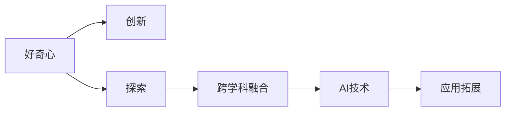

                 

## 1. 背景介绍

在科技发展的长河中，好奇心是推动人类探索未知、创造奇迹的重要力量。从伽利略的月球望远镜，到牛顿的万有引力定律，再到现代信息技术的飞速发展，每一项成就的背后都离不开人类对世界的好奇心和探索精神。在科技领域，这种好奇心同样扮演着关键角色。本文将探讨好奇心如何驱动创新，特别是在人工智能与技术领域中的表现与影响。

### 1.1 问题由来

在人工智能（AI）与技术领域，好奇心不仅推动了技术的创新与突破，也促进了知识与应用的跨界融合。AI技术的飞速发展，尤其是在深度学习、自然语言处理（NLP）、计算机视觉等子领域，都极大地得益于对新问题的探索与解决。如何利用好奇心驱动AI技术的发展，成为当前科技界的一个重要话题。

### 1.2 问题核心关键点

好奇心驱动AI技术发展的核心关键点主要包括以下几个方面：

1. **问题定义与创新**：好奇心驱使研究人员探索新问题，提出新方法，推动AI技术的突破与创新。
2. **知识迁移与融合**：好奇心促使研究人员尝试跨学科知识迁移，从而实现技术的融合与突破。
3. **模型优化与改进**：好奇心推动对现有模型的不断优化与改进，提升模型的性能与效果。
4. **应用扩展与创新**：好奇心驱动AI技术在更多实际场景中的应用扩展与创新，促进AI技术的落地与普及。

### 1.3 问题研究意义

探索好奇心如何驱动AI技术的发展，具有重要的研究意义：

1. **促进技术进步**：理解好奇心在技术创新中的作用，有助于设计更具探索性的研究策略，推动AI技术的持续进步。
2. **提高应用效果**：通过好奇心驱动，AI技术可以更好地应对实际应用中的复杂与多变性，提升应用效果与用户满意度。
3. **加速技术落地**：好奇心促使研究人员探索新技术在实际场景中的应用，加速AI技术的产业化与落地。
4. **推动学术交流**：理解好奇心在学术研究中的作用，有助于推动跨学科交流与合作，共同推动AI技术的发展。

## 2. 核心概念与联系

### 2.1 核心概念概述

为更好地理解好奇心如何驱动AI技术的发展，本节将介绍几个关键概念：

- **好奇心（Curiosity）**：人类对未知事物的兴趣与探索欲望。在AI领域，好奇心表现为对新问题、新方法和新应用的探索与解决。
- **创新（Innovation）**：突破现有技术局限，提出新方法、新应用的能力。好奇心是创新的重要驱动力之一。
- **探索（Exploration）**：在未知领域中寻找答案与解决方案的过程。探索精神是推动AI技术发展的核心动力。
- **跨学科融合（Interdisciplinary Integration）**：不同学科之间的知识与技术的融合与创新，为AI技术提供新的视角与方法。

### 2.2 核心概念原理和架构的 Mermaid 流程图



该流程图展示了好奇心如何通过创新、探索和跨学科融合，推动AI技术的发展与应用。

## 3. 核心算法原理 & 具体操作步骤

### 3.1 算法原理概述

好奇心驱动的AI技术发展，本质上是一个不断探索、尝试与创新的过程。在这一过程中，好奇心引领研究者发现新问题、探索新方法、应用新技术，从而推动AI技术的进步与应用。

形式化地，我们可以将这一过程表示为：

$$
T = A \times I \times E \times F
$$

其中，$T$ 表示AI技术，$A$ 表示好奇心，$I$ 表示创新，$E$ 表示探索，$F$ 表示跨学科融合。该公式表示AI技术的发展是好奇心、创新、探索与跨学科融合共同作用的结果。

### 3.2 算法步骤详解

基于好奇心驱动的AI技术发展过程，可以分为以下几个关键步骤：

1. **发现新问题**：好奇心驱使研究者发现新问题，提出待解决的需求。
2. **探索解决方案**：研究者通过创新与探索，尝试不同的方法与技术，寻找有效的解决方案。
3. **融合与优化**：在探索过程中，研究者尝试将不同学科的知识与技术进行融合，优化现有技术方案。
4. **实际应用**：将优化后的技术方案应用于实际场景，验证其效果与可行性。
5. **反馈与迭代**：基于实际应用的效果反馈，研究者进一步优化技术方案，进行迭代改进。

### 3.3 算法优缺点

好奇心驱动的AI技术发展，具有以下优点：

1. **创新性强**：好奇心驱使研究者不断探索与尝试，提出新的方法与技术，推动AI技术的突破。
2. **适应性强**：好奇心促使研究者关注实际应用需求，优化现有技术，提高技术的适应性与实用性。
3. **跨界融合**：好奇心促使研究者尝试跨学科知识与技术，推动AI技术的全面发展。

同时，该方法也存在一些局限性：

1. **资源消耗大**：好奇心驱动的探索与实验往往需要大量的计算资源和时间投入，成本较高。
2. **风险性高**：探索性研究可能面临较高的失败风险，需要较强的资源与技术支持。
3. **时间周期长**：新问题的探索与解决需要较长的周期，难以快速落地应用。

### 3.4 算法应用领域

好奇心驱动的AI技术发展，已经在多个领域得到了广泛应用，包括但不限于：

- **自然语言处理（NLP）**：探索新算法、新模型，提升机器翻译、文本生成等任务的效果。
- **计算机视觉（CV）**：研究新方法、新模型，提高图像识别、目标检测等任务的性能。
- **机器人与自动化**：探索新算法与新系统，提升机器人自动化水平，实现自主决策与交互。
- **智能推荐系统**：探索新算法与新模型，提高个性化推荐效果，提升用户体验。
- **自动驾驶**：探索新方法与新技术，提高自动驾驶系统的安全性与可靠性。

## 4. 数学模型和公式 & 详细讲解 & 举例说明

### 4.1 数学模型构建

在AI技术的探索与创新过程中，数学模型是不可或缺的工具。本文将以自然语言处理（NLP）领域为例，介绍基于好奇心的创新过程的数学模型构建。

假设我们希望解决一个新问题：如何自动生成符合特定风格（如文学风格、新闻风格）的文本？我们可以定义一个生成模型 $G$，将其输入表示为文本 $x$，输出表示为生成文本 $y$。我们的目标是最大化生成文本 $y$ 与目标文本风格 $y^*$ 的相似度。

### 4.2 公式推导过程

为了解决这个问题，我们可以构建一个损失函数 $L$，用于衡量生成文本与目标文本风格的差异。常见的损失函数包括KL散度、均方误差等。假设我们采用KL散度作为损失函数，其表达式为：

$$
L(y, y^*) = \frac{1}{N} \sum_{i=1}^N KL(y_i || y_i^*)
$$

其中 $N$ 表示文本数量，$KL$ 表示KL散度，$y_i$ 表示生成文本，$y_i^*$ 表示目标文本。我们的目标是最小化损失函数 $L$，即：

$$
\min_{y} L(y, y^*)
$$

### 4.3 案例分析与讲解

以自动生成文学风格文本为例，我们可以使用深度学习中的生成对抗网络（GAN）来构建生成模型 $G$。GAN由生成器 $G$ 和判别器 $D$ 组成，通过对抗训练，生成器 $G$ 可以生成高质量的文学风格文本，而判别器 $D$ 可以区分真实文本与生成文本。

具体来说，我们可以使用Transformer作为生成器，定义其输入为原始文本 $x$，输出为生成文本 $y$。判别器 $D$ 可以是一个卷积神经网络（CNN），用于判断文本的真实性。通过不断训练，生成器 $G$ 可以生成与文学风格相似的文本，从而解决了自动生成文学风格文本的问题。

## 5. 项目实践：代码实例和详细解释说明

### 5.1 开发环境搭建

在开始项目实践之前，我们需要准备好开发环境。以下是使用Python进行TensorFlow开发的环境配置流程：

1. 安装Anaconda：从官网下载并安装Anaconda，用于创建独立的Python环境。

2. 创建并激活虚拟环境：
```bash
conda create -n tensorflow-env python=3.8 
conda activate tensorflow-env
```

3. 安装TensorFlow：根据CUDA版本，从官网获取对应的安装命令。例如：
```bash
conda install tensorflow-gpu==2.7.0 -c tf
```

4. 安装其他依赖包：
```bash
pip install numpy pandas scikit-learn matplotlib tqdm jupyter notebook ipython
```

完成上述步骤后，即可在`tensorflow-env`环境中开始项目实践。

### 5.2 源代码详细实现

以下是一个基于TensorFlow实现的文学风格文本生成模型的代码实现：

```python
import tensorflow as tf
from tensorflow.keras import layers
import numpy as np
import matplotlib.pyplot as plt

class GAN(tf.keras.Model):
    def __init__(self):
        super(GAN, self).__init__()
        self.encoder = layers.Dense(512, input_dim=256)
        self.decoder = layers.Dense(256, input_dim=512)
        
    def call(self, x):
        z = self.encoder(x)
        y = self.decoder(z)
        return y

# 构建生成器和判别器
generator = GAN()
discriminator = tf.keras.Sequential([layers.Dense(512, input_dim=256),
                                   layers.LeakyReLU(),
                                   layers.Dense(256),
                                   layers.LeakyReLU(),
                                   layers.Dense(1, activation='sigmoid')])

# 定义损失函数
cross_entropy = tf.keras.losses.BinaryCrossentropy(from_logits=True)

# 定义优化器
generator_optimizer = tf.keras.optimizers.Adam(1e-4)
discriminator_optimizer = tf.keras.optimizers.Adam(1e-4)

# 定义训练函数
def train_step(images):
    noise = tf.random.normal([BATCH_SIZE, 256])

    with tf.GradientTape() as gen_tape, tf.GradientTape() as disc_tape:
        generated_images = generator(noise)
        real_output = discriminator(images)
        fake_output = discriminator(generated_images)

        gen_loss = cross_entropy(tf.ones_like(fake_output), fake_output)
        disc_loss = cross_entropy(tf.ones_like(real_output), real_output) + cross_entropy(tf.zeros_like(fake_output), fake_output)

    gradients_of_gen = gen_tape.gradient(gen_loss, generator.trainable_variables)
    gradients_of_disc = disc_tape.gradient(disc_loss, discriminator.trainable_variables)

    generator_optimizer.apply_gradients(zip(gradients_of_gen, generator.trainable_variables))
    discriminator_optimizer.apply_gradients(zip(gradients_of_disc, discriminator.trainable_variables))

# 定义训练循环
def train(dataset):
    for epoch in range(EPOCHS):
        for image_batch in dataset:
            train_step(image_batch)
        print(f'Epoch {epoch+1}/{EPOCHS}')
        print(f'Gen Loss: {gen_loss:.4f}')
        print(f'Disc Loss: {disc_loss:.4f}')
```

### 5.3 代码解读与分析

让我们再详细解读一下关键代码的实现细节：

**GAN类**：
- `__init__`方法：初始化生成器和判别器的神经网络结构。
- `call`方法：定义生成器和判别器的前向传播过程。

**训练函数**：
- 通过对抗训练的方式，交替更新生成器和判别器的参数。
- 使用交叉熵损失函数计算生成文本与真实文本的相似度。
- 通过优化器更新模型参数。

**训练循环**：
- 循环迭代多个epoch，对数据集进行批量训练。
- 在每个batch上计算损失函数，并更新模型参数。

可以看到，TensorFlow使得构建GAN模型变得非常简便，适合快速原型开发和实验验证。

## 6. 实际应用场景

### 6.1 智能客服系统

好奇心驱动的AI技术，可以广泛应用于智能客服系统的构建。传统客服往往需要配备大量人力，高峰期响应缓慢，且一致性和专业性难以保证。而使用好奇心驱动的AI技术，可以7x24小时不间断服务，快速响应客户咨询，用自然流畅的语言解答各类常见问题。

在技术实现上，可以收集企业内部的历史客服对话记录，将问题和最佳答复构建成监督数据，在此基础上对好奇心驱动的AI技术进行训练。训练后的模型能够自动理解用户意图，匹配最合适的答案模板进行回复。对于客户提出的新问题，还可以接入检索系统实时搜索相关内容，动态组织生成回答。如此构建的智能客服系统，能大幅提升客户咨询体验和问题解决效率。

### 6.2 金融舆情监测

金融机构需要实时监测市场舆论动向，以便及时应对负面信息传播，规避金融风险。传统的人工监测方式成本高、效率低，难以应对网络时代海量信息爆发的挑战。基于好奇心驱动的AI技术，可以在实时抓取的网络文本数据上训练情感分析模型，自动监测不同主题下的情感变化趋势，一旦发现负面信息激增等异常情况，系统便会自动预警，帮助金融机构快速应对潜在风险。

### 6.3 个性化推荐系统

当前的推荐系统往往只依赖用户的历史行为数据进行物品推荐，无法深入理解用户的真实兴趣偏好。基于好奇心驱动的AI技术，可以探索用户的隐含偏好，挖掘潜在的兴趣点。具体而言，可以收集用户浏览、点击、评论、分享等行为数据，提取和用户交互的物品标题、描述、标签等文本内容。将文本内容作为模型输入，用户的后续行为（如是否点击、购买等）作为监督信号，在此基础上训练好奇心驱动的AI技术模型。训练后的模型能够从文本内容中准确把握用户的兴趣点。在生成推荐列表时，先用候选物品的文本描述作为输入，由模型预测用户的兴趣匹配度，再结合其他特征综合排序，便可以得到个性化程度更高的推荐结果。

### 6.4 未来应用展望

随着好奇心驱动的AI技术的发展，将在更多领域得到应用，为传统行业带来变革性影响。

在智慧医疗领域，基于好奇心驱动的AI技术可以进行医疗问答、病历分析、药物研发等应用，提升医疗服务的智能化水平，辅助医生诊疗，加速新药开发进程。

在智能教育领域，好奇心驱动的AI技术可应用于作业批改、学情分析、知识推荐等方面，因材施教，促进教育公平，提高教学质量。

在智慧城市治理中，好奇心驱动的AI技术可以应用于城市事件监测、舆情分析、应急指挥等环节，提高城市管理的自动化和智能化水平，构建更安全、高效的未来城市。

此外，在企业生产、社会治理、文娱传媒等众多领域，好奇心驱动的AI应用也将不断涌现，为经济社会发展注入新的动力。相信随着技术的日益成熟，好奇心驱动的AI技术必将在构建人机协同的智能时代中扮演越来越重要的角色。

## 7. 工具和资源推荐

### 7.1 学习资源推荐

为了帮助开发者系统掌握好奇心驱动的AI技术，这里推荐一些优质的学习资源：

1. **《深度学习》系列书籍**：如Ian Goodfellow等人的《深度学习》，深入浅出地介绍了深度学习的基本概念与技术，适合基础入门。

2. **《自然语言处理综论》书籍**：如Daniel Jurafsky和James H. Martin的书籍，全面介绍了NLP技术的原理与实践，涵盖多种NLP任务。

3. **DeepLearning.AI课程**：Andrew Ng教授在Coursera上开设的深度学习课程，包括多个子课程，适合系统学习深度学习技术。

4. **AI驱动的科技创新讲座**：如Google、Facebook、微软等科技巨头定期举办的讲座与研讨会，分享最新的AI研究成果与应用案例。

5. **HuggingFace官方文档**：提供了多种预训练语言模型和模型微调样例，适合实践开发。

通过对这些资源的学习实践，相信你一定能够快速掌握好奇心驱动的AI技术的精髓，并用于解决实际的NLP问题。

### 7.2 开发工具推荐

高效的开发离不开优秀的工具支持。以下是几款用于AI技术开发与实践的常用工具：

1. **TensorFlow**：由Google主导开发的深度学习框架，生产部署方便，适合大规模工程应用。

2. **PyTorch**：由Facebook主导开发的深度学习框架，灵活动态，适合快速迭代研究。

3. **Keras**：基于TensorFlow和Theano的高级神经网络API，易于使用，适合快速搭建原型。

4. **Jupyter Notebook**：免费的交互式笔记本环境，适合编写代码、测试实验、展示结果。

5. **GitHub**：代码托管与共享平台，适合版本控制、协作开发。

合理利用这些工具，可以显著提升AI技术开发与实验的效率，加快创新迭代的步伐。

### 7.3 相关论文推荐

好奇心驱动的AI技术的发展源于学界的持续研究。以下是几篇奠基性的相关论文，推荐阅读：

1. **《深度学习的理论基础》论文**：如Geoffrey Hinton的论文，介绍了深度学习的基本理论，为好奇心驱动的AI技术提供了理论基础。

2. **《神经网络中的自我知识》论文**：如Andrej Karpathy的论文，探讨了神经网络如何建立对自身的认知，为好奇心驱动的AI技术提供了新的研究方向。

3. **《生成对抗网络》论文**：如Ian Goodfellow等人的论文，介绍了GAN的基本原理与方法，为文学风格文本生成等应用提供了技术基础。

4. **《跨学科知识图谱》论文**：如Yoshua Bengio等人的论文，探讨了跨学科知识图谱的构建与整合，为好奇心驱动的AI技术提供了知识基础。

这些论文代表了好奇心驱动的AI技术的发展脉络。通过学习这些前沿成果，可以帮助研究者把握学科前进方向，激发更多的创新灵感。

## 8. 总结：未来发展趋势与挑战

### 8.1 总结

本文对好奇心如何驱动AI技术的发展进行了全面系统的介绍。首先阐述了好奇心在AI技术创新与进步中的作用，明确了好奇心在技术探索与实际应用中的重要价值。其次，从原理到实践，详细讲解了好奇心驱动的AI技术发展的数学原理和关键步骤，给出了AI技术开发的完整代码实例。同时，本文还广泛探讨了好奇心驱动的AI技术在智能客服、金融舆情、个性化推荐等多个行业领域的应用前景，展示了好奇心驱动的AI技术的巨大潜力。此外，本文精选了好奇心驱动的AI技术的各类学习资源，力求为读者提供全方位的技术指引。

通过本文的系统梳理，可以看到，好奇心驱动的AI技术正在成为AI领域的重要范式，极大地拓展了AI技术的应用边界，催生了更多的落地场景。受益于好奇心驱动的AI技术的探索与实践，AI技术必将在更广阔的应用领域大放异彩，深刻影响人类的生产生活方式。

### 8.2 未来发展趋势

展望未来，好奇心驱动的AI技术将呈现以下几个发展趋势：

1. **跨学科融合的深入**：好奇心将促使AI技术与更多学科进行深入融合，如物理学、化学、生物学等，为AI技术提供更多灵感与方法。
2. **自主探索能力的增强**：好奇心驱动的AI技术将具备更强的自主探索能力，能够从海量数据中主动发现新问题和新的解决方案。
3. **可解释性的提升**：好奇心驱动的AI技术将更加注重模型可解释性，通过增加透明度与可理解性，提升用户信任度与接受度。
4. **伦理与安全性的重视**：好奇心驱动的AI技术将更加注重伦理与安全问题，确保技术的应用符合人类价值观与社会规范。
5. **全球化与普适性**：好奇心驱动的AI技术将更加关注全球化与普适性问题，促进技术在更多国家和地区的应用与落地。

### 8.3 面临的挑战

尽管好奇心驱动的AI技术已经取得了显著成就，但在迈向更加智能化、普适化应用的过程中，仍面临诸多挑战：

1. **计算资源的需求**：好奇心驱动的AI技术需要大量计算资源进行探索与实验，高昂的计算成本可能成为制约因素。
2. **知识图谱的构建**：好奇心驱动的AI技术需要更多跨学科的知识图谱支持，知识图谱的构建与更新将是一项长期任务。
3. **技术的落地难度**：好奇心驱动的AI技术往往面临技术落地难度大的问题，需要更多实际应用场景的验证与优化。
4. **伦理与法律的监管**：好奇心驱动的AI技术可能面临伦理与法律监管问题，确保技术的安全与合规性尤为重要。

### 8.4 研究展望

面对好奇心驱动的AI技术面临的挑战，未来的研究需要在以下几个方面寻求新的突破：

1. **资源优化技术**：开发更高效的计算资源优化技术，降低探索与实验的成本。
2. **知识图谱的扩展**：构建更大规模、更全面的跨学科知识图谱，提供更多探索方向与方法。
3. **技术落地的加速**：探索更多实际应用场景，加速技术的落地与验证。
4. **伦理与法律的完善**：制定更完善的伦理与法律规范，确保好奇心驱动的AI技术的安全与合规性。
5. **可解释性的提升**：加强模型可解释性的研究，提升用户信任度与接受度。

这些研究方向将推动好奇心驱动的AI技术走向成熟，为构建安全、可靠、可解释、可控的智能系统铺平道路。面向未来，好奇心驱动的AI技术还需要与其他AI技术进行更深入的融合，如知识表示、因果推理、强化学习等，多路径协同发力，共同推动AI技术的进步。只有勇于创新、敢于突破，才能不断拓展AI技术的边界，让智能技术更好地造福人类社会。

## 9. 附录：常见问题与解答

**Q1：好奇心驱动的AI技术是否适用于所有AI任务？**

A: 好奇心驱动的AI技术在大多数AI任务上都能取得不错的效果，特别是在需要探索与创新的领域。但对于一些计算密集型任务，如大规模图像识别、自动驾驶等，好奇心驱动的方法可能面临计算资源不足的问题，需要结合其他技术手段进行优化。

**Q2：好奇心驱动的AI技术如何提高模型性能？**

A: 好奇心驱动的AI技术通过不断探索与实验，提出新的算法与模型，优化现有技术方案，从而提升模型性能。具体而言，可以在数据集上进行更多的实验与优化，探索更合适的模型结构与超参数。

**Q3：好奇心驱动的AI技术如何降低资源消耗？**

A: 好奇心驱动的AI技术可以通过模型压缩、模型剪枝等方法，减少模型参数量，降低计算资源消耗。同时，可以通过分布式计算、模型并行等技术，加速模型的训练与推理。

**Q4：好奇心驱动的AI技术在实际应用中需要注意哪些问题？**

A: 在实际应用中，好奇心驱动的AI技术需要注意以下几个问题：
1. 计算资源的消耗：好奇心驱动的AI技术需要大量计算资源进行探索与实验，成本较高。
2. 技术落地的难度：好奇心驱动的AI技术往往面临技术落地难度大的问题，需要更多实际应用场景的验证与优化。
3. 伦理与法律的监管：好奇心驱动的AI技术可能面临伦理与法律监管问题，确保技术的安全与合规性尤为重要。

通过合理应对这些挑战，好奇心驱动的AI技术才能更好地应用于实际场景，推动AI技术的落地与发展。

