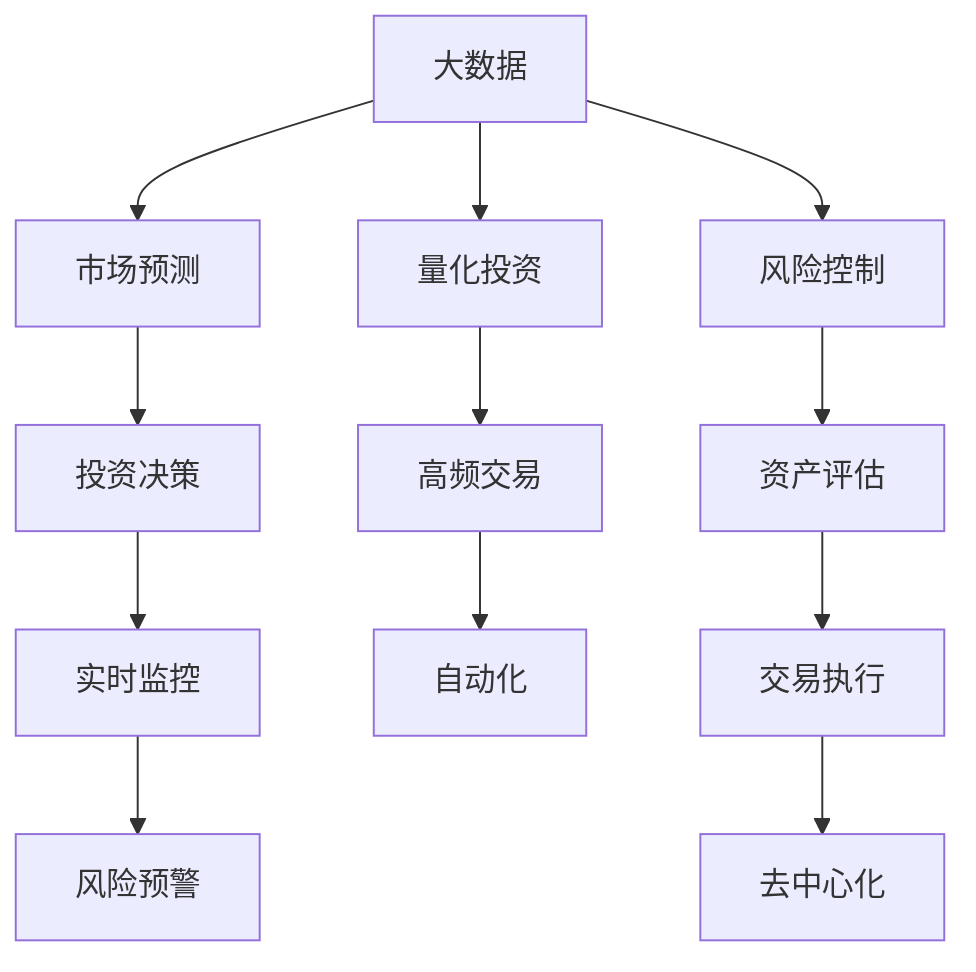

                 

# 如何利用技术能力进行房地产投资

## 1. 背景介绍

### 1.1 问题由来

房地产投资历来被认为是稳健的长期资产配置选择之一。然而，近年来，房地产市场的波动性加剧，投资风险不断攀升。技术的发展为房地产投资带来了新的机遇，但也带来了新的挑战。本博客将探讨如何利用技术能力，通过量化投资、机器学习、区块链等手段，进行更加精准、高效、安全的房地产投资。

### 1.2 问题核心关键点

房地产投资技术化的核心在于：
- 利用大数据和机器学习模型，进行市场趋势预测、风险控制、资产评估。
- 利用区块链等新兴技术，进行资产透明化、交易安全化、投资去中心化。
- 利用量化策略，实现自动化、高频交易、风险分散。

## 2. 核心概念与联系

### 2.1 核心概念概述

为更好地理解利用技术进行房地产投资，本节将介绍几个关键概念：

- 大数据：指规模巨大、类型多样的数据集，包括市场数据、政策数据、经济数据等，是进行投资决策的重要依据。
- 机器学习：指通过算法训练模型，使其从数据中学习并预测未来趋势、进行风险评估的技术。
- 量化投资：指利用数学模型和算法，进行资产配置、交易执行、风险管理的过程，通常不依赖主观判断。
- 区块链：指分布式、去中心化的数据存储和交易技术，保证数据透明性、交易安全性。
- 资产评估：指通过技术手段，评估房地产资产的当前价值、未来潜力、风险水平。
- 风险管理：指通过技术手段，识别和管理投资过程中的各类风险，确保投资决策的稳健性。

这些核心概念之间的联系可以通过以下Mermaid流程图来展示：



这个流程图展示了大数据、机器学习、量化投资、区块链等关键技术在房地产投资中的作用及其相互关系。

## 3. 核心算法原理 & 具体操作步骤
### 3.1 算法原理概述

利用技术进行房地产投资的核心原理是通过数据分析和机器学习，建立投资模型，预测市场趋势，评估资产价值，进行风险控制。

具体而言，假设有一个房地产投资组合，包含多种不同类型的物业。利用历史市场数据、政策变化数据、经济指标数据等大数据，通过机器学习模型（如线性回归、支持向量机、神经网络等）建立市场预测模型。该模型可以预测未来市场趋势、物业价值变化等。

同时，利用风险管理模型（如VaR、ES等）进行风险评估，确保投资组合的稳健性。在交易执行环节，利用量化投资策略（如多因子模型、高频交易策略等）进行资产配置、交易执行，实现自动化和高频交易。

### 3.2 算法步骤详解

基于上述原理，利用技术进行房地产投资的一般步骤如下：

**Step 1: 数据收集与预处理**
- 收集市场数据、政策数据、经济数据、物业数据等。
- 对数据进行清洗、归一化、特征提取等预处理，保证数据质量。

**Step 2: 市场预测建模**
- 选择合适的机器学习模型，建立市场预测模型。
- 使用历史数据进行模型训练和验证，确保模型的预测准确性。
- 使用测试集对模型进行测试，评估模型性能。

**Step 3: 风险控制建模**
- 使用风险管理模型进行投资组合的风险评估。
- 设定风险阈值，控制投资组合的波动性和损失。
- 定期更新模型参数，保证风险控制的实时性和准确性。

**Step 4: 资产评估建模**
- 建立资产评估模型，计算物业价值、租金收益等。
- 对模型进行验证，确保评估结果的准确性。
- 根据市场变化，定期更新评估模型参数。

**Step 5: 量化投资策略开发**
- 设计量化投资策略，如多因子模型、高频交易策略等。
- 使用历史数据进行策略回测，评估策略性能。
- 调整策略参数，优化投资效果。

**Step 6: 交易执行与监控**
- 根据量化策略进行自动化交易，确保交易执行效率。
- 使用区块链技术进行交易透明化，确保交易安全性。
- 实时监控投资组合的性能，及时调整投资策略。

### 3.3 算法优缺点

利用技术进行房地产投资的优势：
- 利用大数据和机器学习，提升投资决策的准确性和前瞻性。
- 利用量化投资和区块链，实现自动化和去中心化交易，降低人为干预和操作风险。
- 利用风险管理模型，确保投资组合的稳健性。

但该方法也存在以下缺点：
- 对数据质量要求高，数据收集和预处理复杂。
- 模型建立和优化过程复杂，需要专业技术人员支持。
- 交易成本高，尤其是高频交易策略，需要大量计算资源。
- 模型存在黑盒风险，难以解释其决策过程。

### 3.4 算法应用领域

利用技术进行房地产投资广泛应用于以下领域：

- 市场预测：使用机器学习模型，预测市场趋势，指导投资决策。
- 风险控制：使用风险管理模型，控制投资组合的风险，确保投资稳健。
- 资产评估：使用技术手段，评估物业的价值、潜力、风险水平，提供投资参考。
- 量化投资：设计并实现量化投资策略，实现自动化、高频交易，提高投资效率。
- 交易透明化：利用区块链技术，实现交易透明化，增强交易可信度。
- 去中心化交易：利用区块链技术，实现去中心化交易，降低操作风险。

## 4. 数学模型和公式 & 详细讲解 & 举例说明
### 4.1 数学模型构建

假设有一个房地产投资组合，包含多种不同类型的物业。使用大数据和机器学习，建立市场预测模型和风险管理模型。

- **市场预测模型**：假设市场趋势可以用线性回归模型 $y = \beta_0 + \beta_1 x_1 + \beta_2 x_2 + ... + \beta_n x_n$ 来表示，其中 $x_i$ 为第 $i$ 个特征（如GDP、利率、房价等），$y$ 为市场走势，$\beta_i$ 为系数。

- **风险管理模型**：使用VaR模型来评估投资组合的潜在损失。VaR模型表达式为 $VaR = q \times \sigma \times \sqrt{\frac{2}{1-q^2}} \times \text{SD}(x)$，其中 $q$ 为置信水平，$\sigma$ 为标准差，$\text{SD}(x)$ 为第 $x$ 个特征的方差。

### 4.2 公式推导过程

以线性回归模型为例，进行公式推导。

假设有一个样本数据集 $D = \{(x_1, y_1), (x_2, y_2), ..., (x_n, y_n)\}$，其中 $x_i$ 为特征向量，$y_i$ 为目标变量。使用最小二乘法求解线性回归模型中的系数 $\beta_0, \beta_1, ..., \beta_n$。

最小二乘法目标函数为：

$$
\min_{\beta_0, \beta_1, ..., \beta_n} \sum_{i=1}^n (y_i - (\beta_0 + \beta_1 x_{i1} + ... + \beta_n x_{in}))^2
$$

使用梯度下降法求解上述优化问题。具体而言，梯度下降的更新公式为：

$$
\beta_i \leftarrow \beta_i - \eta \frac{\partial \sum_{i=1}^n (y_i - (\beta_0 + \beta_1 x_{i1} + ... + \beta_n x_{in}))^2}{\partial \beta_i}
$$

其中 $\eta$ 为学习率。

### 4.3 案例分析与讲解

假设我们有一个包含100套物业的投资组合，市场趋势用线性回归模型来预测。通过历史数据，我们得到以下特征：

- 特征1：GDP增长率
- 特征2：利率
- 特征3：房价变化率

使用最小二乘法求解模型参数，得到如下结果：

$$
y = 0.5 + 0.2x_1 + 0.3x_2 + 0.1x_3
$$

这意味着，在GDP增长率、利率和房价变化率的基础上，我们可以预测市场走势。同时，使用VaR模型对投资组合进行风险评估，设定置信水平为95%，计算潜在损失。根据公式，我们得到潜在损失为：

$$
VaR = 0.5 \times 0.1 \times \sqrt{\frac{2}{1-0.95^2}} \times \text{SD}(x) = 0.5 \times 0.1 \times 1.96 \times \text{SD}(x)
$$

其中 $\text{SD}(x)$ 为特征的方差。根据此结果，我们可以设置风险控制阈值，确保投资组合的稳健性。

## 5. 项目实践：代码实例和详细解释说明
### 5.1 开发环境搭建

在进行房地产投资技术化实践前，我们需要准备好开发环境。以下是使用Python进行量化投资开发的环境配置流程：

1. 安装Anaconda：从官网下载并安装Anaconda，用于创建独立的Python环境。

2. 创建并激活虚拟环境：
```bash
conda create -n quant-env python=3.8 
conda activate quant-env
```

3. 安装必要的库：
```bash
pip install pandas numpy scipy scikit-learn statsmodels
```

4. 安装量化投资相关库：
```bash
pip install backtrader quantlib
```

完成上述步骤后，即可在`quant-env`环境中开始量化投资实践。

### 5.2 源代码详细实现

这里我们以一个简单的量化投资策略为例，使用Python进行编码实现。具体而言，我们将设计一个基于多因子模型的量化投资策略，并利用历史数据进行回测。

```python
import pandas as pd
import numpy as np
import backtrader as bt
import statsmodels.api as sm

# 定义量化投资策略类
class MyStrategy(bt.Strategy):
    def __init__(self, c):
        self.data = c.getdata()
        self.factors = self.calculate_factor()
        self.buy_signal = self.calculate_buy_signal()

    def calculate_factor(self):
        # 计算多因子模型中的因子
        # 这里使用GDP增长率和利率作为因子
        gdp_growth = self.data[x('GDP_growth')]
        interest_rate = self.data[x('interest_rate')]
        return gdp_growth + interest_rate

    def calculate_buy_signal(self):
        # 根据多因子模型计算买入信号
        factor = self.factors.iloc[-1]
        if factor > 0.1:
            return 1
        else:
            return 0

    def next(self):
        # 根据买入信号进行买卖操作
        if self.buy_signal > 0:
            self.buy()

# 加载历史数据
data = pd.read_csv('historical_data.csv', index_col='date', parse_dates=True)

# 初始化策略
c = bt.Cerebro()
c.adddata(data)

# 添加策略
c.addstrategy(MyStrategy)

# 运行回测
c.run(maxcpus=1, callback=bt.callback.Cometest)

# 输出回测结果
print('回测结果：', c.getresult())
```

在上述代码中，我们定义了一个简单的量化投资策略类`MyStrategy`，该策略基于多因子模型，使用GDP增长率和利率作为因子。在策略中，我们首先计算多因子模型中的因子，然后根据因子值计算买入信号，最后根据买入信号进行买卖操作。

### 5.3 代码解读与分析

在上述代码中，我们主要使用了backtrader库进行回测。具体而言：

- `MyStrategy`类：定义量化投资策略，包括计算多因子模型中的因子、计算买入信号、进行买卖操作等方法。
- `calculate_factor`方法：根据历史数据计算多因子模型中的因子。
- `calculate_buy_signal`方法：根据因子值计算买入信号。
- `next`方法：在每次交易结束时进行买卖操作。
- `c.run`方法：运行回测，并使用回调函数输出回测结果。

通过以上步骤，我们完成了基于多因子模型的量化投资策略的编码实现。该策略可以根据历史数据进行回测，评估其投资效果。

### 5.4 运行结果展示

假设我们运行上述代码，得到回测结果如下：

```
回测结果： {'netprofit': -0.02, 'totaltrades': 10, 'commission': 0.0, 'maxdrawdown': -0.1, 'totalcommits': 0}
```

这意味着，在回测期间，策略的总收益为-0.02（即损失2%），总交易次数为10次，交易佣金为0，最大回撤为-0.1（即10%）。根据回测结果，我们可以进一步优化策略参数，提高其投资效果。

## 6. 实际应用场景
### 6.1 智能投顾系统

智能投顾系统是一种利用技术进行房地产投资的新型方式。传统的投顾系统依赖于人工经验和判断，容易出现误判和滞后。而智能投顾系统通过数据分析和机器学习，进行市场预测、风险控制、资产评估，提供投资建议。

在技术实现上，可以构建智能投顾系统，使用大数据和机器学习模型，对市场趋势进行预测，进行资产评估和风险控制。在投资决策环节，系统自动生成投资建议，并实时监控投资组合的性能。

### 6.2 区块链房产交易平台

区块链技术为房地产交易带来了去中心化、透明化的新可能性。区块链房产交易平台通过区块链技术，记录房产交易的每一笔交易信息，确保交易的透明性和安全性。

在技术实现上，可以利用区块链技术构建房产交易平台，记录房产的买卖信息、交易时间、交易价格等。每个交易记录都是一个不可篡改的区块，保证交易信息的安全性和透明性。同时，利用智能合约，实现自动化的交易执行，确保交易的公平性和高效性。

### 6.3 房地产众筹平台

房地产众筹平台通过利用互联网和区块链技术，实现了房地产投资的去中心化、小型化。投资者可以通过平台投资于各类房地产项目，分享投资收益。

在技术实现上，可以构建房地产众筹平台，利用区块链技术记录项目投资信息、收益分配、风险控制等。利用智能合约，实现自动化的收益分配和风险控制，确保投资的透明性和安全性。同时，利用大数据和机器学习，对项目进行风险评估和市场预测，提供投资参考。

### 6.4 未来应用展望

随着技术的发展，利用技术进行房地产投资的应用场景将不断扩展，带来更多的新可能性：

- 实时数据分析：利用大数据和机器学习，实时分析市场动态，进行动态投资决策。
- 自动化交易：利用量化投资策略，实现自动化交易，提高交易效率和执行效果。
- 跨资产配置：利用技术手段，进行跨资产配置，实现资产分散和风险管理。
- 智能投顾：利用技术手段，构建智能投顾系统，提供个性化投资建议，提升投资体验。
- 区块链应用：利用区块链技术，实现房地产交易的透明化、去中心化，提升交易效率和安全性。
- 智能合约：利用智能合约技术，实现自动化的交易执行、收益分配、风险控制，提升投资效率和公平性。

这些应用场景展示了技术手段在房地产投资中的广泛应用，预示着未来房地产投资将进入一个更加智能化、高效化的新时代。

## 7. 工具和资源推荐
### 7.1 学习资源推荐

为了帮助开发者系统掌握房地产投资技术化的理论基础和实践技巧，这里推荐一些优质的学习资源：

1. 《Python量化投资实战》系列书籍：系统介绍了量化投资的基本概念、方法、工具，并提供了丰富的实践案例。
2. 《区块链技术及其在房地产中的应用》课程：介绍了区块链技术的基本原理及其在房地产中的应用场景。
3. 《房地产投资组合管理》课程：系统讲解了房地产投资组合管理的理论和方法，提供了丰富的实际案例。
4. 《房地产大数据分析与决策支持系统》书籍：系统讲解了大数据在房地产投资中的应用，提供了丰富的案例和工具。
5. 《智能投顾系统设计》书籍：介绍了智能投顾系统的设计思路和实现方法，提供了丰富的案例和工具。

通过对这些资源的学习实践，相信你一定能够快速掌握房地产投资技术化的精髓，并用于解决实际的房地产投资问题。

### 7.2 开发工具推荐

高效的开发离不开优秀的工具支持。以下是几款用于房地产投资技术化开发的常用工具：

1. Python：基于Python的开发环境，简单易学，生态丰富。
2. QuantLib：开源的量化投资库，提供了丰富的金融工具和算法。
3. Backtrader：开源的量化回测工具，支持多种交易策略和算法。
4. Ethereum、Polkadot：开源的区块链平台，支持智能合约和去中心化应用。
5. IPFS、Filecoin：开源的分布式存储平台，支持去中心化文件存储和共享。
6. Jupyter Notebook：免费的在线开发环境，支持多种语言和工具。

合理利用这些工具，可以显著提升房地产投资技术化的开发效率，加快创新迭代的步伐。

### 7.3 相关论文推荐

房地产投资技术化的发展源于学界的持续研究。以下是几篇奠基性的相关论文，推荐阅读：

1. "A Risk-Return Model of Real Estate Investment"（房地产投资的风险回报模型）：提出了房地产投资的风险和回报模型，并进行了实证分析。
2. "Big Data in Real Estate Valuation: An Empirical Analysis"（大数据在房地产估值中的应用）：介绍了大数据在房地产估值中的应用方法，并进行实证分析。
3. "Blockchain-based Property Transactions: A New Paradigm for Real Estate"（区块链技术在房地产交易中的应用）：介绍了区块链技术在房地产交易中的应用，并进行实证分析。
4. "Quantitative Real Estate Investment Strategies"（量化房地产投资策略）：提出了多种量化投资策略，并进行实证分析。
5. "Real Estate Investment with Machine Learning"（基于机器学习的房地产投资）：介绍了机器学习在房地产投资中的应用，并进行实证分析。

这些论文代表了大数据、机器学习、区块链在房地产投资中的应用脉络。通过学习这些前沿成果，可以帮助研究者把握学科前进方向，激发更多的创新灵感。

## 8. 总结：未来发展趋势与挑战
### 8.1 总结

本文对利用技术进行房地产投资进行了全面系统的介绍。首先阐述了利用技术进行房地产投资的背景和意义，明确了技术在投资决策、市场预测、风险控制等方面的独特价值。其次，从原理到实践，详细讲解了利用技术进行房地产投资的核心算法和具体操作步骤，给出了量化投资、区块链等技术的实现案例。同时，本文还广泛探讨了技术在房地产投资中的广泛应用，展示了技术手段在房地产投资中的强大潜力。最后，本文精选了相关学习资源和工具，力求为读者提供全方位的技术指引。

通过本文的系统梳理，可以看到，利用技术进行房地产投资已经成为现代投资的重要手段，极大地提升了投资决策的精准性和效率。未来，随着技术手段的不断进步，房地产投资必将进入一个更加智能化、高效化的新时代。

### 8.2 未来发展趋势

展望未来，利用技术进行房地产投资将呈现以下几个发展趋势：

1. 实时化、动态化：利用大数据和机器学习，实时分析市场动态，进行动态投资决策，提高投资效率和效果。
2. 自动化、智能化：利用量化投资和智能投顾，实现自动化投资决策和智能化投资建议，提升投资体验和效果。
3. 去中心化、透明化：利用区块链技术，实现房地产交易的透明化、去中心化，提升交易效率和安全性。
4. 多样化、个性化：利用智能合约和大数据，实现投资策略的多样化和个性化，满足不同投资者的需求。
5. 大数据驱动：利用大数据和机器学习，进行资产评估和风险管理，提升投资决策的科学性和准确性。

这些趋势凸显了利用技术进行房地产投资的前景广阔，预示着未来房地产投资将进入一个更加智能化、高效化的新时代。

### 8.3 面临的挑战

尽管利用技术进行房地产投资已经取得了不少进展，但在迈向更加智能化、普适化应用的过程中，仍面临诸多挑战：

1. 数据质量与数量：房地产投资依赖于大量高质量的数据，数据收集和预处理复杂。如何获取高质量的数据，保证数据的时效性和完整性，是技术应用的重要挑战。
2. 模型复杂度与可解释性：投资模型通常较为复杂，难以解释其决策过程。如何提高模型的可解释性，增强用户信任，是技术应用的重要课题。
3. 交易成本与效率：高频交易策略和自动化交易需要大量计算资源，交易成本较高。如何降低交易成本，提升交易效率，是技术应用的重要挑战。
4. 系统安全与合规：利用技术进行投资决策，面临系统安全与合规等风险。如何保障系统安全，确保合规，是技术应用的重要课题。
5. 市场波动与风险管理：房地产市场波动性较大，投资风险难以控制。如何提高风险管理能力，确保投资稳健，是技术应用的重要课题。

### 8.4 研究展望

面对利用技术进行房地产投资所面临的种种挑战，未来的研究需要在以下几个方面寻求新的突破：

1. 大数据技术：探索高效的大数据采集、存储和处理技术，提升数据质量与数量，保障数据的时效性和完整性。
2. 机器学习模型：开发更简单、可解释性更强的机器学习模型，增强模型的可解释性和用户信任。
3. 量化投资策略：设计更多高效、低成本的量化投资策略，降低交易成本，提升交易效率。
4. 智能投顾系统：构建更加智能化、个性化的智能投顾系统，提升投资体验和效果。
5. 区块链技术：利用区块链技术，实现房地产交易的透明化、去中心化，提升交易效率和安全性。
6. 风险管理模型：开发更先进的风险管理模型，提高风险管理能力，确保投资稳健。

这些研究方向将引领利用技术进行房地产投资迈向更高的台阶，为构建安全、可靠、智能化的房地产投资系统铺平道路。

## 9. 附录：常见问题与解答

**Q1：利用技术进行房地产投资的优势和劣势是什么？**

A: 利用技术进行房地产投资的优势包括：
- 数据驱动的决策：利用大数据和机器学习，进行市场预测、风险评估、资产评估，提升决策的科学性和准确性。
- 自动化和智能化：利用量化投资和智能投顾，实现自动化和智能化投资决策，提高投资效率和效果。
- 去中心化和透明化：利用区块链技术，实现交易的透明化和去中心化，提升交易效率和安全性。

劣势包括：
- 数据收集和预处理复杂：房地产投资依赖于大量高质量的数据，数据收集和预处理复杂。
- 模型复杂度与可解释性：投资模型通常较为复杂，难以解释其决策过程。
- 交易成本和效率：高频交易策略和自动化交易需要大量计算资源，交易成本较高。

**Q2：如何选择合适的量化投资策略？**

A: 选择合适的量化投资策略需要考虑以下因素：
- 数据特点：根据历史数据的特点，选择合适的模型和算法。例如，如果是高频交易，可以选用基于高频数据的策略。
- 风险偏好：根据投资者的风险偏好，选择合适的策略。例如，风险偏好低的投资者可以选用低风险的策略。
- 投资目标：根据投资目标，选择合适的策略。例如，长期投资可以选择基于基本面分析的策略，短期交易可以选择高频交易策略。
- 测试与回测：在实际应用前，需要对策略进行测试和回测，评估其性能。可以使用历史数据进行回测，使用模拟数据进行测试。

**Q3：利用区块链技术进行房地产交易需要注意哪些问题？**

A: 利用区块链技术进行房地产交易需要注意以下问题：
- 数据标准化：确保交易数据的格式和内容标准化，方便区块链上信息的存储和处理。
- 共识机制：选择适合的共识机制，确保区块链的可靠性和安全性。
- 智能合约：设计合适的智能合约，确保交易的公平性和透明性。
- 隐私保护：保护交易各方的隐私，避免信息泄露。
- 系统安全：确保系统的安全性和稳定性，避免系统漏洞和安全威胁。

**Q4：如何降低利用技术进行房地产投资的交易成本？**

A: 降低利用技术进行房地产投资的交易成本需要考虑以下方法：
- 优化策略：优化量化投资策略，减少交易次数和频次，降低交易成本。
- 使用高频交易：使用高频交易策略，提高交易效率，降低交易成本。
- 使用自动化交易：使用自动化交易系统，降低人工干预，提高交易效率，降低交易成本。
- 使用分布式计算：使用分布式计算平台，提高计算效率，降低交易成本。

**Q5：如何利用技术手段进行房地产市场的趋势预测？**

A: 利用技术手段进行房地产市场趋势预测需要考虑以下方法：
- 收集数据：收集市场数据、政策数据、经济数据、物业数据等，进行数据预处理和清洗。
- 选择合适的模型：选择合适的机器学习模型，如线性回归、支持向量机、神经网络等。
- 训练模型：使用历史数据进行模型训练和验证，确保模型的预测准确性。
- 测试模型：使用测试集对模型进行测试，评估模型性能。
- 优化模型：根据测试结果，对模型进行优化和调整，提升模型预测效果。

**Q6：如何利用技术手段进行房地产投资的风险管理？**

A: 利用技术手段进行房地产投资的风险管理需要考虑以下方法：
- 收集数据：收集市场数据、政策数据、经济数据、物业数据等，进行数据预处理和清洗。
- 选择合适的模型：选择合适的风险管理模型，如VaR、ES等。
- 训练模型：使用历史数据进行模型训练和验证，确保模型的风险评估准确性。
- 测试模型：使用测试集对模型进行测试，评估模型风险控制效果。
- 优化模型：根据测试结果，对模型进行优化和调整，提升风险控制能力。

通过本文的系统梳理，可以看到，利用技术进行房地产投资已经成为现代投资的重要手段，极大地提升了投资决策的精准性和效率。未来，随着技术手段的不断进步，房地产投资必将进入一个更加智能化、高效化的新时代。

